# 基础算法和数据结构

## 1. 关于树


### 1.1. 基本二叉树
二叉树的定义


二叉搜索树或者叫做二叉查找树，是特殊类型的二叉树，核心性质是这个


因此，
二叉搜索树的关键字key必须是可比较的；
中序遍历二叉搜索树可以把关键字从小到大排序，
二叉搜索树的关键字如果是[key-value]对，那么就可以支持排序字典Dictionary了
最小元素从根往左子树那边找，找到叶子；最大元素就是从根往右子树那边找，找到叶子；
搜索某个key对应的节点是很快的，因此key是排序的，因此查找复杂度只和树的高度有关，每次查找都排除掉一个树，所有很快；
插入和删除在不同变种的二叉搜索树中都比较复杂，需要各种旋转来使树的性质得到保持；
查找前驱和后继


这里说一下查找前驱和后继
这个是查找后继

这个针对右子树是NIL的情况；


二叉搜索树的性能；


二叉搜索树的旋转操作解析
左旋和右旋，这个保持二叉树的排序性质的不变；


普通二叉搜索树的插入
插入很简单，就是一次二叉搜索的过程，根据所要插入的z，找到最底层的叶子节点，这个位置就是新节点z的位置，运行时间是O(h)


普通二叉搜索树的删除，其中，需要删除的是z
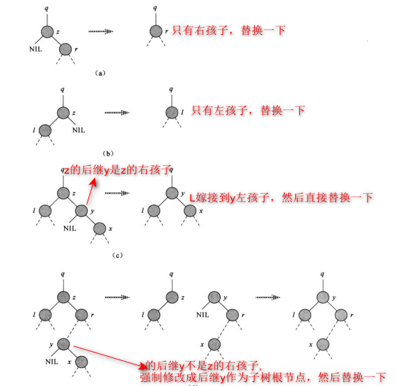


总结下
关于普通二叉搜索树的性能，其中树高h和树总节点n的关系是无法确定的，因此树可能不会平衡，没有任何规律，最坏情况是链表；
删除的性能，首先找到删除的节点，这个最多需要O(h)，然后执行常数时间的旋转和子树替换；基本都是O(h)时间把！


### 1.2. AVL树
二叉搜索树有很多变种
这个是AVL树，


### 1.3. 红黑树

首先看看红黑树核心作用是保证基本操作复杂度是大O lgn；
这是因为二叉搜索树，如果普通的插入和删除大量进行的时候，树就是不平衡，出现一边高一边低的情况；
而基本操作都和树的高度有关，因此性能就会下降，
所以所有平衡树方案都是保证在插入和删除之后，树的高度仍然保持平衡；


红黑树基本性质
简单总结为4个重要性质：根黑，叶黑，双亲红孩子黑。黑高相同；


关于黑高的一个引理，这个解析了随着红黑树节点n的增加，树高为O(lgn)；这就表明红黑树是平衡的二叉搜索树；


#### 1.3.1. 红黑树的插入和修复

插入没什么好说的，就是像普通二叉搜索树一样插入，只不过需要把新插入的节点着成红色。
插入性能：O(logN)


qq：为甚要着成红色？
因为着成红色不会引起黑高的变化，只会违反双亲红孩子黑的红黑性质；

下面是红黑树插入的修复：
如何进行插入后的修复，3种情况慢慢看吧，其中插入的是4，
注意，每一次插入都可能是其中一种情况。
如果是情况1，那么情况1可能需要n次循环（着色）才能转化成情况2，需要时间O(logN)
情况2的话可以直接转化到情况3，然后情况3的话可以直接执行一次着色和旋转就解决了


插入后修复的性能：主要是情况1需要O(logN)时间，但是一旦变成情况2或者情况3，就是常数时间了；
每次插入后修复会进行会进行有限次O(h)的着色和不超过2次的旋转；


#### 1.3.2. 红黑树的删除和修复


#### 1.3.3. 其他


### 1.4. 关于二叉树的各种问题

遍历的问题：


## 2. 散列表


解决冲突的两个方法
### 2.1. 链表法


### 2.2. 开放寻址法


## 3. 7种排序
C++Base_Pratice中看看；
主要有排插入序，冒泡排序，堆排序，快速排序，归并排序，哈希排序，

### 3.1. 插入排序
这个可以从打牌来联想
这个优化的方法是不要交换元素，而是用backCopy的方式，这样效率就会提高；
真正是在arr[j] = temp才真正是交换元素，第二个循环就是用backCopy把不满足的元素位置后移；


C++实现


算法复杂度是多少？


### 3.2. 冒泡排序

举个例子：从小到达排序
2，5，16，8，7，30，12

红色表示进行了一次交换

第一趟，把最大值30放到了最后面


第二趟：把次大值16放到后面


第三趟，虽然剩下的2到12都已经排好序了，但是仍然需要处理一遍；

剩下N趟也是一样；

图解一下：


总结下：从一个集合中A[0..n-1]，先把最大元素冒到最后[n-1]处，然后把第二大元素的冒到[n-2]处，以此类推，
经过（n-1）趟冒泡处理，最终实现从A[0..n-1]是排序；

或者从算法导论这里解析，从一个集合中A[0..n-1]，始终维持一个循环不等式A[0~i],
A[0~i]经过每一趟处理后，新的子子数组A[0~i+1]也是排好序的,当i不断增加到n-2时候，排序完成；
假设A[0~i]是排序好的，每一趟的处理就是从逆向数组A[(n-1)~(i+1)]冒泡一次，使得A[0~i+1]是排序好的；循环不等式保持不变；
这个算法导论的伪代码假设了数组是从1开始索引的；


复杂度：
qq:为什么最好情况是O(N)?
如果代码用了一个flag来标记，在某一趟时候，完全不需要交换，那么就是已经排序好了，可以直接退出；
所以最好情况是完全不需要交换的情况，此时复杂度是线性；


### 3.3. 快速排序


PARTITION过程称为原址重排，这里基元选择了A[r]也就是最后一个；


还有一个叫做HOARE-PARTITION，它又两个指针，一个指向头，一个指向尾这样来划分的；


快速排序最坏情况，
最好情况，


快速排序可以有很多优化：
1：全部是相同元素时候，需要做一些判断，主元q选择
2：选择主元可以开头，中间，结尾取一个中间大的；三数取中划分
3：随机抽样划分
4：尾递归优化
5：快速排序非递归版本


关于快速排序的稳定性：
快速排序是不稳定的，


如果需要稳定排序，就需要插入或者归并排序；


### 3.4. 堆排序
这里不讨论，看后面专门讨论


### 3.5. 归并排序

分治思想
最重要是合并Merge过程，把两个有序数组合并称为一个数组，
注意，Merge过程必须要用到额外的数组空间，需要new两个数组的；Merge过程需要线性的时间和空间复杂度；


### 3.6. 希尔排序

希尔排序其实就是插入排序的增强版本；


选择一个gap序列，最后gap为1时候就是插入排序了；


### 3.7. 选择排序
这个是最慢了，每次选择一个最大或者最小的放到后面，任何情况下都是O(n平方)复杂度
和冒泡排序差不多，都是最慢的算法；


### 3.8. 排序总结


关于稳定性排序：
冒泡排序，选择排序，还有插入排序都是稳定的；
快速排序和堆排序都是不稳定的；

至于为什么冒泡是稳定，是因为它用了一种携带冒泡这样的技能，携带最大的冒泡到最后面，因此不会改变次序；


## 4. 二叉堆，优先队列，堆排序

满二叉树：


完全二叉树：
可以有多个定义，但是差不多，不过从满二叉树演变过来这个定义最好理解；


二叉堆：一个近似的完全二叉树
但是二叉堆形式上具有完全二叉树的结构，但是还需要符合一定的性质才叫二叉堆，比如最大堆和最小堆性质


最大堆和最小堆性质
注意是大于等于或者小于等于；


二叉堆数据结构的重要方法：


重点关注下MAX-HEAPIFY(A,i)这个维护堆性质的方法，这个方法是针对节点i的，复杂度是O(n);
使用的技巧是"下滤"
但是这个方法不能保证节点4所在的子树完全保证最大堆性质，仅仅是下滤的那个节点所经过的子树可以保持最大堆性质；
比如下面节点5这个子树就没有保持最大堆性质了；


因此，从一个无序数组构建一个二叉堆，必须所有子树都要进行MAX-HEAPIFY(A,i)过程；
这里重要是，叶子平凡地具有最大堆性质了，因此不需要对叶子调用MAX-HEAPIFY(A,i)；
只需要对内部节点调用MAX-HEAPIFY(A,i)即可


这里有一个二叉堆或者完全二叉树的重要定理：
这个很容易证明，因为最后一层的叶子节点数 = 内部节点数+1；
因此最小的叶子节点序号肯定是[n/2]左右的；


那么从无序数组建一个二叉堆就容易了；
复杂度O(nlgN)


最后看看堆排序，
首先具体在数组进行实现的话是需要一些重构技巧的；
最简单的版本是，对A[1~n]建堆，那么A[1]最大了，抽出来为a
然后对A[2~n]抽出来建堆，那么A[2]就是次大了，抽出来为b,
一直进行到A[[n-1]~n],那么最后两个数分别是A[n-1]和A[n];
这样就是最简单的思想；
但是BuildHeap是一个O(nlgn)的过程，比较费时，这样总消耗就是O(n*nlgn);

这个就是典型的"下滤"技巧来处理，这样堆排序就不用调用BuildHeap了
因此最大堆A的A[1]就是最大的元素了，我把它抽出来和A[n]叶子交换，
此时只需要考虑A[1~n-1],这个数组由于A[1]破坏了堆性质，而且只有一个节点破坏了这个性质，因此进行一次MAX-HEAPIFY(A,1)
就实现A[1~n-1]又是一个二叉堆；因此又把A[1]和A[n-1]交换，一直进行下去；
其实就是由于MAX-HEAPIFY(A,1)恢复了堆性质后，就把这个最大值交换到后面而已；


qq：堆排序是稳定的吗？
不是稳定的，
主要是涉及到堆顶和堆尾部交换，这个交换到导致相对位置发生变化；


qq：关于优先队列
可以INCREASE-KEY过程会引发对应节点MAX-HEAPIFY(A,1)调用，线性时间复杂度；


## 5. 单源最短路径

### 5.1. Dijkstra算法
English:/ˈdaɪkstrə/
带权重的有向图上单源最短路径，所有权重都是非负值
w为权重函数，w(u,v)表示某个边的权重，s为源节点；
qq：负值的就不能用Dijkstra？


这里的RELAX表示松弛操作，其实就是更新边的信息


初始化每个节点的信息
v.d表示s到v的最短路径估计；这个最短路径估计运行时会发生变化的；


采用贪心策略，虽然贪心策略可能不会产生最优结果，但是对于Dijkstra算法·，因为有松弛操作这个东西，可以动态地更新边，更新距离信息，
因此最后这些距离会被更新到最短距离；
和A*有一半的原理都是相同的；
A*也是贪婪策略；


## 6. 图算法
无向图表示


有向图表示


### 6.1. 广度优先BFS
对比一下A*，BFS是没有启发式的，它是瞎搜索，它只是从源起点向外不断寻找，累加路径而已；
这个是无向图的BFS；


时间复杂度：和图G的顶点数和边数的一个线性函数；


qq：BFS算法为什么可以找到s到v的最短路径？
有严格的证明过程的；


### 6.2. 深度优先DFS
DepthFirstSearch


没啥难度了；


## 7. 其他


# JavaScript研究

qq：如何调试js？配置这个即可！


## 1. es5和es6

ES5全称ECMAScript5，即 ES5，是ECMAScripts的第五次修订（第四版因为过于复杂废弃了），又称ECMAScript2009，于 2009 年完成标准化。

ES6， 全称 ECMAScript 6.0 ，即 ES6，是ECMAScripts的第六次修订，又称 ES2015，于2015年06 月发版，是 JavaScript 的下一个版本标准。
ES6 主要是为了解决 ES5 的先天不足，目前浏览器的 JavaScript 是 ES5 版本，大多数高版本的浏览器也支持 ES6，不过只实现了 ES6 的部分特性和功能。


ES5的特性：


es6的很多特性。


比较重要的是promise，


## 2. JavaScript内存详解&分析指南

qq：原始类型的string和引用类型的string有什么不同


有点类似于C#的值类型和引用类型的区别


关于这个原始值，对于字符串有点耗费啊，字符串也是不可变的；


对象的比较是引用比较，和C# Object.ReferenceEqual一样


js的GC：
可达性这个概念，C#的GC是引用跟踪算法，也有这方面的概念；


V8引擎使用三色标记法来进行GC，稍微了解以后再看


增量标记


qq：动态增删对象属性引起性能问题？


## 3. 类型，值和变量
类型分为原始类型和对象类型，这里特备注意，
string和Stirng，number和Number，boolean和Boolean分别表示字符串，数字，布尔值在原始类型和对象类型中的表示；
调用字面值的方法，比如"ff".substring(..)可以理解为构造了一个String的引用对象；


关于数字，算数运算看一下
和lua一样，也是不区分整数和浮点数，所有数字都是用浮点数表示


关于数字的下溢，被0除问题：
这也太顶了；


判断一个变量是不是NaN
可以用x != x来判断，或者使用函数isNaN来判断；


关于浮点数的问题，不同机器上，浮点数不能被精确表示，而且数值也会不一样，关于浮点数的相等判断需要用专门的函数
比如


日期的时间的API：


null和undefined


关于全局对象
这些不是ECMAScript APIs的API吗？


关于字符串
js引擎内置了不少功能，比如字符串连接


其他的字符串方法：


模式匹配比较重要，也经常用，RegExp


注意，字符串的很多方法，返回的是一个新的字符串对象；


关于布尔值：
if(o) ..和if(o !==null)..的不同
前面表示对象o只要不是false或者任何假值（null，undefined）它就可以执行这个if；

后面则是严格不等于null才进入执行；


这个所谓的包装对象，其实有点类似于C#的装箱对象，只不过C#的装箱对象没有确切的类型；


特别注意这个包装对象，字符串，布尔值，数字是只读的；


关于类型转换：
这里比较重要的是其他类型值转为布尔值；在if语句中比较重要，这里是基本总结


显式类型转换


数字到字符串的转换
数字到各个进制的字符串转换

浮点数的话，不能用toString了，用其他；


字符串到数字
parseInt()函数：只解析整数
parseFloat()函数：只解析整数和浮点数


对象到字符串
这些太顶了


对象到数字的表示valueof


对象到字符串的转换流程：


对象到数字的转换流程：


关于变量的声明这里注意一下：
js只有函数作用域：
这种特性称为提前声明，就好像j和k是在函数最前面声明的一样；


关于全局变量和全局对象的属性


## 4. js闭包
其实就是返回一个function，然后这个function引用外部函数的变量；


作用域链
当查找变量的时候，会先从当前上下文的变量对象中查找，如果没有找到，就会从父级(词法层面上的父级)执行上下文的变量对象中查找，一直找到全局上下文的变量对象，也就是全局对象。这样由多个执行上下文的变量对象构成的链表就叫做作用域链。


a先在当前作用域bar函数中找，没有，则向父级作用域fn中找，没有，再向上找到全局作用域，var a = 10，获取到a；
b先在当前作用域bar函数中找，没有，则向父级作用域fn中找，得到b的值20，所以a+b = 30
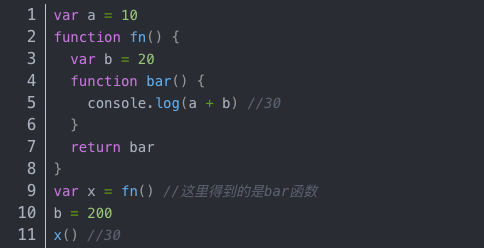


关于立即调用的函数表达式，比如这种，只能执行一次，就不能继续调用了；
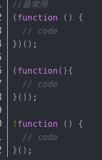
没有名字的立即执行的函数
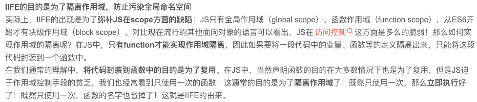


 闭包看那篇博客写得很好，具体讲的闭包的严格意义的闭包，必须具有访问自由变量的闭包；


注意下这个；
a的值如果当前的作用域没有，往上找，还是找不到，在全局作用域也找不到，就报错了；


看看，全局对象如果引用闭包，就会出问题
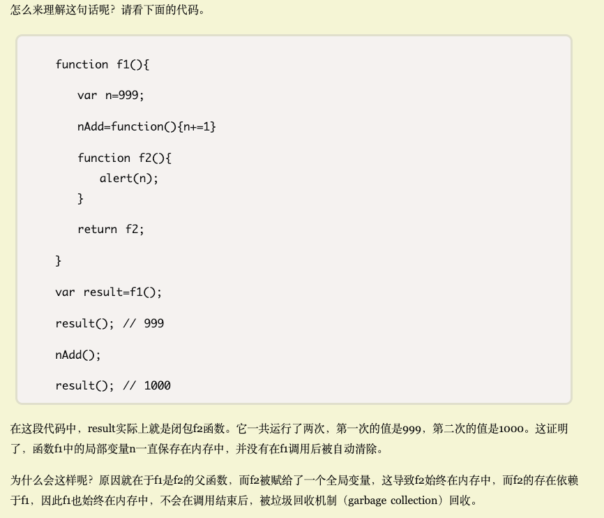


## 5. Js执行过程

注意这个变量环境和词法环境
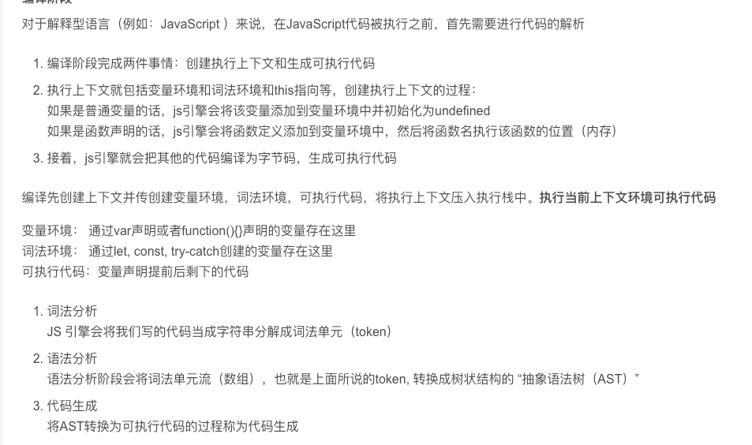


es6引入块级作用域，引入了词法环境。

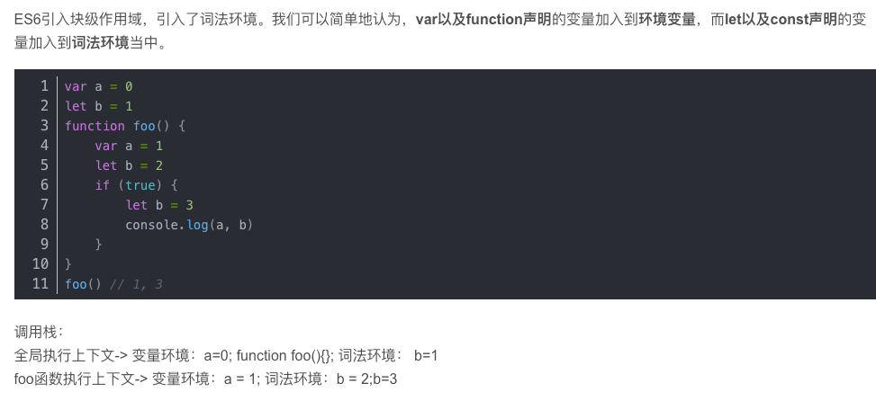


## 6. Js执行上下文


变量提升的原理：


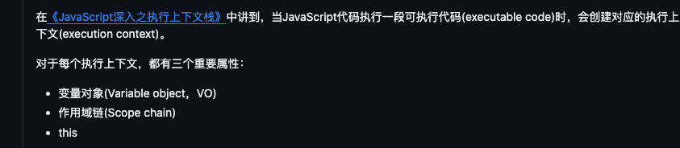


## 7. js的变量提升和let


var和let的区别而已


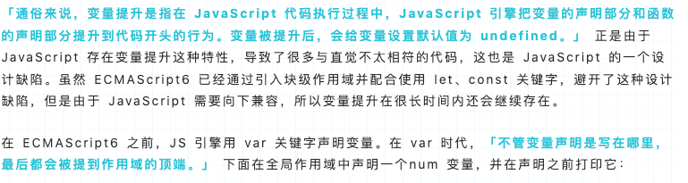


变量提升导致的问题：
变量被覆盖，以为showName在创建函数上下文之后就存在name了；直接访问name就是undefined；

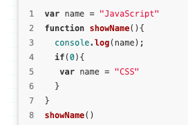

for循环中的问题：
在创建foo的执行上下文时候，i存在；
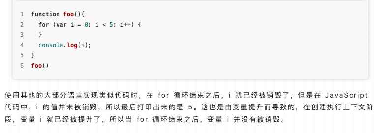


let的原理
主要是引入变量环境和词法环境，这个变量环境也就是变量对象


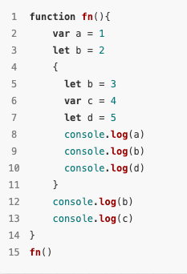


函数未执行前，创建上下文如下：
通过 var 声明的变量，在编译阶段会被存放到变量环境中。
通过 let 声明的变量，在编译阶段会被存放到词法环境中。
在函数作用域内部，通过 let 声明的变量并没有被存放到词法环境中。
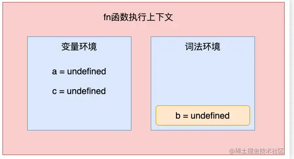


执行到let d  = 5之后，
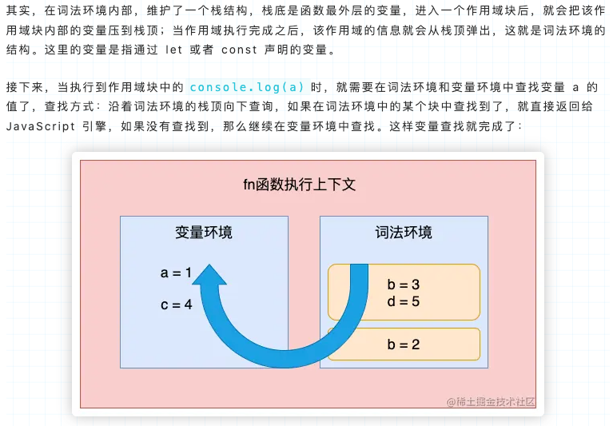


离开块作用域之后
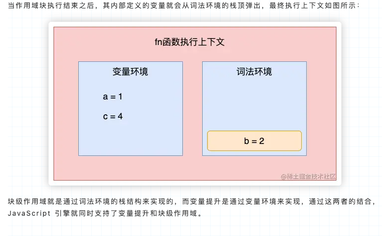


很好理解。。


暂时性死区：
注意是在块作用域之内的；这里其实就是js引擎禁止你在let声明之前使用它；就是不能像使用var一样使用let；
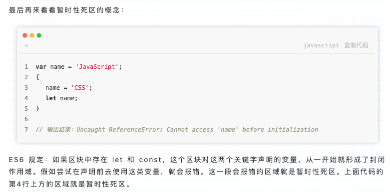


这里注意，
ES5中，js的函数也会进行变量提升


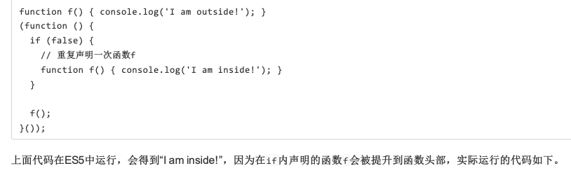


但是在ES6中，不会
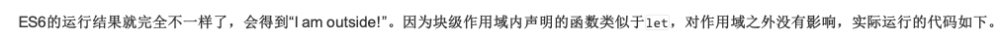


## 8. js的继承


这里主要看js的寄生组合继承

它其实就是通过一个中间对象实现继承；
 child实例.__proto__为Child.prototype也就是中间对象
 中间对象.__proto__为Parent.prototype
 从而可以访问到parent的属性；
 同时这个中间对象的constructor是Child；
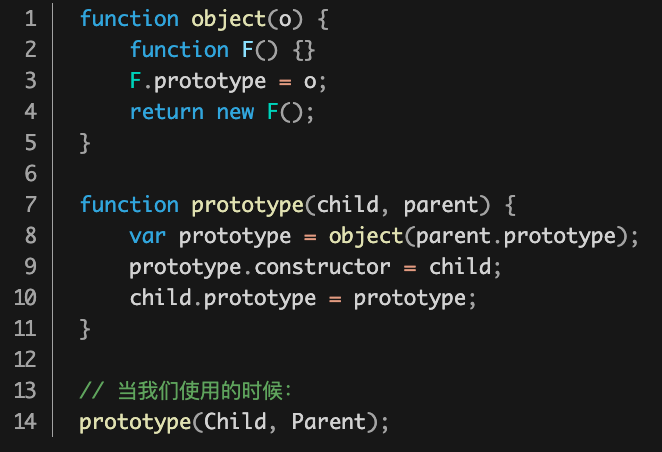


## 9. 表达式和运算符

对象和数组的初始化表达式


对象创建表达式
必须用new


常用的运算符看看
typeof是一个运算符，可以对any类型进行，返回一个字符串；
instanceof是运算符，测试对象类；
in用于测试属性是否存在


特别注意那个逗号运算符；
qq：网上看看；


位运算符也比较常用


恒等===和==的区别，区别很大
===不会进行任何转换的；


==会进行不少转换，对null和undefined会判定相等


in运算符


instanceof的工作原理，先理解一下原型链这个东西


### 9.1. 关于this的理解

默认绑定，也就是this.a所在的函数如果有"use strict",这个this.a才会绑定到全局对象window


隐式绑定：


注意这种情况，你直接把某个函数抽出来调用，this 绑定到全局的；


回调函数丢失this绑定的情况，这是参数传递过程中导致的this绑定丢失，可以手动用bind来绑定


这里注意下，obj.foo.bind(obj)返回一个硬绑定的包装函数，这个包装函数是个闭包，引用外部的变量；
这个bind的实现可以看成是这样：
function bind(fn, obj) {
    return function() {
        return fn.apply( obj, arguments );
    }
}


API的调用上下文：


手动构造一个new；
这里注意，arguments是"类数组"；可以用数组的方法，但是必须这样用；shift 会修改原数组
设置隐式原型，这里new返回的要么是一个新对象，要么是构造器里面返回的对象（优先）；


new构造对象的this始终是一个新对象，构造器怎么硬绑定都是这种情况，
但是可以绑定其他参数；


注意，test构造器里面的代码，执行情况可以分为直接执行或者new执行；
对应的this是不一样的；
apply不指明调用对象，那么默认就是全局对象；


## 10. 语句


    


## 11. 对象


如何创建对象？

用new来初始化也可以的；


对象原型


如何查询对象的属性？
js这个对象已经是一个字典了，或者说了散列表；


inherit函数：通过原型继承创建一个函数


Object.create()是es5定义的静态函数，
Object.create(param1,param2):,第一个参数是对象原型，第二个参数


这个原型链其实就是相当于Lua的元方法；


也就是说c.r访问的是自己c.r不是unitcircle.r;


如何删除属性？
delete运算符号


检测属性；

in是检测自有或者继承都是了


hasOwnProperty只检测自有属性；


这是！==和！=的区别；
if(o.x)o.x*=2  也就是说undefined，null,false,"",0,NaN这些可以转化为false；
！==表示严格不等，严格判断undefined和null；
!=一般性不等，也即是o.x!=null,如果o.x是undefined也是没问题的；


枚举属性


如果不是自有属性就跳过，如果不是function类型就跳过；


getter属性和setter属性，存储器属性


存储器属性可以继承而来的


属性的特性


对象的每个属性都有一个属性描述符


defineProperty来定义一个属性，同时定义这个属性对应的属性描述符；


数据属性可以修改为存储器属性getter，setter；


对象的原型属性：
监测对象p是否是对象o的原型对象；


定义在Object.prototype里面的对象方法

第一个是toString


## 12. 数组


### 12.1. API使用
数组也是对象，它继承自Array.prototype;

创建数组


o[1]其实就是o["1"]


下面是关于稠密数组和稀疏数组的；


数组的一些API
push：末尾增加元素
pop：
unshift：数组首部插入元素，其他元素移到更高索引
shift：数组首部删除一个元素，其他元素移到更地索引
splice方法：插入删除和替换；
join方法：


reverse方法：


sort方法：


判断式排序一个数组：


concat方法：返回一个新数组


slice方法：注意-1表示最后一个元素，-3表示倒数第三个元素；


reduce方法：


稠密数组如何遍历？
这个代码需要优化，length每次查询消耗性能


数组forEach方法：


indexOf


稀疏数组需要这样：


===表示严格等于


js的多维数组：
对象的对象而已；


a = a || []


### 12.2. 其他问题


数组与伪数组区别


比如js内置对象arguments


对象没有索引？


## 13. 函数
函数也是对象，和其他js对象没什么不同；
闭包其实就是函数以及它所引用的各种变量；这个其实和Lua的upvalue类似；


特别看看函数调用，特别关注call方法好apply方法：


本质上的上下文切换而已！this本身是全局对象，现在变成指定的object；


函数也可以被new出来；如果函数被new出来了，那么函数里面的this指针指向这个cat对象，这里最主要作用是实现继承；


bind方法：
把函数绑定到某个对象，一个闭包的this就是这个闭包所绑定的对象；


函数式编程：


instanceof运算符：


## 14. 类和模块


## 15. 原型相关

好图。。


先总结下：
qq：是不是意味着OO中的类，对应于js中的构造函数？


对于实例，从constructor属性中可以得到构造自己的构造函数是什么，从proto属性中可以知道自己能继承的属性是什么；
这里注意person1.constructor和Person.prototype.constructor都指向构造函数，也就是由普通对象和原型对象都可以知道构造函数在哪里；
原型对象是一个普通对象，不是函数对象；
qq：这个隐式原型__proto__是否可以改成自己定义的任意的对象？
不能，因为用构造器new出一个普通对象后，js自动帮你做很多事情的，比如初始化隐式原型__proto__，这个普通对象自己没法访问；


目前大概理解到这一层，
下面这个就很好懂了，构造器的prototype自己去设置，这也是用于实现继承；


原型链概况，原型链本质上是用来实现继承的；
原型链的形成靠的是_proto_属性；
不管是普通对象还是函数对象，都可以具有__proto__这个隐式原型，__proto__指明与之关联的原型对象
下面那个浏览器经常出现，{{Prototype}} 其实就是__proto__这个隐式原型


看看这几个原型链的问题
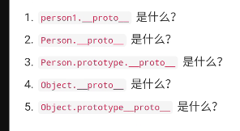


下面Number，Boolean，String，Object，Array，RegExp，Error，Data，还有任何自定义的function都叫做构造器；
他们都是由Function构造器构造的，而Function构造器又是自己构造自己；
Object构造器成为根构造器，用于构造所有普通对象，
Function构造器是函数构造器，用于构造所有函数对象；


构造器的prototype，除了Function.prototype,其他全部都是普通对象类型；


这里就是，任何内置或者自定义的function的__proto__首先指向Function.prototype,表示这些构造器具有函数特性，可以new；
Function.prototype.__proto__又指向Object.prototype,表示这些内置或者自定义的function又是普通js对象；


内置构造器和自定义构造器

这里__proto__和prototype区分下，__proto__表示隐式原型；prototype表示原型对象

这里链接就是原型链的链条链接；


先自行思考各种问题把：


Function.prototype === Function.__proto__的问题


从这个图来理解
这里要知道，根构造器可以创建出各种自定义或者内置构造器，自定义或者内置构造器才构造出普通对象
普通对象的原型链式：


Object是一个构造函数，构造函数也是函数


qq：js的引用类型中，function类型和object类型有什么本质区别？
function类型和object类型都是对象，对象可以看做是具有散列表特性的集合；

function对象的特点是代表一段js代码，可以被调用，而且function对象如果引用外部域变量，则变成一个闭包了；
比如function有call和apply这种属性来调用自己的js代码，而object对象是没有的

function对象可以通过new来产生一个object对象，比如上面的Person，这个时候在函数体内用this来初始化这个新的obejct对象，
也即是this指向的就是这个新的object对象，另外，js引擎会帮你初始化这个新的object对象的constructor属性和隐式原型__proto__属性
constructor属性指向Person，它代表这个新的obejct对象是被创建自Person这个function对象
隐式原型__proto__指向Person.prototype这个object类型对象；表示这个object类型对象继承的属性；
因为构造出来的object对象是继承原型对象的属性，为了实现OO，因此原型对象一般放类的实例方法；而类的静态方法需要放在类中，比如Person.staticProperty = ..


另外，Person也是有__proto__的,Person构造器由Function构造器构造，它继承Function.prototype的属性；
Person.__proto__ === Function.prototype，
而Function.prototype具有很多字段：length，call，apply，bind，
所有function类型对象的隐式原型都是Function.prototype，都继承了这些方法；

Function.prototype是一个function类型对象而不是object类型对象，它是一个空函数
Function.prototype.__proto__ === Obejct.prototype,这里function对象继承了object对象的各种属性，因此才会有toString这些方法
Obejct.prototype.__proto__ === null;这个是原型链的最顶层了；
所以无论是普通对象，还是函数对象，原型链都会链接到 Obejct.prototype，Obejct.prototype称为根原型对象把；


再说说关于js的内置构造器和Function的关系
Object，Array，Function，String，Date，RegExp，Error
这些构造器都是functino类型对象；
所以自定义的function对象可以看做是new Function("x","return x*x;")来创建的，这里注意，为什么new Function(XX)不是返回object对象而是function对象？
这是因为返回的新对象的__proto__被设置成了新对象construtor的prototype;也就是Function.prototype
又因为Function.prototype是唯一一个function对象，因此决定new Function(XX)返回的是对象是function对象；
Function.prototyp定义了很多方法如bind，call之类的


这里更加明白了，
obejct对象和function对象的本质不同是
obejct对象的隐式原型__proto__一定是object对象,而且顺着原型链会达到Obejct.prototype；
function对象的隐式原型__proto__一定是Function.prototype；
Function.prototype.__proto__ == Obejct.prototype，这个是function对象和obejct对象产生关系的关键；


qq：Object.__proto__和Obejct.prototype的区别和理解


Object.prototype是对象字面值，new创建的对象的原型
Array.prototype是数组的原型；Array.prototype继承于Object.prototype

注意，没有原型的对象是Object.prototype，它是其中之一；

原型链的概念也出来了

Object.create(Obejct.prototype)和{},new Object()是三种创建对象的方式是等价的；
第一种可以指明所创建出来的普通对象使用Obejct.prototype作为原型对象，
而{}默认也是使用Obejct.prototype作为原型对象；
但是如果不指明，那么用原型对象是null，那么这个普通对象的很多方法没法使用了，


没有Object.create时候如何实现继承？这样实现


看看第九章：

第一版的range
可以把range.methods看做一个类，range看做一个工厂函数，然后range(1,3)表示返回一个对象实例，继承于range.methods类；
然后这个实例可以调用这些类的方法了，这里对象实例的原型就是range.methods
另外，原型range.methods的foreach函数里面的this指代这个对象实例？


第二个版本的Range
这里，函数Range看做类的构造函数，Range.prototype表示类方法，同时Range这个命名表明了类名；
对象的字段初始化写在构造函数里面；
qq：Range构造函数的this表示什么？
表示新创建的普通对象本身；
qq：Range.prototype里面的各个function的this表示什么？
比如，r.includes(2)会访问到r.__proto__["includes"]字段，它为一个function，
因此相当于调用r.__proto__["includes"].apply(r,2)；调用对象转换成了r；


函数对象X的原型对象的constructor属性就是对象X；
这个的话，类的构造函数就是函数对象X


这样，js是如何模拟OO的类方法(static方法)，类字段(static字段)，实例方法，实例字段

原型对象模拟了实例方法，类字段；
构造函数对象，比如上面的Range，模拟了类名，类字段，类方法，所有对象都可以共享；


这个是extends函数


快速定义一个类的方法；


看看Complex.js如何模拟OO，这是复数
Complex是一个函数对象，它的函数部分是作为一个构造语义存在的，对象则放类方法


rototype里面放各然后再Complex.p种function就可以了
比如说add方法，


这些可以理解为类的特殊值


类的扩充：
这个Number？


## 16. js的事件循环


关于Promise的理解：
Promise的状态：Pengding，Resolve，Rejected；


new一个Promise会立即执行；


Promise的then方法,注意，promise.then(succCallBack,failCallBack,moveCallback)这段代码表示，这个promise的成功执行后（变成fullfilled）的回调是succCallback
then返回值一样是一个promise,注意，then仅仅是指定3个回调而已，执行then它不会同步执行回调代码


Google中实践了一下，的确是先输出Promise<{pending}>,再输出helloworld；
首先定义一个greet闭包，并不会执行这个闭包里面的代码的！
然后定义一个变量p，p的值为greet().then(XX),是一个promise；
greet()会被执行，然后greet返回一个已经fullfilled状态的promiseA，fullfillResult是"helloworld";
promiseA.then(XX)继续执行，由于promiseA已经是fullfilled状态，因此执行的then会立即加到微任务队列；


看看这里，如果promiseA不是fullfilled状态而是pending状态，


newPromise的那个promise必须由resolve来驱动才可以转向成功；
then(succCallBack,failCallBack,moveCallback)返回的promise


现在知道了，

构造一个Promise，在promise的构造函数中传给这个promise的function会同步地立即执行，resolve和reject由js引擎传进去；
这个resolve可以理解为具体关联了这个promise实例的；


resolve函数究竟怎么实现的？resolve(1);究竟发生了什么？
resolve总所周知它是关联一个promise的，执行后promise的状态会变成fullfiled，然后查看这个promise是否指定了then回调，如果没有，啥也不做；
如果有，把这个then回调

function greet () {
  var promise = new Promise (function(resolve, reject){
    var greet = "hello world"
    resolve(greet)
  })
  return promise
}
var p0 = greet();
var p = p0.then(v => {
  console.log(v)  // hello world
  setTimeout(()=>{console.log(p)},100000)
})
console.log(p0)  // Promise { <fullfilled> }
console.log(p)  // Promise { <pending> }


qq：then返回的promise和new一个promise什么区别？
为什么new一个promise传进去的function必须用resolve才可以让这个promise变成fullfilled，


qq：then执行的succ_callback为什么需要用return？


then ... catch

cathc具体用法：


finally用法：


promise.all用法，也比较常用，所有promise都变成resolve，才执行回调


promise.race:其中一个promise被fullfilled之后就执行回调；以快为准，回调参数是快的那个promise的result；


promise.any:


看看MyPromise是怎么去实现的！


宏任务和微任务的定义：
我自己的理解把，微任务是包含对promise.then回调的一个封装体，还包括调用参数


例子：


p.then(XX)执行后，就把回调放到微任务队列里面去；


这个例子有点奇怪
resolve(1)会发生什么？而且把promise状态设置成fullfilled，fullfilledResult是1，此时还没有把then回调放进去微任务队列，
然后最内的promise执行完了，而且状态是fullfilled，这时它的then回调才会被放进去微任务队列，然后最外面的promise也执行完了，而且状态也是fullfilled，
所以第二个then回调放到微任务队列；


关于this


如何实现继承，用es5实现继承，原型链


闭包的作用


## 17. js严格模式

如果将"use strict";指令添加到 JavaScript 程序的第一行，则表示整个脚本都会处于严格模式。如果在函数的第一行代码中添加"use strict";，则表示只在该函数中启用严格模式。

不允许使用未声明的变量
不允许删除变量或函数
函数中不允许有同名的参数
eval 语句的作用域是独立的
不允许使用 with 语句
不允许写入只读属性
不允许使用八进制数
不能在 if 语句中声明函数

禁止使用 this 表示全局对象


## 18. js各种问题


qq：lib.es5.d.ts是什么意思？声明文件？


js的arguments对象：
arguments是一个对象
arguments转数组


不要把arguments进行泄露，不然V8不会进行优化。


## 19. es6研究


首先是块级作用域，
比如for的{..},if,else的{}，还有自定义的{}，都是块级作用域


另外还有一个函数声明的在es5和es6中有区别：
es5中，不能在if中声明；但是可以这样写var f = function(){..}来创建闭包
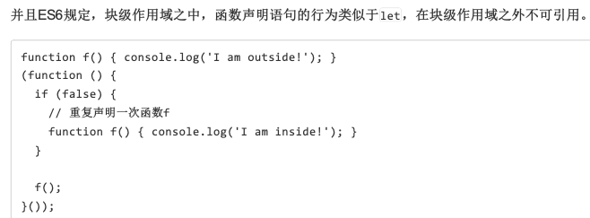


const：
const用于普通对象，表示地址不变，但是数据可能变
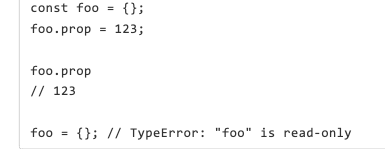


let和var在全局属性上的不同，let没法声明全局属性
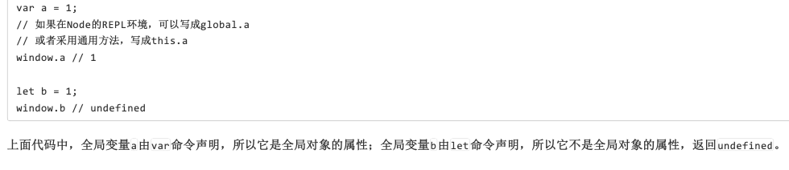


数组和对象的解构赋值：


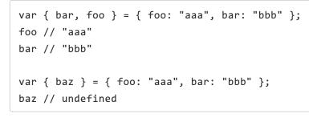


函数参数解构赋值：
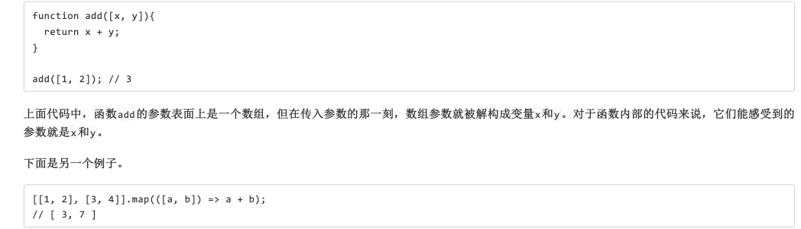


let ...of是用来访问数组的；
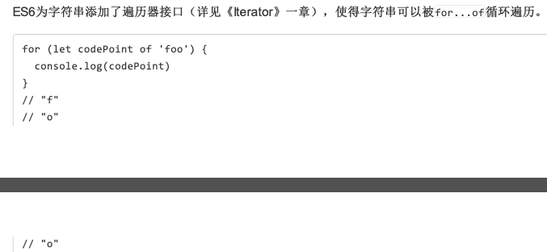

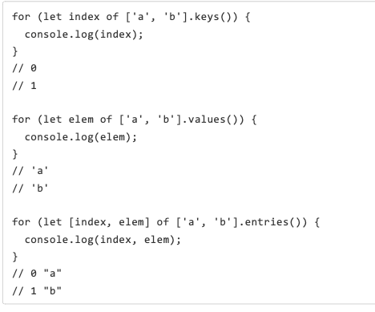


模板字符串
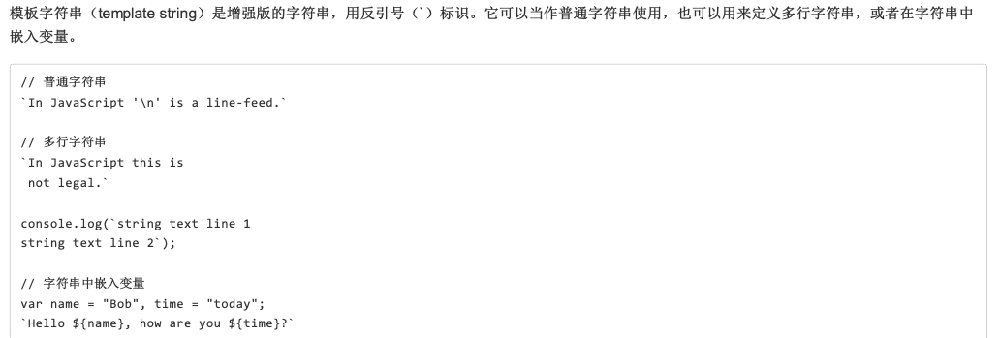


正则表达式：


看看数组的扩展：
slice() 方法返回一个新的数组对象，
这一对象是一个由 start 和 end 决定的原数组的浅拷贝（包括 start，不包括 end），其中 start 和 end 代表了数组元素的索引。原始数组不会被改变。


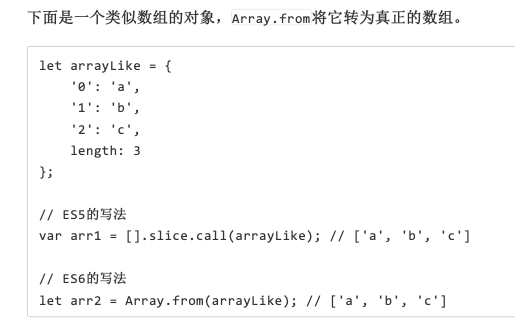


扩展运算符必须有遍历器接口
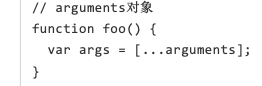


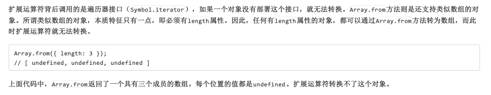


qq：为什么这里扩展运算符不一样了？

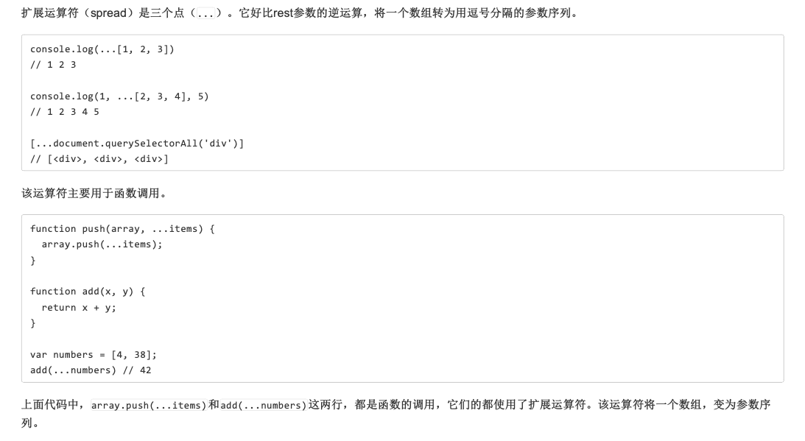


Array.of方法。。


es6的rest参数：
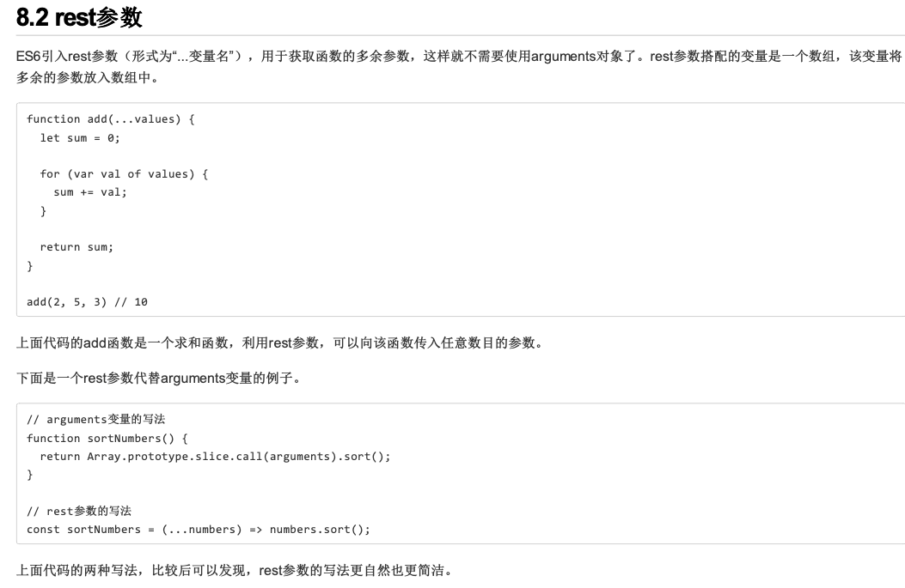


说一下箭头函数：


箭头函数的this，是定义时所在的对象，不是使用时候的对象
不能作为构造函数来使用new
不能使用arguments
不能使用yield


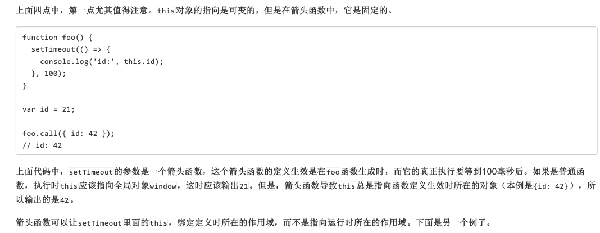


这里注意下，普通函数，1000s调用那一个时刻才能确定this是什么！
但是箭头函数被定义时候，this已经固定了；
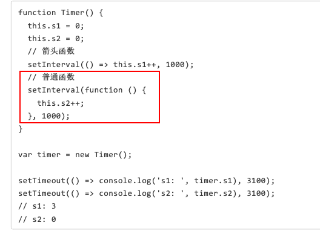


箭头函数转换成es5代码，其实就是这样，
也就是说，其实就是一个闭包，然后它自己有一个_this引用外部的this而已；


qq：这里怎么搞？
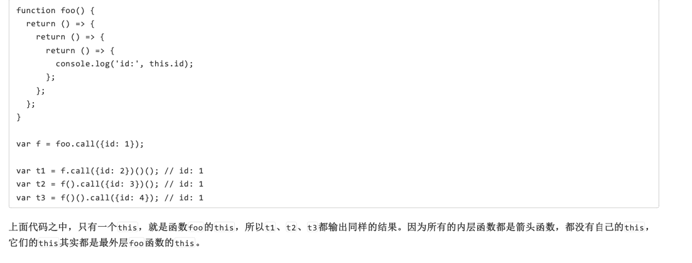


属性的可枚举性：


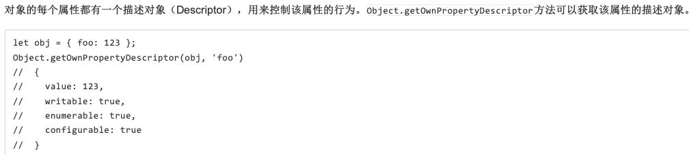


enumberable设置的目的是：
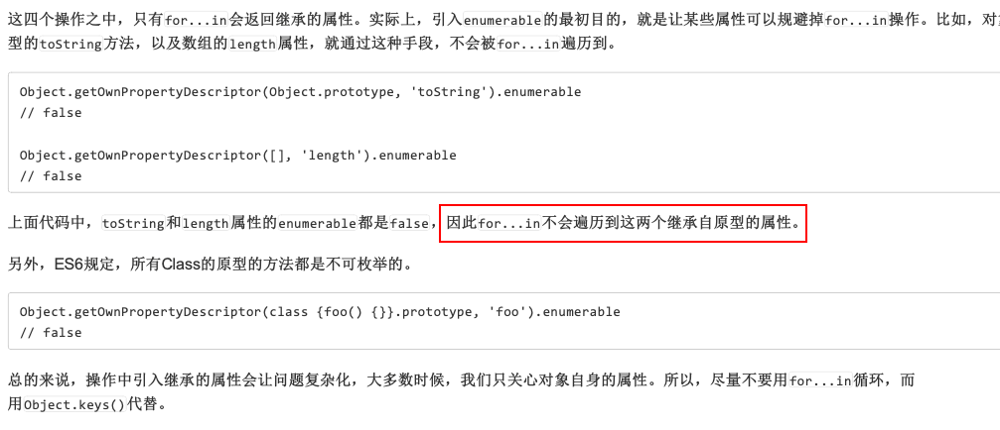


__proto__属性：
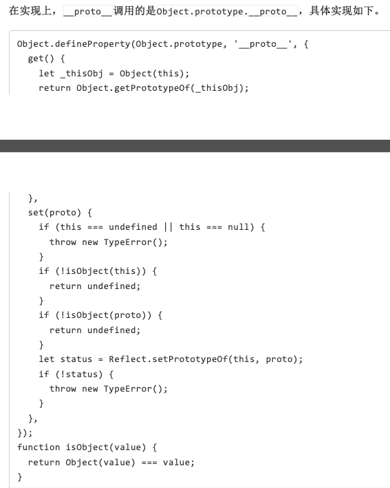


### 19.1. es6的Symbol


### 19.2. Set和Map数据结构


### 19.3. Iterator和for of


### 19.4. ES6的异步

promise相关的的东西：
[V8 Promise源码全面解读](https://juejin.cn/post/7055202073511460895)


#### 19.4.1. Generator


[V8 generator 执行机制源码分析](https://juejin.cn/post/6844904201269559303)
重点说Generator

Generator是一个迭代器生成对象，或者说遍历器生成对象，
类似于C#的返回值为IEnumerable<T>的函数
编译器会把IEnumerable<T>的函数转变成巨大的状态机；
这个函数是可以使用foreach循环来使用的，也可以执行这个函数，返回一个IEnumerable<T>的对象；然后MoveNext一步一步地调用；
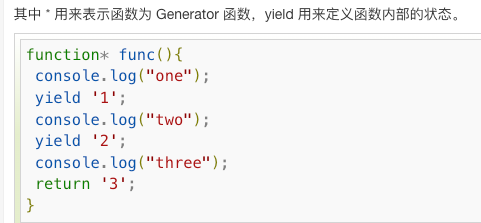

注意，调用func()之后，不管怎么调用它，它都返回一个迭代器对象，下面的f就是迭代器对象；

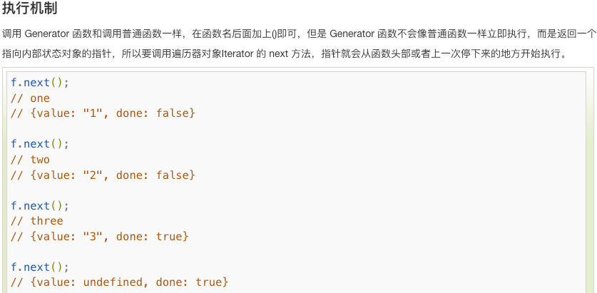

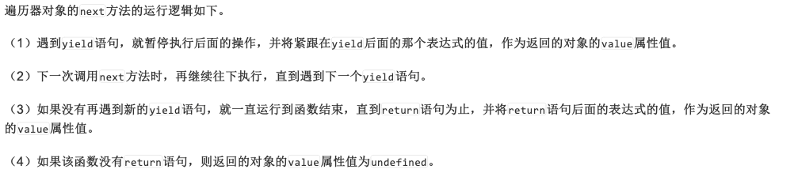


这里总结一下，
第一个next()调用之后，sendParameter()由函数起始点直接执行到yield '2'
然后返回2，也就是yield XX就是sendParameter返回XX；此时立即返回；
但是因为next()没有传参数，继续next()调用后，中断点"yield '2'"是undefined；
返回给x就是undefined；

如有参数，yield XX将 返回这个参数，这个yield本质上是语法糖，但是执行流程可以这样形容；
yield XX 看成是语义上的抽象；
它描述了函数暂停点，描述了暂停点处的函数返回值，也描述了下一次next(A)时候，暂停点处"yield XX"的“值”变成A
"yield XX" 我自己成为暂停表达式把，
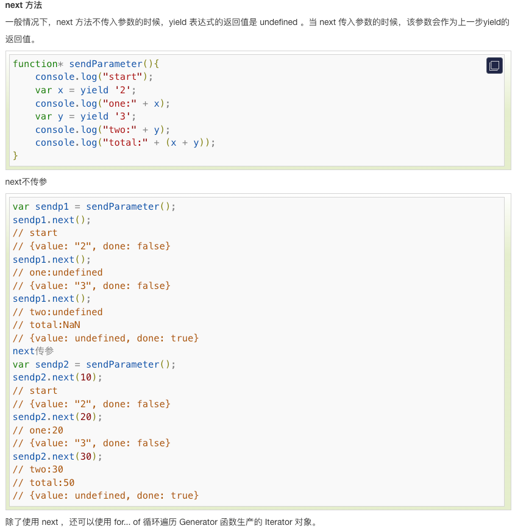


怎么结束yield的执行，用return
迭代器调用return
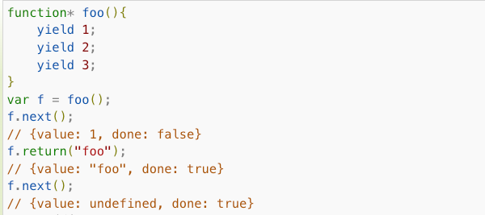


迭代器可以抛出异常
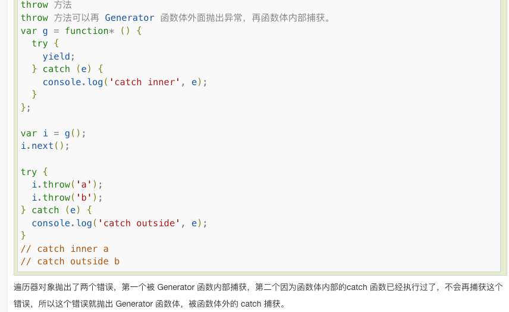

qq：没有像C#的yield return这种关键字。


yield *表达式，其实就是语法糖而已；
qq：为什么第一次callerObj.next()没有输出calllee这个log？
callerObj是一个迭代器对象，
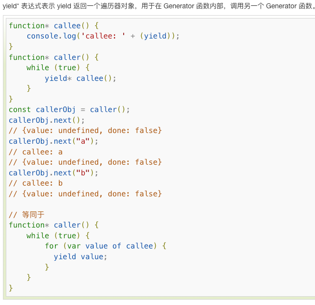


qq：for of怎么转化Generator函数？
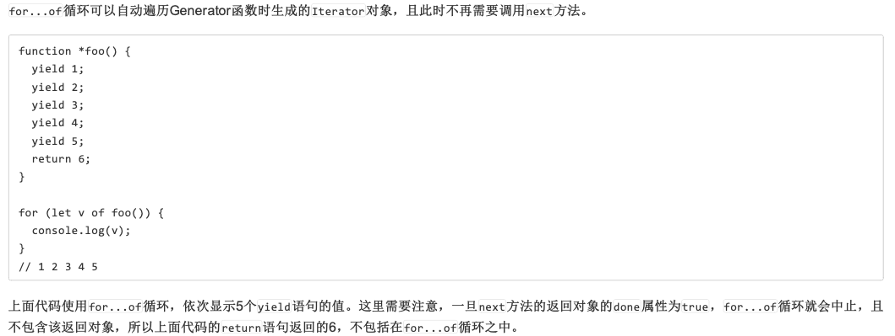


注意这个重要事实：
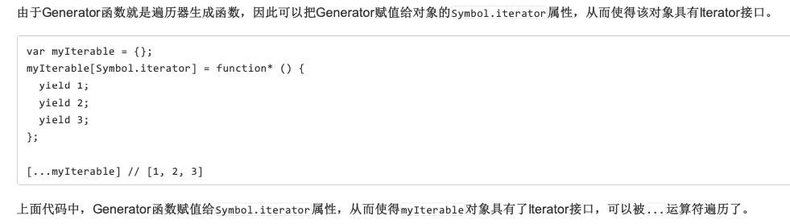


[【ES6】Generator函数详解](https://blog.csdn.net/qq_43592352/article/details/104010199)
[基于 Generator 与 Promise 的异步编程解决方案](https://morning.work/page/maintainable-nodejs/asynchronous-programming.html)

这里很重要，特别是V8实现Generator的一些细节；es7中V8直接支持async和await，不需要ts或者babel来转译；
同时说到了协程，和Lua对比一下；
[v8引擎是如何实现 async/await](https://zhuanlan.zhihu.com/p/522587032)

出了个理解的问题
下面这个语句放在这两个地方都是一样的，因为generator是var类型的；
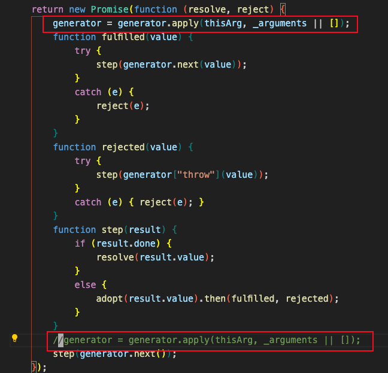
这个和变量提升没有关系，function(){console.log("num is", ob.num++)}在创建的时候，
就变量ob捕获成一个闭包变量，function的[[Closure]]域中会对ob进行引用，因此ob不会被gc；
不管这个ob是let声明还是var声明，都是可以捕获了
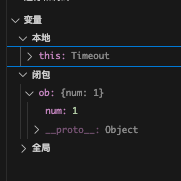

 


### 19.5. Class语法


相当于es5的：


注意这一点：

es6中的类的实例方法，不可枚举


这里，es6的类和es5的构造器的不同点，Foo无法被视为一个普通函数了，


这里注意下，子类和父类的隐式原型和原型的关系：
B的隐式原型指向A什么意思?
B的构造函数的prototype属性是A？


没有任何继承的情况下如图：


因此继承上，__proto__就不同了；


继承上：这是因为ColorPoint.__proto__的是Point
这个是有所不同的；


super的用法：


取值函数getter和存值函数setter
放在属性的描述对象中；


new target这个改进，因为es5的普通函数对象就是一个构造器，但是可以用new调用构造器，也可以用普通调用方式；
因此无法确定这个普通函数如何被构造的，


## 20. 自己总结


注意，关于call和apply，call是一个一个参数传进去，apply是传一个数组或者类数组；
本质是创建函数执行上下文时候，this绑定到自定义的对象；


关于继承中prototype里面的函数的this指向问题


var a = new Parent（）
a.getName中，this.name的this为什么绑定到a？


a.__proto__ = Parent.prototype

也就是a.__proto__.getName

a.getName()  ==> a.__proto__.getName()
 所以this应该绑定到a.__proto__而不是a；
 
不是这样调用的

a.getName()时候，js引擎就认为你要调用一个函数了，然后创建一个执行上下文；
然后this就立即绑定到a了；然后通过a的__proto__经过一系列探索才找到getName；
找到getName不为空的原型之后，此时的this也是绑定到a的，没有变；
访问一个属性进行“原型链”式的访问和this的绑定没有关系；


注意bind返回的是一个闭包；


关于this和作用域链不要搞混淆
 //比如下面，最底层的闭包的that就是自由变量，这个that是创建它的函数的this；
 this是运行时才确定的,object.getNameFunc()是隐式绑定this为object；
 因此返回的闭包的that绑定为object；因此可以访问到name；
 注意object.getNameFunc()执行完毕后，上下文

　　var name = "The Window";

　　var object = {
　　　　name : "My Object",

　　　　getNameFunc : function(){
　　　　　　var that = this;
　　　　　　return function(){
　　　　　　　　return that.name;
　　　　　　};

　　　　}

　　};

　　alert(object.getNameFunc()());


而这一个，object.getNameFunc()这个临时闭包，再次执行时候，this绑定到全局对象
全局对象有字段name为 "The Window"；


这里为什么getNameFunc返回后，执行上下文应该销毁，但是对应的VO对象（激活了的变量对象仍然存活，所以可以访问外部函数的那些变量）
所以闭包如果引用很多外部变量，很多函数的VO对象都会存活在内存中，就会加重内存负担

AO：Activation （Variable） Object

那个博客中说明了一下；


理解一下变量对象和活动对象的区别：

活动对象和变量对象其实是一个东西，只是变量对象是规范上的或者说是引擎实现上的，不可在 JavaScript 环境中访问，只有到当进入一个执行上下文中，这个执行上下文的变量对象才会被激活，所以才叫 activation object ，而只有被激活的变量对象，也就是活动对象上的各种属性才能被访问。

进入一个函数，可以访问的变量都在AO中，在执行过程中，AO会被修改
注意，在函数中，通过var声明的变量才会在这个AO中，否则就是自由变量；


执行上下文初始化之后，变成这样：


具体创建过程，这里回应上面的闭包问题，上下文被销毁了，但是闭包的Scope，作用域链中仍然有创建它时候的函数上下文的AO；


qq：关于js的instanceof和typeof的区别

typeof任何引用类型，都是返回'object'字符串


也就是instanceof就是为了求出原型继承下的继承关系的；
这里可以看出，foo只需要寻找着它的隐式原型__proto__;看能不能沿途匹配好到
foo.__proto__是一个Aoo普通对象,同时也是Foo.prototype;因此foo.__proto__===Foo.prototype
因此foo.__proto__.__proto__为Aoo.prototype,因此foo.__proto__.__proto__ === Aoo.prototype


instanceof则具体得多
左侧表达式，和右侧表达式


为什么Object  instanceof Object为true？
这里核心是Object构造器又是Function函数构造出来的，Function函数的隐式原型是Obejct.prototype


  


## 21. Promise


## 22. 宏任务微任务
[V8引擎详解（八）——消息队列](https://juejin.cn/post/6844904200199995406)


### 22.1. 手撕promise理解


第二个版本的then方法实现不懂，new Promise(XX)这个XX箭头函数的this为什么指向Promise的实例本身？
哦，知道了，XX箭头函数被构造出来的那一刻，环境的this位于then内部，then是类MyPromise的一个方法，
方法里面的this必然是MyPromise实例本身，所以说XX箭头函数所引用的this是箭头函数被构造出来时候的"环境this"
所以现在then实现的是：构造一个MyPromise，然后返回，另外还执行把两个回调push到resolve和rejected队列中去；


这里注意那个setTimeout：
没有delay参数时候，是在下一个事件循环作为一个宏任务来执行


关于Promise.finally的实现


qq：为什么先输出失败，再输出文字
finally的意思是，它总是在链式调用最尾部执行，而不管finally写在then之前还是之后


注意下，传给MyPromise的回调里面，用的resolve其实就是promise实例临时建立的_resolve
这个_resolve(XX)执行了，会把一个回调放在微任务队列里面


明天再做各种实验理解这个手撕promise


看MyPromise5.js
一个Promise，穿进去的回调的两个参数，resolve和reject，很多时候要自己保存，以免以后改变这个promise状态就要用到；
这两个resolve和reject作为闭包，引用了各自对应promise的一些状态数据；手持一个resolve闭包，相当于也掌握了对应的promise；


差不多理解了promise.all和promise.race了，一般promise.all用的比较多；


finally有些难理解


promiseX.then函数的执行逻辑：
返回一个新PromiseY，这个新PromiseY初始化时做了：
如果promiseX处于pending状态把两个回调(fullfilledFn和rejectedFn)push进promiseX的队列，
否则立即执行fulfilledFn(promiseX._value)或者rejectedFn(promiseX._value)


注意这个递归调用：
假设then的resolveFn回调返回一个promise，


这里发现一个问题，看MyPromise5.js的test1
p1执行了resolve(1),但是p1的状态是pending，而不是resolved
注意resolve(XX)会把所有then回调的异步函数全部放在当前宏任务结尾顺序执行，或者作为N个宏任务执行；


明天再一步一步调试把，理解得不够深入。。注意，现在F9是单步调试，F10是单过程调试


### 22.2. TestPromise

[我的Promise学习笔记](https://www.ucloud.cn/yun/94295.html)
1：promise什么时候被GC？
大量的promise会不会造成内存泄漏？
[永不 resolve / reject 的 Promise 会导致内存泄漏吗？](https://juejin.cn/post/6979880283667431454)
假如有很多永不 resolve / reject 的 Promise，创建后，执行完了回调，那么这部分内存的引用计数应该就被清零，所以 GC 后这部分内存会被自动释放。

总结就是：
gc的策略不会改变，如果该promise没有被人引用，就会被gc掉。如果仍被引用，就不会被gc掉。
即使一个promise，resolve或者reject了，但是它还被人引用，仍然占用内存。
比如setTimeout，setInterval那些，穿进去的callback，它引用了promise或者其他，这些对象就不会被释放；
嗯差不多，可以认为promise就是一个普通的对象，不过在vm底层会由host提供一些机制来托管promise。比如chrome的调试器里可以看到所有的promise


2：Promise中死循环的while会造成阻塞进程吗?
一定会，因为Promise的的执行回调是立即执行的，而且在主线程执行；


3：catch怎么用？
用于Promise内的reject或者then的throw Error；


4：promise转化为es5研究


### 22.3. V8-Promise源码

[264944183](https://zhuanlan.zhihu.com/p/264944183)


## 23. 关于Js的number

[讲一讲关于js的number类型](https://juejin.cn/post/6882240762915323912)


## 24. Gulp工具研究
[gulp原理及使用](https://www.cnblogs.com/mapsxy/p/10436966.html)


## 25. 头脑风暴

[module.exports,exports,export小型指南](https://juejin.cn/post/6895328842236788749)


[import、require、export、module.exports 混合使用详解](https://juejin.cn/post/6844903520865386510?searchId=202403031735320E3BBD832D1895A9BC94)

todo：
module.exports什么意思


# typescript研究


## 1. Typecript安装相关


先全局卸载：npm uninstall -g typescript

再安装指定版本：npm install -g typescript@2.9.2

查看版本号：tsc -v


node相关指令：

npm uninstall -g npm


首先
node选择10.15.1版本就可以，10.15.2版本以上会proto报错
tsc选择2.9.2版本就可以了


然后必须在package.json所在的文件夹安装jest
>npm install --save-dev jest
 也可以使用全局的jest
> npm install jest -g

然后可以直接进行单元测试了；


安装webpack
npm install --save-dev webpack webpack-cli

npm install --save-dev ts-loader


有一些错误：
puerts生成的代码是Net4.x的API，这个手动改一个就可以了；


## 2. 基础

typescript和es6的区别：
总结来说，ES6 类是 JavaScript 中基于原型的面向对象编程的语法糖，
而 TypeScript 类在此基础上增加了强类型检查和其他面向对象编程的特性，使得代码更具可读性、可维护性和可靠性。
ts其实并不是语言，最后它都是基于js的；


number类型，都是表示浮点数；

字符串string，有一个模板字符串，这个东西编译器怎么处理的？


数组：


这里就是类型安全了，x是一个[string,number]的tuple类型元组


枚举类型：
这里注意下，Color.Green是Color类型的，Color[2]是string类型的；


unknown类型：


any类型的作用：
不希望类型检查器对这些值进行检查而是直接让它们通过编译阶段的检查。 


void类型：


Never类型：
没什么用这个类型


类型断言，其实这个是在编译器发生作用，告诉类型检查器的你知道这个东西更加确切的类型；


let和var
 let是ES2015引入的关键字，它比var更加安全，因此被看做是声明变量的标准方式。 


接口：
接口可以有可选属性，只读属性


还有一个只读数组：


注意， 对象字面量会被特殊对待而且会经过_额外属性检查_，当将它们赋值给变量或作为参数传递的时候。 如果一个对象字面量存在任何“目标类型”不包含的属性时，你会得到一个错误。


可以用索引签名解决这个问题：


可索引类型，注意一般用于接口，这个就可以在接口变量用应用了；
这里需要注意一下；


关于类：
关心一下ts的类如何转化为js的；


本质上，class其实就是定义了一个js的构造器而已，js的构造器代表OO的一个类；
static属性会直接写在构造器里面的，因此访问必须员工Greeter.XX


函数


lib.d.ts文件：


## 3. 箭头函数


这里注意下，函数体只有一个表达式，也同时表示返回值就是这个表达式；


## 4. 关于装饰器

叫做 Decorators


看看MyTs这个项目

qq：为什么可以return一个Class？
Class的定义本质上就是一个立即执行函数，也是返回一个函数


类装饰器本质上就是，得到一个类，处理这个类，返回这个类。它的语法服务于修改一个类
constructor就是原类，


再看装饰器的实现原理：

decorators表示一个数组，表示所有装饰器；
target表示需要装饰的构造器；

首先定义了var c和var r,var d
c一般等于2；
r 的求值是这样：目前key和desc都是undefined；
r = (c < 3 ? target : (desc === null ? desc = Object.getOwnPropertyDescriptor(target, key) )    : desc
因此r简化成：target
target目前是Test类

然后核心执行这段代码，取出装饰器，然后一个一个处理这些类，
    else for (var i = decorators.length - 1; i >= 0; i--) if (d = decorators[i]) r = (c < 3 ? d(r) : c > 3 ? d(target, key, r) : d(target, key)) || r;
    
目前r = d(r) || r；如果返回值为undefined，那么返回r；
    return c > 3 && r && Object.defineProperty(target, key, r), r;

同时这个装饰器还处理了方法的实现！多个装饰器的话，ts会一样一起给这个函数处理；


看看方法装饰器的实现细节：


ts编译器翻译成：


注意[log(111),log2(222)]是一个闭包数组


然后走进__decorate，其中target为Maths.prototype,key为"add",desc为null；
然后看看var c和var r,var d这三个值
c为3，
然后执行desc = Object.getOwnPropertyDescriptor(target, key)


desc就是Maths.prototype.add的属性描述符;


然后进行方法的装饰：
因为穿进去的是4个参数，因此c为4，所以执行到红色处


然后传入到这个闭包中执行
其中target就是Maths.protytype,name就是"add",descriptor就是这个add函数的属性描述符；
这里注意函数调用修饰过程是log2先执行，然后才log；


这个value就可以被替换掉了；


看看log和log2对Add方法的修饰，复用它的函数体，但是再增加一些代码作为处理，很多情况下，比如发布一个消息之类的；


同时应用方法修饰器，类修饰器，看看编译后的js
先进行方法修饰，再进行类修饰；


装饰器的求值顺序如下，注意类修饰器是最后应用的；
注意方法装饰器，"装饰器表达式求值"是从上至下，"装饰器返回结果函数进行修饰的调用"则是从下到上；


## 5. tsconfig.json文件总结：


关于lib：


es6很多特性可以去用，只要让ts编译器target是es5就可以了！


## 6. typescript的版本和控制台操作


npm install typescript -g

npm uninstall typescript

tsc -v


## 7. typescript的泛型


identity<T>是泛型函数，它具有的类型是：<T>(arg:T)=>T


也可以用这种写法：{<T>(arg:T):T}


泛型接口：


泛型接口一般写成这种形式XX<T>会更好；


泛型类：


泛型约束：在<T extends XXX>来约束T


这里有点奇怪， K必须是T的一个属性名；
keyof是类型操作符


keyof的用法


“a” | “b” | “c” | “d”是联合类型？


再看看这个：
构造函数的类型是这个 new()=>T


可以写成泛型和多参数类型：
new(..args:any[])=>T


## 8. typescript如何编译成js
看看MyTs项目即可！

typescript的类


可以看到class Person{}定义出来时候其实就是执行了一个function，并且定义了一个Person变量；
这个Person是一个函数对象（构造器）


qq：这里js的function里面的this，是指向哪里？


### 8.1. ts的async转化为es5/6
在MyTs项目看看

typescript的async编译到es2017；完全一样不用修改，因为js的es2017规范原生支持async，await了；
编译到es6，需要gennerator重写，编译到es5，则需要一些帮助函数；


编译到es6后变成这样，放在浏览器直接运行；


```
var __awaiter = (this && this.__awaiter) || function (thisArg, _arguments, P, generator) {
    return new (P || (P = Promise))(function (resolve, reject) {
        function fulfilled(value) { try { step(generator.next(value)); } catch (e) { reject(e); } }
        function rejected(value) { try { step(generator["throw"](value)); } catch (e) { reject(e); } }
        function step(result) { result.done ? resolve(result.value) : new P(function (resolve) { resolve(result.value); }).then(fulfilled, rejected); }
        step((generator = generator.apply(thisArg, _arguments)).next());
    });
};
function delay(ms) {
    return new Promise(function (resolve) {
        setTimeout(resolve, ms);
    });
}
function asyncAwait() {
    return __awaiter(this, void 0, void 0, function* () {
        console.log('开始执行...');
        yield delay();
        console.log('1 秒过后');
        yield delay();
        console.log('过 2 秒后执行完成');
    });
}
asyncAwait();
```


qq：step函数什么来的？


qq：继承是如何实现的？


## 9. TypeScript的数据类型

[前端开发中的二进制数据](https://juejin.cn/post/7025818772531314724)


new ArrayBuffer(16)表示有16个字节的线性数组
new Uint8Array(buffer);表示，把这个buffer线性数组的每个元素看做是Uint8类型的，也就是占8位1个字节；；


Float32Array 类型数组代表的是平台字节顺序为 32 位的浮点数型数组 (对应于 C 浮点数据类型) 。如果需要控制字节顺序，使用 DataView 替代。其内容初始化为 0。一旦建立起来，你可以使用这个对象的方法对其元素进行操作，或者使用标准数组索引语法 (使用方括号)。
类型数组Float32Array跟普通数组Array是不一样的，不能像Array一样无限添加元素
类型数组只能存储Number数字型数据，其他数据不允许会赋值为NaN,
比如


## 10. 头脑风暴
具体研究异步有关：
[async/await总结](https://kylethanas.github.io/bf3n8q.html#说明)

[【ES6】Generator函数详解](https://blog.csdn.net/qq_43592352/article/details/104010199)


# C++相关
全部改用Xcode研究
[Xcode集成GoogleTest](https://blog.csdn.net/weixin_52437697/article/details/131742297)


    


## 1. C11特性
[十分钟掌握C++中std::thread的基础用法](https://l2m2.top/2022/03/18/2022-03-18-thread-in-cplusplus/)

[C++ final关键字](https://blog.csdn.net/mayue_web/article/details/88406527)


## 2. 重要特性总结


## 3. 模板相关


## 4. stl底层相关


# Xcode研究


## 1. Xcode项目配置研究


## 2. Xvim快捷键

这里必须设置：


set clipboard=+

nnoremap h <NOP>
nnoremap l <NOP>
nnoremap + <NOP>

"Nor下允许大范围上下翻行
nnoremap J 5j
nnoremap K 5k
vmap J 5j
vmap K 5k

"行首行尾的自定义
"行尾
nnoremap L $
vmap L $
"行尾加上'
nnoremap ;; $a;<esc>
"行首
nnoremap H ^
vmap H ^


"jj退出
inoremap jj <esc>

"禁止翻页
nnoremap <c-e> <NOP>
nnoremap <c-y> <NOP>

nnoremap <c-u> <NOP>
nnoremap <c-d> <NOP>

"Find
nnoremap cu f(
nnoremap ci f)
nnoremap c<Space> f<Space>
nnoremap cm f{
nnoremap c. f{

"Other
inoremap z; <Right>
inoremap zm {}<esc>i<Enter>
inoremap zz <Enter>
inoremap zk -
inoremap zj +
inoremap zl _
inoremap zu ()<esc>i
inoremap zh =
nnoremap cc diwi
"复制一个单词到剪贴板
nnoremap hy "*yiw
"复制一行到剪贴板
nnoremap hY "*Y
nnoremap hp "*p
nnoremap hP "*P

"复制一个单词到剪贴板
"Action:copy:
vmap hy :xccmd copy<CR>
"复制一行到剪贴板
vmap hY "*Y
"这里有些bug。。
vmap hp d"*p
vmap hP "*P

"Xcode
"Command	Note
":run	Invoke Xcode's 'run' command
":make	Invoke Xcode's 'build' command
":xhelp	Show quick help for current insertion point
":xccmd	(Use :xcmenucmd instead. It is simpler. ) Invoke arbitrary command in Xcode's actions in its menu. Takes one argument as its action to invoke. Actions here are available.
":xcmenucmd	Invoke arbitrary command in menu. (EXAMPLE: :xcmenucmd Run)
":nissue	Invoke "jump to next issue". ":ni" does the same.
":pissue	Invoke "jump to previous issue". ":pi" does the same.
":ncounterpart	Invoke "jump to next counterpart". ":nc" does the same.
":pcounterpart	Invoke "jump to previous counterpart". ":pc" does the same.
":njump	Invoke "go forward". ":nj" does the same.
":pjump	Invoke "go back". ":pj" does the same.
":macvim	Launch macvim.


"noremap <C-p> :xccmd openQuickly<CR>

set smartcase

set hlsearch

nnoremap ,tt :xccmd newTab<CR>
nnoremap ,tc :xccmd tabclose<CR>
nnoremap gcc :xcmenucmd Comment Selection<CR>
vnoremap gc  :xcmenucmd Comment Selection<CR>
nnoremap ,b :xccmd toggleBreakpointAtCurrentLine<CR>
"go to implementtation，ctrl+cmd+L实现；
nnoremap ll :xccmd jumpToDefinition<CR>
nnoremap ll :xccmd JumpToDefinition<CR>
nnoremap ll :xccmd Jump To Definition<CR>
noremap lr :run<CR> 

noremap <C--> :xccmd goBackInHistoryByCommand<CR>
noremap <C-+> :xccmd goForwardInHistoryByCommand<CR> 

"代码整理
noremap z/ :xccmd indentSelection<CR>
vmap z/ :xccmd indentSelection<CR>


"code snippet related
inoremap conl YLLog(@"");<esc>F"i


"在单个文件中全局替换
"%s/t1/t2/g
"单行替换
"s/t1/t2/g


2. 
## 3. 适配版本

Catalina10.15.7是我安装的，最高支持到的Xcode是12.4


## 4. 安装相关


Xcode14安装：


Xcode14必须把15.8包搞进去才可以识别手机；并且已经可以真机调试了；而且速度很快；


注意安装Xcode9.2需要把时间调到2018。。不然没法解压xip文件；


## 5. Xcode快捷键

自定义快捷键：


解决下冲突


然后jumpToDinition，这个比较重要；


可以了！


## 6. Xvim2的安装
必须用Xcode9以上了，别用低版本了；
注意安装Xcode9.2需要把时间调到2018。。不然没法解压xip文件；


sudo codesign -f -s XcodeSigner /Applications/Xcode.app

钥匙串访问在这里：


## 7. 其他

Xcode修改字体：


## 8. Xcode12调试细节：

注意，xcode12调试15.8系统，需要15.5改名成15.8，放到xcode那个DS包里面


这里必须要有这个才可以真机调试；


也就是mac10.15用xcode12进行调试，必须要设置--generate-entitlement-der才可以；


CocosCreator真机调试的话，必须改：


为什么需要这样，要研究下IOS签名才可以！


CocosCreator真机网页调试需要Safari才行，后面研究


## 9. Xcode配置研究


qq：IOS的project和Targets的区别是什么


qq：关于Xcode中的Workspace


用Xcode打开workspace，会得到两个Project，workspace是管理两个Project的；


qq：Xcode的Scheme


注意，Scheme  配置文件在这里


比如针对iphoneSE的edit Scheme弹出这个窗口


注意可以定义执行脚本


下面分析针对Target的Build Settings 的各种解析；


这几个选项的作用


关于Architecture架构：
也就是说编译出来的代码有两套？
比如，你的设备是armv7s指令集，那么它也可以兼容运行比armv7s版本低的指令集：armv7、armv6


Standard architectures


64位应用如何兼容32位应用？这样


$(ARCHS_STANDARD)什么意思？


也就是这个意思，用于当前的真机调试


目前我的iphoneSE架构是，CPU 是Apple A9,


A系芯片一些介绍


Assets标签


Build Options：

重点看看这个


不提交新的App版本情况下优化App二进制文件；支持更多的CPU架构；


Deployment设置，iOS 部署设置。说白了就是安装到手机的设置。


重点关注下这几个把
部署后处理，解析一下；


、、、、、、、、、、、、、、、、、、

Linking选项比较重要，看下，注意很多都和动态库，预链接，有关，一般逆向时候才需要关心；


Bundle Loader：
指定将加载正在链接的捆绑包输出文件的可执行文件。将根据指定的可执行文件检查捆绑包中未定义的符号，就好像它是捆绑包链接的动态库之一一样。


Compatiblility Version (DYLIB_COMPATIBILITY_VERSION)
动态库加载相关
确定生成的库、捆绑包或框架二进制文件的兼容性版本。请参阅
[动态库设计指南](https://developer.apple.com/library/content/documentation/DeveloperTools/Conceptual/DynamicLibraries/100-Articles/DynamicLibraryDesignGuidelines.html#//apple_ref/doc/uid/TP40002013-SW19)
有关分配动态库版本号的详细信息，请参阅[动态库编程主题]


Current Library Version (DYLIB_CURRENT_VERSION)
此设置定义了项目构建的任何框架的当前版本。与' CURRENT_PROJECT_VERSION '一样，该值必须是整数或浮点数，例如' 57 '或' 365.8 '。默认情况下，它被设置为' $(CURRENT_PROJECT_VERSION) '。参见[动态库编程主题](https://developer.apple.com/library/content/documentation/DeveloperTools/Conceptual)中的[动态库设计指南](https://developer.apple.com/library/content/documentation/DeveloperTools/Conceptual/DynamicLibraries/100-Articles/DynamicLibraryDesignGuidelines.html#//apple_ref/doc/uid/TP40002013-SW19)


Dead Code Stripping (DEAD_CODE_STRIPPING)
Activating this setting causes the `-dead_strip` flag to be passed to `ld(1)` via `cc(1)` to turn on dead code stripping.
激活此设置将导致' -dead_strip '标志通过' cc(1) '传递给' ld(1) '，以打开死代码剥离。


Display Magnled Names (LINKER_DISPLAYS_MANGLED_NAMES)
Activating this setting causes the linker to display mangled names for C++ symbols. Normally, this is not recommended, but turning it on can help to diagnose and solve C++ link errors.
激活此设置将导致链接器显示C++的混乱名称。通常，不建议这样做，但是打开它可以帮助诊断和解决C++错误。


Dont't Dead-Strip Inits and Terms (PRESERVE_DEAD_CODE_INITS_AND_TERMS)
Activating this setting, in combination with the `DEAD_CODE_STRIPPING` (`-dead_strip`) option, causes the `-no_dead_strip_inits_and_terms` flag to be passed to `ld(1)` via `cc(1)` to disable dead code stripping for initialization and termination routines. This option should not be used without the aforementioned `DEAD_CODE_STRIPPING` option.
激活此设置，并结合' DEAD_CODE_STRIPPING ' (' -dead_strip ')选项，将导致' -no_dead_strip_inits_and_terms '标志通过' cc(1) '传递给' ld(1) '，以禁用初始化和终止例程的死代码剥离。如果没有前面提到的' DEAD_CODE_STRIPPING '选项，就不应该使用这个选项。


Dynaminc Library Install Name (LD_DYLIB_INSTALL_NAME)
Sets an internal `install path` (`LC_ID_DYLIB`) in a dynamic library. Any clients linked against the library will record that path as the way `dyld` should locate this library. If this option is not specified, then the `-o` path will be used. This setting is ignored when building any product other than a dynamic library. See [Dynamic Library Programming Topics](https://developer.apple.com/library/content/documentation/DeveloperTools/Conceptual/DynamicLibraries/000-Introduction/Introduction.html).

在动态库中设置内部'安装路径' (' LC_ID_DYLIB ')。链接到库的任何客户端都会将该路径记录为' dyld '应该定位该库的方式。如果未指定此选项，则将使用' -o '路径。在构建除动态库以外的任何产品时，此设置将被忽略。参见[动态库编程主题](https://developer.apple.com/library/content/documentation/DeveloperTools/Conceptual/DynamicLibraries/000-Introduction/Introduction.html)。


Dynaminc Library Install Name Base (DYLIB_INSTALL_NAME_BASE)
Sets the base value for the internal `install path` (`LC_ID_DYLIB`) in a dynamic library. This will be combined with the `EXECUTABLE_PATH` to form the full install path. Setting `LD_DYLIB_INSTALL_NAME` directly will override this setting. This setting defaults to the target's `INSTALL_PATH`. It is ignored when building any product other than a dynamic library.
设置动态库中内部'安装路径' (' LC_ID_DYLIB ')的基本值。这将与' EXECUTABLE_PATH '结合起来形成完整的安装路径。直接设置' LD_DYLIB_INSTALL_NAME '将覆盖此设置。此设置默认为目标的“INSTALL_PATH”。在构建除动态库之外的任何产品时都会忽略它。


Exported Symbols File (EXPORTED_SYMBOLS_FILE)
This is a project-relative path to a file that lists the symbols to export. See `ld -exported_symbols_list` for details on exporting symbols.
这是列出要导出的符号的文件的项目相对路径。有关导出符号的详细信息，请参阅' ld -exported_symbols_list '。


Generate Position-Dependent Executable (LD_NO_PIE)
Activating this setting will prevent Xcode from building a main executable that is position independent (PIE). When targeting macOS 10.7 or later, PIE is the default for main executables, so activating this setting will change that behavior. When targeting OS X 10.6 or earlier, or when building for i386, PIE is not the default, so activating this setting does nothing. You cannot create a PIE from `.o` files compiled with `-mdynamic-no-pic`. Using PIE means the codegen is less optimal, but the address randomization adds some security.
激活此设置将阻止Xcode构建位置独立(PIE)的主可执行文件。当目标是macOS 10.7或更高版本时，PIE是主可执行文件的默认值，因此激活此设置将改变该行为。当目标是OS X 10.6或更早版本，或者为i386构建时，PIE不是默认值，因此激活此设置没有任何作用。不能从'创建PIE。使用' - dynamic-no-pic '编译的文件。使用PIE意味着编码不是最优的，但是地址随机化增加了一些安全性。


Initialization Routine (INIT_ROUTINE)
This is the name of the routine to use for initialization.
这是用于初始化的例程的名称。


Link With Standard Libraries (LINK_WITH_STANDARD_LIBRARIES)
When this setting is enabled, the compiler driver will automatically pass its standard libraries to the linker to use during linking. If desired, this flag can be used to disable linking with the standard libraries, and then individual libraries can be passed as `OTHER_LDFLAGS`.
当启用此设置时，编译器驱动程序将自动将其标准库传递给链接器，以便在链接期间使用。如果需要，这个标志可以用来禁用与标准库的链接，然后可以将单个库作为' OTHER_LDFLAGS '传递。


Mach-O Type (MACH_O_TYPE)
This setting determines the format of the produced binary and how it can be linked when building other binaries. For information on binary types, see [Building Mach-O Files](https://developer.apple.com/library/content/documentation/DeveloperTools/Conceptual/MachOTopics/1-Articles/building_files.html#//apple_ref/doc/uid/TP40001828-SW1) in [Mach-O Programming Topics](https://developer.apple.com/library/content/documentation/DeveloperTools/Conceptual/MachOTopics/0-Introduction/introduction.html). * *Executable:* Executables and standalone binaries and cannot be linked. [mh_execute] * *Dynamic Library:* Dynamic libraries are linked at build time and loaded automatically when needed. [mh_dylib] * *Bundle:* Bundle libraries are loaded explicitly at run time. [mh_bundle] * *Static Library:* Static libraries are linked at build time and loaded at execution time. [staticlib] * *Relocatable Object File:* Object files are single-module files that are linked at build time. [mh_object]

此设置决定生成的二进制文件的格式，以及在构建其他二进制文件时如何链接它。有关二进制类型的信息，请参阅[Mach-O编程主题](https://developer.apple.com/library/content/documentation/DeveloperTools/Conceptual/MachOTopics/0-Introduction/introduction.html)中的[构建Mach-O文件](https://developer.apple.com/library/content/documentation/DeveloperTools/Conceptual/MachOTopics/1-Articles/building_files.html#//apple_ref/doc/uid/TP40001828-SW1)。* *Executable:*可执行文件和独立二进制文件，不能链接。[mh_execute] * *动态库


Order File
The path to a file that alters the order in which functions and data are laid out. For each section in the output file, any symbol in that section that are specified in the order file is moved to the start of its section and laid out in the same order as in the order file. Order files are text files with one symbol name per line. Lines starting with a `#` are comments. A symbol name may be optionally preceded with its object file leafname and a colon (for example, `foo.o:_foo`). This is useful for static functions/data that occur in multiple files. A symbol name may also be optionally preceded with the architecture (for example, `ppc:_foo` or `ppc:foo.o:_foo`). This enables you to have one order file that works for multiple architectures. Literal C-strings may be ordered by quoting the string in the order file (for example, `"Hello, world\n"`). Generally you should not specify an order file in Debug or Development configurations, as this will make the linked binary less readable to the debugger. Use them only in Release or Deployment configurations.
一个文件的路径，它改变了函数和数据的排列顺序。对于输出文件中的每个部分，该部分中在订单文件中指定的任何符号都被移动到其部分的开头，并以与订单文件中相同的顺序进行布局。订单文件是每行一个符号名的文本文件。以“#”开头的行是注释。符号名可以在其目标文件leafname和冒号(例如，' foo.o:_foo ')之前选择。这对于出现在多个文件中的静态函数/数据非常有用。符号名也可以选择性地放在前面


Other Libraries Flags (OTHER_LIBTOOLFLAGS)
Options defined in this setting are passed to all invocations of the archive librarian, which is used to generate static libraries.
在此设置中定义的选项将传递给归档库的所有调用，归档库用于生成静态库。


Other Linker Flags (OTHER_LDFLAGS)
链接标记，传递给链接器的，一般传各种framework；
Options defined in this setting are passed to invocations of the linker.
在此设置中定义的选项将传递给链接器的调用。


Path to Link Map File (LD_MAP_FILE_PATH)
This setting defines the path to the map file written by the linker when the `LD_GENERATE_MAP_FILE` setting is activated. By default, a separate file will be written for each architecture and build variant, and these will be generated in the Intermediates directory for the target whose product is being linked.

默认值是：默认值是 $(TARGET_TEMP_DIR)/$(PRODUCT_NAME)-LinkMap-$(CURRENT_VARIANT)-$(CURRENT_ARCH).txt
当激活' LD_GENERATE_MAP_FILE '设置时，该设置定义链接器写入的映射文件的路径。默认情况下，将为每个体系结构和构建变体编写一个单独的文件，这些文件将在Intermediates目录中为链接其产品的目标生成。
默认值是:默认值是(TARGET_TEMP_DIR) /美元(PRODUCT_NAME) -LinkMap - (CURRENT_VARIANT)——美元(CURRENT_ARCH) . txt


Perform Single-Object Prelink (GENERATE_MASTER_OBJECT_FILE)
Activating this setting will cause the object files built by a target to be prelinked using `ld -r` into a single object file, and that object file will then be linked into the final product. This is useful to force the linker to resolve symbols and link the object files into a single module before building a static library. Also, a separate set of link flags can be applied to the prelink allowing additional control over, for instance, exported symbols.
激活此设置将导致使用' ld -r '将目标构建的目标文件预链接到单个目标文件中，然后该目标文件将链接到最终产品中。这对于强制链接器在构建静态库之前解析符号并将目标文件链接到单个模块非常有用。此外，还可以将一组单独的链接标志应用于预链接，以允许对(例如)导出符号进行额外控制。


Prelink libraries (PRELINK_LIBS)
Additional libraries to pass when performing a single-object prelink.
执行单对象预链接时要传递的附加库。


Preserve Private External Symbols
Activating this setting will preserve private external symbols, rather than turning them into static symbols. This setting is also respected when performing a single-object prelink.
激活此设置将保留私有外部符号，而不是将它们转换为静态符号。在执行单对象预链接时也遵循此设置。


Quote Linker Arguments (LD_QUOTE_LINKER_ARGUMENTS_FOR_COMPILER_DRIVER)
This setting controls whether arguments to the linker should be quoted using `-Xlinker`. By default, Xcode invokes the linker by invoking the driver of the compiler used to build the source files in the target, and passing `-Xlinker` to quote arguments will cause the compiler driver to pass them through to the linker (rather than trying to evaluate them within the driver). By default, this setting is enabled. Disabling it will cause Xcode to not use `-Xlinker` to pass arguments to the linker. Disabling this setting is useful if the target has instructed Xcode to use an alternate linker (for example, by setting the `LD` setting to the path to another linker) and that alternate linker does not recognize `-Xlinker`.
该设置控制链接器的参数是否应该使用' -Xlinker '加引号。默认情况下，Xcode通过调用用于在目标中构建源文件的编译器的驱动程序来调用链接器，并且通过' -Xlinker '来引用参数将导致编译器驱动程序将它们传递给链接器(而不是尝试在驱动程序中计算它们)。默认情况下，该设置是启用的。禁用它将导致Xcode不使用' -Xlinker '向链接器传递参数。禁用此设置是有用的，如果目标已指示Xcode使用替代链接器


Re-Exported Framework Names (REEXPORTED_FRAMEWORK_NAMES)
List of framework names that should have their symbols be reexported from the built library.
应该从构建库中重新导出其符号的框架名称列表。


Re-Exported Library Names (REEXPORTED_LIBRARY_NAMES)
List of library names that should have their symbols be reexported from the built library.
应该从构建的库中重新导出其符号的库名称列表。


Re-Exported Library Paths (REEXPORTED_LIBRARY_PATHS)
List of library paths that should have their symbols be reexported from the built library.
应该从构建库中重新导出其符号的库路径列表。


Runpath Search Paths
This is a list of paths to be added to the `runpath` search path list for the image being created. At runtime, `dyld` uses the `runpath` when searching for dylibs whose load path begins with `@rpath/`. See [Dynamic Library Programming Topics](https://developer.apple.com/library/content/documentation/DeveloperTools/Conceptual/DynamicLibraries/000-Introduction/Introduction.html).
这是要添加到正在创建的映像的“runpath”搜索路径列表中的路径列表。在运行时，' dyld '在搜索加载路径以' @rpath/ '开头的dylib时使用' runpath '。参见[动态库编程主题](https://developer.apple.com/library/content/documentation/DeveloperTools/Conceptual/DynamicLibraries/000-Introduction/Introduction.html)。


Separately Edit Symbols (SEPARATE_SYMBOL_EDIT)
Activating this setting when the linked product's symbols are to be edited will cause editing to occur via a separate invocation of `nmedit(1)`. Otherwise editing will occur during linking, if possible.
当要编辑链接产品的符号时，激活此设置将导致通过单独调用' nmedit(1) '进行编辑。否则，如果可能的话，编辑将在链接期间进行。


Single-Object Prelink Flags (PRELINK_FLAGS)
Additional flags to pass when performing a single-object prelink.
执行单对象预链接时要传递的附加标志。


Symbol Ordering Flags (SECTORDER_FLAGS)
These flags are typically used to specify options for ordering symbols within segments, for example the `-sectorder` option to `ld`. Generally you should not specify symbol ordering options in Debug or Development configurations, as this will make the linked binary less readable to the debugger. Use them only in Release or Deployment configurations.
这些标志通常用于指定分段中符号排序的选项，例如' -sectorder '选项为' ld '。一般来说，您不应该在调试或开发配置中指定符号排序选项，因为这将使链接的二进制文件对调试器的可读性降低。仅在发布或部署配置中使用它们。


Unexported Symbols Files (UNEXPORTED_SYMBOLS_FILE)
A project-relative path to a file that lists the symbols not to export. See `ld -exported_symbols_list` for details on exporting symbols.
列出不要导出的符号的文件的项目相对路径。有关导出符号的详细信息，请参阅' ld -exported_symbols_list '。


Warnings Linker Flags (WARNING_LDFLAGS)
These flags are passed with linker invocations, and by default give the `-no_arch_warnings` flag to the linker to avoid many warnings being generated during multi-architecture builds.
这些标志与链接器调用一起传递，默认情况下给链接器' -no_arch_warnings '标志，以避免在多架构构建期间生成许多警告。


Write Link Map File (LD_GENERATE_MAP_FILE)
Activating this setting will cause the linker to write a map file to disk, which details all symbols and their addresses in the output image. The path to the map file is defined by the `LD_MAP_FILE_PATH` setting.
激活此设置将导致链接器将映射文件写入磁盘，该文件详细说明了输出映像中的所有符号及其地址。映射文件的路径由' LD_MAP_FILE_PATH '设置定义


比较重要的两个；
-framework表示什么？


用了CocoaPods，Other Linker Flags设置为：
这就是


Pods工程下面产生这些库，
qq：但是Foundation.framework和Pods.com.fshunj.myIOS.framework没有链接；


Packaging打包相关


Define Module


、、、、、、、、、、、、、、Search Paths设置、、、、、、、


这里注意下这个文件夹，它保存的是中间结果。。


build文件夹在这里


Framework Search Paths (FRAMEWORK_SEARCH_PATHS)
编译器查找的frameworks路径
例子：FRAMEWORK_SEARCH_PATHS =  "/Users/ocean/Desktop/Demo/MyWay/HaiZiGuoParents/HaiZiGuoParents/Pods/AMap3DMap" "/Users/ocean/Desktop/Demo/MyWay/HaiZiGuoParents/HaiZiGuoParents/Pods/AMapFoundation" "/Users/ocean/Desktop/Demo/MyWay/HaiZiGuoParents/HaiZiGuoParents/Pods/AMapSearch" /Users/ocean/Desktop/Demo/MyWay/HaiZiGuoParents/HaiZiGuoParents/HaiZiGuoParents/Frameworks /Users/ocean/Desktop/Demo/MyWay/HaiZiGuoParents/HaiZiGuoParents/HaiZiGuoParents/Library/ShareSDK /Users/ocean/Desktop/Demo/MyWay/HaiZiGuoParents/HaiZiGuoParents/HaiZiGuoParents/Library/ShareSDK/Support/Optional /Users/ocean/Desktop/Demo/MyWay/HaiZiGuoParents/HaiZiGuoParents/HaiZiGuoParents/Library/ShareSDK/Support/PlatformSDK/QQSDK /Users/ocean/Desktop/Demo/MyWay/HaiZiGuoParents/HaiZiGuoParents/HaiZiGuoParents/Library/ShareSDK/Support/Required /Users/ocean/Desktop/Demo/MyWay/HaiZiGuoParents/HaiZiGuoParents/HaiZiGuoParents/Library/AlipaySDK


Header Search Paths (HEADER_SEARCH_PATHS)
编译的时候的头文件搜索路径
HEADER_SEARCH_PATHS =  "/Users/ocean/Desktop/Demo/MyWay/HaiZiGuoParents/HaiZiGuoParents/Pods/Headers/Public" "/Users/ocean/Desktop/Demo/MyWay/HaiZiGuoParents/HaiZiGuoParents/Pods/Headers/Public/AFNetworking" "/Users/ocean/Desktop/Demo/MyWay/HaiZiGuoParents/HaiZiGuoParents/Pods/Headers/Public/AMap3DMap" "/Users/ocean/Desktop/Demo/MyWay/HaiZiGuoParents/HaiZiGuoParents/Pods/Headers/Public/AMapFoundation" "/Users/ocean/Desktop/Demo/MyWay/HaiZiGuoParents/HaiZiGuoParents/Pods/Headers/Public/AMapSearch" "/Users/ocean/Desktop/Demo/MyWay/HaiZiGuoParents/HaiZiGuoParents/Pods/Headers/Public/BlocksKit" "/Users/ocean/Desktop/Demo/MyWay/HaiZiGuoParents/HaiZiGuoParents/Pods/Headers/Public/MGSwipeTableCell" "/Users/ocean/Desktop/Demo/MyWay/HaiZiGuoParents/HaiZiGuoParents/Pods/Headers/Public/Masonry" "/Users/ocean/Desktop/Demo/MyWay/HaiZiGuoParents/HaiZiGuoParents/Pods/Headers/Public/RegexKitLite" "/Users/ocean/Desktop/Demo/MyWay/HaiZiGuoParents/HaiZiGuoParents/Pods/Headers/Public/SystemServices" "/Users/ocean/Desktop/Demo/MyWay/HaiZiGuoParents/HaiZiGuoParents/Pods/Headers/Public/Valet" "/Users/ocean/Desktop/Demo/MyWay/HaiZiGuoParents/HaiZiGuoParents/Pods/Headers/Public/WZLBadge" "/Users/ocean/Desktop/Demo/MyWay/HaiZiGuoParents/HaiZiGuoParents/Pods/Headers/Public/ZipArchive" "/Users/ocean/Desktop/Demo/MyWay/HaiZiGuoParents/HaiZiGuoParents/Pods/Headers/Public" "/Users/ocean/Desktop/Demo/MyWay/HaiZiGuoParents/HaiZiGuoParents/Pods/Headers/Public/AFNetworking" "/Users/ocean/Desktop/Demo/MyWay/HaiZiGuoParents/HaiZiGuoParents/Pods/Headers/Public/AMap3DMap" "/Users/ocean/Desktop/Demo/MyWay/HaiZiGuoParents/HaiZiGuoParents/Pods/Headers/Public/AMapFoundation" "/Users/ocean/Desktop/Demo/MyWay/HaiZiGuoParents/HaiZiGuoParents/Pods/Headers/Public/AMapSearch" "/Users/ocean/Desktop/Demo/MyWay/HaiZiGuoParents/HaiZiGuoParents/Pods/Headers/Public/Masonry" "/Users/ocean/Desktop/Demo/MyWay/HaiZiGuoParents/HaiZiGuoParents/Pods/Headers/Public/RegexKitLite" "/Users/ocean/Desktop/Demo/MyWay/HaiZiGuoParents/HaiZiGuoParents/Pods/Headers/Public/SimpleKeychain" "/Users/ocean/Desktop/Demo/MyWay/HaiZiGuoParents/HaiZiGuoParents/Pods/Headers/Public/SystemServices" "/Users/ocean/Desktop/Demo/MyWay/HaiZiGuoParents/HaiZiGuoParents/Pods/Headers/Public/ZipArchive" /Users/ocean/Desktop/Demo/MyWay/HaiZiGuoParents/HaiZiGuoParents/HaiZiGuoParents/IndexVC/HotServices/Others


Library Search Paths (LIBRARY_SEARCH_PATHS)
库搜索路径
例子：
LIBRARY_SEARCH_PATHS =  "/Users/ocean/Library/Developer/Xcode/DerivedData/HaiZiGuoParents-awjrjakydlcetycddgxdbiiitwdv/Build/Products/Release-iphoneos/AFNetworking" "/Users/ocean/Library/Developer/Xcode/DerivedData/HaiZiGuoParents-awjrjakydlcetycddgxdbiiitwdv/Build/Products/Release-iphoneos/BlocksKit" "/Users/ocean/Library/Developer/Xcode/DerivedData/HaiZiGuoParents-awjrjakydlcetycddgxdbiiitwdv/Build/Products/Release-iphoneos/MGSwipeTableCell" "/Users/ocean/Library/Developer/Xcode/DerivedData/HaiZiGuoParents-awjrjakydlcetycddgxdbiiitwdv/Build/Products/Release-iphoneos/Masonry" "/Users/ocean/Library/Developer/Xcode/DerivedData/HaiZiGuoParents-awjrjakydlcetycddgxdbiiitwdv/Build/Products/Release-iphoneos/RegexKitLite" "/Users/ocean/Library/Developer/Xcode/DerivedData/HaiZiGuoParents-awjrjakydlcetycddgxdbiiitwdv/Build/Products/Release-iphoneos/SystemServices" "/Users/ocean/Library/Developer/Xcode/DerivedData/HaiZiGuoParents-awjrjakydlcetycddgxdbiiitwdv/Build/Products/Release-iphoneos/Valet" "/Users/ocean/Library/Developer/Xcode/DerivedData/HaiZiGuoParents-awjrjakydlcetycddgxdbiiitwdv/Build/Products/Release-iphoneos/WZLBadge" "/Users/ocean/Library/Developer/Xcode/DerivedData/HaiZiGuoParents-awjrjakydlcetycddgxdbiiitwdv/Build/Products/Release-iphoneos/ZipArchive" /Users/ocean/Desktop/Demo/MyWay/HaiZiGuoParents/HaiZiGuoParents/HaiZiGuoParents/Frameworks /Users/ocean/Desktop/Demo/MyWay/HaiZiGuoParents/HaiZiGuoParents/HaiZiGuoParents/Library/JpushLib /Users/ocean/Desktop/Demo/MyWay/HaiZiGuoParents/HaiZiGuoParents/HaiZiGuoParents/Library/UMAnalytics_Sdk_3.6.6 /Users/ocean/Desktop/Demo/MyWay/HaiZiGuoParents/HaiZiGuoParents/HaiZiGuoParents/Library/ShareSDK/Support/PlatformSDK/SinaWeiboSDK /Users/ocean/Desktop/Demo/MyWay/HaiZiGuoParents/HaiZiGuoParents/HaiZiGuoParents/Library/ShareSDK/Support/PlatformSDK/WeChatSDK /Users/ocean/Desktop/Demo/MyWay/HaiZiGuoParents/HaiZiGuoParents/HaiZiGuoParents/IndexVC/HotServices/Others


Rez Search Paths (REZ_SEARCH_PATHS)
资源搜索路径


‘Sub-Directories to Exclude in Recursive Searches (EXCLUDED_RECURSIVE_SEARCH_PATH_SUBDIRECTORIES)
排除的搜索文件类型


Sub-Directories to Inlude in Recursive Searches


System Framework Search Paths (SYSTEM_FRAMEWORK_SEARCH_PATHS)


System Header Search Paths (SYSTEM_HEADER_SEARCH_PATHS)


User Header Maps (USE_HEADERMAP)
会生成 .hmap 文件


User Header Search Paths (USER_HEADER_SEARCH_PATHS)


、、、、、、、、、、、、、、、、、、、、、签名相关、、、、、、、、、、、、、、、


Code Signing Entitlements (CODE_SIGN_ENTITLEMENTS)
The path to a file specifying code-signing entitlements.


Code Signing Identity （CODE_SIGN_IDENTITY）
证书校验
The name, also known as the *common name*, of a valid code-signing certificate in a keychain within your keychain path. A missing or invalid certificate will cause a build error.


Code Signing Inject Base Entitlements (CODE_SIGN_INJECT_BASE_ENTITLEMENTS)
Automatically inject entitlements from the platform's BaseEntitlements.plist into the code signatures of executables.


Code Signing Style (CODE_SIGN_STYLE)
取值 Automatic Manual
This setting specifies the method used to acquire and locate signing assets. Choose `Automatic` to let Xcode automatically create and update profiles, app IDs, and certificates. Choose `Manual` to create and update these yourself on the developer website.


Development Team (DEVELOPMENT_TEAM)
The team ID of a development team to use for signing certificates and provisioning profiles.


Other Code Signing Flags (OTHER_CODE_SIGN_FLAGS)
A list of additional options to pass to `codesign(1)`.


Provisioning Profile (PROVISIONING_PROFILE_SPECIFIER)
Must contain a profile name (or UUID). A missing or invalid profile will cause a build error. Use in conjunction with [DEVELOPMENT_TEAM] to fully specify provisioning profile.


、、、、、、、、、、、、、、、、、、、、Apple Clang相关内容、、、、、、、、、、、、、

先看哪个LLVM的介绍，Clang有很多指令


、、、、、、、、、、、、、、、、、、、、Asset Catalog Compiler设置、、、、、、、、


、、、、、、、、、、、、、、、、、、、、、、、User-Defined内容、、、、、、、、、


比如下面哪些Flag的哪里来的


从Pods自动生成的文件中得到的；


、、、、、、、、、、、、、

Target的General设置

关心下这个Embeded Binaries动态库


比如这里是什么意思？


Capobility也说了


Target的info设置
URL types和进程之间的沟通有关？


解析一下info


Target的build phase
target的build phase选项卡的的主要功能是配置编译器在不同编译阶段的参数，包括编译所需的资源文件（包括代码、配置以及各种资源文件）

重点这三项设置了


Target的Resources Tag的设置
这个游戏开发不用关心这个了；


### 9.1. Xcode文件系统


主要是这几个


workspace包含Project；


### 9.2. Xcode编译器详解


  iOS在XCode编译代码码过程中，有时会遇到clang: error: linker command failed with exit code 1 (use -v to see invocation) 错误。那么，clang是什么意思呢？原来它是XCode内置专门用于编译C、C++、Objective-C文件的编译器。


lldb是apple的调试器；


todo:研究下配置应用和库等等的区别是什么,基于Gtest项目，什么target，project，库怎么配置，怎么输出；

[v4.0.1](https://github.com/mattstevens/xcode-googletest/tree/v4.0.1)


## 10. Xcode自动化打包


## 11. 切换多个Xcode

xcode-select -p


gcc --version


切换到Xcode14.2
sudo xcode-select -s /Applications/Xcode/Xcode14.app/Contents/Developer
切换到Xcode13.4.1
sudo xcode-select -s /Applications/Xcode/Xcode13.app/Contents/Developer


注意，只能用Xcode13.4来搞xvim2了，Xvim14+没法搞！


sudo codesign -f -s MyXcodeSigner /Applications/Xcode/Xcode13.app


以后编码就用Xcode13，但是需要打包就用Xcode14即可；同事开两个；


注意，两个Xcode一起用时候，Xcode14不要用vim mode，不然会影响到Xcode13；


## 12. Xcode shader调试


## 13. 头脑风暴


todo：这个选项有什么作用？


看看GNU的标准C++98的标准！


这个很多情况都没用！
Xcode解决“Implicit declaration of function 'XXX' is invalid in C99” 警告或报错
这个警告提示你在代码中使用了一个名为 _objc_autoreleasePoolPrint 的函数，但是编译器无法找到这个函数的声明。这意味着该函数的声明可能未被包含在当前文件或引入的头文件中。
1.Build Setting>>>C Language Dialect,然后选择GNU99[-std=gnu99] (选择看项目实际要求
2.Build Setting>>>Architectures>>>Vaild Architectures,然后把arm64和armv7s去掉。
3.Build Setting>>>Architectures>>>Build Active Architecture Only,把Debug的YES改为NO。
4.Build Phases>>>Compile>>>找到对应的文件 添加-fno-objc-arc
但在XCode12+中， Valid Architectures 这一项被移除掉了,改变成了VALID_ARCHS的栏目。
必须这样去增加：


关于Xcode的架构设置：
VALID_ARCHS这个User-Define选项要么不要设置，如果设置为空，会出现这个错误：

在 Xcode 中，"Command PhaseScriptExecution failed with a nonzero exit code" 是一种常见的构建错误，通常出现在运行构建脚本时出现问题时。这个错误消息表明某个构建阶段的脚本执行未能成功，其返回的退出码不为零。


这种错误偶尔发生！在Xcode13发生之后，但是Xcode14却没事！
Couldn’t communicate with a helper application.
解决方法：首先用Xcode14打开，如果没事，再用xcode13打开即可；同时登录下开发者平台；


只需要重新连接iphone即可


# IOS开发

--generate-entitlement-der
bundle Id：com.fshunj.myGame


pod install之前设置代理，git加速
export https_proxy='127.0.0.1:1087'


source 'https://mirrors.tuna.tsinghua.edu.cn/git/CocoaPods/Specs.git'
#source 'https://github.com/CocoaPods/Specs.git'


pod 'HDWindowLogger', '1.6.11' 


--generate-entitlement-der没有加会出现这种错误,仅仅针对Xcode12.x下调试IOS15以上的手机；
The code signature version is no longer supported.
Domain: com.apple.dt.MobileDeviceErrorDomain
这是因为没有加上：--generate-entitlement-der


原因是IOS15系统使用了新的签名格式


## 1. 基础知识以及各种疑问


IOS的沙盒


执行下面代码，目录是


注意下目录路径；


直接在Xcode这里下载沙盒文件查看就可以了！最好youpython脚本；；


 qq：bundle Id是什么来的


## 2. 2.cocoaPod相关


### 2.1. cocosPod安装相关


关于gem，ruby的包管理器


下面用gem来安装coocspod包就是这样了；


安装brew：


/bin/zsh -c "$(curl -fsSL https://gitee.com/cunkai/HomebrewCN/raw/master/Homebrew.sh)"

 卸载brew
/bin/zsh -c "$(curl -fsSL https://gitee.com/cunkai/HomebrewCN/raw/master/HomebrewUninstall.sh)"


安装gpg2
brew install gnupg gnupg2
ln -s /usr/local/bin/gpg /usr/local/bin/gpg2


这个是什么意思？Core,Cask,services?


这里发生严重错误？
https://raw.githubusercontent.com访问不了


同样，下载wget也有出现这个错误


wget https://raw.githubusercontent.com/Homebrew/homebrew-core/e0e7dd23905ebff4cd5eaac5e9840487887e2c1f/Formula/a/autoconf.rb

'wget https://www.bytereef.org/contrib/decimal.diff \
-O /Users/user/Library/Caches/Homebrew/downloads/f60b5004541eb3c87cce87ef3bf94933a2684ab267346afdc45ae1622ffa923a--decimal.diff


git -C "$(brew --repo)" remote set-url origin https://mirrors.ustc.edu.cn/brew.git
git -C "$(brew --repo homebrew/core)" remote set-url origin https://mirrors.ustc.edu.cn/homebrew-core.git
git -C "$(brew --repo homebrew/cask)" remote set-url origin https://mirrors.ustc.edu.cn/homebrew-cask.git

echo 'export HOMEBREW_BOTTLE_DOMAIN=https://mirrors.ustc.edu.cn/homebrew-bottles' >> ~/.zshrc
source ~/.zshrc
echo 'export HOMEBREW_BOTTLE_DOMAIN=https://mirrors.ustc.edu.cn/homebrew-bottles' >> ~/.bash_profile
source ~/.bash_profile


可以，竟然下载了libunistring，但是等了3分钟;
you一大堆依赖要下载


get.rvm.io | bash -s stable：
这条指令也是可以执行，要安装几分钟；


注意设置为全局模式，不然可能不行；；

这个过程是解压！慢慢等把；
断断续续输出就是表示在下载了；


安装rvm install 3.0.0过程中有这些输出，注意，它在下载这些依赖了！
可以需要1个小时才可以安装完。


Error running 'requirements_osx_brew_libs_install autoconf automake libtool pkg-config coreutils libyaml libksba readline zlib openssl@1.1',
please read /Users/mac/.rvm/log/1704531562_ruby-3.0.0/package_install_autoconf_automake_libtool_pkg-config_coreutils_libyaml_libksba_readline_zlib_openssl@1.1.log
Requirements installation failed with status: 1.

重新装就可以了


然后继续出现错误：


原因是编译出现错误：知道什么原因了，因为编译错误了，
ossl_pkey_rsa.c编译错误


只需要这样就可以了：
brew install openssl@1.1
ruby-install ruby-3.0.2 -- --with-openssl-dir=$(brew --prefix openssl@1.1)


用这个方法就解决了，其中一个bug，
如果用ruby-3.0.0,用这个；
```
brew uninstall --ignore-dependencies openssl@3
ruby-install ruby-3.0.1 -- --with-openssl-dir=$(brew --prefix openssl@1.1) # I needed 3.0.1 rather than 3.0.2 but close enough
brew install openssl@3 # needed due to software already installed against openssl@3
```


不用折腾了，不要安装Ruby3.0什么了，MacMini原来以及有了Ruby2.6了，以及足够安装cocoaPod了！


新的错误：
证书过期了；


听说这个可以解决：


这里切换下就没问题了


继续出现问题,直接安装drb2.0.5 就可以了！


 同样错误，继续安装


 安装成功了
 sudo gem install -n /usr/local/bin cocoapods
 


 这个东西可能要装，看看把。。。


本地库安装：
然后下载
git clone https://mirrors.tuna.tsinghua.edu.cn/git/CocoaPods/Specs.git master
到这里


很大，几百M，pod的本地库


然后，在根目录建立podfile文件，


这个错误只需要：添加这个就可以了，然后继续pod install


继续有错误：ssl 443；


不要进行pod install，


首先，更新一下源


然后pod update


关于pod install慢的问题


### 2.2. 新Mini安装cocoapods


 在mac12上
 ，直接 brew install cocoapods就可以了；


### 2.3. 建立公有Pod库
qq：.podspec文件什么来的？知道了用来建立了私有库，私有pod；
研究下如何建立私有库


podSpec中spec的全称是“Specification”，说明书的意思。顾名思义，这是用来描述你这个私有pod的说明信息的。
podSpec是cocoapods的一种文件格式，


首先github上建立一个公有版本库，
pod repo add MyCocoaSpecRepo https://github.com/fshunj88/MyCocoaSpecRepo.git


然后版本库被拷贝到了这里，cocoapods/repo目录


继续建立代码库MyPodCodeRepo
git clone https://github.com/fshunj88/MyPodCodeRepo.git


往MyPodCodeRepo添加各种东西，所有的资源代码等等都方法这里
pod说明书基本写法,,往代码库增加结果文件：加你的代码文件、仓库名.podspec 描述文件，还有.swift-version.


验证发生错误,注意source_files所指定的文件夹必须有文件


推送MyPodCodeRepo.podspec到远程仓库
pod repo push MyPodCodeRepo MyPodCodeRepo.podspec


出现错误：这个要注册trunk了；email和用户名；和github一致就行；
pod trunk register fshunj@qq.com 'fshunj88'  --verbose
pod trunk me


然后可以了


代码库必须有0.0.1的tag


然后这里看看代码库的0.0.1的tag；代码已经上传了；


把自己的仓库设置成公有库把，因为发布Pod库然后就可以了
然后执行：pod trunk push MyPodCodeRepo.podspec --allow-warnings	
https://cocoapods.org/pods/MyPodCodeRepo可以看到、


 而且它点击See Podspec可以在github找到这个Pod库的规格说明书，也就是之前trunk push已经push到github上的spec库上了
 
 
 


怎么用pod search来查看自己发布的pod库？下面可能是错了，看后面就行了，现在粗了


如果出现这种情况，就这样


把master本地索引库删除，然后继续；rm ~/Library/Caches/CocoaPods/search_index.json
注意，用这个源别用github，git clone https://mirrors.tuna.tsinghua.edu.cn/git/CocoaPods/Specs.git master
有800多M草！


找到了！
其实不用remove master，只需要执行pod repo update旧可以了，然后继续search；


然后什么homepage，source源码之类的都在这里了，而且这个是公有库；
pod s


继续总结一下，
刚刚其实建立了一个文件夹MyPodCodeRepo，表示建立了代码库，这个是公有库，push到我自己的仓库，
然后直接把MyPodCodeRepo.podspec文件送到cocoaPods说明服务器就可以了，然后就可以pod search出来；
因为从MyPodCodeRepo.podspec这个文件已经可以找到所有源码了；


现在库发布到了0.0.2版本了


IOS库的规格说明书也改了，必须推送到CocoaPod服务器上

继续执行
pod trunk push MyPodCodeRepo.podspec --allow-warnings	


注意，清华源，或者gitee源都是一天同步一次的，所以发布了一个库，第二天再查看就可以了；


这里继续加深pod search 的原理，缓存文件夹Pods里面有很多东西！


////////////////////////////////////////////////////////////////////////////////////////////////////


xcassets文件什么来的？
这里看看Image这个项目，可以用来适配一下iphone，ipad等等； 后面再研究下这个项目


### 2.4. cocoaPod其他


常见指令，熟悉下这些命令！


qq：关于pod install和 pod update，pod outdated区别
比如上面pod install就错误了；
注意pod update：如果你运行pod update，后面没有跟库的名字，CocoaPods就会更新每一个Podfile里面的库到最新版本。
如果更新到最新的版本，那么lock文件必然会被改写，也必须跟上版本管理，其他人加入这个项目集成的会根据lock文件、


注意下pod install
只会安装 Podfile 中新改变的东西
并且会：优先遵循 Podfile 里指定的版本信息
其次遵循 Podfile.lock 里指定的版本信息来安装对应的依赖库

比如：
在Podfile里没指定AFN的版本，但Podfile.lock 里指定了AFN 版本是 3.0.1，那么即使现在有最新的 3.0.4，最终也会安装3.0.1

但如果Podfile里指定了AFN版本是3.0.3则会安装 3.0.3，并更新Podfile.lock里的版本信息


pod install和pod update的应用场景
这里知道了，profile的后缀lock的意义就是锁住库的版本号；


在Podfile中指定某个库的版本，未必已经足以保证所有项目团队中的人都会使用完全一样的版本


这里就是说，单是Profile文件没法指定全部依赖，因为依赖库可能还会依赖其他；
必须有lock文件才行，lock文件是自动生成的，它分析出了所有依赖，特别是Profile中没有指明的隐藏依赖；


注意


Podfile.lock的内容如下


对照下；


这个是Manifest.lock文件


作用是这个


核心作用是用于版本管理


它是在Pods文件夹里面的


的确就是一样的：


qq：关于Podfile的语法
Profile没有后缀名。


这个叫做本地索引库，也就是说master库就是远程索引库，然后拉到本地，

pod install有时都会进行克隆的；


这个叫做远程索引库
索引库包含了所有IOS库的索引说明，也就是所有IOS库的规格配置说明书，很大接近800M；
就是你自己写的规格书，不过上传到远程的Specs时候，变成了json字符串；


qq:cocoaPod如何下载依赖库原理和集成原理


qq:xcworkspace文件什么来的？lock文件有什么用？


pod install 运行原理
想了解发生了什么其实很简单，只需在 pod install 时加上 --verbose 参数。

分析dependency
对比本地Pod和podfile.lock文件中的版本，如果不一致会提示存在风险。
对比podfile是否发生了变化，add/remove pod依赖
如果存在 ，会生成两个列表，一个是需要add的pods，一个是需要remove的pods。
如果存在remove的，删除remove的pods（会删除podfile.lock里的版本依赖）。
添加需要的pods依赖
此时，如果是常规的CocoaPods库(基于git),会先去：
Spec下查找对应的Pods文件夹

找到对应的tag

找到对应tag下面的podspec文件

git clone下来代码并copy到Pod目录下


目录结构.png
运行pre-install hook

生成Pod Project
将该pod文件添加到工程中
添加对应的framework、.a库、bundle等
链接头文件，生成Target
运行post-install hook
生成podfile.lock ，之后生成文件副本mainfest.lock并将其放在Pod文件夹内。（如果出现 The sandbox is not sync with the podfile.lock这种错误，则表示manifest.lock和podfile.lock文件不一致），此时一般需要重新运行pod install命令。
配置原有的project文件(add build phase)
添加了 Embed Pods Frameworks
添加了 Copy Pod Resources
其中，pre-install hook和post-install hook可以理解成回调函数，是在podfile里对于install之前或者之后（生成工程但是还没写入磁盘）可以执行的逻辑，逻辑为：
pre_install do |installer| 
    # 做一些安装之前的hook
end

post_install do |installer| 
    # 做一些安装之后的hook
end
注意：pod install优先遵循 Podfile 里指定的版本信息,其次遵循 Podfile.lock 里指定的版本信息来安装对应的依赖库。


qq：现在集成不了自己的MyPodCodeRepo库

错误原因：


pod search不会连接到远程服务器？
是的，它只在本地索引库找第三方库，但是你自己发布第三方库之后，必须pod repo update 来更新本地索引库才可以；
之前找就是这样找到的；


看看这个


关于CocoaPods的缓存：


 、、、、、、、、、、、、、、、、、、、、、、、、、、、、xcconfig相关、、、、、、、、、、、、、、、、、、、、、、、
关于Pods下面的xcconfig文件


这样新建一个文件，File -->new File,在other里面新建；

覆盖build settings


这里可以看到，有debug和release两个环境；
project为com.fshunj.myIOS,target为com.fshunj.myIOS
project是没有配置xconfig的，
但是target com.fshunj.myIOS 是被配置了；


 


 、、、、、、、、、、、、、、、、、、、、、、、、、、、、xcconfig相关、、、、、、、、、、、、、、、、、、、、、、、


.xcodeproj文件解析


显示包内容是这个东西


 、、、、、、、、、、、、、、、、、、、、、、、、、、、、其他问题待续、、、、、、、、、、、、、、、、、、、、、、、


更新了索引库之后，pod install 出了问题，找不到MyPodCodeRepo,
而且执行pod repo update 有时候会有错误，但是执行几次就没事了。


pod 1.8版本之后，改下这个源，目前是14版本；


一个重要信息，按需下载！


你看看pod repo update 做了什么了；


它把MyPodCodeRepo这个本地的仓库更新到了最新；同时也把trunk这个仓库更新到最新；
这个MyPodCodeRepo是本人通过pod repo add MyPodCodeRepo 'https://github.com/fshunj88/MyPodCodeRepo.git'来添加到本地的；


当我执行pod search UI时候，疯狂地王trunk/Specs本地仓库添加各种说明规格；


比如pod search AFNetworking,把AFNetworking规格说明拉下来，json文件就是IOS库的规格说明书；


 目前我自己的库在这个地方
 


 这里十分奇怪
 

 之前master位置是trunk，现在我把它改为master，然后pod repo 结果是这样
 


pod search竟然会错误：
错误原因是ArgumentError - comparison of Pod::Version with nil failed
这个错误知道了，这是以为刚刚把trunk的名字给改成了master，
其实git clone CocoaPod服务器的spec文件到本地后还做了很多工作了，被随便改名字；


然后pod search就可以看见了；


知道原因了，原来缺少了一个逗号。。因此会报错找不到！


成功安装了自己的IOS库；


这里说明不要用trunk了，直接用master才行
repo文件夹下不要搞自己的库，这里只需要存放本地索引库就可以了！


qq：pod trunk push和pod repo push区别？上面没有用pod repo push.

其实都一样。用pod trunk push就可以


qq:如何修改版本号，如何集成到自己的工程上？
下面有讲


现在发布MyPodCodeRepo的0.0.2版本,注意，IOS库代码必须编译通过，并且经过pod  lib lint --allow-warnings的校检，它会调用xbuild指令去编译；


注意需要清除缓存，有时候本地目录pod lib lint通过，但是pod trunk push不通过，这是因为pod trunk push是在缓存目录校检代码的
清除那个临时文件夹就可以了；


trunk push成功之后，远程索引库增加了新的版本


这里可以看到我的commit：


但是本地索引库还没有更新，而且没法更新。可能是清华源，清华源需要延迟一段时间吧；


qq：执行pod repo update master也仍然没有更新。。
但是pod search 却可以找到新的版本了；


profile我现在更新一下版本为0.0.2


出现错误


还是用官方源吧，不然就是坑；
关闭验证：


就是这个问题，第三方库的更新的确没有官方及时,而且重新下载了清华源的之后也不行；
这里只需要等待第二天就可以了，不用管；隔一天才同步；


第二天看到了的确是隔一天才同步；


然后就可以更新我的库了；


## 3. IOS各种框架

--generate-entitlement-der
fshunj.com-fshunj-myIOS


注意真机调试比较慢，
出现这个才表示到达这一行；


注意Debug：


打印太慢了我草


不用真机调试了，直接用这个log插件，


qq：出现了一个bug？


需要设置成这个fshunj.com-fshunj-myIOS；


关于UIApplicationMain
```
int UIApplicationMain(int argc, 
char * _Nonnull * _Null_unspecified argv,
 NSString * _Nullable principalClassName, 
 NSString * _Nullable delegateClassName)
```


上面说的nib文件：


关于NSClassFromString和NSStringFromClass


qq：plist什么来的？


qq：xcassets什么来的？


### 3.1. IOS框架和库


AFNetworking


#### 3.1.1. IOSProject项目研究

pod install过程中，这种错误：
fatal: the remote end hung up unexpectedly,early EOF

应该是网络问题


clashX全局模式设置下，或者多pod install几次就可以了，因为访问github比较慢；
有时候设置了全局，几乎就可以了；


这个不用设，没用的；


可以了；


IOS project看不懂。。

出现了异常，继承Log时候


这里可以看到线程的调用栈出现了问题：
main-thread是主线程；


    


 继续集成HDLog到IOSProject，的确出问题了！不仅仅是ARC的问题！
 

这bug很难解决，而且崩溃了，没有定位到某个代码；直接kill了；


试一下模拟器的调试，
的确出问题了, 这是放在AppDelegate的时候出错


 rootviewcontrooler在这里设置
 所以必须在LMJTabControoller里面放Log初始化代码；
 


继续研究放在这里：放在模拟器上，结果没问题，运行正常，但是模拟器点击出了问题；
解决了，放在这里也没有任何问题：


看看LMJTabBarController


感觉很多基础知识有些问题：


看看DebugWindow库


集成错误
只是一个链接错误，说的YLLogTool.o和main.o都有一个冗余的符号，结果真的是


main.m里面定义了UnCaughtExceptionHandler，


YLLogTool也定义了这个全局方法，因此报错了；


现在可以了！


继续研究IOS proj


qq:UIKIT_EXTERN?


pch文件什么来的？


研究下LMJIntroductoryPagesHelper这个类


关于，多线程保护单例而已，但是未必一定能保护，有可能造成死锁
dispatch_once(dispatch_once_t *predicate,dispatch_block_t block);


LMJIntroductoryPagesHelper的文件这样
头文件这样写：
声明了两个类方法；


然后m文件里面又继续写property，分分开两个部分写


LMJIntroductoryPagesView-->UIView
这个是类方法；
pagesViewWithFrame: 不是 UIView 本身的方法。这个方法名表明它用于创建一个具有特定框架的页面视图，


实现如下：


具体调用在单例类中调用；


这里就是提到了之前的那个问题；两个方法为什么合并一起写？
主要是可读性吧；；


继续看这段代码


主窗口


这个和unity有点像，布局更新吧；


这里基本上缕清了，LMJAppDelegate.m的作用；


YYImage是一个图像框架


这里奇怪
qq：intro_0.jpg去了哪里？
YYImage.imageNamed:"intro_0.jpg"的intro_0.jpg什么意思
具体加载代码：

项目资源是？威慑么找不到


注意用“”而不是<>


在库里面加log为什么又闪退了？


算了，继续研究暂时别在意细节，还有大量的细节需要研究，保持进度！


qq：在m文件里面，为什么有()<UIScrollViewDelegate>这个东西？
 这是代理，看注释


看看大模型的解析


检测手势：


 


#### 3.1.2. HDWindowLog框架源码研究


### 
### 3.2. Apploader研究


5.5. 


Xcode导入证书


这种error是神error？


重新研究：


## 4. IOS基础


看看一个UIKit项目的设置详解：
Hierachical视图展示了所有的类，M表示实力方法Methods（带有-），P表示访问器


注意打断点，左键点击只是开启和禁用，拉开才是取消断点

这里展示断点；


禁止调试，测试就行了


注意快捷键：ctr+.表示补全的下一个；


研究下myIOS的几个文件

注意做一下适配工作，不搞SceneDelegate相关


### 4.1. ObejctC基础用法


#### 4.1.1. 基础


iOS开发中，%@ 是一个格式化字符串占位符，它用于NSLog等输出函数中，表示要输出一个对象。当使用%@时，系统内部会默认调用该对象的description方法，以获取对象的描述信息。这个描述信息通常包括类名和对象的内存地址，但也可以被重写以提供自定义的描述。


主要是把oc全部学完再说把；


include和import的区别
#import跟在c/c++裡出現的#include有類似的用途，都是把東西給匯進來使用，
但這兩個語法最大的差別是#import只會匯入一次，所以你可能會在c/c++的程式碼裡常看到#ifdef之類的用法來做檢查，但如果用#import就不用擔心這問題了。


系统自带替头文件，系统自带的请用<>而不是双引号；


简单的main程序，这里，关注自动释放池；


先学习一下：
这里很大错误


@interface里面放的都是property，以及方法声明


@implemention
里面放的都是成员声明和方法定义；


     

qq：实例方法为啥都会带又一个冒号？


注意下：
值得一提的是不只Interface區段可定義實體變數，Implementation區段也可以定義實體變數，兩者的差別在於存取權限的不同，
Interface區段內的實體變數默認權限為protected，宣告於implementation區段的實體變數則默認為private，
故在Implementation區段定義私有成員更符合物件導向之封裝原則，因為如此類別之私有資訊就不需曝露於公開interface（.h檔案）中。


关于类，类别，类扩展
看文章：[7055226500903075848](https://juejin.cn/post/7055226500903075848)
常规类，@interface XX:superXX {..}..@end


@implementation XX ...@end


#### 4.1.2. 属性关键字

[78884853](https://blog.csdn.net/b735098742/article/details/78884853)


我的项目中的东西


strong，copy，retain三者的区别进一步解析：
对于不可变对象NString来说：retain、strong、copy三者的作用是一样的，即当引用的原对象值改变后，其他引用该对象的属性值不会受影响，还是保持原来的值；
在ARC机制之下，retain和strong是一样的；


假设Person对象，


这里注意，obj.strStrong = str1;反编译后，本质上就是一个静态函数调用；里面LLVM编译器为你生成一个指针赋值的代码而已，看上面；
情况1：


情况2：这种情况下也是一样的，字面值和 NSString initWithFormat  出来的字符串的区别是一个位于常量区，一个位于堆区；


情况3：一个NSMutableString指针，赋值给一个NSMutableString指针类型或者NString指针类型的Property，情况就变成了内容赋值了


总结下来就是：
一个NSMutableString指针，赋值给所有可能类型[copy,retain,strong]的NSMutableString*的Property或者NString*的Property；只有copy描述的property是深拷贝；
一个NString指针，赋值给所有可能类型[copy,retain,strong]的NSMutableString*的Property或者NString*的Property -->永远是指针赋值


关于@synthesize和@dynamic 

1、@property有两个对应的词，一个是@synthesize，一个是@dynamic。如果@synthesize和@dynamic都没写，那么默认的就是@syntheszie var = _var;
2、@synthesize的语义是如果你没有手动实现setter方法和getter方法，那么编译器会自动为你加上这两个方法。目前废弃了，默认编译器自动加上；
3、@dynamic告诉编译器,属性的setter与getter方法由用户自己实现，不自动生成。（当然对于readonly的属性只需提供getter即可）。假如一个属性被声明为@dynamic var，然后你没有提供@setter方法和@getter方法，编译的时候没问题，但是当程序运行到instance.var =someVar，由于缺setter方法会导致程序崩溃；或者当运行到 someVar = var时，由于缺getter方法同样会导致崩溃。编译时没问题，运行时才执行相应的方法，这就是所谓的动态绑定。


#### 4.1.3. 关于类别

类别：
类别或者叫分类（Category）是Objective-C语言的一个特性。

可以在不改变类名和原来类的实现的前提下，实现对类的方法扩展。注意是为类的方法进行扩展，但是没法增加实例变量；


具体研究下这个：
[diveintocategory.html](https://tech.meituan.com/2015/03/03/diveintocategory.html)

类别是应用场景


为什么不能向分类Category添加属性？
其实在分类里写属性不会报错，但是会提示
Property 'prop' requires method 'setProp:' to be defined - use @dynamic or provide a method implementation in this category


看看我的IOS DEmo位NSString类扩展了一个实例方法


#### 4.1.4. 关于类扩展


类扩展仅仅需要增加一个大括号就可以了？


#### 4.1.5. 关于协议
qq：这个循环引用如何理解？
代理和数据源属性经常使用weak关键字修饰, 以防止循环引用. 此部分在本系列Objective-C 属性的使用中提到过.


上面所说的，某个类实现某个协议的语法是下面这样


其他一些东西：


NSObject协议


注意，类方法的声明是+开始的，最常见就是alloc，创建类实例，


注意，类类型就是指针类型
Class aClass = [NSString class]
这里，aClass就是指向类对象的指针 

消息表达式[receiver,message]的receiver必须是指针类型，message包含方法名和参数


#### 4.1.6. ARC和MRC总结


好好看这个文章：

[1620348](https://cloud.tencent.com/developer/inventory/3630/article/1620348)


#### 4.1.7. 头脑风暴


todo：oc的指针与对象的关系同c++中的指针和对象的关系作对比


一样的；


todo：ObejctC有反射吗？
有


### 4.2. 常见的Foundation类研究


NSString，不可变的，很多方法都返回的是新的NSString*

可变字符串是NSMutableString-->NSString


关于for  in 循环

in后面的对象必须实现NSFastEnumeration协议，很多迭代器也是实现了的


关于协议：

定义协议这样写：


@require必须实现
@optional可选实现
@property

nonatomic，非原子的，表示不会生成多线程同步的代码
readonly，表示不会生产setter方法；


内存管理特性：重点这两个，其他不用了；


copy特性


这里表示AcmeUniversalBolt继承了AcmeComponent ，以及实现了<DrawableItem NSCopying>接口


这里id表示任意类型，currentGraphic是任意的，实现了<DrawableItem>接口的对象


这里总结一下闭包


块是一个NSObject的私有子类，也就是私有继承了NSObejct，是一个Oc对象


但是块变量可以读写；


块直接量是栈中创建的


复制一个块是复制到堆上


返回一个闭包，函数这样写。和返回一个函数指针写法一样；
返回的闭包必须经过copy才可以，因为是返回堆上的闭包


但是在方法中返回一个闭包就不一样了，有点差别；


注意块的作用域


### 4.3. UIKit


NSObject 的体系结构


由上图可知，UIResponder类是图中最大分支的根类。
UIResponder为处理响应事件和响应链,定义了界面和默认行为。

当用户用手指滚动列表或者在虚拟键盘上输入时,UIKit就生成时间传送给UIResponder响应链,直到链中有对象处理这个事件。
相应的核心对象，比如：UIApplication,UIWindow,UIView都直接或间接的从UIResponder继承。


UIViewController类提供iPhone应用程序的基本观点的管理模式。基本视图控制器类支持相关联的视图的演示，为管理模式视图提供支持，并支持在响应设备方向变化旋转的意见。象UINavigationController和UITabBarController的这样的子类，如提供管理复杂的层次结构视图控制器和视图的其他行为。


UIView类通过定义一个在屏幕和界面上的矩形区域来管理这块区域的内容。在运行时，视图对象处理其区域内的任何内容渲染，还处理与该内容的任何相互作用。UIView类本身提供了基本行为的背景颜色填充矩形区域。更加复杂的内容，可以通过继承UIView和实施必要的绘图和自身事件处理代码来展现。UIKit框架还包括一个
准的子类可以使用的范围从简单的按钮到复杂的表集。例如，一个UILabel对象绘制一个文本字符串和一个UIImageView对象绘制一个图像。


qq：UIApplicationMain研究下
int UIApplicationMain(int argc, 
char * _Nonnull * _Null_unspecified argv,
 NSString * _Nullable principalClassName, 
 NSString * _Nullable delegateClassName)


在myIOS中是这样调用的


简单讲解一下：
也就是创建一个UIApplication单例对象和AppDelegate对象；


总结一个几个重要方面，
UIApplicationMain的执行会创建一个UIApplication实例以及一个代理对象（必须实现UIApplicationDelegate接口）
UIApplication单例主要是处理事件响应以及其他。
UIApplicationMain里面某些函数的执行已经陷入到内核态，和win32差不多，比如某些按钮的触发的栈如下


qq：关于UIViewController

生命周期有了，自己看下。。


qq:关于UIView：
在iOS开发中，UIView是一个非常重要的类，它是所有可视化界面元素的基类。以下是对UIView的一些基本解释：

UIView的作用：

负责内部区域的内容渲染。
负责内部区域的触摸事件。
管理本身的所有子视图。
处理基本的动画。
UIView的层次结构：

视图会按层次结构排列，位于视图顶层的是应用窗口，即UIWindow对象。
每个应用有且只有一个UIWindow对象，UIWindow负责包含所有的视图。
UIView对象的绘制：

视图层次结构形成后，系统会将其绘制到屏幕上，可以分为两步：
层次结构中的每个视图对象分别绘制自己（包括UIWindow对象）。
每个UIView对象都有一个layer属性，指向一个CALayer对象，视图会将自己绘制到图层（layer）上。
UIView的属性：

frame：决定了UIView的大小和位置，以父视图的坐标系为基准。
bounds：决定了UIView的子视图的坐标系。
center：表示视图中心点所在的位置，设置此属性可改变视图的位置。当设置了frame、bounds或center中的某一个的时候，其他两个的值会相应变化。
添加子视图：通过addSubview:方法添加子类，不管谁添加它，只要越晚添加，视图就在越上层。移除父视图也会把它得子视图移除。

UIView与MVC设计模式：任何UIView对象或其子类对象都是可以显示在屏幕上的，即MVC设计模式中的视图。每一个UIView对象或其子类对象都知道如何绘制自己到屏幕上。

在实际开发中，开发者会根据需要创建或使用特定的UIView子类来满足应用程序的需求，例如UITableView、UICollectionView、UILabel、UIButton等。


qq： NSObject解析细节


+ (void)initialize;


+ (void)load;


Creating, Copying, and Deallocating Objects
+ (instancetype)alloc;// 返回一个新的实例
+ (instancetype)allocWithZone:(struct _NSZone *)zone; // zone 参数被忽略
+ (instancetype)new;
- (instancetype)init;


+ (BOOL)isSubclassOfClass:(Class)aClass;


+ (BOOL)instancesRespondToSelector:(SEL)aSelector;


+ (BOOL)conformsToProtocol:(Protocol *)protocol;


- (IMP)methodForSelector:(SEL)aSelector;


+ (IMP)instanceMethodForSelector:(SEL)aSelector;


+ (NSMethodSignature *)instanceMethodSignatureForSelector:(SEL)aSelector;


- (NSMethodSignature *)methodSignatureForSelector:(SEL)aSelector;


- (void)performSelector:(SEL)aSelector withObject:(id)anArgument afterDelay:(NSTimeInterval)delay;


- (void)performSelectorInBackground:(SEL)aSelector withObject:(id)arg;


qq：ViewController是被谁调用的？


4.4. 
### 4.4. 其他2


/////////////////////////////////////////////////////集成Debug库到Cocos2dxIOS的一个问题//////////////////////////////////////


出现了一个bug，继承DebugWindow这个log库时候

这里设置为Yes


YLLog又出现了异常闪退
这里直接加

4.5. 


这里出现了异常,只需要注释掉就可以了


然后继续有异常


然后Xcode这里总是无法真机调试，全是nil；


优化等级全部改成none


一样不行，这里出现了问题


logList内容是这样：


 知道原因了，logList是空指针；
 


出现巨大错误：fileNames为空；


 这个引用不存在了？？


难道和这个有关系？


但是它不是nil


这里涉及到ARC的一个问题


CocosCreator项目是没有使用ARC的，而其他IOS项目是设置成YES的；


的确就是这个问题，操
这些YLDebug文件夹里面的文件全部标记为ARC就可以了。。这是真的坑


这里的确，DebugWindow项目就是用来ARC了；


HDWindowLogger也是用了ARC的；


这样就可以了


### 4.5. 其他3


qq：现在的问题来了，AppController如何成为一个单例类？
先做Demo，研究透这个问题，在MyIosAppPrac上,IOS的相关问题太多需要研究了。。


单例类


简单解析dispatch_once_t,源码不研究了
首先 dispatch_once_t有符号整数类型intptr_t,
intptr_t 是C++ 中的一种整型数据类型，它是一个有符号整数类型，用于存储指针的值。 在不同的平台上，指针类型可能会有不同的位数和表示方式，但是 intptr_t 保证可以准确地表示指针的值。 因此，使用 intptr_t 类型可以确保跨平台的兼容性和可移植性。
所以intptr_t把它作为long就行了，现在的机器都是64位的基本上；

qq：整数和指针的转换？不懂。为什么整数可以和指针进行转换？


dispatch_once 做了什么?
将onceToken 值进行修改，其默认是0执行完后变为-1，然后每次进行判断这个值，为-1 就返回，同时做了一些编译期的优化
dispatch_once 能够保证代码块只执行一次，即使在多线程使用时。

为什么onceToken 需要用 static 修饰？
在一个函数里面的static变量，叫做局部静态变量，只有这个函数体本身才可以显式访问；


dispatch_once的源码解析，这个和Java的各种单例模式的实现做了对比
这个和GCD体系有关，从体系去理解；
[6844904143753052174](https://juejin.cn/post/6844904143753052174)


严谨写法还要覆盖这两个函数


具体原因是这个


具体例子如下：没太多特别了；


关于SceneDelegate的东西
[6844903993496305671](https://juejin.cn/post/6844903993496305671)
SceneDelegate是为了支持iOS13之后的iPadOS 多窗口口而退出的。 Xcode11 默认会创建通过 UIScene 管理多个UIWindow 的应用，工程中除了AppDelegate 外会多一个SceneDelegate。


太恶心了。。默认创建的IOS工程，做了一大堆东西，而且和HDLogger库出现了很多冲突！别搞这个了。。。


注意下这里，info.list文件
现在我的info.list修改了，必须退回


不然会出现这个错误：


新建一个Xcode项目，必须要做出一些适配，才可以成功集成HDLogger库；
删除SceneDelegate相关的文件，然后把把这里文件替代，然后上面的info.plist替换一下即可！
Xcode11以上生成的项目如果不要SceneDelegate相关的，必须适配；


## 5. IOS定时器
[内存管理-定时器](https://juejin.cn/post/6844904176112123918)

[22-探究iOS底层原理|多线程技术【原子锁atomic、gcd Timer、NSTimer、CADisplayLink】](https://juejin.cn/post/7116907029465137165)

[iOS底层原理（七）多线程（下）](https://www.w3xue.com/exp/article/20214/72204.html)


CADisplayLink
[iOS 深入理解CADisplayLink和NSTimer](https://blog.csdn.net/chennai1101/article/details/119891818)
CADisplayLink是一个能让我们以和屏幕刷新率相同的频率将内容画到屏幕上的定时器。我们在应用中创建一个新的CADisplayLink对象，把它添加到一个runloop中，并给它提供一个target和selector在屏幕刷新的时候调用。


这段代码会造成循环引用。。


## 6. IOS多线程
7. YSC-GCD-Demo分析
[6844903566398717960](https://juejin.cn/post/6844903566398717960)

[17-探究iOS底层原理|多线程技术【GCD源码分析1:主队列、串行队列&&并行队列、全局并发队列】](https://juejin.cn/post/7116821775127674916/)

[18-探究iOS底层原理|多线程技术【GCD源码分析1:dispatch_get_global_queue与dispatch_(a)sync、单例、线程死锁】](https://juejin.cn/post/7116878578091819045)


[19-探究iOS底层原理|多线程技术【GCD源码分析2:栅栏函数dispatch_barrier_(a)sync、信号量dispatch_semaphore】](https://juejin.cn/post/7116897833126625316)


[20-探究iOS底层原理|多线程技术【GCD源码分析3:线程调度组dispatch_group、事件源dispatch Source](https://juejin.cn/post/7116898446358888485/)


[21-探究iOS底层原理|多线程技术【了解iOS中的10个线程锁,与线程锁类型：自旋锁、互斥锁、递归锁】vv](https://juejin.cn/post/7116898868737867789/)

[22-探究iOS底层原理|多线程技术【原子锁atomic、gcd Timer、NSTimer、CADisplayLink】](https://juejin.cn/post/7116907029465137165)


### 6.1. GCD基础

这就可以说 GCD底层是封装了pthread ，不管是 iOS还是 Java都是封装了底层的通用线程机制pthread 。7.1. 


  


线程和队列有什么关系？


-------------------------------------------------------------YSC-GCD-Demo研究下---------------------------------------------------------------------------------


q：为什么在主线程执行代码时候（主线程执行主队列的一个任务），把同步任务放进主队列中会造成死锁？
下面永远都到不了HDNormalLog(@"syncMain---end");的执行，
因此在执行到dispatch_sync(queue, ^{追加任务1..}时候；就卡死了；
这个代码试图把 任务 1 追加到主队列中执行，此时主队列中有一个任务正在被主线程执行，就是当前syncMain函数所在的任务
1：同步执行的任务 会等待当前主队列中的任务执行完毕才会执行，因此陷入阻塞，
2：而syncMain 任务需要等待 同步-任务 1 执行完毕，才能接着执行。
1和2这两点事实造成了"任务相互等待产生的死锁"

q：另外一些理解，死锁不是因为线程相互等待吗，现在单线程的情况也会死锁？
也是一样的! 
这个可能是因为系统某个线程X要访问主队列，往主队列放进一个立即执行的同步任务，此时这个线程X等待主线程的主队列释放而陷入阻塞
主线程执行dispatch_sync底层时候，也在等待线程X赶紧执行完，但是线程X却阻塞了，因此两个线程都陷入阻塞，执行不了任何代码！


qq:为什么把异步任务扔进主队列，不会造成死锁？
异步任务和同步任务不同，同步任务扔进去一个某个队列，首先要等到某个队列任务全部执行完，然后扔进去，然后立即执行；
异步任务扔进去就执行返回了，不需要任何等待
主队列是串行队列，里面的任务只能一个一个执行；


-------------------------------------------------------------关于同步任务-----------------------------------------------------------------------------------

往并发队列里面扔异步任务，IOS系统判定可以开启新线程并发执行多个异步任务；
往并发队列里面扔同步任务，首先同步任务不管扔到什么队列，都是扔进去，等待队列任务执行完毕，然后体内部任务自己立即执行；
所以不会并发执行的；


所以同步执行+并发队列，同步执行+串行队列结果都是一样的；


-------------------------------------------------------------关于异步任务-----------------------------------------------------------------------------------
为什么异步任务扔进任何类型的队列都会至少开启一条新线程？


把异步任务扔进串行队列，开启一条；异步任务按照队列先进先出的顺序执行


首先把多个异步任务扔进并发队列，执行时候，每个异步任务所在的线程都不一样；也就是开启多条；


注意，这个并发执行不会保证执行顺序：执行顺序是不确定的，它们可能会以任意的顺序甚至是同时执行。比如下面；


-------------------------------------------------------------关于主队列-----------------------------------------------------------------------------------
主队列是特殊一点的串行队列，不管是同步任务，还是异步任务，扔进去都不会创建新线程，只会串行执行任务


最后总结：


-----------------------------------------------------------GCD的线程通信-----------------------------------------------------------------------------------


 这个可以！
 这个block的本质还没学完。。


--------------------------------GCD其他方法-----------------------------------------------------------------------------------
/ˈbӕriər/。
1：GCD 栅栏方法：dispatch_barrier_async
没什么好说的，dispatch_barrier_async用于异步任务+并发队列，
现在想把前面的任务并发执行完之后，再并发执行后面的任务；
这里注意，必须是放到同一个并发队列之中才有效；


2：GCD 延时执行方法：dispatch_after
在指定时间（例如 3 秒）之后执行某个任务。可以用 GCD 的dispatch_after 方法来实现。
需要注意的是：dispatch_after 方法并不是在指定时间之后才开始执行处理，而是在指定时间之后将任务追加到主队列中。严格来说，这个时间并不是绝对准确的，但想要大致延迟执行任务，dispatch_after 方法是很有效的。

3：GCD 一次性代码（只执行一次）：dispatch_once
我们在创建单例、或者有整个程序运行过程中只执行一次的代码时，我们就用到了 GCD 的 dispatch_once 方法。使用 dispatch_once 方法能保证某段代码在程序运行过程中只被执行 1 次，并且即使在多线程的环境下，dispatch_once 也可以保证线程安全
dispatch_once在全局并发队列中执行；


4：GCD 快速迭代方法：dispatch_apply
 也就是GCD一般会让6个线程同时执行这个block，dispatch_apply会陷入阻塞直到所以线程执行完；


-------------------------------------------------------------GCD队列组-----------------------------------------------------------------------------------
栅栏方法只处理单线程的执行时序问题；
但是多线程的执行时序问题由队列组解决，由并发队列执行某一堆任务，这一堆任务执行完之后再到某个串行队列执行一堆任务；
这时候就用队列组；


第二个例子，阻塞线程


第三个例子，这个可能少用一点；


#### 6.1.1. 线程同步相关


7.1.1. 
-----------------------·--------GCD 信号量：dispatch_semaphore-----------------------------------------------------------------


### 6.2. 锁相关

[21-探究iOS底层原理|多线程技术【了解iOS中的10个线程锁,与线程锁类型：自旋锁、互斥锁、递归锁】](https://juejin.cn/post/7116898868737867789/)

[22-探究iOS底层原理|多线程技术【原子锁atomic、gcd Timer、NSTimer、CADisplayLink】](https://juejin.cn/post/7116907029465137165)

同时打开MyApp和objc进行研究；


## 7. OC—Runtime底层


### 7.1. 关于类和对象

源码调试研究8. 选择这个：在Mac12。7+Xcode13.x下可以编译调试
[KCObjc4_debug](https://github.com/LGCooci/KCObjc4_debug)

8.1. 


[iOS runtime 机制解读（结合 objc4 源码）6844904069740363784](https://juejin.cn/post/6844904069740363784)


[aa](https://southpeak.github.io/2014/10/25/objective-c-runtime-1/)类与对象的OC运行时详解


runtime提供了大量的函数来操作类与对象。类的操作方法大部分是以class_为前缀的，而对象的操作方法大部分是以objc_或object_为前缀。


objc_class结构，


关于cache的解释：
在我们每次调用过一个方法后，这个方法就会被缓存到cache列表中，下次调用的时候runtime就会优先去cache中查找，如果cache没有，才去methodLists中查找方法。这样，对于那些经常用到的方法的调用，但提高了调用的效率。关于cache的解释：
在我们每次调用过一个方法后，这个方法就会被缓存到cache列表中，下次调用的时候runtime就会优先去cache中查找，如果cache没有，才去methodLists中查找方法。这样，对于那些经常用到的方法的调用，但提高了调用的效率。
再具体说，cache指向的结构体如下：


什么叫做元类这里看，isa指针
文心解释：isa指针的修改是非常敏感的操作，因为它直接影响了对象的类型和行为。在正常的编程过程中，我们一般不会直接修改isa指针。但是，在某些高级技术中，如类簇、KVO（键值观察）等，可能会涉及到对isa指针的修改。


元类的isa指针互联起来，是为了形成闭环；


结合实例理解下：
NSArray *array = [[NSArray alloc] init];


其流程是：
1. `[NSArray alloc]`先被执行。因为NSArray类的元表没有`+alloc`方法，于是去父类NSObject的元表去查找。
2. 检测NSObject是否响应`+alloc`方法，发现响应，于是检测NSArray类，并根据其所需的内存空间大小开始分配内存空间，然后把`isa`指针指向NSArray类。同时，`+alloc`也被加进元表的cache列表里面。
3. 接着，执行`-init`方法，如果NSArray响应该方法，则直接将其加入类表`cache`；如果不响应，则去父类查找。
4. 在后期的操作中，如果再以`[[NSArray alloc] init]`这种方法，直接调用。


-------------------------------------------------------------动态创建类-----------------------------------------------------------------------------------

// 创建一个新类和元类
Class objc_allocateClassPair ( Class superclass, const char *name, size_t extraBytes );
// 销毁一个类及其相关联的类
void objc_disposeClassPair ( Class cls );
// 在应用中注册由objc_allocateClassPair创建的类
void objc_registerClassPair ( Class cls );


比如MyTest这个测试中的代码如下：


注意“V@：”是什么意思


这里，为什么很多方法的调用都需要写冒号呢？


这是因为NSObject的具有一个performSelector：的方法，它接受一个SEL类型的参数，@selector()返回一个SEL类型的对象


-------------------------------------------------------------动态创建对象-----------------------------------------------------------------------------------
todo:


-------------------------------------------------------------实例操作函数-----------------------------------------------------------------------------------


-------------------------------------------------------------获取类定义-----------------------------------------------------------------------------------


### 7.2. 关于Method
直接看[bf44d34d8c1f](https://www.jianshu.com/p/bf44d34d8c1f)


类方法，在OC 运行时代表一个结构体：
比如常见的代码：        Method classMethod = class_getClassMethod(cls, @selector(classMethod1));
这个@selector(classMethod1)只在
8.2. 
NSSelectorFromString和@selector几乎是一样的；写法不同而已！如果是未知字符串用NSSelectorFromString


一个Objective-C方法是一个简单的C函数，它至少包含两个参数–self和_cmd。所以，我们的实现函数(IMP参数指向的函数)至少需要两个参数，
成员变量不同的是，我们可以为类动态添加方法，不管这个类是否已存在。
void myMethodIMP(id self, SEL _cmd)
{
    // implementation ....
}

typedef struct objc_selector *SEL;SEL其实就是指向 objc_selector 结构体的指针
方法的 selector 用于表示运行时方法的名称。
代码编译时，会根据方法的名字（不包括参数）生成一个唯一的整型标识（ Int 类型的地址），即 SEL。
也就是方法名和selector一一对应，但是selector的IMP表示方法的地址；这个是可变的；下面应用就提到这个；


objc_selector 这个定义没有找到；

关于方法选择器：


### 7.3. 消息传递相关
todo
结合这篇文章看看：
[objc_msgSend的三个阶段(消息发送、动态解析方法、消息转发)、super的本质】](https://juejin.cn/post/7116147057739431950)


8.3. 


完整的消息转发：


-------------------------------------------------------------消息转发的应用----------------------------------------------------------------------------------


看一些消息转发的应用：
看看我的IOS demo
关联对象给分类增加属性，因为分类本来只能增加实例方法；


-------------------------------------------------------------黑魔法添加和替换方法-----------------------------------------------------------------------------------


比较神奇，这里要充分理解SEL，IMP这些概念


-------------------------------------------------------------KVC-----------------------------------------------------------------------------------

看KVC的demo即可!


-------------------------------------------------------------KVO-----------------------------------------------------------------------------------


-------------------------------------------------------------实现 NSCoding 的自动归档和解档----------------------------------------------------------------------------------


### 7.4. Block本质研究
 
#### 7.4.1. 基础
[iOS-OC常用语法-----简介与常规应用|Block](https://juejin.cn/post/7115572801490124837/)


todo:


8.4. 

8.4.1. 捕获自动变量会编译报错：
说没有标记__block


block与循环引用：
这里有些难理解：
看这个文章：[iOS中block的循环引用问题](https://www.jianshu.com/p/492be28d63c4)
todo：这里要好好研究线下_weak,_strong这些关键字了；
这个东西实在是诡异。。


#### 7.4.2. Block底层研究
[探究iOS底层原理|探索Block的本质【Block的数据类型(本质)与内存布局、变量捕获、Block的种类、内存管理、Block的修饰符、循环引用】](https://juejin.cn/post/7115809219319693320/)

todo：


oc代码编译成cpp代码


慢慢看吧。。。。

8.4.2. todo：arc和mrc的demo做一做


### 7.5. KVC & KVO

todo:


8.5. 


### 7.6. 其他


为什么分类Category中没法添加实例变量？不能添加实例变量，即使添加property，编译器也不会生成实例变量；


8.6. 


## 8. RunLoop相关

核心看这篇文章即可！
[6965790003951566861](https://juejin.cn/post/6965790003951566861)

注意，必须研究CFLite源码，[CF-1153.18](https://github.com/apple-oss-distributions/CF/releases/tag/CF-1153.18)


qq:关于IOS的运行循环
保证程序的持续运行让线程在没有消息的时候休眠，在有消息时唤醒，以提高程序性能。这个机制是依靠系统内核来完成的(苹果操作系统核心组件 Darwin 中的 Mach)
RunLoop 是通过内部维护的事件循环(Event Loop)来对事件/消息进行管理的一个对象。
没有消息处理时，休眠已避免资源占用，由用户态切换到内核态(CPU-内核态和用户态)
有消息需要处理时，立刻被唤醒，由内核态切换到用户态
9. UIApplicationMain 内部默认开启了主线程的 RunLoop，并执行了一段无限循环的代码(不是简单的 for 循 环或 while 循环)


看一下Xcode13中，触发一个按钮的调用

RunLoop 通过 mach_msg()函数接收、发送消息。
它的本质是调用函数 mach_msg_trap()，相当于是一 个系统调用，会触发内核状态切换。
在用户态调用 时会切换到内核态;内核态中内核 实现的 mach_msg()函数会完成实际的工作。
UIApplication sendAction:to:from:forEvent什么意思？


响应链涉及到很大的话题


核心就是这个，为什么能从内核直接把事件传输到ViewController的p_click？
在iOS中，事件响应链指的是在一个用户交互事件发生时，系统如何确定响应此事件的对象。当一个用户事件（如点击、滑动等）发生时，它会被传递给应用程序窗口的根视图控制器，然后根据视图层次结构逐级向下传递，直到找到合适的视图或控件来处理事件，或者事件到达链的末端没有处理者。


CocosCreator主循环的这段代码最核心，所以必须要对RunLoop有彻底认识，需要做一些Demo


RunLoop实际上是一个对象，这个对象在循环中用来处理程序运行过程中出现的各种事件（比如说触摸事件、UI刷新事件、定时器事件、Selector事件），从而保持程序的持续运行；而且在没有事件处理的时候，会进入睡眠模式，从而节省CPU资源，提高程序性能。

没有消息需要处理时，休眠以避免资源占用。 用户态 ->内核态
有消息需要处理时，立刻被唤醒。 内核态 ->用户态


Runloop的核心就是一个 mach_msg()，RunLoop 调用这个函数去接收消息，如果没有别人发送 port 消息过来，内核会将线程置于等待状态。
例如你在模拟器里跑起一个 iOS 的 App，然后在 App 静止时点击暂停，你会看到主线程调用栈是停留在 mach_msg_trap() 这个地方。


RunLoop的伪代码写法，说白了， Runloop其实就是一个do-while循环，每次循环一圈，都会判断一次retVal，决定是否结束循环，继续执行循环外的代码。
其实这个和win32的消息循环差不多；sleep_and_wait()陷入内核态；
注意，这是UIApplication的执行情况，里面还自动建立自动释放池的，看后面的内存管理


lldb是开源调试器，可以在xcode调试中很有用；


测试一个touchesBegan方法的调用堆栈

UIKitCore是一个so库，CoreFoundation也是一个so库；C编写的！


[performSelector: onThread: ]生成的也是一个source0。


几个重要函数，上面的栈也有


在源码中有标记自己看！


qq：com.apple.root.default-qos是什么线程
这里涉及到GCD多线程相关的底层，看目录


这里“回到主线程”的调用栈，


RunLoop中的线程休眠


先看看那个RunLoopDemo
同时配置这里看：
[07313bc6fd24](https://www.jianshu.com/p/07313bc6fd24)


先看看它的应用


后台常驻线程


可以了；


## 9. IOS SDK接入


### 9.1. 基础知识


模板渲染和原生渲染区别


10. 


10.1. 

qq：广告cpm什么来的？

穿山甲广告联盟的计费方式主要包括CPC（每次点击付费）、CPM（每千次展示付费）和CP（每次转化付费）三种。


这是激励视频；


全屏视频的话可以自己退出；


GroMore相关的知识；


海外比较有名的广告聚合平台，例如 Google AdMob，声称每月在网站和 App 上可对接超过 400 亿条移动横幅和文字广告。


qq：什么是IDFA？


关于TopOn的介绍，广告平台也叫广告联盟，国内就4家；


关于聚合平台的介绍


Gromore是聚合SDK而已，它是穿山甲广告联盟（平台）推出的聚合sdk，聚合了国内主流的广告平台，包括它自己；


什么叫做广告联盟
穿山甲、优量汇、百青藤、快手联盟。
广告联盟一端链接广告主，为其提供丰富的投放选择，另一端整合了广大APP开发者，为他们创造收入来源，在APP商业化时，常通过接入联盟试水广告变现。


另外一个比较出名的聚合平台是这个；


这里应该分清广告联盟和聚合平台的区别了；


这里解释了聚合工具的作用是什么；


理解广告传播过程；


### 9.2. 穿山甲聚合接入（海内外）


穿山甲接入：10.2. 先看哪个Demo


先看看那个BUAD DEMO
出现错误


ld: library not found for -lAFNetworking
clang: error: linker command failed with exit code 1 (use -v to see invocation)


好像我打开错了，应该是打开workspace，而不是xcodeproj;


然后出现错误：


原因知道了，必须是xcode14以上才可以
IOS SDK更新了；


现在pod 'SDWebImage','5'
然后执行 pod update SDWebImage --verbose --no-repo-update
 更新库到5版本；


继续编译错误：
qq：链接错误；


StackOver上说了，Xcode14才需要编译；，这些库是Xcode14的生成的framework，不能用Xcode12来连接；
行了，需要升级到Xcode14，操！Xcode14需要


出现了数百条这类警告
Object file (/Users/mac/Library/Developer/Xcode/DerivedData/BUADDemo-coeqzhjndwbwgxauiebtqssicgdh/Build/Products/Debug-iphoneos/BUAdTestMeasurement.framework/BUAdTestMeasurement(BU_Database.o)) was built for newer iOS version (10.0) than being linked (9.0)
一般在一些第三方中, 可能会对iOS系统支持版本最低有要求, 最低支持版本高于你目前项目的版本.


这样即可


先看看SDK的版本相关信息：
最新是5.9.1.1 ，在2024/1/25

这个Demo最多支持到


2021年的：


这里好好理解下：


出现这种情况只需要pod install几次就可以了，在清华源上是没问题的；


不管了，必须要安装Xcode14了；


继续遇到一个关于pod install的问题，有些外国的git没法安装，比如Crashlytics这个总是pod install 失败
这个时候走代理即可，
该方法是通过让终端走代理的方式来加快git的速度
export https_proxy='127.0.0.1:1087'


ssr必须设置https代理,必须设置全局模式有时候才可以的；


然后继续错：找不到这个


大概知道原因了


可以了，
在Xcode14下可以运行网盟测试成功！注意版本是5.9.1.1

依赖库如下：


看看具体流程，以及接入之后如何统计之类的；


首先理清这段逻辑：
打开应用后，几秒之后会弹出一个广告，


核心是这里，初始化sdk


BUSplashAd 的loadAdData方法是在Ads-CN这个Pod库里面的；


更具体路径是：


Xcode13没法导航到里面去！可以的，但是需要按ctr+cmd，然后它高亮了import，然后鼠标点击下即可；


继续分析这段代码：

    


其中参数类型是这样的，


也就是void ^(BOOL success, NSError *error)这个是一个块的类型
函数指针用的是*，而不是^


qq：花时间研究一个ObjectC的块；


关于GCD的研究做做实验：


理解下BUDMainViewController是哪个界面？
是这个，其实就是一个简单的列表而已；


现在迁移到MyCocos项目之中，5s后显示一个开屏广告即可；

重要修改


重要修改


了解下pangle是啥，也是一个广告平台


这里了解一下


目前BUAD DEMO没有接入Pangle的，因此目前不需要设置territory


如果同事接入Pangle，要进行这个处理


现在遇到问题，找不到头文件，


理解下这里，这个pod install后，cocoaPod帮你设置的变量


然后在Header Search Paths中设置这些，


这个Headers/Public文件也是真实存在的，因此可以找到各种库；


qq：这里注意下，为什么可以找到Ads-CN的SDK？？
设置了$(PROJECT_DIR)/../SDK，但是这里没有SDK这个目录


这里有一个递归搜索和非递归搜索注意下：


qq：先理解Pods系统相关的东西

Pods工程有一堆Target


引入了Pods工程后，CocoaPods同时为主工程修改了下面的设置
，Debug Configuration设置了配置文件debug.xcconfig文件，Release Configuration则设置了配置文件release.xcconfig文件，这些配置文件指明了头文件的查找目录，要链接的第三方库


这些xcconfig的内容如下，他们做了什么：执行了去哪里查找framework，header，静态库libs，


然后在主工程的主Target--BUADDemo中，因为它的ConfigureationSet被设置了，因此直接双击的话，是看不到所有值的
注意，双击时候得到的东西并不是它的值，而且也没有显示配置的值，只是target它自己当前编辑的值
总值包括它配置的值和ConfigureationSet的xcconfig文件所设置的值；


但是鼠标停留时候会显示：


这里cocoaPods帮你为你生成的xcconfig中包含了正确的framework所在的物理路径，在Pods工程下的只是一些虚拟分组路径而已；


MyCocos项目中，可以看到，没有设置pod的xcconfig文件，而是仍然是


所以可能要加进去才可以；
qq：这个是什么意思？#include 某个xcconfig、


具体解析
这里xcconfig的的当前目录是项目所在的目录，proj.andriod-stuio目录，它上两个目录是在frameworks目录，下面恰好有cocos2dx文件夹；


然后只需要继续增加Pods的xcconfig即可！


现在说说一些错误：
这里要写下不然头文件找不到


这类是链接错误；


链接错误比较麻烦，这个类的定义找不到；


知道原因了，这里头文件搜索成功，也就是BUDPrivacyProvider.h是找到了，但是BUDPrivacyProvider.m没有被编译，所以找不到类的定义


这里看看BUADDemo的build phase设置,Macros和Until文件夹里面的的东西都加进去编译了；


目前加了BUDPrivacyProvider进去就解决了，但是如果没有加就会报错找不到类定义；其他的不用加；


横屏和竖屏都基本没有问题，但是横屏会没法取消；


注意横竖屏的设置涉及到JSB绑定，在JS层设置的；读取info.list的配置然后设置；


出现大问题：这里的参数没法生效？


可以了，继续折腾一下其他，专门搞一个场景来显示各种sdk，而且还有解决很多和IOS相关的问题；

SS：AppController变成单例类，


------------------------------------------------------海外穿山甲聚合接入-----------------------------------------------------------------------


### 9.3. TopOn聚合接入


10.3. 


### 9.4. 友盟SDK接入


[跳到一个锚](#jump)


10.4. 


### 9.5. Bugly接入


### 9.6. 海外广告SDK


10.5. 核心是Admob，好好研究这个；


还有一个穿山甲海外版pangle；


10.6. 


### 9.7. TapTap接入（海内外）


### 9.8. 登录sdk接入


10.7. 


先看IOS 微信登录sdk相关
看那个demo即可！


com.fshunj.myGame


10.8. 


### 9.9. 支付sdk接入（海外）


### 9.10. Adjust和Appsflyer（海外）


10.9. 6.10. 


10.10. 


### 9.11. EasyAdSDK_IOS研究（聚合广告）


这里他很好，结合了所有主流广告SDK，好像也不太行，最好用TopOn了。。


## 10. CocosCreator-IOS下的源码研究
针对项目222

1：viewController和view有什么关系
[IOS UIView与UIViewController的关系](https://www.cnblogs.com/lxlx1798/articles/9710711.html)
视图控制器管理视图的生命周期,视图控制器有默认的view


2：UIWindow什么来的？


3：creator在ios下有一个LaunchScreen.storyboard，用于加载首屏,怎么用
Info.plist 获取主要 stortboard 的文件名，加载最主要的 stortboard这也是设么意思？
专题去详细讨论


比如这个的作用：


4：jsb.reflection的实现研究
adapter的jsb-engine文件,


ios下：


Andoroid下：


5：NSobject的performSelector，SEL相关，继续总结


## 11. IOS单元测试
研究下：
[5505669](https://blog.51cto.com/u_11643026/5505669)

IOS测试相关
点击这个按钮就可以直接测试某个用例了，
点击这个的话@implementation MyIosAppPracTests；全部用例都测试；4.6. 


常用的断言
XCTFail(format…) 生成一个失败的测试； 
XCTAssertNil(a1, format...)为空判断，a1为空时通过，反之不通过；
XCTAssertNotNil(a1, format…)不为空判断，a1不为空时通过，反之不通过；
XCTAssert(expression, format...)当expression求值为TRUE时通过；
XCTAssertTrue(expression, format...)当expression求值为TRUE时通过；
XCTAssertFalse(expression, format...)当expression求值为False时通过；
XCTAssertEqualObjects(a1, a2, format...)判断相等，[a1 isEqual:a2]值为TRUE时通过，其中一个不为空时，不通过；
XCTAssertNotEqualObjects(a1, a2, format...)判断不等，[a1 isEqual:a2]值为False时通过；
XCTAssertEqual(a1, a2, format...)判断相等（当a1和a2是 C语言标量、结构体或联合体时使用, 判断的是变量的地址，如果地址相同则返回TRUE，否则返回NO）；
XCTAssertNotEqual(a1, a2, format...)判断不等（当a1和a2是 C语言标量、结构体或联合体时使用）；
XCTAssertEqualWithAccuracy(a1, a2, accuracy, format...)判断相等，（double或float类型）提供一个误差范围，当在误差范围（+/-accuracy）以内相等时通过测试；
XCTAssertNotEqualWithAccuracy(a1, a2, accuracy, format...) 判断不等，（double或float类型）提供一个误差范围，当在误差范围以内不等时通过测试；
XCTAssertThrows(expression, format...)异常测试，当expression发生异常时通过；反之不通过；（很变态） XCTAssertThrowsSpecific(expression, specificException, format...) 异常测试，当expression发生specificException异常时通过；反之发生其他异常或不发生异常均不通过；
XCTAssertThrowsSpecificNamed(expression, specificException, exception_name, format...)异常测试，当expression发生具体异常、具体异常名称的异常时通过测试，反之不通过；
XCTAssertNoThrow(expression, format…)异常测试，当expression没有发生异常时通过测试；4.6. XCTAssertNoThrowSpecific(expression, specificException, format...)异常测试，当expression没有发生具体异常、具体异常名称的异常时通过测试，反之不通过；
XCTAssertNoThrowSpecificNamed(expression, specificException, exception_name, format...)异常测试，当expression没有发生具体异常、具体异常名称的异常时通过测试，反之不通过

12. 


## 12. IOS内存管理ARC，MRC

todo：

[iOS - ARC 与 MRC 的单例设计模式](https://juejin.cn/post/6844903475134873607)

[iOS之从MRC到ARC内存管理详解](https://juejin.cn/post/6844903498107076616)

[iOS 开发：彻底理解 iOS 内存管理（MRC、ARC）](https://www.jianshu.com/p/48665652e4e4)

[iOS内存管理（MRC、ARC）深入浅出](https://juejin.cn/post/6844903622824689672)

[iOS内存管理之AutoreleasePool](https://juejin.cn/post/7178644230473482301?searchId=202403021420436615733BCA38DC01498E)

[Objective-C源文件编译过程](https://cloud.tencent.com/developer/article/1520878)

[将 Obj-C 代码翻译为 C/C++ 代码](https://kingcos.me/posts/2019/obj-c_to_c++/)

看这个：
todo:
【Mach-O文件、Tagged Pointer、对象的内存管理、copy、引用计数、weak指针、autorelease】
[7117274106940096520](https://juejin.cn/post/7117274106940096520)


----------------------------------------kaihsi1-----------------------------------------------------------------------------------

13. 由于对象A由alloc生成，符合苹果规定，指针变量array指向并持有对象A，引用计数器会加1。另外，array在使用完对象A后需要对其进行释放。当调用release后，释放了其对对象A的引用，计数器减1。对象A此时引用计数值为零，所以对象A被回收。不能访问已经被回收的对象，会发生崩溃。
array这个对象已经被回收了，所有再次访问就会崩溃；


obj变量获得但不持有Person类对象，可以通过retain进行持有该对象。当我们使用完该对象，应该调用release方法释放该对象。


自动释放池：
1:autorelease指的是自动释放，当一个对象收到autorelease的时候，该对象就会被注册到当前处于栈顶的自动释放池（autorelease pool）。如果没有主动生成自动释放池，则当前自动释放池对应的是主运行循环的自动释放池。在当前线程的RunLoop进入休眠前，就会对被注册到该自动释放池的所有对象进行一次release操作。

2:每条线程都包含一个与其对应的自动释放池，当某条线程被终止的时候，对应该线程的自动释放池会被销毁。同时，处于该自动释放池的对象将会进行一次release操作。

3:当应用程序启动，系统默认会开启一条线程，该线程就是“主线程”。主线程也有一个与之对应的自动释放池，
该自动释放池用来释放在主线程下注册到该自动释放池的对象。需要注意的是，当我们开启一条子线程，并且在该线程开启RunLoop的时候，需要为其增加一个autorelease pool，这样有助于保证内存的安全。


只要把要返回的对象调用autorelease方法，注册到自动释放池就能延长person对象的生命周期，使其在autorelease pool销毁(drain)前依然能够存活。

通常的用法是：


关于操作大量临时对象：
它说的是[Person personWithComplexOperation];里面创建了大量的auto-release对象，这些auto-release对象都被注册到栈顶的pool中；


----------------------------------ARC-----------------------------------------------------------------------------------
__strong是默认的，不写的话；


关于dealloc方法，编译器自动添加release到dealloc；MRC下必须手动增加；ARC下自动生成；
todo:非oc对象这个什么意思？


这个比较难理解：


-------------------------------__weak-----------------------------------------------------------------------------------


循环引用的一个例子：


这里假设除了他们互相引用之外，没有任何引用指向man和woman，这样的话就内存泄漏了；和C++的循环引用有点像；
因为dealloc方法里面有编译器生成的release方法（ARC下）；


解决方法：

弱引用weak变量对应的对象实例如果销毁了，weak变量也变成null


我们只需要把其中一个强引用修改为弱引用就可以打破循环引用。类似的循环引用常见的有block、NSTimer、delegate等，感兴趣的自行查阅相关资料，这里不作一一介绍。


这里注意，创建完后立即释放。。


__weak的重要机制，在我的ARCTest的demo中也是这样的；
如果weak引用它所指向的对象被回收了，可以看到这个变量的指针值变成nil了；因此，weak引用调用函数之前都需要查看是否为nil


__weak机制的实现，有一个weak表


weak访问变量为什么需要加入自动释放池？


----------------------------__unsafe_unretained--------------------------------------------------------------------

这里显示了和weak的不同；


-------------------------------------------------------------__autoreleasing关键字-----------------------------------------------------------------------------------
更深入看这个：
[iOS内存管理之AutoreleasePool](https://juejin.cn/post/7178644230473482301?searchId=202403021420436615733BCA38DC01498E)
@autoreleasepool{}


这个直接在MyMacPrac这个Target上研究


为什么不添加__autoreleasing关键字，不会添加到autoreleasepool中呢？

因为alloc、new、copy、allocWith...、copyWith...等关键字创建的对象是不会添加到autoreleasepool中的。


### 12.1. 自动释放池
[@autoreleasepool 自动释放池](https://blog.csdn.net/shengdaVolleyball/article/details/105025511)


autorelease和runloop的关系
这里注意，一次运行循环Runloop做的核心事情是：
接收到事件，
创建pool，
分发事件到app处理，此时可能会产生大量的auto-release对象；
销毁pool，释放auto-release对象；


### 12.2. TargetPointer技术
[iOS之”Tagged-Pointer“内存管理策略，设计的巧而小之美](https://juejin.cn/post/7126092159425462286?searchId=20240302164306E13D6DB92BE2BC169816)

13.1. 


## 13. IOS-storyBoard

[ios原生入门之storyboard页面绘制](https://blog.csdn.net/liuxingyuzaixian/article/details/129990516)
可以看看这个Demo，入门一下；

    
[IOS入门之StoryBoard](https://cloud.tencent.com/developer/article/1037819)


## 14. IOS面试题总结
这些东西全部稍微看看就要，看看一些比较重要的问题，多线程等等，等等；
UI相关的可以不用看！
[main](https://github.com/LGBamboo/iOS-article.02/tree/main)


[精选大厂的iOS面试题总结（一）.md](https://github.com/LGBamboo/iOS-article.02/blob/main/精选大厂的iOS面试题总结（一）.md)

[精选大厂的iOS面试题总结（二）.md](https://github.com/LGBamboo/iOS-article.02/blob/main/精选大厂的iOS面试题总结（二）.md)


[XX大厂—最新iOS面试题总结.md](https://github.com/LGBamboo/iOS-article.01/blob/main/XX大厂—最新iOS面试题总结.md)

[iOS面试总结](https://www.jianshu.com/p/98f2bacf9fb2)13.2. 


[iOS | 面试知识整理 ](https://www.jianshu.com/p/51c9eb362b71)


14. 
## 15. 头脑风暴


qq:ViewController是怎么启动的？
[iOS VC生命周期、启动流程、View常用方法等](https://juejin.cn/post/6844903821387235341)


# Java

基本数据类型


自动类型转换


字符串：


数组怎么使用，基本使用
这是静态初始化


这是动态初始化


数组是引用类型，引用类型的对象都放在堆内存


java声明二维以及多维数组


Java8的Arrays类（数组增强类）用法，基本用法


## 1. Java的OO
类名修饰符，
qq：final类？


package，import，import static


class文件是：


import


import static静态导入


java常用包


Java的继承需要用extends关键字，C#不用


super限定，调用父类中被覆盖的方法，相当于C#的base关键字


java.lang.Object相当于C#的System.Object


Java的instanceof运算符，包含了编译器检查和运行时判断


Java的基本数据类型和包装类；


自动装箱和自动拆箱
注意和C#的对比，C#不能自动拆箱；


字符串和基本类型的转换


注意基本类型的包装类，java尽可能地和基本类型各方面都协同


==对于引用类型相当于是判断是否引用相等

常量池位于class文件中！，已经被编译的java文件


equals方法的讲解；


重写equals方法需要注意的要点
qq：getClass什么来的？是反射相关的    


特别注意判断obj是不是真正的Person类型，不能用instanceof，因为obj可能是Person的派生类


final关键字，有点像C++的const类型的


final还可以用于形式参数，和局部变量


注意final修饰引用变量，修饰的是这个引用不能改变，而调用里面的方法没问题；iArr[2]本质是调用一个方法而已；


final int  a  = 5；这样的写法相当于是宏替换；所以用到a的地方都会被4替换

qq：s1和s2在编译器就确定。如果s1==s2返回true。。
==运行时的行为则需要判断引用是否相等；
奇怪啊；


final方法：不能被重写，可以被重载；


final类，相当于C#的seal类，不能被派生；

==和equals区别


缓存机制，这里看看185页；


看看接口：
接口语法


接口的默认方法，用default修饰，
接口的类方法，用static修饰，
接口的成员变量默认是public static final


接口可以通过extends继承

类可以实现接口


内部类或者说嵌套类

非静态内部类：
这个是比较重要的特性


qq：为什么一定存在？


非静态嵌套类从语法上给限制死了！new一个非静态内部类的语法
必须 ：外部类实例.new 内部类名称(...)


静态内部类:


lambda表达式和匿名内部类


注意匿名内部类可以实现某个接口，也可以是某个抽象方法；


其实就是增加了一个匿名内部类：


Lambda基本用法：


Runable，Java提供的函数式接口
Lambda表达式必须赋值给Runnable接口，直接赋值给Object引用会报错；


java.util.function预定义大量函数式接口


枚举类：
一个java文件最多只能定义一个public 访问权限的枚举类，而且java源文件必须和枚举类类名相同；
非抽象的枚举类默认使用final修饰，抽象枚举类没有final修饰；；


在switch-case中也常用


Enum类的方法


对象和垃圾回收


强制垃圾回收，只是建立系统立即进行gc，


四种引用，


jar文件：


## 2. Java基础类库


System类：

Runtime类：


常用类：
Obect类：


Java7的Obejcts类：


String，StringBuffer（线程安全的），StringBuilder（线程不安全）


Math类：


Random类和ThreadLocalRandom类


BigDecimal类，提供精确的浮点数运算；


Date类不要用，用Calendar类

Java8的Clock类，Duration类，Instant类，


## 3. Java集合
ArrayList装的都是Object类，会引发自动装箱；


Lambda表达式遍历元素，注意


Stream操作集合
主要用于聚集操作


HashSet和LinkedHashSet，用散列表实现，不允许集合元素重复


TreeSet类：红黑树实现，元素之间必定是可以排序的；


EnumSet:用于枚举类


性能分析


List集合


这里很奇怪！，


ArrayList<String>-->List<String>，所以这个是没有问题的；


这里用法简化了


因为泛型参数都是引用，大小都是4字节；


类型通配符

需要它的原因


List<?>主要是解决上面那个问题;


被限制的泛型通配符


但是有这样的限制


Java的泛型约束和C#的泛型约束也是有点像


泛型构造器：


有关泛型数组


## 4. 异常处理


Error错误：和虚拟机相关的错误，
通常程序处理Exception就可以了


多异常捕获


finally回收资源


自动关闭资源的try，和C#的using差不多


## 5. 反射


## 6. 其他基础


## 7. Java相关
MyJavaPrac项目注意！

-------------------------------------------------------------Java引用相关-----------------------------------------------------------------------------------


关于Java的Java 的强引用、弱引用、软引用、虚引用
[6403953.html](https://www.cnblogs.com/gudi/p/6403953.html)


弱引用例子；
[964fbc30151a](https://www.jianshu.com/p/964fbc30151a)


简单介绍一下

 如果一个对象只具有软引用，则内存空间足够，垃圾回收器就不会回收它；如果内存空间不足了，就会回收这些对象的内存。只要垃圾回收器没有回收它，该对象就可以被程序使用。软引用可用来实现内存敏感的高速缓存。      
 

弱引用与软引用的区别在于：只具有弱引用的对象拥有更短暂的生命周期。在垃圾回收器线程扫描它所管辖的内存区域的过程中，一旦发现了只具有弱引用的对象，不管当前内存空间足够与否，都会回收它的内存。不过，由于垃圾回收器是一个优先级很低的线程，因此不一定会很快发现那些只具有弱引用的对象。 

如果这个对象是偶尔的使用，并且希望在使用时随时就能获取到，但又不想影响此对象的垃圾收集，那么你应该用 Weak Reference 来记住此对象。 


-----------------------------------------------------------内部类，外部类，匿名内部类，Lambda相关知识---------------------------------------------------------------------
匿名内部类概念：
匿名内部类也就是没有名字的内部类，必须继承一个具体类或抽象类或实现一个接口

new 一个类名或者接口名并且加上大括号时，等于new 了一个继承了该类或者实现了该接口的子类匿名对象。这个子类没有名字，所以我们就叫做了匿名内部类。

这里Person要么是一个父类，要么是一个接口，new 一个接口这种形式的代码就是匿名内部类了；

创建的内部类都会产生 class 文件。

概念理解看博文：
[16754808.html](https://www.cnblogs.com/e-link/p/16754808.html)


用Lambda进行简化也可以


qq：为什么内部类可以访问外部类的私有属性？
研究下这篇文章即可，需要把外部类和内部类反编译之后就看清楚了
[13870270.html](https://www.cnblogs.com/datamining-bio/p/13870270.html)


内部类对象构造时候，传进去一个外部类对象的this引用；


可以在内部类中访问外部类的域，因为一个方法可以引用调用这个方法的对象数据域。内部类的对象总有一个隐式引用，它指向了创建它的外部类对象。这个引用在内部类的定义中是不可见的。
外围类的引用在内部类的构造器中设置，编译器修改了所有内部类的构造器，添加一个外部类引用的参数。


qq：匿名内部类对象和外部类对象会不会循环引用？JVM如何解决

外部类A和内部类B反编译后变成了下面的的东西


之类无须担心引用循环问题，但是C++就要担心了！


qq：Lambda表达式和匿名内部类的区别

看看这个文章
[7077561563082653709](https://juejin.cn/post/7077561563082653709)

这里this指向看看，Lambda的this引用的是上下文的this，匿名内部类的this引用的是内部类实例本身；某些情况下他们可以一样
具体看MyJavaPrac自己的Demo，this和MainActivity.this的深层区别是什么，
能写this的地方，也就可以写XX.this，其中XX表示当前类或者上层的某个嵌套类；
另外为什么在lambda里面指代某个类仍然要用XX.this而不用this；因为lambda的上下文环境可能位于某个深层嵌套类之中，所以它的this也就是那个深层嵌套类


看看这个例子，假设我把bn.setOnClickListener(lambda)这段代码放在其他类中去运行时执行，会怎么样？
这时候如果不用MainActivity.this,而用this，就会有问题；这时候this就不是MainActivity实例本身了，而是其他类实例了；
另外，其他类中不可以使用MainActivity.this，因为在调用处，编译器会检查当前的方法所属的类是不是MainActivity；不然编译器怎么知道这个MainActivity是否存在！
当使用XX.this;Xx表示上层某个嵌套类，根据内部类的机制，它在上下文中一定存在，所以编译器才可以允许！


接口所有方法都是隐式抽象的，看后面的接口即可


qq：Java的Lambda表达式是怎么实现的

[6844903902328930311](https://juejin.cn/post/6844903902328930311)

还有
[1190000023747150](https://segmentfault.com/a/1190000023747150)

[15467757.html](https://www.cnblogs.com/strongmore/p/15467757.html)

实际上Lambda表达式并不仅仅是匿名内部类的语法糖，JVM内部是通过invokedynamic指令来实现Lambda表达式的。

在Java9里面，编译器做了这些工作


编译器把它转换成：
也就是说lambda表达式的代码体被放置在当前类的私有静态方法中，
lambda表达式里面的用this？


qq：关于静态类相关的东西

1:只能在内部类中定义静态类

2:静态内部类与外层类绑定，即使没有创建外层类的对象，它一样存在。

为什么创建时候有这样的区别，这是因为非静态内部类的构造器需要一个外部类的实例！


 静态内部类感觉不常用！
 


-------------------------------------------------------------Java的接口相关-----------------------------------------------------------------------------------
[java-interfaces.html](https://www.runoob.com/java/java-interfaces.html)概念篇

[2954808.html](https://www.cnblogs.com/iyangyuan/archive/2013/03/11/2954808.html)


接口无法被实例化，但是可以被实现。一个实现接口的类，必须实现接口内所描述的所有方法，否则就必须声明为抽象类。

    


接口特性，特别重要


接口可以继承接口


注意可以在类中定义一个接口，这样限定名就变了！


## 8. 关于Java的super和this
-------------------------------------------------------------关于Java的super和this-----------------------------------------------------------------------------------

this 是用来访问本类实例属性和方法的，它会先从本类中找，如果本类中找不到则在父类中找

this()，用来调用本类中的构造方法


super()默认被加到派生类的构造器中；


super代指父类对象，可以访问它的成员，通常用于同名方法；比如子类override了的方法；


显示使用 super() 方法，那么 super() 方法必须放在构造方法的首行，否则编译器会报错，
只要将 super() 方法放在首行，那么在实例化子类时才能确保父类已经被先初始化了。


qq：关于getClass和getSuperclass的区别


## 9. JVM底层相关


------------------------------------------------------------class文件解析--------------------------------------------------------------------

关于Java的class文件详解，这个涉及到JVM底层


## 10. Java注解

[7065944915154305054](https://juejin.cn/post/7065944915154305054)


## 11. 匿名内部类

[匿名内部类](https://www.cnblogs.com/nerxious/archive/2013/01/25/2876489.html)

[获取Java匿名内部类持有的外部类对象](https://www.jianshu.com/p/9335c15c43cf)


注意，静态内部类不持有外部类的引用


# Android开发
15. 


## 1. 开发艺术


[读书笔记](https://cloud.tencent.com/developer/article/1173294)


[《Android开发艺术探索》完结篇](https://blog.csdn.net/weixin_38244174/article/details/94335429)


### 1.1. IPC总结

注意，当前的applicationId "com.example.myappprac"
包名是：package com.ryg.chapter_2;


还有私有进程：


SecondActivity是配置了多进程属性的，这个SecondActivity是在另外一个进程中启动的。
但是会出现这种情况。

具体原因是这个：


一个进程对应一个虚拟机,对应一个Application

注意，多进程会对MyApplication进行多次onCreate


有点难。。特别是Binder相关，底层不用专演了。


### 1.2. View体系总结


#### 1.2.1. View事件分发

这里有5篇文章
[Android View的事件分发（一）-事件分发的过程](https://juejin.cn/post/7063662838509748237?searchId=202403051126002949B86248D24E610455)

开发艺术中的总结
[Android View 的事件体系 -- 事件分发机制](https://juejin.cn/post/6844903741678682119?searchId=202403051126002949B86248D24E610455)

Android View系列（二）：事件分发机制源码解析
[Android View系列（二）：事件分发机制源码解析](https://juejin.cn/post/6844903909614419976?searchId=202403051126002949B86248D24E610455)

其他文章
[最详细的 Android View 的事件分发原理](https://juejin.cn/post/7197711583131664421?searchId=202403051126002949B86248D24E610455)


Activity则是Android中负责与用户发生交互的组件。所以事件的传递，首先是到达Activity，再通过内部传递之后，到达我们的布局文件中的layout和View。事件发生之后，需要进行响应处理，再传递的过程中，由上往下，都有可能有机会处理一个事件序列。如果从Activity往下，到最终的View，事件都没有得到处理，则事件又从下往上，回到Activity，如果回到Activity之后，Activity没有处理这个事件，那么这个事件就会自动结束。


开发艺术的源码也研究完


-------------------------------------------------------------研究下Demo-----------------------------------------------------------------------------------
  


为什么可以拖动“我可以滑动”这个按钮？


### 1.3. Window和WindowManager
不要读底层源码细节，从整体上去理解！


[Android Framework知识整理：WindowManager体系（上）](https://juejin.cn/post/7166157765570723871?searchId=20240306102646381BCE0D0DB864E80AF9)

[Android进阶宝典 -- WindowManager原理深度分析](https://juejin.cn/post/7253442601856090169?searchId=20240306102646381BCE0D0DB864E80AF9)


注意，Demo这个悬浮窗权限和弹窗权限必须要开启，否则不能搞弹窗

浮窗这个东西可以搞出来桌面的，也就是会影响其他应用，所以需要权限；


WindowManager-->ViewManager
WindowManager和ViewManager都是是一个接口


拖动浮窗可以动，是因为mFloatingButton.setOnTouchListener(this);


Activity.setContentView的实现细节


--------------------------------------------------------总结下----------------------------------------------------------------------------------------

[Android Framework知识整理：WindowManager体系（上）](https://juejin.cn/post/7166157765570723871?searchId=20240306102646381BCE0D0DB864E80AF9)


一些主要问题:


### 1.4. Andriod消息机制
这里重点掌握Handler运行机制，Message和Looper底层原理

相关文章：
[Android组件系列：Handler机制详解](https://juejin.cn/post/7084544971713282056?searchId=20240305121325ED719EB8C7EC6269B3FE)

源码实现：
[Handler 源码解析（一）—— Handler 的工作流程](https://juejin.cn/post/7332403912270200871?searchId=20240305123112A7568E55478F0C6B8063)

[Handler 源码解析（二）—— 正确创建 Handler 对象](https://juejin.cn/post/7336538738749571072)

[Handler 源码解析（三）—— Handler 内存泄漏](https://juejin.cn/post/7336858258776653862)

[Android组件系列：再谈Handler机制（Native篇）a](https://juejin.cn/post/7146239048191836190?searchId=20240305123112A7568E55478F0C6B8063)


消息循环模型
[6905221553027055629](https://juejin.cn/post/6905221553027055629)


为什么在其他线程中访问UI会抛出异常？ViewRootImpl.checkThread函数
而且UI控件不是线程安全的；


为什么提供Handler机制？
解决子线程无法访问UI的问题；


------------------------------疯狂Android实例-----------------------------------------------------------------------------------

看看3.5这个例子，基本使用就是这样
MainAct内部定义一个静态内部类，继承Handler，重写handleMessage，ThreadLocal


onCreate初始化这个handler，然后每隔一段时间发送信息；
注意，这时候myHandler.sendXXX是在新开的线程中发送信息


第二种用法：


这里看到所处线程变化：


-----------------------------------------------------研究1：handleMessage是怎么被调用的？--------------------------------------------------------

在Handler机制中，消息的消费者是Looper，严谨点是调用Looper.loop()所在的线程，因为Looper本质上只是封装对消息队列的操作，Looper.loop()方法负责取出共享消息队列里面的消息，然后交由Handler去执行，
在整个Handler的机制中，Handler首先是消息的生产者，其次才是消息的执行者


qq：Looper运行在创建Handler的线程？


## 2. SDK接入


### 2.1. Gromore接入

穿山甲3400版本


下载的东西如下，AS打开demo；


 注意：需要jdk变成1.8，然后NDK是21.0.611。去sdk tools那里下载


注意AS4.2.2版本没有显示JDK！它默认是用JDK1.8编译，所以没问题
但是AndroidStudio2021.3.1需要使用Java11编译。需要改变，特别是高版本的AS必须更改JDK；


注意使用的gradle插件版本：


gradle版本是这个：


主app Module的本地依赖库


主appModule的依赖


AndroidXMLManiest权限
    <!-- 必要权限 -->
    <uses-permission android:name="android.permission.INTERNET" /> <!-- 可选权限 -->
    <uses-permission android:name="android.permission.READ_PHONE_STATE" />
    <uses-permission android:name="android.permission.ACCESS_NETWORK_STATE" />
    <uses-permission android:name="android.permission.WRITE_EXTERNAL_STORAGE" />
    <uses-permission android:name="android.permission.ACCESS_WIFI_STATE" />
    <uses-permission android:name="android.permission.ACCESS_COARSE_LOCATION" />
    <uses-permission android:name="android.permission.REQUEST_INSTALL_PACKAGES" />
    <uses-permission android:name="android.permission.VIBRATE" /> <!-- suppress DeprecatedClassUsageInspection -->
    <uses-permission android:name="android.permission.GET_TASKS" />
    <uses-permission
        android:name="android.permission.WAKE_LOCK"
        tools:node="remove" /> <!-- 可选，穿山甲提供“获取地理位置权限”和“不给予地理位置权限，开发者传入地理位置参数”两种方式上报用户位置，两种方式均可不选，添加位置权限或参数将帮助投放定位广告 -->
    <!-- 请注意：无论通过何种方式提供给穿山甲用户地理位置，均需向用户声明地理位置权限将应用于穿山甲广告投放，穿山甲不强制获取地理位置信息 -->
    <uses-permission android:name="android.permission.ACCESS_FINE_LOCATION" /> <!-- demo场景用到的权限，不是必须的 -->
    <uses-permission android:name="android.permission.RECEIVE_USER_PRESENT" />
    <uses-permission android:name="android.permission.SYSTEM_ALERT_WINDOW" />
    <uses-permission android:name="android.permission.EXPAND_STATUS_BAR" /> <!-- 建议添加“query_all_package”权限，穿山甲将通过此权限在Android R系统上判定广告对应的应用是否在用户的app上安装，避免投放错误的广告，以此提高用户的广告体验。若添加此权限，需要在您的用户隐私文档中声明！ -->
    <uses-permission android:name="android.permission.QUERY_ALL_PACKAGES" />


SDK版本：30
SDKTools版本：30.0.02
最低SDK版本：21
目标SDK版本：30
NDK：21.0.6.113669


配置abiFilter


出现adb的各种错误：TEST_ONLY错误；


AS一直出现TerminatingTheApp的解决方法是：关闭AS，然后adb kill-server,adb start-server，然后重启AS


Android平台接入：
有gradle版本的要求！
的确，支持<queries>表示的至少是3.3.3版本，后面接入sdk注意！2.2.2的默认AGP是3.2.0的！


注意，这里创建了测试版本；
如何添加测试设备？
5468161


注意，根据穿山甲的配置，CocosCreator没法适应：
编译错误：
Build command failed.
Error while executing process /Users/mac/Library/Android/sdk/ndk/20.1.5948944/ndk-build with arguments {NDK_PROJECT_PATH=null APP_BUILD_SCRIPT=/Users/mac/Desktop/jsb-default/frameworks/runtime-src/proj.android-studio/app/jni/Android.mk NDK_APPLICATION_MK=/Users/mac/Desktop/jsb-default/frameworks/runtime-src/proj.android-studio/app/jni/Application.mk APP_ABI=arm64-v8a NDK_ALL_ABIS=arm64-v8a NDK_DEBUG=1 APP_PLATFORM=android-21 NDK_OUT=/Users/mac/Desktop/jsb-default/frameworks/runtime-src/proj.android-studio/app/build/intermediates/ndkBuild/debug/obj NDK_LIBS_OUT=/Users/mac/Desktop/jsb-default/frameworks/runtime-src/proj.android-studio/app/build/intermediates/ndkBuild/debug/lib NDK_TOOLCHAIN_VERSION=clang NDK_MODULE_PATH=/Users/mac/Desktop/jsb-default/frameworks/cocos2d-x:/Users/mac/Desktop/jsb-default/frameworks/cocos2d-x/cocos:/Users/mac/Desktop/jsb-default/frameworks/cocos2d-x/external -j4 NDK_DEBUG=1 cocos2djs}
Android NDK: WARNING: Unsupported source file extensions in /Users/mac/Desktop/jsb-default/frameworks/cocos2d-x/cocos/Android.mk for module cocos2dx_static    
Android NDK:   renderer/memop/RecyclePool.hpp    

make: *** No rule to make target `cocos2djs'.  Stop.


在执行这个gradle代码时候出现问题：


指定ndk：


也可以这里设置，指定为21.0.6


然后这个就可以解决，为甚？


但是出现了闪退！分发事件出现了错误。。


不管了，继续

加这个就可以解决了？的确是可以解决！

LOCAL_CPP_EXTENSION := .hpp .cpp .cc


cocos2.2.2的默认安卓工程：


默认的gradle版本和AGP版本：


sdk，sdk tools，等等4个版本


ndk默认用20.1，jdk1.8；


按照上面，一定可以成功编译安装出一个helloworld


现在需要在接入穿山甲SDK


目前的穿山甲Sdk版本的配置是：


SDK版本：30
SDKTools版本：30.0.2
最低SDK版本：21
目标SDK版本：30
NDK：21.0.6.113669
gradle版本：distributionUrl=https\://services.gradle.org/distributions/gradle-6.5-all.zip
AGP版本：        classpath "com.android.tools.build:gradle:4.0.1"


现在试一试，低gradle版本下的穿山甲如何搞？
gradle版本为5.6.4
AGP为：3.6.3
一定会出现这个问题i:
Invalid main APK outputs : EarlySyncBuildOutput(type=com.android.build.gradle.internal.scope.InternalArtifactType$APK@75cf296a, apkType=MAIN, filtersData=[], version=0, output=/Users/mac/Desktop/chuanShanJia/demo/app/build/outputs/apk/debug/output-metadata.json),EarlySyncBuildOutput(type=com.android.build.gradle.internal.scope.InternalArtifactType$APK@75cf296a, apkType=MAIN, filtersData=[], version=0, output=/Users/mac/Desktop/chuanShanJia/demo/app/build/outputs/apk/debug/app-debug.apk)


只需要clean projects一下，就sync成功了；
继续需要安装20.0.559的NDK；


然后可以了，没问题了！可以接入！


试一下这个版本如何，这个版本就是Creator2.2.2的工程版本；
AGP版本：3.2.0
gradle版本：4.10.3


出现这个东西，也就是声明要升级版本了；


出现这个错误：
Execution failed for task ':app:processDebugResources'.
> Android resource linking failed
  Output:  /Users/mac/Desktop/chuanShanJia/demo/app/build/intermediates/merged_manifests/debug/processDebugManifest/merged/AndroidManifest.xml:33: error: unexpected element <queries> found in <manifest>.

* Try:
Run with --stacktrace option to get the stack trace. Run with --info or --debug option to get more log output. Run with --scan to get full insights.


资源链接错误：


知道解决方法了；


必须升级gradle至少为3.3.3,


现在把CocosCreator2.2.2的AGP升级到3.3.3；
发现可以！


接下来就可以统一使用
CocosCreator2.2.2的Android工程在这些编译配置下是可以运行的
穿山甲最新版本也是这个编译配置
AGP版本：3.3.3；
gradle版本4.10.3
compileSdkVersion 30
buildToolsVersion "30.0.2"
minSdkVersion 21
targetSdkVersion 30


但是：


修改完gradle之后，出现一个错误：
这是因为AGP版本还停留在3.x；这个需改为4.0.1即可解决


目前cocos2.2.2的版本helloworld项目配置是：


gradle版本：distributionUrl=https\://services.gradle.org/distributions/gradle-6.7.1-all.zip
AGP版本：        classpath 'com.android.tools.build:gradle:4.2.2'


然后设置一下这里就可以了！
copy{
   from "${sourceDir}"
   include "assets/**"
   include "res/**"
   include "src/**"
   include "jsb-adapter/**"
   into outputDir    
}


继续这里设置下：


最后出现错误：

ERROR: Uncaught TypeError: Cannot read property '_owner' of undefined, location: src/cocos2d-jsb.js:0:0
  STACK:
  [0]getInstantiatedMaterial@src/cocos2d-jsb.js:13632
  [1]getInstantiatedBuiltinMaterial@src/cocos2d-jsb.js:13629
  [2]_activateMaterialWebgl@src/cocos2d-jsb.js:17082
  [3]_applyFontTexture@src/cocos2d-jsb.js:17065
  [4]notify@src/cocos2d-jsb.js:16952
  [5]val.set@src/cocos2d-jsb.js:34486
  [6]generateNode@src/cocos2d-jsb.js:43149
  [7]beforeUpdate@src/cocos2d-jsb.js:43158
  [8]212.proto.emit@src/cocos2d-jsb.js:33210
  [9]mainLoop@src/cocos2d-jsb.js:9584
  [10]callback@src/cocos2d-jsb.js:9826
  [11]tick@jsb-adapter/jsb-builtin.js:2006
  [ERROR] (/Users/mac/Desktop/CocosHello/build/jsb-default/frameworks/cocos2d-x/cocos/scripting/js-bindings/jswrapper/v8/Object.cpp, 562): Invoking function (0x7d162fb180) failed!


这里不管了，已经解决了！


继续接入！


遇到一个这样的问题：

AndroidStudio：Build file '/Volumes/Two/MyJsb-default/jsb-default/frameworks/cocos2d-x/cocos/platform/android/libcocos2dx/build.gradle' line: 1 A problem occurred evaluating project ':libcocos2dx'. > Plugin with id 'com.android.library' not found.

apply plugin: 'com.android.library'识别不出来，也就是找不到com.android.library这个插件
识别这个东西是需要AGP插件必须达到某个版本才可以的


我之前把它变成0.8.1了；AGP0.8.1是没有com.android.library这个插件的，所以就没法apply这个插件了了！


接下来就可以统一使用
CocosCreator2.2.2的Android工程在这些编译配置下是可以运行的
穿山甲最新版本也是这个编译配置
AGP版本：3.3.3；
gradle版本4.10.3
compileSdkVersion 30
buildToolsVersion "30.0.2"
minSdkVersion 21
targetSdkVersion 30


继续错误：Program type already present，通常是重复加载了某个包，


这里错误，
    //implementation fileTree(dir: 'libs', include: ['*.jar','*.aar'])
必须改成：
    implementation fileTree(include: ['*.jar'], dir: 'libs')
这是因为现在把libs里面的所有jar全部接入，但是aar后面选择性接入
    比如implementation(name: 'open_ad_sdk', ext: 'aar')单独声明接入open_ad_sdk.aar;


这是因为：cocoscreator编译成安卓项目,自带okhttp包,
这里注释掉即可！


继续发生冲突：


文心解析：


这个类在这里定义：CircleImageView


注意这个circleImageView是一个开源的东西：


注释了circleview；


加入了这个    implementation 'com.android.support:design:28.0.0'


安装失败：


在Android中authority要求必须是唯一的，比如你在定义一个provider时需要为它指定一个唯一的authority。如果你在安装一个带有provider的应用时，系统会检查当前已安装应用的authority是否和你要安装应用的authority相同，如果相同则会弹出上述警告，并且安装失败。


adb安装也错误了：


知道原因了，原来这里错误了，这里引入的依赖导致了上面那个无法安装的问题！


qq：继续需要每个库都了解下！还有provider的作用等等！


 接入出了很大问题，必须要先理解Demo里面的整体代码逻辑，才可以继续研究！不然寸步难行；
 
这里可以接受到js层传进去的codeId了


先搞一个开屏广告：


点击了自渲染开屏广告后，会进入到CSJSplashActivity;


经过改造后，最后有问题
Cannot resolve symbol 'R'


这个com.fshunj.myGame.R，而不是org.cocos2dx.javascript,org.cocos2dx.javascript是包名
R是应用程序公用的资源索引类；


qq：这是什么意思？为什么存在StartActivity.this?


这是Java知识点，关于外部类相关的


这种情况调试Java代码即可！


qq：重大问题，现在接入SDK，直接闪退了！


研究一下买的sdk的Demo如何是怎么样的；


creator2.4.9
AGP版本：4.2.2（必须3.3.3以上因为引入了引入了Android R的 <queries> 标签）
gradle版本：6.7.1-all
ndk:21.0.6113669
SDK聚合版本：4607


依赖库如下：
其中mbridge开头的都表示Mintegral广告平台


oaid_sdk_1.0这个aar库的作用是这个，Android标识唯一符号’；


对比下载的5908版本的SDK


Mintegral解析下：


qq：看看4607SdkDemo和我的MyCocos249的Android原生项目中，Java层修改了什么？


1：混淆代码方面的修改
看注释即可，有很多！
关于Proguard混淆，主要是为了防止反编译，但是SDK中的类有些不能混淆和优化
为什么有些sdk不能被混淆：因为反射调用和某些库可能依赖于这些方法的确切名称和签名。


2：AndroidManifest方面的修改


tools属性不会影响最终打包的 APK 文件或应用程序的运行时行为。在编译和打包应用程序时，这些 tools 命名空间的属性会被忽略。


例子是：


package是应用唯一的包名；


这个xmlns:tools 命名空间声明之后，主要是用了这个tools:replace


注意一下build.gradle的applicationId和AndroidManifest.xml的package属性的区别


3：AppActivity方面的修改


重点研究下这个代码


关于LayoutInflater，代码动态创建视图；
这里最重要的是这两个Activity都没有写在Manifest文件中，而是代码动态创建的；


这个mFrameLayout是Cocos2dxActivity的属性


init里面初始化
ViewGroup.LayoutParams是ViewGroup类的一个内部接口，用于定义子视图在父视图组中的布局参数。
MATCH_PARENT是一个常量，表示该视图希望与其父视图的大小相同。
setLayoutParams执行完后，这意味着当mFrameLayout被添加到某个父视图组（如LinearLayout、RelativeLayout等）时，它会占据与父视图相同的大小。
setContentView设置内容视图：这行代码将mFrameLayout设置为当前Activity的内容视图。这意味着mFrameLayout及其所有子视图（包括SurfaceView和EditBox）都将在屏幕上显示。


这里运用了mFrameLayout


surfaceview也加进入了


debug view也加进去了；


4：新增各种Java文件分析
主要是增加了Gromore聚合相关的Java类，这些Java类都在org.cocos2dx.javascript.Gromore包中


5：gradle方面的修改分析

-----------------------------------------------------------------project的build.gradle


------------------------------------------------------------app的build.gradle改变------------------------------------------------------------


multiDexEnable true是启用多Dex支持；详细可以看


下面这个android:name属性步骤不需要，直接一个App-->Application,然后覆盖attachBaseContext并且里面执行MultiDex.install(base);方法即可！


 看注释即可！


看注释即可！


6: 其他方面修改

setting.gradle相关，哪个instantapp去掉了；
原来那个jsb-link其实就是这里换成了绝对路径而已；


cxx文件夹临时生成的，不用管；


main文件夹也不用管了，一些配置而已；


res资源文件大改


gradle.properties增加和删除不少东西；


qq：看看常规的穿山甲Demo所需要的依赖和4607SdkDemo所需要的依赖有什么不同？？


qq：关于聚合平台的知识


国内6家Adn什么意思
Adn就是广告网络 ad network


其他不研究了，主要是研究这个穿山甲聚合还有TopOn即可!


#### 2.1.1. 继续研究  


接入已经成功了，现在研究Gromore-MyCocos工程，4500+版本Cocos接入Demo，穿山甲AppDemo的各种差异；
专注于开屏和激励广告即可！以及各种配置

cocosGromore249项目就是4500+版本Cocos接入Demo，cocos版本是249


MyCocos222项目就是Gromore-MyCocos工程，已经接入成功了，但是有些问题，比如日志插件不能用了，穿山甲AppDemo是最新版本,分析下原因；
以及分析SDK的重要API


-------------------------------------------------------------设备权限通知和隐私政策-----------------------------------------------------------------------------------

todo：这里为什么会弹出一个设备权限通知和隐私政策？而且还一在个独立的进程？

知道了 ,XML的配置如下，开始启动的activity是SplashActivity;


具体解析如下，
关于SplashActivity的硬件加速，硬件加速可以显著提高图形渲染和动画性能，因为它利用了设备的 GPU（图形处理单元）来执行大部分图形绘制操作。
android:windowSoftInputMode="adjustPan|stateAlwaysVisible" - 在输入法弹出时调整活动窗口，保持输入法可见。
或者可以通过代码配置：
getWindow().setFlags(WindowManager.LayoutParams.FLAG_HARDWARE_ACCELERATED, WindowManager.LayoutParams.FLAG_HARDWARE_ACCELERATED);


还有一个配置很重要,SplashActivity和AppActivity都有
android:configChanges="orientation|keyboardHidden|screenSize|screenLayout|uiMode"


然后全部重构了，隐私政策还有权限管理，这里很多值得研究的

这里有很多知识点要掌握：todo;
q1：这是把xml文件变成一个view?
final View inflate = LayoutInflater.from(FirstActivity.this).inflate(R.layout.dialog_privacy_show, null);

q2:WindowManager是什么来的？
final WindowManager.LayoutParams params = dialog.getWindow().getAttributes();


q3：AlertDialog详细解析？
FLAG_ACTIVITY_CLEAR_TOP是什么意思？
而且是xml的activity是配置了singleTask的；


q4：为什么FirstActivity的onCreate会被调用，当隐藏后台(点击Home)之后，FirstActivity的onCreate会再次被调用；而且每次都是这样


q5:但是AppActivity的onCreate不会这样，它只会被调用一次；


q6：SharedPreference的使用，客户端保留少量信息，比如显示不显示隐私政策，第一次安装app时候，需要显示，后面就不用显示了！


q7：Activity的生命周期好好研究一下，结合q5，q4；


 穿山甲的网站配置
 这是后台


 GroMore目前仅支持国内流量，如收到海外流量会直接过滤。
瀑布流配置，这个是代码位形成瀑布流；


具体创建如下：广告位其实就是广告分类样式，就几种；


这里代码位类型是激励视频？也就是广告位就是代码位的某个类型；


优量汇之类的其他广告平台不要企业认证完才行


关于激励视频
目前激励视频广告的表现形式为：视频播放完展示Endcard页面、视频播放完展示互动页面或者直接出现互动广告。
奖励名称和奖励数量依据自身项目需求设置即可，例如：奖励名称为金币，奖励数量：1000。V<5.2.0.4奖励发放实际情况按照平台配置参数进行下发，客户端接口已失效。


兜底是这个意思，也就是瀑布流最后的；


-------------------------------------------------------------实践研究-----------------------------------------------------------------------------------

目前的接入库


这是穿山甲Demo的库，很明显目前的接入库加入了很多额外的广告平台；


目前GromoreDemo可行的配置是，这个是穿山甲自己的代码位；
这个配置了的模板渲染激励视频的广告位
AddId：5001121
codeId:901121593

目前折腾这个激励视频，这个是新建的代码位
appId：5486236
代码位Id：956110503


一些错误


 关于这个错误，这个codeId是非服务器竞价下的触发的；需要去测试工具看看；
[5425](https://www.csjplatform.com/supportcenter/5425)

这职工情况很恶心；


我的华为的oaid是：e78e2a0b-2ba5-4e09-9e1e-8e38690aeb6a
我的华为的imei：
IMEI 868034030704209 868034030798656    
目前安卓id是：80d5f6d5d1bb7200


建立测试信息，不要15分钟之后才可以生效；


新建测试工具：
目前安卓id是：80d5f6d5d1bb7200

具体看这个
[6041](https://www.csjplatform.com/supportcenter/6041)


关于测试工具的使用


注意，引入了aar之后，需要sync一下才可以！
这个时候出现错误，
出现错误的原因是，引入tools_release.aar后，穿山甲Demo和MyCocos的apk同时安装了，只需要去除其中一个即可！


现在可以了


对应这个广告位，1开头的；这个广告位代码的是激励视频；

在Gromore/瀑布流管理页面中进行配置！


这里可以看到流量填充率


代码位是由9开头的，代码位代表某一个广告平台的广告，比如优量汇或者csj等等；各个代码位形成瀑布流！


#### 2.1.2. 服务器回调相关  

服务器激励回调研究下
指用户在观看完激励视频后，开发者可以根据服务端返回信息判断是否下发奖励。
融合5150及以上版本同时支持Gromore服务器激励回调和第三方ADN服务器激励回调功能。
重点看：[detail?id=142&docId=27623&osType=android](https://www.csjplatform.com/union/media/union/download/detail?id=142&docId=27623&osType=android)

开发者可通过服务器到服务器回调结果来判定是否提供奖励给观看广告的用户。当用户看广告达到奖励条件时，可在穿山甲媒体平台配置从穿山甲服务器到您自己的服务器的回调链接，以通知您用户完成了操作。


具体集成细节如下，Gromore服务器会给你的服务器发送一个GET请求；
[detail?id=142&docId=27623&osType=android](https://www.csjplatform.com/union/media/union/download/detail?id=142&docId=27623&osType=android)

https://www.gromore.com/reward/callback?user_id=1234&trans_id=qwerfdas&reward_amount=100&reward_name=rmb&prime_rit=900000000&sign=sign:ebdc5645bc6245819fec2324789a363865272926cd0f8e4e88a993bd7fe3ba81&extra=anything_media_want


具体逻辑：
也就是onRewardArrived 被调用了，可能是由于视频播放完了或者视频播放失败了都会调用到这里来的，所以需要做一下穿山甲的服务器验证；
在穿山甲网站上配置了服务器回调url后


qq: 这里要理解Https请求会返回什么，怎么做服务器？


#### 2.1.3. Gromore数据分析


很多概念理解一下：物料什么的、


#### 2.1.4. sdk接入过程中闪退分析


#### 2.1.5. 其他


关于广告的知识：
[604273987](https://zhuanlan.zhihu.com/p/604273987)
这里是服务器竞价，也就是bidding功能，似乎只能上线用，测试没得用
当前Gromore支持的adn；


-------------------------------------------------------------激励视频接入细节-----------------------------------------------------------------------------------
总结接入细节
注意接入
接入激励视频时候，分几步完成；
1：TTAdNative adNativeLoader = TTAdSdk.getAdManager().createAdNative(activity);//需要传activity，切记！！！
2：        AdSlot adslot = new AdSlot.Builder()..XX..build();XX表示设置的广告请求的属性；AdSlot表示一个广告请求,这里创建一个广告请求，传入广告位；
3:        adNativeLoader.loadRewardVideoAd(adslot, new TTAdNative.RewardVideoAdListener(){...}};请求广告，加入"广告请求监听"；
4:最后，在onRewardVideoCached监听函数中，展示广告，这时候广告已经缓存了；加入"广告互动监听": mTTRewardVideoAd.setRewardAdInteractionListener

5：展示广告,这个activity就是cocos的AppActivity;这里应该是把广告放在栈顶而已；


-------------------------------------------------------------Banner广告接入细节-----------------------------------------------------------------------------------

-------------------------------------------------------------initBannerAdView函数研究-----------------------------------------------------------------------------------
todo:为什么要用mFrameLayout和mBannerContainer?这个容器，而激励视频和插屏都不需要容器；


Banner广告接入细节
出现一个错误


而且直接反应到了网站上,


穿山甲5928的Banner接入流程
模板渲染：

mTTAdNative = TTAdManagerHolder.get().createAdNative(this);
TTAdManagerHolder.get().requestPermissionIfNecessary(this);
创建AdSlot


自渲染例子


------------------------------------------------------------插屏广告显示细节-----------------------------------------------------------------------------------


服务端竞价的代码位不要设置；不然会出现这个错误，也就是在测试阶段服务端竞价不行?
以后再研究把；


#### 2.1.6. 最新GromoreDemo接入细节
不断更新，

比如proguard方面，比如arr是如何的？这方面总结下；


### 2.2. 微信登录接入


### 2.3. 接入下Logcat库

和MyApplication的接入差不多了，


 注意app的build.gradle 加上
  
compileOptions {
    sourceCompatibility JavaVersion.VERSION_1_8
    targetCompatibility JavaVersion.VERSION_1_8
}


这个日志框架实现原理是增加一个Logger进程而已！


### 2.4. TopOn聚合


### 2.5. Bugly接入

Bugly热更Java层和so层
[微信Android热更新Tinker使用详解(星空武哥)](https://cloud.tencent.com/developer/article/1727157)
[Bugly热更新SDK你需要知道的一些事](https://cloud.tencent.com/developer/article/1159796)


### 2.6. TapTap接入

[接入 TapTap 登录](https://developer.taptap.cn/docs/v2/sdk/taptap-login/guide/start/)


## 3. Android总结&实践

MyApPrac研究，并且根据疯狂讲义第四版，第五版来全部总结一下！


qq：关于文件提供者Provider实际作用


这个要做一下Demo实验一下才行；


qq:有时间看这个demo：


关于Andriod开发中常见的依赖库

多dex库


滑动列表组件


"com.android.support:support-annotations:${SUPPORT_VERSION}"解析


support-v4库


stetho库看看怎么使用


谷歌广告相关


好好理解下ContentProvider是怎么样的：


----------------------------------------------------疯狂Android第四版--------------------------------------------------------------------------


Android从5.0到11.0的重要差异
Android 5.0

Material Design
ART虚拟机

Android 6.0

应用权限管理
官方指纹支持
Doze电量管理
运行时权限机制->需要动态申请权限

Android 7.0

多窗口模式
支持Java 8语言平台
需要使用FileProvider访问照片
安装apk需要兼容

Android 8.0

通知
画中画
自动填充
后台限制
自适应桌面图标->适配
隐式广播限制
开启后台Service限制

Android 9.0

利用 Wi-Fi RTT 进行室内定位
刘海屏 API 支持
多摄像头支持和摄像头更新
不允许调用hide api
限制明文流量的网络请求 http

Android 10

暗黑模式
隐私增强(后台能否访问定位)
限制程序访问剪贴板
应用黑盒
权限细分需兼容
后台定位单独权限需兼容
设备唯一标示符需兼容
后台打开Activity 需兼容
非 SDK 接口限制 需兼容

Android 11

一次性权限：让用户可以选择授予更多对位置信息、麦克风和摄像头的临时访问权限。
权限对话框的可见性：一再拒绝某项权限表示用户希望“不再询问”。
数据访问审核：深入了解您的应用在何处访问私密数据，无论是在您的应用自己的代码中，还是在依赖库的代码中。
系统提醒窗口权限：根据请求自动向某些类型的应用授予 SYSTEM_ALERT_WINDOW 权限。此外，包含 ACTION_MANAGE_OVERLAY_PERMISSION intent 操作的 intent 始终会将用户转至系统设置中的屏幕。


Android9.x系统结构


这个难理解，必须很多知识才可以深入理解；


Manifest merger failed : Apps targeting Android 12 and higher are required to specify an explicit value for `android:exported` when the corresponding component has an intent filter defined. See https://developer.android.com/guide/topics/manifest/activity-element#exported for details.


Harmony2.0：鸿蒙2.0是基于 Android 10 进行后续开发的。尽量避免使用 Android 10 之后的新 API，不过鸿蒙3.0以后它自己会兼容Android11之类的新特性了。。


(1) 01〜19个文件夹名对应于《疯狂Android讲义》中的章名，
即第二章所使用的代码放在codes文件夹的02文件夹下，依次类推。
        


直接去研究那些案例即可


核心研究这几个即可；
一些重要界面类，布局类
Android事件机制
Activity的原理
intent和intentFilter原理
SurfaceView底层原理
ContentProvider相关
Service和BroadcastReceiver相关


### 3.1. 界面相关


View和ViewGroup，ViewGroup是容器类


布局相关：
FrameLayout(帧布局)，重要
LinearLayout(线性布局)，重要
AbsoluteLayout(绝对布局)，
RelativeLayout(相对布局)，
TableLayout(表格布局)。 
约束布局：ConstraintLayout，需要引入库：implementation 'com.android.support.constraint:constraint-layout:1.1.3'
布局介绍链接看这个：
[114642936?utm_medium=distribute.pc_relevant.none-task-blog-2~default~baidujs_baidulandingword~default-1-114642936-blog-122370575.235%5Ev43%5Epc_blog_bottom_relevance_base8&spm=1001.2101.3001.4242.2&utm_relevant_index=4](https://blog.csdn.net/bqgdbf/article/details/114642936?utm_medium=distribute.pc_relevant.none-task-blog-2~default~baidujs_baidulandingword~default-1-114642936-blog-122370575.235%5Ev43%5Epc_blog_bottom_relevance_base8&spm=1001.2101.3001.4242.2&utm_relevant_index=4)


重点介绍约束布局：


View类体系


坐标系和事件相关有用；
Android坐标系
Android中有两种坐标系，分别为Android坐标系和视图坐标系，首先我们先来看看Android坐标系。
在Android中，将屏幕的左上角的顶点作为Android坐标系的原点，这个原点向右是X轴正方向，原点向下是Y轴正方向
MotionEvent提供的getRawX()和getRawY()获取的坐标都是Android坐标系的坐标。

视图坐标系


### 3.2. Android事件机制


看看疯狂源码的目录结构


特别注意这些图标
library的图标是三条横的，app图标是绿圆；一个Module要么就是库，要么就是app了；
每个Module内部都必须有build.gradle和proguard-rules.pro;


既然有这么多个app，那么怎么决定哪个app先执行？这里进行配置即可！


简单看看单元测试和集成测试：
单元测试就是基于org.junit.Test库，集成测试基于org.junit.Test以及android.support.test.runner.AndroidJUnit4库
单元测试打个log要用		System.out.println("hhhhh");
集成测试打个log要用：		Log.d("ff","MyFSHUN");这个类是基于安卓的日志系统的import android.util.Log;


另外applicationId "org.crazyit.event"是app唯一的，在它下面可以有多个包名；


看那个activity_main.xml


可以在phone和tablet（安卓平板）下去调整
右边那个是设计蓝图，表示组件的轮廓；


详细分析下这个xml文件
第一个是android：id
创建一个新的资源Id，命名为bn；然后代码可以访问；注意+表示新建；否则就是查找已经存在的；然后代码中可以直接引用；findViewById


注意这里TextView的android:layout_width设置成match_parent,表示它的宽度和父组件一样宽


match_parent下内容被撑大了；


或者这里进行硬编码


qq:这里要好好研究下Java的Lambda表达式了；


3.3这个Demo


propagation这个是冒泡机制，fairygui也有这些
这个按钮的事件监听器如果返回false，表示它“还没有完全处理完，需要给下一个处理”；然后就会继续传播到MyButton的onTouchEvent中，
返回false，继续传播到Activity的onTouchEvent;


Handler相关


HandlerTest这个Demo，周期性改变图片，
主要是ImageView


Handler，Looper，MessageQueue底层好好研究下
这是解决其他线程去操作UI的一种手段；


关于ANR异常：Application Not Responding；UI线程阻塞太久导致；


关于异步任务AsyncTask


这几种方法后面重要研究下；


### 3.3. Activity相关

#### 3.3.1. 基础


重点研究下4.1的Demo

Activity之间的跳转


qq:Intent的第一个参数MainActivity.this什么意思?
看看Java那里就可以了，设计到外部类，内部类lambda相关知识


Activity之间的数据传输
利用intent携带的Bundle数据来进行传输,Bundle数据


Activity的生命周期
更加深入的探讨：
[ff](https://chenyuzuoo.github.io/posts/858/)


qq：这里奇怪，Activity被销毁之后，调试还没有结束，也就是app还没有结束？
那么android的app是怎么结束的？


Activity的4种加载模式


singleTop：single Activity in one Task top；


Activity的启动模式在xml文件中配置！


singleTask:可以理解为single Activity in one Task；


singleInstance：可以理解为 single Activity in app Instance；


这里需要设置成true
比如othertest这个demo，从一个app的Activity启动到其他app的activity；这个其他app的activity必须是singleInstance；
singeInstance是否涉及到多进程的沟通？


#### 3.3.2. 深入&实践


[Android 深入研究之 ✨ Activity启动流程+Activity生命周期✨](https://juejin.cn/post/6991626829790445604?searchId=2024030211283619BDAF129A1D38E4365D)


[LayoutInflater.from原理](https://blog.csdn.net/mrkyee/article/details/108094318)


[Android 开发之Activity的启动模式-SingleTop等等4种](https://juejin.cn/post/7059596092479897637?searchId=2024030211283619BDAF129A1D38E4365D)


[AMS之Activity栈管理（上篇）](https://juejin.cn/post/7223410490762936357?searchId=202403021135300F9ED2981D5671ED9D42)

[android activity重难点突破](https://juejin.cn/post/7130176321690288142?searchId=202403021135300F9ED2981D5671ED9D42)

[Activity 启动模式全解析](https://juejin.cn/post/6897909070771322893)

[Activity启动模式与栈的使用小结](https://juejin.cn/post/7222897190699581500?searchId=202403021135300F9ED2981D5671ED9D42)

这个比较难。。
[Android 复习笔记 —— 任务栈和返回栈](https://juejin.cn/post/6859718064632496135)

多任务栈。
[Android进阶知识（二）：Activity启动模式进阶之多任务栈与Flags](https://blog.csdn.net/weixin_38196407/article/details/89924983)

在一个特定的功能当中，一个任务(task)就等于是多个activity的集合。


关于任务栈的理解，AndroidOs管理当前的前台任务栈是什么，后台任务栈是什么


-------------------------------------------------------------实践生命周期-----------------------------------------------------------------------------------


以standard来实践


---------------------------------------------------------------standard实践-----------------------------------------------------------------------------------

第一次打开app，3个函数被调用，注意，onResume表示这个Activity进入前台了，可以获取用户的事件焦点；


点击按钮之后，新的Activity实例构建在栈顶，4个函数被调用，
这里注意一个Activity的onStop是它完全变成不可见时候才触发的，也就是其他激活的Activity变成可见且位于前台，这时候它才触发；


点击Home键后，先暂停，再变成不可见；


这里是点击Back键，从栈中推出栈顶的activity；


点击大括号键


点击大括号键重新增大应用；


-------------------------------------------------------------singleTop实践-----------------------------------------------------------------------------------

点击按钮后，这就是singleTop和standard的区别了，
singleTop仅仅保证，在栈顶不能出现连续出现相同的activity，但是一个栈里可以有多个相同的activity；


一个singleTop Activity 的实例可以无限多，唯一的区别是如果在栈顶已经有一个相同类型的Activity实例，
Intent不会再创建一个Activity，而是通过onNewIntent()被发送到现有的Activity。


-------------------------------------------------------------SingleTask实践(栈内复用)-----------------------------------------------------------------------------------
 图解：


CocosCreator的act就是SingleTask，且taskAffinity设置为""

关于taskAffinity
注意，当启动模式设置为 standard  或 singleTop  时，taskAffinity是不起作用的。
待启动的 Activity 会跟随源 Activity 的任务栈，即使你显式声明了不一样的 taskAffinity 。


看看解析：
1：默认一个app所有的activity的taskAffinity都是应用包名？
2：singleTask 默认有 clearTop 的效果，会导致栈内所有在它上面的 Activity 全部出栈
3：singleTask 的 Activity 实例是全局唯一的。它只能存在于某一个栈中，在这个栈中唯一，在其他栈则不能存在了；


关于onNewIntent的使用场景？直接看这里即可！


这里，继续实践，从MainActivity跳转到SecondActivity，然后看看TaskId的变化；


-------------------------------------------------SingleInstance实践(全局单实例模式)-----------------------------------------------------------------------------------
singleInstance是在singleTask的条件下，继续强化成在栈内也是唯一的且在整个操作系统中也是唯一的，这就叫做全局
也就是singleInstance模式的Activity，不仅仅是全局Os唯一，在它所在的栈中也是唯一的；
常见应用：呼叫来电界面。这种模式的使用情况比较罕见，在Launcher中可能使用。或者你确定你需要使Activity只有一个实例。建议谨慎使用。


-------------------------------------------------------------其他总结-----------------------------------------------------------------------------------


### 3.4. Intent相关


显式intent


qq:Context对象和Anroid应用的包名关系？


-------------------------------------------------------------intent-filter配置-----------------------------------------------------------------------------------

intent的Action属性和Category属性都是字符串；

一个intent对象最多只能包含一个Action属性；可以包含多个Category属性；
android.intent.category.DEFAULT这个Category属性是创建一个intent，它就默认启动的一个Category属性


xml配置Action属性


闪退的话，调试模式下也是没法捕捉到异常的；


返回Home：
qq：这里很多疑问了


Data属性和type属性


按钮点击后调用scheme，

SchemeActivity的对应xml配置


xml同时配置Data属性和type属性的写法
这里所谓覆盖，就是data或者type属性不存在了！


intent这个东西不仅仅是解耦到一个进程之中，而且Android底层的涉及到多进程的数据交互！


intent的Extra属性


Intent的Flag属性


todo：这个怎么理解？


### 3.5. ContentProvider相关


多进程之间的数据交互！


配置ContentProvider:


注意，如何配置没有activity的应用必须这样


关于权限问题：
Provider的应用可以暴露一个权限


注册Provider时候，可以声明访问对应的content需要权限


Resolver需要声明使用权限


然后在Activity中可以直接执行ContentResolver的API


注意，注意哪个Dict这个Demo出现了问题：
没有权限访问指定的 ContentProvider（内容共享者）


### 3.6. 关于运行时权限

这方面比较重要研究下才可以继续研究ContentProvider

targetSdk需要大于等于23, 23对应Android6.0，表示要运行在6.0系统中，则代码会以6.0版本的sdk进行编译生成apk


研究XXPermission框架！


### 3.7. Service

android.content.ServiceConnection


解绑Service会导致：


onCreate只会被调用一次，onStartCommand可被调用多次；
非绑定情况下，service由显式intent指示；
startService导致onCreate，onStartCommand；
stopService导致onDestroy


关于Rebind


解绑service未必就会被销毁，如果它是由startService启动的；


IntentService
主要用于耗时任务而已


AIDL Service

IPC东西：InterProcess Comunication


aidl文件，AS自动生成接口


### 3.8. BroadcastReceiver
配置广播器要么用代码，要么用xml，只能二者选其一；而且Android要求必须显式intent；

配置广播器可以直接用代码：


配置广播器的xml如下,和activity差不多，


点击按钮，发送广播的一般逻辑


接受广播会在BroadcastReceiver的子类的onReceive之中进行；


musicbox用Broadcast实现各种监听，太恶心了，根本很难看；


### 3.9. 网络相关


这里比较难搞，涉及到和底层的通信，最好搞个阿里云服务器，用Net Core研究，现在就不用了


关于WebView理解一下：


### 3.10. 代码混淆相关


### 3.11. 多线程相关【核心】

[全面详解Android实现多线程的几种方式（史上最全，最详细）](https://blog.csdn.net/afufufufu/article/details/126139818)


### 3.12. Handler 异步通信机制


## 4. Android进阶底层研究


### 4.1. Android页面渲染

[Android 渲染系列-App整个渲染流程全解析](https://juejin.cn/post/6993123390231937031#heading-24)


[Android底层原理|Android的各个渲染框架和Android图层渲染原理](https://juejin.cn/post/7021840737431978020/)


### 4.2. Android App启动相关
-------------------------------------------------------------源码编译相关-----------------------------------------------------------------------------------
[a](https://liuwangshu.cn/tags/AOSP基础/)源码编译的

[108594712](https://blog.csdn.net/zwc456baby/article/details/108594712)AOSP源码下载

这个是编译AOSP源码的[3-compiling-aosp.html](http://liuwangshu.cn/framework/aosp/3-compiling-aosp.html)

[这是用虚拟机编译的](https://cloud.tencent.com/developer/article/1957717)

在线阅读源码：
[superproject](https://cs.android.com/android/platform/superproject)
选android-7来看即可！

[Android FrameWork学习（二）Android系统源码调试](https://www.jianshu.com/p/4ab864caefb2)


源码是android-7.1.1_r6，下载完占用空间22.12 GB，编译完占用空间 67.4G，因此建议分区的时候，Android源码至少使用 80G
[Mac下编译AOSP](https://blog.bihe0832.com/macOS-AOSP.html)

-------------------------------------------------------------其他！-----------------------------------------------------------------------------------


[Android 源码解读-应用是如何启动的](https://juejin.cn/post/7017659212842926116?searchId=20240227171541C147DDA4F40557E58AE4)


[App 竟然是这样跑起来的 —— Android App/Activity 启动流程分析](https://juejin.cn/post/6844903766991306760?searchId=20240227171541C147DDA4F40557E58AE4)


[Android 系统启动流程分析](https://juejin.cn/post/6844903762197217293)


[Android应用启动全流程分析（源码深度剖析）](https://juejin.cn/post/7086738547767509028?searchId=20240227171541C147DDA4F40557E58AE4)


[基于 Android 13 的 Activity 启动流程分析](https://juejin.cn/post/7211801284709548093?searchId=20240227171541C147DDA4F40557E58AE4)


[Android 深入研究之 ✨ Activity启动流程+Activity生命周期✨](https://juejin.cn/post/6976795559755513863)


一些必备知识。
[Android Binder 机制与 AIDL](https://juejin.cn/post/6994057245113729038)
[反思 Android 消息机制的设计与实现](https://juejin.cn/post/7110625878320775204)
[追根溯源—— 探究Handler的实现原理](https://blog.csdn.net/qq_20521573/article/details/77919141?spm=1001.2014.3001.5502)


------------------------------目录分析-----------------------------------------------------


核心关注frameworks文件夹；


packages文件夹下有：


这里看看opengl的


------------------------系统启动相关-----------------------------------------------------------------------------------
基于[android-cts-7.0_r33:](https://cs.android.com/android/platform/superproject/+/android-cts-7.0_r33:)


init进程：在Linux System里面，所有的进程都是由init进程fork出来的，我们的zygote进程也不例外。


第一个进程也就是init进程了；


[587行为init进程的main入口](https://cs.android.com/android/platform/superproject/+/android-cts-7.0_r33:system/core/init/init.cpp)


init.rc是一个配置文件，内部由Android初始化语言编写（Android Init Language）编写的脚本，它主要包含五种类型语句：
Action、Commands、Services、Options和Import。
init.rc地址：[a](https://cs.android.com/android/platform/superproject/+/android-cts-7.0_r33:system/core/rootdir/init.rc)


在Android 7.0中对init.rc文件进行了拆分，每个服务一个rc文件。我们要分析的zygote服务的启动脚本则在init.zygoteXX.rc中定义
system/core/rootdir/init.zygote64.rc地址
[a](https://cs.android.com/android/platform/superproject/+/android-cts-7.0_r33:system/core/rootdir/init.zygote64.rc)

上面的文件解释：
service用于通知init进程创建名zygote的进程，这个zygote进程执行程序的路径为/system/bin/app_process64，后面的则是要传给app_process64的参数。class main指的是zygote的class name为main，后文会用到它。

里面涉及到了很多东西，比如属性服务，类似乎window的注册表机制，init进程用fork函数来创建子进程，
在子进程中执行一系列代码，然后调用execve执行system/bin/app_process，这样就会进入framework/cmds/app_process/app_main.cpp的main函数
在main函数中初始化Zygote：
下面是app_main.cpp的main函数中最后的一部分代码
[186行是main函数](https://cs.android.com/android/platform/superproject/+/android-cts-7.0_r33:frameworks/base/cmds/app_process/app_main.cpp)


-------------------------------------------------------------zygote-----------------------------------------------------------------------------------
https://cs.android.com/android/platform/superproject/+/android-cts-7.0_r33:


zygote进程，zygote叫做接合子，受精卵，Zygote是一个虚拟机进程，同时也是一个虚拟机实例的孵化器，每当系统要求执行一个Android应用程序，Zygote就会fork(分裂）出一个子进程来执行该应用程序。


继续研究main函数：
[186行是main函数](https://cs.android.com/android/platform/superproject/+/android-cts-7.0_r33:frameworks/base/cmds/app_process/app_main.cpp)
runtime.start("com.android.internal.os.ZygoteInit", args, zygote);//2


下面是start函数的视实现
[](https://cs.android.com/android/platform/superproject/+/android-cts-7.0_r33:frameworks/base/core/jni/AndroidRuntime.cpp)
最核心实现是这里：通过JNI，由C++ 调用到Java层


这是ZygoteInit.java的实现
[](https://cs.android.com/android/platform/superproject/+/android-cts-7.0_r33:frameworks/base/core/java/com/android/internal/os/ZygoteInit.java)


核心做了4件事情
具体细节自己看吧，ZygoteInit创建服务端socket并且等待ActivityServiceManager的请求是比较奇怪的；


-----------------------解析SyetemServer进程启动过程-----------------------------------------------------------------------------------


ActivityManagerService是重点学习的东西了；


每一个Service对应一个Server进程；
Client端要使用某个Service，则需要先到ServiceManager查询Service的相关信息，然后根据Service的相关信息与Service所在的Server进程建立通讯通路，这样Client端就可以使用Service了。还有的服务是直接注册到ServiceManager中的，如下所示。

这个Binder线程池。。


-------------------------------------------------------------Laucher-----------------------------------------------------------------------------------


SyetemServer进程在启动的过程中会启动PackageManagerService，PackageManagerService启动后会将系统中的应用程序安装完成。在此前已经启动的ActivityManagerService会将Launcher启动起来。
启动Launcher的入口为ActivityManagerService的systemReady函数


最后总结：


#### 4.2.1. 调试研究


### 4.3. Android 组件底层研究


[a](https://liuwangshu.cn/tags/Android深入四大组件/)


[a](https://liuwangshu.cn/tags/Android深入理解Context/)


[a](https://liuwangshu.cn/tags/Android深入理解JNI/)


[a](https://liuwangshu.cn/tags/WindowManager/)


#### 4.3.1. 应用程序进程底层

[a](https://liuwangshu.cn/framework/applicationprocess/1.html)上篇
[2.html](https://liuwangshu.cn/framework/applicationprocess/2.html)下篇


这里最核心的是，如何处理消息循环？


#### 4.3.2. Activity底层启动研究
[a](https://liuwangshu.cn/tags/Android深入四大组件/)学习；

也可以看
[Android 源码解读-startActivity(含启动新应用)](https://juejin.cn/post/7018015055108702221)


这里研究的是7.0的，
android8.0看这里：
[6-activity-start-1.html](https://liuwangshu.cn/framework/component/6-activity-start-1.html)

Launcher启动后会将已安装应用程序的快捷图标显示到界面上，当我们点击应用程序的快捷图标时就会调用Launcher的startActivitySafely方法
源码：
[](https://cs.android.com/android/platform/superproject/+/android-cts-7.0_r33:packages/apps/Launcher3/src/com/android/launcher3/Launcher.java)


ActivityManageService到ApplicationThread调用过程的时序图


继续看时序图：


在应用程序进程启动时会创建ActivityThread实例。
ActivityThread作为应用程序进程的核心类，它是如何启动应用程序（Activity）的呢？我们接着往下看。


#### 4.3.3. Service底层研究


-------------------------------------------------------------Service源码启动，底层研究----------------------------------------------------------------------------------
[2-service-start.html](https://liuwangshu.cn/framework/component/2-service-start.html)


--------------------------------------------------------------Service的绑定底层研究---------------------------------------------------------


#### 4.3.4. Context底层研究

[1-application-context.html](https://liuwangshu.cn/framework/context/1-application-context.html)


#### 4.3.5. BroadCast底层研究

[4-broadcastreceiver.html](https://liuwangshu.cn/framework/component/4-broadcastreceiver.html)


3.3.4. 
#### 4.3.6. ContentProvider底层研究

[5-contentprovider-start.html](https://liuwangshu.cn/framework/component/5-contentprovider-start.html)


#### 4.3.7. AMS底层

[1-ams.html](https://liuwangshu.cn/framework/ams/1-ams.html)


[2-activitytask.html](https://liuwangshu.cn/framework/ams/2-activitytask.html)


#### 4.3.8. 输入系统底层


[Android输入系统（一）输入事件传递流程和InputManagerService的诞生](https://liuwangshu.cn/framework/ims/1-ims-produce.html)

[Android输入系统（二）IMS的启动过程和输入事件的处理](https://liuwangshu.cn/framework/ims/2-inputevent.html)

[Android输入系统（三）InputReader的加工类型和InputDispatcher的分发过程](https://liuwangshu.cn/framework/ims/3-inputdispatcher.html)

[Android输入系统（四）输入事件是如何分发到目标窗口的？](https://liuwangshu.cn/framework/ims/4-inputtarget.html)


#### 4.3.9. Android Binder底层

[Android Binder原理（一）学习Binder前必须要了解的知识点](https://liuwangshu.cn/framework/binder/1-intro.html)


[Android Binder原理（二）ServiceManager中的Binder机制](https://liuwangshu.cn/framework/binder/2-servicemanager-binder.html)


[Android Binder原理（三）系统服务的注册过程](https://liuwangshu.cn/framework/binder/3-addservice.html)


[Android Binder原理（四）ServiceManager的启动过程](https://liuwangshu.cn/framework/binder/4-servicemanager-start.html)


[Android Binder原理（五）系统服务的获取过程](https://liuwangshu.cn/framework/binder/5-getservice.html)


[Android Binder原理（六）Java Binder的初始化](https://liuwangshu.cn/framework/binder/6-java-binder-initialize.html)


[Android Binder原理（七）Java Binder中系统服务的注册过程](https://liuwangshu.cn/framework/binder/7-javabinder-addservice.html)


#### 4.3.10. WindowManager底层研究


[ds](https://liuwangshu.cn/tags/WindowManager/)


#### 4.3.11. View体系

直接看就可以了！
[View体系](https://liuwangshu.cn/tags/View体系/)


## 5. Android框架研究

各种主流框架
[](https://bbs.huaweicloud.com/blogs/325550)

大概分为：


太多了，研究几个比较重要


### 5.1. OkHttp（2.x,3.x,4.x）

okhttp：[okhttp](https://github.com/square/okhttp)


### 5.2. Glide


glide：[glide](https://github.com/bumptech/glide)


### 5.3. MVVM框架
[MVVMHabit 7K以上](https://github.com/alibaba/ARouter)
看这个


### 5.4. stetho日志框架

这里研究下，可以在Chrome下调试！


## 6. MyAppPrac研究


新建了一个Module，但是为何会这样。。


原来他们所属于的Module不一样；


注意，必须要用build/clean projects才可以清理一次项目，然后才可以重新导入模块；

注意项目组织；


-----------------------------------------------从文件夹中导入一个module到AS----------------------------------------------------------------------------------


从某个文件夹，通常用Temp，这个以后可以删除；选择一个module，这个文件夹必须有build.gradle文件才行！


然后AS会帮你新建一个Module，并且加入到AS的管理中去，你自己复制一个ActivityTest1，然后改名字为AT2，这样是不行的；AS是无法识别的，
只会把它当做一个普通文件夹；


然后Run Configuration这里也自动配置了：


不会出现像上面那种情况的；


-------------------------------------------------------------如何移除一个Module-----------------------------------------------------------------------------------


然后一个Module图标就不见了，表示这个文件夹不是一个Module了，这样才可以在文件夹上进行删除操作


-------------------------------------------------------------继续研究下-----------------------------------------------------------------------------------

Gromore因此的一些知识的研究

然后全部重构了，隐私政策还有权限管理，这里很多值得研究的

这里有很多知识点要掌握：todo;
q1：这是把xml文件变成一个view?
final View inflate = LayoutInflater.from(FirstActivity.this).inflate(R.layout.dialog_privacy_show, null);

q2:WindowManager是什么来的？
final WindowManager.LayoutParams params = dialog.getWindow().getAttributes();


q3：AlertDialog详细解析？
FLAG_ACTIVITY_CLEAR_TOP是什么意思？
而且是xml的activity是配置了singleTask的；


q4：为什么FirstActivity的onCreate会被调用，当隐藏后台(点击Home)之后，FirstActivity的onCreate会再次被调用；而且每次都是这样


q5:但是AppActivity的onCreate不会这样，它只会被调用一次；


q6：SharedPreference的使用，客户端保留少量信息，比如显示不显示隐私政策，第一次安装app时候，需要显示，后面就不用显示了！


q7：Activity的生命周期好好研究一下，结合q5，q4；


-------------------------------------------------------------dd-----------------------------------------------------------------------------------


final View inflate = LayoutInflater.from(FirstActivity.this).inflate(R.layout.dialog_privacy_show, null);


## 7. 各种面试题


[XX](https://www.nowcoder.com/discuss/353150189118627840?sourceSSR=users)

可以根据这些面试题来理解Android各个部分的应用


一些书


安卓各个部分必须学习一下了


下面统计一些公司的真实面试题
（一）泰科电子面经 高级安卓工程师社招面试题目
1.ContentProvider的权限管理(解答：读写分离，权限控制-精确到表级，URL控制)
2.如何通过广播拦截和abort一条短信？
3.广播是否可以请求网络？
4.广播引起anr的时间限制是多少？
5.计算一个view的嵌套层级
6.Activity栈
7.Android线程有没有上限？
8.线程池有没有上限？
9.ListView重用的是什么？
10.Android为什么引入Parcelable？
11.有没有尝试简化Parcelable的使用？
12.四大组件以及使用方式
13.网络请求
14.get/post请求的区别
15.xml/json的区别以及解析方式
16.谈谈对Handler的理解
17.service的启动方式
18.屏幕适配
19.ArrayList与LinkedList区别
20.Application和Activity的Context对象的区别
21.Android属性动画特性
22.如何导入外部数据库?
23.LinearLayout、RelativeLayout、FrameLayout的特性及对比，并介绍使用场景。
24.谈谈对接口与回调的理解
25.回调的原理
26.写一个回调demo
27.介绍下SurfView
28.RecycleView的使用
29.动态权限适配方案，权限组的概念
30.Android系统为什么会设计ContentProvider？
31.下拉状态栏是不是影响activity的生命周期
32.说说ContentProvider、ContentResolver、ContentObserver之间的关系
33.请描述一下广播BroadcastReceiver的理解
34.广播的分类
35.序列化的作用，以及Android两种序列化的区别
36.Android中PID和UID的区别
37.Binder的理解，以及为什么要用Binder，进程间通信的方式
38.框架搭建选型的注意点
39.第三方SDK应用
40.MVC、MVP设计模式
41.TCP与UDP的区别
42.Dalvik虚拟机方面
43.EventBus实现原理
44.对自定义view的理解
45.详细介绍下自己做过的项目对你的成长最大？哪个的收获最大？
46.你认为一名安卓工程师最重要的特质是什么？你在工作中最终重视的因素是什么？你在工作中是怎么保持持续学习的？
（二）咻电科技 安卓工程师 社招 面试技术题目
1.mvc和mvp的使用场景和优缺点
2.Hashmap实现原理
3.性能优化（一定要具体说出很多方案，比如内存、电量、流量等具体解决方案）
4.单例模式的写法和各种写法的优缺点
5.okHttp、volley、retrofit等网络框架的使用和原理
6.四大图片加载框架的使用和原理
7.如何考虑架构设计
8.自定义View，绘制流程、步骤，
9.事件拦截和分发机制
10.进程间的通信方式
11.应用的创建启动流程
12..Handler是怎么导致内存泄露的
13.设计模式理解问得也多，
14.Binder驱动
15.如果在onStop的时候做了网络请求，onResume的时候怎么恢复？
16.Bitmap使用时候注意什么？
17.Bitmap的recycler()
18. Android中开启摄像头的主要步骤
19. ViewPager使用细节，如何设置成每次只初始化当前的Fragment，其他的不初始化？
20. 点击事件被拦截，但是想传到下面的View，如何操作？
21. 微信主页面的实现方式
22.微信上消息小红点的原理
23.如何优化自定义View
24.低版本SDK如何实现高版本api？
25.描述一次网络请求的流程
26.HttpUrlConnection和okhttp关系
27.Bitmap对象的理解
28.looper架构
29.Activity上有Dialog的时候按Home键时的生命周期
30. 两个Activity之间跳转时必然会执行的是哪几个方法？
31.前台切换到后台，然后再回到前台，Activity生命周期回调方法。弹出Dialog，生命值周期回调方法。
32. ActivityThread，AMS，WMS的工作原理
33.自定义View如何考虑机型适配
34.自定义View的事件
35.AstncTask+HttpClient与AsyncHttpClient有什么区别？
36事件分发中的onTouch和onTouchEvent有什么区别，又该如何使用？
（三）腾讯社招安卓岗面试经历（凉）
1、synchronize用法，volatile用法，两者的区别和场景
2、动态权限适配方案，权限组的概念
3、网络请求缓存处理，okhttp如何处理网络缓存的；图片加载库相关，bitmap如何处理大图，如一张30M的大图，如何预防OOM
4、进程保活
5、listview图片加载错乱的原理和解决方案，listview是如何做缓存的？
6、https相关，如何验证证书的合法性，https中哪里用了对称加密，哪里用了非对称加密，两者的区别？
7、Android系统为什么会设计ContentProvider，进程共享和线程安全问题
（1）提供一种跨进程数据共享的方式：
由系统来管理ContentProvider的创建、生命周期及访问的线程分配，简化我们在应用间共享数据（进程间通信）的方式。我们只管通过ContentResolver访问ContentProvider所提示的数据接口，而不需要担心它所在进程是启动还是未启动 。
（2）更好的数据访问权限管理：
ContentProvider可以对开发的数据进行权限设置，不同的URI可以对应不同的权限，只有符合权限要求的组件才能访问到ContentProvider的具体操作。
微信的聊天数据在本地都是加密处理的（防止root了被破解），设计一个类似的本地数据存储系统
8、jvm相关和GC回收算法的区别
9、Android相关优化（如内存优化、网络优化、布局优化、电量优化、业务优化）
10、EventBus实现原理和观察者模式在开发中的运用？
11、动态代理模式如何运用？
12、App是如何沙箱化，为什么要这么做？
（四）滴滴社招面试
一面
1、询问项目相关的问题；
2、概述一下****HashMap
答：HashMap是基于哈希表的Map接口的非同步实现。此实现提供所有可选的映射操作，并允许使用null值和null键。此类不保证映射的顺序，特别是它不保证该顺序恒久不变。
3、hashmap原理说一下；
4、HashMap什么时候进行扩容呢？
答：当HashMap中的元素个数超过数组大小时，就会进行数组扩容。
5、https相关过程说一下；
6、线程安全。synchronized，lock各种原理
7、如何保证通信安全性？
8、如何实现链表数组？
二面
1、项目经历介绍；
2、content-type有哪些值？
3、常见的响应码有哪些？
（1）200：请求成功，浏览器会把响应体内容（通常是html）显示在浏览器中；
（2）404：请求的资源没有找到，说明客户端错误的请求了不存在的资源；
（3）500：请求资源找到了，但服务器内部出现了错误；
（4）302：重定向，当响应码为302时，表示服务器要求浏览器重新再发一个请求，服务器会发送一个响应头Location，它指定了新请求的URL地址；
4、UNICODE和utf-8是干什么的，一个中文分别在其中占据多少大小？
5、如何批量发布？
6、应用崩溃了怎么办，如何收集崩溃信息？
7、应用网络不好如何判断？
8、通信如何保证安全？
9、android缓存如何缓存，图片如何缓存，数据如何缓存，缓存机制？**
10、js和android耦合；
11、react native
12、kotlin以及看法；
13、flutter
14、算法题：洗牌不回到原来位置；
三面
1、线程锁的区别；
2、同一个锁为什么效率有差别？
3、多态和重载区别；
（1）多态是建立在重bai写的基础之上的，是类与类du之间的zhi关系，是发生在不同的类之dao间的，子类重写zhuan父类的方法。实现不同的子类，不同的实现形态。多态有3个条件：继承、重写和父类引用指向子类对象
（2）重载则是类的内部的方法构型上的不同，是发生在同一个类里面的。同一个函数名称，参数不同的多个方法，实现同一类型的功能。
4、Hashmap
5、Jni
6、设计模式：观察者模式怎么用？


## 8. 编译调试Android源码

[手把手教你在Mac OS下载、编译及导入Android源码](https://juejin.cn/post/6844903832028184590?searchId=202403061202343A0C6CD901B01DEE7C17)


给脚本赋予权限
curl https://mirrors.tuna.tsinghua.edu.cn/git/git-repo > ~/bin/repo
chmod a+x ~/bin/repo

    export PATH=$PATH:$HOME/bin


--------------------------------------------第三次VPN重新下载Android9.0----------------------------------------
必须用VPN，禁止用国内源；
注意，趁着有VPN，多下几个！

export PATH=$PATH:$HOME/bin
repo init -u https://android.googlesource.com/platform/manifest -b android-9.0.0_r1

One盘
repo init -u https://android.googlesource.com/platform/manifest -b android-7.1.1_r14

One盘
repo init -u https://android.googlesource.com/platform/manifest -b android-android-8.1.0_r15


看这个文章
[macOS 下载编译 aosp 源码](https://cloud.tencent.com/developer/article/1957717)

成功下载


qq：再选择lunch aosp_x86_eng试一试，我试过好像行号对不上；


不要用python3编译，用python2
不然会有这种错误：


建立软连接到/usr/local/bin/python；之前用的是python3.8
sudo ln -s /System/Library/Frameworks/Python.framework/Versions/2.7/bin/python2.7 /usr/local/bin/python 

[mac下编译android系统源代码以及编译指定模块 ](https://www.cnblogs.com/yongfengnice/p/14255357.html)


[104522683](https://blog.csdn.net/Lczhang0526/article/details/104522683)


[Mac 10.14.6 编译 Android 9.0 源码](https://blog.stuarthua.com/posts/mac-asop/)


--------------------------------------------第三次VPN重新下载Android9.0&基于Mac10.14.6----------------------------------------


成功了：


必须是bash终端而不是zsh；
source build/envsetup.sh
set_stuff_for_environment(可以不用)
emulator Pixel_2_API_30；在AndroidStudio里面建立对应的x86_64模拟器;


可以了


导入AS

编译idegen 模块
mmm development/tools/idegen/

//在 aosp 根目录生成对应的 android.ipr、android.iml IDEA 工程配置文件：
development/tools/idegen/idegen.sh


出现没装java都错误；
百度云安装一下就可以了


然后导入AS都各种细节看这里：
[Android AOSP基础（五）Android Studio调试系统源码的三种方式](https://liuwangshu.cn/framework/aosp/5-debug-aosp.html)


下面模拟器
现在aosp9.0就需要9.0模拟器了；
[Mac OS 10.12.1 下载genymotion 2.8.1加Android 6.0模拟器镜像](https://blog.csdn.net/a2824256/article/details/53447467)

[Android9.0 ova下载](https://dl.genymotion.com/dists/9.0/ova/genymotion_vbox86p_9.0_181206_123016.ova%20)

下载VirtualBox，注意，安装完之后必须重启才可以生效，不然geny没法检验virtualbox；
[Download_Old_Builds](https://www.virtualbox.org/wiki/Download_Old_Builds)


AS弹出这个？
				The project seems to be located on a case-sensitive file system.
				This does not match the IDE setting (controlled by property "idea.case.sensitive.fs")


解决方法：
[123326444](https://blog.csdn.net/weixin_43231331/article/details/123326444)


具体调试比较复杂，要明白整个调试的原理才行

[用Android Studio调试Framework层代码](https://cloud.tencent.com/developer/article/1145378)

[s?__biz=MzI3OTU0MzI4MQ==&mid=2247484095&idx=1&sn=79b9d92722cd3e9c8cbe170a3ef60fdf&chksm=eb476e21dc30e737cdc72501ad3b11564417ef21a3a863f29ae30b9c74ecb17566cdf1f4a76f&scene=21#wechat_redirect](https://mp.weixin.qq.com/s?__biz=MzI3OTU0MzI4MQ==&mid=2247484095&idx=1&sn=79b9d92722cd3e9c8cbe170a3ef60fdf&chksm=eb476e21dc30e737cdc72501ad3b11564417ef21a3a863f29ae30b9c74ecb17566cdf1f4a76f&scene=21#wechat_redirect)


[如何调试Android Native Framework](https://weishu.me/2017/01/14/how-to-debug-android-native-framework-source/)

[Android Studio源码导入与调试 ](https://www.cnblogs.com/zuojie/p/17418061.html)


基本上设置了一半了，继续设置，慢慢来。。。。


可以调试了


它是这样设置：


[8469594](https://blog.51cto.com/u_16099349/8469594)


[Android源码：3、编译详解（最后运行模拟器出现黑屏）](https://blog.csdn.net/YuDBL/article/details/86496890)

source build/envsetup.sh
set_stuff_for_environment
emulator


这种错误是什么错误？


编译安装源码：emulator: ERROR: You did not specify a virtual device name, and the system
directory could not be found.


native层的调试；
[1329599](https://cloud.tencent.com/developer/article/1329599)


关于调试相关知识：


[Android Studio你不知道的调试技巧](https://weishu.me/2015/12/21/android-studio-debug-tips-you-may-not-know/)


现在可以调试底层源码了，但是只能调试framework的源码，可以断点调试，行号对的准，但是只能是android-28源码，而不是AOSP的sdk；
但是如果调试到aosp源码，则行号就对不准了。。
这个先不管了，以后再刷机就对准了，这次只需要好好搞framework源码；


但是没法调试到AOSP里面去

这是aosp里面的


这是api-28的framework库的


代码之间跳转这样设置


而如果用genymotion，根本没法对应行号！也相当于没法调试了；

排除文件必须在这里进行设置。android.iml文件；
加入下面内容就可以了，这样排除掉大部分没用的；
见：[Android AOSP基础（四）Source Insight和Android Studio导入系统源码](https://liuwangshu.cn/framework/aosp/4-import-aosp.html)

导入更快！


它说只需要配置这几个东西：


export Android_PRODUCT_OUT=/home/hudan/android/source/android4.1.1/out/target/product/generic_x86

export PATH=$PATH:/home/hudan/android/source/android4.1.1/out/host/linux-x86/bin


依次执行
source build/envsetup.sh
set_stuff_for_environment
lunch 5
export ANDROID_PRODUCT_OUT=/Volumes/aosp90/out/target/product/generic_x86
export PATH=$PATH:/Volumes/aosp90/out/host/darwin-x86/bin
emulator -partition-size 2800
的确执行了上面两个之后就可以启动模拟器了，
emulator -system system.img -data userdata.img -ramdisk ramdisk.img -partition-size 3000 -skin WVGA854

emulator -partition-size 1024 -kernel ./prebuilt/android-arm/kernel/kernel-qemu-armv7 -sysdir ./out/target/product/generic -system system.img -data userdata.img -ramdisk ./out/target/product/generic/ramdisk.img

[Android源码：3、编译详解（最后运行模拟器出现黑屏）](https://blog.csdn.net/YuDBL/article/details/86496890)


这里显示它是offline


------------第五次研究：基于aosp_arm64-eng，x86-----------------------------------------------------------------------------------


-------------------------------------Ubuntu进行尝试（这个慢慢来，多慢都行）---------------------------------------------------
这里说刷机的
[AOSP源码下载/编译/刷机/调试](https://mouxuejie.com/blog/2019-11-17/aosp-setup/)


也不行，试一试x86吧，现在都在mac10.46上进行即可！

x86竟然成功了，目前可以不用刷机了，浪费时间，研究源码即可；


------------------------------------ Android刷机研究（目前不用）-----------------------------------------------------------


以后再慢慢研究吧，然后再Ubuntu上搞一下即可！
最好刷机，Pixel 2 XL
这里说刷机的
[AOSP源码下载/编译/刷机/调试](https://mouxuejie.com/blog/2019-11-17/aosp-setup/)

驱动文件：
[drivers?hl=zh-cn#taimenqp1a.190711.020](https://developers.google.com/android/drivers?hl=zh-cn#taimenqp1a.190711.020)

[Mac 10.14.x 下Android 10源码（QP1A.190711.020）编译和刷机 (Pixel 2 XL)](http://91fans.com.cn/post/compileaosp/#gsc.tab=0)


[d](https://www.itfanr.cc/2018/10/16/google-pixel-unlock-bl-and-root/)


也不行，试一试x86吧，现在都在mac10.46上进行即可！

x86竟然成功了，目前可以不用刷机了，浪费时间，研究源码即可；


------------------------------------ Android刷机研究（目前不用）-----------------------------------------------------------


以后再慢慢研究吧，然后再Ubuntu上搞一下即可！
最好刷机，Pixel 2 XL
这里说刷机的
[AOSP源码下载/编译/刷机/调试](https://mouxuejie.com/blog/2019-11-17/aosp-setup/)

驱动文件：
[drivers?hl=zh-cn#taimenqp1a.190711.020](https://developers.google.com/android/drivers?hl=zh-cn#taimenqp1a.190711.020)

[Mac 10.14.x 下Android 10源码（QP1A.190711.020）编译和刷机 (Pixel 2 XL)](http://91fans.com.cn/post/compileaosp/#gsc.tab=0)


[d](https://www.itfanr.cc/2018/10/16/google-pixel-unlock-bl-and-root/)


## 9. 头脑风暴


todo：setContentView做了什么，底层研究下
[Android 从setContentView开始了解(Window|Activity|View)](https://juejin.cn/post/7008733265032904735)


# AndroidStudio研究

[AS导出快捷键配置](https://blog.51cto.com/u_16213375/8669437)

Vim配置


平时App开发用6.5-all,4.1.0即可；
或者6.7.1，4.2.2


详解compileSdkVersion、minSdkVersion、targetSdkVersion及buildToolsVersion，


## 1. AGP和Gradle
注意这里还有很多菜单；


SDK路径在：
Library是资源库意思，隐藏文件来的


这个Gradle的下载为什么这么慢？


Mac AndroidStudio错误：gradl-4.1-all.zip下载失败的解决办法：

这是目前的gradle目录，在隐藏文件里面


gradle-wrapper.property文件
这里下载太慢了，而且被墙了，必须去百度云下载；


出现 lck或者part表示下载文件失败了


解决了，把下载下来的gradle文件放在这里地方去就可以了
注：可以先把dist目录下的文件都删了，都是gradle的配置文件，删了不影响，启动项目的时候会自动配置，注意要关掉Android studio的后台File>exit就好，
然后再放进去；


出现了这个gradle错误：


开启夜神模拟器，然后会自动链接的

这个出现sdk版本太低问题：
	


这里改一下：然后同步一下就可以了，没有sdk的话，他会自己下载Sdk；


连接真机也可以了

如何真机调试，可以进行真机调试了
这个表示目前运行到到代码行


F8是一行一行执行
F7是进入函数执行如果可能的话；

如果想继续执行，点击这个


动态求值用这个：


边拦上有些按钮比较有用；可以了！


设置在哪里？
设置在这个地方！


代码字体设置：


 AS的构建过程中有错误，会在这个地方log
 


出现java版本不对对问题时候：


java配置和Gradle版本：


在这里配置：
这里直接选择自己安装的java8就可以了，java8位置在资源库的java文件夹里面；


sdk配置


连接手机：


### 1.1. AGP各个命令详解


目前都写在MyCocos那个项目，直接看即可


关于为什么要设置sourceSets的原因


详细解析一些关键代码


这里了解一下；


关于apk签名的东西，以后具体深入研究把；


比如：


### 1.2. task执行顺序


动态制定依赖：


### 1.3. 其他

注意，maven也需要指定，才可以找到task-tree插件；然后AS才会下载；


关于Maven仓库


assembleDebug是生成Debug包的；而且assembleDebug这个taskyou一大堆依赖的task


下面可以用依赖树插件把task的依赖关系搞出来；


如何查看AGP插件的源码?
注意，在app的依赖中增加这个就可以了，


#### 1.3.1. gardle的依赖


dependencies闭包的整体功能是指定当前项目所有依赖关系：本地依赖、库依赖及远程依赖。


注意implementaion关键字


具体看这个例子把；  


这里总结下，implementation本质是指定，这个依赖库参与到当前module的打包之中，当前可能是打debug包，release包，
因此可以特别指定是debugImplementation或者releaseImplementation；默认implementation两种情况都参与打包；


#### 1.3.2. 手动编译下apk


#### 1.3.3. gardle插件开发


这是Maven本地仓库；    这个本地库不要用了，自己指定库位置才行！


注意，这里必须取消勾选，才可以看到一些publishing task；


使用uploadArchives即可！


首先，插件工程必须是这样,仅仅有java和resources


这里用Java写插件，必须写报名com.fred.asm;


根目录的build.gradle必须增加：’


这里buildscript和allprojects的区别：


这里注意，写好这两行之后，必须点击绿色按钮；它会引入插件依赖；这个gradle脚本所执行的依赖；


下面allprojects不用写：


app的build.gradle应用插件；


插件的build.gradle必须这样写，插件也需要引入依赖
```
apply plugin: 'groovy'
apply plugin: 'maven'

dependencies {
    implementation fileTree(dir: 'libs', include: ['*.jar'])

    implementation gradleApi()
    implementation localGroovy()

    implementation 'com.android.tools.build:gradle:3.6.1'

    implementation 'org.ow2.asm:asm:7.1'
    implementation 'org.ow2.asm:asm-commons:7.1'
}

group='com.fred.asm.plugin'
version='1.0.0'

uploadArchives {
    repositories {
        mavenDeployer {
            //本地的Maven地址设置
            repository(url: uri('../asm_plugin_repo'))
        }
    }
}

```

注意，写好uploadArchives可以直接执行，会在根目录生成插件库；


然后这里可以随意修改插件代码，修改后必须点击两次upload更新，才可以看到输出的更改；
为什么要两次是因为第一次是构建依赖中，第二次才生效；


、、、、、、、、、、、、、、、、、、、、、、、、、、、、、、、下面用groovy来实现，原理一样

效果如下，向tasks中增加一个自定义的task；


记得需要加package，不然不生效；


#### 1.3.4. AGP流程研究

针对3.6.1


## 2. MyApplication项目研究


顶。


setting对象和project实例。每一个module对应一个project实例
初始化阶段的工作


这里app就是一个Module


这里分析一个错误原因：
println("shit",this.name)是错误的；这个build.gradle的执行是有错误的，
为什么叫做evaluating project “：app”是因为：app是一个module，对应一个project实例
这个this表示对应的project实例


原因如下：


settings.gradle和其他模块的gradle的执行关系如下，Task是最后才执行
Configure XX：表示这个配置阶段；


注意，这个task叫做： prepareKotlinBuildScriptModel 


至于配置阶段和执行阶段的区别


关于执行阶段：
一个Project可以有多个task，task之间可以相互依赖。task是Gradle中执行的最小单元。task都会封装到Gradle插件中，当然也可以在build.gradle中直接定义task，例如通常在新建一个Android项目的时候，都会在项目的根目录的build.gradle中的有一个clean的task


新认识：Android的gradle插件还做了这些东西：


这里什么也不管，先看如何创建gradle6.5.all版本，插件版本是4.1.x的项目；7.x语法大改了，以后再说！
基于这个版本研究项目；


qq：这个注意有一个root project和child project？


gradle6.5.all版本，插件版本是4.1.x的项目，用最新的AS打开是正常的，没关系；不用管；
下面仅仅表示是需要升级


在最新的安卓项目上，总是跑不通：
它必须要求sdk版本等等原因


而且它依赖很多东西，比如这个库就是了，所以降级是很折腾几乎很难的；


androidx是一个库，有很多东西；


qq：遇到另外一个问题
关于android R.layout 中找不到已存在的布局文件问题的解决


 解决方法是：AX文件增加包名就可以了！
 


关于资源链接错误：


具体是这个AAPT：资源打包工具出了问题，找不到这个


这里打开xml明显出现问题，直接修噶,删除即可


qq：出现另外一个问题：这个问题很困扰，基本解决不来；
AAPT: error: attribute android:dataExtractionRules not found.


位于这个每次构建打包自动生成的文件中：


也就是说android:XX很多引用没有找到，这个缺失依赖导致的：
根目录的build.gradle变成这样就可以饿了：
然后sync之后，它就会下载各种依赖


理解下xmlns:android="http://schemas.android.com/apk/res/android


qq：不兼容导致的？


这个log：


#￥# 8. Gradle相关的知识：

gradle是一个构建工具，理论上来说，它可以用来构建任何项目（如java项目，ios项目）。
它可以与任何类型的IDE集成（如ecllipse，android studio），方便的帮我们将项目代码进行构建打包，是一个脚本工具。3. 


 Android Gradle Plugin（简称AGP）是android基于gradle开发，整合了几项专门用于构建Android应用的功能。而该工具命名为：com.android.tools.build:gradle:xxxx 。

目前再mac上，gradle版本是4.1，插件版本是：3.0.1，所以没问题


gradle的第三方库：


build.gradle文件都配置讲解：


Gradle版本和AGP
AGP（ Android Gradle Plugin） 4.2 之后的版本为版本 7.0，并且会要求升级到 Gradle 7.x 版。
AGP 的每个主要版本都会要求在底层 Gradle 工具中进行主要版本升级。


使用插件也可以用这个语法：


qq：关于配置阶段，task之间怎么依赖？


这里看看：
这里有很多内置的task：UP-TO-DATE, 表示：

标记如下：


可以通过命令行来执行任务：


 不用启动AS也可以执行任务：
 

./gradlew A -i 可以输出详细的信息
:app:A表示app模块中的taskA


project和module的区别


My_Application是一个Project，是当前的Project，可以看做是VS的解决方案；
My_Application.app是这个Project的一个Module
每个project都有一个build.gradle,每个module也有一个；
project可以包含多个module；


app是一个module，这里写明了；


module有3种类型，


这里看到Android视图和Project视图的区别

Android视图展示这个project的所有module


project视图展示更多的东西，比如各种依赖库等等；


qq：打包aar和jar，其他项目如何引用？


新建一个module，这个是module的标识，三条竖杠的；


打包完之后的产物：


MakeProject实际上是执行这条命令；


所以才会产生apk和aar；


比如，这个命令就只是打个debug的aar包；


打aar包的注意：


打jar包，注意，在module的build.gradle增加如下代码即可;
aar_main_jar 表示这个aar中的jar；aar已经包含jar其实；
然后把classes.jar打包成你的名字；
dependsOn(build);表示这个task是依赖这个module的构建的，module构建之后才可以进行build；


### 2.1. gradle 常见API

在mac上，控制台上打./gradlew XXX即可


编译app常见的task：


还有一大堆打包apk的task；


这里可以看：在配置完你自己的task之后，就会执行下面这些内置了；


### 2.2. 集成Logger库


集成时候出现错误：
Default interface methods are only supported starting with Android N (--min-api 24): void com.hjq.window.EasyWindow$OnWindowLifecycle.onWindowCancel(com.hjq.window.EasyWindow)


android配置里面加上：
compileOptions {
    sourceCompatibility JavaVersion.VERSION_1_8
    targetCompatibility JavaVersion.VERSION_1_8
}


可以了


```
// Top-level build file where you can add configuration options common to all sub-projects/modules.

buildscript {

    repositories {
        google()
        jcenter()
        maven {
            url "https://plugins.gradle.org/m2/"
        }
    }
    dependencies {
        classpath 'com.android.tools.build:gradle:3.2.0'
        classpath 'com.novoda:bintray-release:0.8.1'


        // NOTE: Do not place your application dependencies here; they belong
        // in the individual module build.gradle files
    }
}

allprojects {
    repositories {
        google()
        jcenter()
        flatDir {
                dirs 'libs'
        }
        //本地的项目依赖库
        //url '/Users/mac/Desktop/MyApplication/repository'
        maven {
            url '../repository' // 如果是本工程的路径，可以直接这样显示
        }
        //添加logger依赖
        maven { url 'https://jitpack.io' }
    }
}

task clean(type: Delete) {
    delete rootProject.buildDir
}

```


## 3. sdk项目文件夹

关于build-tool，platform-tools区别


build-tool某个版本的东西如下：Build-Tools 是 Android 应用编译和创建过程中所必须的一套工具集合。
比如资源编译器，
build-tool有不同版本；


aapt2是什么？


这个是plaform-tool的东西，有些adb的工具等等
Platform-Tools 是 Android SDK 的一个组件 。内容主要包含与 Android 移动平台交互的工具，例如 adb(android 调试桥，用来和应用通信的),fastboot（线刷，一种刷机模式） 和 systrace(通过这个，可以查看分析系统运行中的所有数据)等。 这些工具堪称 Android 应用开发之必备工具。如果想解锁手机开机程序或者刷机的话，也需要它们。


plaforms：表示 sdk的版本；


tools：


## 4. Android操作系统版本区别


4. 


## 5. AS各个版本区别


5. 


研究AS3.6版本把；


### 5.1. AS3.6版本研究


重新build一个CocosCreator的东西出来

研究一下各个组成部分如何


5.1. 


测试的东西以后再说


/Users/mac/.gradle/caches/modules-2/files-2.1/androidx.appcompat/appcompat/1.0.2/e38e7c85994112b70d4548176128c72b8477c110/appcompat-1.0.2-sources.jar!/androidx/appcompat/app/AppCompatActivity.java在这个目录上

AppCompatActivity-->[FragmentActivity,AppCompatCallback,TaskStackBuilder.SupportParentable,ActionBarDrawerToggle.DelegateProvider]

FragmentActivity-->[ComponentActivity, 还实现了另外两个接口]

ComponentActivity-->Activity

Activity-->ContextThemeWrapper


、、、、、、、、、、、、、、、、、、、、、、、、、编译Mycocos部分、、、、、、、、、、、、、、、、、、、、、、、、、


确保ndk安装了，然后重启AS，它有指示ndk没有安装；


### 5.2. AS Giraffe研究


5.2. 

### 5.3. AS4.2.2


5.3. 


## 6. groovy语言详解


    


## 7. Maven库，Jcenter，aar，jar相关


uploadArchives必须放在mylibrary目录下的build.gradle中，因为它操作的是aar库对应的构建；


执行这个uploadArchives之后，发布本地库到本地仓库；


qq：现在发布了aar库了，怎么给自己的app这个module使用？

拷贝到libs里面，


然后module的build.gradle这样写！


然后就可以了


如果采用本地仓库的方法，这样
本地仓库发布如下
 仓库具体位置是：com.libs.mylibs:mylibrary:1.0.0


project的build.gradle 这样写：


app的build.gradle这样写
它会先去本地仓库查看有没有这个库，有的话下载；


了解下构建时候如何加入依赖：


注意，一般目录路径和包名一致，不然会不够规范；


另外，
如果项目之间有依赖，不想打aar包，想快速开发，那么app依赖mylibrary这个项目就可以了，不用上面那两个步骤了！


再看看如果发布到JCenter仓库
了解一下常见的maven库（ ['meɪvn]）
mavenCentral淘汰了别用


稍微了解下Jcenter


还有阿里云镜像，不用科学上网
https://maven.aliyun.com/nexus/content/repositories/jcenter
https://maven.aliyun.com/nexus/content/repositories/google


plugins.gradle.org/m2/仓库是什么
Gradle 官方的插件仓库https://plugins.gradle.org/m2/ 
project的build script通常加上这个；


操。。Jcenter被废弃了，2021年的


不要用Jcenter了


现在把库提交到https://repo1.maven.org/maven2/即可


还需要用Nexus


首先下载tgz文件，解压


这里执行 ./nexus start

访问：http://127.0.0.1:8081/nexus/即可
或者http://127.0.0.1:8081


这里不需要了，太复杂了，还要gpg秘钥。以后需要再研究，现在不研究!
发布本地仓库就可以了！


不研究这个了，研究这个！
以后用这个即可！


比如log框架


## 8. 其他


log过滤
^(?!.*(Activity|)).*$ 


这里注意下；


# 图形学研究
    

[OpenGL: 你不知道的左右手坐标系](https://www.cnblogs.com/gispathfinder/p/16250274.html)
[OpenGL(三)矩阵的基本使用](https://www.jianshu.com/p/4b7c0d59c87c)

OpenGL使用的是右手坐标系，而Direct3D使用的是左手坐标系。


OpenGL的矩阵总结下：
首先，openGL矩阵，以及内部存储表示
传给构造函数的是一个线性数组，而不是矩阵；

转换为矩阵是这样；


------------------------------------------------------采用左乘的各个公式----------------------------------------------------------------------
线性变换包括缩放，旋转，倾斜，镜像等等；
对于如果仅仅是xy方向的线性变换，那么只需要左上角的2*2矩阵即可；


位移


旋转


会造成万向节死锁
看这个：
[id_XNzkyOTIyMTI%3D.html](https://link.zhihu.com/?target=https%3A//v.youku.com/v_show/id_XNzkyOTIyMTI%3D.html)


------------------------------------变换---------------------------------------------------------------------------------
矩阵顺序应该没关系吧？


关于相机坐标系的推导，看这个：
[视图变换和投影变换矩阵的原理及推导，以及OpenGL，DirectX和Unity的对应矩阵](https://zhuanlan.zhihu.com/p/362713511)、
openGL的摄像机就是这样子，LookAt方向指向-z轴；这是因为是右手坐标系；


关于相机坐标系对应有一个重要的矩阵性质：正交矩阵的性质
这个特性很重要：
[证明：旋转矩阵是正交矩阵](https://blog.csdn.net/qq_41951923/article/details/103540506)


三个旋转矩阵如下：


[变换与矩阵](https://zhuanlan.zhihu.com/p/362551995)

正交矩阵的性质：
[旋转矩阵(Rotate Matrix)的性质分析](https://www.cnblogs.com/caster99/p/4703033.html)
每一列每一个行都是单位矩阵，这个更加严格；


------------------------------------------关于裁剪空间-----------------------------------------------------------------------------------
这个太复杂了。。

[重点看这个博客](https://zhuanlan.zhihu.com/p/362713511)
[容易混淆的Clip Space vs NDC，透视除法](https://zhuanlan.zhihu.com/p/65969162#ref_3)

[OpenGL 投影矩阵推导](https://www.songho.ca/opengl/gl_projectionmatrix.html)

这个投影变换矩阵有一个重要特性，投影变换后，clip.w的值和相机空间下的z是一样的；
因此GPU可以利用这一点来进行裁剪；


qq:裁剪空间是一个标准立方体？


关于NDC，透视除法之后变换到NDC；
也就是对应openGL，NDC立方体是一个2*2*2的标准立方体；
注：在DirectX里面，NDC的z方向取值范围是[0,1]，
在Unity中可以用UNITY_NEAR_CLIP_VALUE获取z方向近平面的值，
在openGL环境下是-1.0，DirectX中是0.0。


Vertex Shader的输出就是在Clip Space上（划重点），接着由GPU自己做透视除法将顶点转到NDC。


Fragment Shader的输入是在什么空间？
屏幕空间Screen Space。

中间省略了GPU插值的过程；
(Vertex Shader) => Clip Space => (透视除法) => NDC => (视口变换) => Window Space => (Fragment Shader)


-------------------------------------------------------------dd-----------------------------------------------------------------------------------

关于视口变换，视口变换仅仅变换clip的xyz，clip.w是没有变换的，仍然保留；
clip.w的值是给GPU做裁剪用的，仍然保留在win.w;


-------------------------------------------------------------dd-----------------------------------------------------------------------------------
openGL中gl_FragCoord.z和gl_FragCoord.w 的含义的含义

这个东西很重要，很多时候需要某个片元在相机坐标系或者世界坐标系的位置！
gl_FragCoord.z会写到深度缓冲区；


gl_FragCoord.w的意义


## 1. 其他

-------------------------------------------------------------dd-----------------------------------------------------------------------------------
关于深度缓冲

[OpenGL 深度测试原理详解](https://zhuanlan.zhihu.com/p/618639334)


## 2. 持续性思考

[关于透视投影的深入理解](https://blog.csdn.net/landing_guy_/article/details/122419549)

[深入探索透视投影变换](https://blog.csdn.net/popy007/article/details/1797121)

[深入探索透视投影变换(续)](https://blog.csdn.net/popy007/article/details/4091967)

一下子不能全部理解，慢慢来的


1：为什么投影变换需要和透视除法分开做？不能合并为一个矩阵吗？
这是重点，其实是可以合并成一个矩阵了，这个矩阵X直接把相机坐标系的顶点(View.abcd)转换为NDC(Ndc.abcd)下顶点，而且此时w为1
此时裁剪只需要判断NDC下的顶点是否符合1<Ndc.abcd < 1即可；

但是现在不能分开，这是以为透视除法会损失一些必要的信息（如原始z，第4个-z保留的）从而使裁剪变得更加难以处理；
所以GPU才会设置分开！
这里十分注意，裁剪坐标的第四个分量w是相机坐标系的z；也就是它保存了深度值，透视除法之后，
这个深度值就不见了！所以必须分开，而且GPU会对透视投影之后的w值做特殊处理。


上面的判断NDC下的顶点是否符合1<Ndc.abcd < 1是裁剪判断一个顶点是否在可见空间体内的步骤；
现在由于不在NDC下裁剪了，而在透视投影后的裁剪空间中进行裁剪，由于Clip.abcd = Ndc.abcd *w；
因此裁剪空间中实际上只需要判断 Clip.abcd是否在-w到w内就可以了；

也就是裁剪空间中的点和ndc的点也是一一对应的；


2：这个现象如何解释？


# 前端开发


[Chrome浏览器的渲染原理](https://cloud.tencent.com/developer/article/1761807)

[【浏览器工作原理与实践】专栏 40 篇学习笔记合集（完结）](https://blog.csdn.net/kaimo313/article/details/122580983)


[浏览器相关原理(面试题)详细总结二](https://cloud.tencent.com/developer/article/1557622)


[【图解 Google V8】学习笔记合集 23 篇（完结）](https://kaimo313.blog.csdn.net/article/details/125253462?spm=1001.2014.3001.5502)


[【浏览器】浏览器基本工作原理](https://www.cnblogs.com/zhuyutang/p/14236790.html)

[浏览器工作原理](https://mp.weixin.qq.com/s/uMuiX_8j_EJGUfDPwWf9Eg)

[《HTTP/2 基础教程》 阅读摘要](https://cloud.tencent.com/developer/article/1451685)


重点看渲染进程


## 1. Html相关

[深入浅出 DOM 基础——《DOM 探索之基础详解篇》学习笔记](https://juejin.cn/post/6844903472597303309?searchId=202404021923174A18EF756217FF14CABD)


html头部：


CSS (Cascading Style Sheets) 用于渲染HTML元素标签的样式。


html图像


通过 HTML DOM，可访问 JavaScript HTML 文档的所有元素。    


qq：html的head和body有什么关系


qq：


HTML DOM 使 JavaScript 有能力对 HTML 事件做出反应。


总结下这些东西：


看看DOM什么来的


# Linux相关

## 1. Ubuntu

Ubuntu双系统安装


Command+option+R+P


U盘格式化MOS扩展，并且改名为Mojave，然后执行这个命令；
sudo /Applications/Install\ macOS\ Mojave.app/Contents/Resources/createinstallmedia --volume /Volumes/Mojave /Applications/Install\ macOS\ Mojave.app --nointeraction


这个“安装 macOS Mojave” 应用程序副本已损坏,不能用来安装macOS的解决方案，在安装10.14.6时候
[1688.html](https://macoshome.com/course/1688.html)

这样就可以成功安装了;


## 2. Centos


## 3. NodeJs


## 4. nginx


这里主要系统研究一下nginx以及raync命令，因为热更的原因。。。


[#nginx的特点-2](https://xuexb.github.io/learn-nginx/guide/#nginx的特点-2)

[Nginx 从入门到实践，万字详解！](https://www.nginx.org.cn/article/detail/545)


virutalBox新建一个linux虚拟机：
遇到一个小问题：


用parall desktop了
centos7.9用；

[镜像](https://mirrors.aliyun.com/centos/7.9.2009/isos/x86_64/)


# WebGL

open -n /Applications/Google\ Chrome.app/ --args --disable-web-security --user-data-dir=/Users/mac/Desktop/All/GL/WebGL/WebGLLearn/WebGL_Guide_Code/resources

webGL所有API：[uniformMatrix](https://developer.mozilla.org/en-US/docs/Web/API/WebGLRenderingContext/uniformMatrix)


-------------------------------------------------------------<1>-----------------------------------------------------------------------------------


典型的WebGL程序“


看这个shader；


看看坐标系：
看看网上文章：WebGL坐标系统
目前当做右手即可


WebGL不需要交换颜色缓冲区，浏览器负责的把；

Shader中声明全局变量


Js层中获取这个shader变量的地址


js逻辑中某个时候可以修改这个shader变量


gl_PointSize什么意思？

这个要看openGL的东西；
gl_PointSize是画点相关的；


关于浏览器客户区，canvas区，还有webgl区域


注意浏览器的这个默认操作；绘制之后要主动把颜色缓冲清除：gl.clear(gl.COLOR_BUFFER_BIT);


attribute和uniform的区别


关于精度的问题；


向uniform赋值：


## 1. 第三章


看看如何利用缓冲区的结构


创建缓冲，绑定缓冲，向缓冲传输数据，配置顶点属性指针
也就是说，这堆顶点在GPU的地址，在CPU端是由vertexBuffer引用的；
a_Position这个attribute属性是和一个着色器程序对象(program)一一对应的，所以可以获取a_Position对应引用（GPU管理）
a_Position可以和一个缓冲区对象一一对应，这样缓冲区的每个顶点的a_Position都被设置成一个值；


着色器是这个：
顶点着色器处理顶点时候，a_Position的值都是绑定到同一个值的


看看解析：


类型化数组的引入是为了优化性能，因为普通数组里面可以全都是不同内容；但是类型化数组就必须是同一个类型的；


这里搞清楚gl.vertexAttribPointer和gl.vertexAttribPointer的区别
一个是这样用：
 gl.vertexAttribPointer(a_Position, 2, gl.FLOAT, false, 0, 0);

gl.vertexAttribPointer是这样用：


这里的确要复习下OpenGL才行，但是没法进行Debug shader的，最好用Xcode进行debug；


---------------------画三角形以及其他-----------------------------------------------------------------------------------

利用webGL函数画其他图形


比如画扇形的代码：


todo：varying变量找不到。


## 2. 纹理相关

相关API，看图；


loadTexture函数抛出DOM异常


这里涉及到跨域图像的知识：
[WebGL - 跨源图像](https://webglfundamentals.org/webgl/lessons/webgl-cors-permission.html)
纹理相关用这个打开浏览器就可
open -n /Applications/Google\ Chrome.app/ --args --disable-web-security --user-data-dir=/Users/mac/Desktop/All/GL/WebGL/WebGLLearn/WebGL_Guide_Code/resources


研究下如何显示一个图片！
注意着色器的要点：
v_TexCoord是varying变量，表示它是内插类型的；从顶点着色器传给片段着色器；


其中,n是4；loadTexture执行时候，image已经加载了；
gl.texImage2D同时会把image对应的纹理传输给GPU，


纹理单元如何解释？


异步没什么好说的，浏览器IO线程，会把回调放到js引擎的宏任务队列之中去；
浏览器请求也就是Http请求了；


总结一下，核心就是这个；
1个纹理单元只能管理一张纹理图像，
纹理单元可多可少，指定并且激活多个纹理单元，可以在片元着色器中采样多个纹理；
gl.createTexture用来创建纹理对象，然后利用其他API配置纹理参数和纹理图像；
注意，GL系统是状态机，gl.bindTexture会绑定纹理对象到最近激活的纹理单元；
最后，纹理单元必须联系到取样器变量(gl.Uniformli)，这样取样器变量才可以对纹理进行取样；


----------------纹理坐标研究：正数或负数区别--------------------------------------------------------------------------------


-----------------------------------GLSL总结一下-----------------------------------------------------------------------------------


默认精度


## 3. 三维世界
重要文章
[WebGL总结](https://tangjie-93.github.io/blog/articles/webgl/#_1、什么是glsl？)


模型坐标系——>世界坐标系——>观察坐标系(又称相机坐标系、视图坐标系)——>裁剪坐标系(gl_Position接收的值)——>NDC坐标系——>屏幕坐标系。顶点着色器的任务就是把顶点的位置属性变换到裁剪坐标系，这样GPU才可以对顶点进行裁剪；


------------------------------1:LookAtTriangles------------------------------------------------------------------------------------------------


只有V？没有P；V矩阵转换到相机坐标系；


设置相机变换的代码：


各个参数的意义：
注意，确定一个相机坐标系，只需要一个上方向（y轴）以及一个视线方向（作为相机坐标系的Z轴），而相机坐标系和openGL的世界坐标系
都是右手坐标系，因此相机坐标系的x轴可以由叉积得到；相机坐标系是两两正交的并且是单位向量，就可以直接填充到相机变换矩阵了


再看看这里：


-----------------------------------研究一下cuon-matrix.js的矩阵-----------------------------------------------------------------------------------


qq：GLSL的mat类型矩阵是列主序还是行主序？
是列主序，在shader里面的矩阵，无论是初始化还是通过glUniform传进去，都必须保证是列主序数据


而webgl例子中的Matrix4矩阵还有cocos的cc.Mat4矩阵，都是列主序的，因此通过gl.UniformMatrix4fv传进去符合要求；
mvpMatrix.elements就是数据流；


gl.uniformMatrix4fv这个函数，注意第三个参数是Float32Array这个类型数组；


---------------------PerspectiveView_mvp.html-----------------------------------------------------------------------------------
/Users/mac/Desktop/WebGL_Guide_Code/ch07三维世界/PerspectiveView_mvp.html

[webGL坐标系变换](https://note.xiexuefeng.cc/post/webgl-coordinate-transformation/)


看看这几个矩阵的值：


qq：扭曲会怎么样？


看看PerspectiveView_mvpMatrix.html
这里，cpu端必须把模型变换矩阵，相机变换矩阵，以及透视投影矩阵传进顶点着色器的uniform变量之中；
然后每个顶点在顶点着色器中执行P * V * M * a_positon;
或者仅仅传一个MVP矩阵，，让MVP * a_posiiton;
这里策略不一样；


这个a_position是不是4*1的向量？
的确是，a_position是一个4*1的行向量；


-------------------------------------------------------------dd-----------------------------------------------------------------------------------
关于深度冲突


----------------------------------------------顶点索引相关-----------------------------------------------------------------------------------


内部状态：


注意顶点索引下如何设置数据：
创建indexBuffer，然后bindBuffer,bindData来设置当前的索引缓冲；


## 4. 光照


## 5. 渲染纹理相关

385页，看这个Demo


一些文章加深理解，
[webgl之Framebuffer](https://blog.csdn.net/lizhan804311239/article/details/132433772)

[JavaScript WebGL 帧缓冲区对象](https://segmentfault.com/a/1190000041361406)

[shadowMap 简单回顾](https://juejin.cn/post/6965435362969649189/)

[WebGL渲染管线](https://juejin.cn/post/6964406015424987167)

[WebGL—实现使用FBO离屏渲染（亦同拷贝纹理）off-screen rendering的两种方式](https://blog.csdn.net/weixin_43787178/article/details/116376346)

Framebuffer（帧缓冲）是一个重要的概念，用于控制渲染目标的输出位置和属性。它允许你将渲染结果存储在一个可定制的缓冲区中，而不仅仅是直接渲染到屏幕上。


-------------------------------------------------------------debug-----------------------------------------------------------
这里，vertices是局部坐标，texCoords是纹理坐标，注意纹理坐标是从左下角开始的，
indices是索引缓冲，索引缓冲中同一个方向的面顺序要一样；也就是差积要一样；
initArrayBufferForLaterUse可以用于绑定顶点缓冲和纹理缓冲，
initElementArrayBufferForLaterUse是绑定索引


看看怎么初始化纹理，配置纹理，这个纹理对应就是对应sky_cloud.jpg;


具体代码做了什么就是这样，总结下就是设置了帧缓冲区的颜色缓冲好深度缓冲，下一步的drawcall就是绘制在上面了；
而不是绘制在屏幕对应的颜色缓冲上；


再具体解释下，颜色关联对象可以关联一个纹理对象或者一个渲染缓冲区对象，二者其一都可以；
深度关联对象也是一样；drawcall可以被重定位到帧缓冲区对象，因此一个drawcall会写入到3个关联对象对应的纹理对象或者
渲染缓冲区对象（如果深度或者模板有设置写入的话；）


目前这个Demo的webGL配置如下，
这里由gl.createtexture创建出来的纹理对象也是有"绘图区域"，可以是空纹理，可以被drawcall来进行绘制！


然后可以进行绘制了，
这里注意下，Demo中每次调用drawcall之前，

首先这段代码把一个正方体绘制在了帧缓冲里面，其中texture是上面说的天空texture；
绑定fbo-->配置顶点属性-->绑定并且激活纹理-->绑定顶点或者索引缓冲-->调用drawcall；


然后继续进行一个渲染到color缓冲的dc，这个dc是绘制在屏幕对应的颜色缓冲的，而不是帧缓冲；
特别注意drawTexturedPlane的第5个参数，它把fbo.texture传了进去，也就是这个dc所访问的texture是fbo对应的texture；
而不是上面说的天空texture，而且，shader始终是下面的shader，但是因为绑定了新的fbo.texture；所以下一个drawcall
的片元着色器采样的必然是fbo.texture;


相关API总结：
下面是framebuffer相关的


渲染缓冲区相关API：


纹理对象或渲染缓冲区，绑定到帧缓冲对象API：


其他API：


Demo核心代码导图：


## 6. 阴影绘制


## 7. 自行总结

介绍WebGL 底层函数文章7. [webgl-attributes.html](https://webglfundamentals.org/webgl/lessons/zh_cn/webgl-attributes.html)


理解知道什么意思了，设置顶点指针的意思是，告诉GL系统（OpenGL或者WebGL）
这个缓冲区假设有5个顶点，有2个顶点属性（位置和纹理坐标）
那么，5个顶点，就有5个对应的顶点属性<位置>，这些数据位于缓冲区什么地方？
gl.vertexAttribPointer(a_Position, 2, gl.FLOAT, false, 0, 0);就是告诉GL系统这些信息
比如，2就是表示顶点属性<位置>大小是vec2,二维向量
 gl.FLOAT表示这个二维向量每个元素的类型是浮点数
 false表示是否归一化
 stride为0表示在缓冲区中两个<顶点属性-位置>的距离为0，
 offset指定从缓冲区什么位置开始存储；


这样的话，GPU就知道了这个缓冲区的所有顶点以及顶点属性的数据，
这样针对每个顶点来调用顶点着色器进行着色，其中，顶点有n个属性，一般来说顶点着色器函数的参数部分应该就要有n个参数；
比如GPU针对某个顶点调用：void vertShader(pos,uv)；然后把位置属性和uv属性传进去，
这样在顶点着色器里面就可以访问到pos和uv，

这里的参数pos,uv必须自行进行配置成为Shader里面attribute变量，告诉GPU，这两个顶点属性是从CPU端(缓冲区端)传过来的；
因此就可以在顶点着色器中访问到每个顶点属性了；
这里，CPU端配置了多少个顶点属性，一般就必须要在顶点shader中写上对应的attribute变量来让GPU进行链接；
顶点着色器传给片段着色器的变量都是经过插值的；


这里是上一章的：
这里没有用到缓冲区，而是仅仅画2维的东西，也可以了；
首先告诉GPU，存在一个顶点属性a_Position,
告诉GPU，把片段着色器相关的uniform改一下
告诉GPU，可以进行draw了，draw一个点，从顶点0开始画，


看看这个图；


注意，装配阶段依赖glDrawArray的第一个参数；


关于varying变量，在顶点着色器声明，然后在片段着色器声明同样的一个变量


157页开始


[webgl 1.0中一些不常用函数学习](https://juejin.cn/post/7270900584466792502)


# openGLES

注意一下这个。。这导致Shader调试没法进行了；

GLSL ES 1.0不支持动态数组向量和矩阵索引，因此改一改；


必须注意动态合图导致uv坐标的改变；


缺少一个分号导致的错误：


# 小游戏相关


## 1. 小游戏特有特性


微信小游戏的入口：


然后调用到main.js


微信小游戏的资源管理：


下面是微信小游戏的几个文件


代码包文件需要重新发布


本地临时文件:


## 2. 如何突破4M限制以及包体优化技术


https和域名需要自己购买和配置，还要配置cdn；


小游戏的分包加载，
好好看看chess_client的Entry.js代码：
分包加载只在小游戏端


这里可以看到代码文件被配置为子包
注意，GameLogic.js代码文件已经占有了8.8MB了！肯定无法上传小游戏的；必须分包加载！


好，明天再看看chess_client的构建和打包相关的！


## 3. 小游戏资源热更


具体步骤如下：


小游戏打包后必须要去掉包内的res/raw-assets,res/import不用去掉,remote-downloader.js会使用的；


那个setting.js在debug模式下是不用处理的了，因为里面的数字全部都是正确的uuid；
而在release模式下用数字来减少setting.js的大小而已；


不需要md5了，打包去掉这个东西！

Debug之下热更资源成功了，这里试一试，Release之下热更一下资源即可；
再把流程研究一下，导图方式；

而且还要制作相应的python工具把setting.js变成setting_XX.txt


知道了小游戏的资源热更了，而且，可以做到无感知热更，


注意，无感知热更，这里不需要release也可以的，为什么不需要，这是以为cc.loader.loadres,首先根据card_m/204获取一个
uuid，但是经过资源热更后，资源库assetable改变了，card_m/204现在对应一个新的uuid，因此返回一个新的cc.spriteFrame以及
cc.texture2d;


不要修改初始场景树，仅仅修改资源即可；修改场景树，如果不恰当情况下会有bug；


1.2.3版本表示：1表示大版本，2表示小版本，3表示热更版；
1.2.0，的热更版本就是1.2.1，,1.2.2等等；
1.2.1版本打包的热更包放在服务器即可；1.2.1版本必须仅仅只是1.2.0版本某些raw-assets资源的修改或者增加一些资源；
不能改名字或者改初始场景树；

2.4.x之下如何进行资源热更继续研究，继续总结各种细节；


# V8


## 1. 基础

[嵌入V8入门](https://blog.csdn.net/fuhanghang/article/details/113692094)
[V8的HandleScope, Local, Persistent的用法和原理](https://zhuanlan.zhihu.com/p/67974515)
[ 源码解读：V8 执行 JS 代码的全过程](https://learn.lianglianglee.com/专栏/计算机基础实战课/39%20源码解读：V8%20执行%20JS%20代码的全过程.md)


这个是V8的一些编译配置参数，了解下gn和Ninja


[认识 V8 引擎（3）- 编译 V8 9.1](https://blog.coderzh.com/2021/06/14/v8-3/)


gn gen out.gn/x64.debug --ide=xcode --args='is_debug=true target_cpu="x64" is_component_build=true v8_optimized_debug = true symbol_level = 0'


这个必须要用python3环境
[mac下搭建v8环境](https://blog.csdn.net/I_can_/article/details/124086670)

[源码解读：V8执行JS代码的全过程，也有环境配置](https://blog.csdn.net/sucaiwa/article/details/129342095)


研究资料
先看这个，看懂各种API的使用
[硬核底层源码解析。。v8-JavaScript-Documents](https://github.com/v8blink/v8-JavaScript-Documents)

[关于v8 Javascript engine 的使用方法研究 （一）转](https://www.cnblogs.com/gdutbean/archive/2012/03/13/2394387.html)

[V8引擎深入研究目录贴](https://segmentfault.com/a/1190000008618731)

[V8引擎在C++程序中使用简介，解析helloworld](https://www.cnblogs.com/wolfx/p/5920141.html)

[JavaScript深入浅出第4课：V8引擎是如何工作的？](https://kiwenlau.com/2019/07/16/how-does-v8-work/)

[硬核篇：V8引擎探索：如何注入全局变量 #102](https://github.com/youngwind/blog/issues/102)

[利用 V8 深入理解 JavaScript 设计](https://segmentfault.com/a/1190000040064998)

[JS引擎工作原理详解](https://juejin.cn/post/6988458924630835231)

随便看看，wasm主要用在h5的物理引擎上；
[403347028](https://zhuanlan.zhihu.com/p/403347028)
[WebAssembly和V8什么关系，使用具体案例解释运行的全流程来理解？](https://www.zhihu.com/question/651905088)

[V8编程详解：讲解了V8的一些重要API作用可以看](https://blog.csdn.net/fuhanghang/article/details/113722136)

[V8基础学习二：从Context创建流程学习V8快照机制](https://zhuanlan.zhihu.com/p/32249462)

alias gm=/Users/mac/Desktop/All/V8Proj/v8/tools/dev/gm.py
关于隔离器


继续研究下js-bindings/V8下面相关类和实现，和C/C++的交互；
里面内容太多了，理解完V8再看封装层；


se::Object-->se::RefCounter


Promise这个的东西是直接受V8支持的
[Promise V8 源码分析(一)](https://zhuanlan.zhihu.com/p/264944183)

微队列microtask；
宏队列

then(callback) 本身就是回调函数，Promise 的作用就是把嵌套回调函数转变为线性回调函数

[microtask 队列与 async/await 源码分析](https://zhuanlan.zhihu.com/p/134647506)

Promise联系一下V8引擎底层来学习；


gn gen --ide="xcode" 


记录问题即可目前，把creator对V8的封装所涉及到的概念记录，然后单独研究这些概念即可；


V8的一些数据类型


[句柄作用域](https://mundi-xu.github.io/2021/07/29/Basics-of-Chrome-V8-2/)

[Chrome V8基础（三）_：常用数据类型](https://mundi-xu.github.io/2021/08/15/Basics-of-Chrome-V8-3/)


[Chrome V8 基础](https://zhuanlan.zhihu.com/p/629361596)


V8的函数模板和对象模板
[理解nodejs中js和c++的通信原理](https://zhuanlan.zhihu.com/p/161599670)

[v8_template_1.html](https://chenjianyong.com/blog/2022/02/v8_template_1.html)


js中定义了一个函数F，那么F.prototype什么时候被创建？答案是：当V8加载F的时候；
PrototypeTemplate就是对应这个F.prototype；


## 2. JSB绑定
[JSB 2.0 绑定教程，这个很具体，好好看](https://docs.cocos.com/creator/manual/zh/advanced-topics/JSB2.0-learning.html)

[Cocos 中的自动绑定](https://zhuanlan.zhihu.com/p/20525109)

[cocos creator jsb2.0手动绑定过程](https://blog.csdn.net/lck8989/article/details/120670012)

[java中JSB_深入解析Cocos Creator JSB绑定原理以及应用实践](https://blog.csdn.net/weixin_30070647/article/details/114956332)

[CocosCreator中的JsBinding分析](https://blog.51cto.com/u_15102970/2637534)


AndroidStudio注意还要写好cocos/Android.mk才行

scripting/js-bindings/manual/test.cpp \
scripting/js-bindings/manual/jsb_test.cpp \**


注意，manual文件夹和Classes里面都有一个jsb_cocos2dx_manual.hpp
只需要写Classes下面的那个即可；manual文件夹jsb_cocos2dx_manual.cpp基本没用


## 3. 其他

[大厂面试--京东](https://segmentfault.com/a/1190000021529428)


# Cocos2dx-lite底层

直接看导图即可；
[对cocos2dx-lite的一些讲解](https://www.cocos.com/post/dc82d632c9fcecb0778afbc7924494a6)


qq：AppController是一个mm文件，和普通的m文件有什么区别？


在CocosCreator中，
AppController-->NSObject <UIApplicationDelegate>
RootViewController-->UIViewController


UIApplicationDelegate什么来的？NSObject <UIApplicationDelegate>又是什么来的
@interface AppController : NSObject <UIApplicationDelegate>这个声明的解析
注意，这个的东西不是C++的泛型，AppController : NSObject是继承关系，而<UIApplicationDelegate>表示AppController也实现了这个协议

UIApplicationDelegate这个协议的详细解析在这里
[20630185](https://blog.csdn.net/chenting1212/article/details/20630185)

第三个参数nil表示：表示应用程序的主要委托对象（UIApplication的委托）由main nib文件指定。
AppContrller是应用程序的委托类名称；


这个是MyIosAppPrac的main启动函数


首先记住，cocoslite代码都是通过jsb绑定进行调用的；因此不存在在C++层new Scene这类代码；
jsb_register_all_modules将会注册所有模块，把很多全局函数都导入到V8引擎的环境之中去

导图分析中
1:原生平台new Image跟踪到最后；读取png和etc是不一样的,可以看看etc效果
结合[CocosCreator中png和etc纹理所占内存测试](https://www.chuyouxiang.com/archives/742)
cc.macro.CLEANUP_IMAGE_CACHE 什么意思有什么用


2:Application::getInstance()->getScheduler()->performFunctionInCocosThread底层怎么实现？
涉及到多线程的东西了，std::metex;


3：jsb_global.cpp中的static ThreadPool* __threadPool = nullptr;看看怎么建立线程池的


4：如果image普通字符串，读取本地文件，如果是是http字符串会怎么样？会进入这个来调用；
从网络下载；localDownloaderCreateTask

最后都是通过NSURLSesstion之类的服务来进行的；看CCDownloaderImpl-apple.mm文件


5：FileUtils::getInstance()->fullPathForFilename(path)底层怎么实现？
这个东西涉及到搜索路径这个东西了，和原生平台的热更密切相关，看导图

另外，设置到IOS的知识：，NSBundle什么来的
这里要通过热更来研究那个搜索路径的具体作用；


6:还涉及到了C++层中怎么让V8引擎执行一个js闭包？js和C++的交互；
这里内容很多自己看V8


## 1. 暂存


先理解清楚h5下如何渲染，然后再看原生；


19：搞清楚原生平台的渲染流程

jsb-adapter,原生平台的适配层，生成原生平台工程文件时候会自动生成jsb-adapter文件夹；
[2.2.2](https://github.com/cocos-creator-packages/jsb-adapter/tree/2.2.2)


IOS下，
第一帧主循环中调用  renderer.render(this._scene, this._deltaTime);的_scene为null
第二帧主循环中调用renderer.render(this._scene, this._deltaTime);的_scene仍为null
第三帧运行场景，激活Entry组件的onLoad时候，加载GameLogic.js;


20：为什么jsb-adapter/jsb-engine.js必须要在cocos2d-jsb.js之后require？
比如cocos2d-jsb.js中定义了一个cc.RenderFlow;
但是jsb-adapter/jsb-engine.js需要对这个cc.RenderFlow进行修改以便适配；
因为RenderFlow.render在原生平台变了，所以RenderFlow.visitRootNode在原生平台不会被调用；
而且H5的链式渲染流在原始平台不存在了；虽然RenderFlow.visitRootNode等等函数仍然存在；

如下进行修改


对比一下：


21：总结一下这个流程即可
特别是场景的初始化流程研究一下；


RenderFlow.FLAG_REORDER_CHILDREN和H5的flag也是不一样了；


jsb-adapter对assembler.js也进行改造


注意，jsb-adapter里面写了一堆js，然后guld-build之后变成一个js，这个js是经过多个处理的
比如定义一个模块的过程是这样的，特别关注最后几行，

而且在jsb-adapter/jsb-engine.js首行有这样一个立即执行的function；
在jsb-adapter/jsb-engine.js中执行require('./assemblers/assembler.js');
会进入到e[i][0].cal(..)的；具体细节后面分析这个require不是全局的require
这里涉及到gulp构建工具的原理的--js压缩；


cocos2dx-lite中的节点是用NodeProxy表示的


1：js的数据如何搞到C++层的，比如那个scene节点数据如何构建的？


2：研究下自定义顶点格式的渲染（闪电特效，双uv特效）如何走到原生的Render-flow；


3：继续研究为什么原生层渲染有两个摄像机；


4：渲染一个3D模型，无法合批底层原因分析，以及USE_MODEL作用


5：顺便可以深入理解V8和C++的交互了；一个一个做Demo即可


5：研究下多Pass渲染


6：研究下RenderTexture的应用：

[CocosCreator追光效果+多相机RenderTexture应用 | 社区征文](https://forum.cocos.org/t/topic/134234/4)


这段代码是没法在原生层输出栈帧的；
se::ScriptEngine::getInstance()->evalString("Error.captureStackTrace({})");


要对V8底层有个了解才行，很多API看不懂。。


可以了，可以继续搞Lite层的核心类,很多基本类的运行流程都和H5不一样，
因为jsb-adapter/jsb-engine.js对其进行的各种改造。。

 
1:Assembler相关的各种类


2：NodeProxy什么来的


3：Camera怎么构建的


4:sprite1对应的_renderComponent的_assembler是怎么初始化的


5：sprite1这个Node为什么有_proxy，怎么初始化的？


7：lite层的RenderFlow没有调用任何fillBuffer这类东西
的确，它自己会调用自己的fillBuffer，是写在C++层里面的；


8：RenderFlow.render中有一个USE_MIDDLEWARE和SUB_RENDER_THREAD_COUNT是不是意味着多线程遍历？
是的


9：RenderFlow.levelInfo什么来的


10：ParallelTask什么来的，多线程计算矩阵而已；


11：对比下lite层如何改造Assembler，和H5对比；
做了。。。


12:Lite层的renderer.Assembler.怎么初始化？


13：Native下，js层的SimpleSpriteAssembler怎么初始化,这里涉及到Assembler._extendNative方法
大概知道了；看袭击；


14:关于节点的zIndex,用于决定兄弟节点的渲染顺序


15:SimpleSprite2D的数据是如何初始化的？如何从JS层获取的？
在这个很重要，Node关联的SS2D的renderData在Lite层是被填充的；


16：NodeMemPool研究


17：Lite的C++类cocos2d::renderer::RenderData注入了js层，
已经知道了


## 2. Android入口相关


1：cocos2djs.so库是怎么加载的？


2：关于Android GLSurfaceView详解

[Android GLSurfaceView详解](https://blog.csdn.net/TuGeLe/article/details/79199161)
大概是这样，


涉及到很多Android渲染的东西很多。。先理解一下即可；
[关于 Android 渲染你应该了解的知识点](https://blog.csdn.net/weixin_61845324/article/details/124380829)

[01-Android底层原理|Android的各个渲染框架和Android图层渲染原理](https://juejin.cn/post/7021840737431978020)

[Android 渲染系列-App整个渲染流程全解析](https://juejin.cn/post/6993123390231937031#heading-24)


[Android OpenGL开发——图像绘制详解](https://juejin.cn/post/7116790869054734344)
可以先看一个Demo，看怎么用SurfaceView和EGL的，再看cocos；
AA项目；


[【Android 音视频开发打怪升级：OpenGL渲染视频画面篇】四、深入了解OpenGL之EGL](https://juejin.cn/post/6844904008935538702)


3：java有一个native表示什么？DONE
    public static native void nativeOnSizeChanged(int width, int height);

JNI的规范而已；理解隐式映射即可；


4:事件处理是怎么从主线程传递到GLThread线程的？DONE
通过GLSurfaceView，有接口的


5：关于EGL的东西总结一下；

GLSurfaceView已经配置了EGL了。。


[OpenGL ES EGL eglChooseConfig](https://blog.csdn.net/ZhaDeNianQu/article/details/127003252)
全称Embedded Graphic Library。是 OpenGL ES 和底层 Native 平台 视窗系统之间的接口，如下图所示。


[有一个EGL-Demo：AndroidOpenGLTutorial-master](https://mp.weixin.qq.com/s/AGMA4xvynzmdCNo-Caur-g)


6：好好总结下Android多线程相关的东西，这个要专题总结了
UI线程相关，然后线程交互，还有线程同步；
[Android之UI线程启动](https://www.cnblogs.com/naray/p/15293606.html)
[Android UI主线程如何同非UI线程进行通信](https://blog.csdn.net/zhuhai__yizhi/article/details/44646229)


7：继续研究如何调用到C++层相关的内容；

关于JNI，了解一下：
[Java之JNI开发流程](https://cloud.tencent.com/developer/article/2164592)
[更详细研究JNI的在Java与C++的数据传输](https://blog.csdn.net/createchance/article/details/53783490)


8: g_app->getScheduler()->update(dt);
发生了什么?Lite层的调度；
js层的调用都在tick/FireTimeout里面；


9:V8引擎是怎么进行GC的，需要在cocos的游戏循环中手动进行GC吗？V8是否在另外一个线程之中；DONE
看看这个文章：
[NodeJS V8引擎的内存和垃圾回收器（GC）](https://blog.csdn.net/supeerzdj/article/details/131749016)
这个不用管，V8引擎另开引擎去并行GC也行，不用关心在什么时候GC；


10:可以去看看GLSurfaceView是如何把Runnable对象放进GLThead中执行，这个过程还涉及到了在Java层加锁把事件在mEventQueue；
GL-Thread的run的onDrawFrame中每帧执行mEventQueue中的东西；如果有的话；


这个也看俺，setTimeout的实现底层，在Creator中，window.setTimeout重写了；DONE
[图解 Google V8系列--V8是怎么实现回调函数的？](https://juejin.cn/post/7064757683416465416)


11：h5下的RequestAnimationFrame作为帧入口；Android和IOS下如何？调试一下；DONE
原生下，每帧都会触发tick函数；


比如callNextTick函数，


12:把Js的错误也可以发送给Bugly服务器：


13：tick函数中不会触发RenderFlow渲染场景树？DONE
知道了，仍然是在tick里面执行的，因此执行了_runMainLoop之后，又执行window.requestAnimFrame;
游戏的主循环看做是director.mainLoop就可以了；

window.requestAnimFrame中保存回调，

tick中取出回调来执行；


## 3. IOS入口相关


那个Lite层的Tick基本都是一样的；


1:jsb.reflection？？怎么实现？


# Creator2.x渲染体系


[Cocos Creator 资源合集](http://lixxix.com/posts/cocos_creator_remind/)

[creator源码阅读系列第二篇《渲染流程详解》](https://forum.cocos.org/t/topic/121304)

[cocosCreator2.3.x渲染流程深入剖析笔记（二）](https://blog.csdn.net/weixin_43952667/article/details/105581638)

[CreatorPrimer|Creator 2.x渲染初探](https://cloud.tencent.com/developer/article/1504826)

[cocos creator渲染筆記](https://www.twblogs.net/a/5f01556e6acbc4367a24f7cf)

[CocosCreator2.1.0渲染流程与shader](https://www.cnblogs.com/billyrun/articles/10383935.html)

[cocos 源码阅读（二：RenderFlow 渲染流）](https://blog.csdn.net/lck8989/article/details/120765452?spm=1001.2101.3001.6650.13&utm_medium=distribute.pc_relevant.none-task-blog-2~default~CTRLIST~Rate-13-120765452-blog-105581638.235%5Ev43%5Epc_blog_bottom_relevance_base8&depth_1-utm_source=distribute.pc_relevant.none-task-blog-2~default~CTRLIST~Rate-13-120765452-blog-105581638.235%5Ev43%5Epc_blog_bottom_relevance_base8&utm_relevant_index=16)

[cocos creator源码阅读(一：device)](https://blog.csdn.net/lck8989/article/details/120763284)

这里几篇文章写得比较详细
[cocos creator 2.4.0 渲染流程详解](https://www.jianshu.com/u/01450ce9ecbf)


## 1. 头脑风暴

-----------关于CCNode的研究-------------------------------------------------------------------------

首先Node的怎么定义的，3600行代码


613行定义了一个NodeDefines，这个就是cc.Node继承BaseNode

 
然后声明了Node是一个类；


最后导出cc.Node


这是cc.Node的共有成员，上面有标记，方法也有


cc.Node其他重要成员：
_matrix
_worldMatrix
_localMatDirty

每一个node节点都持有一个本地矩阵this._matrix和世界矩阵this._worldMatrix。
_localMatDirty来标记本地坐标矩阵是否需要更新，它包括了位置，旋转，放大缩小等标志位。
_worldMatDirty来标记世界坐标是否需要更新。


-----------------------CCSprite.js研究----------------------------------------
cc.Sprite-->cc.RenderComponent


看看这个组装器：


--------------------------------------------cc.RenderComponent-----------------------------------------------------------------------------------

cc.RenderComponent-->cc.Component


------------------------------------cc.Component-----------------------------------------------------------------------------------
cc.Component-->cc.Object


------------cc.Object-------------------------------------------------


-----------追踪一个sprite的渲染流程--------------------------------------------------------------


sprite.spriteFrame = spriteFrame;
这里会执行这个方法，force为undefined；


因为sprite是继承与RendrComponent的，因此，会调用到cc.RenderComponent.markForUpdateRenderData
this.markForUpdateRenderData(false);
设置了一下标记而已；


this._applySpriteFrame(lastSprite);


如果纹理加载了，那么就执行这个；


markForUpdateRenderData 也就是上面那个；


也就是说，这段代码的最终目的是让组件所在的node的_renderFlag被设置为FLAG_UPDATE_RENDER_DATA
脏标法在UGUI里面也是很常用！，接下来会更新这个node相关的矩阵；


-------研究下mainLoop的renderer.render--------------------------------------------------------------------


这里注意flows


更新局部坐标系的矩阵和世界坐标系的矩阵；


--------------------RenderFlow源码解析-----------------------------------------------------------------

render-flow.js中定义，

RenderFlow两个实例变量_func,_next
这个_func闭包会被初始化成这init闭包(render-flow.js的函数init)，但是注意，createFlow里面_func根据Flag被
改成对应的cc.RenderFlow的私有方法


私有方法：_localTransform,_worldTransform_opacity,_color，_updateRenderData,_render,_children,_postRender,

类的静态方法：createFlowcreateFlow,visitRootNode,render,init,getBachther
注意，RenderFlow.init是和上面那个实例变量的init是不一样的：


类的静态枚举：


qq:RenderFlow 是怎么创建的？
在上面的createFlow中创建！


qq:上面会不会造成无线的递归调用？
不会，再看createFlow
 

 

qq：这个_func是_localTransform?而且这个_next闭包会不断让node接受cc.RenderFlow的私有函数的处理
_next是何时被初始化的？


知道了，createFlow的时候，flow参数就是上一个cc.RenderFlow的_next


------------------renderFlag的作用--------------------------------------------------------------------


左移是越来越大的，不断地以2的倍数增长；这里 (1<<0)也就是1*2的0次方，也就是1*1，也就是1；


看看这段代码有什么用


这行代码的效果是将_renderFlag中与WORLD_TRANSFORM对应的位清零，其他位保持不变。


大概知道什么renderFlag是什么意思了，
清零是在 rootNode._calculWorldMatrix();之后，
它的意思就是，rootNode的局部矩阵或者世界矩阵脏了，就标记一下，然后在VisitRootNode中，一个一个处理，处理完之后，清除脏标记；
这个处理其实就是，更新局部坐标，更新世界坐标，颜色，透明度，渲染数据，孩子数据
如果是孩子，那么就需要递归处理所有孩子；


qq:为什么会有1024个预定义的renderflow对象？


这里预先建立的；这是因为，不管node的render_flag如何变化，它最多只有1024个组合变化，不会再多了
然后针对每一种变化，用对应的render-flow对象来处理这个node，更新它的渲染数据以及渲染状态；


---------------研究下最简单的scene-----------------------------------------------------------------------------------
注意，Main Camera是默认存在的，就算你删除它，再次保存场景，也会自动生成的，所以不能删除；


然后场景下有两个孩子， PROFILER-NODE用于优化，不用管它,


这是画布的孩子


-----------------主场景是怎么被cc.RenderFlow.render处理的?--------------------------------------
可以看到最后this._scene,this._deltaTime交给了cc.RenderFlow处理


cc.RenderFlow.render定义：


---RenderFlow是如何render这个场景的--------------------------------------------------------

还是这张图，


rootNode如果世界坐标发生变化，需要重新计算世界坐标，然后_batcher也要处理一下。。这个以后看为什么需要这个处理


首先第一次调用时候，rootNode._renderFlag为356，此时_func为render-flow.js的init闭包
     flows[rootNode._renderFlag]._func(rootNode);

然后进入init里面执行

  

let r = flows[flag] = getFlow(flag);这行代码执行完之后，r的值是：


然后用这个"flow链条"来处理node，每个flow处理完node之后，会交给下一个flow处理，知道DoNothing这个flow结束；


-------创建链条renderflow的细节----------------------------------------------------------
下面scene的renderflag是356，tFlag是1024，


356的位集合是：CHILDREN | COLOR | OPACITY | LOCAL_TRANSFORM


说说具体细节，一开始创建一个Children-Flow，这个Children-Flow的_next指向一个Empty-flow，然后，下一个循环到需要创建color-flow了，
创建color-flow之后，它的_next会被设置为Children-Flow，依次类推，最后创建完local_Transform之后，返回回去；、
创建一个flow是需要时候才创建，再次创建相同的flow只需要从缓存中取得即可；


如果每一帧都根据node来创建一个render-flow，那么性能消耗会很大，creator这样优化，
getFlow(flag)之后， 全局的flows[flag] 也被设置了，下一次如果仍然是这个标记356，
那么flows[flag]就是上面的r这个flow对象；它的func就不是init闭包了，而已_localTransform


所以第二次执行flows[rootNode._renderFlag]._func(rootNode);如果rootNode._renderFlag是356,那么_func就不是init，而是_localTransform


---------render-flow单链表（链式渲染流）处理后的效果------------------------------------------------


 首先说一下Node的私有成员
 _spaceInfo:空间数据对象
 _matrix:局部矩阵
 _worldMatrix:世界矩阵
 _localMatDirty: 局部矩阵是不是被修改了
 _worldMatDirty:世界矩阵是不是被修改了
 _trs:位置，旋转，缩放信息。
这是node的空间数据的初始化
  


构造函数是这样的,默认是一个单位矩阵；


每个元素的位数是多少？
它有一个实例变量m，m存储所有数据，类型是：FLOAT_ARRAY_TYPE
原生平台上是32位，web和小游戏是64位；Float32Array是typescipt运行库定义的！


---研究:一个Sprite它的数据空间坐标-----------------------------------------------------
[creator中矩阵究竟是如何参与坐标运算的](https://blog.csdn.net/HzjCsdn/article/details/107854928)

[Cocos Creator 中 _worldMatrix 到底是什么(上)](https://www.cnblogs.com/yfrs/p/ccmatrix1.html)


一个Node就是一个坐标系，Canvas的坐标系是主坐标系；


---------------------------------------------关于cc.Mat4-----------------------------------------------------------------------------------


说一下mat4矩阵类
位于这里，这是一个4*4矩阵


注意：我们在所有矩阵计算中使用列主矩阵。在 OpenGL 文档中，所有矩阵都是以列主格式表示的。


它这里也说明了！column是列，row是行


特别注意Mat4的toString方法，这个矩阵太恶心了，不按照列主来写！toString这个方法仅仅表示按照顺序输出array而已；


以后用这个函数即可！位于Utils，可以直观看到矩阵


-------------继续Demo<1>-----------------------------------------------------------------------------------


[CocosCreator中worldMatrix到底是什么(下)](https://juejin.cn/post/6844903988400226317)


这里可以看出，matrix节点的位置在世界坐标的(480，320)处
qq：但是编辑器上的位置值是（0,0）,怎么计算出来的？


---------------------------------------------------继续Demo<2>------------------------------------------------------------------------
为什么this.node.angle = 30;这个是逆时针旋转？
具体看图形学的推导公式。


当前状态信息：


上面这个矩阵对应的就是这个旋转矩阵；其中角度$\theta$可以大于0，可以小于0；


this.node.angle = -30;顺时针旋转，对应公式也是对的
注意，Math.sin(Math.PI/6)不等于0.5是因为浮点数的原因，因为js的number类型都是用浮点数存储的；


研究下倾斜
[这是一些倾斜的公式](https://mp.weixin.qq.com/s/ssu_sZBEGk65NpNB03kT5A)


看看世界坐标，局部坐标，编辑器上的坐标数据的关系；
这是sprite的编辑器配置数据


首先看看_spaceInfo的trs什么意思


每一种类型的节点，都会有一个assember,这个主要就是来更新顶点位置和上传数据到顶点buff和索引buffer的，


Cocos Creator中node的，_worldMatrix，就是当前节点在世界坐标系中对应的复合变换矩阵$T_c$


看看，当renderflow渲染流处理这个sprite-node时候，数据变化如何
在_updateLocalMatrix执行之前，
_matrix的值单位矩阵
            1, 0, 0, 0,
            0, 1, 0, 0,
            0, 0, 1, 0,
            0, 0, 0, 1,

这是_spaceInfo的值


其他全部值


------------------------------------------继续研究<3>-----------------------------------------------------------------------------------
color不光会影响本节点还会影响其子节点的颜色值和透明度，可以在render-flow.js的_children流程方法中找到。
也就是父节点如果是透明的，那么子节点也会是透明的；


----------------继续研究<4>--------------------------------------------------------------


关于这几个函数的使用：


convertToWorldSpace(废弃)
convertToWorldSpaceAR

convertToNodeSpace（废弃）
convertToNodeSpaceAR

convertToNodeSpaceAR实现


convertToWorldSpaceAR实现：


this.node.convertToWorldSpaceAR(cc.v2(0, 0))
this.node表示matrix所在的node，convertToWorldSpaceAR表示这是把节点坐标系的(0,0)转换为屏幕坐标系中；
其中AR表示this.node的节点坐标系是以锚点为原点展开的


this.node.parent.convertToNodeSpaceAR(wordVec)
convertToNodeSpaceAR把wordVec这个canvas坐标


想想，为什么localVec和localVecX是一样的？
其中this.node.parent是canvas节点,this.node 是matrix节点；


知道什么意思了，如果matrix节点和canvas节点的坐标系在视口(屏幕)坐标系下重合，那么localVec和localVecX就是相同的；
这里不用纠结那个z轴，其实屏幕坐标系是没有z轴的；


---------------继续研究<4>:CCNode的数据如何交给GPU去渲染？-----------------------------

[cocosCreator2.3.x渲染流程深入剖析笔记（二）](https://blog.csdn.net/weixin_43952667/article/details/105581638)

[cocosCreator2.3.x渲染流程深入剖析笔记（四）:渲染批次合并之动态合图](https://blog.csdn.net/weixin_43952667/article/details/105619799)

[Cocos Creator 中的assembler那点事](https://blog.csdn.net/lck8989/article/details/129580436)


cc.Node的的构造函数如下：


cc.RenderComponent在这里
注意,cc.RenderComponent-->Component,它是一个脚本组件；


字段有：
_materials:材质
sharedMaterials属性
_vertsDirty
_assembler，它表示某个Assembler对象，目前关心它是Assembler2D对象即可

cc.RenderComponent的重要方法
__preload,仅仅用于调用_resetAssembler;由外部调用，见下面，具体细节以后研究
_resetAssembler
生命周期函数onEnable,onDisable,onDestroy,
getMaterial(index):根据指定索引获取材质,setMaterial:设置材质
_updateColor:更新_assembler的color


首先__preload会被这样调用


Assembler.init(this);初始化RenderComponent的_assembler字段


看如何初始化


初始化之后，RenderComponent的_assembler变成了一个对象


这个getConstructor是这个函数，比如我的场景中根据渲染组件的type不同，返回不同的Assembler构造器


假设sprite不是3D节点，那么就会返回Simple，也就是SimpleSpriteAssembler
Simple是这样导入的，


simple.js文件在这里，定义了一个SimpleSpriteAssembler，export default表示，
上面的Simple就是SimpleSpriteAssembler；


SimpleSpriteAssembler-->Assembler2D-->Assembler
Assembler具有的字段_extendNative和_renderComp,_renderComp表示所关联的渲染组件cc.RenderComponent

Assembler2D具有字段：_renderData,_local，它包含所有的渲染数据
_renderData是RenderData数据类型


SimpleSpriteAssembler没有数据，仅仅只有方法updateRenderData,updateUVs,updateVerts


看看数据是怎么被填充进去的


Utils.printMat((cc.find("Canvas/sprite"))._worldMatrix)打印node节点的矩阵；

这是橙红色sprite的renderdata数据：
(cc.find("Canvas/sprite"))._renderComponent._assembler._renderData
一个顶点最基本的顶点属性有位置，纹理坐标和颜色


现在改变一下这个spirte的color为红色；renderData变成这样：
F50000


-1.7014615265082213e+38表示什么-1.7014615265082213e+38 表示一个很小的负浮点数，即 -1.7014615265082213乘以10的-38次方
对比一下


对比一下：
uintVDatas[4]元素由4294967295（oxFFFFFFFF），变成4278190325（0xFF000005）
RGB都是255就是表示白色


和编辑器对应；


然后再看看，4278190325（0xFF000005）如果把它当做IEEE754浮点数,浮点数就是这个，基本是一样了；


也就是说，VData和uintData本质上是一样的，只不过一个是float32视图，一个是uint视图而已；
也就是这句话理解了：
vDatas和uintVdatas指向的是同一段二进制数据缓冲区（顶点数据），只是他们使用的是不同的DataView。iDatas是指向另一段二进制数据缓冲区（索引数组）。


继续看RenderData的代码细节：
构造一个Assembler2D对象时候，就会调用到这些函数来填充renderData；


Float32Array和Uint16Array有什么不同，看ts部分


----------------看看数据是如何填充进入renderData的：--------------------------------------

当前调用堆栈：


浏览器上cmd+P：迅速找到某个js文件；

verticesFloats为20，indicesCount为6


这里可以理解为什么vDatas[index]和uintVDatas[index]表示的是相同的ArrayBuffer，只不过解释不一样而已；


meshCount表示目前是单一的网格；可以引入多网格支持把；


初始化索引数组是这个


注意，initData仅仅是初始化一些数据，还没有改变vDatas[index]和uintVDatas[index]里面的数据，里面仅仅只是初始化为0


真正updateWorldVerts以及updateColor才会真正修改vDatas[index]和uintVDatas[index]里面的数据


首先调用的是updateColor：


其中color的偏移值是4

这没什么好说了，把uintVerts[4],把uintVerts[8]等等对应的数据改成对应的color即可；
comp就是Assembler2D对象所关联的renderComponent对象；


每一帧渲染前(浏览器重绘前)调用mainLoop，从渲染流处理scene然后渲染链式流递归地处理各个节点，最后更新renderData;
什么时候调用到updateWorldVerts?


这是RenderFlow的_updateRenderData方法，其中UPDATE_RENDER_DATA标记为脏时候调用


x，y坐标分别在：
顶点1：[0，1],顶点2：[5，6],顶点3：[10,11],顶点4：[15,16]


上面的那个调用图，首先


首先调用到SimpleSpriteAssembler的updateRenderData;


 然后
 

继续调用到基类Assembler2D的updateWorldVerts


updateUVs做了什么？


qq：这里研究下，为什么这些纹理坐标是这些数值？


updateVerts做了什么？

lb表示left-botton；
rt表示right-top；


trim是true目前


细节直接看这里
这里特别注意，这个node的世界矩阵worldMatrix表示的是世界变换矩阵，它作用到所有局部坐标之后，
对于深层嵌套的node，它的世界变换矩阵的M个矩阵的相乘，相当于M1*M2*M3*Mn;其中M1把它转换到parent的坐标系下，
M2转换到node.parent.parent坐标系下，最后转换到屏幕坐标系下；
这里不能用矩阵乘法来变换因为耗性能；
也就是说，这个renderData数据的xy表示的是屏幕坐标系下，这个node的坐标；


这里渲染流发现一个奇怪问题，

_render渲染flow，这里调用到了assembler.fillBuffers,有什么用


知道了，这个renderer是ModelBatcher对象，
this.getBuffer(renderer)返回一个cc.MeshBuffer对象
cc.MeshBuffer对象比较重要的成员是：
_iData:是UintArray(1536)对象，里面存储顶点索引
_vData：是Float32Array(5120)对象，里面存储顶点属性
还有其他重要成员，比如_batcher用于合批；


-----------------怎么把数据提交GPU渲染-----------------------------------------------------------------------------------


其中_forward是一个ForwardRenderer对象


这里要对那个WebGL的API要比较熟悉可以；

继续研究，如何提交到GPU渲染的各种细节：


-------------------合图，合批,提交GPU渲染相关--------------------------------
具体看：[creator源码阅读系列之第三篇（2）](https://developer.aliyun.com/article/1309565)
ModelBatcher : 用以管理渲染数据model，渲染批次合并，从而减少drawcall，提升性能。
在 ModelBatcher 的初始化中，会持有仅包含渲染相关内容的场景数据：_renderScene，以及4个渲染数据 Buffer。2D图片渲染用到的就是其中的 _meshBuffer 。


RenderFlow的render函数处理node的时候是真正调用对应的gl函数来把数据传给gpu处理的；
从这个函数提交数据给GPU渲染，其中要分两个步骤来提交，先提交顶点缓冲数据，再提交索引缓冲数据；


对ModelBatcher对象的一些研究,位置在


材质Material位置：


InputAssembler位置


model-batcher出现的位置概括一下：
initWebGL中，
const ModelBatcher = require('./webgl/model-batcher');
this._handle = new ModelBatcher(this.device, this.scene);

render-flow.js中出现最多
_worldTransform这个flow中，    _batcher.worldMatDirty ++;以及    _batcher.worldMatDirty --;
_opacity这个flow中，    _batcher.parentOpacityDirty++;,    _batcher.parentOpacityDirty--;
RenderFlow.prototype._render中，comp._checkBacth(_batcher, node._cullingMask);,    comp._assembler.fillBuffers(comp, _batcher);
_children 这个flow中，有很多batcher相关代码
_postRender中，comp._checkBacth(_batcher, node._cullingMask);comp._assembler.postFillBuffers(comp, _batcher);
visitRootNode中，        _batcher.worldMatDirty ++;,        _batcher.worldMatDirty --;
RenderFlow.render类方法，


RenderFlow.init,getBatcher:


mesh-buffer.js中大量使用Batcher；
4个渲染数据 Buffer中，2D图片渲染用到的就是其中的 _meshBuffer
所有的 Assembler2D 的数据都会填充到 ModelBatcher 里的 MeshBuffer 中。所以其实MeshBuffer 中保存着所有的顶点数据，包括不同的纹理。Model中保存对 MeshBuffer 的引用和该渲染批次用的顶点数据的下标。


----------------------------------------------------Debug-----------------------------------------------------------
renderer/webgl/index.js中


看看这个this.scene = new Scene();
这个Scene是一个是一个普通对象，不是cc.Scene!,构造函数如下，
FixedArray位于


其实这就是一个数组而已，不是可以自动扩充的，不仅仅是16个；


然后核心是这里

更新节点树前后，_batcher的meshbuffer变化如下；


继续执行


### 1.1. dynamicAtlasManager相关

---------------------dynamicAtlasManager------------------------------------------------------------------

[动态合图官方文档](https://docs.cocos.com/creator/2.4/manual/zh/advanced-topics/dynamic-atlas.html)

这个drawcall所使用的当前纹理是一个2048*2048的渲染纹理，所以可以动态合批；


cc.dynamicAtlasManager是处理动态合批的；

看看cc.dynamicAtlasManager做了什么


cc.js.mixin研究下，

Atlas这个类

渲染纹理cc.RenderTexture，这个东西涉及到WebGL相关东西，看webGL上面针对渲染纹理的总结
以及gfx文件夹总结下，对webgl的一些api的总结
    


qq:atlas.js做了什么
cc.RenderTexture这个类做了什么
gfx.RenderBuffer和gfx.FrameBuffer做了什么


qq：gfx.RenderBuffer做了什么
gfx.RenderBuffer = require('./render-buffer')

render-buffer.js是一个es6语法的export default class RenderBuffer{..}
这里创建了一个gl.RENDERBUFFER类型的渲染缓冲，设置了一些属性，但是还没有绑定到framebuffer上；


qq：gfx.FrameBuffer做了什么
gfx.FrameBuffer = require('./frame-buffer')
frame-buffer.js是一个es6语法的export default class FrameBuffer{..}
_glID表示这是cpu端的一个引用而已，引用到gpu端的各种对象，务必要保存，不然丢失并且没有调用deleteframebuffer之类的api
就会内存泄漏；


qq：gfx/texture-2d.js和gfx/texture.js做了什么
Texture2D-->Texture，
其中Texture2D位于gfx/texture-2d.js
Texture位于gfx/texture.js


gfx/texture.js中,它是对纹理对象的基础属性的一个封装；


gfx/texture-2d.js复杂点，它是一个gl.TEXTURE_2D类型的纹理对象；
update方法是更新对象;看看导图：


其中，gl.texImage2D方法指定了二维纹理图像并且加载到GPU上，这是未压缩的纹理；
[texImage2D](https://developer.mozilla.org/zh-CN/docs/Web/API/WebGLRenderingContext/texImage2D)

glCompressedTexImage2D，指定压缩纹理，并且加载到GPU；
看这个：[OpenGL 函数 －glCompressedTexImage2D 压缩纹理](https://blog.csdn.net/whl0071/article/details/126226092)
一些讨论：
使用纹理的缺陷是纹理需要大量的内存来存储和处理。在早期我们会把纹理压缩成JPG的格式，然后在加载之前（调用glTexImage之前)对其进行解压。这样仅仅是节省了磁盘的空间以及加快了在网络上传输纹理的速度，但并没有减少对显存（加载到显存中还是原格式那么大）。

在OpenGL1.3后，OpenGL原生支持了纹理压缩的特性。OpenGL对纹理的压缩不仅仅是加载压缩的纹理，而且在显卡内存中也是保存着压缩的纹理。这可以减少加载纹理时使用的内存以及提升处理纹理的性能（减少了移动纹理和切换纹理的时间，因为要操作的内存空间变小了）

qq：加载纹理到GPU后，cpu端哪里保留句柄？
cpu端的对这个纹理对象的引用就是this._glID,在构造函数已经创建了，在后面调用_setImage里面的
glTexImage或者glCompressedTexImage2D上传原生或者压缩纹理到GPU时候，操作的这个纹理对象，所以没问题；
此时这个this._glID引用到GPU显存中的纹理对象；


glHint函数来告诉OpenGL我们要用的是最快的压缩算法还是最高质量的压缩算法。
当执行gl.genMipMap时候，为当前绑定的纹理对象生成多级渐远纹理(或者叫做金字塔纹理)

gl.genMipMap(target)
Mipmap 用于创建与对象的距离。较高分辨率的 mipmap 用于较近的对象，较低分辨率的 mipmap 用于较远的对象。它从纹理图像的分辨率开始，并将分辨率减半，直到创建 1x1 尺寸的纹理图像。

gl.hint(target, mode):指定了某些行为的提示。这些提示的解释取决于实现。
target如果是gl.GENERATE_MIPMAP_HINT，则表示使用 生成 mipmap 图像时的过滤质量
mode：gl.FASTEST：应该使用最有效的行为。gl.NICEST：应使用最正确或最高质量的选项，


-------------------------------------------dd-----------------------------------------------------------
继续研究packToDynamicAtlas,观察数据变换。。
这里，sprite1节点对应的纹理被判断为packable:true，因此可以合并进去Atlas;


insertSpriteFrame表示：添加碎图进入动态图集。
insertSpriteFrame调用后，造成的数据变化如下，这里仅仅把一个spriteframe加进去而已，


大概知道了，合并进去合图之后，spriteframe的uvs，顶点。uy全部都要改变，spriteframe的._texture是一个cc.Texture2D,
这时候变成了一个cc.RenderTexture了；


spriteframe对应的texture2d是怎么draw到渲染纹理的？
首先，texture2d.js里面的_glID表示帧缓冲对象的颜色关联对象，这个颜色关联对象是一个纹理对象；
并且已经关联了，上面那个_framebuffer._colors[0]就是了，这个帧缓冲区的颜色关联纹理对象


看：关于纹理API的深入解析，glTexImage2D以及glTexSubImage2D
[blog10_OpenGLESv2_9.html](http://geekfaner.com/shineengine/blog10_OpenGLESv2_9.html)

void glTexSubImage2D(GLenum target, GLint level, GLint xoffset, GLint yoffset, GLsizei width, GLsizei height, GLenum format, GLenum type, const GLvoid * data);

第三个、第四个、第五个和第六个输入参数的意思是：以texture object的开始为起点，宽度进行xoffset个位置的偏移，高度进行yoffset个位置的偏移，从这个位置开始，宽度为width个单位，高度为height的这么一块空间，使用data指向的一块CPU中的内存数据，这块内存数据的format和type为第七和第八个参数，将这块内存数据根据这块texture的internalformat进行转换，转换好了之后，对这块空间进行覆盖。

glTexSubImage2D绑定的是第一个纹理单元，并且是当前在framebuffer中的颜色关联纹理对象；
所以也就是把这些纹理全部放到这个framebuffer中的颜色关联纹理对象以便于共享同一个纹理对象从而；
然后执行 this._device._restoreTexture(0);解绑第0个纹理单元而已；


这是动态合图系统的一个操作效果，动态合图是可以禁用的，毕竟需要更新spriteframe的uvs，texture等等


注意和静态合图的区别：
Cocos Creator 提供了在项目构建时的静态合图方法 —— 自动合图（Auto Atlas）。但是当项目日益壮大的时候贴图会变得非常多，很难将贴图打包到一张大贴图中，这时静态合图就比较难以满足降低 DrawCall 的需求。
静态合图需要自己打包图集，但是静态合图有时候未必能够合批的，


---------------前向渲染forward-renderer--------------------------------------------


-------------------------------------------------------------dd-----------------------------------------------------------

### 1.2. Model._batcher合批
看看Model._batcher继续如何执行，以及如何合批,这里有点难度，后面研究，现在先不管；


    


### 1.3. 摄像机相关

--------------------------------------摄像机相关---------------------------------------------------

1:cocos的camera是怎么设置的？

CCNode.js的_hitTest中用到了camera

lookAt函数用到了Camera

这里有一个CCCamera.js


CCView.js中用到了      
在函数setDesignResolutionSize: function (width, height, resolutionPolicy) {
  renderer.updateCameraViewport();

_batcher它有一个_camera;


forward-renderer.js中用到了


------------------CCCamera做了什么-------------------------------------------------------
定义一个类cc.Camera;
定义了很多从不同矩阵转换的实用函数
它的一些属性；

CCCamera.js在定义了_cameras这个_debugCamera;
_cameras


cc.Camera.statices这个不知道为什么要这样设置
cc.Camera.statices.cameras = _cameras；表示激活的所有摄像机

cc.Camera.main是主摄像机；


在H5下，CCCamera.js中的RendererCamera指向    RendererCamera = require('../../renderer/scene/camera');
也就是cc.Camera实例对象的_camera字段就是这个RenderCamera了；这个类也叫Camera；


CCNode.js的lookAt，和四元数有关；


相机矩阵什么时候被生成？
在Canvas下有一个Main Camera节点，这个节点带有一个Camera组件；属性如下；


调用堆栈是这样加载场景时候就初始化的了，特别是loadUUid这个，因为场景都是以json文件来保存的；


看看这个camera的各种参数如何？
cc.Camera.main是主摄像机，看看主摄像机的各种参数，以及如何传给顶点着色器的attribute；


首先_camera._projection参数是1，表示这是透视摄像机；
近裁剪面是1；远裁剪面是4096；
fov是60度，


ForwardRenderer的render函数
ForwardRenderer-->BaseRenderer(base-renderer.js的Base类)


很多问题，一个View对应一个摄像机而已；
qq:view是什么来的，有什么实例字段？
view是View类，在这里：


这是它的基本实例字段；


RecyclePool:一个对象池而已；


BaseRenderer对象的_viewPools,和_drawItemsPools以及_stageItemsPools是核心
_requestView只是从View对象池之中抽取一个出来而已；


camera.extractView(view, width, height);这是把camera计算得到的VP矩阵相关信息传进去view里面对应的矩阵


注意，scene._cameras有两个摄像机，第一个camera摄像机是上面那个主透视摄像机scene._cameras.data[0]，
另外一个是平行投影摄像机（名字叫做New Node）scene._cameras.data[1]；


_matViewProj是VP矩阵，是投影变换矩阵P*相机变换矩阵V
_matInvViewProj是VP矩阵的逆；


调试一下这个this._renderer做了什么，viewpool哪些东西去了哪里？


cc.renderer._forward：是ForwardRenderer对象；


这两个view的数据如下：

let printMat = function(obj){
            let tm = obj.m;
            let str;
            if (tm) {
                str = "openGL矩阵为:[\n" +
                    tm[0] + ", " + tm[4] + ", " + tm[8] + ", " + tm[12] + ",\n" +
                    tm[1] + ", " + tm[5] + ", " + tm[9] + ", " + tm[13] + ",\n" +
                    tm[2] + ", " + tm[6] + ", " + tm[10] + ", " + tm[14] + ",\n" +
                    tm[3] + ", " + tm[7] + ", " + tm[11] + ", " + tm[15] + "\n" +
                    "]";
            } else {
                str = "[\n" +
                    "1, 0, 0, 0\n" +
                    "0, 1, 0, 0\n" +
                    "0, 0, 1, 0\n" +
                    "0, 0, 0, 1\n" +
                    "]";
            }
            console.log(str);
}
printMat(cc.renderer._forward._viewPools._data[0]._matViewProj)

第一个view数据,这个view是被主透视摄像机处理过的,也就是主透视摄像机的3个矩阵被输出进去了；


_matProj矩阵是：


_matView矩阵


_matViewProj矩阵


第二个view对象数据，这个是被平行投影摄像机处理过的传输进去的；


_matProj：


_matView:


_matViewProj:


camera.js头部定义的几个矩阵


extractView中把计算各个矩阵，然后把数据传进去view的4个矩阵；


看看这些view在后面发挥了什么作用；


_render方法将会调用到base-renderer.js的_render中去


关于那个model，定义于model.js中，从model中抽取数据进入drawItem；
drawItemsPools是model的对象池；
其中一个model数据如下：


经过extractDrawItem处理后，变成这样


view.stage.length为，它只有一个opaque字段；


_stageItemsPools是对stageItem的对象池；

tech数据如下：，数据从drawitem转移到了stageItem


然后继续填充了stageInfo


this._stage2fn = {};定义于base-renderer.js的构造器中；
base-renderer 定义的函数


forward-renderer.js的构造函数中调用，现在大概猜到什么意思了，这是渲染层的意思，
opaque层表示不透明物体，transparent表示透明物体，shadowcast表示阴影相关；和unity很相似；


所以接下来会进入到forward-renderer的_opaqueStage,这里view的所有矩阵和其他uniform都会被传给gpu顶点着色器，
比如光照和阴影相关的uniform，全部搞进去顶点着色器之中即可！


继续到达forward-renderer的_drawItems


如果没有光照和阴影相关的的东西，继续到达forward-renderer的_draw
最核心就是for each pass 这个循环，每个渲染pass把对应通道里面的所有物体都draw一次；


-----------------------最简单场景研究-----------------------------------------------------------------------------------

研究一下这个场景；


Canvas节点属性


sprite节点属性


继续研究一下渲染这个sprite的所有流程；


为什么viewpool有3个？

知道什么原因了，这是因为，这里有两个透视摄像机，还有一个cocos默认的平行投影摄像机，因此就有3个；
源码中，有几个摄像机，就会生成几个view对象；


现在改成两个了，用最简单场景研究


两个view之间有什么不同？
view[0]数据：
这个480，320，明显对应canvas的position的x和y；


ctrl-1、ctrl-2切换白版和源码调试；这个功能很好；


cocos它也有一个pass这个概念，一个pass至少是一个drawcall，一次渲染流程；
它包含一个渲染状态的设置，比如深度测试，模板测试，模板方程等等等等；
然后最后可以用device.drawpass来绘制这个pass；


------------四元数相关-----------------------------------------------------------------------------------


这里的内容具体看这个博文：
[四元数的专业论文](https://krasjet.github.io/quaternion/quaternion.pdf)

[四元数相机](https://www.selfgleam.com/quaternion-camera)


2：场景的renderflag为什么是364？


### 1.4. 字体渲染优化
有些不简单。。
[cocos-text-mesh-pro](https://github.com/LeeYip/cocos-text-mesh-pro)


[【CocosTextMeshPro】一个文本渲染解决方案——支持字体颜色渐变、斜体、下划线、删除线、描边、镂空、阴影、辉光、顶点动画、新的排版模式](https://forum.cocos.org/t/topic/138765)

[【CocosTextMeshPro】衍生贴，对CocosCreator不吐不快的槽点](https://forum.cocos.org/t/topic/138766)

BitMap可以合批字体，但是内存量大


SDF理解一下
[SDF 还能这样用？Cocos Creator 基于 SDF 实现多种 Shader 特效](https://blog.csdn.net/weixin_44053279/article/details/129576750)

[【muzzik教程】：我所理解的SDF（阴影，描边，外发光…）｜社区征文](https://forum.cocos.org/t/topic/133228)


### 1.5. 列表渲染优化

[【分享】利用PostRender实现分层合批渲染（附 Demo 和引擎源码解读）](https://forum.cocos.org/t/postrender-demo/95201)

[性能优化1-列表渲染优化｜社区征文](https://forum.cocos.org/t/topic/133526)

[ScrollView循环列表+分帧加载+分层渲染实现](https://forum.cocos.org/t/topic/115590)


用这个；
[【实用系列】2.x 循环列表+分层渲染实现。解决多个item drawcall高的问题](https://forum.cocos.org/t/topic/151977)

因此带有cc.Mask组件的节点在经过render-flow处理时候会经过post-render阶段
（_flustMaterial来禁用模板缓冲，并且清楚模板对应数值），
而且有cc.Mask组件的节点对应的合批模型，在前向渲染中会设置模板缓冲，导致了后面的合批模型没法正确draw了；
可以不要把cc.Mask组件的节点搞进去；


目前研究这个demo:实用系列】2.x 循环列表+分层渲染实现。解决多个item drawcall高的问题


先研究ScrollView的基本使用的基本原理是什么,
看这Demo就可以了


加载了20个item，只看到2个，但是仍然要44个dc；原因是3到19没有看到，却全部都要画出来；


注意，让一个item不可见，最好用opacity，不会打断合批


循环列表和分帧加载基本知道原理了，字体渲染优化再看看


另外，如果某个列表item里面有定时器来每隔一段时间改变ui，列表不支持的；
可以改写列表的update函数，让他支持对具有定时器表示的item，每帧或者每几帧刷新一次
这个是可以的，可以通过修改列表底层来实现；下面效率不够高，可以维护一个timer_items列表；
RecycleScroll向外提供一些API，如，updateTimerItems来更新定时器item列表；
然后每帧遍历timer_items来更新那些可见部分（只需要判断index是否在_itemsUUIDToIndex.values范围内）的定时器item即可；
如果不这样做，只能用refreshList来全部刷新items，这样比较耗效率。。。


### 1.6. 遮罩相关

看cc.Mask这个类即可；
[Creator | 编辑器中可操作顶点的多边形遮罩](https://forum.cocos.org/t/topic/101732)


看看这个MaskPlus.ts组件即可

[分享自定义mask挖洞](https://forum.cocos.org/t/topic/105897)


又涉及到cc.Graphics这个东西：
看看这个文章：
[【分享】2.4.x自定义渲染cc.Graphics](https://forum.cocos.org/t/topic/119268)


不基于cc.Mask的一种方法来去多边形裁剪图片
也就是不用模板缓冲的方法，模板缓冲没法合批的；
[多边形裁剪图片(非mask,使用mesh)，    新增 gizmo 支持](https://forum.cocos.org/t/mask-mesh-gizmo/88288)


[Creator | 基于Assembler实现的图片切割及自定义遮罩](https://forum.cocos.org/t/topic/103699)


### 1.7. 3D系统部分支持

[3D 系统](https://docs.cocos.com/creator/2.2/manual/zh/3d/)
[3D系统的部分支持文档](http://www.tup.tsinghua.edu.cn/upload/books/yz/084446-01.pdf)


[Cocos Creator V2.1.1版导入FBX实现3d效果](https://forum.cocos.org/t/cocos-creator-v2-1-1-fbx-3d/78807)

在这里建立项目：


1：UI摄像机先渲染还是3D摄像机先渲染的问题；

两种方式，一种是全场景都是3DNode；这个不常用；

如果是纯3D游戏，一般是透视摄像机先渲染，然后到UI摄像机；
必须要设置两个cullingMask，一个是UI，一个是3D；一个给透视摄像机渲染，一个给UI摄像机渲染；
UI摄像机渲染之前不能清除颜色缓冲(因为透视摄像机已渲染过)，所以它的clearFlags的color不能设置，
深度和模板缓冲必须clear；
如果画布有背景，最好做成半透明，避免遮住透视摄像机所渲染的内容
注意下，3d这个节点里面放全部的3D物体，这个节点在世界坐标中的任何位置都是可以的；


如果是2D游戏为主，3D效果是在2D画面上面的，那么可以UI摄像机先渲染，透视摄像机再渲染；


2.x的3D模型在web平台上可以进行动态合批（MeshRenderer开启Enable Auto Batch），
但是原生平台不行，原因是2.x不支持原生平台的3d模型合批


### 1.8. Cocos Shader


这个比较有价值
[Cocos Creator v2.2 自定义渲染组件及材质介绍](https://developer.moduyun.com/article/5d68bc7f-7df0-11ee-b225-6c92bf60bba4.html)


[Cocos Creator Shader Effect 系列 - 2 - Effect 文件解读](https://www.jianshu.com/p/bae75612ef48)v
2.1. [yaml-101.html](https://docs.cocos.com/creator3d/manual/zh/material-system/yaml-101.html)

YAML（发音 /ˈjæməl/）
[yaml格式文件编写规范](https://www.jianshu.com/p/413576dc837e)

[CCEffect结构的注解 Cocos Creator 2.2.1 版本的 Effect](https://github.com/zhitaocai/CocosCreator-Shader-Effect-Demo/blob/master/assets/effects/builtin-2d-sprite-explain.effect)

[pass-中可配置的参数](https://docs.cocos.com/creator3d/manual/zh/material-system/effect-syntax.html#pass-中可配置的参数)


### 1.9. Creator-Shader调试技巧
[着色器调试的工具功能](https://github.com/FreeBlues/ShaderDebugger)
[OpenGL ES 2.0 Shader 调试新思路(一): 改变提问方式](https://www.cnblogs.com/freeblues/p/5724774.html)
[OpenGL ES 2.0 Shader 调试新思路(二): 做一个可用的原型](https://www.cnblogs.com/freeblues/p/5724833.html)


Creator引擎中，因为加载进去内存中的图片是翻转的，顶点关联的纹理坐标也是经过翻转，所以才可以正确显示；
抽象来看可以纹理坐标系看做是左上角即可；


creator2.2不能用for循环

[2.3的shader中不能使用for和while循环吗](https://forum.cocos.org/t/2-3-shader-for-while/91202)


的确可以画两个。但是过几秒之后就会出问题。。不知道什么原因


-----------------------------------------yaml总结下-----------------------------------------------------------------------------------


Cocos Effect 是一种基于 YAML 和 GLSL 的单源码嵌入式领域特定语言 (single-source embedded domain-specific language)，
YAML 部分声明流程控制清单, GLSL 部分声明实际的 shader 片段，这两部分内容上相互补充, 共同构成了一个完整的渲染流程描述。
 Effect 文件主要由 1个 CCEffect 结构 以及 多个 CCProgram 结构 组成的，同时，整个 Effect 文件采用 YMAL 1.2 标准规范 


可以看看这个图片。。


头文件机制看看


-------------------xcode GPU调试-----------------------------------------------------------------------------------
[06baeb8bdb83](https://www.jianshu.com/p/06baeb8bdb83)


[使用Xcode GPU Frame Caputre教程](https://gwb.tencent.com/community/detail/115759)


[OpenGL ES 编程指南（上）--IOS](https://juejin.cn/post/7118200721576558629?searchId=20240305165503C03404E826659F87F169)

[Xcode 调试OpenGL shader 步骤详解](https://blog.csdn.net/weixin_33701617/article/details/92038780?ops_request_misc=%257B%2522request%255Fid%2522%253A%2522170963382316800213011582%2522%252C%2522scm%2522%253A%252220140713.130102334.pc%255Fall.%2522%257D&request_id=170963382316800213011582&biz_id=0&utm_medium=distribute.pc_search_result.none-task-blog-2~all~first_rank_ecpm_v1~rank_v31_ecpm-2-92038780-null-null.142%5Ev99%5Epc_search_result_base7&utm_term=Xcode%20GPU%20调试shader&spm=1018.2226.3001.4187)

的确是可以调试的，但是没法调试openGLES的代码
[如何使用Xcode调试Shader代码Bug导致的渲染问题](https://www.cnblogs.com/murongxiaopifu/p/12361222.html)

[Xcode OpenGL ES 工具概述](https://developer.apple.com/library/archive/documentation/3DDrawing/Conceptual/OpenGLES_ProgrammingGuide/ToolsOverview/ToolsOverview.html)

com.fshunj.myGame
[bbs_topic.do?postID=2607](http://www.javathinker.net/bbs_topic.do?postID=2607)
这里必须设置！


这个很重要，Xcode14可以调试iPhoneSE，Xcode13有bug；
另外可以放大到某个像素；


 iOS 12 中已弃用 OpenGL ES。要在 GPU 上创建高性能代码，请改用 Metal 框架。

而且Xcode是没法调试glsl的，这个没办法了


MyCocos项目却没法进行Xcode-GPU调试。不知道是不是一些库引起的。。

MyCocosShaderDemo222却可以。。


现在又可以进行GPU调试了？？
很奇怪，有时可以，有时不行。。可能是电量问题，需要电量达到88%才可以；而且行的时候，iphone的屏幕是黑色的；
有时间必须研究下假颜色法来调试shader，也就是把顶点着色器的值映射到0到1，然后再shader看即可1

而且此时iphone有一个MobileReplayer的进程显示，之前那个MobileReplayer可能就是这个东西没有响应；
的确可能是电量问题，不管了，假颜色法必须好好搞一下；


## 2. Shader常见编译错误：

glsl1 parser错误什么，没写；


#if endif出错了


### 2.1. 问题暂存


qq:这里import from的用法为什么会执行到index.js?


一个关于渲染优化的文章，主要是降dc的
[CocosCreator客户端优化系列（二）：渲染优化](https://www.cnblogs.com/xyptechnology/p/12917541.html)

内存优化，资源管理相关的优化而已。。
[CocosCreator客户端优化系列（三）：内存优化](https://www.cnblogs.com/xyptechnology/p/12917597.html)


qq:两个预设如果依赖相同的spriteFrame，那么递归释放一个预设的所有依赖，会不会造成另外一个预设失效？


module.exports和export default的区别
[module.exports 、exports、export、export default的区别](https://cloud.tencent.com/developer/article/1410703)
[exports、module.exports和export、export default到底是咋回事](https://segmentfault.com/a/1190000010426778)


1：继续完善整个渲染流程,目前还不知道顶点缓冲和索引缓冲怎么进入到gl里面

2：vertexBuffer和IndexBuffer怎么没有数据？知道了，terminate函数已经上传到GPU了

[cocosCreator渲染流水线](https://blog.csdn.net/HzjCsdn/article/details/107097363)

继续理解前向渲染；

3：继续理解ModelBatcher（Model批处理器），这个东西是重点，保存了所有顶点数据，索引数据


4：基于WebGL-Spector来观察渲染状态；


5：有3d物体时候，渲染流程如何？
比如is3DNode会如何执行的问题，知道了，3d的node对应的渲染组件拥有3D装配器；


6：自定义assembler怎么做？


7：关于SimpleSpriteAssembler-->Assembler2D--Assembler
这个先总结一下，遇到专题型的，一个一个专题容器式解决，代码是比较复杂的；不要混淆得太厉害；


8：哪里设置顶点属性指针？

device.js中的_commitVertexBuffers函数,会调用gl.vertexAttribPointer；
这个已经在前向渲染阶段了；


9：前向渲染的scene的models是怎么初始化的？
知道了，前向渲染的scene也就是_batcher._renderScene


10：modelBatcher为什么会有一个node


11：modelBatcher.flush 这个meshbuffer时候；

这里checkBatch也会调用modelBatcher.flush


12：cullingMask也会阻断合批,比如render-flow遍历节点时候，遇到一个节点的cullingMask和之前的不同；
那么就会阻断合批；


13：cullingmask怎用，做做实验；
这里在摄像机专题讲；


14：基本搞懂了，剩下把前向渲染的细节整理一下；


15:前向渲染中支持多Pass渲染，

特别这段代码：


16：纹理对象什么时候上传到GPU
在Texture2D在创建时候已经上传到GPU了，_glID表示纹理对象的句柄；所以前向渲染阶段直接绑定到对应的纹理单元即可；


target为3553;这是对的，在lib.dom.d.ts中声明；


## 3. 2D-Shader & 自定义渲染

[Cosos Creator 2.2.X shader 教程(入门篇)](https://forum.cocos.org/t/cosos-creator-2-2-x-shader/87180)

[Cocos Creator Shader Effect 系列 - 0 - 前言](https://www.jianshu.com/p/20b906d7269c)

[几种特效的介绍文章](https://github.com/zhitaocai/CocosCreator-Shader-Effect-Demo?tab=readme-ov-file)

这是一些渐变效果。
[Cocos Creator 2.x透明渐变效果实现](https://cloud.tencent.com/developer/article/1675500)


[CocosCreator-Shader-Effect-DemoPublic](https://github.com/zhitaocai/CocosCreator-Shader-Effect-Demo)


[【Shader】CocosCreator Shader笔记 (TheBookOfShader、渐变色、攻击闪白特效)](https://www.cnblogs.com/gamedaybyday/p/15010550.html)
这些看看看；


### 3.1. 老照片
这个这个编辑器配置


编辑器的几个宏都是vs，fs里面定义的，编辑器反映出来而已，表示可以在编辑器定义；


这个uniform很重要，在openGL中，它是可以由代码修改的


### 3.2. 内发光
它的本质是，美术出的图，必须有Alpha渐近层，不然没法进行内发光；

采样多少个圆，发光宽度 glowColorSize


采样周边像素Alpha取平均值


大概知道了


关于取样，
特别注意一下那些在角落处的像素，对它们周围的采样会导致uv超过1或者小于0，必须要做适配处理


也就是必须自己定义一个texture函数，适配边角像素的采样；
变角像素旁边的像素颜色必须是透明的，这个时候边角像素才会处于最亮状态；
因为像素采样的综合alpha值越小，对应像素越亮；


关于混合模式怎么处理？


qq：怎么把处理像素之后的某个值，映射到0~1，然后写入某个纹理？假颜色法调试
这里调试一下那个纹理遮罩，这个很有用，特别是在动态合批情况下的处理；


### 3.3. 点光&扫光
[Cocos Creator Shader Effect 系列 - 7 - 点光/扫光特效](https://www.jianshu.com/p/8ff03b34b0bd)
这个基本就是2D光照的原理了。


Shader方面很多和前向渲染的属性设置是有关的，这个看看，比如各种宏的设置；
各种Uniform的设置


也就是在真正编译之前进行预处理
[72821552](https://blog.csdn.net/qq_30100043/article/details/72821552)

比如：


这个迷雾效果就是模拟圆锥光照，圆锥之外是不能看到精灵的


看看在运行时的effect是怎么样的；编辑器定义的Property，由于片元着色器中使用了并且定义了同名的property，
因此会设置uniform的初值；


1：看看能不能把片元所有这个经过插值的纹理坐标v_uv0输出出来；v_uv0值是0~1之间；


在原生平台2D光照竟然有bug；

知道了，原来cropAlpha这个uniform是bool类型的，目前lite层不支持；所以改下就行


改成这样可以了，方面编辑器设置uniform的初始值；


注意，这段代码很重要，a如果位于0到-1之间，并且接近-1的时候，颜色会趋向这个颜色，并且最后返回的颜色透明度也接近0；
如果a<-1,那么就看不见了；


如果不要    //a *= 1.0 - (dis / radius);这段代码
随着扩散半径变小，就是这个效果；很明显没有边缘虚化，圆锥光照是一个虚化效果的；


在非迷雾效果下规定：没有光照时候，仍然可以看到纹理，有光照则进行光照的颜色叠加


在迷雾效果下规定：只有有光照的地方，精灵才可以看到，其他情况一律不能看见


1：像素在圆内，无论有没有迷雾下，都会进行的逻辑：
dis == 0的那些像素，lightColor才最光，
0<dis < radius的像素，属于比较亮;但是lightColor.a在下降

2：像素在圆外，没有迷雾时的逻辑：
dis 大于radius的任何像素，a会计算为0，所以不加成颜色，仍然取纹理的颜色

3：像素在圆外，有迷雾下时的逻辑：（圆外的像素也不会被裁剪）：
dis == radius的像素，lightColor.a == 0，不加成颜色，保持原样；原像素什么颜色，就什么颜色
对应dis 大于radius且小于2*radius，使得a保持在0到-1之间的像素，可以让最终合成颜色的rgba下降，达到一种边缘虚化模糊效果；
对应dis>2*radius的像素，a也负得很大，最终颜色的a也肯定负得非常大，最终不可见；

分析完毕；


最好在Unity上调试一下。。


目前还要做uv坐标的适配，因为动态合批系uv坐标的范围就是0~1的一个子集；


### 3.4. 旗帜飘扬

[用 shader + mesh 实现飘扬的旗帜](https://forum.cocos.org/t/flag/88446)


### 3.5. 折纸效果
[【assembler 实现】折纸效果/ 竖排文本/](https://forum.cocos.org/t/topic/112045)


### 3.6. 自定义渲染

渲染Demo位于；


[基于cocos creator2.2实现的自定义渲染效果(非 shader)——闪电效果（Lightning）](https://forum.cocos.org/t/topic/96657)
[闪电生成算法](https://krazydad.com/bestiary/bestiary_lightning.html)


[包教包会】操控顶点的大师——CocosCreator Assembler保姆级教程](https://forum.cocos.org/t/topic/156624)

这个开源项目看看
项目已经集成到249之中了；
[CCTricks项目【分享】自定义渲染合批之自定义顶点格式：双uv坐标shader](https://forum.cocos.org/t/topic/95087)


翻页效果2.4. [](https://github.com/BlubluBlue7/Page)


[【分享】自定义渲染应用——图片遮罩合批](https://forum.cocos.org/t/topic/95986)

[URP Gaussian/Box/Kawase/Dual Blur 实现](https://zhuanlan.zhihu.com/p/499488452)
[基于RenderTexture实现多Pass Dual Kawase Blur](https://forum.cocos.org/t/topic/131249)

[知识点！！简单的卡通水体渲染教程（持续更新）](https://forum.cocos.org/t/topic/102227)


下面几个demo都在NewShader文件夹中
[《Shader从入门到入土 2.0 》简单又华丽的转场系列](https://forum.cocos.org/t/topic/149116)

[《Shader从入门到入土 3.0 》简单又不失稳重的颜色滤镜](https://forum.cocos.org/t/topic/149237)

[《Shader从入门到入土5.0》战争迷雾和Uniform](https://forum.cocos.org/t/topic/150302)

[《Shader从入门到入土 4.0 》割草游戏！动作游戏特效！](https://forum.cocos.org/t/topic/149405)

请注意，这个注释仅会隐藏报错，并且我们建议你 极少使用这一注释。


大概理解了那个自定义渲染了，但是shader算法有些不理解；


关于遮罩的话题可以看看，包括cocos里面的，还有自定义遮罩等等；


另外，研究下原始平台的render-flow流程；这个在CCTricks中自定义顶点格式之中用到过；


研究下那个闪电效果


还有一个，蜘蛛网效果：
[cocoscreator蜘蛛网效果](https://blog.csdn.net/tc291695377/article/details/117900741)
位于这里：


用mesh Renderer一样可以实现的；
meshRenderer以后再说吧；


--------------------------GTAssembler相关问题---------------------------------------------------------------------------

关于装配器的思考，
4个顶点[0,1,2,3]，最多可以24种3项的排列组合；也就是可以最多24个三角形；
gl.DrawElement是根据索引数组来画三角形；现在Creator的SimpleSpriteAssembler
默认只搞了6个索引，2个三角形而已；索引数组也是自己可以控制的；

很多问题，研究完再说吧；


1：那个Assembler的_local数组有什么用？以及是如何把纹理坐标映射的过程调试一下；
结合那个shader纹理遮罩；自己改写一些；shader里面看看顶点坐标的值


2:如何适配Lite层


#### 3.6.1. 遮罩合批和shader画圆做遮罩


先shader画圆做遮罩
特别是在动态合批的时候，uv必须要映射；
先看懂这个；


## 4. TileMap渲染研究
[性能优化5-MutilTexture地图物件多图渲染合批](https://forum.cocos.org/t/topic/136349)

[性能优化2-TiledMap地图优化-裁剪区域共享(Share Culling)](https://forum.cocos.org/t/topic/134525)


# Cocos2.x各种引擎Bug记录


222版本原生平台和编辑器不支持bool类型的uniform,务必用int来替代，看点光源shader


# CocosCreator2.x研究


## 1. 基础问题研究

基于MyCocosPrac项目来做所有的研究即可！


### 1.1. 安装apk
qq：在华为手机上，出现恶意应用无法安装？2. 设置-->系统与更新-->开发者模式这个USB调试必须打开，而且必须取消监控ADB安装程序；
关闭纯净模式，
设置-->安全-->更多里面,关闭外部安全检查
注意，在打开AS之前，需要自己手动安装，然后再打开AS；
adb devices && adb install /Users/mac/Desktop/ff.apk

adb install /Users/mac/Desktop/MyCocos-debug.apk


现在开始用长颈鹿的AS来编译，
qq：AGP什么来的？


用AS来编译其实差不多，注意只构建脚本就可以了，节省编译时间；
成功了；


qq：谷歌上架的应用必须是64位这么解决？


AS不要搞BuildApk，会导致重新编译C++代码的。。也就是很慢


qq：AS安装apk这里一直在转。可能需要用adb去卸载之前安装的包把


注意，开发者模式必须勾选MTP和去掉勾选仅充电下允许adb调试，这样才可以安装，最好监视安装也去掉！


qq：研究下如何进行真机调试

手机IP在：关于手机--》状态信息中


在构建编译时候，必须翻墙才可以，需要下载gradle，这里显示是build一个Debug的APK；


这里在没有选择只构建脚本之后，就会出现这个选项


这里很奇怪，AS自己下了gradle，但是Cocos内部构建编译仍然要下载gradle

找的是mv7这新建的文件夹了里面的gradle版本，结果找不到自己下载
只需要把文件放到mv7这个文件夹里面即可！


adb install /Users/mac/Desktop/complete_project-release-signed.apk
adb install /Users/mac/Desktop/complete_project-debug.apk


### 1.2. js真机调试
手机IP如下：查看wifi的ip

连接一下就可以了！
    devtools://devtools/bundled/js_app.html?v8only=true&ws=192.168.100.61:6086/00010002-0003-4004-8005-0006000700083. 这样就是真
    
家里用这里
devtools://devtools/bundled/js_app.html?v8only=true&ws=192.168.0.100:6086/00010002-0003-4004-8005-000600070008

devtools://devtools/bundled/js_app.html?v8only=true&ws=192.168.0.102:6086/00010002-0003-4004-8005-000600070008

devtools/bundled/inspector.html?v8only=true&ws=0.0.0.0:6086/00010002-0003-4004-8005-000600070008

Android的脚本log输出


打断点调试！


注意，在jsb文件夹内打断点要不断restart。。


qq:在AS中，那些js脚本去哪里了？
在CocosCreator中构建发布时候，全部脚本都在jsb.link文件夹的assets里面的；


在AS构建发布时候，则发布在这里地方；


注意，如果要进行java代码和Cpp层的调试，必须用AndroidStudio中进行
但是注意，如果如果太久不响应，那么安卓应用会被Kill掉的；


后面继续研究调试安卓的入口流程，以及js绑定相关的东西，以及js怎么调试java和cpp代码


注意，设置好ip，用AS生成的apk也是可以运行调试的！！


可以，可以在Chrome上看JS的log，不需要用safari！
其中192.168.0.101是ID；

devtools://devtools/bundled/inspector.html?v8only=true&ws=192.168.0.101:6086/00010002-0003-4004-8005-000600070008


最好先在这个这里进行打断点；容易触发；


callback这里打断点，再进入到ts层；


重要细节：Xcode13启动app后，立即不断刷新网页即可，必须在callback处先打引导断点，不然会失效；
注意，刷新网页多试几次，有时候会失败,调试时候切记不要返回到Xcode,不然会出错；


### 1.3. API

cc.Class

位于CCClass.js中


       cc.Class的返回值是一个Function
	export function Class(options?: {name?: string;
	extends?: Function; 
	ctor?: Function;
	__ctor__?: Function; 
	properties?: any;
	statics?: any;
	mixins?: Function[];
	editor?: {executeInEditMode?: boolean; requireComponent?: Function; menu?: string; executionOrder?: number; disallowMultiple?: boolean; playOnFocus?: boolean; inspector?: string; icon?: string; help?: string; };
	update?: Function; 
	lateUpdate?: Function;
	onLoad?: Function; 
	start?: Function; 
	onEnable?: Function; 
	onDisable?: Function; 
	onDestroy?: Function;
	onFocusInEditor?: Function;
	onLostFocusInEditor?: Function;
	resetInEditor?: Function; 
	onRestore?: Function;
	_getLocalBounds?: Function;
	}): Function;	


现在具体分析polished_project之中，Game.js来理解这个CCClass.js

首先传进去的options是一个对象


分成几个部分
第一部分：create constructor


第二部分：define Properties


第三部分：define statics


第四部分：define functions


 var cls = define(name, base, mixins, options);执行之后，返回的东西是这个


 其中，name是"Game",
base是一个


然后执行了一个declareProperties(cls, name, properties, base, options.mixins, options.__ES6__);


然后执行


最后会返回一个cls，这个cls是一个Function


cc.Object

name属性是名字


isValid属性


destroy方法


 cc.Component
关于cc.Component -->cc.Object


方法：
protected update(dt: number): void;		
protected lateUpdate(): void;		
protected onLoad(): void;		
protected start(): void;		
protected onEnable(): void;		
protected onDisable(): void;		
protected onDestroy(): void;		
protected onFocusInEditor(): void;		
protected onLostFocusInEditor(): void;		
protected resetInEditor(): void;		
addComponent<T extends Component>(type: {new(): T}): T;
addComponent(className: string): any;		
getComponent<T extends Component>(type: {prototype: T}): T;
getComponent(className: string): any;		
getComponents<T extends Component>(type: {prototype: T}): T[];
getComponents(className: string): any[];		
getComponents(className: string): any[];		
getComponentInChildren(className: string): any;		
_getLocalBounds(out_rect: Rect): void;		
onRestore(): void;此方法仅在编辑器下会被调用
schedule(callback: Function, interval?: number, repeat?: number, delay?: number): void;		
scheduleOnce(callback: Function, delay?: number): void;		
unschedule(callback_fn: Function): void;		
unscheduleAllCallbacks(): void;	


关于 cc.CallbacksInvoker


 cc.EventTarget
关于cc.EventTarget-->CallbacksInvoker
hasEventListener(type: string): boolean;		
on<T extends Function>(type: string, callback: T, target?: any, useCapture?: boolean): T;		
off(type: string, callback?: Function, target?: any): void;		
targetOff(target: any): void;		
once(type: string, callback: (arg1?: any, arg2?: any, arg3?: any, arg4?: any, arg5?: any) => void, target?: any): void;		
dispatchEvent(event: Event): void;	


cc._BaseNode
cc._BaseNode-->[cc.Object,EventTarget]
属性：


方法：
getParent(): Node;		
setParent(value: Node): void;		
attr(attrs: any): void;		
getChildByUuid(uuid: string): Node;		
getChildByName(name: string): Node;		
insertChild(child: Node, siblingIndex: number): void;		
getSiblingIndex(): number;		
setSiblingIndex(index: number): void;		
walk(prefunc: (target: _BaseNode) => void, postfunc: (target: _BaseNode) => void): void;		
removeFromParent(cleanup?: boolean): void;		
removeChild(child: Node, cleanup?: boolean): void;		
removeAllChildren(cleanup?: boolean): void;		
isChildOf(parent: Node): boolean;		
getComponent<T extends Component>(type: {prototype: T}): T;
getComponent(className: string): any;		
getComponents<T extends Component>(type: {prototype: T}): T[];
getComponents(className: string): any[];		
getComponentInChildren<T extends Component>(type: {prototype: T}): T;
getComponentInChildren(className: string): any;		
addComponent<T extends Component>(type: {new(): T}): T;
addComponent(className: string): any;		
removeComponent(component: string|Function|Component): void;		
destroyAllChildren(): void;		
hasEventListener(type: string): boolean;		
on<T extends Function>(type: string, callback: T, target?: any, useCapture?: boolean): T;		
off(type: string, callback?: Function, target?: any): void;		
targetOff(target: any): void;		
once(type: string, callback: (arg1?: any, arg2?: any, arg3?: any, arg4?: any, arg5?: any) => void, target?: any): void;		
dispatchEvent(event: Event): void;	


cc.Node
关于cc.Node-->cc._BaseNode
groupIndex: number；节点的分组索引，将关系到节点的碰撞组件可以与哪些碰撞组件相碰撞
group: string；将关系到节点的碰撞组件可以与哪些碰撞组件相碰撞
position: Vec2；节点在父节点坐标系中的位置（x, y
x,y,z:三维坐标
rotation：旋转角度
angle：旋转角度，正值为逆时针方
eulerAngles: Vec3；欧拉角度，用于 3D 节点
rotationX，rotationY，rotationZ
scale，scaleX，scaleY，scaleZ
skewX，skewY
opacity，
color，
anchorX，
anchorY，
width，height，

zIndex：是用来对节点进行排序的关键属性，它决定一个节点在兄弟节点之间的位置。<br/>
		zIndex 的取值应该介于 cc.macro.MIN_ZINDEX 和 cc.macro.MAX_ZINDEX 之间
		父节点主要根据节点的 zIndex 和添加次序来排序，拥有更高 zIndex 的节点将被排在后面，如果两个节点的 zIndex 一致，先添加的节点会稳定排在另一个节点之前。节点在 children 中的顺序决定了其渲染顺序。父节点永远在所有子节点之前被渲染 */


方法：
constructor(name?: string);		
on<T extends Function>(type: string, callback: T, target?: any, useCapture?: boolean): T;		
once<T extends Function>(type: string, callback: T, target?: any, useCapture?: boolean): T;		
off(type: string, callback?: Function, target?: any, useCapture?: boolean): void;		
targetOff(target: any): void;		
hasEventListener(type: string): boolean;		
emit(type: string, arg1?: any, arg2?: any, arg3?: any, arg4?: any, arg5?: any): void;		
dispatchEvent(event: Event): void;		
pauseSystemEvents(recursive: boolean): void;		
resumeSystemEvents(recursive: boolean): void;		
runAction(action: Action): Action;		
pauseAllActions(): void;		
resumeAllActions(): void;		
stopAllActions(): void;		
stopAction(action: Action): void;		
stopActionByTag(tag: number): void;		
getActionByTag(tag: number): Action;		
getNumberOfRunningActions(): number;		
getPosition(out?: Vec2|Vec3): Vec2;		
setPosition(newPosOrX: Vec2|Vec3|number, y?: number, z?: number): void;		
getScale(out: Vec2|Vec3): Vec2;		
setScale(x: number|Vec2|Vec3, y?: number, z?: number): void;		
getRotation(out: Quat): Quat;		
setRotation(quat: Quat|number, y?: number, z?: number, w?: number): void;		
getContentSize(): Size;		
setContentSize(size: Size|number, height?: number): void;		
getAnchorPoint(): Vec2;		
setAnchorPoint(point: Vec2|number, y?: number): void;		
lookAt(pos: Vec3, up?: Vec3): void;		
getLocalMatrix(out: Mat4): Mat4;		
getWorldMatrix(out: Mat4): Mat4;		
convertToNodeSpaceAR<T extends cc.Vec2 | cc.Vec3>(worldPoint: T, out?: T): T;	
convertToWorldSpaceAR<T extends cc.Vec2 | cc.Vec3>(nodePoint: T, out?: T): T;		
convertToNodeSpace(worldPoint: Vec2): Vec2;		
convertToWorldSpace(nodePoint: Vec2): Vec2;		
getNodeToParentTransform(out?: AffineTransform): AffineTransform;		
getNodeToParentTransformAR(out?: AffineTransform): AffineTransform;		
getNodeToWorldTransform(out?: AffineTransform): AffineTransform;		
getNodeToWorldTransformAR(out?: AffineTransform): AffineTransform;		
getParentToNodeTransform(out?: AffineTransform): AffineTransform;		
getWorldToNodeTransform(out?: AffineTransform): AffineTransform;		
convertTouchToNodeSpace(touch: Touch): Vec2;		
convertTouchToNodeSpaceAR(touch: Touch): Vec2;		
getBoundingBox(): Rect;		
getBoundingBoxToWorld(): Rect;		
addChild(child: Node, zIndex?: number, name?: string): void;		
cleanup(): void;		
sortAllChildren(): void;		
is3DNode: boolean;		
getDisplayedOpacity(): number;		
getDisplayedColor(): Color;		
cascadeOpacity: boolean;		
isCascadeOpacityEnabled(): boolean;		
setCascadeOpacityEnabled(cascadeOpacityEnabled: boolean): void;		
setOpacityModifyRGB(opacityValue: boolean): void;		
isOpacityModifyRGB(): boolean;	


cc.Scene-->cc.Node


 cc.NodePool


constructor(poolHandlerComp?: {prototype: Component}|string);		
poolHandlerComp: Function|string;		
size(): number;		
clear(): void;		
put(obj: Node): void;		
get(...params: any[]): Node;	


cc.Scheduler


enableForTarget(target: any): void;		
setTimeScale(timeScale: number): void;		
getTimeScale(): number;		
schedule(callback: Function, target: any, interval: number, repeat: number, delay: number, paused?: boolean): void;
schedule(callback: Function, target: any, interval: number, paused?: boolean): void;		
scheduleUpdate(target: any, priority: number, paused: boolean): void;		
unschedule(callback: Function, target: any): void;		
unscheduleUpdate(target: any): void;		
unscheduleAllForTarget(target: any): void;		
unscheduleAll(): void;		
unscheduleAllWithMinPriority(minPriority: number): void;		
isScheduled(callback: Function, target: any): boolean;		
pauseAllTargets(): void;		
pauseAllTargetsWithMinPriority(minPriority: number): void;		
resumeTargets(targetsToResume: any[]): void;		
pauseTarget(target: any): void;		
resumeTarget(target: any): void;		
isTargetPaused(target: any): boolean;		
static PRIORITY_SYSTEM: number;		
static PRIORITY_NON_SYSTEM: number;	


cc.Camera
cc.Camera-->cc.Component
zoomRatio: number;		
fov: number;		
orthoSize: number;		
nearClip: number;		
farClip: number;		
farClip: number;		
rect: Rect;		
cullingMask: number;		
clearFlags: Camera.ClearFlags;		
backgroundColor: Color;		
depth: number;		
targetTexture: RenderTexture;		
renderStages: number;		
alignWithScreen: boolean;		
static main: Camera;		
static cameras: Camera[];		
方法：
static findCamera(node: Node): Camera;		
getScreenToWorldMatrix2D(out: Mat4): Mat4;		
getWorldToScreenMatrix2D(out: Mat4): Mat4;		
getScreenToWorldPoint(screenPosition: Vec3|Vec2, out?: Vec3|Vec2): Vec3;		
getWorldToScreenPoint(worldPosition: Vec3|Vec2, out?: Vec3|Vec2): Vec3;		
getRay(screenPos: Vec2): Ray;		
containsNode(node: Node): boolean;		
render(root: Node): void;		
getNodeToCameraTransform(node: Node): AffineTransform;		
getCameraToWorldPoint(point: Vec2, out: Vec2): Vec2;		
getWorldToCameraPoint(point: Vec2, out: Vec2): Vec2;		
getCameraToWorldMatrix(out: Mat4): Mat4;		
getWorldToCameraMatrix(out: Mat4): Mat4;	


 cc.Canvas


cc.Canvas-->cc.Component


使用实践


### 1.4. cc.Scene源码相关


## 2. MyCocos原生

项目结构：


### 2.1. MyCocos-Js应用层


主要是把chess_client的整个架构转移到这个新项目中，把一些坑填了
qq：fgui.GMovieClip找不到，什么原因？
没有作为插件脚本导出的原因！


控制台也输出这个东西：


fgui这个命名空间没有被定义：


这里编译之后，为什么在GameLogic.js中，fgui会在最后才定义，它应该在前面定义的
这里1668行，fgui都还没有定义。


我的项目配置


chess_client的


这里才定义fgui


qq：我自己把fgui的定义提上去就没问题了！但是编译后又重新搞回来了，什么原因？

真搞不懂。

的确是这样，把chess_client的GameObject文件夹搞过来立即就可以了；


也许是这个loadingView的问题；


太奇怪了；这个暂时不管了！但是MyLogic又恢复正常了？？


资源管理


本地资源加载：


远程资源加载


场景具有这个东西：勾选上这个场景的资源会自动释放,不勾选上这个场景的资源不释放


加载一张图片，浏览器上没问题，但是小游戏上出现了问题：


插件加载的顺序的没有问题的：但是没有加载分包；


这里有一个window域的问题，大概知道了；


这里解释了，为什么fairygui.js不能作为插件脚本，因为主包的代码不能直接调用分包代码，需要通过window域来完成；

fairygui.js合并到GameLogic里面就没事；


但是为什么会有两个fairygui init?
GameLogic插件脚本执行了，后面game.js又执行一次？


知道了，这里不用把GameLogic.js作为插件脚本，GameLogic是作为代码分包，独立加载的；
wx.loadSubpackage 会加载分包代码；


测试号的appId为：wxa297a0fc08c6a5b4
看看阿里云oss的域名访问，填入downloadfile中；


真机调试又出现这种错误这种别管了，注意，自动编译真机调试的代码一改，又要重新上传了！
这个可能是因为重新编译导致找不到资源？可能需要全部清除缓存才行；
每次改代码，都需要重新上传到微信的，都是要重新build一次才可以的！


扫二维码调试就可以了，不要自动调试！自动调试真的慢；


注意这个分包，称为代码分包，不是资源分包什么的，为什么要代码分包，因为
小游戏代码包总上限可以从之前的 4 M提升至 8 M。开发者可以根据游戏品类和场景需要，在合适时机加载指定包，提升打开速度，优化用户体验。


qq：研究下超过50M会如何？


qq：怎么查看小游戏缓存，wx.env?研究下


resources文件夹的作用：


理解下第一点不用管，直接放在raw-assets里面的，
场景也是以json形式存储的，场景所依赖的资源一般在远程服务器；


小游戏的setting.js文件如下，从这里可以看出所有资源信息；


这里再看看官方是怎么生成小游戏发布包的res文件夹的


Entry.js是非插件脚本，没有处于分包之中，而且挂到初始场景的Root下面，所以Entry.js的代码被放到project.js中


GameLogic.js是非插件脚本，处于分包中，会被处理为game.js文件，位于subpackages中，注意所有代码都经过整理，去掉注释空格等等


插件脚本，整个文件夹Script放到src下的；


注意，res内的文件都是经过md5处理的：


微信包的game.js文件做了很多东西，比如设置你的资源服务器地址等等；


res文件夹放到阿里云oss了，出现错误


cc.loader的各种类实践一下看看什么意思。


cc.loader.load

cc.loader.getRes

cc.loader.getDependsRecursivel


cc.loader.release


cc.loader.releaseAsset


qq：这个是什么意思？


这个不用管


https://fshunj.oss-cn-guangzhou.aliyuncs.com/res/raw-assets/19/19129252-4633-4b80-8afc-1e7a41add2a9.909d9.png

游戏里面必须有url才可以访问这里；


注意，如果设置了私有资源，必须通过kedId，Expire才可以访问，不然访问不了；
网页访问失败是这种情况


微信小游戏访问失败是这种情况，这里可以看到，清除了缓存之后，它首先会下载各种json文件，json文件可以表示很多东西；
这里看到它首先下载了这个文件：

https://fshunj.oss-cn-guangzhou.aliyuncs.com/res/import/07/079499991.7c34f.json
这个文件是一个的ocos Creator 内置的无光照着色器（builtin-unlit.effect）反序列化出来的json文件；
里面可以看到shader；


怎么去资源热更这个这个图片?


因为小游戏有3种缓存的，数据缓存就是这个了；


看一下chess_client怎么做微信小游戏以及原生的资源热更的；

重点看这些文件：

Main.ts的HotUpdate函数


注意，在原生平台进行热更，还需要调用原生平台的代码下载远程服务器的zip文件的；
这是其中一种热更方案，看看cocos官方的思路


都先看一下，再看看

再看看这个开源的框架有什么好东西，现在别看！


接下来集成chess_client的热更方案到自己的项目中就可以了！


CocosCreator:cc.loader.getXMLHttpRequest这个是https接口，用于短链接


看看chess_client用cc.loader.getXMLHttpRequest获取一些信息，
注意，这个配置的json文件放在了http服务器上。
一个远程的版本remote，以及remoteApkVersion:远程的apk版本
检测版本号时候，固定去这个网址找，得到信息
application/x-www-form-urlencoded


然后进行版本号比较,需要更新的时候，版本号>0


需要打patch，需要更新时候，去这个网址找patchUri


然后去这个patchUri中找到所有资源下载，然后重启；


原生平台下载完之后，必须要通过把目录设置成优先搜索，也就是所有新的资源都在里面了，包括最新的代码GameLogic.js
然后再重启；


注意cc.sys.localStorage是做什么的
sqlite小型数据库！

    


可以了，先去打包apk去调试研究下各种路径搜索里面有什么东西；
而且3.x的加载管线又改了！


注意什么叫做渠道包，安卓的渠道包有很多；


很多可以研究，


qq：看看怎么获取oss的json文件？实践一下！


注意，Bucket设置一下GET的跨域请求规则就可以了！


qq：Java层如何下载资源？


qq：小游戏如何更新缓存？看那MiniHotUpdate的过程！


qq：研究下CocosCreator如何建立目录，以及那些资源都放在什么地方？
启动时候从哪里读取资源？


qq：Cocos运行流程中，是怎么执行到GameLogic.js脚本的？


为什么在安卓平台上，require会出现异常？
分包加载只支持小游戏


算了，用2.4.8来打开MyCocos，重新研究；

    
关于CocosCreator的require，研究下；


这里不要太那个折腾了，一个一个API研究清楚；


关于CocosCreator的require

在网页上，这个也是加载失败的，找不到game.js,只是没有抛出异常而已，但是在安卓上会抛出异常；


但是在main.js中加载index.js却可以成功，注意index.js表示ts脚本；


这里对比了index.js和GameLogic.XXX.js连个文件，主要是index.js多个一个window.__require闭包；


index.js其实就是定义了window.__require


qq：这里十分奇怪。。。


原来这个window.require调用到了原生代码,window.require也就是全局require


只能用恶心来形容了。。


这里具体分析project.dev.f752a.js究竟做了什么

其中t是一个对象，n是{},r是["Entry", "NoUse]
具体是：


知道了，初始化Entry.js时候，require不是全局变量，而是一个局部变量；所以才会有这个问题；


注意，插件脚本在这里声明，settingXX.js中；删除即可


其他的没什么了，

Android平台上总体的加载流程如下：


h5平台上的脚本执行，这里注意，子包的GameLogic.js会自动执行的，不用管；


严重错误：
首先cc.loader.loadRes的资源，不能加后缀,
这里传入的回调不是箭头函数，因此，this为undefined！


这样才可以，必须显示绑定；


要不然用箭头函数；


这个热更成功了，把补刀兵变成了无当兵；但是为什么出现无当兵被截断了？
offset不同，需要调整；


ok，现在继续理解，cocos底层怎么加载一个资源，整一套流程是怎么样的？


### 2.2. Android原生层


#### 2.2.1. Android层源码


 如图：总结一下：


然后进入渲染线程，在渲染线程中EGL表面创建后，立即执行
void onSurfaceCreated(GL10 gl, EGLConfig config);
然后最后经过一系列调用，进入到C++层
Java_org_cocos2dx_lib_Cocos2dxRenderer_nativeInit(JNIEnv *, jobject, jint, jint, jstring) JniImp.cpp:181

继续调用C++全局函数coocs_android_app_init（位于main文件中）

然后就继续构建你的Appdelegate对象，初始化V8引擎，开始执行各种脚本


AppActivity-->Cocos2dxActivity-->[Activity,Cocos2dxHelperListener]

Cocos2dxActivity包含一个Cocos2dxGLSurfaceView对象


GLSurfaceView位于android.opengl包中；
GLSurfaceView-->[SurfaceView,接口SurfaceHolder.Callback2],
SurfaceView-->MockView,
SurfaceView属于安卓内容，可以去那里研究下
GLSurfaceView对象有几个重要变量，GLThread对象和Renderer对象
Renderer引用到一个Cocos2dxRenderer对象


GL线程是这样的；


这个线程成为渲染线程,具体看源码


这里继续看渲染循环每帧执行的3个函数onSurfaceCreated,onSurfaceChanged,onDrawFrame


onSurfaceCreated在EGL表面创建后执行一次；


onSurfaceChanged在EGL表面大小改变时候执行一次；


这个东西在JNI没有实现


onDrawFrame是每帧都执行


Renderer是一个接口：
void onSurfaceCreated(GL10 gl, EGLConfig config);
void onSurfaceChanged(GL10 gl, int width, int height);
void onDrawFrame(GL10 gl);


Cocos2dxGLSurfaceView还有一个变量,mCocos2dxRenderer对象，它就是下面说到的的Cocos2dxRenderer对象；
它里面的


在哪里启动这个GLThrerad？
GLSurfaceView.setRenderer里面


特别关注Cocos2dxRenderer这个java类(位于org.cocos2dx.lib包中)
Cocos2dxRenderer-->[GLSurfaceView.Renderer接口],也就是说它实现了3个方法：
void onSurfaceCreated(GL10 gl, EGLConfig config);
void onSurfaceChanged(GL10 gl, int width, int height);
void onDrawFrame(GL10 gl);


onSurfaceCreated做了什么?
nativeInit这个java静态方法，调用到C++层，看下面的
qq：runOnUiThread是在UI线程中执行执行一个Runnable？Runnable不是已经表示线程了吗


OnDrawFrame方法是渲染循环：
这里看到，帧率最多60FPS，
然后调用nativeRenderer来渲染


Cocos2dxRenderer中定义了很多个方法,native关键字
native 用来修饰方法，用 native 声明的方法表示告知 JVM 调用，该方法在外部定义，我们可以用任何语言去实现它。简单地讲，一个native Method就是一个 Java 调用非 Java 代码的接口。 


它对应于javaImp.cpp文件的函数：JNI_RENDERER*(nativeInit)函数：
它被调用是因为JNI；这段代码是在GLThread执行的；展开后就是
org_cocos2dx_lib表示包名字，Cocos2dxRenderer类名，nativeInit方法名；
Java_org_cocos2dx_lib_Cocos2dxRenderer_nativeInit(JNIEnv *, jobject, jint, jint, jstring) JniImp.cpp:181

Java调C++就是通过Java层声明native的静态方法，在Jni层定义该方法，在该方法中调用C++层的方法。


注意位置在这里；


JniImp.cpp的这个函数coocs_android_app_init


 
接着调用到：


AppDelegate就是这个


AppDelegate类


/////////////////////////////////////////////////////////////////////////////////////


在Cocos2dxRenderer.OnDrawFrame方法是渲染循环中，


qq：nativeRender函数做了什么？核心主要是这段代码，


qq：这里具体研究下，ccc怎么启动js引擎，然后js引擎执行的第一个脚本是什么；


先运行jsb-adapter/jsb-builtin.js，然后是main.js


main.js里面又require其他3个脚本，如：


这里可以看出cocos2d-jsb.6a660.js做了很多东西；


settings.3870e.js做了设么？
设置了window._CCSettings = {..},里面定义了各个资源的uuid：


还有其他东西，启动场景等等；


还定义了subpackages


main.js的window.boot流程：
1:根据window._CCSettings设置一些东西
2:初始化jsList
3:cc.game.run(option,onStart)


onStart闭包做了一些东西：
1:cc.loader.downloader._subpackages = settings.subpackages;
2:cc.view.setOrientation设置屏幕是横屏还是竖屏
3:加载场景


其中，jsList内容是：
其中project.devXX.js是项目中所有脚本文件定义都放里面了,执行一次；
jsList最后才是projectXXX.js，前面都是插件脚本，这就是为什么插件脚本先执行的原因；
定义了脚本之后，其实就是注册给脚本调度器，脚本调度器某个时候就会调度脚本了！


传给cc.game.run的第一个参数之后，c.game.run会帮你逐个执行脚本；


main.js执行完之后，所有脚本都注册进了脚本调度器了，coocs引擎也初始化完毕了；初始场景也以及创建了；
剩下是各种脚本的调度，各种schedule的触发等等；


用文心一言去研究各种源码，很好！


qq:Cocos2dxActivity 这个类做什么的
这个东西很重要；


安卓开发的知识需要补充一下：QQ部分


关于：C++调用Android的Java代码，操作UI时候需要再UI线程中进行；


Activity.runOnUiThread是这样一个函数


比如Coco2dxActivity.setKeepScreenOn，它执行mGLSurfaceView.setKeepScreenOn(newValue);
这个函数是需要操作mGLSurfaceView这个ui对象的，必须在UI线程中进行；


这里其实为了强调，Coco2dxActivity.setKeepScreenOn在被调用时候，可能是任何线程，
也就是它可能是由其他线程的C++代码或者Java代码调用的，所以才这样确保
    

的确：CCDevice-android.cpp里面有一个同名的setKeepScreenOn，
它直接通过JNI调用了这个Java函数，因为cocos2dx的C++函数很多都是在渲染线程里面调用的；
所以Coco2dxActivity.setKeepScreenOn必须要用runOnUiThread保护起来；


寡欲


qq:关于GLThread的个人理解
这里一方面它永不停止，而且它既调用Java代码，也调用C++代码，
渲染循环整体放在Java代码；
性能关键的渲染放在C++代码；


qq：安卓的UI线程整体是做什么事情的？


qq:UI线程和GL线程是如何配合的？


qq:GLSurfaceView详细解析

android.opengl.GLSurfaceView是位于SDK包中的


Cocos2dxGLSurfaceView-->GLSurfaceView-->[SurfaceView,实现接口SurfaceHolder.Callback2]--SurfaceView-->MockView-->View


MockView这个类找不到？但是却可以编译通过；
qq:而且全部删除了也可以正常编译，因为这些都在库代码中？
的确，只在sdk-28中存在，sdk-30中不存在MockView，这个不用管了；可能编译器特殊处理


GLSurfaceView本身就已经实现了多线程渲染了，
qq:如何进行跨线程机制和渲染器进行通信？


关于 Cocos2dxGLSurfaceView


GLSurfaceView的东西先浏览


SurfaceView


Cocos2dxGLSurfaceView重写了GLSurfaceView的很多方法


 关于这里的理解：


这是两种GLSurfaceView两种渲染模式的解释：


重新激活视图之后，


继续在GL线程上执行这个


继续进入C++层调用，此时也在GL线程上执行；


上面是queueEvent的其中一种使用情况


继续理解：
private Cocos2dxRenderer mCocos2dxRenderer;是Cocos2dxGLSurfaceView的私有变量
并且这里调用到设置渲染器


这会调用到GLSurfaceView的setRenderer


具体解析如下：


这里只能设置一个渲染线程


这里函数建立默认是OpenGL ES 上下文


创建OpenGL ES窗口表面的工厂


然后，因为GL线程拥有对Cocos2dxSurfaceView的弱引用，因此可以访问到对象的渲染器Cocos2dxRenderer
然后才可以在guardedRun中执行3个渲染方法；


qq：继续理解：C++层是怎么访问到OpenES的上下文来进行渲染？


重点研究这个C++层函数：
	JNIEXPORT void JNICALL JNI_RENDER(nativeRender)(JNIEnv* env)


但是这里没有涉及到gles的调用。
渲染部分的代码放在了这里，渲染体系也和cocos2dx不一样了；


RenderFlow这个类很核心：


原来js层和C++层有很多映射关系，必须先搞懂js层。然后研究js层如何调用到C++层


 而且需要定制引擎才行。。
 


#### 2.2.2. AndroidStudio配置研究


1.1. 6. 注意，JDK必须改变：7.x以上需要JDK17了；


apk里面就是这些东西
lib里面是整个cocosjs库，大概10m
7. 

assets文件夹


res文件夹主要装图标的


qq：resource目录下的资源去哪里了？

在这里：但是出现了这些文件夹，什么原因？
task '/MyCocos/mergeDebugAssets' property 'outputDir'


Gradle 会执行很多 task，你要了解打包的细节，可以输出 Gradle 的日志信息。


先好好理解下打包的各种细节把：


首先Project和Module是有区别的：


这里很多疑问，为什么有[MyCocos] 这个东西？


研究下proj.android-studio这个project的build gradle脚本


gradle.properties用于全局或者项目的gradle属性，
全局的gradle.properties如下：


项目的gradle.properties,这个可以看做全局变量，在项目内可以使用，这里必要时必须修改，比如sdk和sdk build tool版本的对应；


local.properties内容：表示ndk和sdk的安装目录


settings.gradle文件


gradle-wrapper.properties,它其实是配置Gradle version信息的，其他没了！


qq：flavorDimensions "default"选项？用于打多个包


集成一下那个脚本log

重新装一次；
需要修改的地方总结


什么bug？
这里要改下


### 2.3. IOS原生层


#### 2.3.1. MyCocos-IOS项目结构研究
而用 cocoapods 导入 swift，必须要 use_frameworks!，估计这个第三方插件用到 swift 的原因，
网上搜索的结果也是如下，提示需要在 podfile 添加 use_frameworks!

1.4.1. 注意加入调试签名标记
--generate-entitlement-der

导入的库找不到头文件，对应target写下，并且选择recursive；


CocoaPods集成过程中出现错误：

但是我看了这两个lock file是一样的；


修改下：


修改为：


继续错误：找不到库：
之类先理解下，它说link时候，找不到-lHDWindowLogger这个库；


看看MyCocos这个项目的build-Settings


-ObjC用处是：
后面再说。。这个东西


看来要现在整个CocosCreator项目的构建细节搞明白才行，先不要急着解决上面问题，很多构建知识没有搞清楚


而且有bug！打开都打不开。
原来这里没有做适配处理


基本可以了


研究一下Safari脚本测试


需要设置target的Entitlements (授权机制)


模拟器调试错误：
you dont have permission To view


。。。。不要排除这个架构草。。。。


不然也不行，你排除了之后也会戳：


这个完全不需要了，直接在JS层做一个日志框架，然后把日志放到UI上面即可！


也可以把HDXXX那个log框架用，但是需要知道js如何调用ObjectC！
这里可以做两个，一个是原生层的log，一个是脚本层的log就可以了！
用虚拟列表显示一下就可以了！


js 层真机log,H5 也可以，用这个插件无敌：


注意，
CocosCreator IOS里面可以看到所有脚本
分包脚本在这里，不过原生没有分包概念，就是独立文件夹而已


Resources里面放所有的其他脚本以及资源，res就是CocosCreator的resources里面的需要动态加载的资源；


这里注意，假设我已经有一个原生IOS工程，
想把新工程的变化更新到我的ios工程，那么有很多细节

首先：
假设旋转方向改变了，那么ios工程的info.plist这里也要更新：


包体优化之类的，暂时不搞；


还有这种问题：


的确是这样，只能打开一个；


#### 2.3.2. MyCocos-IOS源码研究

qq：#import和#include有什么区别


1.4.2. 


qq：AppController-->NSObject <UIApplicationDelegate>


qq：UIApplicationMain


qq：RootViewController-->UIViewController


qq：nib文件


qq：CCEAGLView-->UIView


qq:只需要替代替代proj-mac文件夹就可以了？不用任何编译。。


qq：sysnthesize这个不懂


qq:UIScreen  这个UIKit的类：


qq：UIWindow这个UIKit类


qq:UIDevice这个类


 qq:SDkWrapper
 什么意思。


qq：如何调用到AppDelegate的applicationDidFinishLaunching函数？


AppDelegate-->cocos2d:Application

这个ocos2d:Application就是：


一个pure类，


CCApplication.h在IOS下的实现在这个文件


qq:openGL es的部分API


比如：


使用于


解析下：


上面的GL_API是extern，被定义在驱动程序之中了；


qq：解析coco2d::RenderTexture这个类


qq：IOS工程的游戏主循环在哪里？和Android对比。


主循环位于：cocos2d_libs.xcodeproj,,plaform/ios/下


明显只有一个线程。
的确目前IOS下没有多线程渲染；可能后面有。


CCEAGLView


去这里下载js引擎源码
[dd](https://github.com/cocos/cocos-engine/)


#### 2.3.3. Gulp构建体系研究

1.6. 


 ~
。。。
1.6.1. 

 这种错误是因为Node太新导致的；
 
 


顺序执行以下即可，必须要全局安装gulp-cli才行，不然会出现cannot read property 'apply' of undefined gulp这类错误；
sudo npm uninstall -g gulp
sudo npm uninstall -g gulp-cli

sudo npm install -g gulp-cli
sudo npm install --save-dev github:gulpjs/gulp#4.0 

Starting 'buildJsbMin'...这一行输出会卡住


解决下面问题：

解决了，只需要执行sudo npm install gulp@4即可


然后会出现错误：


这里有答案：
[1](https://stackoverflow.com/questions/36897877/gulp-error-the-following-tasks-did-not-complete-did-you-forget-to-signal-async)

这里必须要对Gulp体系和cocos的gulpfile.js有确切的理解才可以！


注意，Chrome下面直接用Cmd+O来打开文件夹进行调试


源码编译可以不用按编辑器的编译引擎菜单项，直接按这里也行；
gulp build
gilp build会利用gulpfile.js来进行编译


### 2.4. 渲染相关

[creator源码阅读系列第二篇《渲染流程详解》](https://forum.cocos.org/t/topic/121304)

javascript引擎层；


 关于适配层


注意，修改了javascript引擎层的源码，必须要点击编译js引擎层，才可以生效，这是在H5调试的时候；


加载引擎代码


qqdone：看看CCGame.js做了什么

定义game变量


EventTarget.call(game);
cc.js.addon(game, EventTarget.prototype);


cc.game = module.exports = game;


这个是CanvasGraphicsAssembler


这个是GraphicsAssembler


Assembler位于Core/renderer/webgl文件夹内    


mainLoop是渲染入口：


RenderFlow是根据node节点上的_renderFlag 来进行不同的渲染流程，所以当node节点上的位置，颜色，透明度等参数改变后，需要同步修改_renderFlag。这样在渲染时会去根据flag处理对应的流程。


RenderFlow的东西是核心，好好研究


#### 2.4.1. 原生平台渲染相关


 


### 2.5. 头脑风暴


## 3. 2.2.2资源管理源码

[Cocos Creator 资源加载流程剖析【一】——cc.loader与加载管线 ](https://www.cnblogs.com/ybgame/p/10576884.html)


[Cocos Creator 资源加载流程剖析【二】——Download部分 ](https://www.cnblogs.com/ybgame/p/10576986.html)


[Cocos Creator 资源加载流程剖析【三】——Load部分 ](https://www.cnblogs.com/ybgame/p/10831169.html)


[Cocos Creator 资源加载流程剖析【四】——额外流程（MD5 PIPE) ](https://www.cnblogs.com/ybgame/p/10831177.html)


[Cocos Creator 资源加载流程剖析【五】——从编辑器到运行时 ](https://www.cnblogs.com/ybgame/p/10837078.html)


[Cocos Creator 资源加载流程剖析【六】——场景切换流程 ](https://www.cnblogs.com/ybgame/p/10844766.html)


[Cocos Creator 通用框架设计 —— 资源管理 ](https://www.cnblogs.com/ybgame/p/11711086.html)

[Cocos Creator 通用框架设计 —— 资源管理优化 ](https://www.cnblogs.com/ybgame/p/12995742.html)


### 3.1. 类总结


总结介绍下：
CCLoader.js定义了一个CCLoader类，继承于cc.Pipeline
cc.loader = new CCLoader();建立了一个cc.loader这个类实例；
module.exports = cc.loader;我们用到的cc.loader就是这个类实例


默认情况下，CCLoader初始化有3个Pipe，分别是AssetLoader（获取资源的详细信息以便于决定后续使用何种方式处理）、Downloader（处理了iOS、Android、Web等平台以及各种类型资源的下载——即读取文件）、Loader（对已下载的资源进行加载解析处理，使游戏内可以直接使用）。


-------------------------------------------------------------pipeline.js-----------------------------------------------------------------------------------


Pipeline中主要包含了多个Pipe和多个LoadingItems，这里实现了一个Pipe到Pipe衔接流转的过程，以及Pipe和LoadingItems的管理接口。

cc.Pipleline的实例字段：
_pipes: 所有pipe集合，pipe必须有唯一的字符串id和handle函数
_cache:哈希表，

实例方法：
insertPipe(pipe, index)：在index之前插入一个pipe，此时这个pipe就在_pipes[index]中
insertPipeAfter(refPipe, newPipe):
appendPipe:增加pipe到尾部
flowIn:这是flowIn解释


flowInDeps(owner, urlList, callback)
Deps表示依赖的意思；


flowOut(item)

copyItemStates(srcItem, dstItems)


getItem(id):根据 id 获取一个 item,大概就是返回this._cache[id]


-------------------------------------------------------------LoadingItems-----------------------------------------------------------------------------------


LoadingItems解析：

LoadingItems里面的item有3种状态：


实例字段：
_id:
_pipeline:
_errorUrls:
_appending:
_ownerQueue:
onProgress:这个回调函数将在 item 加载结束后被调用。你可以在构造时传递这个回调函数或者是在构造之后直接设置。
onComplete:该函数将在加载队列全部完成时被调用。你可以在构造时传递这个回调函数或者是在构造之后直接设置。
map:js.createMap(true)来创建,存储所有加载项的对象。
completed:存储已经完成的加载项
totalCount:所有加载项的总数
completedCount:所有完成加载项的总数
active:是否启用。
_queues[this._id] = this;//这个_queues是外部变量


实例方法：
append(urlList, owner):向一个 LoadingItems 队列添加加载项
_childOnProgress(item)
allComplete():完成一个 LoadingItems 队列，请不要调用这个函数，除非你知道自己在做什么。
isCompleted:检查是否所有加载项都已经完成
exists:通过 id 检查加载项是否存在。
getContent:通过 id 获取指定对象的内容。
addListener:监听加载项（通过 key 指定）的完成事件。
hasListener:检查指定的加载项是否有完成事件监听器。
removeItem(url):移除加载项，这里只会移除已经完成的加载项，正在进行的加载项将不能被删除。
itemComplete:通知 LoadingItems 队列一个 item 对象已完成，请不要调用这个函数，除非你知道自己在做什么。
destroy:销毁一个 LoadingItems 队列，这个队列对象会被内部缓冲池回收，所以销毁后的所有内部信息都是不可依赖的。


类字段以及类方法：
LoadingItems.ItemState = new cc.Enum(ItemState);

类方法
LoadingItems.create = function (pipeline, urlList, onProgress, onComplete) {..}工厂方法

LoadingItems.getQueue = function (item) {..}

通知 LoadingItems 队列一个 item 对象已完成，请不要调用这个函数，除非你知道自己在做什么。
LoadingItems.itemComplete = function (item) {..}


LoadingItems.initQueueDeps = function (queue) {...}


LoadingItems.registerQueueDep = function (owner, depId) {..}


LoadingItems.finishDep = function (depId) {..}


loading-items.js的外部变量和函数
_pool里面装的是LoadingItems对象；


-------------------------------------------------------------pipe-----------------------------------------------------------------------------------

默认情况下，CCLoader初始化有3个Pipe，分别是AssetLoader、Loader，和Downloader

1:asset-loader.js的AssetLoader类
AssetLoader是Pipeline的第一个Pipe，这个Pipe的职责是进行初始化，从cc.AssetLibrary中取出该资源的完整信息，获取该资源的类型，对rawAsset类型进行设置type，方便后面的pipe执行不同的处理，而非rawAsset则执行callback进入下一个Pipe处理。其实AssetLoader在这里的作用看上去并不大，因为基本上所有的资源走到这里都是直接执行回调或返回，从Creator最开始的代码来看，默认只有Downloader和Loader两个Pipe。且我在调试的时候注释了Pipeline初始化AssetLoader的地方，在一个开发到后期的项目中测试发现对资源加载这块毫无影响。


类字段
ID

实例字段
id:
async:
pipeline

实例方法：
handle(item, callback)


downloader.js中的Downloader类
处理了iOS、Android、Web等平台以及各种类型资源的下载——即读取文件

类字段
Downloader.ID = ID;是字符串：'Downloader'
Downloader.PackDownloader = PackDownloader;

实例字段：
id
async
pipeline
_curConcurrent
_loadQueue
_subpackages
extMap

实例方法：
addHandlers(extMap)
_handleLoadQueue()
handle(item, callback)
loadSubpackage(name, completeCallback):通过子包名加载子包代码。


loader.js的Loader类：
对已下载的资源进行加载解析处理，使游戏内可以直接使用

类字段
Loader.ID = ID;

实例字段：
id
async
pipeline
extMap

实例方法：
addHandlers(extMap)
handle(item, callback)


### 3.2. 调试研究

某些前置知识：

基本上所有的资源都会有一个uuid，Creator会为它生成一个json文件，一般都是先加载其json文件，再进一步加载其依赖资源。CCLoader和LoadingItems本身并不处理这些依赖资源的加载，依赖加载是由UuidLoader这个加载器进行加载的。这个设计看上去会导致的一个问题就是加载大部分的资源都会有2个io操作，一个是json文件的加载，一个是raw资源的加载。


CCLoader提供了多种加载资源的接口，要加载的资源必须放到resources目录下，我们在加载资源的时候，除了要加载的资源url和完成回调，最好将type参数传入，这是一个良好的习惯。CCLoader提供了以下加载资源的接口：


loadRes(url, type, progressCallback, completeCallback)
调用_getResUuid查询uuid，该方法会调用AssetTable的getUuid方法查询资源的uuid。从网络上加载的资源以及SD卡中我们存储的资源，Creator并没有为它们生成uuid。所以这些不是在Creator项目中生成的资源不能使用loadRes来加载。


----------------------------------------begin-----------------------------------------------------------------------------------


也就是说得到一个url而已；这个url指向一个json文件，应该就是这png对应的json了；

这里涉及到cc.AssetLibrary这个东西，以后再说；

resources变成了一个数组：resources = [resources];这里 检测是否为单个资源的加载，

 _sharedResources目前是空数组
 
res = getResWithUrl(resource);做了什么
最后执行结果是：
参数resource是下面：uuid："3f214705-4e75-432c-a2b9-85bcca3551dc"


执行后返回的result的值是：


也就是url为："res/import/3f/3f214705-4e75-432c-a2b9-85bcca3551dc.json"


执行，这个时候，_cache里面已经有很多东西了；
var item = this._cache[res.url];

由于item是undefined，所以_sharedResources.push(item || res);
_sharedResources变成：


创建了一个LoadingItems对象


LoadingItems.create重要做了几件事：
从对象池中取出一个LoadingItems对象，设置它的属性以及激活它，然后放到_queues数组里面，返回这个loadingitems
在所有资源加载完成后的下一帧执行完成回调这句话看看什么意思


 LoadingItems.initQueueDeps(queue);
这里给_queueDeps数组增加了一个项，


queue.append(_sharedResources);做了什么
最核心就是把_sharedResources填充自己的map，更细totalCount等等属性；
 


createItem做了什么，创建一个对象返回而已，accept数组也把这个item加进去；


这里只不过是在_queueDeps中注册而已


然后继续执行
 this._pipeline.flowIn(accepted);

因为accepted一个数组：[loadingItem的map里面某个item]，也就是下面图的那个map[""res/import/3f/3f214705-4e75-432c-a2b9-85bcca3551dc.json""]


启动由本队列进行加载的部分资源。

接下来就没有了！

总结一下，执行完这个cc.loadres-->cc.load-->...之后，发生了什么变化？
发生了如下的变化，看思维导图；
注意，下面591这id是临时生成的，每一次运行游戏都有可能不同；


-------------------------------------------------------------继续<2>-----------------------------------------------------------------------------------

 this._pipeline.flowIn(accepted);接下来是如何进行下去的？
 
在LoadingItems的append方法中，调用了flowIn启动了Pipeline，传入的accepted数组为新加载的资源——即未加载完成，也不处于加载中的资源。


item经过第二个pipe的处理，这个pipe是downloader这个pipe，具体放到text-downloader.js中处理；
text-downloader.js
item.url和id都是"res/import/3f/3f214705-4e75-432c-a2b9-85bcca3551dc.json",
这个json里面的内容究竟是什么，通过httpRequest得到


这些都是编辑器的一些信息而已；
cc.SpriteFramw对象


cc.Texture2D对象
"res/import/4a/4aed91cb-1a2a-4595-96db-1d4b4ddec4cb.json"
"res/import/4a/4aed91cb-1a2a-4595-96db-1d4b4ddec4cb.png"


经过"Downloader"处理后，结果是：


大概明白思路了：利用依赖进行递归进入pipeline；
某个json有依赖项，它的依赖项也会进入pipeline处理；


downloader.js处理item之后：item.content变成这个，所以downloader.js仅仅是把
"res/import/3f/3f214705-4e75-432c-a2b9-85bcca3551dc.json"里面的内容通过https搞了过来，然后这个downloader-pipe宣告完成任务了
设置item["states"]["Downloader"]为完成；


继续Loader.js的处理


uuid-loader.js


然后把上面那个字符串先转化为json，然后cc.desrialize反序列化成一个cc.SpriteFrame对象；
但是此时这个cc.SpriteFrame对象的texture还没有被初始化；


执行
var depends = parseDepends(item, asset, tdInfo, deferredLoad);

然后depends变成：


也就是说这个cc.SpriteFrame对象依赖于下面这个uuid对象；
"4aed91cb-1a2a-4595-96db-1d4b4ddec4cb"


因为有依赖，所以继续执行
loadDepends(this.pipeline, item, asset, depends, callback);

	

然后item.content被设置成了cc.SpriteFrame对象，开始进行第二阶段，这个item还是未完成状态的，看看Loader的标记是1


flowInDeps之中，
根据uuid，知道了这个资源的url是："res/import/4a/4aed91cb-1a2a-4595-96db-1d4b4ddec4cb.json"
这是通过：var res = getResWithUrl(urlList[i]);得到的；
然后把它push到里面去_sharedList


然后依赖项"res/import/4a/4aed91cb-1a2a-4595-96db-1d4b4ddec4cb.json"会另开一个loadingItems来进行处理
同样经过AssetLoader，DownLoader,Loader的处理

然后DownLoader处理"res/import/4a/4aed91cb-1a2a-4595-96db-1d4b4ddec4cb.json"对应的item，
会得到，也就是说"res/import/4a/4aed91cb-1a2a-4595-96db-1d4b4ddec4cb.json"对应一个cc.Texture2D对象；


然后继续执行
    var depends = parseDepends(item, asset, tdInfo, deferredLoad);

得到"res/import/4a/4aed91cb-1a2a-4595-96db-1d4b4ddec4cb.json"有一个依赖
"res/import/4a/4aed91cb-1a2a-4595-96db-1d4b4ddec4cb.png"，这个依赖被一个cc.Texture2D对象持有


然后同样用3个pipe继续加载这个依赖，
关注downloader.js,会调用downloadImage来处理这个loadingItem；


然后浏览器加载完成后回调到你的js函数中；
这个加载之后的img属性中，
height为162，width为125；x为0，y为0；
crossOrigin: "anonymous"
currentSrc和src属性都是："http://localhost:7456/res/import/4a/4aed91cb-1a2a-4595-96db-1d4b4ddec4cb.png"
id被设置成："res/import/4a/4aed91cb-1a2a-4595-96db-1d4b4ddec4cb.png"
同时img被设置了id属性后，浏览器显示img会变成img#id这样的样式；

以后再研究这个Image的底层；


然后浏览器回调完成后，最后调用到downloader这个pipe.handle的完成回调，
item.content被设置成了img；downloader宣告完成任务了，下一个pipe接手


Loader这个pipe，会调用loadImage函数处理这个item；
但是却直接返回null了，因此item._owner是一个cc.Texture2D对象，它是派生于cc.Asset的；


然后返回null会导致Loader这个pipe会执行到这里，已经完成了，流出去；


然后标记这个LoadingItems为true；


此时所有LoadingItems的状态如下


继续执行：


这里来到一个重要函数    LoadingItems.finishDep(item.id);


这个是queue中的东西，_queueDeps是依赖项相关的队列；
_queueDeps的其中一个item表示某种游戏资源，以及它的所有依赖；比如cc.spriteFrame的所有依赖；


然后继续调用loadingitems的allComplete，
allComplete会指向第二个闭包，看思维导图


callback继续执行到：这个回调，
这个回调表示，cc.Texture2D对象因为有依赖项，所以要flowIn它的依赖项，它的依赖项完成了，然后执行到这里；


在这里回调里面继续执行到loadCallback.call(loadCallbackCtx, item);

在这里它设置了cc.Texture2D对象的url为"res/import/4a/4aed91cb-1a2a-4595-96db-1d4b4ddec4cb.png"
以及设置cc.Texture2D对象的"_nativeAsset"属性以及_image属性都会设置为img对象
还设置了很多属性！比如宽高等等,以及最后loaded为true，表示这个纹理已经加载完毕了！
同时还有设置_texture属性；注意_texture是一个Texture2D对象(继承Texture)，不公开,位于gfx文件夹的texture-2d.js;


然后loadDepends执行完了，继续执行callback，回到哪里呢，
回到cc.Texture2D经过Loader这个pipe处理完成后的那个callback，设置完成状态；


然后cc.Texture2D这个item也被flowOut了


然后对应的loadingItems以及完成了，回收到对象池之中去！


基本搞定了


对博客的一下思考：
为什么上面downloader处理json的请求时候，用text-downloader.js去handle,这是因为这是uuid类型的，也就是fetch一个文本而已；
cc.SpriteFrame,cc.Texture2D这些item对象经过downloader处理都会调用text-downloader.js去handle


PackDownloader值得继续研究下


---------------------cc.loader.release-----------------------------------------------------------------------------------

看看资源释放的细节,的确比较难研究


qq：研究下通用框架设计；
[Cocos Creator 通用框架设计 —— 资源管理 ](https://www.cnblogs.com/ybgame/p/11711086.html)

[Cocos Creator 通用框架设计 —— 资源管理优化 ](https://www.cnblogs.com/ybgame/p/12995742.html)


### 3.3. 其他

qq:this.map = js.createMap(true);

qq:    this.extMap = js.mixin(extMap, defaultMap);


js的splice的用法：
array.splice(index,howmany,item1,.....,itemX);
在index之前插入item1,.....,itemX；若howmany>0则在index删除howmany个元素再插入item1,.....,itemX
[jsref-splice.html](https://www.runoob.com/jsref/jsref-splice.html)

看看这段代码：
js变量的连续初始化语法
var i, pipe = this._pipes[0], item;
相当于

关于window对象，这个就是window对象
对于在js文件中定义的一个function，是全局function吗，怎么得到它？


这就是为什么有module.exports这些东西了：cc.Pipeline = module.exports = Pipeline;
不仅仅需要导出，而且需要导入！

比如CCLoader中想访问Pipeline类；必须显式进行导入；


./表示他们位于同一个文件夹；../表示位于上一个文件夹；


require究竟做了什么，require把js文件当做一个function来执行而已；返回的结果是module.exports也就是Pipeline这个function；
var Pipeline = require('./pipeline');

执行之后，Pipeline为：
因为Pipeline  是一个类，因为是function类型，没错


这是它的[[Scopes]]：保存函数作用域链的对象
其中flow闭包在第一个closure上，[[Scopes]]最外层的是window对象；


[函数3的作用域]-->[函数2的作用域]-->[函数3的作用域]-->[全局作用域]
函数在定义的时候，JS引擎会给每个函数设置一个称为[[scope]]内置属性，它指向外部函数的词法作用域。通过这种方式，多个作用域形成了链式结构，称为作用域链。通常情况下，在任意时刻只存在一条作用域链，即从正在执行的函数的作用域开始，层层上溯，直到最外层的全局作用域。
全局作用域是一个特殊的作用域，它不是一个函数作用域，但它是所有函数作用域的外层作用域，也是所有作用域链的终点。因此只要程序没有退出，全局作用域总是存在的，全局作用域内的变量也是一直有效的。
这就是为什么flow不会销毁，具体详细看js相关部分；


 注意调试时候，条件断点的运用，可以节省大量时间，
 

Mac必须关闭掉F11显示桌面，目前改成了这个；不然chrome的单步调试会失效


### 3.4. 总结

1：


## 4. 2.4.9资源管理

[动态加载 resources：creator2.4手册](https://docs.cocos.com/creator/2.4/manual/zh/scripting/dynamic-load-resources.html)

[Cocos Creator 新资源管理系统剖析](https://blog.csdn.net/weixin_44053279/article/details/129565390)

[Cocos Creator 新资源管理系统剖析](https://forum.cocos.org/t/topic/103956)

[Cocos Creator 新资源管理系统剖析【一：概述】](https://forum.cocos.org/t/cocos-creator/99949)

[Cocos Creator 新资源管理系统剖析【二：资源管线与资源下载】](https://forum.cocos.org/t/cocos-creator/100107)

[Cocos Creator 新资源管理系统剖析【三：资源解析】](https://forum.cocos.org/t/cocos-creator/100171)

[Cocos Creator 新资源管理系统剖析【四：资源释放】](https://forum.cocos.org/t/topic/103506)

[Cocos Creator资源管理AssetManager细说一二](https://blog.csdn.net/JoeyHuangzx/article/details/112756923)

[Cocos Creator利器-AssetBundle](https://blog.csdn.net/JoeyHuangzx/article/details/112757112)

新资源管理相关框架：好好研究这个即可！

[手撸三个有关Bundle详细教程，大厅+子游戏模式从入门到进阶，版本Creator 2.4.x](https://forum.cocos.org/t/topic/112146)
[cocos creator 框架 -- kxCreator](https://github.com/wyb10a10/cocos_creator_framework/tree/creator2.4.2)


[CocosCreator | Asset Bundle 全解析-使用方法](https://blog.csdn.net/u010799737/article/details/109576481)

### 4.1. 介绍文章
关于resources文件夹


注意ab包的构造的相关知识，打包时候编辑器帮你生成的；


关于脚本资源的特殊处理，


关于预加载的的东西：


### 4.2. 基础实践
必须指明资源类别；


关于图集相关的东西看一下，以及看看如何合批；


关于预加载：
预加载的加载参数与正常加载时一样，不过预加载只会去下载必要的资源，并不会进行资源的反序列化和初始化工作，所以性能消耗更小，适合游戏运行中使用。


------------------------------------------Bundle学习-----------------------------------------------------------------------------------
看看这个github demo：
[CreatorBundleTest](https://github.com/Nowpaper/CreatorBundleTest)


获取某个bundle版本；


----------------------研究:BundleLobby-----------------------------------------------------------------------------------
为什么直接点击跳转场景aaa会不行？


这是以为aaa场景是位于一个bundle包的；bundle包必须动态加载进去游戏后，creator管理系统才知道由aaa这个场景；


MainScript3.ts
这个target是一个容器，里面装各种子游戏；子游戏作为一个bundle，所有子游戏的资源都是在bundle里面；


加载远程服务器上的一个文件夹Game2这个bundle包
远程bundle在 127.0.0.1:8080/Game1 当中，所以代码读取需要修改，同时，由于子游戏在Build的时候为文件加了md5标记，所以，直接打开是不行的，需要借助可选参数的version字段来解决这个问题
这里显示了，运行时先去web服务器判断app当前版本和最新app版本，然后服务器返回一个md5-hash，
然后cc.assetManager.loadBundle时候顺便传进去version就可以了；


这个bundle包是由BundleGames这个项目的web构建而成的；它被放到了远程服务器上；
native文件夹里面放的是各种png，合图资源；


怎么获取bundle里面的资源，这样获取，然后实例化预设即可，第一个参数是相对路径；


### 4.3. 深入调试研究

[动态加载 resources：creator2.4手册](https://docs.cocos.com/creator/2.4/manual/zh/scripting/dynamic-load-resources.html)

[Cocos Creator 新资源管理系统剖析](https://blog.csdn.net/weixin_44053279/article/details/129565390)

[Cocos Creator 新资源管理系统剖析](https://forum.cocos.org/t/topic/103956)

[Cocos Creator 新资源管理系统剖析【一：概述】](https://forum.cocos.org/t/cocos-creator/99949)

[Cocos Creator 新资源管理系统剖析【二：资源管线与资源下载】](https://forum.cocos.org/t/cocos-creator/100107)

[Cocos Creator 新资源管理系统剖析【三：资源解析】](https://forum.cocos.org/t/cocos-creator/100171)

[Cocos Creator 新资源管理系统剖析【四：资源释放】](https://forum.cocos.org/t/topic/103506)

[Cocos Creator资源管理AssetManager细说一二](https://blog.csdn.net/JoeyHuangzx/article/details/112756923)

[Cocos Creator利器-AssetBundle](https://blog.csdn.net/JoeyHuangzx/article/details/112757112)


注意调试加载Game1-bundle的整个流程，自动图集功能也顺便学了！


-------------------------------------------------------------test1-----------------------------------------------------------
core/asset-manager文件夹中；


cc.resources在CCAssetManager.js中定义的；


有3个内置包，main，resources，internal


cc.assetManager.loadAny这个东西多做几个demo;通用的加载接口


load将会调用到bundle.js中的load；
继续这样调用：
cc.assetManager.loadAny(paths, { __requestType__: RequestType.PATH, type: type, bundle: this.name, __outputAsArray__: Array.isArray(paths) }, onProgress, onComplete);

参数：
paths："prefab/button"

{ __requestType__: RequestType.PATH,-->RequestType.PATH表示"path"
 type: type, -->null
 bundle: this.name,-->resources
  __outputAsArray__: Array.isArray(paths)-->判断paths是否为数组，现在显然不是 
  }
onComplete回调、


requests仍然是"prefab/button";
options为


aysncity(onComplete)


pipeline从这里来的：
CCAssetManager.js中：
const { assets, files, parsed, pipeline, transformPipeline, fetchPipeline, RequestType, bundles, BuiltinBundleName } = require('./shared');
shared.js中，
var pipeline = new Pipeline('normal load', []);

然后new了一个Task，位于task.js中
看看Task这个类大概的字段；，source是任务源，


然后new完Task之后，task的内容如下：


继续pipeline.async(task);

pipeline的定义位于pipeline.js中,pipeline表示管线，有一个pipes变量数组，表示管线所有的通道，
pipes数组元素必须是闭包，参数是task；
pipeline的 _flow (index, task)就是把task交给pipes[index]处理；
pipeline的sync好async表示同步或者异步处理任务，不管怎样，task都要经过各个pipe的处理；
注意下，这里把task的output变成input意义何在。。


调试中看到：


其中pipes只有两个值：


一个是preprocess函数，位于preprocess.js中
一个是load函数，位于load.js中


preprocess闭包处理：


执行完for循环后，subOptions变成


leftOption变成


创建了一个subTask


然后执行
task.output = task.source = transformPipeline.sync(subTask);


transformPipeline是在这里定义的：
preprocess.js中有：const { transformPipeline, RequestType } = require('./shared');
而shared.js中有：var transformPipeline = new Pipeline('transform url', []);
所以可以直接访问；

这个transform-pipe它的内容是这样的：


parse(task)函数在：urlTransformer.js
parse函数本质是处理task.input,处理结果放在task.output;
task.input可以是单一元素，可以是一个数组，

调试一下：


然后根据item的属性用switch-case执行各种情况
先执行这里，


bundle这个东西是在shared.js中定义：var bundles = new Cache();
然后导入到urlTransfromer.js之中；
bundle的内容是这样，这个internal包的东西


再看看resources包的东西，这样清楚了，resources包含了resources目录下的所有资源的<<相对路径>-uuid>的映射信息；
而且map中还有一个ctor，可能是用于反序列化；
这里不是很知道，assetInfos和paths为什么有重复信息？


取出paths里面的信息后，填充到out里面；
最后out这个RequestItem对象的信息是这样，它是对应prefeb/button的uuid信息；ext表示资源是
uuid.json文件；


接下来的几个key，全部都会跳过不执行
除了那个priority


priority会跳到default执行，这样 default: out.options[key] = item[key];
options增加了priority而已；


然后task.output增加了一个RequestItem对象


现在parse分析完了，其中parse会返回null，所以task还没有完成。。


然后把task.outinput作为input输入，继续第二个通道pipe的处理（combine通道函数，同样位于urlTransformer.js中）
combine本质就是设置task.input[i].url而已，这个url就是这个资源url；
注意，所有pipe一般都要设置好task.output,combine这个pipe第一行就设置了
combine的参数task是这样，


base设置"assets/resources/import"
ver为“”
然后url变成："assets/resources/import/94/94e66e3a-bf53-4b44-af9e-ebfd12885d66.json"


combine.js处理完之后，task仍然没有完成，因为它返回null；

然后任务完成了，把task.output返回


返回之后，到达这一行：

也就是source和output都指向这个output数组；


总结下，在preprocess这个管道中，会调用transformPipeline来处理一个task；transformPipeline又有两个pipe，
上面说过了
接下来调用subTask.recycle();来复用


然后继续done(err)回调到：


然后继续load-pipe处理，位于load.js
它创建了一个subTask，然后用 loadOneAssetPipeline来处理这个task；


subTask内容是这样：


loadOneAssetPipeline是这样的，它有两个pipe；

fetch-pipe是这样的：
这里的assets是在shared.js中全局定义的：var assets = new Cache();
const packManager = require('./pack-manager');在上面有定义；


执行 packManager.load，位于pack-manager.js


参数是：
item是这个：


options是这个：


这里有点复杂了，
files， _loading，downloader看看什么意思、

files引用自：shared.js定义了的var files = new Cache();
_loading来自pack-manager定义的，var _loading = new Cache();
downloader来自shaerd.js的const downloader = require('./downloader');
downloader就是下载器，
 * 管理所有下载过程，downloader 是个单例，所有成员能通过 `cc.assetManager.downloader` 访问，它能下载以下几种类型的文件： * 1. 文本* 2. 图片* 3. 音频* 4. 资源* 5. 脚本
downloader.js中，downloaders包含默认的处理函数映射，downloader变量则包含全部，导出的是downloader；
其中downloader._downloaders里面是处理函数映射；


packManager的解释是，
处理打包资源，包括拆包，加载，缓存等等，这是一个单例, 所有成员能通过 `cc.assetManager.packManager` 访问
packManager.load解释是：
下载请求对象，如果请求对象不在任何包内，则正常下载，否则下载对应的 package 并进行拆解，并取回包内对应的内容
packManager.unpack解释是：
用对应的 handler 来进行解包 


可以了，然后这里由于item.info.packs是undefined，所有进入downloader.download
        if (item.isNative || !item.info || !item.info.packs) return downloader.download(item.id, item.url, item.ext, item.options, onComplete);
        
注意设置一下条件断点后来继续研究：
item.info.path == "prefab/button"


好，就像进入download函数


参数如图：


files什么意思？
上面说过：files引用自：shared.js定义了的var files = new Cache();

_downloading什么意思？
var _downloading = new Cache();是在download.js中定义的；

_queue什么意思，download.js中定义的var _queue = [];

执行到retry之前，变量变成这样；


然后继续retry,下面是调用关系


最后会调用到downloadFile来下载这个json文件；


注意本地文件和服务器文件都可以通过XMLHttpRequest来下载的；


然后xhr.response为什么是这个？
xhr.responseURL是："http://localhost:7456/assets/resources/import/94/94e66e3a-bf53-4b44-af9e-ebfd12885d66.json"


第一个元素是这样的：


预设是这样的：


qq：如何才可以看到，看看构建一个web-mobile平台，
94e66e3a-bf53-4b44-af9e-ebfd12885d66.d39ab.json文件很奇怪。是这样：


这里注意了：
invoke是没有参数的，但是arguments传进去了两个参数，可以通过arguments来得到这些参数；


而如果你用apply，传的是一个arguments，自动拆解？


最后会调用到  final


files增加了一个这个东西，_downloading移除了；


然后调用这个callback


RequestItem终于填充进去了；


然后继续parse-pipe来处理RequestItem：


-------------------------------parse-pipe处理-----------------------------------------------------------
parse-pipe是这样：


    
里面有几个变量
parser，在parser.js中定义，解析已下载的文件，parser 是一个单例, 所有成员能通过 `cc.assetManaager.parser` 访问

var { uuid } = item;这种js写法其实就是var uuid = item.uuid;

最后执行到这里

注意参数：


有几个闭包变量看看：
都是在shared.js中定义的：

parsers是这样东西

parseImport会是这个；


然后进行反序列化
result = deserialize(file, options);
反序列化后，asset就是一个cc.Prefab对象了，tdInfo表示这个cc.Prefab对象所有的依赖uuid；
然后组成一个依赖数组，放在cc.Prefab对象.__depends__字段；

目前有7个依赖


这是因为一个Button组件，关联4个sprite-frame资源


继续回调到这里：


parsed中加入cc.Prefab了；


继续回调到这里：


cc.Prefab对象的__uuid被设置了，

然后加载依赖
loadDepends(task, asset, done, true);


这里增加cc.Prefab的资源引用，也就是它的_ref变成1，避免加载依赖时候被释放

然后    getDepends(uuid, asset, Object.create(null), depends, false, __asyncLoadAssets__, config);
执行结果是：


然后建立了一个subTask，继续用normal-load这个pipeline去处理


然后这里可以快进了：
经过预处理得到的结果是：


load-pipe处理后，这里好像还没有完成。


中间产物就不说了，因为预设依赖很多sprite-frame，因此会通过xmlHttpRequest 来加载各种json，反序列化得到各个
sprite-frame；


预设的所有依赖加载成功之后，进入onComplete；


subTask.output是这个东西，已经是一堆反序列化了的对象了；


 var missingAsset = setProperties(uuid, asset, map);
 这是这是cc.Prefab对象的__depends数组里面每个元素的owner[depend.prop];然后把
 cc.Prefab对象的__depends置空


然后对这个cc.prefab对象进行缓存,注意，缓存都是放到shared.js中的：const { assets } = require('./shared');
 cache(uuid, asset, cacheAsset !== undefined ? cacheAsset : cc.assetManager.cacheAsset); 


然后继续执行各种callback


最后执行的callback回到这里，loadOneAssetPipeline管线的的parse通道这个pipe处理cc.prefab的task已经完成了；


task完成后，回到管线loadOneAssetPipeline处


这里特备注意，forEach这个闭包不是js的，而是load.js有定义
const { getDepends, cache, gatherAsset, setProperties, forEach, clear, checkCircleReference } = require('./utilities');


因此，这个cb()最后调用到这个闭包


继续调用到这里：


gatherAsset最后会让task.output变成一个cc.prefab


clear(task,true),给cc.prefab对象降引用

然后load-pipe执行完了，这个load-pipe成功把cc.prefab加载到内存（shared.js的assets里面）
产物就是

最后调用到done，


然后执行task.onComplete && task.onComplete(result, task.output);
onComplete调用到这里
p1是undefined，p2是task.output


这里对cc.prefab进行一个增引用，然后callInNextTick；
refs保存对cc.prefab对象的引用；


下一个宏任务的时候再执行


这样cc.prefab对象的引用又变成0了，有什么用呢？


最后调用到用户层函数：然后你就可以实例化这个预设了。
有用研究下实例化底层做了什么？


------------------------------------关于cc.AssetManager-----------------------------------------------------------

cc.AssetManager是一个类，cc.assetManager是cc.AssetManager的一个实例，
cc.assetManager.assets里面缓存了加载过来的cc.Asset对象；


------------------------------------关于资源卸载-----------------------------------------------------------

这里主要研究几个问题，


以那个prefab来做实验；
动态加载的资源，并不会被销毁,而且场景的属性面板需要勾选 自动释放

这里我从TestResouces1这个场景跳到TestResouces2这个场景，动态加载的资源cc.prefab对象，并没有释放；
仍然在全局变量中；


然后你调用cc.assetManager.releaseAsset(prefab);来强制释放prefab，最后会释放了7个cc.Asset对象；
原来有28个

现在剩下这些；


也就是cc.prefab所依赖的所有spriteFrame和texture2D都全部释放


Scene的autoReleaseAssets这个属性有什么用呢？

后面再具体研究下Scene的源码；


### 4.4. 头脑风暴

qq：静态引用：当开发者在编辑器中编辑资源时（例如场景、预制体、材质等），需要在这些资源的属性中配置一些其他的资源，例如在材质中设置贴图，在场景的 Sprite 组件上设置 SpriteFrame。那么这些引用关系会被记录在资源的序列化数据中，引擎可以通过这些数据分析出依赖资源列表，像这样的引用关系就是静态引用。
动态引用：当开发者在编辑器中没有对资源做任何设置，而是通过代码动态加载资源并设置到场景的组件上，则资源的引用关系不会记录在序列化数据中，引擎无法统计到这部分的引用关系，这些引用关系就是动态引用。


qq：apk的包内资源和本地资源有什么不同？


qq：游戏的热更是热更包体还是热更本地资源？


qq：实例化背后做了什么？6.4. 


注意，222版本和249版本的打包集是不一样的；


qq：如果有两个bundle包相关依赖，该怎么加载？

这个和优先级有关，10为最高，优先加载


qq：如果加载远程服务器上的bundle包而不是resources-bundle，调试一下，会有什么不同？
比如Game2这个bundle包；


这是Game2包的配置，优先级是1，最低；


打包后是这样；


跨域问题，不由客户端来处理，必须由服务端处理。客户端请求服务器时带origin的header，服务器向客户端下发数据时带上Access-Control-Allow-Origin header，且header = 客户端上传的origin 的值 即可

这里server.js是这样的，这就对了；


这里可以看到客户端在请求config.json以及index.js这两个文件


加载完Game2包之后，cc.assetManager.bundles就增加了，Game2包是依赖于internal包的，有些资源
是redirect to internal包；


看看加载本地ab包，错误，看什么原因；


qq:研究https协议，跨域问题，以及各种问题；


qq:Scene的底层研究

场景是怎么加载上来的，重要属性是什么等等；

-------------------------------------------------------------Scene研究-----------------------------------------------------------
在CCScene.js上；
cc.Scene 是 cc.Node 的子类，仅作为一个抽象的概念。
cc.Scene 和 cc.Node 有点不同，用户不应直接修改 cc.Scene

指示该场景中直接或间接静态引用到的所有资源是否默认在场景切换后自动释放
注意这是针对静态引用，动态创建的东西，不会自动释放；


重要的属性：
is3DNode Boolean 切换 2D/3D 节点，2D 节点会有更高的运行效率
active Boolean 当前节点的自身激活状态。
activeInHierarchy Boolean 表示此节点是否在场景中激活。
isValid Boolean 表示该对象是否可用（被 destroy 后将不可用）。    


重要函数：


有些场景的加载时间过长，会造成游戏的卡顿，这时我们可以使用预加载的方式，在时间充裕的时候加载场景数据，将这些数据缓存在内存中，这种方式本质上是一种"空间换时间"的方式。


关于常驻节点：
引擎同时只会运行一个场景，当切换场景时，默认会将场景内所有节点和其他实例销毁。
常驻节点（Persist Node）是一种特殊的节点，它在场景切换时保持不销毁，始终存在于游戏运行的整个生命周期中。常驻节点可以用于保存全局的数据、管理全局的功能或者在场景切换时保持一些节点的状态。

常驻节点的生命周期与游戏运行的整个生命周期一致，当游戏退出时才会被销毁，因此需要确保在适当的时机进行资源释放和清理。


关于场景切换的资源释放问题：


这里看这个TestScene1


切换场景之后，2个资源被release掉了；


具体就是一个cc.spriteFrame和cc.texture2d对象被释放了；


------------------------------cc.director.loadScene底层研究----------------------------------------------------------------------

 

看看bundle的内容，主要是记录的所有关于场景的信息；
场景信息存储在main这个bundle包中；


bundle.loadScene调用：    


继续执行cc.assetManager.loadAny，其中options和requests如下：


这里异步执行了一个task，这个task用于加载场景；


其他也是这样的，通过pipeline把资源加载起来；


--------------------------------------------------关于资源释放的问题-----------------------------------------------------------

2.4提供了一个引用计数的释放机制，好好看看；
[release-manager.html](https://docs.cocos.com/creator/2.4/manual/zh/asset-manager/release-manager.html)


-------------------------------------------------------------继续研究-----------------------------------------------------------
[Asset Bundle 介绍](https://docs.cocos.com/creator/2.4/manual/zh/asset-manager/bundle.html)

1：249之下，main.js的执行流程，以及各种内置bundle是怎么加载的


2：adapter.js什么来的
[Cocos/Laya/Egret引擎适配](https://developers.weixin.qq.com/minigame/dev/guide/game-engine/cocos-laya-egret.html)


知道了，因为小游戏环境和浏览器环境是不同的，小游戏环境没有BOM，DOM，
，只有wxAPI(微信小游戏环境下),qqAPI(QQ小游戏环境下)；
所以每个平台都要有一个适配层


目前2.4.x有7000行适配代码了；比如adapter.js就是微信小游戏宿主环境的适配代码；


注意和，jsb-adapter不一样；jsb-adapter是对原生平台JS层的修改；


adapter.js是MiniGame的


3：下载bundle的时候，如果是配置为微信分包的代码，那么downloadBundle中会进行loadSubpackage处理


4：适配器中有很多和微信子域相关的代码：SUBCONTEXT_ROOT,const isSubDomain = __globalAdapter.isSubContext;判断
是否是子域等等；
后面一一研究；


5：后面继续搞一个在remote-bundle，看看怎么触发资源服务器的加载；


6:internal包是如何进入到cc.assetsManager.bundles中？


8：实验，加载一个远程ab包:remote，并且加载远程包的一个spriteFrame.总结一下
基本可以了，原理差不多，看BM图解；

注意，打完小游戏包后，上传到服务器，然后小游戏包的remote删除，就可以了；
至于热更，做无感知热更有些问题，因为改了图片后，config.json的uuid没有变？


9：小游戏分包的逻辑要改，反正也没什么关系，
自己手动调用wx.loadSubpackage也是可以的；


10：249这个机制，做资源热更很容易了；和222版本完全不同
做无感知的热更也很容易；直接打包一个remote，在远程资源服务器替换掉remote即可；
热更规则是只能改资源，名字什么多不能改
无感知热更，必须把bundle包卸载，bundle里面的所有资源卸载，然后重新加载bundle包即可；
然后cacheManager清空cacheList即可；


11：Android和IOS下的运行流程如何？而且在原始平台下还可以加载远程Bundle不？


### 4.5. 其他
[cocoscreator代码提示不完整](https://juejin.cn/post/6982104408725127204)


关于代码提示，这个也必须要更新到249引擎生成的dts文件；这是所有引擎的API的声明而已！


然后resources就可以显示出来了！


注意，怎么建立一个简单的node-js web服务器，看这里即可，直接node server.js就可以了；监听在8080端口；


引用查找器的creator插件：
[ccc-references-finder](https://gitee.com/ichenpipi/ccc-references-finder)


比如某个脚本组件，我想知道它在哪里挂载了，一般来说就是场景某个节点，或者某个预制体的某个节点；
6.5. 


## 5. Creator其他研究


### 5.1. creator图集研究


[Cocos Creator 图集 (TexturePacker、自动图集功能 、压缩纹理、压缩插件)](https://www.jianshu.com/p/f8f1e830d112)

先研究自动图集功能，再研究fairyGUI里面的，不然fairygui里面东西很难理解；


合图可以减少http请求次数，降低drawcall。


cocos自动图集 + 压缩插件

这里把card_m做成一个AutoAtlas，自动图集配置；


creator249之下，在发布的resources/native中可以看到合图后的的png；


看看源码底层怎么处理合图的；


qq:看看这个什么意思，


### 5.2. 屏幕适配相关
[multi-resolution.html](https://docs.cocos.com/creator/2.2/manual/zh/ui/multi-resolution.html)
Canvas作用，FixedHeight，FixedWidth，cc.view作用，以及FairyGUI如何进行适配；


设计分辨率 是内容生产者在制作场景时使用的分辨率蓝本，而 屏幕分辨率 是游戏在设备上运行时的实际屏幕显示分辨率。

这是chess_client中使用的
比如目前安卓设备中 800 x 480 和 1280 x 720 两种屏幕分辨率，或 iOS 设备中 1136 x 640 和 960 x 640 两种屏幕分辨率。这样当美术或策划使用设计分辨率设置好场景后，就可以自动适配最主要的目标人群设备。


所谓只适配高度，就是将设计分辨率的高度自动撑满屏幕高度，这样，左右两边可能有些内容看不见或者有黑边
所谓只适配宽度，就是将设计分辨率的宽度自动撑满屏幕宽度，这样，上下两边可能有些内容看不见或者有黑边；
只适配高度和只适配宽度都是属于等比缩放，图像不会产生形变拉伸


这两个都勾选适配，那么设计分辨率内的内容都可见，但是会有黑边


下面是只适配高度的做法；


下面是只适配宽度度的做法；


Canvas其他特性：


qq：Canvas的尺寸就等于屏幕可见区域?


qq：Widget组件、


[一些讨论文章](https://forum.cocos.org/t/topic/109241)


研究cc.view,位于cocos2d/core/platform/CCView.js
cc.view = new View();
cc.winSize = cc.size();
module.exports = cc.view;


-------------------------------------------------------------dd-----------------------------------------------------------
[CocosCreator引擎中designSize、visibleSize、frameSize等属性的计算公式](https://www.cnblogs.com/cfas/p/16290778.html)
[【包教包会】零代码实现CocosCreator屏幕自适配](https://forum.cocos.org/t/topic/150621)
[cocoscreator适配](https://blog.csdn.net/YLK1210/article/details/126183538)
CCCanvas.js中定义cc.Canvas类，cc.Canvas是一个组件类，激活节点Canvas时候会激活cc.Canvas，执行__preload


这里还有一个手机模式和电脑模式的切换


-------------------------------------------------------------源码相关-----------------------------------------------------------


先看看  setDesignResolutionSize这个函数


看看cc.view是怎么初始化的

cc.view这个View对象的init在这个时候调用


注意，Android真机调试Cocos，必须要这个键和restart同时按几次才可以调试到。。


我的华为手机分辨率是1080*2160，目前适配策略是fixed-height；，宽高比是1
总之，CCView.js的_initFrameSize执行完后，
cc.view._frameSize.width就是1080，然后cc.view._frameSize.height=2160;
底层先不管；


为什么两个都是2.7？
这是因为涉及分辨率是480*800，现在要用fixed-height进行适配；
那么设计height-800要缩放到2160，刚好就是2.7；为了等比缩放，width也2.7倍被变成1296>1080;
480*2.7 = 1296
800*2.7 = 2160


注意节点和组件在浏览器上都表用CCClass，后面再研究CCClass；


cc.visibleRect是怎么初始化的？在__preload之前已经初始化成这个了；


知道了，
类View构造一个cc.view这个实例时候，构造函数中执行了
cc.game.once(cc.game.EVENT_ENGINE_INITED, this.init, this);
表示引擎初始化事件中，执行init函数，绑定this；
所以会执行后这里


注意，所有组件的__preload方法都在场景初始化激活节点的同时调用，晚在初始化引擎之前了！


因此，初始化引擎后，cc.visibleRect会被初始化成这个东西


执行完__preload的setDesignResolutionSize之后，cc.visibleRect变成这样；


最后，Canvas节点的contentSize也被修改成400*800了


-------------------------------------------------------------继续<2>-----------------------------------------------------------
__preload分析完了
cc.view也知道怎么构造了

继续研究cc.view.


那么这个cc.view._viewportRect和cc.view._visibleRect有什么作用？
qq：cc.view._viewportRect表示屏幕视口大小，cc.view._visibleRect表示可视大小？


qq:cc.view.getDevicePixelRatio();
在华为设备上，值为1，iphone7上，值为2.。
这个在C++层设置的，js-Engine层只需要用即可；


cc.view.getCanvasSize实现。
看导图,这个是屏幕分辨率


这个是吗。。


todo：Canvas节点的contentSize也被修改成400*800了，以及cc.visibleRect被修改成下面
有什么用？


注意cc.view.getCanvasSize和Canvas节点的contentSize是不同的

知道了，cc.visibleRect和视口坐标系有关，看看底层源码；


todo：


-------------------------------------------------------------继续<3>-----------------------------------------------------------
研究下一些应用例子；
[CocosCreator多分辨率场景适配方案](https://www.cnblogs.com/xyptechnology/p/16940670.html)

这个系列文章可以看看；
[Cocos Creator 多分辨率完美适配系列-1（现状与最终效果）](https://www.jianshu.com/p/24cba3de1e33)

[Cocos Creator 多端适配怎么做？](https://zhuanlan.zhihu.com/p/110776993)


看看如何动态启用动态选择启用 Fit Height 模式和 Fit Width 模式


----------------CocosCreator-Multi-resolution-Adapter-master项目研究-----------------------------------------------------------
这里进行手机截屏


背景适配实现ShowAll


以至于横屏的东西都可以全部展示到竖屏上；


ShowAll适配，只可能出现 上下黑边 或者 左右黑边 呢？


ShowAll情况下，两边出现了黑边，这里出现了黑边，但是全部都展示出来了；具体解析
其实这种适配是等比适配，1800/1080等于1.66667


qq:为什么节点在shouAll模式下宽高是1080*1800？这两个值在Canvas节点和BackGround节点都看不到。。


qq:为什么BackGround节点在中间？


SHOW ALL，意思为在画布上完整展示我们的设计分辨率下的设计稿内容。


------------------------------------------------------------内容适配-----------------------------------------------------------
这个东西是，在showAll模式下的Canvas下，对齐到屏幕；
首先是对齐挂件：
Widget (对齐挂件) 是一个很常用的 UI 布局组件。它能使当前节点自动对齐到父物体的任意位置，或者约束尺寸，让你的游戏可以方便地适配不同的分辨率。


scale和size有什么区别？cocos中，最终都会反映到矩阵里面的，比如scale；
size不反映到矩阵；


目前Canvas的尺寸是480*800（ShowAll模式下），480*800是设计分辨率，
屏幕尺寸是1080*2160；
Canvas（画布） 组件随时获得设备屏幕的实际分辨率并对场景中所有渲染元素进行适当的缩放。是如何缩放的，代码哪里？


showAll感觉就是做了等比缩放而已。但是并没有完全显示出来。


-------------------------------------------------------------继续<4>-----------------------------------------------------------
现在Background不挂载适配组件，选择fixed-width，然后给Background节点挂载Widget，
设置成这样，和Canvas父节点进行上下对齐，就可以了


Background的contentSize未挂载widget之前是(480*800);挂载widget之后为(480*1039)；也就是和Canvas一样的contentSize了；


Canvas的contentSize是(480*1039)


也就是说widget组件会动态设置节点的contentSize；
这种也是可以的适配手法，叫做拉伸适配


然后所有东西往Content节点里面放也行！


-------------------------------------------------------------<继续5>-----------------------------------------------------------
cocos2dx有一个全局缩放因子（C++层设置），CocosCreator也是一样的，画布内的所有物体孩子都会进行等比缩放，
比如2.1等等，缩放到Canvas的宽等于屏幕分辨率的宽(fixed-width)，或者Canvas的高缩放到屏幕分辨率的高(fixed-height)就可以了
对于fixed-width，canvas上下两边的内容不做任何保证，开发者自己适配；
对于fixed-height，canvas左右两边的内容不做任何保证，开发者自己适配；


### 5.3. 事件底层相关

[监听和发射事件](https://docs.cocos.com/creator/2.2/manual/zh/scripting/events.html)

[CocosCreator-系统事件是怎么产生及触发的？](https://www.yuque.com/yuhuo-2kehw/ehcgn5/nsigdz)


#### 5.3.1. 基础


注意冒泡处理，  
如果在node的范围之外放开，那么touchCancel触发，在node范围以内放开，touchEnd触发  


注意，即使parent和child完全分离，冒泡也会发生，重合分离都是一样，只要他们有父子关系；


#### 5.3.2. 源码相关

_cc.inputManager.registerSystemEvent(canvas)
这里可以知道，给画布一个监听，画布的任何事件都会进入到js回调中；
核心代码：
window.addEventListener('resize', this._updateCanvasBoundingRect.bind(this));


选个例子：handleTouchesBegin函数


最后可以知道，touchEvent和mouseEvent等等都会被eventManager去分发：


事件是怎么从引擎到节点的？
传递事件到节点的工作主要都发生在CCEventManager类中。包括了存储事件监听器，分发事件等。先从_dispatchTouchEvent作为入口来看看。


节点会持有两个监听器，一个是_capturingListeners，一个是_bubblingListeners，区别是什么呢？前者是注册在捕获阶段的，后者是冒泡阶段，


#### 5.3.3. 头脑风暴


qq：这里需要思考一下那个国战的问题了，我想把事件传递给同级node或者任意一个node，怎么办？


qq：根据屏幕一点，想确认穿过了多少node？怎么确定？Unity有相关的射线检测；


## 6. FairyGUI源码底层

[fgui文档](https://www.fairygui.com/docs/editor/window)

------------------------------------------------------------BasicsDemo.ts-----------------------------------------------------------

先研究Image相关东西


打开后，这个组件


点击Image按钮之后触发到这里，


this_demoContainer


不知道为什么不行？
知道了，chess_client对FairyGUI的源码进行了修改，看看进行了怎么样的修改，用BeyondCompare来进行对比一下；
注意，把这两个文件替换之后再进行就可以了！


-------------------------------------------------------------<1>-----------------------------------------------------------

GRoot-->GComponent-->GObject


GObject是怎么通过cc.Node 产生联系？
Gobject构造函数中创建node，
这两个代码就可以让他们相互找到了；
this._node = new cc.Node();
this._node["$gobj"] = this;


对应的node有一个GObjectPartner组件,GObjectPartner仅仅作为代理更新GObject而已，
因为Gobject也像向node用一样，可以onEnable，onDisable，onUpdate；GObjectPartner就是实现这功能；
this._partner = this._node.addComponent(GObjectPartner);


从导图可以看到，fgui的根节点GRoot不在Canvas中，那么Canvas有什么作用？
GRoot的作用貌似可以取代Canvas的屏幕适配了。


这是Canvas节点；


GRoot对node的相关的位置和contentSize的设置


### 6.1. FairyGUI--UI适配


### 6.2. 事件相关
先做creator事件相关底层，再做fairygui的；


### 6.3. 加载，渲染相关
这里完全看导图即可！
fgui.UIPackage.loadPackage("UI/Basics",func);加载磁盘的这个bin文件；


用cc.loader.loadres来加载，最后会用到downloadBinary来进行下载；
url是这个；


最后得到一个cc.BufferAsset-->cc.Asset


DavaView什么来的？


ui://9leh0eyfrpmb1


ui://9leh0eyfgojg7t


### 6.4. FairyGUI源码相关修改
看看做了什么修改，首先UI适配方面肯定做了不少改变；


12. 
12. 
## 7. 打包和构建相关问题


调试脚本：
{
    "version": "0.2.0",
    "configurations": [
        {
            "type": "chrome",
            "request": "launch",
            "name": "Launch Chrome against localhost",
            "url": "http://localhost:7456",
            "webRoot": "${workspaceFolder}"
        }
    ]
}


（1）game.js 小游戏入口文件

（2）Game.json 配置文件


不同于浏览器环境，小游戏环境设有BOM和DOM API，只有wx API


先研究下2.4.8版本的打包
NDK选用 android-ndk-r20b，~


target api level 选android-30


SDK Tool选30.0.2 ,注意下面必须要选择showPackageDetails才可以显示出来；


构建完成后，用AS打开这个文件夹


qq：creator打包出现这个错误：
没有配置好sdk


qq:这个Target API Level有时候竟然显示不出来。。。


	


可以了，原来配置的sdk路径错了：注意必须是：这个sdk路径


creator出现了一些错误：


恢复网络后，又有一个bug，下载不了dagger-2.28.3.jar (com.google.dagger:dagger:2.28.3)
但是自己网上是可以下载的，再编译一次就OK了！


第一次编译之前，需要下载大量的东西。。
比如AAPT2相关的东西都有。


终于编译完了：


qq：在安卓模拟器上，黑屏怎么解决？
但是真机上没有黑屏；


### 7.1. python版本问题

在Mac12.5+，因为移除了python2.7，必须自己适配才行；
eval "$(pyenv init --path)"
eval "$(pyenv init -)"


### 7.2. default和link区别
注意构建时候，Default和link区别：


### 7.3. 其他


#### 7.3.1. 命令行打包


这个可以了；；


 


### 7.4. 个人总结

首先，先下载好sdk和ndk，必须CocosCreator构建出来，然后不要编译；
然后先用AS打开，在AS中编译出来并且真机调试，特别注意sdk，buildtool，gradle，gradleplugin的几个版本要设置正确
AS可以真机调试了，然后再在CocosCreator中编译。因为CocosCreator最后都需要用到AS里面的设置的；


AndriodStudio中生成签名包时候也可以选这个；


如何生成签名包？
APK在对外发布到应用市场时，需要上传带密钥签名的release版apk才行。下面就来介绍一下打包签名APK的两种方法。


注意，制定不同的arm架构，生成不同的so


### 7.5. 其他版本问题


#### 7.5.1. AndroidStudio长颈鹿编译cocoscreator

cocos2.2.2版本需要buildtool是28.0.3？


2.2.2错误：


2.2.2还有这种错误，stack上这样解决，gradle插件版本问题；


的确可能是gradle问题：


目前2.2.2的gradle版本太低了？默认是这样的；


继续这个错误：


这个问题是compileSDK和targetSDk不一致造成，
选择sdkversion是30，buildSdkVer是30.0.2就可以解决了，不要相信creator瞎几把设置的；


然后这种情况就是表示成功了：


继续出现错误：
Error while executing process /Users/mac/Library/Android/sdk/ndk/20.1.5948944/ndk-build with arguments {NDK_PROJECT_PATH=null APP_BUILD_SCRIPT=/Volumes/One/MyStuff/MyCocos/build/jsb-default/frameworks/runtime-src/proj.android-studio/app/jni/Android.mk NDK_APPLICATION_MK=/Volumes/One/MyStuff/MyCocos/build/jsb-default/frameworks/runtime-src/proj.android-studio/app/jni/Application.mk APP_ABI=arm64-v8a NDK_ALL_ABIS=arm64-v8a NDK_DEBUG=1 APP_PLATFORM=android-16 NDK_OUT=/Volumes/One/MyStuff/MyCocos/build/jsb-default/frameworks/runtime-src/proj.android-studio/app/build/intermediates/ndkBuild/debug/obj NDK_LIBS_OUT=/Volumes/One/MyStuff/MyCocos/build/jsb-default/frameworks/runtime-src/proj.android-studio/app/build/intermediates/ndkBuild/debug/lib NDK_TOOLCHAIN_VERSION=clang NDK_MODULE_PATH=/Volumes/One/MyStuff/MyCocos/build/jsb-default/frameworks/cocos2d-x:/Volumes/One/MyStuff/MyCocos/build/jsb-default/frameworks/cocos2d-x/cocos:/Volumes/One/MyStuff/MyCocos/build/jsb-default/frameworks/cocos2d-x/external -j4 NDK_DEBUG=1 cocos2djs}
  Android NDK: WARNING: Unsupported source file extensions in /Volumes/One/MyStuff/MyCocos/build/jsb-default/frameworks/cocos2d-x/cocos/Android.mk for module cocos2dx_static    
  Android NDK:   renderer/memop/RecyclePool.hpp    


这个LOCAL_MODULE由原来的cocos2djs_shared改成cocos2djs就可以了;
qq：为什么要改，以后需要研究具体细节；


build是build出来了，但是闪退了：

然后设置一下这里就可以了！
copy{
   from "${sourceDir}"
   include "assets/**"
   include "manifest/**"
   include "src/**"
   include "jsb-adapter/**"
   include "main.js"
   include "project.json"
   into outputDir    
}


原来这里注释掉即可


继续建立一个最简单的工程试一试；


#### 7.5.2. AndroidStudio3.6编译cocoscreator


上面那个Task出现了错误，也就是build cocos2djs静态库时候出现问题，
但是这个AndroidStudio3.6没有问题；用这个可以了！


#### 7.5.3. AS4.2.2编译CocosCreator


9. 

## 8. 项目相关
很多东西都是和Unity差不多的
研究一下那个polished_project这个打星星的Demo，积累各种问题，特别是js和引擎API的问题


先研究一下这个项目


脚本编程

js面向对象？


研究一下这个代码，
传进去一个原型对象，类名设置成"mObject"


qq:extends是一个字段，怎么实现的继承?


初始化属性


声明数组属性和get set函数


js脚本（继承cc.Class的类）声明周期：
onLoad：组件首次激活时调用；onLoad总是会在任 何start方法调用前执行


管理场景


预加载场景


常驻节点，相当于Unity的DontDestroyOnLoad"虚场景"；


如何加载资源？


加载AnimationClip


加载SpriteFrame


加载一个Sprite图集


cc.loader.loadRes来动态加载资源,
每次可以加载单个资源,因为加载是异步的’所以调用的时候就要传人回调函数’这样回调函数里才可以获得资源。

释放资源


RawAsset既可以从项目目录中动态加载’也可以从远程动态加载
RawAsset被废除了？


cc.load进行远程加载


这就是国战加载了那些地图网格之后，重新进入国战会很快，因为图片资源都已经缓存下来了；


qq：js中的require，
比如下面大星星中的；


qq：module.exports究竟能怎么用？


js对象池？Creator有内置的支持；


qq：引擎的回收系统是如何回收各种Node的？


精灵组件Sprite


Camera摄像机

cullingMask：用于分组，摄像机指定渲染执行分组的的东西，其他的都不渲染


摄像机的基本API


事件系统：
首先全部API都是在node上面的；
采用的是冒泡派送的方式,通过节点的dispatchEvent方法派发事件


关闭注册事件


具体这里总结一下：


下面这个文件是在js文件里面注册系统事件


分辨率适配：
关注这个点：每个场景的Canvas画布节点可以随时获得设备的实际分辨率并对场景中全部的喧染元素进行对应的缩放;
所有的UI组件都可以有Widget对齐组件


FixedWidth和FixHeight
FixedHeight就是说设计分辨率的高拉伸到实际分辨率的高，可能会有东西被裁剪掉
FixedWidth设计分辨率的宽拉伸到实际分辨率的宽


Cocos中的动作：
Cocos引擎的Actlon动作类并不是＿个在屏幕中显示的对象；动作必须要依托于Node节点类及它的子类的实例才能发挥它的作用’
Action类而已，可以通过sequence进行连接；


例子：
也就是说Node类有一个runAction接口，然后执行runAction之后，这个Action就每帧对node的transform进行修改来改变他的位置等等；


cc.repeat创建一个"重复动作"；


缓冲动作
比如找到一个action，调用easing就可以知道构造基于这个aciton的缓冲东西来实现；


播放动画：


注册动画事件，动画帧事件；play事件是动画帧切换时候调用？


骨骼动画
DragonBone和Spine


碰撞系统：
先看看碰撞组件


看看Polygon矩形碰撞组件，可以在这里编辑这个矩形；


碰撞分组：就是这个碰撞分组，其实和Box2D差不过，任何一个碰撞系统都要有；


当一个Node比较复杂有很多碰撞组件时候，tag表示该组件标签；


碰撞系统的API：


关于Box2D


CocosCreator已经内置了Box2D了


碰撞回调，
self℃o‖lider指的是回调脚本的节点上的碰撞体’otherColllder
指的是发生碰撞的另＿个碰撞体。contact中比较常用的信息就是碰撞的位置和法向量,
contact内部是按照刚体的本地坐标来存储信息的,而我们—般需要的是世界坐标系下的信
息,我们可以通过contact.getWorldManifOld函数来获取这些信息。


### 8.1. chess_client项目研究
OK，好好研究下原公司的游戏：
注意，ts版本必须是4.x，不然会出现各种错误；
选这个就没问题了；
npm install -g typescript@4.0.8


注意，chess_client下的tsconfig文件是这样的


它排除了GameLogic文件，不编译里面的的东西；


GameLogic文件夹也有一个tcconfig.json


outFile:是GameLogic.js
module 使用了amd，
"allowJs": true, // 允许编译 javascript 文件，也就是里面的lib的js文件都是可以编译进去的；
// 以严格模式检查每个模块， 并在每个文件里加入 'use strict'，可以看js那里的严格模式
这就是为什么用了amd，就不能开模拟器了，只能在网页上调试；
关于lib的详细分析看typescript的篇章，这里用了es5全部特性以及只用了es2015.promise特性；其他特性不需要用了；
skipLibCheck为true，表示 对 .d.ts 类型的文件不去进行类型检查，严格性下降但速度提升。


这里却使用了amd。是因为amd可以在浏览器中执行
这个module就是这样的意思；

ts转换的目标规范；


qq：lib的DOM表示什么？


这里typescript生成的js全部方法src文件夹的GameLogic下；


这个Texture有什么用？里面的纹理并不是放在resources文件夹之中去；


resources之下的Shader文件夹


这个是唯一使用预设的地方：


loadingLayout节点挂载了Entry组件
这个Entry.js组件太坑了


Entry.js的onLoad函数：
shouldLoadSubPackage返回了false，导致只能执行else的代码了；


看看Entry.js的start,update和onDestroy，其实就是调用到Entry单例类的


下面是Entry单例类的三个函数；
onUpdate中每帧都会驱动fairyGUI；


注意，如何调用原生方法，onLoad中有这样一个东西：cc.native.callNative(..)


qq：这个window对象究竟是什么来的？
全局对象


Main.ts中的main就是游戏的总入口，这是一个全局函数，现在放在


然后进入到这里


那window["GameLogic"]["entry"]是如何调用的？
在Entry.js的startGame中被调用
qq：为什么一定确定window["GameLogic"]["entry"]以及被初始化？


startGame是如何调用的？
在Entry.js的checkSvrAndLoadGame中被调用


window["GameLogic"]["prepareUpdate"]其实就是Main.ts的Entry类的prepareUpdate函数，它在Entry.js的onLoad中被调用
然后传进去checkSvrAndLoadGame闭包


可以看到闭包在prepareUpdate中被调用，也就是checkSvrAndLoadGame被调用了；


qq:onLoad中的this究竟指的是哪个？
this脚本组件本身；


总结一下就是：
游戏的总入口是Entry.js;游戏逻辑入口是Main.ts的main函数；
Entry.js的onLoad的执行流程，以及最终进入到游戏入口startGame
-->window["GameLogic"]["prepareUpdate"](this.checkSvrAndLoadGame.bind(this));
也即调用到Entry单例的prepareUpdate
-->Entry.js的checkSvrAndLoadGame
-->Entry.js的checkServerAvailable
-->Entry.js的startGame
-->window["GameLogic"]["entry"]();也即调用到Main.ts的main
-->Entry.inst.enterGame();


enterGame这个函数非常重要，
各种微信和平台的处理，认真看看


关于小游戏的各种API声明在这里
wx_mini_game.d.ts


热更的流程有点难看，而且在小游戏和app不一样的，先不看热更的流程，这个先不研究，后面看看小游戏究竟如何搞的再说吧；


#### 8.1.1. MVVM体系结构研究

首冲按钮的显示与否的研究入手把；
ShopFirstRechargeMgr-->MVC.Model
ShopFirstRechargeMgr这个类由@MVC.autoModelName来装饰


ShopFirstRechargeMgr有一个重要变量isFirstRechargeBtnVisible
isFirstRechargeBtnVisible必须具有getter，setter


 在MatchCom.ts中，绑定了ShopFirstRechargeMgr


MatchCom dispose时候就unbind


MatchCom在生命活动周期内都监视这个isFirstRechargeBtnVisible变量


MVC.Controller.inst单例类实现
主要是__concern 函数


Object.getPrototypeOf,返回原型对象；


这段代码表明，view和model必须有__ob_mapping__和__model_name__才可以进行绑定；


上面Model类被加上了装饰器@autoModelName


看看MVC.observe这个方法装饰器，它第一个参数是一个类，


真正调用装饰器处理方法_onFirstRechargeVisibleChanged时候，
target为MatchCom.prototype,
propertyKey为函数名字：_onFirstRechargeVisibleChanged
引用的两个外部变量是：
propName为"isFirstRechargeBtnVisible"
cls为ShopFirstRechargeMgr

因此它的作用就是：
执行MatchCom.prototype.__ob_mapping[ShopFirstRechargeMgr.__model_name] = {}
执行MatchCom.prototype.__ob_mapping[ShopFirstRechargeMgr.__model_name]["isFirstRechargeBtnVisible"] = MatchCom.prototype["_onFirstRechargeVisibleChanged"]
因此，任何MatchCom的实例都可以访问到__ob_mapping这个属性的；


qq:如果ShopFirstRechargeMgr这个类定义在MatchCom之后，那么ShopFirstRechargeMgr.__model_name肯定没有__model_name的啊？
ShopFirstRechargeMgr：在91473行定义；MatchCom:在158486行定义
也就是ShopFirstRechargeMgr先定义先，所有没有问题；
但是为什么typescript编译器会让ShopFirstRechargeMgr先定义，
这里知道了这是因为定义MatchCom时候，装饰器访问到了ShopFirstRechargeMgr，也就是此时必须先定义ShopFirstRechargeMgr才可以让其可见；


研究下MVC.Controller.inst.bind(Shop.ShopFirstRechargeMgr.inst, this);这段代码做了设么


其中model为ShopFirstRechargeMgr.inst这个类实例，view为MatchCom,binding为true
__handlers就是一个普通对象，key为字符串propName，value为一个类方法；


然后因为binding是true，
因此执行到这里，__prop__name__（prop）为"isFirstRechargeBtnVisible",
__handler__(callback)为MatchCom的_onFirstRechargeVisibleChanged方法
view(thisArg)为MatchCom实例
model.watchPropImmediate(__prop__name__, __handler__, view);
this目前指向model类实例也就是ShopFirstRechargeMgr.inst


继续执行
let watch = this.watchProp(prop, callback, thisArg);


prop为："isFirstRechargeBtnVisible"，
callback为MatchCom的_onFirstRechargeVisibleChanged
thisArg为MatchCom实例
this指向ShopFirstRechargeMgr.inst
这段代码做的事情是：新建一个BindingItem对象；设置一些属性，
this._watchers.getValue("isFirstRechargeBtnVisible")是一个字典；里面存放所有BindingItem对象
看看BindingItem怎么设置的，
BindingItem._callback为ShopFirstRechargeMgr的_onFirstRechargeVisibleChanged
BindingItem._thisArg为MatchCom

BindingItem._watch是一个Watcher对象，
它联系了ShopFirstRechargeMgr.inst,["isFirstRechargeBtnVisible"],MatchCom的_onFirstRechargeVisibleChanged,还有MatchCom
注Watcher对象的host是ShopFirstRechargeMgr.inst，chain是["isFirstRechargeBtnVisible"],
handler是MatchCom的_onFirstRechargeVisibleChanged,thisObj是MatchCom


继续执行callback.call
watch.getValue为:这个值是isFirstRechargeMgr.inst["isFirstRechargeBtnVisible"]


			


就这样没了，这段代码是核心，这里继续展开一下


Binding类的静态方法


下面的reset是核心


reset的逻辑
注意，继承体系是：ShopFirstRechargeMgr-->Model-->BindingDelegate-->egret.EventDispatcher--[HashObject,IEventDispatcher]
因此ShopFirstRechargeMgr.inst是一个IEventDispatcher对象；
qq：egret.is的实现很奇怪，以后再看，它就是说，是不是这个类而已


Watcher.checkBindable实现：
其中，
host是：ShopFirstRechargeMgr.inst
property:"isFirstRechargeBtnVisible"
handler:MatchCom的_onFirstRechargeVisibleChanged
注意，Core命名空间中定义了：let listeners = "__listeners__";
this：新建的watcher实例


修改了属性描述符之后，再执行 Core的导出函数：registerBindable(host, property);
其中key为：    let key = "__bindables__";在Core命名空间定义；
这里就是为了注册一下而已：ShopFirstRechargeMgr.inst["__bindables__"]是一个字符串数组，里面是注册是属性名；


核心是这个
isEventDispatcher一般为false；然后执行到notifyListener(this,property, oldValue);


qq:host[listeners]也就是ShopFirstRechargeMgr.inst["__listeners__"],是一个闭包数组，哪里设置的？
哦，Watch.reset里面设置的；
也就是说，ShopFirstRechargeMgr.inst["__listeners__"] = [onPropertyChange闭包,wathcer实例]


qq：这里如何进行触发？
ShopFirstRechargeMgr.inst["isFirstRechargeBtnVisible"]如果改变，并且新值和旧值不同，则会调用到notifyListener函数来触发额外的逻辑；

很简单了，
从这个数组：ShopFirstRechargeMgr.inst["__listeners__"] = [onPropertyChange闭包,wathcer实例]
抽出闭包和this，用闭包call一下就可以了；


Watcher的私有函数onPropertyChange
host是：ShopFirstRechargeMgr.inst
property:"isFirstRechargeBtnVisible"
handler:MatchCom的_onFirstRechargeVisibleChanged
this.thisObject也就是之前传进去的thisArg，也就是MatchCom实例
this.getValue会调用到this.getHostPropertyValue(),也就是ShopFirstRechargeMgr.inst["isFirstRechargeBtnVisible"]的值
这里必须注意，onPropertyChange调用时候新值已经被设置了，所以ShopFirstRechargeMgr.inst["isFirstRechargeBtnVisible"]就是新值；


看看Controller.inst.unbind做了什么
会调用这个函数：
model是：ShopFirstRechargeMgr.inst
__prop__name__:"isFirstRechargeBtnVisible"
__handler__:MatchCom的_onFirstRechargeVisibleChanged
view:MatchCom实例


prop:"isFirstRechargeBtnVisible"
callback:MatchCom的_onFirstRechargeVisibleChanged
thisArg:MatchCom实例
items:是一个字典Collection.Dictionary<number, BindingItem>对象
这里，找到所有的和对象的闭包和实例匹配的BindingItem对象，然后这些BindingItem被注销监视，然后把这些BindingItem对象清空；


每个BindingItem对象含有一个Watcher实例，unwatch过程如下：


重新调用到reset：
传进去给reset的参数是null，则仅仅会执行这段代码：
也就是说：之前ShopFirstRechargeMgr.inst["__listeners__"] = [onPropertyChange闭包,wathcer实例]
现在ShopFirstRechargeMgr.inst["__listeners__"] = []


 
这里可以看到unbind之后，ShopFirstRechargeMgr.inst["isFirstRechargeBtnVisible"]的属性描述符仍然是新设置的，没有还原为orgSet,
所以nofityListener函数仍然会触发，但是因为ShopFirstRechargeMgr.inst["__listeners__"] = []是一个空数组，因此没有任何回调可以调用了；
所以没有什么大碍；


另外要注意
一个MatchCom实例经过一次的bind和unbind某个ShopFirstRechargeMgr.inst["isFirstRechargeBtnVisible"]之后
qq：再次bind会发生什么？是否会重新设置ShopFirstRechargeMgr.inst["isFirstRechargeBtnVisible"]的属性描述符？
答案是不会，
因此当ShopFirstRechargeMgr.inst["isFirstRechargeBtnVisible"]绑定过ui之后
ShopFirstRechargeMgr.inst["__bindables__"] = ["isFirstRechargeBtnVisible"];不会随着MatchCom被unbind之后清空；
所以再次执行checkBindable时候返回true；所以不会再重新设置ShopFirstRechargeMgr.inst["isFirstRechargeBtnVisible"]的属性描述符


总结一下：
这个MVVM框架，主要是作用于Model类以及它的子类，这个框架通过改变Model子类实例的某个属性的属性描述符的set方法，
如果一个Model子类实例监视了某个view类实例，那么Model子类实例会保存这个view的闭包，引用到自身，
联系到自身的某个属性，管理起来。

其实view类根本不知道Model类的存在；它的ui逻辑函数被MVVM框架注入到各个Model类实例的之中监视列表_watchers中，
然后在对应的属性中的属性改变时候把view类的ui函数抽出来执行；

但是也可以不是view类，其他类都可以；


qq：为什么ShopFirstRechargeMgr的isFirstRechargeBtnVisible一定要是访问器，而不能是公有属性？


原因是这个


 typescript中，get set函数的存储器翻译成js后，会用Object.DefineProperty来定义
因此上面的notifyListeners才可以找到对应访问器描述符的set闭包，并且改写把；
注意访问器描述符是没有value和writable属性的；


当然还有链式触发的那种情况还没有研究，以及egret的一些函数在里面有什么作用也不太知道


#### 8.1.2. shader实现研究


#### 8.1.3. 其他研究


看看GameLogic的Main.ts中，它的class叫做Entry.ts
而且同时也存在一个Entry.js脚本
之前我移植项目时候出错就是这个原因了，没有搞插件脚本；


注意下执行顺序，为什么GameLogic.js比Entry.js早执行？？


原因是这样，所以插件GameLogic.js执行后，全局函数导入到window["GameLogic"]["XX"]中；
Entry.js后面就会访问到window["GameLogic"]["XX"]，然后进入到ts端执行；


全局变量的用法注意：
全局变量目前我理解是可以作为js和ts的沟通层，有时候ts需要调用到一些通用的js函数时候就用这个；


看看3DCamera.js这个脚本；
有一个is3DNode；


目前我可以自己搞MyCocos了！


#### 8.1.4. protobuf原理研究

protobuf-library.js作为一个插件脚本来运行，


在protofile里面定义各种proto接口文件，
然后经过


然后经过parse_proto.py文件的处理


重新生成一个protobuf-library.js到assets/Script/lib里面


这里，经过处理之后，插件脚本protobuf-library.js发生改变，IDC定义的类的实现会被写入到protobuf-library.js！
然后protobuf-bundles.d.ts发生改变，IDC定义的类的声明会被生成到这个文件中去！
注意，protobuf-library.d.ts是protobuf库的类型声明，
protobuf-bundles.d.ts是自动生成的js代码的类型声明，自动生成的js代码也被注入到protobuf-library.js之中了；


pbconfig.json的定义如下：


看看网络框架如何去用这个pb声明？


#### 8.1.5. 网络框架底层研究


#### 8.1.6. WebSocket解读


注意下，经常看到wss，ws什么意思？
ws表示webSocket，wss表示加密的websocket；


现在关注Net.InnerSocket类
InnerSocket类这段代码的意思是这个：


为什么CocosCreator用WebSocket比较好
client 与 server 间进行全双工通讯的网络技术，浏览器和服务器只需要完成一次握手，便可直接创建持久性连接，并进行双向数据传输
WebSocket连接在端口80（ws）或者443（wss）上创建，与HTTP使用的端口相同，这样，基本上所有的防火墙都不会阻止WebSocket连接
WebSocket使用Http协议进行握手，因此他可以自然而然地集成到网络浏览器和HTTP服务器中，而不需要额外的成本。
心跳信息将被反复的发送，进而保持WebSocket连接一直处于活跃状态

那 WebSocket 与 HTTP 什么关系呢？简单来说，WebSocket 是一种协议，是一种与 HTTP 同等的网络协议，两者都是应用层协议，都基于 TCP 协议。但是 WebSocket 是一种双向通信协议，在建立连接之后，WebSocket 的 server 与 client 都能主动向对方发送或接收数据。同时，WebSocket 在建立连接时需要借助 HTTP 协议，连接建立好了之后 client 与 server 之间的双向通信就与 HTTP 无关了。


为什么WebSocket一般不会产生分包粘包？


websocket怎么使用？


当然也可以用这种方法：有4个回调


#### 8.1.7. 其他


主要看Net，MonitorMgr这些类,看看是如何和protobuf整合的


这几个类


Net的Rpc.ts定义了
RpcHandler
RpcCaller
RemoteProxy
RpcResult


还有和rpcCall有关的东西：
GM命名空间内的


比如
Net.registerRpcHandler(pb.MessageID.S2C_UPDATE_MY_COUNTRY, rpc_updateMyCountry);


Net命名空间中定义了几个变量


看看RpcHandler什么来的
保存一个id和对应的回调处理而已


RemoteProxy什么来的？
一个类，具有response,errResponse,okResponse三个方法


##### 8.1.7.1. 如何接受服务器信息？
Sconn是一个单例普通类；

Sconn类的connectServer,用于连接服务器


Sconn的start函数：


连接服务器细节：

注意Sconn.dial函数


WebSocket的dial函数如下：


继续执行到WebSocket.connectByUrl


socket对象是WebSocket的私有对象


qq:下面    export let ISocket:{new():ISocket}；是什么意思？


注意，egret.WebSocket封装了一些逻辑，给全局的WebSocket对象加进去这些回调；


如果是二进制数据，则进行派发


 然后egret.Event.SOCKET_DATA这个事件就经过派发了
 

谁登记了这个事件？
Net.WebSocketWrapper 登记了这个事件


然后就处理读的数据


这里知道了，为什么MVC.Model --BindingDelegate-->egret.EventDispatcher?
这样的话，每一个Model类实例都可以接受信息和发送信息，只需要继承就可以了；这也是订阅处理模式的另外一种实现方法；


上面可以看到，服务器发的数据先存储到了egret.WebSocket对象的_readByte字段中


另外Net.WebSocketWrapper -->egret.WebSocketWrapper


qq：现在这个egret.Event.SOCKET_DATA的事件并没有派发data？

知道了,Net.WebSocketWrapper._onSocketData将会被调用，如果接收到egret.Event.SOCKET_DATA全局事件


Net.WebSocketWrapper的_readByte字段也就是接受到的数据了，所以不需要派发事件时候传data了！


Net.WebSocketWrapper的一些字段值看看：
reading字段是一个数组,buf是一个字节流数组
 _reading= [resolve, reject, buf];

这里就利用到它了


然后readBytes函数：
把服务器数据_readByte读到_reading[2]中去；


然后就到了Sconn和Net.WebSocket的联系了

注意Sconn的readLoop是一个只要不断连接就是死循环的函数，也就是说，它是每一个js的事件循环都会执行的函数；
也就是它每个事件循环都会接受socket信息，并且进行组装；


Sconn具有的重要字段：
        private _webSocket: Net.WebSocketWrapper;
        private _recvBuf: egret.ByteArray;
其中 _recvBuf会接受到_webSocket的数据

readLoop中有代码：保存从socket中读取并且读到多少，读取后，可能有机会组装成一个message，
因此执行_tryReceivePacket,


看看是怎么读取一个包的：
这段代码似乎没有什么大问题


package size和 data size是相等的，就表示这个服务器发来的数据段没有问题
接受的数据最少是4个字节，也就是32位；


然后组装一个payload对象：egret.ByteArray
这个payload就表示接收到了数据包了，其中前面4个字节表示数据包大小，后面全部字节都是数据包内容；


数据包内容涉及到上层逻辑：
具体是这样：
对于MessageType.MsgPush类型数据


第一个字节表示信息类型，一般来说是4种

4种协议后面的两个32位数字表达的意思有所不同；

MessageType.MsgErr
pkt.errcode = payload.readInt();
pkt.seq = payload.readUnsignedInt();


MessageType.MsgPush
pkt.msgID = payload.readInt();


MessageType.MsgReq
pkt.msgID = payload.readInt();
pkt.seq = payload.readUnsignedInt();


MessageType.MsgReply
pkt.seq = payload.readUnsignedInt();


接着到达这里，接下来可以根据protobuf来具体decode解压对应的数据了；


##### 8.1.7.2. rpcCall原理


qq：rpcCall发生了什么
注意返回一个Promise<RpcResult>;

msgId是你自己传的协议Id：比如pb.MessageID.C2S_UPDATE_COUNTRY_FLAG
arg是protobuf.Writer类型：比如传这个pb.UpdateNationalFlagArg.encode({ CountryFlag: flag })
export function rpcCall(msgId: number, arg: protobuf.Writer, needMask: boolean = true, needErrTips: boolean = true): Promise<RpcResult> {..}
    


它构建一个Packet对象


然后返回一个Promise，。
RpcCaller保存序列号和对应的回调，然后保存到rpcPending；
最后把这个pkt发送给服务器；
当服务器接受信息处理之后，然后返回数据之后，就会根据seq序列号找到这个RpcCaller；再resolve返回结果；
也就是说，Promise表示一个和服务器沟通的信息任务；


#### 8.1.8. UI框架研究


ViewManager


手动注册面板：


注册view是这样注册：


注册window是这样注册：


ViewManager的registerView实现


注册面板构造函数，preload废弃了，不用管它；


看看open时候发生了什么

运用了一个openPromise技巧；


open时候构建出这个ui


注册一下，注意，在_views中的ui已经创建的了；


close发生什么？
它运用了一个closePromise，


这里总结下，运用了openPromise和closePromise表示打开子类的创建和关闭窗口都是一个异步任务，
只有子类的代码全部执行完成了，openPromise和closePromise才会resolve，ViewManager.open和ViewManager.close才会继续执行进一步的清理工作，
比如removeFromparent之类；
另外，为什么一定要用openPromise和closePromise，这是因为then和catch的链式调用可以检测错误，直接用await view.close.apply(..)没法检测错误了；
用promise可以创建一个异步任务，而且还可以很方便地检测错误，释放资源等等；直接用await就做不到


如果战斗场景显示了，那么所有view都会先hidden


另外注意下，一个async 函数，如果里面没有写任何return promise，那么它自身默认也是返回Promise<void>
这个异步函数完之后这个promise才会resolve
比如这段代码,close返回Promise<void>!


BaseView-->[fgui.GComponent,IBaseView]
parent是mainLayer,也就是fgui.GRoot.inst


BaseWindow-->[fgui.Window,IBaseView]
parent是windowLayer


LayerManager
分好几层


和适配相关的类：ViewCommon,BaseView和BaseWindow都利用ViewCommon来进行适配


#### 8.1.9. 其他研究


这三个是·设么意思？
注意下面有一个开放数据域代码目录


注意，放在远程服务器的资源，不能包含配置文件和js脚本，所以这就是为什么GameLogic是作为分包来加载的；小游戏启动之后再加载这个分包


这几个域名必须要填；


竟然那个maintain分支出了问题，可能maintain分支的小游戏分支？realease分支是安卓分支？
Main.ts这段需要注释掉，不然message为 "";


比如这个就是原生SDK开发了


现在先跳过微信登录把：


改一改这里！


注意，连接服务器时候具有一个渠道：
不同的平台，连接的渠道不一样；


默认是chanel是debug，调试


wss://server.lzd.openew.com.9108


这是以为内服的域名未在ICP备案，就会出现这种问题；


这个是内服的配置：


配置是怎么加载的？这样加载！RES.getJsonAsync


可以了，基本上知道整个程序的结构了；需要自己做一个小游戏才行；把核心的东西移植过来；


注意微信开发者工具中的文件已经处于编译了的状态，没法调试；


选择了不校域名，立即可以了！可以快速测试！


为什么这些纹理在小游戏端没法显示出来？


但是浏览器却可以！


很多东西都没有搞懂，自己搞搞把；

message：Error: 非法的文件，错误信息：source package include invalid file : /res/raw-assets/f2/f2a928eb-fd59-4a9b-bebd-f545ecc2c431.fccbe.pem [20231217 17:30:32][wx1332fee82ad6b64c]
appid: wx1332fee82ad6b64c
openid: o6zAJs5n8AKIzqTPSYdX5SLdz5Cw
ideVersion: 1.06.2310080
osType: darwin-x64
time: 2023-12-17 17:32:02


微信小游戏先上线搞一搞，其他别说了，具体cocos的底层api，微信wx相关的；全部熟悉一遍再说把；太坑了


看看微信小游戏的目录结构如何？


这个是小程序的启动过程：


这些文件和文件夹组合在一起构成了一个完整的Cocos Creator H5游戏项目，您可以将这些文件部署到Web服务器上，然后通过浏览器访问 index.html 来运行游戏。


注意这里！


这里就明显了，公司的项目其实有上百M的
而且是使用了分包的，因此总共是20M，如果没有使用分包，那么就只有4M了！


这个问题如何解决？
主包7M多？？


知道为什么有这个错误了：


这个搞了之后就没事了！必须是8M；


qq：出现了连接局域网XXX失败，已切换到广域网模式？怎么解决？


可能是网络问题了；


的确就是这个问题，目前只需要腾讯云就可以了，目前我只需要把资源管理那些api什么的好好搞,全部总结一下就行，
还有微信的开放域什么的搞一搞；


知道了，只需要搞云存储就可以了！！！


#### 8.1.10. 打包研究


首先是安卓打包：

构建脚本，


构建脚本的核心就是这两个：
自己搞一个native-assets文件夹？草。。而且改写了引擎的源码main.js,比如增加了热更的东西；


打包脚本


大概思路知道什么意思了；


9.1. 
### 8.2. Demo研究

先看看polished_project这个项目
可以直接进行调试


Player.js挂载在了Player节点上
Player.js声明的一个周期函数

脚本本来具备的


Canvas这个画布节点，挂载一个Game脚本组件也即是Game.js；
同时还引用了预设，场景中的其他node，label；


这里可以看到就是从场景节点树来进入你的游戏的逻辑脚本的，节点被激活时候所有组件都会被激活，然后脚本组件的生命周期函数也就开始调用了；
和Unity基本一样；
所有js脚本组件都继承于cc.Component,脚本组件不能单独存在，必须挂载在节点才起作用；


脚本的编辑器可视化属性在位于properties: {}


不像Unity，CocosCreator不存在"空节点"，也就是所有节点都必须至少是一个Node，但是这个Node最后是没有继承cc.Component,
也就是Node不是脚本组件，脚本组件都是带有激活框的
比如Node和Canvas都不是脚本组件，可以看做其他类型组件把；


关于CocosCreator的cc.Class({..})


qq：2D Node和3DNode都是表示成cc.Node,底层实现有什么不一样？


Game.js中
实例化一个预设，挂在画布节点之下？
starPrefab为cc.Prefab类型
this.node表示脚本组件对应的cc.node


qq：为什么预设star，拉到场景之后，变成了一个节点，具有3个组件：Node，Sprite，Star脚本？

哦，知道了，制作预设的过程就是这样的，自己搞一个节点，设置了一堆组件，然后拉到资源管理器里面，这样就制作成了预设！
所以实例化预设之后，它的所有组件都已经存在并且激活了！


qq：关于插件脚本？


看chess-client项目中的插件脚本
这三个都是插件脚本


### 8.3. 微信小游戏


CocosCreator的扩展：


网络和SDK


资源热更：
CocosCreator中的热更新主要源于Cocos引擎中的AssetsManager模块对热更新的支持


关于网络，
http和webSocket的不同，
http的特性是：用Http协议开发的游戏’它的特点是发送请求’然后等待服务器端的回复也就是说请求
的发起者—定是客户端’＿定是客户端主动发起—个请求’然后等待服务器对应的回应。

webSocket的特性：
长连接则是在初始化的时候开始＿个连接’连接经过服务器和客户端的‘握手’,确认后就
＿直存在,就好像客户端和服务器端有＿条无形的“通道”,服务器端和客户端都可以使用
这个‘通道”互相传递信息’也就是说,不—定要客户端发起请求,服务端就可以发送信
息给客户端。


AnySDK


socket交互流程讲解：


如何进行热更？


具体细节如下：，这个可以自动进行解压；


关注一下这个


热更过程的细节，为什么要创建临时文件夹？
主要是在热更过程中避免中断污染缓存文件夹；而且临时文件夹在断点续传中也有重要作用，
每当下载的文件数量完成到某＿个进度节点时都会将内存中的数据写人到临时文件夹中的
manifest文件中’再次启动时’会优先检查临时文件夹中的文件’如果有未下载完成的文件
则继续进行临时文件夹中的下载.


下载文件的流程；


另外，下载完成之后，需要对文件进行md5码的对比；
这个缓存版本有manifest，和包内版本也有manifest！


qq：大版本更新和小版本更新的不同？


如何生成manifest？


cc.sys.localStorage函数(Web标准的LocalStorageAPI)，


jsb.Downloader这个类


SDK开发


纹理压缩：
安卓上是ETC，苹果上是PVR


异步加载：
解决图片载入卡顿的问题：纹理缓存和异步加载

异步加载必然是使用了多线程的；也即是worker线程；


## 9. 热更原理研究


### 9.1. apk以及android目录

一些基础：
[ZIP文件格式分析](https://blog.csdn.net/a200710716/article/details/51644421)
[APK文件结构详解](https://juejin.cn/post/6844903780253712397?searchId=20240403182612A5784033BC70649099A4)

[Android开发优化——Apk瘦身优化](https://juejin.cn/post/7098256852768522277?searchId=20240403184059519B03737DDD61926096)


[Android 逆向系列（一）：反编译 APK 技术完全解析](https://juejin.cn/post/7158107697907236878?searchId=20240403182612A5784033BC70649099A4)

[Android包管理机制。。很难](https://liuwangshu.cn/tags/Android包管理机制/)


[Android包管理机制（五）APK是如何被解析的](https://juejin.cn/post/6844903695121907719?searchId=20240403182612A5784033BC70649099A4)


继续分析myDebug.apk里面的所有内容；


关于安卓的目录系统：


安卓下调用：


fileDir就是可读可写目录，用户没法查看的；需要root


coocs用这个来得到：
2.2. 
具体看这里，分清楚内部存储和外部存储
/data/usr/0这个目录是无法访问的， 称为内部存储；需要root才行，只能每个应用自己私有的；
内部存储位于系统中很特殊的一个位置，对于设备中每一个安装的 App，系统都会在 data/data/packagename/xxx 自动创建与之对应的文件夹。如果你想将文件存储于内部存储中，那么文件默认只能被你的应用访问到，且一个应用所创建的所有文件都在和应用包名相同的目录下。也就是说应用创建于内部存储的文件，与这个应用是关联起来的。当一个应用卸载之后，内部存储中的这些文件也被删除。对于这个内部目录，用户是无法访问的，除非获取root权限。


注意，databases是sqlite数据库，里面有.db的文件；
cc.sys.localStorage.getItem和cc.sys.localStorage.setItem就是操作这个数据库！


缓存目录/data/user/com.fshunj.myGame/cache：该目录内的文件在设备内存不足时会优先被删除掉，所以存放在这里的文件是没有任何保障的，可能会随时丢掉。


这个文件夹是外部存储目录storage/XX开头的；


Android下的obb也是一个目录


还有一个cc.sys.localStorage


关于jsb.fileUtils.getSearchPaths()


### 9.2. 热更底层

[热更新管理器 AssetsManager](https://docs.cocos.com/creator/2.2/manual/zh/advanced-topics/assets-manager.html)

[【乐府互娱】站在Cocos Creator的肩膀上做优化](https://forum.cocos.org/t/topic/134363)

[cocos creator 热更新源码剖析](https://juejin.cn/post/7281486769290215461?searchId=2024022916313025E0179C417D59F641B7)

[全面讲解cocoscreator热更新（2.4.x）](https://forum.cocos.org/t/topic/101219)

[Cocos Creator 教程:热更新](https://blog.csdn.net/Leo501/article/details/103174882)

[关于搜索路径的问题](https://forum.cocos.org/t/searchpaths-localstorage-searchpaths/44595)

[Cocos Creator 热更新工具BUG:重启游戏后热更新无效！（已解决）](https://blog.csdn.net/weixin_44008649/article/details/107613645)

-------------------------------------------------------------dd-----------------------------------------------------------

有一个hotupdate插件，作用了给发布后的main.js 增加一段代码；
现在已经被我的python脚本替代了，现在加不加这个插件都无所谓，而且在命令行之下生成的原生工程的这个插件不起作用；


增加的代码如下


增加了这段代码

看看这段话；


version_generator.js 怎么用？
首先，必须要填写好这几个东西。功能下面说了，目前我把远程热更包放在了jsb-default/remote-assets里面；


version_generator.js 具体做了什么，就是
这里它遍历src和res文件夹，为每一个文件生成哈希码，size
md5是对读取整个文件内容后，加密后的结果，size是文件大小


然后把本地热更包内容上传到oss上面即可；


具体效果，无效....服了明天搞。


ed文件夹，
ed906df4-ada9-4765-9126-d46862d58785.png


先研究那个


C++代码


qq：放在resources里面的的东西和放在外面的东西在apk中究竟有什么不同？


为什么横屏竟然失效了。


应该是受到了sdk的影响。。算了。
直接在AppActivity中执行：this.setRequestedOrientation(ActivityInfo.SCREEN_ORIENTATION_LANDSCAPE);

[Android 横竖屏切换](https://www.jianshu.com/p/dbc7e81aead2)


问题：
Error while starting native debug session: com.intellij.execution.ExecutionException: Unsupported device. This device cannot be debugged using the native debugger. See log file for details.


这个什么意思？ 这个不管了，后面买个google pixel刷机研究。AndroidStudio调试C++真的不友好；


在Xcode14上没有任何问题；


-----------------------------------------Xcode上的研究-----------------------------------------------------------


# CocosCreator3.x研究

## 1. 资料

最好从3.6.3开始研究，这个版本比较稳定；
[【分享】3.x自定义管线之后期效果流，源码及使用说明附上](https://forum.cocos.org/t/topic/121431)
[深入理解CocosCreator 3D渲染管线](https://forum.cocos.org/t/topic/101841)
[Cocos Creator 3D 渲染管线超强解读！](https://www.sohu.com/a/437734668_120052091)

[CocosCreator3.4.2源码渲染流程解读](https://blog.csdn.net/m0_37609239/article/details/128225457)

[Cocos Creator 3.0 基于 PBR 的物理渲染详解](https://mp.weixin.qq.com/s/zkm5XFyKIUkPn5qltDzciw)

[【CocosCreator 3.x 技术方案分享】第一期](https://forum.cocos.org/t/topic/124637)


[【CocosCreator 3.x 技术方案分享】第二期](https://forum.cocos.org/t/topic/128862)


[【CocosCreator 3.x 技术方案分享】第三期（完结，已更新 VideoTexture 跨平台方案）](https://forum.cocos.org/t/topic/134725)


[【CocosCreator 3.x 技术方案分享】第四期](https://forum.cocos.org/t/topic/139736)


[【CocosCreator 3.x 自定义渲染材质方案分享】第一期](https://forum.cocos.org/t/topic/131501)


[【CocosCreator 3.x 自定义渲染材质方案分享】第二期（完结，战争迷雾支持可视范围视野遮挡与显示）](https://forum.cocos.org/t/topic/137605)


[【CocosCreator 3.x 自定义渲染材质方案分享】第三期（更新全息影像效果）](https://forum.cocos.org/t/topic/140525)


一些3.x的各种Demo,很多；浏览下
(v3.4.0) 2D 光照；
(v3.4.0) 2D 阴影
(v3.4.0) spine 使用非图集纹理进行局部换装
(v3.4.0) 画板
(v3.4.0) 3D 寻路
(v3.4.0) 图片分割
(v3.4.0) Gif图片资源加载
(v3.4.0) 2D 流体
(v3.4.0) 动画指定帧播放
(v3.4.0) 实名认证接入
(v3.4.0) 列表视图扩展
(v3.4.0) 3D 模型切割
(v3.4.0) 自定义形状遮罩
(3.4.1) tween 执行贝塞尔运动以及运动变速
(v3.4.1) 四叉树碰撞优化
(v3.4.2) 模型动画残影效果（待定方案）
(v3.4.0) 3D 桌球联网同步
(v3.4.2) 检测模型是否具有第二套 UV 的插件
(v3.4.2) 音视频倍数播放
(v3.4.2) 声网视频流渲染 SDK 接入
(v3.5.0) TiledMap 自动寻路
(v3.4.2) Spine 骨骼控制
(v3.4.1) FPS 单机射击模拟
[3.4.x3.5.x-release](https://github.com/cocos/cocos-awesome-tech-solutions/tree/3.4.x3.5.x-release)


CocosCreator3.x植被渲染，这个好好看，本地下载到了GrassProj
[被刷屏的塞尔达来了，附源码！](https://cloud.tencent.com/developer/article/1843241)


一些Creator高分框架可以浏览下：
[oops-framework](https://github.com/dgflash/oops-framework/tree/3.8.1)

其他一些渲染效果：
[如何在CocosCreator3.8中实现动态切割模型？](https://forum.cocos.org/t/topic/157272)

没有了，剩下自己研究；
官网版本差异：
[creator-download](https://www.cocos.com/en/creator-download)


## 2. 基础问题

cc全局变量问题：


## 3. 版本重要更新


v3.4引入FrameGraph


3.4版本延迟渲染有缺陷。。


3.5版本：


3.6版本(2022年底)
Surface Shader 自定义材质
CSM 级联阴影
新增 Rendering Debug View 模式
GGX 环境反射卷积图
各向异性光照模型
内置编辑器预览模式（实验阶段。。）
在 3.6 的原生化进展。尽管花费了我们团队一年的时间，进行了多个阶段和多个模块的重构，原生层代码增加了两倍多。。


3.6.2版本：
主要优化了spine的性能，在 3.6.2 重点优化了原生上 Spine 的运行性能。在 iOS 较低端设备上最大达到了 40% 以上的性能提升。在 Android 平台也有较为可观的性能提升。


3.6.3版本；


## 4. 渲染体系研究[3.6.3]

[官方介绍重要](https://docs.cocos.com/creator/manual/zh/asset/model/mesh.html)
[入手Demo](https://github.com/cocos/cocos-test-projects/tree/v3.6)
从TestList这个Scene开始研究各种Demo


从一个最简单的quad开始研究，禁止动态合批，禁止显示调试信息，场景中有一个profile-node，不用管；


1：quad-node的cc.MeshRenderer怎么初始化，怎么读入primitives.fbx模型里面的
读入不管，主要是它有mesh；

用于通用模型渲染的网格渲染器组件，会创建并关联一个渲染场景中的模型对象。
 * 该组件支持实时光照和阴影，预烘焙光照贴图和形变网格渲染。


render-scene.ts的model怎么初始化的,继续研究


## 5. 植被渲染
[Cocos Creator - 塞尔达的3D渲染风格，能在小游戏跑起来？](https://blog.csdn.net/qq_14965517/article/details/117019117)


## 6. 卡通水体渲染
[【教学版】卡通风格水面渲染效果](https://store.cocos.com/app/detail/3582)


## 7. 字体渲染相关
[Cocos Creator Label 的原理以及如何减少Drawcall](https://developer.aliyun.com/article/1398048)


### 7.1. SDF字体渲染插件 
MyProj363有一个相关的插件可以看


# Creator插件开发

[「开箱即用」Cocos 插件有奖征集赛](https://forum.cocos.org/t/topic/137283)


# Creator-FairyGUI研究


选择cc2.1~2.3版本研究


看看demo文件夹，里面的ts文件可以直接挂了


这里注意，在Cocos中，可以直接用ts了
而且不用编译了；


直接研究最重要的把，ts和js的东西看Cocos网页；


typescript的import关键字？
导入一个模块而已


继承关系

GRoot-->GComponent-->GObject


GImage-->GObject
GGroup-->GObject
GGraph-->GObject
GLoader-->GObject
GLoader3D-->GObject
GRichTextField-->GTextField-->GObject
GTextInput-->GTextField-->GObject

GTree-->GList-->GComponent
GComboBox-->GComponent
GButton-->GComponent
GLabel-->GComponent
Window-->GComponent
GProgressBar-->GComponent
GSlider-->GComponent
GScrollBar-->GComponent

Controller-->cc.EventTarget


ScrollPane-->cc.Component


MovieClip-->Image-->cc.Sprite


RichTextImageAtlas-->cc.SpriteAtlas


InputProcessor-->cc.Component


## 1. 源码研究


GObject
构造函数中new了一个cc.Node


然后为这个node增加了一个GObjectPartner脚本


# Creator逻辑功能开发


## 1. 3D截屏
[c_1401590926930665472](https://www.zhihu.com/column/c_1401590926930665472)


## 2. 新手引导
FairyGUI也有；
[Cocos Creator 新手引导制作](https://www.zhihu.com/column/c_1401590926930665472)


## 3. 四叉树
比较难的；且先看着；
[github上广为流传的四叉树js版本：quadtree-js](https://github.com/timohausmann/quadtree-js)
[【算法】四叉树和碰撞检测](https://www.cnblogs.com/gamedaybyday/p/16673206.html)
[碰撞检测优化-四叉树](https://forum.cocos.org/t/topic/95573)
[游戏编程模式-空间分区](https://www.cnblogs.com/xin-lover/p/12216053.html)
[cocos creator 四叉树碰撞系统Demo：](https://blog.csdn.net/qq_26902159/article/details/125871971)
[空间数据结构(四叉树/八叉树/BVH树/BSP树/k-d树)](https://www.cnblogs.com/KillerAery/p/10878367.html)

[割草demo 第一期 RVO应用](https://forum.cocos.org/t/topic/147742)

[割草demo 第二期 合批shader(受击、内发光、消融) 受击击退 四叉树](https://forum.cocos.org/t/topic/147780)


4. 
## 4. 动作残影

[【包教包会】零代码实现CocosCreator动作残影（能模仿本体动画）](https://blog.csdn.net/weixin_42714632/article/details/130671052)


## 5. protobuf相关


-------------------------------------------------------------dd-----------------------------------------------------------


## 6. 射线检测
[反复横跳的瞄准线！ 从向量计算说起！基于射线检测的实现！](https://forum.cocos.org/t/topic/87163)


# 服务器相关


## 1. Http & https


分析下这个东西：http://www.example.com:80/path/to/myfile.html?


http请求报文的格式


http响应报文的格式：


错误码


状态码


特别关注http的请求头：
content-type：


这里举个例子：


然后提交之后，相当于访问这个url：


## 2. ASP Net Core


[a](https://www.cnblogs.com/xbhp/p/17769419.html)这篇文章介绍了Web API和 Web API(native AOT)的区别
注意，AOT是ASP.NET Core 8.0 的特性2023年12月推出（也就是NET Core8.00）
AOT不学现在！太新了！


[Asp Net Core 3.0学习](https://www.cnblogs.com/artech/p/inside-asp-net-core-3-summary.html)

[Asp Net Core 6.0学习](https://www.cnblogs.com/artech/p/inside-asp-net-core-6.html)


Web API 项目和Blazor项目区别


其他不管了，这里主要是好好理解Http协议, 以及mvc，webapi这两个；这个还是要知道的


## 3. 阿里云oss


## 4. Go研究


# Python
注意，cocoscreator2.4.9必须用python2.x打包

[Anaconda 如何切换Python版本 + Pycharm的设置](https://blog.csdn.net/qq_35155934/article/details/108610229)


