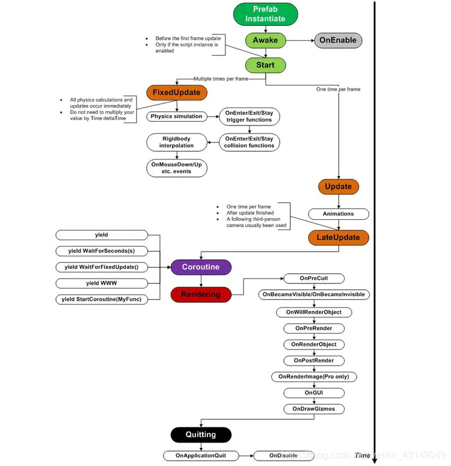
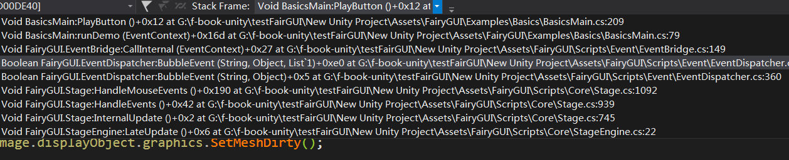
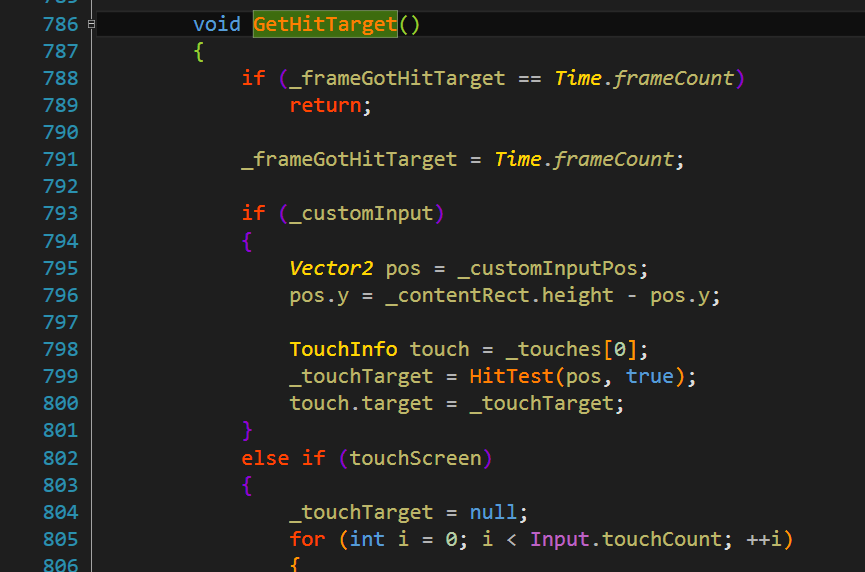
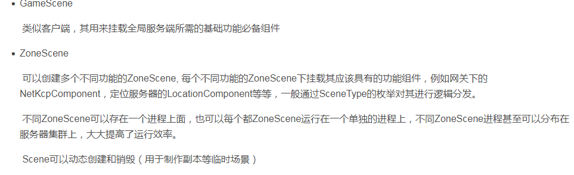
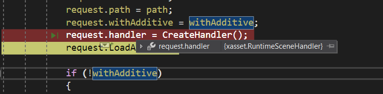
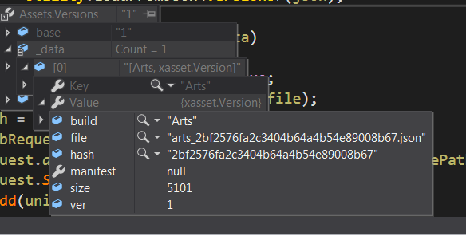
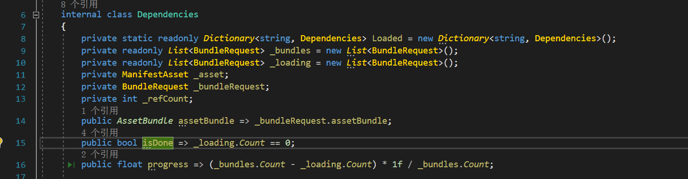

# C#


## 1. C# via CLR

qq:
任何类型都是由Object派生,int32也是,为啥int32是值类型而不是引用类型?
int32定义:


注意,C#编译器默认为任何的struct类型都继承System.ValueType类型,而System.ValueType又是承继于System.Object根类型


首要为什么关于数值类型也能够运用 new 来进行内存分配呢 上面现已讲到,由于他们都是Class类型,当然能够运用new 来进行内存分配.

CLR对继承于System.ValueType的类型在内存分配上区别对待,CLR 经过反射(有待调查)或许其他途径来获悉所要恳求分配内存的类型是否承继于System.ValueType假如是的话,那么就在栈上进行分配,假如不是的话,那么便是咱们所说的引用类型,就在保管堆上分配内存以及栈上分配对应的引用变量,这些一切都是CLR做的作业.


### 1.1. 4章类型基础

System.Object,看NetCore源码


CLR要求所有对象都用new创建


new做的事情：
执行完这4件事情之后，返回指向新建对象的引用；


关于类型安全，CLR在运行时总是知道对象的类型是什么，GetType就可以知道；
CLR不允许完全无关的类型转换，如果出现这种转换，运行时会抛出异常；

is 和as类型转换操作符：
is 和 as都永远不抛出异常，
as和强制类型转换是一样的，转换不成功返回null；
原理就是CLR首先会核实对象的类型，然后遍历继承层次结构，看能不能转换


关于CLR的类型系统
其实，e是一个Employee对象，e.GetType()返回的是这个e所代表的实际类型的类型对象引用(Type对象)
e.GetProgressReport如果是虚方法的话，会调用到e的实际类型对应的GetProgressReport
qq：同步块索引不知道是啥


C#的多态实现，其实和C++是完全不同的，C#的多态完全是受类型对象指针驱动的；
C#的类型对象指针可以知道所有的实例字段，而且可以访问实际类型的信息，以及基类派生链；

C++的动态是由对象里面的虚指针驱动；C++没有反射就是没法知道实际类型的信息；


### 1.2. 5章基元类型，引用类型，值类型
基元类型直接映射到FCL中存在的类型，注意，基元类型string，映射到String，String是引用类型
int映射System.Int32,long 映射System.Int64


字面值比如5之类的，都是System.int32类型

#### 1.2.1. 装箱拆箱

//值类型和引用类型的主要区别
1:值类型在参数传递中是传值方式进行的；引用类型是传引用
2:两个变量赋值,值类型是字段赋值，引用类型仅赋值指针
3:值类型-->System.ValueType-->System.Obejct;引用类型-->System.Object;枚举-->System.Enum
4：值类型比引用类型更轻，因为它不在托管堆分配，没有引用类型的另外两个对象：类型对象指针和同步块索引（这个主要用于线程同步）
5：值类型隐式密封，不可能有类型从它们派生，ValueType重写了Equals和GetHashCode;Equals  用于字段等值的比较


值类型-->object类型：装箱
object类型-->值类型：拆箱

使用泛型的List<T>而不是ArrayList类，是因为可以针对值类型进行优化，不需要装箱和拆箱；


装箱消耗比拆箱要大，
拆箱仅仅获取已装箱实例的未装箱部分，
拆箱之后会接着一次字段复制。
装箱拆箱本身就有一定消耗，而且还会引发GC；


关于装箱拆箱的转型：
先拆为正确类型，再转型；


、


很多类都是通过重载来减少常见类型的装箱


特别看看viaCLR 118页的例子，接口相关问题，struct调用System.Object，System.Value相关方法的问题；
让一个struct实现一个接口，会引发很多问题
比如接口变量必须是对堆对象的引用
IComparable c = p1;如果p1是值类型，那么就要装箱了；

一个struct类型，调用最底层的基类的GetType会进行装箱，是因为在System.Object.GetType定义要求this实参是指向堆对象的指针，CLR必须获取一个引用类型指针才可以调用
一个struct类型，如果重写了ToString，直接调用这个重写的ToString这个虚方法，CLR会特别对待，CLR会生成代码非虚地调用ToString方法，
不会进行任何装箱操作，编译器知道不存在多态性问题（因为通常调用虚方法要访问类型对象指针找到确切类型的方法）
但是如果struct类型没有重写ToString，而且直接调用基类ValueType的ToString，那么就会进行被装箱；

看看这个例子：


再看下这里例子，和接口相关


qq：值类型的字段应该是不可变，不要定义修改值类型的方法？


#### 1.2.2. 对象的相等和同一性：
Object定义了3个虚方法，Equals其中之一；
Equals默认实现，对于引用类型，是同一性，也就是this和obj引用通过一个对象，就相等；
静态方法ReferenceEquals也是判断同一性的；为啥有这个静态方法，是因为Equals被重写后可能会失去同一性；


System.ValueType重写Equals，实现bitwise级别的相等性比较


qq：同样，C#的==操作符如何？


自定义类型的Equals规则：


Object.GetHashCode的内部实现反编译也找不到。。


NetCore里面说它返回一个同步块索引；


为什么重写了Equals之后要重写GetHashCode？


重写GetHashCode规则：


### 1.3. 6章类型和成员基础

特别区分字段和属性，还有索引器


什么叫做公共语言运行时？后面详细研究元数据；


public和internal区别：
public可以在其他程序集访问，internal只能在本程序集访问；

当然可以通过友元程序集来让internal的类被其他程序集访问


这里可以明显看到CLR和C#是完全不一样的；


关于静态类：
静态类是不可实例化的类，用static定义，只能用于类，不能用于值类型struct，CLR要求值类型总是可以实例化


partical关键字：


关于程序集的版本号：


在这里可以看到；


静态方法，非虚实例方法，虚实例方法（也叫虚方法）的区别
IL上的区别，
call指令3个都可以调用，但是对于实例方法和虚方法，要指定变量，call指令不执行null检查；注意，一旦变量为null，可能造成应用崩溃

callvirt指令用于非虚实例方法和虚方法；
对于虚方法，找到对应对象的实际类型，然后以多态方式调用，需要从类型对象指针中进行遍历，然后找到这个实际类型的方法才可以调用，消耗有点大
对于实例方法，调用的是对应对象的变量类型（声明类型），这个比较快；
callvirt要执行变量的null检查；因此安全性更好；
一些特例：


值类型的方法一般用call指令
qq：值类型实例它本身永远不为null？
值类型不能被null赋值的！


JIT编译器有很多优化策略，针对密封类；


精辟。，。


关于类型方法的覆盖：
比如Phone.Dial是实例方法，派生类BetterPhone.Dial也是完全实例方法；
这会导致BetterPhone.Dial覆盖Phone.Dial；


覆盖后，调用phone.Dial最后调用到base.Dial()也是正确是，没有问题

对BetterPhone正确的方法是，加一个new就可以了，不然编译器会warning；
但是仅仅是warning，加不加new其实都没有太大问题，加new仅仅提示，这个Dial和基类没有关系仅此而已


注意C++的重写和C#对重写的处理不一样的。。恶心了这个东西


### 1.4. 7章常量和字段
4种字段


String也是基元类型，注意基元类型不一定全是引用类型的


也即是常量是隐式static；


常量会导致的问题是版本控制问题：
某个dll程序集A仅仅引用了程序集B的常量符号，那么A生成的IL代码中直接嵌入这些常量符号，而不会加载程序集B来提取这个常量符号，
这导致了B的常量符号改变，所有引用B的符号的dll必须全部重新编译才可以，而且CLR不会把程序集B加载到内存，因为IL已经嵌入这个常量符号了；
必须用readonly才可以解决这个问题；


注意，readonly字段可以通过反射来修改；
readonly实例字段可以在实例构造器中修改一次，然后之后就不能再修改了，除非用反射
readonly静态字段可以在类型构造器中修改一次，然后之后就不能再修改了，除非用反射

关于readonly引用，仅仅是引用不变！


### 1.5. 8章方法

默认的实例构造器是这样，这个base()调用的是System.Object的公共无参构造器，这个构造器什么也没做直接返回；


注意有默认构造器的类才可以被创建，static修饰的静态类，编译器不允许它有实例构造器，因此它永远不能被创建，
不要在实例构造器中调用虚方法，
qq：在C++中多态特性会不会起作用，在C#中可能会导致崩溃？


这里特别注意，定义字段时候进行初始化，可能会导致代码膨胀，因为定义字段时候的初始化代码会被嵌入到实例构造器中


解决办法是：


值类型构造器：
值类型不能定义无参构造器，只允许有参构造器；
值类型不允许在定义实例字段时候进行初始化（也即是不允许实例字段初始值设定项）

至于为什么不能定义无参构造器？是因为会出现这种情况，C#编译器干脆禁止了！


必须显示初始化值类型


另外，值类型的有参构造器中，必须全部字段都要赋值；


类型构造器，也称为静态构造器
类型构造器永远没有参数
类型构造器用了线程互斥锁，因此是线程安全的；可以保证类型构造器里面的代码只会执行一次；


类的静态字段定义时候初始化

相当于定义了类型构造器，在IL中会生成.cctor的类构造器方法；这个方法永远是private和static的；


扩展方法：

扩展方法的意义，特别是给无法修改的库的类增加一些方法时候用；


编译器如何识别扩展方法？


如果是扩展方法的话，会有一个下箭头：


扩展方法总结：
必须在非泛型的静态类中声明，类名随意，至少要有一个参数，第一个参数用this标记，静态类必须具有文件作用域，不能是嵌套类；
多个静态类可以定义同名的扩展方法，但是可能有二义性而报错；
扩展方法扩展一个类型时候，也扩展了派生类型，比如不要去扩展System.Object
扩展因为是静态类的静态方法调用，因此用了IL指令call，所有CLR不会对它进行null检查；

可以对一个接口进行扩展，这个感觉比较有用，注意这里只有一个参数，因此实际调用时候是XX.ShowItems


可以对一个委托类型定义扩展方法，其实Action<Obejct>也是一个类型，往里面注入一个InvokeAndCatch<T>方法，这个没问题；


可以对枚举定义扩展方法：


也就是扩展方法具有ExtensionAttribute这个定制特性；


#### 1.5.1. 分部类，结构，接口，方法

关于分部方法
在viaCLR项目中

分部方法的定义


分部方法的实现可以在另外的C#文件中


VS有partial自动补全，列出当前类型定义的，还没有匹配实现的分部方法；


分部方法总结：
分部方法只能在partial类中声明，
分部方法始终返回void，任何参数都不可以用out标记【原因是分部方法可以不存在】。但是可以有ref参数，可以是泛型方法，可以是实例或者静态方法，可以标记为unsafe
分部方法始终是private的，但是禁止添加private关键字；


6.5节


### 1.6. 9章参数


可选参数和命名参数，特别命名参数这个也太少用了；

这里有点奇怪，
后面这个原来是？？空接合操作符


这个是例子，


out和ref都表示传变量的地址进去处理；
CLR不区分out和ref参数，用哪个参数都会生成一样的IL代码，参数的元数据也是几乎一致
C#编译器会区分out和ref参数，
out表示参数由被调用方初始化，返回前必须要写入这个out参数
ref参数由调用方初始化，被调用方使用这个值
注意，使用时候，参数的调用处要写明out XX，ref XX这些词；之所以要用这个，是因为调用者显式表明意图代码能更好立即

通常来说，ref和out用于值类型比较多，是因为值类型是参数传递是以传值的方式；因此大数据会提高性能
但是ref和out如果用于引用类型，那么就像C++的传指针的指针，ref方式你可以修改这个引用指向哪里；
一般这个比较少用；

这个就是交换引用


向方法传递可变数量的参数，lua这个就很有支持了
其实编译器给你做了一大堆事情来生成代码
只有方法的最后一个参数才可以用params，params只能标记一维数组，


也就是参数会有各种定制特性，编译器会充分考虑定制特性来做各种判断和匹配；


### 1.7. 10章属性

知道了属性其实就是针对字段自己写get，set方法的一种改进的机制而已，
即使没有属性机制，也要自己写getset
属性可以看做智能字段， “有逻辑的字段”
编译器会自动帮你生成get_XX,set_XX 方法；而且还会生成元数据，


更简洁的写法，自动实现的属性AIP，也就是不提供get/set的实现，编译器会自动实现get_Name,set_Name方法；


没法调试？qq，可以调试啊，怎么不行。


对象初始化器：

注意Name和Age都是Employee的public 属性；


匿名属性，经常配合LINQ使用，
匿名属性，编译器做了很多事情，其中会为你自动生成一个类：
基本使用：


注意，创建公共只读属性，不能修改，也就是set方法没设置；


System.Turple


有参属性，又称为索引器
其实就是对【】的重载


所引起也是生成代码的，编译器生成一下代码


getset方法一般inline


可以这样提供get，set方法的可访问性；


### 1.8. 11章事件

这里重点立即编译器如何实现事件，同样也是为你生成了不少代码
其实事件本质上就是委托类型而已，比如这个EventHandler<XX>委托类型；


还加入了元数据：


+=符号的翻译，注意是内建了支持，也就是说+=会自动生成对Add_XX的调用，加入对应的委托链之中去；


### 1.9. 12章泛型


### 1.10. 13接口

这里也比较奇怪，每个元素是IComparable类型是什么意思？
qq：


其实接口也必定是是引用类型，但是如果被值类型赋值，那值类型只能装箱了；


这个更甚，运行时可以把接口从一个转变成另外一个，但是必须保证对应的引用变量的确切类型实现了这两个接口的方法；


#### 1.10.1. 隐式和显式接口方法的实现

qq：关于类型对象的方法表


### 1.11. 14章字符和字符串
#### 1.11.1. String
    public sealed partial class String : IComparable, IEnumerable, IConvertible, IEnumerable<char>, IComparable<string?>, IEquatable<string?>, ICloneable

System.Char是16位的，注意它是值类型，


System.String,


字面值字符串会存储来模块的元数据，这个和C++那些存储在静态区差不多把；


qq：为什么C#可以有char*这些东西？不是没有指针了，看了NetCore的String源码，这是属于不安全代码？？


是的，的确就是不安全代码，你看NetCore的IntPtr.cs就看到，其实IntPtr就是代码一个void指针，一般64位系统是65位指针了！


String类不允许new，
要用Stirng s = “111”；这样写；

构造字面值字符串用特殊的IL指令


这里要特别注意了，Sring连接会有太多临时堆对象；


逐字字符串@


注意很多String的API都会返回临时字符串的引用，也就是造成很多GC了；


String类的特殊性，CLR和String紧密结合


String的相等性比较和排序

相等性比较


也就是说多用这些API，
Equals执行普通序号（Ordinal）比较


comparisonType是这些枚举，选Ordinal就可以用，忽略指定的语言文化比较；


字符串的留用（Intern），这个别用了，有坑的！


其他字符串操作的API：


#### 1.11.2. StringBuilder
关于StringBuilder，注意，它不是基元类型，普通的引用类型而已；代表可变的字符串，

StringBuilder-->ISerializable

字段有：
        internal char[] m_ChunkChars;//字符数组，表示已经使用的字符数。
        internal StringBuilder? m_ChunkPrevious;
        internal int m_ChunkLength;
        internal int m_ChunkLength;
        internal int m_MaxCapacity;//最大容量，默认Int32.MaxValue,20亿
        internal const int DefaultCapacity = 16;//默认容量为16，
        internal const int MaxChunkSize = 8000;


StringBuilder方法总结：


一般用法：


结合String和StringBuilder的使用，这是因为StringBuilder没有ToUpper，Trim之类的方法；


关于ToString
这是Object的无参数，public，virtual的实例方法，默认返回对象所属类型的全名，很多核心类型都重写了ToString，比如Byte，Int32


#### 1.11.3. 其他内容


String.Format和StringBuilder.AppendFormat也很常用


关于Parse，从字符串得到它的对象表示；很多类型都定义了static Parse函数；


字符串的编码和解码，s有9个字符；每个字符都是一个unicode字符，占据两个字节


安全字符串SecureString
位于非托管内存的，而且很多操作都涉及到加密和解密


### 1.12. 15章枚举


枚举类型是强类型并且是值类型，可以定义“符号名称/值”的配对
XX-->System.Enum-->System.ValueType-->System.Object


枚举类型定义的符号是常量值，不能是字符串；


Color枚举相当于被编译成，注意这是编译器的伪类型，System.Enum是抽象的；用户没法从System.Enum自己定义派生；
public abstract partial class Enum : ValueType, IComparable, IFormattable, IConvertible{。。}


因为枚举类型定义的符号是常量值，总有一个类型，用户可以指定，一般默认是是int；
这个叫做枚举类型的值的基础类型，可以通过Enum.GetUnderlyingType来获得；

NetCore实现是这样，

最后调用到System.Type.GetEnumUnderlyingType


typeof(XX)是获取某个类的类型对象(Type对象)；引用类型都存在一个类型对象指针，就是指向这个东西了；


枚举类型的ToString方法，G表示General，常规格式


Format方法可以直接知道某个枚举类型，值为X，对应的符号是什么，用“G”格式化这个符号


返回枚举中所有符号和值，GetValues获取的是一个枚举实例的数组；


可以定义一个泛型方法就不用强转了！


枚举的Parse和TryParse方法：


直接通过一个字符串来获取一个枚举实例，字符串可以是用户输入的；


IsDefined总是执行区分大小写的查找；


关于位标记


这个方法很常用，可以自己定义的，注意必须要标记这个Enum类型的定制特性为【Flag】，表示它是一组位标记；
调用对应枚举实例的ToString方法会输出所有的标记组合


也就是说，ToString会这样实现


qq：这里为甚要装箱，Enum是抽象的值类型


向枚举类型添加方法，只能是扩展方法了；


### 1.13. 16章数组


数组的字段
Rank属性表示这个数组的维数；


一般用法如下：
1维到N维数组都是 type [,(1到n个),]来声明
交错数组用type[][][]..;来声明；
new []{...}数组初始化器来创建匿名数组；


qq：关于数组的转型
特别是Array.Copy方法，具有协变性，    注意它仅仅是浅拷贝，对于数组的引用也仅仅拷贝引用而已；


qq：关于数组的返回值


动态创建数组Array.CreateInstance
这里也比较奇怪，Array类不是抽象类吗？o知道了
看看ArrayIntro这个Demo，CreateInstance之后返回的是elementType[]这个数组，所以强制转换是没问题的；

注意，如果Array.CreateInstance 返回的是1基或者其他基，那么数组的类型变成来elementType[*]


#### 1.13.1. unsafe和fixed
使用unsafe需要标记下：


unsafe code和 managed code区别
本质区别可以说，unsafe用了指针；


unsafe基本使用如下
unsafe标记可以用于类，方法，以及代码块在确定不安全上下文；在不安全上下文中可以使用不安全指针；


qq：不安全上下文中，为啥需要使用c#的fixed语句解析？
答案是：


fixed指针的基本用法：


指向堆内存中的指针，必须用fixed进行固定；引用对应的地址值会在GC的内存压缩期间会被重定位；


用C#的stackalloc语句在线程栈上分配数组，只能创建1维0基，由值类型元素组成的数组
注意，栈中的对象不需要用fixed，因为栈中对象不归CLR管理；


### 1.14. 17章委托
委托本质上是提供了一个类型安全的回调函数功能而已
C++那些回调指针不是类型安全的；


这样声明
internal delegate void Feedback(Int32 value);
qq：internal修饰符表示什么？


绑定到静态方法，只需要构造一个Feedback类型的实例，并且绑定到某个静态方法；

new Feedback(DelegateIntro.FeedbackToConsole)；


绑定到实例方法，注意，new了一个委托之后，这个委托有一个target字段，引用到了这个DelegateIntro对象
di = null也没事，因为这个委托仍然引用这它，不会被GC；
DelegateIntro di = new DelegateIntro();
new Feedback(di.FeedbackToFile)；


编译器和CLR如何协同工作实现委托？

上面声明的委托Feekback，实际上一个类，dnSpy打开

找到这里，因为Feedback的签名是：void（Int32）；所以生成的委托类的Invoke的签名也是一样的；
注意Feedback的第二个参数是一个System.IntPtr，这是一个内部的整数值，CLR用它来标识要回调的方法
比如上面的DelegateIntro.FeedbackToConsole或di.FeedbackToFile会被当做一个void*（C#编译器会分析元数据获取）传给这个委托；
赋予委托类的target和mehtodIntPrt字段，
Feedback-->MulticastDelefate-->Delegate-->[Object,ICloneable,ISerializable]


qq：System.IntPtr的字段被隐藏了？它只是一个void*而已；


注意，DelegateIntro.FeedbackToConsole这样的东西表示从元数据获取的一个token，
qq：这个就比较难懂了，编译器通过反射找吗。。


所以上面的Feekback委托实际上是一个嵌套类

当然可以全局定义一个委托；


关于MulticastDelegate:


看一下MulticastDelegate委托的构造器，注意，重载符号+=和-=这里是看不到的，因为编译器会自动生成（内嵌到IL？）。
重载符号+=和-=实际上调用到Delegate.Combine和Remove；
注意你是没法创建


Delegate类：


关于委托链的实现细节：
这里大概知道有invocation这个链表保存所有委托就可以了！


可以从MulticastDelegate中访问委托链，显式调用每个委托


注意，系统自动定义了很多泛型委托类型

如Action和Func
Action委托没有返回值，Func委托有返回值，返回值是最后一个泛型参数


关于Lambda表达式，其实编译器会在lambda表达式所在的类中新建一个私有方法，lambda表达式的代码体就是这个方法了！
有<>之类的都是编译器生成的方法；CLR允许这些符号，编译器不允许程序员定义这些符号；


Lambda表达式，单行的话，返回值就是整个表达式的值；


多行的话，必须手动指定；


363页代码：这里说明了，Lambda引用外部变量会让编译器构造出嵌套辅助类；
如果Lambda表达式引用了Lambda表达式外面的变量，那么编译器不会为Lambda生成一个私有方法，而是会生成一个辅助嵌套类（密封私有），里面再生成一个方法；
把这个私有方法构造一个WaitCallback委托实例，再传给ThreadPool.QueueUserWorkItem
这样注意一点，引用外部变量的Lambda，可能会造成外部对象GC时间被延长了；


具体是这样构造嵌套辅助类


AClass被改造为：
这里N个线程都执行同一个委托方法，也会访问相应委托类的状态数据；因此numToDo要上同步锁；


委托和反射


### 1.15. 18章定制特性


定制特性可以应用于哪些元素？


通常来说那个前缀可以省略的，编译器可以自己推断；


定制特性本质从System.Attribute派生的类型实例；


这里注意，定制特性最终写入目标元素的元数据表几率项之中


定制特性主要作用是影响运行时的程序代码行为；
比如具有Flag定制特性的枚举类型的ToString方法和没有Flag定制特性的ToString方法就不一样了
NetCore中，具有Flag定制特性的枚举类型的ToString方法最终会调用到InternalFormat，然后通过反射获取EnumInfo
看看有没有Flag标记


qq:从代码层次研究下，如何判断某个目标元素是否应用了某个特性，（检测特性的存在）p379 页


### 1.16. 19章可空值类型

值类型永远不为null的原因是，值类型是分配在某个函数的栈上的，
在这个函数的作用范围内，这个值类型实例永远都是存在的，只有离开了栈，这个值类型实例才会被销毁；
也就是没法手动销毁，也不会进行GC；


关于Nullable的实现
qq：NetCore中这里的implicit表示什么？这个操作符表示什么？还可以用lambda表达式来写？


qq:internal表示什么？default(T) 什么意思？


用法：
qq： Nullable<T>的实例  = 5是什么意思？是用5来构造一个Nullable<Int32>  实例吗？


这样的话，这里value为5，因为T被约束为struct，这个没错；


qq：但是 Nullable<Int32> y = null这个就不明白了，
this.value = null;其中value是T类型也即是Int32类型的；编译不过把、
这里知道什么意思了，Nullable<Int32> y = null；其实就是说用null来初始化这个Nullable<Int32>值类型实例；
但是用null时候，编译器不会真的调用构造函数，而仅仅是初始化一个hasValue为false的Nullable<Int32>实例而已


这里总结下可空值类型，也就是扩展了一下值类型，它可以表示null；表示未初始化，不存在值，它编译器和CLR都尽量地让它的行为和原来值类型一致；


空接合操作符？？它本质上就算是？：


也就是代码写得更加舒服了
如果我要优先地求出N1，N2，N3，最后都不行就用null，有用switch-case感觉；
这个东西可以说是switch-case的简化版本；


对可空值类型进行装箱特殊对待：


可空值类型的拆箱，这里注意下，null拆箱为Int32竟然会引发异常；


### 1.17. 20章异常

一般原理，


一些原理，通常不要再抛出异常了在catch块。。


finally代码块这样用：


注意，finally和catch块应该尽可能短


未处理的异常会导致CLR终止你的进程


这种情况怎么搞？C#调用C++的代码，C++处出现了异常，在非托管代码处出现异常，CLR肯定没法捕捉到这里异常；、
。。不用管这里了


对调试有用的，抛出位置和捕捉位置的stackTrace，堆栈溯源；


qq：还有这种异常捕捉方法？？


原因是这个：


qq：定义自己的异常类，这个以后研究吧，p412


p418页
qq：虚属性？？

Monitor是线程相关的类，后面再说吧；xlua里面的源码也涉及到；p421页


p424：对finally块的简化编程；


异常的代价：


这里。。


CER：约束执行区域


### 1.18. 21章托管堆和GC


这里也就是说托管堆的一大作用也就是减少cache miss（cache友好）


CLR是怎么进行GC的？引用跟踪算法
注意一个概念，所有引用类型的变量都称为根；


compact阶段这里就是cache友好的方式，


基于代的垃圾回收：
0代，1代，2代


qq：这里C#的Timer和Unity的update之类的区别，以及定时调用可以用Timer吗？
Tiimer实现如何？


注意，这里内存压缩最重要的影响就是不安全代码的使用，unsafe上下文下的代码操作指针的，必须用fixed来固定这个指针；


这里重点看看强制垃圾回收：


Finalize方法；称为终结器方法，在GC前调用
具体原理比较复杂，p479页


### 1.19. 22章CLR寄宿和AppDomain


### 1.20. 23章程序集加载和反射


### 1.21. 26到28异步相关


### 1.22. 29章基元线程同步构造

基元用户模式构造


基元内核模式构造


混合构造定义


两种基元用户模式构造：volatile construct（易变构造）和interlocked互锁构造
作用是针对简单数据类型的一个变量进行原子性的读和写；


易变构造，注意易变构造还会禁止C#和JIT编译器不将字段存储在CPU寄存器中，


一个例子，两个线程同时对两个int32字段进行读取和写入的错误，
也就是读取线程因为读取自寄存器中的数据，而且此时ram中的数据早已改变，所以会造成数据不一致；


必须改成这样才行，首先


volatile关键字：


volatile对性能影响


关于Interlocked，其实也是原子性地读取和写入简单变量


常用API：


具体研究下这个interlocked用法：


内核模式构造
主要是事件，信号量，互斥体，，看window核心编程


### 1.23. 30章混合线程同步构造

这里重点关注Monitor的使用方法即可；


### 1.24. 其他问题

qq：foreach一个IEunmerable的变量，C#编译器如何翻译的？
这个是关于枚举类型
这里看下NetCorePractice项目的testIEmu.cs
FruitShop实现了IEnumerable，表示它是"可枚举的"，可以调用它的GetEnumerator得到一个IEmumerator对象；
而任何Emumerator对象都实现了Current属性和MoveNext方法来得到当前元素和下一个元素，所以foreach里面就是这样调用
FruitShop-->[IEnumerable]
FruitEnumerator-->[IEnumerator]

foreach调用转化，

foreach可以转化为这种调用：


关于yield的实现
再看C# in depth的例子，在testiEnum也有，
看一下这个方法，和普通的方法行为是完全不一样的，这里MoveNext相当于驱动器，驱动代码的yield return 之间的代码执行；
1：IteratorWorkflow.GetEnumerable()不会去执行里面的代码，只是返回一个IEnumerable<int>对象；
2：bool result = iterator.MoveNext();会从上一个yield return i 后（或者从开始）执行到下一个yield return j（或者最终结尾）；result是yield return j的j；
3：MoveNext执行过程中执行到了GetEnumerable结尾，那么就会返回false，这时候整个方法才真正结束；


4：GetEnumberable返回的是一个IteratorWorkflow.<GetEnumerable>d_1 类型（编译器生成的），下面的iterator也是这个类型；


yield break的用法，注意如果foreach过程中，迭代器的MoveNext遇到yield break，就会返回false，直接终止执行；


qq：关于如果在迭代器中具有try-catch块会发生什么？
这个其实就是说，调用iterator.Dispose就会引发迭代器中final块的执行；


qq：编译器如何生成代码实现？
iterable和iterator都是IteratorWorkflow.<GetEnumerable>d_1 类型，这个类同时实现了IEnumberable<T>和IEnumerator<T>
也就是说这个嵌套类实现了5个接口（具有MoveNext，Dispose，Reset，GetEnumberator,Current）
MoveNext是一个很大的switch结构，初始状态是0，每次switch都会进入下一个状态，因此每次MoveNext都会执行不同的代码块；
这里立即yield这个东西其实是一个语法糖而已，它完全就是为了让编译器生成代码更加方便；


qq：另外，如何终止迭代？
yield break；上面说了


qq：如何执行finally块？
foreach生成的代码正确处理了，在迭代器中使用using也是很常用；


#### 1.24.1. 迭代器块的应用

迭代器块遍历文件所有行，
这里其实用迭代器块可以遍历处理任何集合，注意using语句，相当于一个try-final块；


迭代块也可以用于属性的，


另外，迭代器配合LINQ才是最好的；


再说一下Unity的协程编译器生成的嵌套类，运行时获取这个实例，然后每帧调用MoveNext就可以了
Unity脚本的Start，如果返回IEnumberable，那么Unity内部会以协程方式启动这个Start；


### 1.25. 其他暂存


#### 1.25.1. 并发和异步

Thread:

Start,Join,Sleep,
注意,无法从Join中得到返回值;


线程阻塞的情况:Console.ReadLine的IO事件,调用Sleep,Join等待其他线程完成导致自己阻塞;

传递数据到线程:可以用Lambda,注意Lambda捕获的变量,注意捕获的是引用;

前台线程和后台线程:看时候设置isBackGround属性;

主线程退出,但是还有前台线程活跃,程序不会退出,
如果主线程退出后没有前台线程,之后后台线程,后台线程也会退出,app退出

线程之间的通信:signal信号

线程池:
通常是后台线程,线程池中的线程不要阻塞,不然CLR会误认为它占用大量cpu,而注入很多新线程,导致cpu超负荷(称为线程过载);;
池化线程适用于非阻塞短计算密集任务;

Task.Factory.StartNew(()=>...,Task.CreationOptions.LongRunning)
生成一个非池化线程来创建长任务(长阻塞IO);

Task:
Task.run从线程池中启用一个后台线程;
Task.Wait:阻塞直至任务完成;

Task<TResult>是一个继承Task的泛型子类;
返回值Task.Result(使用前要用Func<TResult>代理或者兼容的Lambda):访问它的话,如果任务未完成,就会阻塞直到完成;


Task可以抛出异常,会自动传递到调用Wait或者访问Task.Result的代码上;


延续:任务完成后的后续操作;
GetAwait()返回一个等待者对象(awaiter)
awaiter可以是任务对象,但是必须有onCompleted,GetResult方法Boolean属性;


qq附加延续


TaskCompleteSource:
适用于IO密集并发性,计算密集并发性用Task.run直接真线程;
它的真正作用是创建一个不绑定线程的任务(也就是他是伪并发),比如利用定时器Timer;

Task.Delay静态方法,其实用定时器和TaskCompleteSource对象实现;


async 和await(基于TaskCompleteSource实现,编译器会扩展很多代码)

async只能应用到返回void,Task,Taks<TResult>的方法上;


异步lambda表达式;


取消令牌:


同步完成:


#### 1.25.2. 关于C#的异步
C# in depth接续:
await之前断点:


await之后的断点:正在恢复异步方法..


关于Task.Yield


关于Task.Delay


关于TaskAwaiter:
TaskAwaiter 表示等待异步任务完成的对象并为结果提供参数。


关于延续的两种:

.ContinueWith()  跟  .ConfigureAwait(false)  还有一个区别就是 前者可以延续多个任务和延续任务的任务(多层)。后者只能延续一层任务(一层可以有多个任务)。


关于ConfigureAwait:


关于SynchronizationContext


#### 1.25.3. using语句
两大作用,
一对于资源型对象(必须有IDispose接口),的使用,用完后自动释放
二是using头部的代码即使发生异常,仍然可以安全释放;


在C# via CLR中,第236页,甚至using可以用于计时;


关于程序集(Assemly)

类型元数据包含?


程序集mscorelib.dll包含C#基本类型和大部分.NET语言基本类型的定义

同一个命名空间中的类型可能在不同程序集中实现;
单个程序集也可以包含不同的命名空间的类型;

也即是using指令仅仅是说,我要用这个命名空间的东西,
但是必须要把对应的程序集加到引用上去;


CLR的类型系统?类型对象指针和实例对象的关系?IL和JIT的关系?


86页注意:
B b3 = new Object();//为什么是编译时错误?
原因是,基类向派生类的转换必须是显示类型转换,也即是B b3 = (B)new Object()
可以通过编译,打单室运行时一定出错;
类似于C++的声明的类型和实际类型;


基元类型:int,double等等对应某个Framework类库(FCL)类型;
int,bool,decimal,timespan,dayofweek,fileAttributes,fontStyle都是值类型;


注意,
Byte b = 100;
checked(b+100):b和100首先会转换成32位数;


#### 1.25.4. 常量和字段
常量总是隐式为static

 注意,程序集A用到的常量如果来自程序集B,C#编译器在程序集A直接把常量嵌入到了IL代码里面;而不会加载程序集B;所以各个程序集共享的常量用readonly;

readonly字段只能在构造器方法中写入,而不会被任何方法写入(编译器会检查)
可利用反射修改readonly字段;
注意readonly引用字段,不可改变的是引用,而不是引用的字段;

字段的内联初始化,只是语法的简化,本质上是写到了构造器上/


                                                                                                                                                                                                                                                                                                                                                                                                                                                                                                                                                                                                                                                                                                                                                                                                                                                                                                                                                                                                                                                                                                           
类型构造器?


#### 1.25.5. 方法

 重点关注ref 和out
C#对ref 和out基本一致,但是编程时候,out通常表示a需要重写(更多表示他未初始化)
ref表示该变量已经初始化;
void getVal(ref Object a);

void getVal(out Object a);

对于值类型,ref和out传值是传指针;否则就复制整个值实例到被调函数的栈帧中;


引用类型传的也是引用,标记为ref也是传引用,有什么不同?


注意lambda表达式的原理,p364页

C#编译器在lambda所在的宿主类中生成一个密封私有类,
lambda代码体就是这个密封私有类的一个方法中;
然后在lambda使用处,就是替代为new一个委托;委托的target就是这个密封私有类的实例;
对于的method就是那个方法;
而且这个密封私有类会定义所有引用的类型;而lambda委托引用这个密封私有类实例;
因此只有当这个密封私有类的实例被销毁时候,对应于宿主方法的变量才会销毁;

间接的说,就是lambda引用的变量,生命周期会延续到lambda结束之后才会被垃圾回收;


#### 1.25.6. 计算限制的异步操作

线程的执行上下文


协作式取消和超时


任务:


任务调度器;'


#### 1.25.7. IO限制等等异步操作

await之前的代码由一个线程执行,之后的代码可能由其他线程执行;


关于异步的实现,C# in depth中的讲解:
在await前断点时候的调用栈:


看到Resume Async Method,恢复这个方法..


例子分析:
Method1Async返回的task,执行GetAwaiter,在里面会开启一个新线程A来执行这个task;
此后,主线程和新线程A会并行执行了;


注意,Method1Async返回的task,实际上是状态机的builder的task;
状态机的builder的task;
这个task对应的委托就是状态机的moveNext方法,里面的代码包含用户代码;
在里面会调用GetAwaiter来开启新线程来执行任务,如果没有完成,则告诉新任务,
执行完成后回来继续执行moveNext方法;

这个状态机这个东西是多个任务共享的;


#### 1.25.8. AppDomain和CLR基寄宿
mscoree.dll:垫片dll,用于加载特定的clr版本;
clr.dll:某个clr版本的实现


#### 1.25.9. 程序集加载和反射


typeof早期绑定,Object.GetType是晚期绑定;
注意,类型对象在执行之前就已经由CLR管理起来了;所以typeof返回类型对象的引用

                                                                                                                                                                                                                                                                                                                                                                                                              TypeInfo类型对象


## 2. 果壳C#


### 2.1. LINQ


Language Integrated Query:语言集合查询，


针对实现IEnumberable<T>接口的对象；
System.Linq的Enumerable类里面实现了大量查询运算符的静态扩展方法，所以可以直接针对IEnumberable<T>接口的对象调用Where，Select
因为很多操作符都返回IEnumberable<T>接口（而且是一个新的引用对象）；因此可以连续性地调用；

运算符流语法：


查询表达式：


qq：这个针对值类型吗？
不可能，值类型可以实现IEnumberable<T>接口？


常用的查询运算符：
Where用于筛选;
OrderBy用于排序，默认是从小到大排序
Select用于将集合转换或者映射成Lambda表达式中的指定的形式；


Take,Skip,Reverse


 这些查询运算符返回一个元素


这些查询运算符返回bool，
Any（precade）：表示是否有元素符合判断式；


集合的连接


类似SQL的查询表达式，from子句开始，最后以select子句或者group子句结束，也就是select或group是在第三位置出现的；
位置不能颠倒，也就是有些局限了；


编译器把这段查询表达式编译成这个，n是一个lambda表达式的范围变量而已，可以把n看成代指集合中某个元素；


延迟执行：


什么时候延迟加载：


例子是：


注意延迟执行中，lambda引用的是外部变量，外部变量变了，那么延迟执行结果也会变，一般用ToList之类让他立即执行；
注意，引用的或者说捕获的外部变量都是以传引用方式捕获的，即使是值类型也用ref 方式；


捕获的变量都是引用，容易造成以下问题：


注意，延迟执行的原理是构造一个“对象处理模型”。。


每一层上传给上一层的都是经过筛选的；


查询里面插入查询---子查询
这里是找出字符串长度最短的字符串；


注意效率问题，一般不要这样写，name.Min(n2=>n2.Length)这个子查询要执行很多次
需要这样写：


Into关键字：
只能出现在select和group之后，会重新创建一个新的查询，


多层查询：


对象初始化器，这里其实就是select的返回值T的T就是IEnumerable<T>的T


匿名类型：


let关键字：


再比如：


#### 2.1.1. LINQ运算符


SelectMany：


#### 2.1.2. LINQ自己总结

LINQ体系太庞大了，其实很多都是集合与集合之间的运算；先不接触数据库部分；

这里核心要注意下，Where，OrderBy，select都是扩展方法，而且返回的都是IEnumerable<T>引用
这里就是，LINQ的延迟执行，核心就是IEnumerable<T>本质上就是延迟执行的；
除非你调用它的MoveNext方法，否则它不会执行里面的代码块；


### 2.2. 正则表达式


Match对象的属性


找到所有匹配值：


模式中的交替符；


### 2.3. 高级线程

这本书总结得比较好，算了，还是看C#via CLR

排它锁：lock，先到先得。


lock是Monitor.Enter和 Monitor.Exit的简写
这里是C#3.0转换lock语句方式；


C#4.0和C#5.0转换上面的lock的方式；


也就是说，Monitor.Enter会修改这个lockTaken，如果Enter抛出异常，锁获得了，那么lockTaken为true，finally方法中释放锁；
避免锁泄漏；


## 3. NetCore源码研究


### 3.1. 集合总结


泛型和非泛型接口关系不用纠结了，直接用泛型，不要用非泛型；

下面是一些接口的关系
 IEnumerable<T> -->IEnumerable,只有这个版本的泛型继承非泛型接口
 

 ICollection<T> -->IEnumerable<T>，可以成为可计数集合标准接口；
 
 

IReadOnlyCollection<T>-->IEnumerable<T>


 IList<T>-->[ICollection<T>,IEnumerable<T>]，可按位置索引标准接口


 IReadOnlyList<T>-->IReadOnlyCollection<T>


IDictionary<TKey, TValue>-->[ICollection<KeyValuePair<TKey, TValue>>,IEnumerable<KeyValuePair<TKey, TValue>>]
字典其实表示这样特性的集合，注意，字典可以采取不同的数据结构来实现的；
元素必然是key/value对；
可以增加一个key/value对；
可以根据key移除key/value对；
询问某个key是否存在；
根据某个key得到value；TryGetValue，这个很常用；
禁止加入重复的键，也就是执行两次[key-value1,key-value1]会抛出异常；执行两次[key-value1,key-value2]也会抛出异常
字典可以分有序字典和无序字典；


ISet<T>-->[ICollection<T>]
集合的运算，类似数学上的并，交，差，等等；


IReadOnlySet<T>


#### 3.1.1. IDictionary的实现类

这是对比，基本上只需要用Dictionary<K,V>和SortedDictionary<K,V>就可以了


##### 3.1.1.1. Dictionary

重要的私有成员


内部结构体Entry：


-------------------------------------------------------------------------------------------------------------------------------------------------------------------


Add函数，进一步调用到TryInsert(key, value, InsertionBehavior.ThrowOnExisting)


这段代码的语法？？
ref Dictionary<TKey, TValue>.Entry ptr = ref entries[num3];


test.Add(4,"4")执行完后，
_buckets的值是这样


_entries[0]的值是这样；


_buckets[4]为什么被设置成1？
原因是这里，ref int bucket表示对_buckets某个int的引用，
ref this.GetBucket(0)返回对_buckets[3]的引用，为甚是_buckets[3]？是哈希算法计算出来


执行到这里时候，bucket也就是_buckets[3]被赋值为1了；


GetBucket实现


HashHelpers.FastMod实现，这是算法是num.GetHashCode()%7=4

这个是dnSpy反编译的代码：


实际源码是这个：
可以看成是


64位时候执行FastMod
它说实现相当于这个： (uint)Math.BigMul(multiplier * value, divisor, out _)


继续研究         
test.Add(11, "11");
发生了什么？


qq：一个int和uint比较发生什么？
有符号数会隐式转变成无符号数再进行比较的；


一个数组的Length是一个有符号数，int Array.Lenth{get;}


qq：dnSpy反编译后的代码好像不对啊
这里比较奇怪，源码中i是无符号数，这里是有符号数比较。。而且还不通过，当i是-1时候；
当然和源码不能一一对应之外，而且有符号和无符号数比较好像完全乱了。。
算了，有时候估计要研究下IL，现在先不着折腾，留个疑问；


插入了11时候，这里执行了几行代码，
bucket是引用自buckets[3]这个int，这个bucket的值是1；
反编译的num3，也就是源码的index，执行到11时候此时_count为1，因此index为1，所以num3位1；
ptr引用的值是entries[1];
num的值是11，这个是源码的hashcode，由这计算：uint hashCode = (uint)((comparer == null) ? key.GetHashCode() : comparer.GetHashCode(key));
key和value是int值11和“11”
next为0；也也就是指向当前bucket前面的桶；
然后bucket变成了num3+1 = 2；


执行完成后变成这样：


再看执行test.Add(18, "18");哈希计算后，映射到第4个Bucket
因此反编译的bucket引用bucket[4]，此时这个bucket的值为2，因此前面插了两个了，
这个bucket映射到entries[bucket-1]，也就是entries[1]
hashcode（反编译的num）计算出来是18，
i = bucket-1也就是桶2对应的Entries的index，所以i是1；
这里的作用其实就是从Entries[1]开始寻找，看有没有找到对应的key，找到就重新覆盖写入，找不到就跳出来（当i为-1时候跳出来），


因为是找不到，因此跳到下面去；
num3（index）被计算出来2，因此有已经有两个元素了
开辟新的桶，这里对entries[2]进行开辟，
放进去key和value，next为1指向前一个entries[1],
bucket引用的bucket[4]原来计算为2，现在变成了3；


注意，上面key为4，11，18哈希计算都映射到4，也即是第4个桶，第四个桶的值为x，则表示去entries[x-1]找到这个桶的所有元素！
但是究竟有多少个元素映射到第四个桶，单向遍历一次直到某个entry的next为-1就知道了；


执行再看执行test.Add(19, "19");哈希计算后，映射到第5个Bucket
此时this._bucket[5]的值为0，表示取entries[-1]处找元素，也暗示了这个桶没元素
此时的count为3，因此开辟新的桶entries[4],里面存放[19,"19"]内容，entries[4]的next指针赋值为this._bucket[5]-1也就是-1
然后this._bucket[5]的值被赋值为4，表示它映射到entries[4]，去entries[4]找这个元素把！
这里就是解释了为什么ptr.next = bucket-1表示设置指针，bucket-1就是表示entries找元素的入口；


再次执行test.Add(26, "26");的结果是什么？


这里可以总结下，
插入一个元素，需要用哈希计算映射到某个桶索引bucketIndex，
通过桶索引可以知道桶对应值为this._buckets[bucketIndex]，这个是entries数组的入口，可以看做是一个链表，里面存放了所有映射到同一个bucketIndex的元素；


Remove元素如何？
比如执行test.Remove(4);
首先，while循环从entries[2]入口寻找这个元素，直到找到entries[0]就是这个元素，
然后开始修改，
entries[0]的前继entries[1]的Next修改成-1；
entries[0]因为被remove了，所以Next变成了-2；表示
重置entries[0]的key和value；
this._freeList设置为0，表示空闲的entry的入口
this._freeCount增加1；
this._freeList会形成一个空闲链表的；


这个freeList在添加元素时候，优先添加到这里：


另外，TryInsert处理值类型和引用类型是不一样的，看一下


再看看扩容：其实就是重建Hash链条而已；


关于Hash算法：


##### 3.1.1.2. SortedList<K,V>


##### 3.1.1.3. ListDictionary

ListDictionary-->[ICollection,IDictionary, IEnumerable]


##### 3.1.1.4. OrderedDictionary
OrderedDictionary : [ICollection,IDictionary, IEnumerable, IOrderedDictionary, IDeserializationCallback, ISerializable]


##### 3.1.1.5. Hashtable


##### 3.1.1.6. SortedDictionary<K,V>


##### 3.1.1.7. SortedList


#### 3.1.2. List<T>

List<T>-->[IList<T>,IList,IReadOnlyList<T>]
注意Insert是在前面插入；


qq:out T?


有一个T[] _items;
Add操作就是往里面塞一个而已！

List的IndexOf方法是关键，它返回找到的第一个元素的索引。
实际上调用的是Array的静态方法 Array.IndexOf(_items, item, 0, _size)；

关于Remove方法，先用indexOf方法找，找到了之后再调用RemoveAt(index)来后向覆盖地remove，因此remove性能比较低；最坏情况是线性；
如果经常需要Remove元素就用LinkedList双向链表把；


看一下Find方法相关的函数
主要是Find，FindIndex，FindLast，FindLastIndex；


排序相关的函数：
Sort，根据自己传进去的IComparer<T>对象；看那个顺序比较器就可以了；


#### 3.1.3. LinkedList<T>
LinkedList<T>-->[ICollection<T>, ICollection, IReadOnlyCollection<T>, ISerializable, IDeserializationCallback]

用于经常Remove元素的情况，链表是属于cache不友好的数据结构了；

添加节点方法：

删除节点方法

其他方法：


#### 3.1.4. Queue<T>
Queue<T>-->[IEnumerable<T>,ICollection,IReadOnlyCollection<T>]


#### 3.1.5. Stack<T>
Stack<T>-->[IEnumerable<T>,IReadOnlyCollection<T>,ICollection,IEnumerable]


#### 3.1.6. Array
Array-->[ICloneable, IList, IStructuralComparable, IStructuralEquatable,ICollection,IEnumerable,System.Obejct]
注意，Array类型是抽象类型,因为继承Object，因此始终是引用类型

注意，var arr = new int[10];arr就是隐式继承于Array的；


一位数组，多维数组，交错数组都隐式继承于System.Array；也就是说是一个派生Array的类，可以这么理解；


注意下这里的区别，intArr和arr都是引用，new XXX表示在返回托管堆中数组对象内存地址；
new XXX的XXX如果是值类型，那么数象直接内嵌全部值类型实例了
new XXX的XXX如果是引用类型，注意，引用初始化为null


qq：如何知道一个数组的维数？


#### 3.1.7. BitArray
注意，BitArray存储布尔值的；
BitArray -->[ICollection, IEnumerable, ICloneable]


#### 3.1.8. 集合类

把元素放进去set之后，不能通过任何方法去找到其中一个元素的位置，因此会比较少用了；


##### 3.1.8.1. SortedSet
SortedSet<T>-->[ICollection<T>, IEnumerable<T>, IReadOnlyCollection<T>, ISet<T>, IReadOnlySet<T>, IEnumerable, IDeserializationCallback, ISerializable]
SortedSet按照一定顺序保存元素；


实现是红黑树


##### 3.1.8.2. HashSet
 HashSet<T>-->[ICollection<T>, IEnumerable<T>, IReadOnlyCollection<T>, ISet<T>, IReadOnlySet<T>, IEnumerable, IDeserializationCallback, ISerializable]


基本API：


实现是只存储Key的散列表


#### 3.1.9. String
不可变类，看C# via CLR


#### 3.1.10. StringBuilder


#### 3.1.11. Conllection<T>
NetCore5.0的实现；
Collection<T>-->[ICollection<T>, IEnumerable<T>, IList<T>,IReadOnlyCollection<T>, IReadOnlyList<T>, ICollection, IEnumerable, IList]

注意Conllection<T>是用List<T>作为底层结构的；


主要是让你自定义这个四个方法；其实没啥用说真；


#### 3.1.12. ReadOnlyConllection<T>
只读列表，在类以外，不能调用Conllection的对应的Add，remove方法；
但是类以内成员就可以；


#### 3.1.13. 等值比较和顺序比较
重点关注泛型版吧；

等值比较器，用于Dictionary；
IEqualityComparer<T>


Net中自带的EqualityComparer<T>实现了这个接口IEqualityComparer<T>，注意它是abstract


因此，创建一个EqualityComparer<T>的派生类即可，比如
针对Customer，两个Customer如何相等，自己自定义，一个Customer的哈希码是如何，自己定义；
注意，用于计算哈希码的字段不能修改，不然会破坏Dictionary的key；


等值比较器可以直接扔给Dictionary了


顺序比较器
主要使用List，SortedDictionary这些排序集合和排序字典；
这里T？考虑到了可空值类型；


系统自定义了Comparer<T>


只需要派生Comparer<T>,并且实现Comparer就可以了；

再关注下IComparable接口
注意，很多类型都实现了这个接口，比如System.Int32;


这里value is int i ；表示如果value是int32类型的话，那么value被转型为i；接着可以直接操作i了；


具体例子：


### 3.2. 其他暂存


#### 3.2.1. C#基本集合类
String类
IndexOf,IndexOfAny,Substring,Insert(num,char)[在第num个字符前插入]
Remove(num,num2)[在第num个字符开始向后删除两个]
Split,Join
String.Format常用,格式化字符串
字符串的==其实就是String.Equal(str1,str2,StringComparison.CurrentCulture)
也即是区分大小写的比较;;

StringBuilder类

ToString和TryParse方法

枚举类型Enum和枚举类型转换(Enum to int,double,object)

元组tuple;


值相等和引用相等(指向同一个对象才是引用相等);


如何重载等值定义?
必须重载GetHashCode,Equals

IComparable接口和IComparable<T>的区别是一个是泛型,一个不是
比如那些接受泛型参数的就需要IComparable<T>接口;
一般两个接口都同时实现;
注意IComparable接口的CompareTo方法,a.CompareTo(b);a<b则返回-1


IList<T>接口是可以按照索引访问的,也就是随机访问;
实现它的是List<T>;相当于C++的vector;

关于Array数组类型,CLR在内部把它实现为一个继承Array类的子类的伪类型,这个伪类型
实现IList接口;


Array.Clone是浅复制;

Array.createInstance可以动态创建一个数组;但是不能扩充;
Rank属性表示维数;
注意CopyTo,估计比较常用;


List<T>,相当于C++的vector,可以动态扩充
LinkedList<T>,双向链表
Queue<T>,
Stack<T>,
BitArray,存储bool集合
//下面的set,不保存重复元素
HashSet<T>,散列表(不支持删除操作??)
SortSet<T>,红黑树实现的元素集合;    


注意HashSet的设置操作,UnionWith,ExceptWith等,交集,差集等等;

字典:
Dictionary<K,V> 

Hashtable


ListDictionary和HibridDictionary
ListDictionary类使用单链接列表实现IDictionary。建议用于通常少于10个项目的集合。


OrderDictionay
非泛型字典,能够保存添加元素时候的原始顺序,可以根据索引或者键来访问元素;


排序的
SortDictionary<K,V>:红黑树实现，内部使用TreeSet，TreeSet继承SortedSet，SortedSet才是实现红黑树的；
//二叉堆的泛型和非泛型版本
SortedList<K,V>:
SortedList


                                                                                                                                                                                                                                                                                                                                         为啥非泛型版本会快?


# Unity开发技术


unity的合批.


find refernce in scene,


## 1. UGUI基础
总结下:
Canvas画布,
所有的UI元素都必须为一个Canvas的子对象
UI元素绘制顺序是在Hierachy中越前越早绘制;


Canvas的renderMode 重要:
两个Screen*模式,UI界面独立于游戏场景,不会和场景其他对象发生遮挡;始终在最上层;
WorldSpace模式下会发生遮挡;
两个Screen#模式下都不能设置canvas的位置;只有world模式可以;

ScreenSpaceCamera:,始终在最上层,而且怎么移动摄像机都保持在投影面,和相机位置保持不变;

ScreenSpaceOverlay模式下,会出现一个固定的长方形,UI元素要放在长方形体范围内才显示;
ScreenSpaceCamera下,那个固定长方型出现在摄像机的近裁剪面


WorldSpace下,UI元素就是一个和场景中其他go一样普通的GameObject,用于3D UI


EventSystem组件:


unity是左手坐标系:


关于锚点:白色花型表示那个Image的锚点位置;,0,0,是左下角,1,1是右下角;


拼预设就是在一个2D界面里面去拼


## 2. 输入输出

Input

mousePosition，三维坐标，屏幕左下角为(0,0);右上角为(screen.width,screen.height)

touches变量，获取多点触控：


如果用键盘的左右上下键，左为-1，右边是1，上边是1，下边是-1；


GetAxisRaw只有三个离散值，GetAxis则平滑过渡；


虚拟按钮，默认鼠标左键是左虚拟按钮；


监听键盘


监听鼠标键，0是左键，1是右键，2是中键；


Touch类：


## 3. 真机调试
必须通过真机调试来验证
真机调试步骤:
1:vs2019的,tool/option的unity部分要写sdk路径,player setting里面有sdk路径
2:设置如下

3:必须不断更新包名,不然apk有可能安装不上,注意,第一次安装后,后面再次编译别卸载
4:安装后,有debug提示,可以直接点击运行;
再打开Vs2019的Debug/Attach Unity DeBugger;
5:选择设备调试;设置一系列断点;
注意,能够在不断运行时候设置断点,但是有时候要等一段时间,才会出断点;
有时候要等7,8秒才可以...


## 4. 光照系统的应用

### 4.1. 光照烘焙

看看这个场景


每个go对象勾选为static，有以下属性qq


光源设置为Baked


在Window/Rendering/Lighting窗口来烘焙；


go对象的Mesh Renderer的几个参数
Lighting设置


Lightmapping设置


Probes设置


## 5. 动画相关


Mesh Filter组件,自动创建,
属性mesh存储网格数据,


展示了顶点总数,以及三角形总数;


shaderLab


### 5.1. Mecanim动画系统（第十章Demo）

可以直接在编辑器展开，最后两个文件是unity自动生成，不可编辑，但是可以配置；
Avatar是Mecanim动画系统自带的人形骨骼结构和模型文件中的骨骼结构之间的映射


Mapping窗口主要是建立映射关系，全部是绿色表示正确配置
Muscles窗口设置参数，比如角色模型各个部分的运动范围；


动画控制器


动画状态机，fbx格式的动画文件

状态机助攻橙色是默认动画


Parameters用来设置参数


按钮可以关联这个go对象的方法


看一些那个Transition的属性


这里直接对Idle->ForwardKick这个动画Transion进行预览和修改
注意，只有Transition前后两个都关联fbx格式的模型动画文件才能预览


注意Conditions
它表示大于0.5，小于1.5，才能进行过渡
一开始时候，AniFlag模式是0，因此模型只能处于Idle状态，在某一帧，设置了AniFlag为1，因此完成一次从Idle过渡到ForwardKick（满足过渡条件0.5到1.5），
但是没法从ForwardKick过渡到KickBack,因为此过渡需要AniFlag是1.5到2.5才行；所以过渡到ForwardKick就结束了；


角色动画的重定向

这个Demo为何会做出同样的动作？qq


这是因为控制器一样，都是这个


而且某一时刻的设置也是一样


角色动画的混合


一个动画文件为何能分成这三个部分。qq
Bip001表示它的根节点名字是Bip001

对应的avatar文件是这样；


设置这里混合两个动作，插值混合；


其他混合类型：一般美术来搞、


代码控制
这里理解下那个划痕组件MeleeWeaponTrail.cs，这个组件在动画开始前enable，结束后disable；


代码动态生成动画控制器


最后一个综合案例研究

关于EasyTouch摇杆的研究


注意这些参数是Trigger类型的，


qq：动画切换的CrossFade？


## 6. 性能分析工具使用

真机profile，developbuild表示测试包；


参数说明：


优化技巧：
遮挡剔除技术，Occlusion Culling，
为何需要烘焙等等，qq，网上查！；


批处理：


## 7. 动画系统Mecanim


## 8. PlayerPrefs


## 9. 物体引擎


刚体属性
IsKinematic属性


物理管理器


层碰撞矩阵


碰撞器


碰撞过滤，CollisionFilter这个Demo用到了，看看


物理材质


## 10. 粒子系统


模拟爆炸


关节：


车轮碰撞器


布料


蒙皮网格


## 11. ScriptableObject解析


注意，编辑器下


[CreateAssetMenu(fileName = "BulletData", menuName = "ScriptableObject/子弹数据", order = 0)]
public class BulletData : ScriptableObject
{
    public float speed;
    public float damage;
}


注意，编辑器下可以持久化，运行时不行


运行时动态创建


## 12. 程序集相关


-------------------------------------------------------------------------------------------------------------------------------------------------------------------

qq：加入了对UnityUI的引用之后，会报错


先探究一下其他东西
自定义Package如何搞？


程序集定义文件Assemply Definition File（ADF），ADF是资源文件，在Asset-->Create中创建

基本概念


在LoopScrollRect项目中，创建了一个adf文件，就报错了，也就是这个错误


但是加了这个引用后，就不报错了


在Asset下加了ADF文件后，VS中有一个项目，这表明，整个Asset的脚本（adf所在的文件夹）都被打包进去MyADF.dll里面

可以看到ADF引用了这个程序集；


LoopScrollRect.Editor和Runtime这两个项目存在是因为里面有adf文件，


再说一下，Assets主工程下，分别有3个adf文件，
MyADF和LoopScrollRect.Editor以及LoopScrollRectRuntime

每个adf文件所在的文件夹表示一个程序集范围，不过要排除掉里面其他adf文件所包括的，其余全部C#脚本打包成一个dll
每一个adf文件表示一个程序集，在VS上映射成一个工成，里面包含该adf所包括的脚本；

adf里面的脚本如果引用了其他adf的脚本，必须添加引用，比如上面，不然就会报错；

程序集的参数解析：


另外，还有一个程序集定义引用


## 13. uMVVM研究
一个开源mvvm框架


看DataBind场景

MainCamera挂了install脚本
ViewA挂了SetupView脚本
ViewB挂了TestView脚本


SetupView-->UnityGuiView<SetupViewModel>，
SetupViewModel-->ViewModelBase

TestView-->UnityGuiView<TestViewModel>
TestViewModel-->ViewModelBase


上面已经有了M，V，他们已经通过VM绑定了
install脚本其实就是让他们绑定而已
setupView.BindingContext=new SetupViewModel();
testView.BindingContext=new TestViewModel();


首先，看看姓名，
它是一个InputField节点，inputField数据改变时候，调用到SetupView.iptName_ValueChanged
然后继续修改了对应的ViewModel，由于SetUpView也在监视自己的ViewModel，
因此回调到自己的OnNamePropertyValueChanged，然后设置对应的text组件；
另外，两个View之间的通信用观察者消息这模式，但是其实这个项目大了不好维护
ViewModel里面会发各种消息那是不好的，用一个统一的Mgr来发送就可以了；


MessageAggregator一般这样用，它是信息分派器，很多消息管理器需要订阅消息


## 14. AI相关

### 14.1. 广度优先搜索


### 14.2. 深度优先搜索


### 14.3. A*总结

先理解下这篇文章：


步骤是这样：


关于估算G值和H值


左上角是F，左下角是G，右下角是H
一开始横向和纵向的移动代价G都是10，对角移动G代价是14；
至于估算代价，比如下面的A节点，它跳4次就到目的红色节点，那么右下角的估算代价H就是40；这个是用Manhattan距离来估算的；


qq：这个估算代价在代码层是如何求出来的？
知道了，看看MyAxing.ts
一个是manhattan，仅仅是


继续一步一步研究细节


研究一下代码：MyAxing，ts以前写的；
Node，Grid
AStar类：


目前设置到成这样了：


这是不允许斜着走的结果


这是允许斜着走的结果。这里可以配置是否允许"绕墙角"；
绕墙角如果设置为false（也即是不能绕墙角），则从NodeA斜走到对角NodeB时候，必须保证另外的两个对角Node是也是可走的，
否则如绿色部分这个两个Node如果有一个不可走[也就是其中一个设置为0]，则寻路选择中就不能绕墙角；


能允许绕墙角情况下，是这样；


斜着走的情况下，和文章中的路径是不一样的，也就导致A*算法找到有等长的不同路径


现在重新调试，看看每一步选取的为何会不一样;
注意，h表示heuristic；它用于评估一个节点和目的节点的估算代价；


G表示General把。。表示从起点到某个节点的总的移动代价
F=G+H：表示估算起点到终点的总代价；Final意思；

一个更加精简的算法示意图：


注意，这里代码好像错了：
这里只需要检查在open集合就可以了，不需要检查是否在close集合，因为closed集合的东西是不用考虑的？

改成：


一开始时候，选取的为currentNode为(2,1)，currentNode的[g:0,h:40,f:40]
一开始全部8个邻居进入openList，因为考察的8个node没有再openList或者closeList中，因此全部更新一次信息；
看一下（1，1）这个Node的更新信息；
G为10，H为50，F为60-->表示从起点到我这里的Node需要移动10，然后从我这移动到终点Node需要移动50，因此我所代表的某条路总代价为60
注意，更新信息的过程除了计算GHF之外，还需要让parent指向currentNode；


然后选取一个最小的F的node【绿色标记选择的Node】，也就是(2,2)设置为当前node，把它从openList中取出来，设置为当前node

currentNode为(2,2)时候，此时openList为7个
此时遍历邻居后，墙的3个node，和startNode都直接排除不做处理;
在剩下的4个Node【粉红色标记】之中，检查是否在openList或者closeList中，显然是在openList中，因此需要更新信息到最新；

这里为什么需要更新信息？
这里可以理解为，这4个Node自己都拿着一条路径，有长有断；(2,2)这个currentNode自己也掌握一条路径，
注意，每个node只知道"经过自己"时候所带来的路径代价，但是不知道此路径是否是最优的，或者经过某些node，这个路径可能最优都不一定；
也就是所有Node所知道的是一个局部信息<起点-->某些Node-->Node(x,y)-->某些Node-->终点)>；某些Node可能有0个或者N个；
因此，currentNode会去拜访其余的4个Node【因为是邻居】，告诉他们，经过currentNode到达你们的路径有可能最短，因此你们可能需要更新路径信息；
这里，假设currentNode拜访Node（1，2）；
告诉它<起点-->某些node-->currentNode-->Node（1，2）-->某些node-->终点>这条路径的[g:10+10 = 20,h:40,F:60]
Node(1,2)不接受这条路径，因为它自己具有的路径的F比上述路径的F更小，因此Node(1,2) 拒绝更新；
currentNode拜访其他的3个Node的过程也是这样；
最后发现，这4个Node都拒绝更新，
因此选取F最小的Node，
这里有两个可以选择，F的值都是54，这里就表明有两种路径可以选了！随便选一个都可以；
现在选上面那个(1,2)作为currentNode开启新的处理过程；
而原来的currentNode(2,1)进入了closeList不在考虑；
注意，粉色标记的是在openlist中可能需要更新信息的Node，紫色标记的是在openlist中的Node


currentNode为(1,2),此时openList中有5个；
考察邻居后，加入上面那两个进入openList，墙角Node不考虑；
可能需要路径更新信息的Node是（1，1）；实际计算发现不需要了；
然后继续选取F最小的Node（3，2）


currentNode为(3,2)
加了两个进去openList;然后也不需要更新Node(3,1)
继续选取F最小；注意在openList中有3个Node的F都是最小的60；


现在假设选到了Node（3，1）；
注意，Node（4，1）被更新currentNode更新了！被更新后，parent也发生了变化；G从28变成了20
注意，尽管这一变化在本例中并不重要，但是在很多场合中，这种变化会导致寻路结果的巨大变化。


接下来的两个currentNode选择仍然是60，因为他们还在openList中，没有被处理掉；
接下来最小的F的Node就是74的Node了！74的Node也有几个；
假设选最上面那么，如果具有更小F值的Node进入openList，那么同一级的在openList中的F为74的Node就不用多次处理了，
接下来不用搞了，因为过程是实在繁杂；

其实我就总结一下：其实这个过程有点广度优先搜索的意思；

这里注意下，假设障碍墙壁完全把起点和终点隔开，那么就会寻路过程就会遍历完openList左边全部的Node，知道它为空；
最终是一个deadEnd；这个过程很耗费CPU，对于死路径之类的情况要特殊处理，或者预处理；


关于A*的优化太多了。。


### 14.4. JPS算法


## 15. 其他问题暂存


# unity问题暂存
字符串价格@什么意思?


lock什么意思?多线程相关


## 1. 1.1.关于 DontDestroyOnLoad
另外关于一点DontDestroyOnLoad场景的说明:DontDestroyOnLoad并不是一个场景,通过SceneManager获取到的会是一个Invalid Scene,你也无法通过GetRootGameObjects来获取该场景的所有跟物体.这个场景仅仅是为了方便在Editor中检视带有DontDestroyOnLoad标记的物体而存在的,而在Runtime中是不存在的.


WeakReference qq

## 2. Unity的Camera

Camera的CullingMask：
主要是相机针对不同层级的物体进行渲染的操作（想让相机渲染哪个层就勾选哪个层）
unity中的层前 7个被unity锁定，由低到高分别是nothing/everything/default/transparentFX/ignore raycast/water/UI
从第8个到第31个可以自己设置进行起名字添加或删减的


GameObject的Find，FindWithTag可以获取场景内的其他游戏对象；
在脚本中，Transform的Find是获取当前关联的GameObject的子对象的；
GameObject的Find是全场景寻找的；


FindObjectOfType返回FindObjectsOfType返回值是组件，（可以看做是Component类型）
根据组件可以知道对应的gameObject.


## 3. 不要搞太多断点，影响编译效率
断点太多，编译时间超过一分钟了；


sealed什么意思？


using又忘记了？qq


## 4. 关于unity的协程
协程本质上把一个方法的代码块分帧执行；

协程会阻塞吗？
会的，比如说在某一帧，yield之前的某个代码块执行时间过长，就会把主线程完全阻塞；


## 5. Unity的编辑器操作

shift F编辑器定位到某个物体


或者这个也是可以的；


shader代码插件；


## 6. 云服务器探究
网站服务器入口,点击控制台,然后点击轻量,点击实例即可;


重置密码为fshunj199712$,然后xshell就可以登陆了;


查看ip:
curl http://ifconfig.io


## 7. 暂存
qq：unity中，transform.position和顶点着色器中输入的的顶点坐标有什么关系，研究下；


摄像机的位置是（0，0，-10）


plane的位置是（0,0,-5)，而且可以看到模型坐标系


看到的画面是：


顶点着色器的输入是这样，显然被归一化为-1到1之间；
这里看到z的值为何会不一样qq。都是在同一个平面

仅仅只是符号的不一样而已；


但是转到裁剪坐标系中，却是一样的！
而顶点着色器的所有顶点输出的z值是一样的0.29859；w也是一样5，为什么是5？这个5是position.z吗？


qq：估计要3dxmax才可以看，顶点着色器的输入的确是模型坐标，一般不会归一化把？


Quad的scale是1的时候，M矩阵是：
显然最后一列的前3个表示位置，右斜对角3个量是scaleX,Y,Z


把Quad的scale值全部变成2
顶点输入不变


M矩阵是


这里可以看出，a2v.vertex始终是不变的；到时候看看


qq：为什么静态批处理，不能缩放，不能移动？和这个M矩阵有关吗？游戏物体如果移动或者缩放了，那么M矩阵就要改变，
M矩阵是着色器里面的变量，存放在GPU，不要调用glUniform之类的API去改变这个值，然后才能继续渲染；


qq：为什么两个go对象动态合批必须要scale一致？也是和M矩阵有关，M矩阵不同，两个shader已经是不同了！
如果scale一致，是可以合批的，静态批处理scale必须是1；


qq：GPU的并行性，对于顶点着色器，每个顶点的处理都是独立的，因此可以并行同时处理N个顶点，提高效率；


再看看其他矩阵V和P

qq：Unity 的V矩阵看不见！


qq:Unity的模型空间和世界空间采用左手系，观察空间采用右手系


Unity的go对象的transform.Position，Scale，Rotation都是相对于父节点的


transform的3个值决定了M矩阵
Unity的M矩阵是这样定义的，对应Transform面板3个值；


关于transform.forward
它的前向向量，是归一化的局部坐标的Z轴在世界空间的方向；


qq：屏幕坐标为何能转化成世界坐标和视口坐标？
它不是对应无限个世界坐标吗？
这是对应于go对象的transform.position的


研究一下View矩阵

摄像机的位置是（0，0，-10）

摄像机的FOV是60

qq：unity_MatrixV为甚总是单位矩阵


qq：没有看到P矩阵。


注意，Unity根据平台不同，最后生成不同的hlsl，其实Debug就是在这个hlsl里面去debug！

这里可以看出，只用了unity_MatrixVP,没有用unity_MatrixV,可能这个已经废弃了；


先研究到这里把，后面一点一点研究


看看这个透视投影的P矩阵，针对观察空间是右手坐标系，使用列矩阵在矩阵右侧进行相乘，且变换后z分量范围在【-w，w】之间；


这个带进去就是：


实际验证是这样：


View矩阵是：


需要取反，nsgats矩阵是：


RenderForward.RenderLoopJob


关于GPU实例化：


一次性画100个顶点缓冲的数据：


这个transform列表传给了GPU，某个物体如果位置旋转或者scale变化，那么它在GPU中的transform列表中对应的项就要改变，cpu必须通知它；
因此每次属性t，r，s的改变都需要一个开销；


gpu实例化两个方式，
一种是transform列表，但是这样有性能瓶颈，因此这个列表很大的话，传输10w个矩阵是一个很大的数字；
uniform数据数量的上线可能不会超过10w，
但是用vbo来存储transform列表，就可以了！GPU内存允许我们存多少就能存多少！；


另外一个方式是实例化数组：

这里qq：什么叫做更新顶点属性内容到下一个元素？这个实例化数组对应的顶点属性怎么更新？
这个instanceVBO就是了！，


首先，CPU端配置每个小行星的M矩阵列表，


把这个列表传给GPU
qq：gpu怎么知道modelMatrices是一个实例数组，这不是一个普通的顶点缓冲吗？


告诉GPU这个顶点缓冲VAO的属性配置如何。glVertexAttribDivisor指明了这是实例化数组的顶点缓冲
尤其注意，因此，每个小行星的VAO都认为了其VBO的3，4，5，6这4个位置的顶点属性是实例化数组来的；

qq：看下4.advanced_opengl__10.3.asteroids_instanced这个Demo
这里有点奇怪，VAO怎么知道自己的3，4，5，6这4个顶点属性指针指向modelMatrices对应的VBO中去？

这里，已经配置了0是顶点属性，2是纹理属性；3，4，5，6未配置，因此需要配置


知道了，glBindBuffer调用后，从这一刻起， 我们使用的任何缓冲函数(在 GL_ARRAY_BUFFER 目标上)都会用来配置当前绑定的
缓冲( VBO )。 


注意看，for循环的这段代码放到上面也是一样的，不影响，其中rock.meshes.size()是1；
注意下面glVertexAttribPointer配置的属性是配置最近绑定的VAO而不是buffer；
buffer是最近绑定的VBO，因此后面的glVertexAttribDivisor就是gpu，这个最近绑定的VAO的顶点属性是一个实例化数组，实例化数组对应的VBO是最近
绑定的buffer；因此buffer可以绑定到上面；
这里注意，这个VAO也关联了这个实例化数组对应的VBO了，所以这个buffer可以作为临时变量，不过如果要更新这个专用VBO，必须保存起来；


看看一个dc画10w个小行星，对应dc函数是glDrawElementsInstanced；


每个小行星物体的顶点着色器是这样的，Model矩阵被换成了instanceMatrix矩阵，因为每个小行星仅仅是在世界空间中的位置不同而已；
注意，这个instanceMatrix矩阵数组所关联的VBO是在一个专门的VBO中存储的，不是texCoords或者position对应的VAO中；


这里就很明显了，每个顶点所访问的instanceMatrix在buffer这个专用VBO中，
某一个顶点的Model改变，Cpu必须告诉GPU，要更新instanceMatrix在buffer这个专用VBO的某一项；
如果模型每帧改变，那么每帧都要更新这个专用VBO；

qq：这里的问题是？cpu能不能更新buffer这个专用VBO的某一项？还是必须某一项改变了，必须整个VBO一起更新？
理论上应该可以调用glMapBuffer，glUnMapBuffer可以更新VBO某一部分。
显然Unity不是用这个方式，而是用uniform方式，这样没关系了，可以动态改变某个项；


现在重新看这个，理解了VAO和VBO的关系，VBO仅仅是一堆顶点数据，但是VAO包含所有顶点属性对应的指针，以及EBO的索引；


unity的gpu实例化研究
见博客！


# Unity API使用自我总结(testLua项目)
## 1. Unity脚本概述





## 2. 生命周期方法的调用


可以通过脚本执行顺序来改变他;;


## 3. 用户输入类API
判断鼠标移动的方向,且值越大,当前的移动速度越快!


关于Input类:

    //对于触摸对象,左下角是(0,0)右上角是(width,height)
Input.GetMouseButton无论按下还是释放都监听;
Input.GetMouseButtonUp仅仅监听释放
Input.GetMouseButtonDown仅仅监听按下;

Input.GetMouseButton(0);//监听鼠标左键
Input.GetMouseButton(1);//监听鼠标右键
Input.GetMouseButton(2);////监听鼠标中键;


 FindObjectsOfType(typeof(Type))返回Type类型的所有激活的加载的物体列表，
它将返回任何资源（网格，纹理，预设，...）或未激活的物体


FindObjectOfType(typeof(Type))返回Type类型第一个激活的加载的物体。


unity的组件会依附一个游戏对象gameObject,

GameObject 是Unity场景中所有实体的基础对象，继承自UnityEngine.Object的密闭类，它由Transform或其衍生组件和若干组件组成。

UnityEngine.Object.DontDestroyOnLoad(this.gameObject);
新场景的负载会破坏所有当前场景对象。调用Object.DontDestroyOnLoad在级别加载期间保存对象。如果目标对象是组件或游戏对象，Unity还将保留Transform的所有子对象。对象。DontDestroyOnLoad不返回值。使用typeof操作符更改参数类型。

官方的举例：当我从游戏scence1开始播放背景音乐，而切换到scence2的时候还希望继续播放这个音乐，那么久可以使用这个DontDestroyLoad这种形式，


UnityEngine.Display


## 4. Unity的事件处理API
Input类的静态方法;


## 5. 关于unity的协成


## 6. unity配置采坑
注意,必须用兼容.net framework 4.x的api来开发才可以使用async,await


### 6.1. 如何用il2cpp打包?

注意,必须用unityHub来下载,不然会出问题!有些组件没有加入进来!


## 7. AssetBundle学习(XLuaUpdate项目)


一般来说，只要有可能，就应该使用AssetBundle.LoadFromFile。这个API在速度、磁盘使用和运行时内存使用方面是最有效的。

加载多个独立的UnityEngine.Objects时应使用LoadAllAsset。并且只有在需要加载AssetBundle中的大多数或所有对象时，才应该使用它。LoadAllAsset比对LoadAsset的多个单独调用略快一些


AssetBundleBrowser:


相关API:


ABPacks包是总包,
ABPacks.manifest内容:
它包括了3个包,loginscene,loginpanel和updatepanel
并且指明了每个包的依赖关系,比如有些包依赖其他包;


loginscene.manifest描述了loginscene包的内容:


assetBundle的清单,有3个asset,loginscene,loginpanel,updatepanel;
这个就是对应的预设了


Asset的名字和Bundle的名字有什么区别?


Bundle就是二进制包(俗称ab包吧),asset就是ab包下的某个资源;
abName就是Bundle的名字,resName就是asset的名字;


ab包加载后asset可能是GameObject类型?qq
asset一般有5种类型?
GameObject,Shader,网格,材质,贴图


注意热更资源文件夹和原始资源文件夹的区别:

OriginalRes有updatepanel,但是hotUpdateRes没有;
加载时候总是从HotUpDataRes加载;没有再去OriginalRes加载ab包;
原因是HotUpdateRes可能会有更新版本的ab包,
资源服务器一般都架设一个HotUpdateRes,一个OrignalRes;
一开始通常HotUpdateRes为空,假设未来需要更新某个ab包,就把新的ab包加入到HotUpdateRes中;
重启时候就能实现资源热更;


关于Object类型和GameObject类型的区别qq?

## 8. 总结3D游戏开发技术的第12章
只有Assets窗口的资源才可以打包/
而且某个资源需要打包(不管是预设还是各种二进制的东西),
右下角的AssetBundle窗口里面写上ab包名字


关于Unity的资源加载的缓存机制什么意思?


DontDestroyOnLoad场景里面的东西在任何场景切换后都不会消失
表示他是声明周期是全局的;


关于缓存机制qq


现在的UnityWebRequest是不是缓存还是非缓存?


# behaviac框架研究


工作区位置在这里，里面全是xml


注意，behaviac_generated文件夹的对应关系，这个是


exported文件夹,行为树导出路径；


FirstBT.xml在编辑器的反映


# NavMesh研究


## 1. Unity5.X的Demo研究（旧版本Navmesh）
这里对一个map这个预设进行烘焙，然后就成功了，不然会出现这个bug


这里对地形map节点进行烘焙，得到的NavMeshes
要烘焙的物体要进行Bake；


烘焙后得到一个文件夹Path

里面有导航数据NavMesh.asset


Off MeshLink自定义路线这样使用，Start和End设置好节点；


qq：Animation这几个组件？


## 2. NavMesh新版本研究

 7.1. 1_multiple_agent_size

Nav面板在这里可以打开！


Geometry节点关联了两个NavMeshSurface组件


两个Agent各关联了NavMeshAgent组件
Obstacle Avoidance是避障设置
Steering是速度设置
Path Finding 是寻路设置


点击NavMeshAgent组件的AgentType出现编辑窗口，目前编辑了两个


两个Agent都关联了ClickToMove脚本，每帧设置自身NavMeshAgent组件的destination来更改位置


Geometry的子节点Gates，挂载了NavMeshModifier组件


注意，红色的Agent只能从最右边的大洞口进入，其他的进入不了
是因为最右端的洞口宽4.29-1.73 = 2.56


注意有导航相关组件的物体都有这个窗口


窗口的一些设置qq
这个是scene view camera的设置


这个是Gizmos菜单，辅助图标，比如摄像机，光线方向；


还有几个常用组件


NavMeshAgent组件的BaseOffset：碰撞圆柱体相对于变换轴心点的偏移，数值变大，圆柱体升高了；但是却会和横杆相撞


qq：体素化是什么意思


这里有Navigation Static的设置，如果这里设置了，那么Nav面板的Object的Nav Static也会勾上


qq：这个Navigation Static作用


qq：网格外链接什么意思？
用于在不连通的地形上做虚拟路面，使角色能够通过无地形路面，虚拟桥，浅滩，高低墙跳跃                                                                                                                                                                                     


### 2.1. 2_drop_plank demo

Agent带有一个主摄像机，摄像机总是望向Agent，


注意Agent碰撞体设置了IsTrigger


子节点PlankSpawner，挂有脚本SpawnPrefabOnKeyDown.cs


它实现功能是按Space键在Agent前面位置实例化一个红板，以便通过去
为什么能在前面位置实例化，是因为PlankSpawner恰好设置在橙色圆柱体前面了，
实例化在这里位置了


Prize节点，是一个正方体奖励，
DestroyOnTrigger脚本表示碰到正方体就自身销毁


Oscillator脚本只是让正方体奖励上下飘动，用一个正弦函数去映射就可以了；


qq：橙色圆柱体为啥能通过？


Geometry的每一个Cube都挂有NavMeshSourceTag脚本
NavMeshBuildSource

核心是Collect函数

然后在LocalNavMeshBuilder中每帧调用Collect


qq：yield return m_Operation;有啥用？


qq：传引用有什么区别？


qq：最后核心就是调用这个函数NavMeshBuilder，更新NavMeshData？


qq：为什么LocalNavMeshBuilder脚本在Scene中画了个东西？


这个是脚本被选择的时候draw的；


原理不理解啊。。shit


看看NavMeshBuilder这个类，实现在UnityEngine.AIModule.dll
它应该就是用于运行时动态烘焙网格的；


上面的m_sources就是所有立方体和新创建的面板的网格数据了，
plane面板创建时候，最后都会自动进行（异步）烘焙的；因此这里每帧调用；


### 2.2. 3_free_orientation

这里展示了NavMeshSurface的用法


### 2.3. dungeon_Demo

这个有点吊啊，把一个迷宫分割成16份，然后运行时实例化，并且拼接在一起，

qq：场景里面的go对象挂载一个脚本，这个脚本Tiles属性依赖一堆预设，场景打包时候，这些预设也会打包吗？


AgentLinkMover脚本，true表示自动遍历网格外链接，使用动画或者某种特定方式遍历网格外链接则要关闭
        agent.autoTraverseOffMeshLink = false;

设置为true后，发现有些问题，胶囊有突然提速的感觉


qq：胶囊为什么能跳跃？
主要在这里设置


qq：isOnOffMeshLink什么意思？


qq：agent.CompleteOffMeshLink();什么意思


注意，这个Start函数是一个死循环，每帧都会检测isOnOffMeshLink
注意协程的特性，在函数体内不断执行，若执行yield return *就立即返回；
执行到函数结尾，整个协程才会停止，不然每一帧都会从上一个yield return 位置继续执行协程函数；


## 3. CritterAI插件


 
## 4. AStarPathFind插件

先看第二个Example，具体研究Door1


说明书，


A*挂有Pathfinder脚本，实际上是AstarPath这个类；


Bots挂有几个组件：
每一个需要寻路的要绑定Seeker；
Seeker这里设置了一些属性，主要是Tag


AIPath可以让AI移动起来；


Door节点有一个脚本，DoorController


这个DoorController主要执行的代码是：
用Door对应的Collider对象的Bounds来new一个GraphUpdateObject对象guo；
设置guo对象的一些属性，
然后执行AstarPath.active.UpdateGraphs(guo);
也就是说，只要Toggle了Button，执行一个SetState；
然后执行一次AstarPath.active.UpdateGraphs(guo);
guo.setTag = tag;这个tag就是


## 5. Recast Navigation


# UGUI研究


## 1. 源码研究:

图例，这里还有个Mask组件没有放出来；


用2017版本研究：
### 1.1. 如何调试ugui
源码在：


编译得到的Output里面的东西替换到引擎的GUISystem，备份好原来东西；

再把Pdb2Mdb-GUI-master用于把UnityEngine.UI.dll.pdb转化为UnityEngine.UI.dll.mdb；
替换成这样引擎目录


然后增加3个解决方案：


再打断点调试


为什么能根据dll和mdb能找到断点位置，这是因为有调试信息：
GUISystem文件夹记录了调试的dll对应的调试源代码的位置再哪里！


在unity2021下如何调试UGUI？
把源码拷贝古来


去除所有依赖ugui的插件，比如TMP，visualScripting，UnityUI等等全部移除


### 1.2. Canvas解读

Canvas？继承Behavior？

画布基本特点：所有的UI都是在它的上面显示的，在unity中的表现就是，所有的UI元素必须是Canvas的子物体才能显示出来
3种渲染模式：

OverLay是屏幕空间覆盖模式，就是表示不管有没有相机去渲染场景，Canvas下的所有UI永远位于屏幕的前面，覆盖掉渲染场景显示的元素。
也就是就是相机的cullingMask为nothing仍然去渲染这个UI；


注意它不是脚本，继承于Behavior


现在不一样了，不需要动静分离！


### 1.3. 画布刷新系统：
UML：


### 1.4. Graphic


注意三个脏标记


### 1.5. Image和RawImage：
Image的4种类型，
Simple和是4个顶点，6个索引，最简单情况
Filled模式顶点会变化，具体看Fill Amount决定，这个可以做环形计时器。
Sliced是9宫格形式的，具有36个顶点和54个索引，（36个顶点，组成18个三角形，因此顶点缓冲需要54个idx）
Tiled是瓦片类型，Pixel Per Unit Multiplier越大，会让顶点数目剧增，单是1，顶点数就是1156；这个就被用了，顶点太多了；


qq：Image的模式是怎么影响顶点的生成的？


-------------------------------------------------------------------------------------------------------------------------------------------------------------------
先研究下Image把
Image-->[MaskableGraphic,ISerializationCallbackReceiver,ILayoutElement,ICanvasRaycastFilter]

qq：继承ILayoutElement是否意味着Image有布局重建？

字段和属性
m_Sprite字段以及sprite属性

m_OverrideSprite字段和overrideSprite属性

activeSprite

m_Type和属性type

m_FillMethod和属性fillMethod

m_FillAmount和fillAmount属性

m_FillClockwise和属性fillClockwise

m_FillOrigin和属性fillOrigin

useSpriteMesh：是否用TextureImporter生成的顶点

重写属性mainTexture，默认 activeSprite.texture;没有设置sprite，则用s_WhiteTexture

重写属性material


重写了OnPopulateMesh，表示它用不一样的方式生成的顶点了


重写了UpdateMaterial方法


m_TrackedTexturelessImages


这个不得不说，太庞大了，代码都2000行了

特别研究下Image的fillMethod == FillMethod.Radial360，它是不用shader来实现环形遮罩的；
而是调整纹理坐标的
第1532行。研究下吧；


qq：为什么Filled模式下，能显示不同的填充率？
Filled模式下的顶点数是4，索引数是6，因此只需要画2个三角形；


再看看RawImage
使用RawImage的注意事项
有额外的dc，适合做背景；


qq：为啥会有额外的GC？
不知道了，这里不用管了；


RawImage-->MaskableGraphic
m_Texture字段


m_UVRect和uvRect属性


重写了mainTexture属性


属性texture
unity官方建议：


SetNativeSize方法，让Image成为自已的texure大小，这样的话就是达到“pixel-perfect”，不存在纹理缩放的问题了；
Adjust the scale of the Graphic to make it pixel-perfect.

重写了Graphic的OnPopulateMesh，
m_UVRect自定义纹理坐标，也就是我以搞这想显示图片的一部分，可以搞这里；


和Graphic的OnPopulateMesh对比一下


可以看到，RawImage要求必须有设置纹理，主要增加了scaleX和scaleY，以及用UVRect这个东西来控制纹理坐标而已，
没了基本和MaskableGraphic一样；

重写了Graphic.OnDidApplyAnimationProperties


原来的Graphic.OnDidApplyAnimationProperties


qq：Image怎么实现射线检测？RawImage可以进行射线点击吗？

Image有一个SetRaycastDirty方法，Image也实现了ICanvasRaycastFilte接口
这里要把射线检测的原理看完再看这里把；


### 1.6. InputField：


常用属性：


### 1.7. 布局系统研究


布局参数：


LayoutGroup相关的UML


关于网格布局组件和ContentSizeFitter尺寸调节组件
qq。。


### 1.8. MaskableGraphic研究


### 1.9. RectTransform解读

 


红色子Image的锚点位置如下，中心点pivot被设置成（0，0），因此位置是（0，0，0）时候，如下布局；


中心点被设置为0.5，0.5时候，位置不变，仍然为000,如下布局


锚点位置必须位于父节点的范围内，可以看成是子节点有一个父节点的锚点坐标系（也是锚框坐标系），其中pivot表示钉子，两者才可以确定把子节点布钉到父节点；
随着父节点的大小变化时候，父节点中的锚框位置也会发生变化；


关于锚点面板：用于确定锚框的位置的；顺便可以设置位置和中心点；


注意这不是pivot；仅仅辅助编辑器布局；
UI中心点可以变化的；


锚框重合时候就是一个点


选择红色Image时候，4个三角形表示这个红色Image的锚框，目前是重合到一点了，


红色Image的锚框是必须位于父节点的范围内，
但是中心点可以任意position的
红色Image的Pivot中心点用于把红色Image钉到父节点中；钉的位置就是Pivot决定；
锚框重合时候，Pivot到锚框位置不变；


锚框应用：
Unity以锚框的左下角为坐标系的原地(0, 0)，然后红框的Left和Bottom两个数确定红框左下角的点在坐标系中的位置，原点和红框左下角的点确定一段距离（即上图的绿色箭头），不管黑框如何变化，这段距离都保持不变
Unity以锚框的右下角为坐标系的原地(0, 0)，然后红框的Right和Top两个数确定红框右上角的点在坐标系中的位置，锚框右上角和红框右上角的点确定一段距离，不管黑框如何变化，这段距离都保持不变
总结就是：
在黑框大小和位置变化的时候，Unity会保证红框的左下角到锚框的左下角距离不变，同时红框的右上角到锚框的右上角距离不变，来确定红框的相对位置和大小，
当锚框退化为一个点时候，那么黑框大小和位置变化的时候，仅仅影响红框的位置；因为锚框大小变化才会引起红框的大小变化；而锚点不存在大小变化了；


这里容易理解些，锚框在父节点的范围内百分比大小始终不变，
子节点通过（left，Bottom）和（right，top）标记自己在父节点的位置，
通过锚框是双坐标系，（left，Bottom）决定了左下角起点，（right，top）决定了右上角起点；
通过两个坐标系，不仅可以确定位置，还可以确定大小；


这里，如果父节点拉伸了，没事，锚框的实际大小在变化，但是，子节点看起来也变大了，但是相对于锚框的“位置”没有发生变化；


锚框位置在父节点的中顶时候，
左右拉伸父节点，子节点始终居中，上下拉伸父节点，则子节点跟着上下拉伸，注意，子节点的Height并没有变化，这是它的原始high；
这里可以看做，锚框变成了一条线，左下角是线下端，右上角是线上端，父节点拉伸，线的长度为何也不会变化；


这个的效果则相反；


把锚点放在重点的话，表示子节点始终居中了


这里注意下，子节点的锚框位于父节点的范围以内，父节点大小变化，但是子节点的锚框在父节点的百分比位置是保持不变的；


### 1.10. 事件系统研究
StandaloneInputModule掌控鼠标键盘和控制器的输入
StandaloneInputModule-->PointerInputModule-->BaseInputModule-->UIBehaviour

下面是继承BaseRayCaster的类,关注这两个就可以了；
作用：在事件系统中充当捕获物体的角色，管理射线，为InputModule提供gameObject
【GraphicRaycaster##PhysicsRaycaster】-->BaseRayCaster-->UIBehaviour
Physics2DRaycaster-->PhysicsRaycaster

RaycastManager:管理了一个 RaycasterList，通过EventSystem.RaycastAll提供给InputModule


EventData的类继承体系
PonitEventData存储触摸/点击/鼠标操作的信息
AxisEventData存储移动相关信息
[AxisEventData##PointerEventData]-->BaseEventData-->AbstractEventData

这个BaseInput封装了一下，用来调用UnityEngine.Input的静态方法获取一些输入
比如当前鼠标位置，等等；
BaseInput-->UIBehaviour


qq：Button 点击事件怎么触发的呢？
假设在按钮上点击了左键；

EventSystem.Update中，进入这行，这行会进行StandAloneInputModule的Process方法


standAloneInputModule的Process方法如下
ProcessTouchEvents是处理触摸方法的，
ProcessMouseEvent是处理鼠标方法


0表示鼠标左键点击


首先是 EventSystem 在 Update 中调用当前输入模块的 Process 方法处理所有的鼠标事件，
并
且输入模块会调用 RaycastAll 来得到目标信息，通过冒泡的方式找到事件实际接收者并执行点击事件(这只是总体流程，中间省略
很多具体步骤)。


Button附加了UIEventListener脚本，它实现了 IPointerClickHandler, IPointerDownHandler, IPointerUpHandler
接口


#### 1.10.1. EventSystem属性解读

Event System负责处理输入、射线投射以及发送事件。
一个场景中只能有一个Event System组件。


Standalone Input Module处理输入的鼠标或触摸事件，进行事件的分发。
属性如下：


常见的接口：


#### 1.10.2. 各种Module关系
StandaloneInputModule掌控鼠标键盘和控制器的输入
StandaloneInputModule-->PointerInputModule-->BaseInputModule-->UIBehaviour

PointerInputModule
关注下GetMousePointerEventData(int id)
id表示鼠标哪个键
关键代码，pointerCurrentRaycast的设置；


#### 1.10.3. MouseState，ButtonState,MouseButtonEventData，PointerEventData的关系
MouseState类
m_TrackedButtons这个包含了3个ButtonState对象，分别为左右中三键信息
一个ButtonState对象的button表示是哪个键，eventData是MouseButtonEventData对象，包含这个键信息，
一个MouseButtonEventData对象包含一个PointerEventData对象
包含一个PointerEventData对象


PointerEventData的继承体系
PointerEventData-->BaseEventData-->AbstractEventData


AbstractEventData,有Use和Reset，表示这个对象是不是已经使用过了；


BaseEventData
有一个selectedObject，


PointerEventData数据成员
pointerEnter：
m_PointerPress：
lastPress：
rawPointerPress：
pointerDrag：
pointerCurrentRaycast：
pointerPressRaycast：
hovered：
eligibleForClick：
pointerId：
position：
delta：
pressPosition：
clickTime：
clickCount：
scrollDelta：
useDragThreshold：
dragging：
button：
ToString方法把所有数据成员序列化为string；


#### 1.10.4. Raycast射线检测
EventSystem的RaycastAll


w为1058，h为440


eventPosition为"(170.0, 98.0, 0.0)"


下面的graphic表示射线检测成功了；
eventCamera为null；
anchorMin和anchorMax表示锚框左下角和右上角位置（0~1之前取值）[0,0]表示父节点左下角，[1,1]表示父节点右上角；
pivot表示中心点，表示子节点某个部位钉到父节点处


其中rect为：min表示左下角坐标，max表示右上角坐标，size表示width，height；
这些坐标都是以Canvas的锚点坐标系为基础吗？qq


触摸点是：


pointerPosition是屏幕坐标系的点，需要变换到Canvas的锚点坐标系才可以进一步计算；


Graphic.Raycast函数，会从当前节点直到最顶层parent不断调用IsRaycastLocationValid来判断pointerPosition是否有效
一旦有一个无效，就会返回false


然后根据深度进行排序，再返回


比如一个Panel，里面两个Image，那么深度就是：
Image2是2，Image1是1，Panel是0


这里特别注意，EventSystem的RaycastAll，首先会找出所有的BaseRaycaster对象，然后一个一个RayCast
比如有两个画布，都挂有GraphicRaycaster组件，假设内容如下，那么最后的raycast结果就是6个物体


因此Image2_2是属于第一个raycast，因此Image2_2与其parent会响应各种事件；


假设我想Canvas2也响应，如何做到？并且不分离Canvas

假设我想如果，Canvas1没有组件被点击，那么点击自己落入到Canvas2？如何做到?


核心是s_RaycastComparer
默认实现是这个，ugui源码没法改。。因为是readonly；


可以加个函数processRayCastResults来进行用户层面的进一步处理，这样可以进一步控制结果；


RectTransformUtility.RectangleContainsScreenPoint的作用是什么？
监测某个ui的范围是否包括屏幕某个点；


【GraphicRaycaster，PhysicsRaycaster】-->BaseRaycaster-->UIBehaviour
Physics2DRaycaster-->PhysicsRaycaster


抽象类BaseRaycaster
eventCamera
priority，
sortOrderPriority，
renderOrderPriority，
OnEnable时候，把自己加入到RaycasterManager中


GraphicRaycaster


仅仅由两个Image时候，击中了其中一个：而且好像raycastResult仅仅返回最近的一个gameobject；


注意，对于这类update中执行的代码，而且必须要和unity交互才可以引发效果的代码，用条件调试！


注意下EventSystem下面的显示板数据：
eligibleForClick为true，表示此时鼠标左键正在按下；


#### 1.10.5. 关于3D物体的Raycast
这个好像和PhysicsRaycaster没关系啊？qq

见这个项目


MainCamera下的脚本shiqu.cs
核心是这个，生成一个射线，然后Physics.Raycast得到结果，射线显然就是投影中心和屏幕的某个连线了；
RayCastAll可以得到和这个射线相交的所有物体；
Physics.Raycast肯定要遍历场景中所有go，然后计算和射线是否有交点；
注意，每个物体都需要有Collider碰撞器


#### 1.10.6. rayCast时候，是怎么找到画布中的所有go对象的？

核心是GraphicRegistry


这样就找到了！


画布对应的所有Graphic对象和可RayCast的画布对象；


#### 1.10.7. 其他


#### 1.10.8. Selectable相关
Selectable-->UIBehaivour-->MonoBehavior

注意，它有静态数组s_Selectables


成员变量有,注意m_CurrentIndex表示它在静态数组s_Selectables中的索引；


Image属性，


 ISelectHandler, IDeselectHandler的用处在这里：
 执行取消选择和选择这个事件；
 


SetSelectedGameObject怎么被调用？qq


OnEnable，把自己加入到静态链表中；


OnDisable：从静态链表中去除，这里swap有点难理解啊？qq


当Selectable状态改变时，会改变其状态相关属性(颜色、图像、动画Trigger)，并执行对应过渡。
执行DoStateTransition函数：


#### 1.10.9. Button原理理解
为什么会出现状态变化，这是因为按下按钮，会变色，释放后也会变色，然后
highlighted Color是鼠标经过时候的颜色变化
NormalColor是Button没有被选中时候的颜色变化
PressColor是按钮按下时候（也就是未松开仍然按着）时候的颜色
SelectedColor是按下按钮后松开，然后按钮被选择了，进入了选择状态下的颜色
DisabledColor是按钮被禁用后的颜色，也就是下面Interactable被禁用后的颜色；表示这个按钮不可交互了！


这是图片纹理的状态变化；按下，选择，移动时候都会有不同的纹理表现；


这些属性都可以在Selectable中这里体现
这里FormerlySerializedAs表示这个属性是？qq


关于Navigation，qq


关于如何在Button实现所有的监测？看ButtonLogic脚本
在按钮上按下（触发OnSelect，OnPointerDown,OnPointerEnter），在按钮内移动（没触发OnMove），并且在按钮外释放（触发OnPointerExit，OnPointerUp）的效果


在按钮上按下（触发OnSelect，OnPointerDown,OnPointerEnter），在按钮内移动（没触发OnMove），并且在按钮外释放（不触发OnPointerExit，触发OnPointerUp，触发OnPointerClick）的效果


可以看到OnPointerExit表示鼠标会离开按钮的范围才触发的
OnPointerUp不会离不离开，都会触发；

OnPointerExit的存在表示这个按钮并没有被正确点击，因此不触发OnClick是合理的；


//注意，这个效果必须要点击了一次画布才生效；
不点击鼠标，来回在Button移动时候，进入按钮范围会触发OnPointerEnter，离开会触发OnPointerExit


点击其他go对象是偶，OnDeselect事件发生；


OnMove
只会在OnPointerClick之后调用
在按钮内点击，释放后，再按键盘的上下左右，就会触发OnMove


OnPointerClick的参数PointerEventData pointerEventData可以判断左键还是右键！


OnSummit:
当按钮处于选择状态，点击Enter键或者Backspace键时候，就会触发OnSummit，表示提交了！
逻辑和OnClick一样的；


Image的响应，看ImageLogic.cs
这里Image不响应Summit，不响应Select事件；不响应OnMove事件，其他和Button一样；

特别注意，Image不是Selectable对象（而是Graphic对象），也就是它不是可选择的，因此它没有Select事件，Summit事件是基于Select事件的，同样也没Summit事件了‘


还有3个接口


点击图片时候，响应前三个，
释放时候响应后三个


点击，拉，再图片内释放对应的事件队列如下：


点击，拉，Image外继续拉，再在Image外释放，事件队列，这里注意在Image外拉也是响应OnDrag的；


#### 1.10.10. 具体的Handler是如何被检查并触发的
EventSystem.update
StandaloneInputModule.Process
最后到        protected void ProcessMouseEvent(int id)；

StandaloneInputModule.Process方法是：


C#的is和as又忘了qq
ShouldSendToComponent监测这个gameobejct的某个组件是否实现了T接口，


#### 1.10.11. 关于Button的文字


#### 1.10.12. 射线点击解读：


注意sortingOrder，越大越靠近屏幕；而不管在节点面板中如何排列，针对最顶层Canvas


但是任何的子Canvas则没有sortingOrder，只有最顶层的Canvas才有；


绘制顺序依照节点顺序，排在前面的先绘制，比如上面子Canvas先绘制，再panel1;


被遮挡的canvas是无法接受点击的？怎么搞？qq
点击穿透技术看后面


### 1.11. Canvas重建方面

属性如下：
s_开头表示静态的；
m_开头表示成员变量；
其他是getter，setter；


注意s_Mesh和s_VertexHelper


s_Mesh被workerMesh封装


上面OnEnable时候初始化自己的canvas就是在这里：


注意list是List<Canvas>类型的
因此这个是GetComponentsInParent<Canvas>；
GetComponentsInParent是不断往祖先中找Canvas组件直到根Canvas
注意，ListPool是 UnityEngine.Pool命名空间下的；


canvasRenderer属性，
必须有这个CanvasRenderer组件~~~~


派生自Graphic的类都可以进行重构

比如Image


CanvasRenderer.AddUIVertexStream？qq


Image有一个CanvasRenderer组件（Component类型），该组件默认带上的
CanvasRenderer 是每个绘制元素都必须有的组件，它是画布与渲染的连接组件，通过 CanvasRenderer 我们
才能把网格绘制到 Canvas 画布上去
其实 CanvasRenderer 和 Canvas 才是合并Mesh网格的关键，但 CanvasRenderer 和 Canvas 并没有开源出来。
并且从源码上看，他们是 C++ 编写的，从另外dll或so引进来。


CanvasRenderer的几个重要方法：
SetMesh，SetMaterial，SetTexture，SetVertices，SetAlpha
AddUIVertexStream，CreateUIVertexStream


关于更新材质方面：


Material类，继承Obejct
主要属性是：


Graphic的默认的UI材质无法修改？qq


Graphic的materialForRendering属性，没有的话，默认是defaultMaterial；


关于CanvasUpdateRegistry


Canvas在渲染前会调用willRenderCanvases（每帧都会进行渲染）


Graphic.Rebuild，注意有脏标记时候才会执行更新网格和材质；


UpdateGeometry网格重建的实现细节如下：
Graphic.DoMeshGrneration
其中OnPopulateMesh用于生产顶点,并且用挂在自身的IMeshModifier组件来修改顶点；


调试一下DeMeshGrneration
r是一个Rect类型，表示recttransform.rect的值；
x，y的值竟然是Image左下角在锚点坐标系的坐标


其他的就是设置顶点坐标，z全为0；设置纹理坐标等等；然后设置三角形索引；


材质重建的实现细节：


类似于上面的IMeshModifier，上面的IMeshModifier进一步修改网格；
而IMaterialModifier进一步修改材质；
目前只有Mask和MaskableGraphic实现该接口


Mask和MaskableGraphic
对于Image，这个标记可以切换有无。。


关于RectMask2D


关于IClippable接口，只有MaskableGraphic实现了它


关于Mask组件
m_RectTransform，
m_ShowMaskGraphic
这个属性的toggle就代表对于的graphic的材质重建了！


m_Graphic：表示关联的graphic组件，（通过GetComponent得到，注意，别在意gameobject了，gameobject只有挂载组件才有意义；）

m_MaskMaterial：

m_UnmaskMaterial

这是Mask.OnEnable


再看MaskableGraphic

MaskableGraphic.OnEnable


isMaskingGraphic这个属性

Mask的OnEnable会设置这个属性为true


这里调用了go对象其他所有孩子的IMaskable组件方法；
目前只有Maskable Graphic 实现了IMaskable接口，这个接口用于重新计算遮罩

内容如下：


IMaterialModifier改变材质，实际上了返回一个新的材质！


Mask实现了这个接口：


MaskableGraphic实现了这个接口，m_ShouldRecalculateStencil就用在这里，


Stencil是模板的意思；
StencilDepth是模板深度的意思
GetStencilDepth（tran，rootTran）:这个模板深度其实就是某个go对象，它往上直到根Canvas的树路径中，共有多少个mask组件
它自己不计算在内，从它的parent开始；


StencilMaterial类：重点解读
借助StencilMaterial生产一个新的遮罩材质，并且返回
它有两个材质，一个是基本材质，另外一个是自定义材质；


核心的Add函数：


设置材质时候开启UNITY_UI_ALPHACLIP，将Mask对象的Graphic对应的Ahpha值设置为0，所有子对象都显示不出来
UI-default.shader中透明度过小会被裁剪？qq


这个要网上查，很难搞；


#### 1.11.1. 关于网格合并
同一个材质的会进行网格合并？？qq


#### 1.11.2. Graphic重建实践：

那什么时候有脏标记被设置呢？
Graphic.SetAllDirty接口


情况1：这个情况只会造成网格和布局重建
Graphic.OnRectTransformDimensionsChange重写了UIBehaviour.OnRectTransformDimensionsChange(它默认没有实现)


情况2：引起布局重建


情况3：这个表示某个graphic所关联的画布变了，全部重建；


情况4：材质发生改变时候，发生


在编辑器下，改变一个Image的颜色，全部重建
调用栈是：OnValidate是在编辑器下才有作用的；


修改Image的位置，不会进行任何重建
修改Image的大小，width和height时候，会进行图像（网格）重建（一般来说也加上布局重建）
调用栈是，调用到Graphic.OnRectTransformDimensionsChange


当Image的图像发生改变时候，全部重建qq？


层级改变、应用动画属性（DidApplyAnimationProperties） ：All to Rebuild 重建所有


### 1.12. unity【XX】特性


### 1.13. UnityProfiler使用
ctr+7点开！


这个用于跳帧，点击current跳到当前帧的数据；


点击Record就开启这个分析器，否则停止！


关注下GPU模块：


### 1.14. FrameDebbuger使用


动态批处理数据


静态批处理数据


GPU实例化数据


其他


### 1.15. 其他疑问

Graphic的CacheCanvas的ListPool什么来的
这是列表对象池；


游戏要纵向怎么样？qq
playersetting里面设置；


IndexedSet什么来的？qq
博客


Net中List的实现？qq
博客


 [FormerlySerializedAs("m_Mat")]
这个属性什么意思？qq


[RequireComponent(typeof(CanvasRenderer))]


[DisallowMultipleComponent]
表示这个脚本不能附加多次，比如我这个UI Event Listener没有DisallowMultipleComponent，因此可以附加了几次；


这个API？
gameObject.GetComponentsInParent(false, list);


ListPool？
list列表对象池而已，注意创建和销毁；


typeof(IMeshModifier)，typeof一个接口可以吗？
可以的；


RectTransformUtility？qq

第二个参数什么意思？
order控制而已；
    [AddComponentMenu("UI/Selectable", 70)]


[SelectionBase]什么意思？


[ExecuteInEditMode]？
在编辑界面让你的功能类起作用；
比如Selectable这个类；


UIBehaviour干啥的？


Animator怎么用？


CanvasGroup什么来的？


Navigate什么意思？qq


第二个参数意思？
        [Obsolete("Is Pressed no longer requires eventData", false)]


C#声明为virtual表示什么意思？qq
基类通常就是protected virtual ，然后派生类用protected override 修饰表示重写；用base来调用基类版本的方法；


Text的优化？


法线贴图啥意思？？qq
凹凸纹理方面的


### 1.16. UGUI适配问题研究：

关于画布方面：


最顶层Canvas的rectTran不可更改，其中1536*2048表示ipad5的宽高，每个设备都不一样；


但是Canvas1和Canvas2可以改，他们都是1058*440；


模拟器下：


此时切换到Scene，发现最顶层画布大小比子画布大小大不少；而且子画布显然没有适配顶层画布；


这里就是适配问题了


这是是宽度适配，子Canvas的宽度表示手机的宽度；子Canvas宽度会随着手机宽度的变化而进行拉伸；
但是子Canvas的高度永远不拉伸；因此高度处可能会有黑边；


看一看一些极端机型：
Motorola Moto E
它的宽度只有540；最短宽度


最长高度是华为p40，高度为2640个像素；


四点锚框会导致图像拉伸？怎解决；


根画布上挂上scalar组件；
Reference Resolution表示设计分辨率（也叫引用分辨率）


### 1.17. 自行研究

Image节点Pivot发生改变，会调用到Graphic.OnRectTransformDimensionsChange,发生顶点和布局重建，
qq：这是因为pivot改变，会导致网格的顶点坐标发生改变？调试一下吧。。

设置一个Image节点的rectTran.sizeDelta尺寸，也就是设置width和height的值会通过OnRectTransformDimensionsChange进行顶点和布局重建


为Image节点换一张sprite，进全部重建


改变一个Image节点的颜色，透明度，仅会进行顶点重建


如果一个子节点的parent改变了，会触发这个子节点进行全部重建
比如把sub节点移动到test2之下；


注意，Graphic重建是不遍历子树的，比如Image颜色改变仅仅会导致Image节点进行顶点重建，而sub节点不会；
这个和布局重建不同，布局重建要进行两次递归遍历，第一次用于参数计算，第二次进行位置重设；


总结下：顶点，材质和布局的任意一个Rebuid都会引发画布的重合批（Rebatch）；Rebtach在其他线程中执行，不过消耗也大
移动，缩放，旋转一个Image，不会进行任何重建。。
修改pivot，width，height，会引起顶点和布局重建。这里好好研究下。
修改颜色和透明度，仅仅引起顶点重建
image换sprite，全部进行重建
image换parent，全部进行重建
对一个Image进行来回SetActive来激活或者反激活，会进行全部重建
具体执行过程（用UIRebuild脚本监视重建过程）：

一个Image，如果它的sprite和Color每帧都变化，比如动画（不是shader动画），那么这个sprite每帧都会重建（Rebuild），而且每帧都会重合批（Rebatch）

关于Canvas.Rebatch(画布重合批)，这个画布重合批就是常说的网格合并，网格重建把。。注意和顶点重建是不同的
qq：这里说的Image的动，更多的值改变颜色，width，height，sprite的动把？
另外，某个image移动可能会引起其他节点的渲染深度发生变化，因此Canvas会Rebatch吗？会！


Graphic重建是怎么样的？

首先，Graphic是实现了ICanvasElement的
ICanvasElement是一个接口
        void Rebuild(CanvasUpdate executing);
                void LayoutComplete();
        void GraphicUpdateComplete();
        bool IsDestroyed();

Graphic通过脏标记来把自己注册到CanvasUpdateRegistry中等待重建
其中，SetMaterialDirty或者SetVerticesDirty都会调用到RegisterCanvasElementForGraphicRebuild
SetLayoutDirty会调用到LayoutRebuilder.MarkLayoutForRebuild(rectTransform);
SetRaycastDirty会调用到GraphicRegistry.RegisterRaycastGraphicForCanvas(canvas, this);

在CanvasUpdateRegistry.PerformUpdate这段代码中进行Graphic重建


Graphic的Rebuild如下：


Graphic重建包括两个部分，一个是顶点重建，一个是材质重建
顶点重建，主要步骤是生成基本顶点，这个是固定的，没法修改，然后找到所有IMeshModifier接口的组件，用于自定义修改顶点数据，最后把顶点数据设置到
canvasRenderer 组件才能生效；


在这个函数中生成4个顶点和2个顶点索引，因此Graphic的源顶点数据是一个2个三角形组成的Quad；


一个Mesh对象，
VBO包含的顶点属性：顶点位置，顶点颜色，4组纹理坐标，顶点法线，切线，
EBO包含的数据：顶点索引


材质重建也是类似：


返回一个新材质用于设置；


对于Graphic对象，有成员属性
m_Material表示对应材质
m_Color表示颜色
m_RaycastTarget表示是否用于射线检测，和事件模块有关联
m_RectTransform，
m_CanvasRenderer表示这个Graphic所关联的go对象的CanvasRenderer组件，这个是渲染器组件
m_Canvas表示这个Graphic所处的最近的并且是激活的画布
设置脏标记时候，可以设置callbakc，m_OnDirtyLayoutCallback，m_OnDirtyVertsCallback，m_OnDirtyMaterialCallback
s_Mesh是一个静态变量，
s_VertexHelper也是静态变量，辅助填充s_Mesh而已

特别注意m_CanvasRenderer，这个组件用于渲染ui，需要Mesh对象，还需要材质，材质所关联的纹理也要设置；


注意，画布的渲染模式如果是Camera或者World的话，那么渲染放在TransparentGeometry中，也就是不透明队列中；


如果是OverLay的话，ugui的渲染专门放在Camera.Render之后


注意,如何让3D物体和ugui同时显示,摄像机的Culling Mask用于自定义的物体种类的剔除,Everything表示全部渲染;


问题继续,假设场景中有一个UI相机,专门渲染UI,有一个场景相机,专门渲染场景物体
那么FB调试看到两个相机都会渲染,相机深度越大,越先渲染;
但是并不知道设置多个相机有什么用，一种情况是用于渲染纹理


可以了,以后再看

#### 1.17.1. 顶点重建方面
继续探究Graphic重建中的顶点重建
内置的集中顶点重置的特效,只需要给对应的节点挂上这些Mono脚本即可;


实现原理研究

首先看看Shadow-->BaseMeshEffect-->[UIBehaviour,IMeshModifier]-->MonoBehaviour-->Behaviour-->Component-->Object

BaseMeshEffect中有一个m_Graphic变量，是由GetComponent<Graphic>()初始化的
GetComponent是子类Component中的方法,

BaseMeshEffect并不知道它挂载在的go对象有哪些组价,比如可能是Image,或者其他,
GetComponent<Graphic>()会获得派生于Graphic的对象

IMeshModifier接口是
        void ModifyMesh(VertexHelper verts);
BaseMeshEffect中此接口是abs,派生类必须自己实现

对Shadow的研究

这个是该Image的rectTran

 


这是模型坐标，由m_Indices【0，1，2，2，3，0】可以划分为两个三角形，
50是因为width和height都是100，
因此width和height是影响网格大小的，也就是width和height是决定网格的顶点坐标。
这就是为什么widht和height改变，顶点坐标也改变了，从而会触发顶点重建；


注意对应的纹理坐标是这样


UIVertex表示ui的顶点结构,4个纹理单元


一开始vh是这样,表示这个网格有4个顶点,6个顶点索引,此时未被划分为三角形的顶点流
从ListPool中得到一个list,这个list是空的;


注意,vh的各个属性是对一个网格的整体描述,描述每个顶点的位置等等属性;m_Indices描述顶点索引，共6个，那么这些索引表示这堆顶点可以划分为2个三角形，每个三角形3个顶点；CanvasRenderer.CreateUIVertexStream帮你进行划分；填充到list中
填充完成后变成这样，m_Indices是【0，1，2，2，3，0】


然后看ApplyShadow，里面调用ApplyShadowZeroAlloc(verts, color, start, end, x, y);
vets是左右顶点，x，y是偏移值；
这里膝盖verts，把第0到5个顶点顺序复制到后面，则前面6个顶点为阴影顶点，后面6个为原顶点，
这里注意，为什么不能把阴影顶点放在后面6个，这样的画，GPU画的时候，阴影Image会覆盖掉原Image
这里明白了为什么GPU在画一个顶点流时候，前面的三角形先画，后面的三角形后画；
这里可以看到引擎是左下角的，如果要搞个右上角，修改下即可；

前面6个阴影顶点修改下position和color，
这样变成了12个顶点流，
6个阴影顶点分别是：
（-49，-51），（-49，49），（51，49），（51，49），（51，-51），（-49，-51）


最后调用
            CanvasRenderer.SplitUIVertexStreams(verts, m_Positions, m_Colors, m_Uv0S, m_Uv1S, m_Uv2S, m_Uv3S, m_Normals, m_Tangents, m_Indices);
            把（三角形形式的）顶点流变成整体描述的顶点结构vh；
            特别注意此时的顶点索引变成了顺序的了，
            


qq：这样ModifyMesh的作用相当于变换了一下vh的顶点数据而已，这里也不明白，直接对vh数据进行更该不就行了吗
直接更改会很麻烦，这里  CanvasRenderer.SplitUIVertexStreams封装了很多细节


这里知道了另外一个问题的答案：
Canvas3HePiTest 2这个Demo，这个4个Image即使遮挡也是可以合并成一个网格
如何合并，FB调试就是，4个Image，
网格整体性描述是4*4 = 16个顶点，
顶点流描述是4*2*3 = 24个顶点；
GPU只认识顶点流描述，同时配合24个顶点索引；
unity引擎会根据Image在Hierachy中的绘制顺序来排列顶点流里面的顶点顺序；
颜色不一样也可以合并dc，为什么，这是因为顶点中有一个color属性，只是每个顶点的color属性不同；
顶点属性不同，那没事啊，可以合并


OutLine实现研究，其实比阴影基础上，增加18个顶点，顶点流有30个顶点
但是这个东西并不是真正的outline，不是用边缘算法搞的outline；


PositionAsUV1看看这个顶点修改特效
这个其实啥也没做，只是把顶点位置放到纹理单元1的位置；所以叫做PositionAsUV1;


-------------------------------------------------------------------------------------------------------------------------------------------------------------------


语法：


模板测试中，注意模板缓冲的初始默认值为0


研究下这个shader


编辑器上可以编辑的属性


对应于shader中，其中默认值是，Comp默认为8，表示Always，read和write的maks一般默认是255了；
StencilOp默认是0，表示Keep，保持模板缓冲区当前内容；


注意，编辑器上的Stencil ID就是表示Ref，模板参考值；


SubShader中的渲染状态
Cull Off：关闭背面剔除，关闭
深度写入关闭，
混合模式是        Blend SrcAlpha OneMinusSrcAlpha
这个ColorMask 15相当于 ColorMask RBGA


关于ColorMask


编辑器中Toggle来决定是否定义UI_ALPHACLIP


看看image2（绿色矩形）是如何画在image1（紫色矩形）上的


Image1紫色矩形的设置


Image2紫色矩形的设置


调试一下shader


看一下顶点着色器


片元着色器


qq：Canvas Renderer，Mesh Renderer，Sprite Renderer的不同？

-------------------------------------------------------------------------------------------------------------------------------------------------------------------

再研究下材质重建，遮罩相关，RectMask2D 和MaskableGraphic相关

基本效果，
比如nodeMask；
image1带有Mask组件， 子节点Image2没有带；则Image1将会作为遮罩，其下的所有子节点都只能显示在image1范围内的图像部分
这个Image1叫做遮罩；它显示其他图像的一部分；


可以选择是否隐藏Mask


一个image组件，如果它的某个祖先具有Mask组件，那么它只能在该祖先范围内显示；注意不仅仅是parent；


rect2DMask和Mask的区别
最重要区别是，rect2D只能裁剪矩形区域，mask可以裁剪所有区域
除此之外，rect2d可以虚化边缘；


这里注意，这个和dish这个Sprite纹理有关，
这是因为它设置了Input Texture Alpha 所以才有这个效果


如果设置了None，就会变成


这是因为Input Texture Alpha 表示该纹理需要带透明通道。
也就是说，下面这些圆形区域的透明度都是0，完全透明的，因此才只能看到中间那个；
透明度测试中，会把这些完全透明的像素给剔除掉。
选择了不带透明通道，那些圆形颜色默认为白色！


From Gray Scale表示依据灰度产生alpha通道，设置这个会变成这种效果


关于合批方面，如果有个材质相同image都mask，那么可以合批，
挂载了mask的image没法了pure image合批，而rect2d的image可以和pure image合批
rect2d的子节点也没法和pureImage子节点合批；


MaskableGraphic-->[Graphic,IClippable,IMaskable,IMaterialModifier]
Mask-->[UIBehaviour,ICanvasRaycastFilter,IMaterialModifier]
RectMask2D-->[UIBehaviour,IClipper,ICanvasRaycastFilter]


#### 1.17.2. Mask研究

看看Canvas_maskTest
模板测试的东西看“unity的模板测试”

如果不是ui元素，要实现遮罩，需要两个物体制作一个mat，实现各自的shader；
这意味着非ui元素的遮罩不能合批啊


但是UGUI显示可以，全部材质都是UI/DefaultEx,现在没下载unity原生的UI/Default，用这个研究吧，一样的


MaskableGraphic的变量
m_MaskMaterial：Graphic基础材质或者自定义材质，如果被Mask组件修改过的话就是自定义材质；

复习下·Graphic进行材质时候


抽取所有IMaterialModifier组件来修改材质，最终得到最后的材质；


可以看到MaskableGraphic本来就实现了IMaterialModifier接口
//baseMaterial是来自Graphic的基础材质


UnityEngine.UI.StencilMaterial
//借助StencilMaterial生产一个新的遮罩材质，这里是使用list存储避免重复生成一样的材质

核心是
修改了stencilId（模板参考值），变成(1 << m_StencilValue) - 1；
修改StencilOp为StencilOp.Keep；
修改StencilCom为CompareFunction.Equal；
colorMask改成：ColorWriteMask.All；这个表示15
readMask改成：(1 << m_StencilValue) - 1, 0);
writeMask改成：0
var maskMat = StencilMaterial.Add(toUse, (1 << m_StencilValue) - 1, StencilOp.Keep, CompareFunction.Equal, ColorWriteMask.All, (1 << m_StencilValue) - 1, 0);

这里重点是m_StencilValue


看看OnEnable方法


m_ShouldRecalculateStencil表示重新计算遮罩，后面设置了SetMaterialDirty，下一次材质重建时候，就会执行


maskable似乎永远都是true

var rootCanvas = MaskUtilities.FindRootSortOverrideCanvas(transform);

m_StencilValue = MaskUtilities.GetStencilDepth(transform, rootCanvas);
和Mask组件有关


研究下遮罩Mask的实现细节；
看此测试


FB调试一下，画一个单子节点的遮罩需要3个DC


第一个DC渲染ImageRoot，把1写入了模板缓冲


第二个DC渲染ImageChild
模板值等于1的时候再画


第三个DC把ImageRoot再渲染一次，只不过这次同时把模板置0


ImageRoot没有挂载Mask时的shader模板方面参数，ImageChild也是一样
模板方程是：（0 & 255）Always （bV & 255）
注意Stencil Operation表示Pass 0；Pass 0也就是Pass Keep；通过深度和模板测试的话，模板缓冲区保持不变；


ImageRoot挂载Mask后，ImageRoot模板参数变成
模板方程是：（1 & 255）Always （bV & 255），Pass 2也就是Pass Replace（测试通过后把模板值写入模板缓冲）
注意这里相对于原来改变的是Id和Op
Always表示始终渲染像素；


ImageChild变成
模板方程是：（1 & 1）Equal （bV & 1），Pass Keep
Equal表示模板缓冲的值等于1（StencilID）才渲染像素


通过模板测试后的操作


看看代码是如何改变的？
Mask的GetModifiedMaterial代码

这里transform是ImageRoot，FindRootSortOverrideCanvas结果是Canvas_maskAndRect2D
stencilDepth为0；
desiredStencilBit计算得到为1；


继续
StencilMatarial相当于一个材质工厂，Add的模板参数如果在对象池没有找到（MatEntry），新建一个和uiDefault相同的材质，但是某些模板参数改变一下
新建之后，移除之前的；
这里有一个unmaskMaterial：
注意，它的形式是这样，并且通过测试后把0写入模板缓冲；
（1&255）Always（bV &255），Pass Zero
然后调用SetPopMaterial：
注意，desiredStencilBit表示第一层Mask，比如ImageRoot节点
desiredStencilBit>0则表示第desiredStencilBit层Mask，比如ImageChild节点


desiredStencilBit>0的处理方法，模板引用值会递增，1，3，5，7；最多是255，
父子节点嵌套层次最多是7层，因为模板值是一个0~255的单字节无符号数；


关于CanvasRenderer的一些属性和方法
属性

方法


CanvasRenderer的pop材质设置，没有源码，


再看看三层的Mask节点结构ImageRoot和ImageChild2都有Mask组件


FB调试要5个DC

第一个DC，渲染ImageRoot
模板方程：（1 & 255）Always（bV & 255）；Pass Replace【1&255】
注意，开启了AlphaClip透明度测试，这意味着，模板测试肯定在片元着色之后了！
透明度为0的像素剔除之后，肯定不会进行模板测试，深度测试等，也就不会写入到模板缓冲，
因此模板缓冲如下；

这里可以比较一下，如果图片AlphaSource被设置成None，那么整个框对应的模板值都是1了！
这是因为边缘像素值变成了（255，255，255，1）；变成不透明了的白色！
AlphaSource被设置成InputTextureAlpha之后，缘像素值变成了（255，255，255，0）；变成透明你了


第二个DC，渲染ImageChild
模板方程：（3 & 1）Equal（bV & 1）；Pass Replace【3&3】
显然，写入3到模板缓冲


第三个DC，渲染ImageChild2
模板方程：（3 & 3）Equal（bV & 3）；Pass Keep
只渲染对应模板缓冲值为3的内容


第四个DC，ColorMask是0，可以看做“渲染了一次ImageChild但是不输出颜色”
模板方程：（1 & 1）Equal（bV & 1）；Pass Replace【1&3 = 1】


ImageChild写入前对应的模板缓冲


写入后，变成了1，就是和ImageRoot相交那一部分变成了1，注意ImageRoot其余部分也是1


第五个DC，“ColorMask为0的方式渲染一次ImageRoot”
模板方程：（1 & 255）Always（bV & 255）；Pass Zero【0】
这个表示只要缓冲值>0,那么就会把0写入到模板缓冲，全部置0；


这里应该理解canvasrenderer的pop material的设置了。

对于有Mask组件的节点，从节点数从上而下渲染一遍，然后从下往上用ColorMask为0来继续“渲染一遍”，
同时把对应的模板缓冲内容设置为当前节点的上一个节点的模板ref值；
达到最后最顶层的Mask节点，用0来清空模板缓冲内容；

对于没有Mask的节点，仅仅是进行模板测试显示模板范围内的像素；


-------------------------------------------------------------------------------------------------------------------------------------------------------------------
研究下如何实现裁剪RectMask2D

MaskableGraphic.UpdateClipParent被调用的时机：
OnEnable，OnDisable，
OnValidate（编辑器更改Mono数值刷新时候），
OnTransformParentChanged，
OnCanvasHierarchyChanged
RecalculateClipping（这个函数又被静态MaskUtilities.Notify2DMaskStateChanged调用）


注意到一个语法细节，类似于C++模板的类型推断
这里不需要写明T，靠第二个参数也可以推断T是什么；
public void GetComponentsInParent<T>(bool includeInactive, List<T> results);


MaskUtilities.GetRectMaskForClippable
这个函数的作用是 Find the correct RectMask2D for a given IClippable，在同一个节点层次中，找到所有其他节点的最后面的ReckMask2D组件


#### 1.17.3. RectMask2D研究

RectMask2D-->[UIBehaviour,IClipper,ICanvasRaycastFilter]


onEnable,向ClipperRegistry，然后广播一个通知：    2DMaskStateChange

OnDisable，反过来，也需要通知

onDestroy中才反注册；


Canvas每帧都会渲染，随之每帧调用CanvasUpdateRegistry.PerformUpdate；
里面这行代码，每帧执行裁剪


ClipperRegistry的m_Clippers表示所有IClipper对象【称为裁剪者】，显然RectMask2D是一个IClipper对象
注意，IClippable表示被裁剪对象，比如MaskableGraphic就是这样的对象；
readonly IndexedSet<IClipper> m_Clippers = new IndexedSet<IClipper>();


这就相当于每帧调用RectMask2D的PerformClipping


继续研究
重要成员m_ClipTargets

重要函数：PerformClipping


qq:ReferenceEqual和直接的==有什么不同？


FindCullAndClipWorldRect
执行到            float yMax = current.yMax - offset.w;之后


然后，validRect被判定为true

FindCullAndClipWorldRect返回一个rect是：


。。不懂

现在设置基准情况
nodeRect2D位置是0，0
ImageMask位置是0，0
Image2位置是-50，-50
ImageMask和Image2的width和height都是100；


从ClipperRegistry.Cull开始进入，记录关键数据

PerformClipping开始执行
第一个执行clipRect结果是这个


继续执行这个


访问RectMask2D的rootCanvasRect将会执行这个


一开始m_Corners是


执行完之后m_Corners变成了


然后继续执行这段代码，

执行完之后m_Corners变成下面；


最后返回一个rect值
注意，Rect类型是UnityEngine.Rect类型，是一个值类型；
UnityEngine.Rect-->[IEquatable<Rect>, IFormattable]


它有一个Overlaps函数


clipRect的值是"(x:-50.00, y:-50.00, width:100.00, height:100.00)"
rootCanvasRect的值是"(x:-50.00, y:-50.00, width:100.00, height:100.00)"
显然是相交的，因此clipRect.Overlaps(rootCanvasrec,true)为true，

因此maskIsCulled为false;也就是说


然后继续，clipRect 和 m_LastClipRectCanvasSpace完全一样，m_ForceClip也是false，执行执行到这里


继续执行到Image2的Cull，注意Image2是一个被裁剪对象，实现了IClippable接口

这里clipRect是"(x:-50.00, y:-50.00, width:100.00, height:100.00)"
rootCanvasRect是"(x:-100.00, y:-100.00, width:100.00, height:100.00)"
validRect上面传来的，为true，因此cull为false


然后canvasRenderer.cull为false1，这里进入不了执行


后面继续执行到RM2d的UpdateClipSoftness


继续执行到最后一行，这个用到了canvasRenderer的功能；；


第二次执行PerformClipping，发现clipRect 和m_LastClipRectCanvasSpace不相等
clipRect为"(x:-50.00, y:-50.00, width:100.00, height:100.00)"
m_LastClipRectCanvasSpace为"(x:0.00, y:0.00, width:0.00, height:0.00)"
注意，m_MaskableTargets表示遮罩下的组件，这次是Image2


MG.SetClipRect函数，这里利用了canvasRenderer的功能，开启矩形裁剪


后面就基本没了执行什么重要操作了；
每次perform clipping
MG实现的裁剪，本质上就是调用canvasRenderer.EnableRectClipping（cliprect）和canvasRenderer.clippingSoftness = clipSoftness;这两个函数


研究一下canvasRenderer.EnableRectClipping这个函数

这里看这个Test，不用RectMask2D进行裁剪

imageRoot位置是（0，0，0）
imageSub的位置是：（-50，-50，0）

参数必须设置成这个，才可以裁剪


这里用FB调试下，发现，
如果一个uiNode的canvasRenderer设置了canvasRenderer.EnableRectClipping(new Rect(xVal, yVal, width, height));
那么对应的材质的参数会发生改变，最终都会影响到shader；

clipRect改成为-50,-50,50,50

并且，启用后，新定义了一个关键字


这个关键字最终会影响到片元着色器，
这里知道什么意思了，那些在裁剪范围外的像素，对应的alpha值被设置为0，完全透明，因此看起来就是被裁剪了，其实并没有


这里如果alpha足够小，就会被剔除掉，剔除掉，后面就不用执行什么深度测试，背面剔除混合之类的
注意，overlay形式肯定不用执行深度测试，ui全部都不会执行深度写入


这里其实完全不需要parent关系也是可以的


注意，画布的Pivot永远是0.5，0.5，画布的坐标系是这样的，裁剪rect相对于画布
某个canvasRenderer如果设置了rect，那么它只能把图像渲染在rect中；

rect2D的功能是把这个rect能够跟随parent节点动态移动，然后实现了这种矩形遮罩；

RectMask2D为什么不能像Mask一样实现任意形状遮罩？
 原因很简单，RectMask2D本质上会访问其他子节点组件image然后子节点image的canvasRenderer.EnableRectClipping，传进去正确的裁剪框参数rect
 子节点对应的shader的片元着色器根据这个裁剪框参数来设置alpha值，对于父节点形状什么它是一无所知的；而且也不可能知道；
rectMask2D完全没有改变材质，仅仅改变了一些shader里面的值而已；


这个Default着色器的片元着色看到头大。。没注释啥也没有


-------------------------------------------------------------------------------------------------------------------------------------------------------------------
#### 1.17.4. 布局系统研究

实践总结
创建一个空节点，然后点击Component->Layout，选择某个layout既可，本质上会增加一个layout组件；
有layout组件的节点，它的子节点排序遵循layout的规律


解析一下，垂直布局参数，第二个是对齐方式，
ReverseArrangement表示反向排列，但是节点树是不变的
后面3个参数似乎目前没啥用


首先，VerticalLayoutGroup.CalculateLayoutInputHorizontal在布局重建中首先被调用
战帧是：


CanvasUpdateRegistry类，是单例类，画布渲染前调用Canvas.willRenderCanvases，
在canvas中被定义为：        public static event WillRenderCanvases willRenderCanvases;
其中WillRenderCanvases是一个委托：        public delegate void WillRenderCanvases();
CanvasUpdateRegistry类在构造时候，把CanvasUpdateRegistry.PerformUpdate传给willRenderCanvases
            Canvas.willRenderCanvases += PerformUpdate;
这里qq：为什么能传，事件event什么意思？


MyUnityProject/Mytest场景研究

看看PerformUpdate这段关于布局重建的代码，
其中rebuild是LayoutRebuilder类型的对象，当前对layout1这个节点的所有子节点进行重建，因为layout1这个节点挂载layout组件
当前场景中只有这个layout1节点挂有layout组件，因此m_LayoutRebuildQueue为1；


这个m_LayoutRebuildQueue怎么变成1？

重点在于CanvasUpdateRegistry这个类，
静态方法RegisterCanvasElementForLayoutRebuild用于布局重建

静态方法RegisterCanvasElementForGraphicRebuild用于图像重建

这是Graphic.OnRectTransformDimensionsChange


这里注意，
Graphic(abs)-->[UIBehaviour,ICanvasElement]-->MonoBehaviour
UIBehavour有一些方法，任何一个UI组件都是UIBehaviour类型的，
因此layout1节点的trans改变了了，其所有子节点都得到unity的通知从而OnRectTransformDimensionsChange被回调，由unity底层实现


SetLayoutDirty调用了重要的LayoutRebuilder.MarkLayoutForRebuild(rectTransform);


LayoutRebuilder.MarkLayoutForRebuild(rectTransform)做了什么？
这段代码是处理布局组的，LayoutGroup

其余代码很简单了，layoutRoot就是“layout1”节点，
ValidController只是检查下layout1挂载的VLG组件是否active，VLG组件也实现了ILayoutController


然后把layout1送给CUR，下一帧进行布局重建；


布局重建代码如图，首先让各个Rebuilder对象排排序，核心调用Rebuild方法，和LayoutComplete方法


Rebuilder.Rebuild，下面对


qq:为什么GetComponent会产生GC？

HorizontalLayoutGroup-->HorizontalOrVerticalLayoutGroup-->LayoutGroup（abs）-->[UIBehaviour,ILayoutElement,ILayoutGroup]-->MonoBehaviour
注意，ILayoutGroup-->[ILayoutController]，ILayoutGroup是对ILayoutController的空实现

LayoutRebuilder-->ICanvasElement;

ILayoutElement的方法：
CalculateLayoutInputHorizontal
CalculateLayoutInputVertical

重点调试着两个方法，处理Vertical的情况；


首先PerformLayoutCalculation是一个遍历整个整个layout1节点的所有孩子过程。
然后如果任何一个孩子有ILayoutElement的组件，就执行闭包e.CalculateLayoutInputVertical
每个Button节点，里面就只有Image组件和Text组件实现了ILayoutElement接口了，
所有这些组件都会执行action，但是执行起来没效果，因为他们是空实现
最后是layout1的VLG组件执行action，重点分析这个


VLG.CalculateLayoutInputVertical
CalcAlongAxis参数
第一个参数表示：The axis to calculate for. 0 is horizontal and 1 is vertical
第二个参数表示是不是Vertical，这里显然是true


CalcAlongAxis做了很多参数的计算
combinedPadding为0，controlSize为false，useScale为false，childForceExpandSize，
totalMin为0，totalPreferred，totalFlexible，

alongOtherAxis计算得到false， (isVertical ^ (axis == 1))；qq：这里的话true 异或true等于false？

rectChildrenCount为6

接着一个for循环处理6个物体

对于第一个Button节点
计算得到的三个值min是30，preferred是30，flexible是1（这是因为childForceExpandSize为true导致），
最后得到totalMin为30，totalPreferred为30，totalFlexible为1

第二个物体还是这样处理。。。主要是计算得到totalMin为60，totalPreferred为60，totalFlexible为2

for循环之后，计算得到totalMin为180，totalPreferred为180，totalFlexible为6
最后调用            VLG.SetLayoutInputForAxis(totalMin, totalPreferred, totalFlexible, axis);
LayoutGroup.SetLayoutInputForAxis保存一些计算的参数而已


继续看PerformLayoutControl（RectTransform rect, UnityAction<Component> action）
components是通过 rect.GetComponents(typeof(ILayoutController), components);得到；


第一步首先针对VLG执行action，
e => (e as ILayoutController).SetLayoutVartical()

也就是调用到VLG.SetChildrenAlongAxis


逐行代码分析：
 float size = rectTransform.rect.size[axis];size是300
 bool controlSize = (axis == 0 ? m_ChildControlWidth : m_ChildControlHeight);、、false
bool useScale = (axis == 0 ? m_ChildScaleWidth : m_ChildScaleHeight);、、false
float alignmentOnAxis = GetAlignmentOnAxis(axis);、、计算得到是0.5
bool alongOtherAxis = (isVertical ^ (axis == 1));。。false
 int startIndex = m_ReverseArrangement ? rectChildren.Count - 1 : 0;。。0
 int endIndex = m_ReverseArrangement ? 0 : rectChildren.Count;。。6
int increment = m_ReverseArrangement ? -1 : 1;。。1

alongOtherAxis为false，跳到else
 float pos = (axis == 0 ? padding.left : padding.top);。。为0
 float surplusSpace = size - GetTotalPreferredSize(axis);。。为120

GetTotalFlexibleSize(axis) > 0计算得到6，为true，
然后  itemFlexibleMultiplier = surplusSpace / GetTotalFlexibleSize(axis);被设置为20

minMaxLerp计算得到为0

然后进入一个for循环，调用SetChildAlongAxisWithScale(child, axis, pos, childSize, scaleFactor);设置每个Button子节点的pos，pivot
具体细节是：
对于第一个Button，
GetChildSizes(child, axis, controlSize, childForceExpandSize, out min, out preferred, out flexible);
得到min是30，preferred是30，flexible是1
注意，这里获取子物体的尺寸,最小、合适、灵活尺寸，注意，button节点的height是30；因此这里min是30；
 float scaleFactor = useScale ? child.localScale[axis] : 1f;计算得到1
 若强制填充，则会以该部件组件的尺寸来决定，反之则以子物体的最佳尺寸
 float childSize = Mathf.Lerp(min, preferred, minMaxLerp);、、30
 childSize += flexible【1】 * itemFlexibleMultiplier【20】;。。得到50
controlSize为false，跳到
 float offsetInCell = (childSize - child.sizeDelta[axis]（30）) * alignmentOnAxis【0.5】;、、10（这里计算组件边的距离）
 然后传给 SetChildAlongAxisWithScale(child, axis, pos + offsetInCell【总共是10】, scaleFactor);
Button节点的tran的anchorMin和anchorMax首先设置为（0.00，1.00）
anchoredPosition是（150.00，0.00）
因为axis是1，因为anchoredPosition[1]也就是y的值被设置为：
(-pos - rect.sizeDelta[axis] * (1f - rect.pivot[axis]) * scaleFactor【1】) 
也就是（-10-（30*（1-0.5）*1 = -25
最后得到第一个Button的pos是(150.00, -25.00)


然后pos继续递增 pos += childSize【50】 * scaleFactor + spacing;，变成50，继续循环
这样，下一个button节点位置变成(150.00, -75.00)；
一直直到(150.00, -275.00)；


继续思考一系列问题
这个参数表示上面设置的Padding和Spacing就没啥用了，这个会智能把子物体节点均衡分布
比如不管layout1的widht怎么拉长，子节点始终分布在中间，也就是位置智能操控；
一般设置会比较好


这个最好不要设置了，它会设置子节点的width和height让他们填充layout1，也就是会设置尺寸；


布局系统中尺寸调节组件ContentSizeFitter
ContentSizeFitter，是用于调整组件区域使其自适的组件，一般用于与ScrollRect滑动列表以及纵横布局组件搭配，实现动态数量的滑
动列表效果，以及与Text组件一起使用，可以根据文字长短进行区域尺寸的变化。

ContentSizeFitter继承了ILayoutSelfController接口（ILayoutController接口的衍生），和LayoutGroup一样被布局系统所处理。而
和LayoutGroup不同的地方在于，ContentSizeFitter不改变子物体的大小和位置，而是根据子物体（ILayoutElement）来改变自身的
尺寸。


#### 1.17.5. ScrollView实现

注意，ViewPort是一个带有Mask的Image，Content子节点的内容只能在这个ViewPort里面显示
ScrollView节点也是一个Image，带有ScrollRect组件

在手指滑动过程中，Content的position会动态变化，
注意Content的锚框是这样：


Content的子节点Button的锚点在Content左上角，因此不会进行缩放；


-------------------------------------------------------------------------------------------------------------------------------------------------------------------

ScrollRect-->[UIBehaviour,IInitializePotentialDragHandler, IBeginDragHandler, IEndDragHandler, IDragHandler, IScrollHandler, ICanvasElement, ILayoutGroup]
实现了很多接口，手指滑动列表时候，先后调用OnInitializePotentialDrag，OnBeginDrag，OnDrag，OnEndDrag

一个列表OnEnable之后，所有子节点都会Enable，因此所有都会重建一次，


在编辑器Disable这个Scroll View，只有Content和ScrollView进行Layout重建，
但是重新Enable之后，其他的所有子节点都要递归的enable,因此重建次数就很多了；


FB调试发现，需要7个DC才可以把列表东西画出来
第二个DC画ScrollView的Image组件，也就是Background背景图
第四个DC画一个Mask,对应的纹理是UIMask
第五个DC把全部Button的Image画出来
第六个DC把全部Button的字体画出来
qq：其他的DC是一个疑问
其中第一个DC，MainTex是一个UISprite，
第三个DC，MainTex是一个黑色的Font texture
第7个DC，MainTex又是一个UIMask。


Scroll Rect 组件的MovementType
Elastic：弹性模式，一般用这个了，滑动到边界时候回弹到一端；
Clamp：收缩模式
unrestricted：无限制模式，这个一般不会用

Scroll Sensitivity：鼠标滚轮的灵敏度


OnEnable做啥了？
滚动条的一些监听，注意ScrollRect是一个ICanvasElement对象，加入到布局重建中去、
SetDirty只是把自己搞进去重建而已 LayoutRebuilder.MarkLayoutForRebuild(rectTransform);
这两个函数的调用感觉重复啊。。


OnDisable做啥了？
也是移除下监听，继续Rebuid下。。这里可以看出，激活和反激活都会引起rebuild


OnInitializePotentialDrag，
主要是初始化  m_Velocity = Vector2.zero;

OnBeginDrag
执行UpdateBounds，
初始化m_PointerStartLocalCursor为0，0；

执行   RectTransformUtility.ScreenPointToLocalPointInRectangle(viewRect, eventData.position, eventData.pressEventCamera, out m_PointerStartLocalCursor);
执行结果是m_PointerStartLocalCursor被赋值为"(-861.13, -166.76)"
函数作用是：记录由屏幕坐标转换为视图区域下的起始位置坐标

//记录内容区域当前坐标
m_ContentStartPosition = m_Content.anchoredPosition;
设置m_Dragging表示正在拖动


OnDrag
又执行了一次RectTransformUtility.ScreenPointToLocalPointInRectangle(viewRect, eventData.position, eventData.pressEventCamera, out m_PointerStartLocalCursor);
localCursor值也是"(-861.13, -166.76)"
执行一次            UpdateBounds();

//与起始坐标求插值
pointerDelta是0，因为localCursor和m_PointerStartLocalCursor一样

//计算拖拽变化后的区域位置
position也是0；

// 计算内容区域在视图区域下是否需要偏移量,即是否有超出边界的情况
offset计算为0，position继续为0；

//当处于弹性模式下时,会根据偏移量增加一个弹性势能让内容区域不会全部处于视图区域的外部
//这里随着offset值越大势能越强


最后执行 SetContentAnchoredPosition(position);position为0；这个函数是设置Content节点的position，//更新内容区域坐标


OnEndDrag
没啥做了，设置下m_Dragging为false；


OnScroll鼠标滚轮滚动触发


注意，手动滑动完之后，有两个补偿操作【弹性模式下的回弹，惯性下的减速动作】，这两个补偿操作都放在LateUpdate
这个阶段最为重要，在每帧的末尾根据组件所处在的状态（拖拽刚结束/正在拖拽）进行数据更新或着模式补偿处
理


LateUpdate和实践


EnsureLayoutHasRebuilt();//确保布局刷新


UpdateBounds();//更新两个包围盒的数据


Vector2 offset = CalculateOffset(Vector2.zero);计算内容盒对于视图盒的偏移值，是否存在超出边界的部分


-------------------------------------------------------------------------------------------------------------------------------------------------------------------


看看updateBounds：
m_ContentBounds表示内容区域的包围空间（简称内容盒）
m_ViewBounds对应视图区域的包围空间（以下会简称视图盒）


-------------------------------------------------------------------------------------------------------------------------------------------------------------------
ScrollView节点的初始tran配置


ViewPort的锚框设置
锚框设置成（0，0），（1，1），表示和ScrollView节点大小同步缩放变化；
pivot中心点为什么设置成(0,1)？
qq：这里实在不同pivot究竟有啥用。。。？


Content的锚框设置
pivot仍然是0，1；其实这个值可以任意设置，设置成0.5,0.5也可以
另外，不管怎么移动Content节点，始终在ViewPoint范围内显示，这是因为ViewPort有Mask组件作为遮罩
两个滚动条其实可以去掉，完全不影响；
锚框是一条横线，横线可以拉长，也就是Content节点，高度上不会变化，但是宽度上会和ViewPort同步缩放


Content里面的节点的锚框设置，注意，这个受Content的布局组件控制的，无法修改
VLG的话，默认是左上角；


注意Vertical Layout
Control ChildSize一般不选，选了之后，Content的子节点的width和height没法自己改了，VLG强制自己改
ChildForceExpand一般要选，它会自动给你提供最合适的间隔，调节Spacing可以加大间隔；


没了，研究源码折腾下细节,项目改变了，针对UguiSourceProj
项目之间场景的迁移很多时候会有脚本的丢失的；即使用ExportPackage也仅仅把依赖给Export而已；
特别是修改了ugui的源码情况下，别迁移了。。

那个TestRunner如何使用，看UguiSourceProj就可以了！      
[Test]标签就是单个函数的测试，[UnityTest]就是协程测试
只需要VS Attach之后，然后在编辑器模式下可以不断来回调试了！很方便；


列表是怎么触发到各种按钮和image的？

注意在Unity的Project中移动资源，把需要移动的资源拉去树状图中；

这个和Canvas的Graphic Raycaster有关，

一个常规的触发流程如下，这里仅仅来一个按钮里面拉了一下，然后松开，没有触发Button的OnClick


直接点击Button，触发的流程是，所以，当列表被拉的时候，onBeginDrag开始调用；


##### 1.17.5.1. LoopScrollRect研究
研究下DemoScene这个项目，这个是1.1.2版本的；


编辑器上UI菜单新增了一个文件：


增加了这两个东西，原ugui只有一个ScrollRect,同时代表水平和垂直方向滚动都可以；这里增加了这两个不同的ScrollRect


InitOnStart-->[MonoBehaviour,LoopScrollPrefabSource,LoopScrollDataSource]
注意LoopScrollPrefabSource,LoopScrollDataSource是接口


看看VerticalScroll

VerticalScroll节点挂这两个脚本，也就是原来UGUI的Mask组件换成了R2D


然后Content节点包含所有激活的Cell，Content挂载了这两个组件


注意，这里可以直接抛弃ViewPort了，这个东西没啥用，因为VerticalScroll已经有了R2D组件了，而且也可以搞个Image加背景，减少了DC

FB看一下VerticalScroll的DC如何
只有3个DC就可以把列表渲染出来了


这里有一些未激活的Cell，主要是对象池技术


研究下源码把：

LoopScrollRectBase（abs）-->[UIBehaviour,IInitializePotentialDragHandler, IBeginDragHandler, IEndDragHandler, IDragHandler, IScrollHandler, ICanvasElement, ILayoutElement, ILayoutGroup]

LoopVerticalScrollRect以及LoopHorizontalScrollRect，LoopScrollRectMulti都继承于LoopScrollRect
[LoopVerticalScrollRect以及LoopHorizontalScrollRect以及LoopScrollRectMulti]-->LoopScrollRect（abs）-->LoopScrollRectBase（abs）

LoopScrollRectBase的行为就相当于Ugui原生的ScrollRect
==========LoopScrollRect==========这些都是LoopScrollRectBase增加的代码，其他代码来自UGUI里面原ScrollRect类

-------------------------------------------------------------------------------------------------------------------------------------------------------------------

LoopScrollRect主要增加了一些对象池的方法；
LoopScrollRectBase比UGUi的ScrollRect增加了什么？

public LoopScrollPrefabSource prefabSource = null;
public int totalCount;
public LoopScrollSizeHelper sizeHelper = null;
protected float threshold = 0;
public bool reverseDirection = false;
protected int itemTypeStart = 0;
protected int itemTypeEnd = 0;

StartLine，CurrentLines，TotalLines属性，

四个抽象方法，LoopVerticalScrollRect等等最顶层派生类进行重写
protected abstract float GetSize(RectTransform item, bool includeSpacing = true);
protected abstract float GetDimension(Vector2 vector);
protected abstract float GetAbsDimension(Vector2 vector);
protected abstract Vector2 GetVector(float value);

UpdateItems最顶层派生类重写
还有  protected virtual bool UpdateItems(ref Bounds viewBounds, ref Bounds contentBounds) { return false; }

加了一个Awake（），LoopVerticalScrollRect等顶层派生类重写了；

增加的保护非抽象方法：NewItemAtStart，DeleteItemAtStart，NewItemAtEnd，DeleteItemAtEnd，

增加的公有方法：ClearCells，GetFirstItem，GetLastItem，RefillCells，RefillCellsFromEnd，RefreshCells，ScrollToCell，ScrollToCellWithinTime，ScrollToCellCoroutine，

LoopScrollRect会override，主要是从对象池直接拿数据
增加的保护抽象的方法：GetFromTempPool，ReturnToTempPool，ClearTempPool，ProvideData

SetContentAnchoredPosition修改了一下

增加两个函数：
GetHorizonalOffsetAndSize
GetVerticalOffsetAndSize

UpdateScrollbars函数增加了一些东西自己看。。

horizontalNormalizedPosition的getter增加了一些东西：
verticalNormalizedPosition的getter也增加了一些东西；
SetNormalizedPosition增加了一些东西；
UpdateBounds增加了一些东西

增加一个函数GetBounds4Item方法

原CalculateOffset函数增加了一堆东西。


--------------------------上面是增加了的东西-----------------------------------------------------------------------------------------------------


LoopScrollRect的派生类需要一个实现了LoopScrollPrefabSource, LoopScrollDataSource的对象来初始化列表
比如InitOnStart脚本就是了，里面自己实现对象池，


看看ScrollCell1这个预设，是一个Button，有一个脚本；


里面的void ScrollCellIndex (int idx) 函数，表示告诉这个组件，当前你正在进行刷新，你的刷新顺序是idx；
ScrollCellReturn函数告诉组价，你要归还了，重新设置状态把；
这里说明下，一般来说，ScrollCell里面不要有定时器逻辑，定时器放在外面，
ScrollCell用MVVM来单向监视某个BindableProperty就可以了
 ScrollCellIndex和ScrollCellReturn可以通过Transform.SendMessage来触发SendMessage是Component的函数
 他会通过反射触发所有脚本的对应的函数；
 

qq：对象池的image或者button组件，不论组成多么复杂，也不要在里面进行进行计时，计时的工作肯定要放在专门的ModelMgr类里面；
但是如果Cell关联的数据定时改变，需要定时更新Cell的时候怎么办？需要重刷一个List吗？
这个不需要，只需要用MVVM模式，定时刷新的Cell绑定一个数据源，数据源的改变立即影响Cell的刷新；
Cell返回对象池的时候，解绑数据源(卸载对应脚本)就可以了；


TotalCount是-1的话就是一个无限列表


无限列表最多维持10个未激活的节点？


看一下HorizontalScroll_RandomSize，随机大小，好像没啥用啊


qq：另外，我设置了对象池，放在poolRoot里面，VerticalScroll取只能从pool中取，然后把节点放到Content之下，return时候放到pool之下
为啥按钮的parent改动了，不会进行Graphic重建？

qq：实例化100个按钮在pool节点上，全部设置为false，这100个按钮没有为啥没有进行Graphic重建？


观察下，如果关闭了R2D，会发现Content里面的节点大小是一定的，需要做的只是前插和后插而已；文档也有提到


#### 1.17.6. Text，TMP


Text-->[MaskableGraphic,ILayoutElement]
重要字段[SerializeField] private FontData m_FontData = FontData.defaultFontData;
FontData是这样的：


每个字符由四个顶点构成两个三角面


OnPopulateMesh方法最后都会调用TextGenerator对象来根据当前的文字生成顶点；


关于TextMeshPro


### 1.18. CanvasScaler原理解析


## 2. UGUI插件研究
### 2.1. UIEffect
核心是这几个shader文件，纹理和shader头文件
本质上是运行时创建一个Mat，然后替换默认的DefaultMat；


qq:LayoutElement啥意思？


UIEffect.cs

UIEffect-->[BaseMaterialEffect,IMaterialModifier]

注意
BaseMaterialEffect-->[BaseMeshEffect, IParameterTexture, IMaterialModifier]

注意位于UIEffect-upm/Scripts/Common/BaseMeshEffect.cs，和原UGUI的BaseMeshEffect不同
但是基本结构都是：
BaseMeshEffect（abs）-->[UIBehaviour,IMeshModifier]-->MonoBehaviour-->Behaviour-->Component-->Object

注意，UGUI的Shadow和PositionAsUV1都是继承UnityEngine.UI.BaseMeshEffect

IMaterialModifier接口是：Material GetModifiedMaterial(Material baseMaterial);在BaseMaterialEffect里面也就实现了，因此UIEffect可以不用实现了！

可以看到UIEffect同时具有了材质重建和顶点重建的接口，因此会可以运行时修改顶点和材质


目前UIEffect的参数设置


关键部分


首先，因为实现了GetModifiedMaterial
因此baseMatarial一开始传进去的是ugui默认的材质，然后经过此函数修改，graphic是对应的Image组件（只要是Graphic派生类就可以）
注意GetMaterialHash调用到UIEffect来得到基本材质的哈希值；


MaterialCache.Register,实际上必要时候new一个MaterialEntry


注意，UIEffect重写了ModifyMaterial，因此会调用到这里，把新的材质的shader和各种shader变量设置一下
其中paramTex设置材质对应的纹理；
paramTex是UIEffect脚本中的静态变量s_ParamTex（ParameterTexture类型）


paramTex具体这样设置新的材质的纹理
Shader.PropertyToId应该是从当前已经加载的shader中寻找？
这里调试过，根据_propertyName是"_ParamTex"，返回的_propertyId是324？
shader中，Properties中有：_ParamTex ("Parameter Texture", 2D) = "white" {}
知道了_ParamTex表示这是一个2D纹理，然后ParameterTexture类型的对象主要就是设置这个纹理而已；


具体说一下这个ParameterTexture类型，组合了Texture2D，可以看做稍大的实体类，用于代表一个纹理特性；
在UIEffect中
有private static readonly ParameterTexture s_ParamTex = new ParameterTexture(4, 1024, "_ParamTex");
构造函数是，这个_data字段这么大。。


ParameterTexture的Initialize；
这里最重要是它向Canvas注册一个回调，每帧都会调用UpdateParameterTexture；
当然这里可以扩展，加入自己需要的回调函数；


qq：ParamTEx纹理是从_data加载的？


大概知道了纹理动画的成因了，
顶点着色器中，这三个因子是从参数纹理中获取的，而且会动态变化，
这就是为什么ParamTex叫做参数纹理的原因，这是因为它保存了需要设置的参数；


qq：怎么动态变化的？
完全不懂。。


看看shader中的顶点着色器的v2f；  


-------------------------------------------------------------------------------------------------------------------------------------------------------------------

关于UIEffect.shader


-------------------------------------------------------------------------------------------------------------------------------------------------------------------

qq：为啥UIEffect脚本的参数会来回变化？


### 2.2. UIParticle


Effects节点挂载了UIParticle脚本，
[generated] UIParticleRenderer挂载了UIParticleRenderer脚本
Particle System (Fire)和Particle System (Spread)是常规的粒子系统的东西了；
UIParticle_Demo_EffectSample有一个Mask组件


可以看到Default常规的粒子效果矫正了节点位置仍然无法生效，但是挂了UIEffect的Effects节点可以；
UI和粒子之间的穿插排序显示正确


UIParticle-->[MaskableGraphic, ISerializationCallbackReceiver]


## 3. UGUI优化相关


看看UGUI渲染的Frame调试
Overlays形式的ugui渲染，在Camera渲染之后，清除的只有模板缓冲，会自动进行网格合并；而且Text也可以一次dc之内画出来；


注意，合并网格只能在一个Canvas之内合并，不同Canvas的Graphic不能合并网格，即使画布具有父子关系也不能；


注意，非根画布的渲染是这样的；


注意，这种情况会打断合批：
其中，能合批的几个ui被z轴不同的text所间隔；被其他ui间隔也是一样；注意，必须是z轴不同才会，为啥？qq


有ui遮挡情况下，会断合批，注意，是有遮挡情况下才会；这是注意ui的绘制的没有深度缓存参与的，不像场景的中物体，
你没有办法判断，假如引擎画了4个物体，那么那个text因为是夹在中间的，没有像素级别的深度测试是没法画出来的，只能打断合批；
而且ui元素的z都是一致的，因此绘制顺序是按照节点树中排列顺序绘制的；


image的sprite对应的纹理不在同一个图集，无法合批，必须打图集才可以合批
Image源码有和spriteAlats相关的处理


打图集步骤，用V2也可以！


参数讲解


工具打包图集脚本
一些注意事项：


注意，打包后没有勾选的


这里注意，默认用psd就行了！


另外需要注意，
点击完成打包图集之后，必须把所有图集手动转换成V2，转换后unity帮你加V2后缀的


如何配置Adrresble使用。。？

关于SpriteEditor的使用，主要是编辑sprite的。。

代码加载图集，
qq这里有很大疑问：一个预制体，它的某个Image关联某个sprite，这个sprite在服务器上，
这里其实是表示这个预设依赖一个图集，如果用AA打包，那么实例化预设之前，必须从服务器下载图集，再加载图集；
AA会自动分析这种依赖关系；


合批优化其他需要研究


-------------------------------------------------------------------------------------------------------------------------------------------------------------------

qq：这里怎么理解？为什么是所有元素会进行重建？不是特定元素吗？
知道了，这个网格重建，也叫网格合并，或者叫做画布重合批，用ReBatch指代，和Rebuild不一样；


这个ReBatch应该是网格合并的工作，某个元素变化的确会影响网格合并（如果该元素原来位于原来动态生成的网格中，现在材质变了，不在该网格中了）；


顶点重建,就是动态生成新的顶点，设置uv值，设置颜色，注意顶点重建不会设置纹理和材质的；
材质重建会设置新材质，纹理；
顶点重建和材质重建后，再在其他线程中进行网格合并（由Canvas.BuildBatch ），减少主线程消耗；


网格合并的策略已经分析过了，比如text和image穿插如果出现遮挡那么就有可能打断合批，这个就是渲染深度变化引起的合批打断；
这个穿插其实就是造成了渲染深度的不同


见HepiTest，这种情况下，text进行了穿插，但是text1在很远的地方，这种情况也有可能不能合批。这个受合批算法支持的；
最好必须保证image的连续性；特别是和text穿插的情况；


qq；同一个遮罩或者不同遮罩下


-------------------------------------------------------------------------------------------------------------------------------------------------------------------

注意下OverDraw的问题

这里的确，如果一个ui元素的scaleX或者scaleY为设置为0，只要其中一个，那么就不会被渲染了
qq：SetActive操作会清除VBO？

qq：CanvasGroup和CanvasRenderer.Cull什么意思？


当禁用了一个节点，这个节点的所有组件都会禁用，也就是回调Mono脚本，比如Image脚本的OnDisable


注意，禁用（SetActive（false））后，图像为什么会消失？这是因为canvasRenderer.Clear();里面的网格数据都清除掉了，
这些数据都在GPU，也就是VBO；


如果重新激活，就会执行OnEnable，然后全部重建和Rebatch


注意，Graphic在Rebuild时候，会检查canvasRenderer.cull


这个也接触过国战项目。text的优化以后再说把；优点是网格数目减少了，但是缺点是增大包体积了；


这里主要是增加了overdraw，顶点数；


qq：unity2021没有Canvas的overrideSorting


qq：TMP有空研究下


-------------------------------------------------------------------------------------------------------------------------------------------------------------------


关于OverDraw


CanvasGroup研究
显然有点像fgui的高级组


# fairyGUI

BasicMain研究
_viewController,0时候把panel移开,回到主界面,1时候遮住主界面,然后把
demo场景加载进来addChild


点击一个按钮,发生了调用,Stage也掌管event handler



StageEngine::onGUI的调用栈


Stage.inst.InternalUpdate()主要处理所有的触摸,鼠标,点击事件的分发


事件是怎么由unity传到fairyGui?
从GetHitTarget得到各种



研究一下,引擎层的Input.cs文件的Input类在Android下如何;

Input.touchCount:同时触摸多少

Input.GetTouch(i)返回的Touch对象:左下角是原点,上y,右x;
注意,fairy-gui的坐标是:左上角是原点,下y,右x;
因此有这个转换 Vector2 pos = uTouch.position;pos.y = _contentRect.height - pos.y;

注意Touch的fingerId,有多少touchCount,就有多少fingerId,每一帧中;

fairyGui的TouchInfo


Stage是单例类,很重要,


StageCamera这个类,挂载到StageCamera节点上

注意[NonSerialized]表示属性不会显示在编辑器上;


UIPanel和BasicsMain脚本,挂载在UIPanel这个节点上
UIContentScaler这个脚本挂载在Example节点之下;


## 1. 几个挂载脚本初始化流程

StageEngine包装了Stage;


UIContentScaler这个是ExecuteInEditMode,
在编辑模式下加载到节点后,立即执行,进入游戏就更加执行了;

这三个挂载脚本执行顺序在我的pc是这样;


UIContentScalar.onEnable里面初始化Stage.inst;

然后调用Stage.Instantiate();


里面会调用加载这两个组件到自身的GameObject
this.gameObject.AddComponent<StageEngine>();
this.gameObject.AddComponent<UIContentScaler>();

### 1.1. Stage
继承体系
Stage-->Container-->DisplayObject-->EventDispatcher-(imple)->IEventDispatcher
Stage里面有一个gameObject对象(存储在基类子对象DisplayObject),是UnityEngine.GameObject类型;


### 1.2. fairyGUI事件处理

EventContext
内置对象池,表示事件的"上下文",
比如这个事件是哪一个对象发送的,EventBridge的type(也就是事件类型)


EventBridge:
包装了一下回调而已;;
public EventDispatcher owner;

EventCallback0 _callback0;
EventCallback1 _callback1;
EventCallback1 _captureCallback;

上面的callback都是委托:
public delegate void EventCallback0();
public delegate void EventCallback1(EventContext context);


 EventDispatcher
成员是        Dictionary<string, EventBridge> _dic;

包装了一下:Dictionary<string, EventBridge> _dic;


EventListener
包装了EventBridge _bridge;和string _type;


### 1.3. 事件如何传递处理?


按了Graph这个按钮,通过context找到是哪个?
这个context是对应的按钮?


关于Button界面的演示说明下:
Radio Button连接到了一个控制器


关于Grid,虚拟列表的演示,没有情况,运行时也会有的,需要removeChildrenToPool


看下这个Window的Demo,比较重要:
重点是那个contentPane,qq


关于那个Child的sortingOrder,看Depth demo


 "Drag&Drop"和ProgressBar继续探究qq
 对于按钮B,这下面看下什么意思,难理解


看下那个List Demo,找不到...


看下UIPackage:
这个涉及到fgui的资源管理,很重要:
很多问题:
fgui的发布为啥会发布到Examples文件夹里面


但是StreamAsset里面的ab包怎么来的?

Unity引擎的Resource.Load函数


关于AddPackage函数


Basics_fui.bytes文件在这里,注意,是从这里加载的,不是从StreamingAssets,
这个文件夹删除了也没问题..


注意Resource.Load可以加载任何在Asset中声明为Resources的文件夹


Basics_fui.bytes表示一个包的全部内容(不包含纹理)


注意打包的位置在全局配置中:


纹理如何加载qq?
相关的类有NTexture,GImage;PackageItem;
最终都会调用到UIPackage.GetItemAsset(PackageItem item)
这个item表示的是包里面的某一项,比如可能是一个按钮里面的Image;

NTexture包含两个纹理的,一个是alpha值纹理,一个是普通纹理,如果没设置alpha,就为null;
主要是为了优化alpha通道;

大概知道如何加载了

如何从ab包中加载?看完教程吧;
UIPackage可以从自己定义的方法中加载
可以从assetBundle上加载,也可以指定字符串路径加载,字符串路径默认是Resources目录(或者里面的其中一个Resource目录);


加载后的GImage等等,是如何显示的??
也就是一个GObject如何渲染的?
重点关注DisplayObject对象,这个很重要;


## 2. 手势相关


## 3. 显示UI面板


## 4. 其他

关于UIPanel.cs
UIPanel

packageName的值哪里来的?

UIPanel.cs的339行:
 this.container.AddChildAt(_ui.displayObject, 0);
Basic的Main组件以displayObject 被Add到UIPanel的一个Container;

UIPanel做3D UI?


Application.isPlaying指什么,为什么第一次debug isPlaying为 false;

this.container.AddChildAt(_ui.displayObject, 0);
是把_ui.displayObject对象作为child add 到container/


为什么UIPanel这个脚本比BasicMain脚本早执行?qq


fairy的Demo在模拟器下有问题
可能是横向和竖向的区别,unity里面怎么设置?


很多问题,放了一个cube,但是却显示不出来,可能是相机问题qq


UIPanel的CreateUI_EditMode这个函数:
这个函数是在编辑器下去创建组件,并且渲染的UIPanel这个脚本对应的UI
如果没有这个函数,那么编辑器状态下看不到UIPanel对应UI了;


另外编辑器期间,渲染出来的东西没法看,它和UGUI也不一样,Shape表示什么意思?
动态创建的object而已;


运行时是这样的:


和fui编辑器中的结构一致;运行时都new出来了?qq


TextField的Mesh数据,网络;
120个顶点.


DontDestroyOnLoad是一个场景??qq
不是,


new一个GameObject和实例化一个GameObject有什么区别?qq
new 一个GameObject会添加到当前的场景;
实例化一个预设也是添加到当前场景;


RenderTexture什么意思?
特别关注,好像是渲染到纹理上,没啥关系..


DisplayObject是以一个GameObject来加入场景的;


这个是一个Basics/Button10组件,它的临时名字是MyBtn;


加载到unity编辑器中时候,DisplayObjectInfo展示了它的信息,
UIPanel里面的GameObejct都是运行时加入的,编辑状态下仅仅渲染了这个UIPanel而已;

.
这个Button10里面的b5是一个Image


重点关注Mesh Filter和Mesh Renderer
展示了网格以及shader;


Shape节点对应的网格,对应Shape.cs文件;
圆,矩形等等都是,


b5是一个image,对应节点,对应Image.cs,
之所以有16个顶点,是因为它是九宫格;


NGraphics对象表示某个DisplayObject的渲染数据;


Shade的DrawRect方法,mesh的是引用它的NGraphics对象的IMeshFactory对象


NGraphics和mesh和meshFilter.mesh引用的是同样的Mesh对象;
因此,注意NGraphics.UpdateMeshNow这个就是更新这个Mesh对象;
更新顶点数据,颜色,uv等等;从而对应的GameObject就会改变;
目前有3个内建的fui shader,Image用于图片;
Text用于字体;


一个GButton包含一个DisplayObejct对象,
DisplayObject负责处理显示,更底层的NGraphics对象为go负责构建各种渲染数据


Unity渲染是怎么渲染的
先渲染子节点还是父节点?Cocos是采用连续的addChild才能部分合并..qq


折腾一下点击测试,和DisplayObject有关;


有点奇怪,类对象的方法作为委托和类静态方法作为委托有什么不同?qq
        _backBtn.onClick.Add(onClickBack);

为甚一个GButton,按了之后会出声?
因为产生了两个EventBriage,这个内置__click,另外是自己add的click;
都是chain的一部分;


再去理解那个BubbleEvent qq


DisplayObject obj = downTargets[0];


核心是这个函数:
Container的HitTest

Stage本身是继承Container,它是最大的Container
        public DisplayObject HitTest(Vector2 stagePoint, bool forTouch)
调用
            DisplayObject ret = HitTest();
继续调用到:
            target = HitTest_Container();
继续调用到下面,对他的children调用InternalHitTest,注意child类型是DisplayObject
找到一个Target了,就返回!


DO类的两个hit


Stage单例类有两个Children怎么来的?
一个是GRoot,它自动创建,最顶层的ui;
为什么它的displayObject是Container;
是因为Groot是一个GComponent对象;
它重写了CreateDisplayObject
造成,所以GComponent对应的do对象都是Container类型;
而继承GObject的采用默认实现,do对象就不是Container类型;


Stage-->Container-->DisplayObject-->EventDispatcher
GRoot-->GComponent-->GObject-->EventDispatcher

GObject会引用一个DisplayObject对象;
Container的children也是DisplayObject对象;
一个GComponent引用一个Container,表示这个GComponent是
在一个Container对象里面的;
GComponent里面的children(List<GObject>)也会被add到引用的Container里面的__children(List<DisplayObject>)去；
Container和GComponent是不同的;
Container是容器类,它包含GComponent对象;

Stage单例为啥会有两个Children,一个是GRoot,还有一个是?qq
这个还真不知道,没法监测!


UIPanel这个脚本和BasicMain这两个脚本有问题:qq
先执行UIPanel.OnEnable,再执行UIPanel.Awake,
再执行BasicMain的Awake,再执行BasicMain的onEnable
这个问题qq


UIPanel脚本创建的container是Container类型,它引用的go对象是UIPanel节点;
UIPanel的_ui表示某个包某个组件(在运行时被以GComponent创建出来)
CreateUI_PlayMode创建出这个_ui,然后_ui.displayObject作为container的child
,注意container的children表示它的所有孩子,add就是add到这里;

被add后,需要在HandleScreenSizeChanged调整_ui的大小,
SetSize,setXY来调整;
container的点击测试区域也要调整UpdateHitArea,

看看这个:


GComponent的字段
重点这几个;
rootContainer,container,scrollPane,_children,_controllers,_transitions


GObejct的parent是GComponent,注意下


什么叫做相机深度?qq


结合具体案例分析一下!


一个场景，两个相机渲染，造成的结果是：

左边那个是fairyGUi的stage camera渲染的，
注意stage camera是平行相机，不是透视相机；


右边那个是MainCamera渲染的；

相机渲染深度，MainCamera默认是-1，StageCamera为1；
之所以出现这种情况，是因为MainCamera没有清除UI层；

相机渲染深度越大，越显示在最前面；

为什么add到GRoot就可以显示？qq
GRoot是一个Component类型的派生类对象
GRoot单例被add到舞台容器的children中；
舞台是场景中的一个节点，


GRoot.inst.AddChild(com);
GRoot是GComponent对象，com也是GComponent对象
首先com被add进了GRoot.inst的children字段中；
然后com.displayObject被add进了GRoot.inst.container的_children字段中；

点击测试时候，发现点中了4个obejct，难道不是3个吗qq
知道了,前两个是一样的；
第一第二个都是有2个children(WindowAFshunj)，
第三个有1个child（mainLayer），
第四个是stage；


前两个是一样的有啥用？qq


大概知道原理了，总结一下：


剩下最难的就是如何确定GetHitTarget测试出来一个DisplayObject对象，
而且很多时候是Container对象

然后再进行Bubble，向上把事件传给parent；


如果对HitTest进行改造，把对某个do对象的hit，变成其他N个对象，
就可以实现click转移了；


也就是改造


Stage-->Container-->DisplayObject-->EventDispatcher
GRoot-->GComponent-->GObject-->EventDispatcher

可以看到点击测试是遍历所有child的


container的children很重要，也涉及一些sortingOrder
做一些demo研究下！


知道如何改造了，要他不用从Stage这个Container向下遍历，
而是从其他Container遍历；
可以了！


现在什么可以做到在N个层选几个都可以；
自己去调用Stage.inst.GetHitTarget就可以了！


Stage的_touches里面也保存了这个hitTarget；


### 4.1. 利用RenderTexture把3D物体渲染到ui节点？qq


### 4.2. 纹理集的alpha通道解决方案研究


### 4.3. 制作曲面UI的问题


shader:


## 5. 问题研究
注意这个现象：
button后面是一个dropdown，

因为button遮住了dropdown，因此事件没法传递到dropdown
这是因为button和dropdown是有共同的parent；
但是后面的parent可以一直传下去；可以通过StopPropagation来阻止；


现在想知道，如何传到dropdown组件？


点击测试：


# Lua研究


## 1. luaXframework研究
关于如何调试,
注意,必须用Editor才可以调试;必须匹配;


原生xlua项目可以用xlua模式不用editor模式;


自行研究:很庞大,觉得要计划下:


### 1.1. 自行研究xluaframe

关于Lua的OO:

TestBaseClassOverride:


BaseClass.lua的local _class = {}的_class的作用于的什么??qq
仅仅是在BaseClass文件?


任何调用BaseClass方法表示新建一个类,这个类存储在_class里面;
因为有	_class[class_type] = vtbl

obj没有__newindex元方法,
那么赋值var如何设置到它的虚表呢?
知道了,这是设置类的,和成员无关;

BaseClass或者继承BaseClass的类,
遵循着:
New字段用于构造对象,内部会调用__init闭包;


定时器管理
关于event.lua文件和LuaUpdater.cs:
把lua端的全局变量update,这个update是全局function，映射成C#的委托；
luaUpdate = luaEnv.Global.Get<Action<float, float>>("Update");


关于list.lua中链表的实现
这样说是闭包性?什么意思,加了__index表示这个东西有可能是元表了；
local list = {}
list.__index = list


list的clear会不会造成循环引用,因为是双向链表？qq


-- 2、使用Time获取时间相关信息，如：Time.deltaTime，Time.fixedDeltaTime，Time.frameCount等
这几个东西什么意思??qq


看看资源管理系统;
本质上每帧访问队列,队列里面是异步资源请求,如果可以,则return;

和xaaset有点像,但是那个
这个异步资源请求,远程url好像不行,本地的streaming目录可以;


所以在安卓上有bug;


打包机制:
AssetDatabase相关的东西qq,先做demo,以后再后,很多api不懂;


UI管理模块
	UILogin = require "UI.UILogin.UILoginConfig",
UI命名空间哪里的?qq

为什么UI界面在DontDestroyOnLoad这个场景里面,而不是LoginScene场景里面?
LoginScene场景没有任何东西;
UILoginConfig在DontDestroyOnLoad场景


场景切换CoInnerSwitchScene


UIManager
table.choose,qq
table.walksort,qq
GameObjectPool.lua中:
IsNull,qq
safepack原理?
UIUtil.lua里面的api;


qq:
local scene_mgr = CS.UnityEngine.SceneManagement.SceneManager
local resources = CS.UnityEngine.Resources
scene_mgr.LoadScene(SceneConfig.LoadingScene.Level)


uimgr_instance:OpenWindow(UIWindowNames.UILoading)
打开一个Loading窗口做了什么?qq


俯视图看到的,蓝色是z轴,红色是x轴;


运行时有6个层?


关于LuaUtil.lua的Bind函数:
注意返回一个变长参数的闭包;


关于预设qq,那个Environment是什么意思??qq
为什么会变灰？qq


UIManager相关研究:
打开loading窗口,没有,新建一个UIWindow对象,加入到自己的windows表中;
然后再


研究下UILoadingModel,UILoadingView,UIBaseView,UIBaseModel


UIBaseModel:


UIBaseView:


UILoadingView的这个
local loading_text_path = "ContentRoot/LoadingDesc"
self.loading_text = self:AddComponent(UIText, loading_text_path)
具体原理?qq


UIManager的成员:
keepmodal作用?


self.windows["UILoading"] = window
该window未初始化前,


初始化后:


lua侧的GameObjectPool缓存池:


pair和ipair区别?qq


用transform来setParent?qq
inst.transform:SetParent(__cacheTransRoot)


qq?预加载
PreLoadGameObjectAsync


ResourcesManager,封装了一个资源接口:


Lua调试没法调试那个模拟模式qq，不同文件夹的注意，！


为什么UiLoading第一次打开它也是true,qq
	local has_loaded = not IsNull(target.View.gameObject)

UILoadingView字段

继承关系:UILoadingView-->UIBaseView-->UIBaseContainer-->UIBaseComponent
-->Updatable


UILoadingView 的
	self.gameObject=CS.UILauncher.Instance.UIGameObject;


GameLauch.cs中/
transform.Find 只能找到所在物体的子辈
那么想要查找子辈的子辈怎么办呢，这时需要指定全路径 Debug.Log(transform.Find(“GameObject (3)/test”));即可找到
注意GameLauch节点位置和GameLauch.cs


InstantiateGameObject这里;它的参数是预设
预设刚刚加载到内存是GameObject,
Instantiate后仍然是GameObejct,qq?
是的就是这样；


Transform作用如何qq?和Parent关系;;qq
transform和对于的gameObject是紧耦合的,他们可以联系,互相得到
Transform继承Component,因此可以调用getComponent得到对应go的组件;


self.loading_text = self:AddComponent(UIText, loading_text_path)
实现在UIBaseComponent中;


此时component_target为"UIText"
component_inst = component_target.New(self, var_arg)

这里会调用到UIText的OnCreate


UILoadingView类和UILoadingView.New处来的对象,字段上的差别:
这是New出来的对象:


BaseComponent的holder是什么来的qq


var_arg是"UILoading"


-- 名字：Unity中获取Transform的名字是有GC的，而Lua侧组件大量使用了名字，所以这里缓存下qq


UIText这个Lua侧组件的创建


### 1.2. View研究


#### 1.2.1. 前置知识

UILoadingView-->UIBaseView -->UIBaseContainer-->UIBaseComponent-->Updatable
注意__init是从基类到派生类；
__delete只在UIBaseComponent和Updatable中，在UIBaseComponent上的派生类全部重写OnDestroy
在UIBaseComponent.__delete中，这样可以实现从最顶层的派生类的OnDestroy一直调用到基类的OnoDestroy；


UIBaseView：


还有一个uicallback


UIBaseContainer


UIBaseComponent:


成员变量：


Updatable:


UIConfig这个全局变量在Global.lua中已经被初始化了！


窗口配置；


### 1.3. 研究UILoadingView
核心执行流程如下：
CoInnerSwitchScene-->
uimgr_instance:OpenWindow(UIWindowNames.UILoading)
-->uimgr_instance:InitWindow（self, ui_name, window）：创建一个UIWindow类实例，但未初始化；
-->-->config.View.New(layer, window.Name, window.Model, window.Ctrl):创建LoadingView_inst
-->uimgr_instance:InnerCloseWindow(self, target)
-->InnerOpenWindow(self, target, ...)
-->-->ActivateWindow(self, target, ...)
-->-->-->UILoadingView_inst.SetActive(true)
-->-->-->-->UIBaseComponent的SetActive
-->-->-->-->-->UILoadingView的OnEnable-->UIBaseContainer.OnEnable-->UIBaseComponent.OnEnable-->Updatable.EnableUpdate(true)
-->-->-->广播UIMessageNames.UIFRAME_ON_WINDOW_OPEN
-->uimgr_instance:Broadcast(UIMessageNames.UIFRAME_ON_WINDOW_CREAT)-->
return window(UIWindow类实例)


重点是构建窗口的过程：

config.View.New(layer, window.Name, window.Model, window.Ctrl)
-->...-->:从基类到派生类调用__init:Updatable.__init-->UIBaseComponent.__init-->UIBaseContainer.__init-->UIBaseView.__init
-->UILoadingView.__init
-->..-->：从基类到派生类调用OnCreate:UIBaseComponent.OnCreate-->UIBaseContainer.OnCreate-->UIBaseView.OnCreate-->UILoadingView.OnCreate

UILoadingView.__init,仅仅调用OnCreate;
UIBaseView.__init做了赋值ctrl和model字段,其他字段置空
UIBaseContainer没有__init
UIBaseComponent._init做了赋值holder字段和__var_arg字段，其他置空；

UILoadingView.OnCreate做了设置计时器，增加loading_text和loading_slider字段
UIBaseView.OnCreate做了增加canvas字段和__ui_callback
UIBaseContainer.OnCreate做了增加components和length字段
UIBaseComponent.OnCreate做了初始化view字段，gameobejct字段，transform字段，__name字段，rectTransform字段


InitWindow在里面发现有对应View，这个View表示某个类，比如UILoadingView，New函数会新建一个类实例；


注意，这个是UILoadingView这个类new出来的实例：
__ctype为2表示这个类实例，__name为"UILoading"(这是场景节点go名称)，由UIWindowNames.lua里面的配置决定，class_type表示这个实例所关联的类是什么，
components表示里面的组件，
gameObject重要，和表示场景中某个节点关联，名字通常和name一样；
holder表示TopLayer；length为0表示目前有0个子组件；
var_arg其实就是New时候,在UIBaseComponent.__init中，widnow.Name传过来的，是"UILoading"；
看看transform和rectTransform都是一样的，指向同一个对象；


#### 1.3.1. UILoadingView的预设是怎么加载的？

在C#端，InitLaunchPrefab中已经把预设（Object类型）加载到内存（变成GameObject类型），并且实例化了UILoading.prefab


其中，UILoading.prefab实例化，并且作为topLayer的节点；其中TopLayer在场景开启时候已经存在了，见后面解析；


因此在UILoadingView的OnCreate中，不需要设置transform和gameObject了；
这是因为实例化后设置了它的parent为TopLayer；

注意，如果C#端实例化时候没有指定parent，那么BaseComponent.OnCreate里面transform，gameobject，__name，rectTransform
都不能正确设置，因此必须要在最顶层的View中设置；
比如UILoadingView.OnCreate里面


#### 1.3.2. BaseView.OnCreate过程解读


这里会new以UICanvas实例：
看下UICanvas的构建过程
重点关注UIBaseComponent.__init ,然后继续调用到UIBaseComponent.OnCreate ，继续调用到UICanvas.OnCreate
UIBaseComponent.__init里面holder被设置成UILoadingView实例，__var_arg被设置成"",第三个参数是0
UIBaseComponent.OnCreate里面，
会执行到：
最后这个UICanvas实例的gameobejct对象被设置到了它的holder，也就是UILoadingView；


最后执行到UICanvas.OnCreate
里面主要设置了unity_canvas，unity_graphic_raycaster，unity_canvas.overrideSorting，unity_canvas.sortingLayerName，
他可以设置unity_canvas.sortingOrder来设置对应的画布的层级；

这里UICanvas实例的gameobejct和transform字段，表示这个画布组件所关联的gameobejct对象；

注意UILoading预设实例化之后，是没有画布和射线组件的，都是在BaseView中加进去的！
实例化这个预设，默认只有rectTran；


任何继承BaseView的窗口都具有画布和射线组件了；


增加完画布后，
LoadingView实例的components字段有
self.components["UILoading"][UICanvas类] = UICanvas类实例


#### 1.3.3. 关于UIBaseComponent的View字段


#### 1.3.4. Layer构建过程
关注UIManager
gameObject引用到UIRoot节点，
camera_go引用到UICamera节点
UICamera引用到camera_go的Camera组件


初始化层级，构建layers字段
UILayers这个类在5个层级


根据OrderInLayer从小到大排序，排序完后执行一个func
不是TopLayer，会建立一个go节点挂在UIRoot下面；
然后Lua端建立一个UILayer实例，缓存起来；
TopLayer放在最后！


UILayer.OnCreate
首先gameobject必然存在（除了下面那个坑），因此在执行New之前都有对应的layer挂在了UIRoot下面了；
建立起了一些字段；

还有unity_canvas_scaler,unity_graphic_raycaster,用于适配·。
注意在BaseComponent构建view字段时候，view是nil，因为是UILayer类型：


这些UILayer将会作为各种BaseView的holder


#### 1.3.5. 动态加载预设和创建窗口
关注UIManager.InnerOpenWindow
注意，target是UIWindow类的实例（DataClass）、
这里不仅加载了预设，而且实例化一个预设go为场景go了；然后再激活窗口；


#### 1.3.6. UIText构建过程
其go对象创建过程如下：


其中loading_text_path表示"ContentRoot/LoadingDesc"
需要自定设置


component_target就表示UIText这个类，
然后new一个实例，component_inst就是UIText的类实例了；
注意传进去了self和var_arg，
其中self表示某个UIBaseContainer实例（也就是UILoadingView实例了）
var_arg表示"ContentRoot/LoadingDesc"
BaseClass 这个类的New闭包中，所有参数都会传到__init中去，因此会调用到UIBaseComponent的__init；
其中holder表示上面的self，某个UIBaseContainer实例，也就是UILoadingView实例了，
var_arg表示"ContentRoot/LoadingDesc"
这里最重要是保存了holder和var_arg,后续OnCreate中用到；
holder表示这个UIBaseComponent是属于哪一个UIBaseContainer容器的；


基类的所有__init调用完后，再调用OnCreate
UIBaseComponent的OnCreate中，
首先执行这段代码，设置自身view；目前看不出这个有什么用；

如果这个holder是一个UILayer类，那么自身view字段就是自身；
否则自身view就是holder继承链中最近的view；
而UILoadingView的view和自身是一样的；因此view字段被设置成和holder一样；


然后核心执行这个
这个transform引用的就是UILoadinView这个容器类（对应场景中的 UILoading节点）下，相对路径为"ContentRoot/LoadingDesc"
的节点；


FindTrans实现如下，也就是调用Transform类的Find方法；


最后缓存了3个字段；注意相对路径被置空了，
由transform可以找到rectTransform？什么原理？RectTransform不是继承transform吗？qq


### 1.4. Model研究
UIBaseModel

BaseView的__init中，设置model和ctrl，view对model只读不写、


注意窗口配置：


UIManager.InitWindow中，新建view时候传进去参数是：


UILoadingModel继承UIBaseModel


UIBaseModel解析：


### 1.5. Ctrl研究


### 1.6. 其他研究


SceneManager场景管理系统
切换场景时候都需要打开UILoading界面；


## 2. NiceLua研究

和xluaframework的改动


GameLauch.cs中：


初始化UI界面：


GameMain.lua中，预加载pb，fb；


UIBaseView大改，这些和MVVM有关？
__init中，增加了Binder和viewModelProperty字段，


qq


qq


### 2.1. MVVM解析


PropertyBinder
_binders
_unbinders

这里，找到viewModel的某个属性，其中


看UILoadingViewModel.OnCreate


执行BindAll时候，self.viewModelProperty.Value为UILoadingViewModel类实例，


注意UILoadingView.OnCreate里面，


AddComponent第三个和第四个参数将会传给component_inst.OnCreate；


也就是在构造UIText时候传入：
这里UiText在构造时候往view的PropertyBinder实例添加一个<property_name-function>对，表示如果这个property_name发生改变，
那么执行这个function


这里注意，UILoadingViewModel.OnCreate里面的可绑定属性名字要和UILoadingView.OnCreate里面添加组件时候的第四个参数相同,具体原因见下面

这是UILoadingViewModel.OnCreate里面的可绑定属性，这些可绑定属性联系到了某个组件，通过Binder，可绑定属性的改变会立即引发相关组件的ui刷新；


这是UILoadingView.OnCreate里面添加组件时候的第四个参数


在MVVM下，控制器类被排除了，剩下View和ViewModel；


ViewModel类声明各种BindableProperty类实例

UIBaseView的派生类都有一个绑定器Binder以及一个viewModelProperty可绑定实例，viewModelProperty.Value为某个viewModel实例
viewModelProperty有什么用？UIBaseView有一个BindAll，也就是这个viewModelProperty被Binder绑定，


Binder是作用于viewModelProperty的，它主要用自己方式往viewModelProperty的OnValueChanged塞各种闭包；
假设你有一个viewModelProperty，首先用PropertyBinder.Add（self, name, valueChangedHandle）来生成[属性名-func]相对应的注册和反注册闭包

为什么第二个参数是字符串name？
这是告诉PropertyBinder；绑定（Bind）时候，传进来的是一个viewModel，其字段viewModel[name]是一个BindableProperty实例；
上面注册时候就已经知道该BindableProperty实例对应的“值改变handler”；
因此Bind的任务就是往这个BindableProperty实例的OnValueChanged列表中注入该“值改变handler”；


注意构造new一个view传进去的参数；
UIManager.InitWindow


UIBaseView.__init


UIBaseView的派生类初始化各个组件时候，顺带绑定


AddComponent最后会为组件添加绑定


UILoading的Binder实例的_binders和_unbinders增加了两个闭包而已；
AddComponent执行完后，


AddComponent后，view会调用BindAll来绑定所有属性；


比如UIText.OnCreate里面，注意闭包的upvalue应用
其中名字name是 “loading_text”，valueChangedHandler是function(oldValue,newValue)...end;
在Add函数里面， registerFunc的upvalue就是valueChangedHandler；

这个bindableProperty就是viewModel的某个BindableProperty实例，
valueChangedHandler会被插入到viewModel可绑定属性的OnValueChanged这个表中，以便以后值改变触发回调；


然后进入RegisterEvent
核心是两个局部闭包bind和unbind
bind闭包关联一个upvalue是eventRegisterHandler闭包，这个闭包就是上面的registerFunc
unbind闭包关联一个upvalue是eventUnregisterHandler闭包，这个闭包就是上面的unregisterFunc

RegisterEvent本质上就是把这两个绑定解绑闭包保存起来；
可以知道_binders里面的任何一个bind闭包，其upvalue-eventRegisterHandler闭包，也关联某个upvalue称为valueChangeHandler的闭包


这里的问题是valueChangeHandler的参数是oldValue和newValue，这两个值哪里来？
关键在于


当viewModel是UILoadingModel实例时候，path是一个table，loading_text为一个索引为1的元素；

返回值是一个空table{}，property[path[#path]]也就是viewModel["loading_text"]


viewModel["loading_text"]是什么呢？是一个BindableProperty


因此执行eventRegisterHandler(viewModel,targetValue)时候，
targetValue就是某个BindableProperty实例；


bind闭包的参数有一个是currentPath，自己指定路径，
还有一个upvalue是path，自动绑定到调用绑定器PropertyBinder.Add时候传进去的name；
到时候，会根据这两个其中一个非空路径(currentPath如果非空则优先)在viewModel中找到某个indableProperty实例，
比如上面的viewModel["loading_text"]
这就是为什么在view AddComponent时候传进去的name和对应viewModel的BindableProperty实例名字要一样
，这样调用BindAll,接着调用单参数的bind；不过遵守这个约定就比较方便了，不然在view中bind时候要自己传第二个参数；


总结一个就是
Binder.bind(viewModel)-->eventRegisterHandler(iewModel, targetValue)
eventRegisterHandler(iewModel, targetValue)也即是某个registerFunc闭包
eventRegisterHandler(iewModel, targetValue)-->valueChangedHandler(nil, value)
valueChangedHandler(nil, value)也就是UIText的一个闭包function (oldValue, newValue)if oldValue ~= newValue then self:SetText(newValue) end


BindableProperty的实现，注意它不是BaseClass类型，
BindableProperty是一个元表，BindableProperty.New返回一个实例table，实例默认有_value和OnValueChanged字段，OnValueChanged是一个table，实例有元表
BindableProperty，因此可以访问各种方法；
核心__index元方法，访问在元表中不存在的属性时候，会从upvalue-get这个表中寻找返回结果，最后调用到Get_Value元表方法
核心__newindex元方法，值的改变会触发所有的callbacks；其中回调返回true，表示该回调仅仅执行一次，然后该回调就从OnValueChanged列表中删除；


ObservableList表示可监视列表（可绑定列表）
你可以给ObservableList实例添加一个或者多个Add，Insert（也就是Add到某个index），Remove监听回调；
当这个列表增加一个（Add）item时候，对应的所有Add回调都会触发，add_callback(item);Insert和Remove一样；


ComputeBindableProperty：
几个可绑定属性的计算组合体，可绑定属性的值改变，这个组合体的值也会改变，这个组合体的OnValueChanged里面的callback就会被调用
ComputeBindableProperty实例的Value可以得到这个计算组合体的值；
但是无法设置组合体的值，因为组合体的值由可绑定属性共同决定，不能自行设置；
注意onChange闭包会放到各个可绑定属性的OnValueChanged列表中；
onChange闭包会引用一个upvalue-weak_self,这个weak_self是弱引用table，它的value是某个ComputeBindableProperty实例；
因此ComputeBindableProperty实例在外部被销毁了，会导致weak_self.Ref为nil；然后onChange的执行结果是return true；
导致这个onChange闭包在对应的可绑定属性的OnValueChanged列表中移除，这个设计很妙！

如果不用弱引用table，那么ComputeBindableProperty实例在外部没有用引用，但是可绑定属性的所有onChanged闭包的weak_self上值仍然
引用它，导致ComputeBindableProperty实例无法被销毁,除非所有可绑定属性手动去除onChanged闭包；
这个就是Lua的内存泄漏了，你以为ComputeBindableProperty没有了引用，就会被GC，但是其他更加深层的地方引用了它，导致它无法被GC；


关于嵌套BindableProperty的实现：
也就是BindableProperty的Value也是个BindableProperty


其他问题：
这个绑定可以用来其他地方，不仅仅ui；而是变成类似消息响应之类的；
比如各种管理器有自己的Binder（也可以成为绑定注入器）
有一个flag管理器，用于管理各种事件flag；
见FlagMgr这个；


### 2.2. DataManager，Messenger
DataManager单例仅仅对Messenger封装下而已；作为消息中心；
关于Messenger
events["XX"]是一个table（暂叫做event），里面存放所有的callbacks，event[callback]也是一个table，里面存放callback的参数列表；
这个参数列表被SafePack成一table，而且是弱引用列表；
想调用一个callback直接callback(SafeUnpack(event[callback]))即可；


SafePack原理，把一系列参数打包成一个table，第一个参数所以你是1，索引n表示有参数数量；
会去除nil；注意shit[1]是第一个参数，shit["n"]也即shit.n为5；也就是shit[1]到shit[5]，包含nil了；


这个好像也是一样啊，所有table.pack和SafePack的结果都是一样的，不存在nil截断；


但是SafeUnpack和table.unpack的确出问题了，b1到b5都是nil
也就是说table.unpack(tableA),如果tableA里面有nil的话，那么就会出问题，被nil截断了；nil后面的就不算了；
但是table.unpack(tableA,1,n)就会考虑这个table从1到n的所有值；SafeUnpack就是分封装了table.unpack(tableA,1,n)而已；


### 2.3. 网络框架

关注UILoginViewModel

login_btn_click.OnClick表示点击登录按钮后执行的闭包
最后执行到
            NetManager:GetInstance():ConnectRealmServer("127.0.0.1", 10002, self.OnRealmServerConnected)

OnRealmServerConnected表示与领域服务器（验证服务器）连接成功后的回调

OnRealmServerConnected里面继续发送验证服务器一个C2R_LOGIN信息表示客户端需要登陆了，
登陆成功后回调到callback，关闭验证服，准备连接到登陆服务器；
需要提供gateAddr,gateId，key，message


看下HallConnector
大厅网络连接器


研究下C#端的网络管理框架


HjTcpNetwork-->HjNetworkBase(抽象)


注意，HjNetworkBase

在Lua中：


这里也比较奇怪。。


这里父类HjNetworkBase里面的方法属性都是反射生成的，但是HjTcpNetwork属性方法是适配代码生成；
这里的ReceivePkgHandle


另外，生成代码后会有bug；先不管管qq


ReceivePkgHandle将会绑定到Lua的这闭包


HjSemaphore（seməfɔː(r)）这个类，表示信号量，用于线程互斥的


Monitor.Wait??qq


### 2.4. SceneManager


### 2.5. TimerManager


### 2.6. GameObject缓存池


### 2.7. ResourcesManager


### 2.8. 其他


## 3. lua基础
lua_pcall调用一个闭包后,原来在栈中的闭包和参数都出栈,调用结果压入栈中;


### 3.1. lua基础温顾
注意对象的比较:


关于and和or容易混淆,特别注意and和or不是返回布尔值,而是操作数之一;
其他他们都是短路求值,需要时候才求第二个值;
所有逻辑操作符都把nil和false视为假
and的话,第一个操作数为假,返回第一个操作数,否则返回第二个操作数;
or第一个操作数为真,返回第一个操作数,否则返回第二个操作数;


or很常用,经常用来: return a or nil;return  a or false之类的;

还有一个常用法:两个数字的最大
and的优先级优于or
因此a and b or c就是(a and b) or c,相当于C的a?b:c;


注意逻辑是最低的;关系比较高于逻辑s


注意,指数操作符和连接操作符是右结合的,其他是左结合;


关于数组,内建函数大多假设数组索引起始于1;不是0;

table构造式


注意,x.f其实就是x["f"]的简写,此时key是字符串才可以这样写;key是table就不可以;
key是整数的话,x[1]之类的;

关于数字for


泛型for:


unpack的nil截断问题:


### 3.2. 关于元表

元表它表示某个table的某些具体行为，通常很多个table具有相同的行为，那么这些行为可以放在一个共同的元表，所有这些table
关联这个元表，因此让Lua面向对象
假设有一个table是一个对象，那么类方法应该在全部在它的元表，而对象的具体字段的值在table之内；


### 3.3. 迭代器和泛型for


### 3.4. 协同程序
关于77页那个resume,yield的理解:


注意:
send和receive都不是协同程序,是普通function
producer返回一个协同程序,这个协同程序用于生产东西;
filter的参数prod是一个协同程序,它返回一个协同程序;
consumer参数prod是一个协同程序,它使用这个协同程序;

对于consumer来说,prod就是一个生产者,不管它里面多么复杂或者有多少协同程序;


fileter返回的协同程序,特别注意,它里面等待另外一个协同程序,
这个状态称为"正常状态"?


协同程序实现迭代器:


### 3.5. 常用CAPI
luaL_newmetatable，luaL_getmetatable都会针对注册表的；
luaL_newmetatable函数会创建一个新的table用作元表，并将其压入栈顶，然后将这个table与注册表中的指定名称关联起来。luaL_getmetatable函数可以在注册表中检索与tname关联的元表。


## 4. xlua研究

关于LuaEnv：


C处返回lua_State*；返回给C#后，它表示一个IntPtr；

因此System.IntPtr可以代码任何的C指针，当然也包括函数指针了；

因此Luaenv的L就是表示lua虚拟机的指针了；；


lua调用C#类的静态方法
luaenv.DoString("CS.UnityEngine.Debug.Log('hello world')");
对应调用栈是:


CS表,注意它有元表!


分析UnityEngineGameObjectWrap


注意下:只有类的静态委托能push到lua栈中,其实委托是作为C闭包的一个upvalue执行的,
委托首先会变成IntPtr类型,和C中的void*对应;作为C闭包的upvalue
lua调用这个C闭包时候,会执行C闭包代码xlua_push_csharp_function,里面再通过
upvalue得到委托,最后执行这个委托,到达C#处执行;

//这个是在lua.h定义的把内置的类型


//qq


IntPtr fn = Marshal.GetFunctionPointerForDelegate(function);
委托被传到非托管内存?qq


xlua.c中:这个委托被传到lua_CFunction的函数指针中;
注意，C#处


所以,C#适配代的静态类静态方法,都是作为lua端的一个C闭包中的一个function执行;
这个C闭包包括了参数和对应的委托指针;
注意xluapush csharpfunction是前两个参数是IntPtr，
它适配C的这个function，IntPtr指代任何指针；
但是传给C后，就表示某类型的指针的；
这里也注意，


注意，CS表或者其子表，注入的都是这个C闭包，只不过第一个位置的upvalue-fn代表不同的C#委托而已；
C闭包被定义时，第一个参数必须是lua_State*L，这个Lua规定而且执行时候，Lua虚拟机也会传给它的第一个参数；


lua_createtable:什么意思?//qq
创建表并为其元素预分配空间。
参数 narr 是表中连续元素的期望个数, 而 nrec 是其他元素的期望数量。

qq：shit为什么引用一个userdata？执行完__CreateInstance后，


__CreateInstance创建成功仅仅返回1；
__CreateInstance是GameObject对应的C闭包csharp_function_wrap的upvalue；
csharp_function_wrap执行完成时，C闭包返回1，表示C闭包返回栈顶的值，此时C闭包和参数“shit”出栈；栈顶是在闭包里的__CreateInstance创建的userdata，
此时虚拟机把这个C闭包的1个返回值返回给lua端，也就是shit引用的useradta；
注意，

lua调用的C函数的返回值只是表明有多少个返回值，真正的返回值是存储在Lua的栈上的。
lua会跟据C函数的返回值，到栈上取值将其返回. 
这就是为什么__CreateInstance要返回1的原因了
如果返回了0，那么就是没有返回值，shit就是nil了；


### 4.1. C#类非静态方法注册到Lua
Utils.BeginObjectRegister(type, L, translator, 0, 14, 9, 3);
Utils.RegisterFunc
Utils.EndObjectRegister


gc元方法，虚拟机回收userdata时候触发LuaGC
注意，gc元方法仅仅适用于userdata，不适用于table

虚拟机在调用C闭包前，会把对应的userdata压栈，
然后在C#处调用LuaGC，访问最顶堆栈就可以知道这个userdata；


问题：

前者调用到__CreateInstance，在里面，栈顶是shit，-2位置是GameObject这个table；

FindWithTag调用到_m_FindWithTag_xlua_st_，在里面，栈顶是对应的tag字符串，只有一个参数被推进来，
为何传参不同，这是因为用table去调用和C闭包方式调用机制不同；

首先理解__call元方法，__gc之类的也同理

输出结果为：

__call元方法第一个参数必定是对应的table，其后是其他参数；
如果是Lua函数，那么直接从参数接受就可以了；
如果__call是C函数，参数一样，第一参数仍然是table，不过所有参数要从左到右压栈；
接着虚拟机才用L调用C函数；所在的C函数才可以从栈中访问参数；

table去调用一个方法，首先查看其元表有没有__call元方法， 没有的话就会出错
BeginClassRegister里面注册了其元表的_call对应为__CreateInstance，
因此调用__call(table,...);


所以这里应该理解了；


注意，所有的__元方法都是一个样的，第一个参数必定是调用这个元方法的表，


Utils.EndObjectRegister重点关注：
先得到注册表["UnityEngine.GameObject"]的元表，
其中这个元表的__index方法是一个C闭包obj_indexer
它关联了7个upvalue，每个upvalue表示某个table
里面存放着各种wrap闭包；
比如go是一个C#的GameObject，在Lua端是userdata对象
访问go.transform时候，为什么go.transform会是一个userdata对象？，

首先，访问transform会触发userdata的元表的__index(go,"transform")
注意，__index是一个C闭包obj_indexer，
然后正式执行obj_indexer(L)
首先	lua_pushvalue(L, 2);和lua_gettable(L, lua_upvalueindex(2));用于把这个userdata的getter表，里面的_g_get_transform闭包压入栈中；
gettable后，堆栈是[go,"transform",_g_get_transform闭包]
lua_call之前，堆栈是[go,"transform",_g_get_transform闭包,go]
lua_call时候，go作为_g_get_transform闭包的第一个参数,返回值1，
call完后，堆栈是[go,"transform",go.transform_userdata]，
return 1表示obj_indexer返回1个值回Lua端，
因此go.transform引用的就是栈顶返回的go.transform_userdata；
所以这里就知道了访问go对象的transform字段，其实还是需要调用到对应的wrap方法的；


关于参数6个问题
这个表示go有一些整数索引值
go[1]


 主要在这里有应用： translator.CreateArrayMetatable(rawL);
 这个完全不知道有什么用。。qq


分析下这个：


注册表[UnityEngine.GameObject]是shit的元表
它有__newindex字段是一个C闭包obj_newindexer，它的upvalue关联6个表
第一个setter表最常用，


setter表里面有3个wrap闭包，可以分别是 "layer",isStatic 等

shit.isStatic = true就是shit["isStatic"] =true
这个是索引赋值操作而不是索引访问操作，因此解释器会寻找其元表的__newindex方法，且调用__newindex(shit,"isStatic",true)
__newindex对应C闭包obj_newindexer，3个值入栈
gettable后，堆栈是【shit，"isStatic",true,_s_set_isStaticC闭包】
lua_call之前，堆栈是【shit，"isStatic",true,_s_set_isStaticC闭包,shit,true】
lua_call时候，把栈顶前两个值作为正序参数，-3处为需要调用的函数；
其实lua_call会把_s_set_isStaticC闭包以上的堆栈作为_s_set_isStaticC闭包调用时候的
子堆栈看待。在_s_set_isStaticC闭包访问的栈顶1因此就是shit；

因此在_s_set_isStaticC，获取栈顶第一个参数是shit这个userdata，
第二个参数是true
这样，对应的C#对象就被设置成了isStatic；

最后obj_newindexer return 0；表示没有返回值；


继续解析AddComponent，typeof返回一个userdata？
怎么实现的？

typeof返回的是一个userdata，表示某个C#的type对象；

shit:AddComponent(..)相当于shit.AddComponent(shit,...)
shit是userdata，没有key，因此必定会触发元表的__index;
因为__index是一个C闭包,
因此会调用__index(shit,"AddComponent");
第一个一定是对应的table或者userdata；第二个一定是key，只有这两个参数
__index是obj_indexer这个C闭包，
因此从左到右入栈参数，位置1是shit，位置2是字符串AddComponent
pushvalue(L,2)往栈上放AddComponent字符串，
gettable把栈顶字符串变成methods表["AddComponent"],
而这个methods表["AddComponent"]就是_m_AddComponentC闭包
return 1表示返回1个返回值，
也就是__index(shit,"AddComponent")调用完后，返回_m_AddComponentC闭包
因此shit.AddComponent就是引用_m_AddComponentC闭包
所以进入到_m_AddComponent后，栈顶位置1是shit，2是userdata的原因就是这样；


不加冒号的话，栈顶第一个元素就是typeof(CS.XLuaTest.Test1)这个userdata；
typeof(CS.XLuaTest.Test1)是就是一个Type类型的对象；
因为是引用对象，因此userdata值不是-1

FastGetCS返回的object类型是一个Type类型的对象，没办法强制转换成
GameObejct，因此会抛出castError异常；

在使用冒号情况下，栈顶位置2是Type的对象（表示XLuaTest.Test1这个类型）
如何get到XLuaTest.Test1类型的对象对应的Type对象？直接去对象池get了；


 注意这个Type类型对象，
AddComponent的过程其实就是根据Type对象信息，实例化这个Type，然后加入到
GameObejct的组件，但是在声明文件里面GameObejct的没有组件列表
只能通过api访问具体某个组件，证明unity内部是自己的组件管理的，
这些问题后面；


总结一下就是，所有的类非静态方法都会被注册到类对应元表的__index和__newindex
对应的C闭包的upvalue中；


### 4.2. C#类的静态方法注册到lua
注册由类的静态方法
Utils.BeginClassRegister(type, L, __CreateInstance, 6, 0, 0);
Utils.RegisterFunc(L, Utils.CLS_IDX, "CreatePrimitive", _m_CreatePrimitive_xlua_st_);
Utils.EndClassRegister(type, L, translator);


BeginClassRegister里面调用的SetCSTable方法：
以UnityEngine.Debug为例
先理解pgettable，它的意思是用pcall方式把table的value值放到当前栈-1位置


EndClassRegister
为cls_table的元表cls_table_meta设置__index和_newindex
具体细节：

之所以是5，因为upvalue为1的值是getter_table


__newindex注入


总结下：
C#端的UnityEngine.Debug类被导入后，
Lua端的CS.UnityEngine.Debug是一个cls_table

1：类的静态方法都注入到cls_table；

cls_table的元表有__index元方法，该元方法是闭包cls_indexer,
其upvalue主要关联了cls_table,method这两个表；

上面因为直接注入到了cls_table，所以直接访问cls_table就行了，避免访问元表优化速度；
但是访问静态变量只能从元表__index的闭包的upvalue中访问method表来得到对应的值了；
cls_table的元表有__newindex元方法，用于设置类静态变量
cls_table还有一个__call方法，用于创建go对象；而且还为创建的userdata设置元表；


注意cls_table的元表仅仅只有这3个元方法__index，__newindex和__call；

2：类的非静态方法全部被注入到注册表[类全名]这个元表中，比如Register["UnityEngine.Debug"]

创建一个C#对象时候，会执行__call，在里面调用wrap闭包，
里面创建C#对象，需要时候注册好Register[类全名]这个元表；
push C#对象对应的userdata给Lua端；设置这个userdata的meta为Register[类型名]；

GameObject表对应的key，这个就是cls_table
CS.UnityEngine.GameObject表和CS[typeof(CS.UnityEngine.Debug)]表完全一样；
关键实现在setCSTable


 GameObject表对应的元表的keys,cls_table对应的元表
 __index用于访问静态变量，__newindex用于更新静态变量；
 关键实现在 Utils.BeginClassRegister和Utils.EndClassRegister
 
 注意，__index和包装闭包是cls_indexer
__newindex和包装闭包是cls_newindexer


Lua端GameObejct这个userdata对应的keys，注意userdata是没有keys的；
__index用于调用非静态方法，__newindex用于更新非静态变量；
关键实现在Utils.BeginObjectRegister，和	Utils.EndObjectRegister
这个table就是Register["UnityEngine.GameObejct"]

注意，__index和包装闭包是obj_indexer
__newindex和包装闭包是obj_newindexer

注意，在luaIde里面，能看到userdata的很多字段，其实luaIde会帮你
dump这个 __index表，把这个obj_indexer的upvalue对应的getter-table也dump出来


注意，cls_table,cls_table_meta,obj_table_meta的关系]

Register["类全名"] = obj_table_meta

Register[TypeId] = obj_table_meta;这个typeId就是ObjectTranslator的getTypeId的Id；

CS[typeof(CS.UnityEngine.Debug)] = CS[CS.UnityEngine.Debug.UnderLyingSystemType] = Debug类对应的cls_table
CS.UnityEngine.Debug.UnderLyingSystemType为Debug类的对应的Type对象userdata
CS.UnityEngine.Debug是cls_table

cls_table也有元表，但是它没有加入到注册表管理（也即是由lua_createtable创建的），它有_call元方法


### 4.3. 关于init_xlua解读:
执行luaenv.DoString("print = CS.UnityEngine.Debug.Log");发生的事情

CS的元表被设置了__index,__newindex ,和__call3个function

CS.UnityEngine第一个访问"UnityEngine"时候，
会触发C#的ImportType，
translator.FindType("UnityEngine");返回null，因此没有UnityEngine这个类；
ImportType会 push nil进去堆栈，然后返回这个nil给Lua端；
因此obj会是nil

然后设置obj是一个表，其元表是和CS的metatable一样；
obj['.fqn']='UnityEngine'
然后设置CS['UnityEngine']为这个obj,
再返回这个obj；

所以CS.UnityEngine引用的就是obj；

CS.UnityEngine.Debug时候，
self就是上面的obj
fqn就是'UnityEngine'
然后fqn连接成'UnityEngine.Debug'
然后调用importType，将会把UnityEngine.Debug相关方法变量注入到CS和注册表中；
并且C#处的importType会返回true到Lua端的obj；
执行完importType后，CS.UnityEngine.Debug就是cls_table,里面有各种静态方法；
此时的obj是CS.UnityEngine,里面的Debug字段同时也被importType填充了
因此可以直接rawget(self,key)返回对于的Debug这个对应的table；

cache这个LoopUp仅仅是SetCSTable时候不需要创建UnityEngine表了；
也就是(LuaAPI.lua_isnil(L, -1)这个代码块跳过而已；
但是还是要设置Debug表的；


Lua端禁止往CS表中自己写字段


xlua端的typeof就是在这里设置的：


在进行类注册时候，就会注册某个类的Type对象进去cls_table里面；
Type对象是类型对象，CLR会帮你进行初始化并且常驻内存的；它是反射等特性的关键；


#### 4.3.1. 关于xlua.cast


### 4.4. Translator解读
3个参数的Get方法，把栈顶的Lua对象，转为C#的类型为T的对象；

T是基元类型，由tryGetFuncByType处理，否则，
由下面的GetObject处理的是值类型和引用类型；
值类型和引用类型则栈顶必然就是userdata了；

tryGetGetFuncByType处理如果T是基元类型的话，就用对应的委托来Get


这里注意下，Lua的number类型对应C#的double类型以及float类型；
Lua的integer类型，都对应C#的byte,char,short,

lua_tolstring返回的是 const char *类型；传给C#是IntPtr,转的时候，必须用Marshal类转到C#的字符串string；（ C字符串转到C#的string）
转不行还用Copy拷贝。。


注意lua_tobytes，C#的byte对应Lua字符串。


decimal类型特殊处理，用userdata表示（表示CSharpSturct*），C#得到userdata(IntPtr)，用xlua_unpack_decimal来解析数据，
最后组装成一个新的decimal
C端有一个DECIMAL结构辅助把栈顶数据传到C#端处理；


### 4.5. 关于LuaBase解读
里面的reference代表对Lua某个对象在注册表的引用
可以是对table，委托等等；
如果是table，则就是LuaTable，委托则是DelegateBridgeBase


### 4.6. Lua的类型映射到C#
#### 4.6.1. Lua的table映射


Lua的Table映射到C#的class或者struct


Lua端定义：


C#端定义：


具体实现如下：

先看看LuaTable：
开启了热更就需要加锁？为啥？Lua虚拟机在主线程执行，有其他子线程访问table吗？qq


这两个类型是等价的，最后都会调用到双参数的Get；


Get本质上就是把push table，push key，gettable来把table的key对应的value放在栈助中；

push table过程就是


push key过程就是：


gettable过程就是，保护模式下：


最后得到的value在栈顶，获取它后，把对应的Lua类型对象转为C#目标类型对象value：

具体实现看上面拿个Translator，根据C#目标类型对象value的类型；
分基元类型，除基元类型之外的值类型，以及引用类型来处理；

很显然，value是引用类型，但是它在对象池中没有对应的索引，
栈顶是一个table，

最后会进入到GetObject里面，从castersMap取委托
来找到Type对应的处理函数


核心部分就是这个：选用这个objectCaster委托来处理栈顶的值
栈顶是一个table，type是一个class或者struct，构造函数不为空，那就对了；
它会用反射来new一个obejct，然后给每一个字段赋值；


这里注意名字一定要对应，因为会根据field的名字从table取的；
然后用setValue来改变字段的值；
第二个Value继续取caster进行cast；如果栈顶的值仍然是table，
如果不是table而是基元类型，那就用基础caster
因此这里是递归caster，可以处理嵌套table对应嵌套class的情况；

基础caster；


Lua的Table映射到C#的interface


具体实现如下：
仍然是从ObjectCasters类中得到这个caster


注意，LuaL_ref(L)把栈顶的table注册进Register，
因此Register[reference] =上面定义的lua的table d；


继续调用到：


接口必须有CSharpCallLua标签，因为要生成代码：


生成代码的方法和ItfD对应：
因此ItfD接口实际上引用到TutorialCSCallLuaItfDBridge类对象；


看下生成的add方法：
luaReference关联到对应的Lua端的table；然后直接用CAPI操作这个table，
把搞到的值返回C#处理就可以了；

这里特别注意，Lua端需要保存的table都会缓存到注册表；LuaBase的派生类仅仅保存
注册表索引而已；


Lua的Table映射到C#的Dictionary<>，List<>


具体实现：
取这个caster委托：


lua_next不好懂，qq，上网


Lua的Table映射到C#的LuaTable


具体实现：
采用基元caster委托来处理LuaTable类：

把栈顶的table被LuaTable的reference引用到注册表，然后出栈、


LuaTable用CAPI封装了对一个table的操作，get，set，遍历所有key执行action，设置元表等等；

最重要的是Get，上面有解析；


#### 4.6.2. Lua的Funtion映射
注意基本准侧：


userdta有__tostring元方法表示这个userdata对应的对象是什么类型的；


ref和out都算返回值；


实际返回3个；


Lua的function映射到delegate


1映射到FDelegate的返回值，{}映射到out参数；


具体实现：

caster委托选择这个：


和热更原理差不多：


返回这个：


在这里生成代码：


DelegateBridge_Wrap的GetDelegateByType,
在这里new一个Delegate；


Lua的function映射到LuaFunction
引用的reference，就是对应的Lua function
直接用CAPI进行call，pcall；返回值在栈中，
把他们取出来，转换成C#类型；因此用LuaFunction耗费大；
好处不用生成代码；


可变参数的支持：


C#复杂类型和table的自动转换


### 4.7. C#值类型和Lua的映射
看看pushVector2:
UnityEngineVector2_TypeID是-1,bushi1....


这是xlua.c端的css C结构体;


知道了,原来值类型像引用类型一样,比如UnityEngine.Vector2在注册表也会有一个元表的;
这个meta_ref表示这个vector2的typeId,就是注册表[typeId]=这个type对应的元表;


对比getObjectSafe,此时的udata是值类型的那个css对象,
但是如果是css对象,那么对应的userdata的元表是没有标记tag;
如果不是,那么就是C#的引用类型对象;


注意,这个这个Pack有大量的重载,每个值类型都有一个pack


xlua.c端有，填充data字段；


值类型对象从栈userdata,unpack到C#端需要:


xlua_gettypeid的lua_rawgeti的第二个参数-1表示什么意思?qq
这个函数看不懂;哦知道了,-1表示栈顶...索引可以是整数,负数
第三个参数的1是什么意思,值类型的userdata的元表的字段1哪里设置?
知道这个1是这么设置的了,任何元表的1索引处,都存储了对应的typeId;
这个就可以通过元表找到对应的type了,看后面


#ObejctTranslator.getTypeId中设置;


qq:
如何在lua端new一个unity的值类型比如vector2,
如何new一个引用类型GameObject,qq
unity的vector2值类型在lua栈中是一个css的userdata,它的元表在哪里设置的?


值类型vector2在注册表的元表是怎么设置的?qq
一样是ImportType把;


再看看如果userdata不是值类型和引用类型,是RawObject是什么意思?


关注下typeIdMap:
Vector2的typeId为什么是10?,不是-1吗?

知道了,
先理解luaL_ref:


在getTypeId里面设置的；


关于__toString是怎么意思?怎么触发?

__CSIndexer什么来的?

muticastdelegate什么来的?


LuaTable这个C#类和lua端的table是如何映射的?
比如初始化LuaEnv时候,_G这个LuaTable对应lua端的全局表_G


这里核心是ObjectTranslator.GetObject
        public object GetObject(RealStatePtr L, int index, Type type)
把index处的栈对象,转换成对应的Type类型,返回对应的C#对象;
】

### 4.8. 关于枚举类型  


### 4.9. Lua对C#事件的支持


### 4.10. 泛型导入
泛型类也可以导出给Lua使用
但是有条件：
 必须有泛型约束
 函数必须有泛型参数
 泛型约束必须为class


看看，如果是泛型类，Lua如何支持？
UILaucher是继承于Singleton<T>;


xluaframework下，可以搞到里面：


testLua下不能。。我草；

好像那个UILaucher名字出问题了。。


### 4.11. C#调用Lua
C#访问Lua端的全局变量a
luaenv.Global.Get<int>("a")


调用到双参数的get，


得到lua的值，在栈中，取出来给C#


3个参数的get，这个函数负责从栈顶lua值到C#端


针对Lua每种类型，C#都给一个对应的取用委托，用委托取；


对于decimal类型，做特殊处理：
decimal作为一个值类型对象push到Lua端：
buff引用的是C端的userdarta，这个C端userdata也关联了元表；


xlua_pushstruct，仅仅填充userdata的fakeid和len字段，没有填充data字段
值类型对象userdata首4个字节是-1，和引用类型的userdata不同！


p就是对应的CSharpStruct这个userdata的指针了；C#的ref被解释为C端的const int*
xlua_pack_**的作用就是把C#的值类型数据填充到CSharpStruct的data字段


取用委托是：


### 4.12. ObjectTranslator.getTypeId
这个函数重点是这里：


这就是为什么lua_rawgeti(L,-1,1);从栈顶元表[1]得到对应的字段；
注册表["UnityEngine.Debug"]就是obj_cls
obj_cls[1]就是TypeId，可以从TypeId得到对应的Type类型；
知道TypeId,可以知道对应Type类型，可以得知全名"UnityEngine.Debug"
然后可以在注册表找到对应的obj_cls;
cls_table["UnderlyingSystemType"]

C#端的OT类的typeIdMap和typeMap，从一个类型对象的Type，可以知道typeId，
然后访问注册表[typeId]就可以快速访问这个类的obj_table_meta,
同样，从obj_table_meta[1]中可以立即知道typeId，通过typeId可以立即从typeMap得到对应的type；
所以C#端的OT类的typeIdMap和typeMap，typeId；等等是建立了一个双向联系obj_table_meta<-->typeId<-->类型对象的Type


### 4.13. 反射导入
开始创建了N个表，以及每个表的绝对位置
obj_meta 2
cls_table 3
obj_field 4
obj_getter 5
obj_setter 6
cls_field 7（这个就是cls_table了）
cls_getter 8
cls_setter 9


#### 4.13.1. makeReflectionWrap
在ReflectClass中得到几个属性，static 和public


local a = CS.XluaTest.ReflectClass()
local b = a.shit
就是触发下面这个匿名委托，它被FixCSFuntion代理委托作为upvalue包装
FixCSFuntion代理委托又被csharp_function_wrap作为upvalue包装；


a.shit = 22
触发下面匿名委托：


注意这两个匿名位图都引用field这个FieldInfo；
代表该成员变量。file


qq，设置对象某个字段如果是value字段，为何需要update。


push的这个__call元方法和对应的构造器有点难理解：


typeof(Delegate).IsAssignableFrom(type)为真的话，用DelegateCtor这个构造器
否则的话，通过分析这个类的构造函数以及参数信息，用一个MethodWrap去封装；


里面比较复杂：
核心是OverloadMethodWrap的Call，MethodWrap只是封装了这wrap而已；

这里把栈中的参数加入到args中，有in参数，out等等，前面反射分析时候，知道构造器的
参数类型，为每个参数保存一个cast用于把栈参数转换过去；然后stackPos向前遍历每个
参数；


得到参数后，调用method.Invoke来进行反射，返回一个Object类型；


构造函数因为会返回构造的对象，因此返回值不是void，把ret对象进入栈传到lua端；
其次，那些out参数也同样会传到lua端；


比如：


调用时候：


##### 4.13.1.1. 和适配代码对比
如果是生成适配代码，那么就会不一样：
适配代码更加简洁，不需要创建各种OverloadMethodWrap来封装和缓存；
注意，传参数是，第一个参数是ReflectClass对应的cls_table,第二个参数是
shit这个number
xlua_tointeger(L,3)是0，因此栈位置3是空的，Lua默认返回0；


返回的shit就是ReflectClass对象的userdata，第二个返回值是retValue为6


### 4.14. 热更

注意程序集在路径：
H:\myStep\other\lua\2020\testLuaOld\testLua\Library\ScriptAssemblies

打了HotFix标签的类，有多少个方法，就有多少个DelegateBridge,被注入成


DelegateBridge_Wrap在这个文件；


init_xlua里面设置了hotfix函数：


最后会执行到XLuaAccess函数：
其中会执行到这里；这个是静态字段


field的属性：


也就是HotfixTest类里面的经过IL注入的静态字段的类型：


注意translator.GetObject(L, 3, field.FieldType)返回的会是一个
DelegateBridge_Wrap类型的bridge，注意继承关系：
DelegateBridge_Wrap-->DelegateBridge-->DelegateBridgeBase


ObjectTranslator.GetObject如何把栈上的第3个参数变成对应的type？
当type是DelegateBridge_Wrap时候；


field.FieldType为DelegateBridge_Wrap对应的Type对象；


因为栈顶是一个LuaFunction，接着看就知道会执行到这里：


genCaster是核心：

最后得到的ObjectCast是这个，其中idx就是GetObject传过去的栈顶位置3
第三个参数是null；
fixTypeGetter判断栈顶是不是userdata，显然不是，所以执行到CreateDelegateBridge
它返回一个object；


ObjectTranslator.CreateDelegateBridge：

Xlua.InternalGlobals这个类的delegate_bridge_type就是ObjectTranslator对象的
delegate_bridge_type，类型为DelegateBridge_Wrap；


因此在CreateDelegateBridge里面
Activator运行时创建了一个DelegateBridge_Wrap对象；
热更的本质便是
__HotFix0_update就会引用到这个新的DelegateBridge_Wrap对象
原来为null；


注意双向引用：


这个WeakReference什么意思，C#里面也有？qq


__HotFix0_update就会引用到这个新的DelegateBridge_Wrap对象
之后就会执行


这个是为pCall做准备，其中func_ref为需要调用的函数，
必须在注册表中注册，后面就知道热更时候，XluaAccess里面就会把需要
热更的函数注册到注册表，并且在注册表中双向引用func；


errorFunc就是这个C函数的，所以保护模式下的pcall都用这个作为错误函数；


其中p0是XluaText.HotTest类型
把这个类型Push进入Lua栈，为啥能够Pcall？
因此DelegateBridge_Wrap的reference就是在注册表中对应的func索引！


#### 4.14.1. 热更原理总结
热更的本质一句话来概括；
__HotFix0_update会引用到这个新的DelegateBridge_Wrap对象


### 4.15. 代理委托Push到Lua


LuaAPI.xlua_pushinteger(L, fix_cs_functions.Count);//upvalue为1
[0]
--LuaAPI.lua_pushstdcallcfunction(L, metaFunctions.FixCSFunctionWraper, 1);

----xlua_push_csharp_function(L, fn, n);

------lua_pushcfunction(L, fn);
[0,fn]
------lua_insert(L, -2);
[fn,0]
------lua_pushboolean(L, 0);
[fn,0,false]
------lua_insert(L, -2);
[fn,false,0]
------lua_pushcclosure(L, csharp_function_wrap, 3);
[csharp_function_wrap]

在csharp_function_wrap中
upvalue 1是fn，2是false，3是0；

调用fn时候，调用到FixCSFunction，接着调用
int idx = LuaAPI.xlua_tointeger(L, LuaAPI.xlua_upvalueindex(1));
FixCSFunction它不可能有upvalue啊？？

原来是这个：
这样的话LuaAPI.xlua_upvalueindex(1)就是第三个upvalue，也就是0了！
这个太隐秘了槽。。。


其实这个xlua_upvalueindex是和PushFixCSFunction，FixCSFuntion一起配合使用的，
PushFixCSFunction表示把C#的委托连同upvalue push到lua栈；
FixCSFuntion就是对应的委托，在里面必须用xlua_upvalueindex得到它的upvalue；

同样的道理，
StaticCallBack的StaticCSFunction也是这样，它是对一个LuaCSFunction的包装函数
用来把那些不带[MonoPInvokeCallback(typeof(LuaCSFunction))]
的委托push到Lua栈中，而且是把它当做一个Object类型作为upvalue来push的，
带[MonoPInvokeCallback(typeof(LuaCSFunction))]可以直接push了！


FixCSFuntion代理委托包装任何委托到Lua栈，但是被包装的委托
会被保存在fix_cs_functions中；它把下标作为upvalue传递给Lua的包装闭包

StaticCSFunction代理委托包装任何委托到Lua栈，但是被包装的委托
会被作为Object保存在对象池；它把该对象的userdata作为upvalue传递给Lua的包装闭包

这里写反了，PushFixFunction用在反射，泛型导入方面；
Push()大量用在静态生成的元表构造器；

这里还有一个原因，之所以要用代理委托，是因为可以对你自己传进来的
委托进行异常捕获，上面两个代理委托都用了trycatch块、
因此C代理wrap闭包对C#委托的调用，可能会有异常，而这个C闭包不会处理异常的；
必须放在C#端处理，所以异常捕获的工作放在了代理委托中；


### 4.16. xlua从栈中push和get总结；
基元类型：


### 4.17. 访问父类方法属性问题


关注obj_indexer和cls_indexer

cls_indexer，第三个upvalue是基类typeUserdata；

obj_indexer的：第四个是；

BeginObjectRegister的，obj_indexer


 CS.UILauncher.Instance是如何访问到基类Singleton<UILauncher>的？
 访问Instance时，必然会访问到__index元方法，因为UILauncher这个cls_table
 必然没有Instance字段
 __index是C闭包cls_indexes，它的method表和getter表都没有这个方法；
 然后监测到第三个upvalue有值，也即是它有基类有值，因此找到他的基类的
 C闭包cls_indexes；把该C闭包替换掉第5个upvalue，然后后面再调用基类C闭包；
 
 注意到所有C闭包obj_indexes都保存在这个Register["LuaIndexs"]
  注意到所有C闭包cls_indexes都保存在这个表Register["LuaClassIndexs"]


至于Singleton是怎么导入Register["LuaIndexes"]?
注意，其中Singleton通过MetaFunction来导入
比如UILauncher.Instance试图在父类的obj_indexer中寻找时候，找不到时候会触发元方法
MetaFuncIndex，在这里触发元方法；


注意第二个参数才是key，所以是2；
GetTypeId之后，lua indexes function table被填充了
也就是Register["LuaIndexes"][Singleton对应的userdata]被填充了
因此可以直接pushvalue 和rawget了


哦哦知道了，这里设置了那个lua indexs function table的元表是这个，
引导到MetaFuncIndex;


继续看：
UILauncher如果生成了代码，而Singleton没有生成，则会对Singleton进行反射适配；
如果两个都没有生成，则对两个都进行反射适配，
如果两个都生成代码，直接用适配代码，不反射

注意，泛型类用静态列表表示需要生成适配代码；看配置文档说明；


C#的UnderlyingSystemType是什么意思？qq


pushhPrimitive会有装箱拆箱操作！避免使用；


PushAny如果是基元类型，也是会装箱拆箱的，pushAnyByType优化，
push基元的话，会调用原生lua函数


### 4.18. xlua的标签和配置

[LuaCallCSharp]标签
表示如果一个C#类型添加了该标签，xLua会生成这个类型的适配代码（包括构造该类型实例，访问其成员属性、方法，静态属性、方法），否则将会尝试用性能较低的反射方式来访问。

[ReflectionUse]标签就是表示如果一个类打上该标签，xLua就把该类型添加进link.xml以阻止il2cpp的代码剪裁。


为啥没法生成代码？？
ReflectClass必须独立一个文件才可以！，不能放在HelloWorld.cs里面！


静态列表和动态列表问题：


黑名单：


gc优化：


### 4.19. Lua的GC和C#的GC

Lua端有没有可能几个userdata引用同一个C#端的引用对象？
每一个userdata都引用对象池的不同的Slot，其中Slot有一个Obejct引用；
两个Slot可能引用同一个Obejct类型；
因此可以理解为几个userdata引用同一个C#端的引用对象
因此lua端一个userdata被GC，不意味着C#端的object会被GC，仅仅表示这个C#端的obejct会失去一个引用而已；
但是lua端去获取C#的东西，需要构造userdata，如果userdata仅仅用一次不缓存，就会有很多lua端的GC；
lua端的GC由LuaEnv的Update驱动


注意Tick函数，它是回收注册表上的各种function的（LuaBase类型）；因此在热更以及C# Call Lua时候，会产生很多LuaBase类型对象，
他们的reference是注册表的索引，引用对应的lua的function；
在销毁LuaBase类型对象时候，有：
LuaBase类型销毁的时候，其对应的注册表的function引用也会被销毁；


FullGc不用说了，是Lua端的垃圾回收，比如各种userdata，table对象类型失去引用后回收


有问题，这个Add相同的对象会怎么样？
一样在对象池中有占有一个位！同样会返回一个新的index；


C# Call Lua不仅会导致C#端的GC，也会导致Lua端的GC；


### 4.20. 关于LuaBase的总结

LuaTable-->LuaBase
DelegateBridge_Wrap-->DelegateBridge-->DelegateBridgeBase-->LuaBase
LuaFunction-->LuaBase
适配类XXXBridge-->LuaBase

其实LuaBase代表了在Lua的数据结构在C#端的映射，C#端可以通过它来操作Lua的table，function；
至于实现细节肯定是通过LuaAPI,从注册表中把对应的table，function放到栈上，然后立即进行pCall或者Call来进行调用；
这里核心和麻烦的是，C#把数据类型传给Lua和Lua把数据类型传给C#都要做适配处理的，比如string类型这些；


### 4.21. 其他问题

关于ObjectTranslator的Assignable什么意思qq
其实就是判断当前栈顶的userdata对应的对象是不是可以"可赋值"给某个类型
Assignable<T>(RealStatePtr L, int index)
比如index上的对应C#端的对象是不是T"派生"的;这个派生的含义还包括是否实现对应接口


关于那个lua_type,qq?
lua_type返回对应的集中类型枚举,C#端也有这些定义


关于xlua_tocsobj_safe?qq

栈顶是一个userdata,userdata内容是某个C# object 的索引;
现在把这个索引返回,这个有个pushlightdata,验证这个userdata是否
有一个tag字段;如果没有那这个userdata就是不合法,不是C#端的引用对象,
比如可能是值类型对象;
C#端再根据该索引查找对应的C#对象;

再看看那个xlua.tag函数:

知道了,原来userdata的元表都是由这个标记的,因此取的时候必须验证下..


重点研究这里


栈顶1位置是一个lua字符串,为啥可以被当做是object类型?
translator有一个objectCheckers,它其实是用于监测lua栈对象的类型;
translator.Assignable<object>(L, 1)表示1位置的栈对象是否可以成为C
#中object类型对象吗?

obejctcheck默认返回true,


translator.GetObject
如果栈顶不是userdata对象,那么就会走return (objectCasters.GetCaster(type)(L, index, null));逻辑;
objectCasters负责把lua的值转化为c#端的值;底层都是调用xlua_tonumber,tostring之类

重点关注Caster的getObject,里面把lua值映射到C#端;


重点关注getLuaTable,getLuaFunction


这里显示了,userdata对象对应的C#引用类型对象,可能是LuaTable或者LuaFunction;


会执行:


其中的custom_get_funcs很重要

translator的RegisterPushAndGetAndUpdate会调用translator的registerCustomOp


translator的registerCustomOp初始化custom_get_funcs


wrap类ObjectTranslator_Gen(WrapPusher文件里面)的init会调用translator的RegisterPushAndGetAndUpdate


## 5. lua其他问题
### 5.1. 调试折腾：
UILaucher类，漏写一个字母，debug发现importType找不到；
难搞；


而且它不会报错！


写错一个方法名字导致的错误


GetInstace这个字段是nil，但是你却把它当前一个闭包来call，因此有这个错误，但是ide不够强大啊；


注意，在回调中出现错误：


vscode调试控制台可以看到lua的callback trace，unity可以看到对应的错误信息
这里可以看到是可绑定属性的callback出现了异常；


Release模式下会调用到C#端，上传服务器等等；


## 6. xLua总结
不关心细节，重点把C#端对象，方法是如何注入Lua的注册表，CS表过程详细说说；

luaenv.DoString("CS.UnityEngine.Debug.Log('hello world')");

local shit = CS.UnityEngine.GameObject('shit')


qq：cls_table,cls_table_meta,obj_table_meta的关系
1：Register["类全名"] = obj_table_meta

Register[TypeId] = obj_table_meta;这个typeId就是ObjectTranslator的getTypeId的Id；
这里再说一下：
C#端的OT类的typeIdMap和typeMap，从一个类型对象的Type，可以知道typeId，
然后访问注册表[typeId]就可以快速访问这个类的obj_table_meta,
同样，从obj_table_meta[1]中可以立即知道typeId，通过typeId可以立即从typeMap得到对应的type；
所以C#端的OT类的typeIdMap和typeMap，typeId；等等是建立了一个双向联系obj_table_meta<-->typeId<-->类型对象的Type


2：CS.UnityEngine.Debug.UnderLyingSystemType为Debug类的对应的Type对象userdata

CS[typeof(CS.UnityEngine.Debug)] = CS[CS.UnityEngine.Debug.UnderLyingSystemType] = Debug类对应的cls_table也就是CS.UnityEngine.Debug
这里再说一下，CS.UnityEngine这个table在SetCSTable中创建出来的，并且设置了CS.UnityEngine["Debug"]为Debug类的cls_table


3：cls_table有元表cls_table_meta，但是它没有加入到注册表管理（也即是由lua_createtable创建的），它有_call元方法用于创建实例对象；


qq：C#的UnityEngine.GameObejct类是如何注入Lua的的CS表和注册表？

1：统一通过StaticLuaCallbacks.ImportType这个静态方法注入到Lua中；

2：在UnityEngine_GameObejctWrap.cs文件中生成了适配代码，分为实例方法的注册和静态方法的注册，
实例方法注册到Register["UnityEngine.GameObject"]这个元表-->称为obj_table
中的__index元方法obj_indexer以及__newindex元方法obj_newindexer的upvavlue上；

静态方法注册到CS[UnityEngine.GameObject类对应的Type对象的userdata]-->称为cls_table
的__index元方法cls_indexer和__newindex元方法cls_newindexer的upvalue上（不过静态方法注册会进行优化，在CS.UnityEngine.GameObject表中也注册了）

特别地，构造函数独立指定为UnityEngine_GameObejctWrap.__CreateInstance,并且注入到cls_table的元表cls_table_meta的元方法__call；
在lua端构造实例就是通过这个适配方法构造的，这个适配方法会把新构造的对象的对象池索引作为一个userdata来push到Lua栈里面，return 1来让Lua端可以访问；


qq：C#如何调用Lua的function？
LuaFunction，LuaTable之类的类；


qq：热更机制
动态替换DelegateBridge_Wrap对象而已；没新热更一个lua的闭包，就新构建一个DelegateBridge_Wrap对象去引用你的那个新lua闭包；


qq：关于Lua和C#的GC的内存优化，


关于Lua的字符串和C#的字符串传递的消耗，研究下：

Lua想要实现自己的__toString如何做？


toString函数？


获取字符串的长度
#

..连接符的坑


## 7. LuaProfiler使用


# ET研究


## 1. ET5.0服务器端研究
注意et服务器很多文件都是引用客户端的


回顾一下，通过遍历程序集类，获取特性标记与类型的类型信息，存到types里面，然后再遍历这个typs通过特性，以及类型信息，反射实例化，放到不同的map或者字典里面处理。


总体梳理一下现在碰到的几个特性对应的意义:
ObjectSystemAttribute：组件的System，比如Update，Load,Awake等，如下

EventAttribute：事件处理监听，当有对应事件派发时，会走到对应这个类的处理上





## 2. ETTASK


 
## 3. EventSystem


## 4. ET部署研究
我的服务器地址:
8.222.207.23


### 4.1. 5.0部署

安装netcore步骤:
1:安装 .NET 之前，请运行以下命令，将 Microsoft 包签名密钥添加到受信任密钥列表，并添加 Microsoft 包存储库。 打开终端并运行以下命令：:
sudo rpm -Uvh https://packages.microsoft.com/config/centos/7/packages-microsoft-prod.rpm

2:sudo yum install dotnet-sdk-7.0
注意,要安装sdk2.2


目前的sdk:


必须有json文件指定sdk版本:


注意0.0.0.0啥意思?


启动服务器命令:
cd ../ets && sh s*.sh


### 4.2. 6.0部署
注意ET6.0中,本机下

要把PC下的StreamAsset复制到ET_DATA里面去才行,不然报错


### 4.3. Linux命令
uname -a:查看架构,等等


查看系统版本:
cat /etc/redhat-release


注意,阿里云服务器的安全配置规则必须有自己配置的:
这个修改了端口的httpd才可以正常访问!


查看本机ip：


### 4.4. Linux的坑

下载dotnet2.2安装失败时候,需要


### 4.5. 网络知识


# GameFramework研究


注意GameEntry和GameFrameworkEntry这个类的区别:
GameEntry在UnityGameFramework.Runtime命名空间里面(UGF层)
有s_GameFrameworkComponents链表保存所有抽象类GameFrameworkComponent;


GameFrameworkEntry在GameFramework命名空间里面(GF层)
有s_GameFrameworkModules保存所有抽象类GameFrameworkModule

Builtin节点处有BaseComponent.cs
Builtin的各个子节点挂载各种##.cs脚本;
Awake执行顺序是,先执行各个子节点的脚本的Awake;然后是Builtin的脚本的Awake
也就是先执行子节点的生命周期方法,再执行父节点的;


start方法的执行顺序有点奇怪?
最先执行GameFramework节点的start方法,然后是Builtin子节点的各个start,
最后才是Builtin节点的start;
知道了,原来设置了脚本执行顺序

默认时间为0;数值越小,则越早执行;数值越大,则越迟执行;

所以StarForce.GameEntry的Awake和Start方法都会最早执行;


## 1. GF的UI架构


## 2. 引用池与对象池


# 资源管理框架

## 1. 资源管理基础


## 2. xAsset研究
Request继承体系,实现IEnumerator


一个SceneRequest这样加载:
其中path表示某个**.unity序列化后的场景文件;


RequestQueue:


qq:非模拟模式下以及在模拟模式下,Versions的data都没有初始化?
但是非模拟模式会进去访问Versions的data,找不到无法加载场景文件;

qq为什么会SceneRequest的CreateHandler()返回的是EditorSceneHandler


调用到Version的OnAfter*里面了;
也就是有一个创建了一个InitializeRequest,
创建了一个RuntimeInitializeHandler





基本上可以了,接下来不断看源码,研究下载,研究各种东西吧;
明天开始同步研究各种东西


### 2.1. 2022版本(xasset-master)研究:


InitializeRequestHandlerRuntime的这个成员:unityWebRequest;
目前被我改成从服务器中读取versions.json文件


调用堆栈


Versions的data是如何构造的,这个问题:


从服务器得到的versions.json:

            Assets.Versions = Utility.LoadFromJson<Versions>(json);
执行之后:



关注这个AssetRequest:加载bundle二进制的
为什么AssetRequest.Load从携程进入?


Load调用时候,Asser.Versions已经初始化了;

关注AssetRequestHandlerRuntime


Dependencies就是对AssetBundle最底层的封装了



BundleRequestHandlerFile:
经过魔改后,支持从BundleRequest直接www加载asset,但是这是很不好的方法,因为
每次加载个小图片都要一次http请求;在进入一个场景之前,把需要的所有bundle文件下载到
本地目录,然后再加载;

window下的下载目录


### 2.2. 2023版的xasset(xasset-main)


## 3. Addressable研究


### 3.1. 使用研究
关于Groups


Addressable的设置文件


把一个资源（比如预设等等）加入到AA中管理


Default Group是包内资源
其他Group的远程资源


当切换到安卓平台时候，点击Group，查看Inspect进行属性设置
这是默认的BuildPath和LoadPath


Profile窗口可以进行自定义修改build和load地址，BuildTarget表示各个平台


打包按钮：


注意，如果需要自定义远程组的loadPath和BuildPath，必须自行这里设置


这里查看这个DefaultGroup打包的地址


DefaultGroup打包后的地址在这里，对应上面地址，当前设置了安卓平台
这里的assets_all表示全部资源打包到这个bundle文件中去，可以资源逆向看看！


RemoteGroup的配置，这个从localhost中加载就是对应了上面Profile窗口设置的了，这里BuildTarget是Android


远程Group打包到这里去，本地加载就是在这里进行加载，从服务器加载就从那个远程地址加载；


打包到apk后，DefaultGroup组里面的资源被打包到apk包内；


下面两个文件夹是一样的
这是apk包内的asset/aa文件夹


这是com.unity.addressable/aa/Android文件夹


代码如何加载？

这是这个资源的全局唯一地址（名字可改），不管它是包内资源还是远程资源，加载时候的地址都是这个；

直接异步加载一个资源，加载完成后实例化！


AssetDatabase是编辑器模式下用的，最快，但是profile信息最少？


这里可以显示profile信息，上面不同的设置显示的profile信息也不同；


注意，从这里打开各种窗口
放到和Scene同一个Tab上方便


加载远程资源失败时候，提示是这样


注意，建立一个本地服务器代理，要设置profile窗口，注意，每次改动都要打包，如果用Use Existing Build设置；
这个远程服务器地址自己填就可以了，如果本地测试就用这个；


这里是本地服务器配置，


关于Main2.cs的加载方式


必须设置好prefab，


原理，场景依赖Sphere预设？qq
Sphere会被打进场景，也就是打包apk时候，这个场景中会有Sphere的东西；


从remotegroup加载的资源，会在客户端本地进行缓存

这是缓存文件夹，里面有__data这个文件就是bundle文件；


安卓平台上会缓存到Android/data/包名/files 目录中，可以看到有个 UnityCache 文件夹，再找到哪个哈希值文件夹就可以了！


另外，客户端怎么知道从哪个服务器加载？
关注catalog.json文件，这里指明了所有的资源和所有的bundle；
apk中asset里面的包含了；


关于更细粒度的打包，

Separately的话，就会每个资源打一个bundle


通常是根据标签来打包；


多个标签标记的资源，也会打成一个独立的包，不会打到某个标签里面去；


Ctrl-K是搜索，记一下！


批量加载某个标签里面的所有资源，

重要这两个API


如何打热更包，先设置


然后再打包，
然后在StandaloneWindows64文件夹里面看到生成了两个文件
有了 catalog 的这两个文件，我们后续打增量包的时候它才能对比出哪些文件发生了变化，

因为localhost:51682作为web服务器代理了StandaloneWindows64文件夹，因此现在不需要把打包的东西上传到服务器了；


看如何增量热更
现在airplane改成另外一个图片

变成，注意名字不变；


然后点击

选择这个文件，Update a previous Build它会解析 catalog 文件然后进行差异对比，发现airplane的图片资源发生了变化，就会把它打成一个下面的热更的 .bundle 包了


重新打包后，必须把热更包扔给服务器

重启客户端，变成了这个，下面有提示hash，catalog之类的，表示加载了另外的增量包


关于预加载Main.cs6
启动后执行更新检测并下载所有资源后再进入游戏，可以使用 CheckForCatalogUpdates -> UpdateCatalogs ->
GetDownloadSizeAsync -> DownloadDependenciesAsync 这个工作流。
这个过程中可能有强退、断网等异常，我们可以判断 AsyncOperationHandle 的 Status 状态码然后进行处理，并提示重试。


关于资源释放Main7.cs
加载完毕后，把 RawImage 这个go对象Destroy掉，并不会释放内存中的 Texture2D 对象


从EventViewer中可以看到每个资源和它依赖的bundle，比如Cube预设就依赖buildin-shaer.bundle
这是未销毁Texture2D时候的图


销毁后，Texture2d仍在，引用计数仍然是1；


必须要手动释放才行


释放后，可以看到Resource<Texture2D>消失了；


释放资源也可以利用 释放AsyncOperationHandle<T>的对象
看Main8.cs


问题
比如一个Cube，它依赖几个bundle，加载时候，几个bundle都会加载？有些属于依赖bundle


加载一个Addressables资源的同时，也会加载所有依赖的bundle。


bundle文件


关于预加载了解下


资源加载的几种方式


调用LoadAssetAsync发生的事情


这个参数releaseDependenciesOnFail；
如果是true，则在任何一个资源加载错误的时候，所有的已被加载的资源也会被释放，以及释放句柄。
如果是false，则会尽可能多的加载资源，并且不会释放句柄。另外，在返回的资产列表中，
将会有null值。


AAS系统如何断点续传？qq


利用IResourceLocation来进行加载LoadWithLocation.cs


### 3.2. 源码研究


AsyncOperationBase类，


AsyncOperationHandle类，代理AsyncOperationBase对象


ResourceProviderBase类，
加载/下载的过程在AddressableAsset
System可以叫做“提供”。为了封装这种“提供”行为，需要实现IResourceProvider接口。
ResourceProviderBase实现了IResourceProvider接口，几乎所有的提供者类都继承于
ResourceProviderBase。对于ResourceProviderBase来说最核心的方法就是Provide(...)方法，该
方法在不同实现类有不同的实现方法，他们都用来封装“提供”行为。（也就是说“提供”包含了
“下载”和“加载”，甚至还可以包含别的异步过程）


ResourceManager.ProvideResource


API，初始化，资源定位，资源加载和解析，资源管理，多平台


看看初始化


### 3.3. 实践研究


战帧是：第一次调用，未初始化的，先初始化！


AssetDatabase什么意思qq


参数的setting.json


LoadAssetAsync，加载一个asset，会先把其他所有依赖的bundle下载下来！


Analyze Tool：检查场景间是否存在冗余依赖


关于AssetReferences


任何加载，都是先获取资源的location，并且使用IResourceLocation实例来下载资源和依赖。IResourceLocation包含加载资源的所有信息，

使用IResourceLocation出现错误


加载一个场景，
将activeOnLoad设置为false，会阻塞异步操作的队列，包括加载其他Addressable资源的操作，直到你激活这个场景


研究下Mian1的LoadAssetAsync的流程
ShouldChainRequest为啥总是为true


因为这里是false；


ChainOperation是这个值；


最后都会调用到这里的；
LoadAssetAsync


AddressablesImpl.cs里面的m_ResourceLocators变量（List<ResourceLocatorInfo>），了解下


CatalogLocation是：

里面的Dependencies字段是

再看看单个元素


HashLocation是：


locs第一个元素的值

这个Dependencies表示这个"资源位置的依赖"，可以看到它有两个依赖；


TrackHandle只不过是完成时候加入委托；


其实就是做两件事，定位资源，以及ResourceManager.ProvideResource提供资源


### 3.4. 基于AAS系统的一键打包工具


# 图形学相关

为什么3*3矩阵无法表示平移变换？


## 1. 关于坐标系的变换
看4.6.2节

第70页：
Xc，Yc,Zc表示在子空间中的三个轴对应的方向向量（未必是单位向量），Oc表示C空间的原点；
这些值都是在P空间中定义的；因此得到变换矩阵C--P
其逆矩阵会把点从P空间变换到C空间
|表示把向量竖着写，也就是列向量；

这个变换矩阵是变换C空间的某个齐次点（x，y，z，w）


如何仅仅变换C空间的某个向量，Oc不会造成影响忽略掉；


Xc,Yc,Zc是相互正交时候，CP逆矩阵不用求，直接是CP的转置（正交矩阵的性质）
下面的Xp，Yp，Zp表示的是P空间在C空间的定义；


## 2. 关于透视矫正


## 3. 四元数


四元数有点难啊


# unityshader 

## 1. Unity的渲染相关持续总结
从OpenGL角度理解；


渲染队列，一个gameobejct位于哪个渲染队列中，是它所关联的材质的shader所决定；


设置可以在player的otherSetting中设置动态或者静态合批是否开启


静态合批的概念
静态合批的最大顶点数是65535，如果定点数超过了它，Unity就会自动合并出多个Mesh
也就是静态批处理是引擎层组装大网格，这个大网格带一个材质；
qq：不移动qq，移动的话，要改变大量数据？


qq:静态合批为什么消耗大内存？


动态合批：
转换到世界空间？qq


为什么需要材质一致才可以进行静态或者动态的合批？


什么意思？qq


这里错误，半透明物体是从后往前渲染的


不能动态合批情况，第一种情况是错的，在unity2019下，正的缩放都可以合批。负scale才不能合批


GPU Instance的原理


Profile的信息和Statics信息区别：
DrawCall定义：

知道为什么不同的材质的网格为啥不能因此drawCall中搞出来了，因此draw之前要独立设置材质；


因此每次drawCall前都需要设置renderState，耗时操作；


VBO Total？显存中顶点缓冲对象的总数
VB Uploads？
IB Uploads？
Shadow Casters？
这个Batched DrawCalls表示因为Batch而节约的drawCall；


DSP load？
Stream load？
level？
Clipping？
Saved by Batching?
visible skinned meshes?

SetPass Call？
SetPassCall， 渲染状态？


Batch和DrawCall区别：
切换渲染状态比较耗时？qq


关于UGUI的动静分离：


自行研究：
关闭静态合批和动态合批

最简单的场景，Batches是2


增加一个立方体，drawCall增加到7，Batch增加到7；


增加4个立方体后，共有5个立方体，DrawCall提高到23，Batch提高到23
不是4*5等于25吗？qq


5个物体，全部开启GPU instance后，instancing的把20个drawCall合并为4个DrawCall，


动态合批后，5个正方体也是合并成4个Batch


同时开启动态合批和GPU instance，那么GPU instance优先；

仅仅开启静态合批的话，DrawCalls和 Batches不相同，但是DrawCalls是大于等于TotalBatches的；但是VBO的量提升了？、qq


渲染顺序如何影响DrawCall，qq


为什么静态合批不能部分剔除？qq


严重性	代码	说明	项目	文件	行	禁止显示状态
错误	C4996	'std::tr1': warning STL4002: The non-Standard std::tr1 namespace and TR1-only machinery are deprecated and will be REMOVED. You can define _SILENCE_TR1_NAMESPACE_DEPRECATION_WARNING to acknowledge that you have received this warning.	OpenGL	F:\all_stuff\f-all_projects\f-current_proj\OpenGL_Related\OpenGL\external_header\gtest\gtest-printers.h	497	

RenderState什么意思？
看openGL那里就知道告诉gpu网格的顶点属性数组是什么（并且需要传输到gpu中），怎么解析这些顶点属性，着色器是什么，纹理是什么（并且需要传输到gpu中），
当前激活的纹理单元和绑定的纹理是什么，
着色器访问的是当前激活的纹理单元，设置什么深度写入之类的
这些都是RenderState；然后可以调用glDrawElements之类的drawCall来命令gpu绘制了；
所以这就是为什么频繁切换渲染状态会增加dc了；


Unity运行时批处理API：


### 1.1. 个人实践

假设两个物体材质一样，不是所有情况都可以动态合批
一个物体具有负的scale值，必定无法合批，而且即使两个物体各个部分都一样，scale也是一样，但是scale有负，同样无法合批
注意其实材质一样，对应两个物体都是在同一个渲染队列里面的了！
另外，这种情况下，Sphere的scale有负，即使cube1和cube2完全一样，也是无法合批
如果，如何cubeX的父节点有负的scale，也不能合批


一般情况下，无论节点结构多么复杂，都有可以动态合批，


另外，看看这个节点结构，
这个特别奇怪，当Sphere 位于两个球体之间，有时候无法合批，当Sphere完全远离或者无法看到后，就可以合批了！奇怪啊！
这里我认为是Spere有点镶嵌到前面的正方体了，所以unity才不让合批，应该不是
可能和物体的深度，难搞，这里不管了！


这证明了一些合批策略：


超过300个顶点也是无法合批的，比如Sphere这种；


物体剔除也是会执行的，如果超过近远裁剪面！


关于法线变换：

注意，这就是为什么代码中效果是一样的：


材质,
包括纹理,以及相关状态系数,比如光照相关的系数等等;


材质面板,
Properties语义块作用是让属性出现在材质面板中;


关于齐次裁剪空间
空间性发生变化??qq
齐次空间第4个坐标w有更加多的含义
顶点着色器的MVP矩阵把顶点变换到齐次坐标空间?


变换后的顶点在视椎体内则满足一下:


齐次除法qq?


float3,float4可以看做行矩阵或者列矩阵注意
mul(v,M)，其中v是行向量，这个叫做行矩阵乘法把！
mul(M,v)，其中v是列向量，这个叫做列矩阵乘法把！


Mesh Filter把模型数据传给Mesh Renderer,
Mesh Render传给渲染器渲染;一个MeshRender


注意一个MeshRenderer可以关联多个材质,负责用法后面看;


Shader "Unity Shaders Book/Chapter 5/Simple Shader" 中
            uniform fixed4 _Color;用于qq


关于语义的理解:


如何进行Debug:
RenderDoc

最左侧是逐顶点的镜面反射+漫反射+环境光;
亮点不平滑,书中说是高光反射部分的计算是非线性..qq
而高的罗着色是线性插值;


纹理映射:

注意,Unity和OpenGl一样,纹理坐标从左下角开始;directX相反;


纹理资源的属性
WrapMode模式,
FilterMode:滤波模式,3种
多级渐远纹理,mipmappig


尽量使用pot纹理(power of two)


Resize Algo:
当 Texture 尺寸大于指定的Max Size时，选择一种用于缩小 Texture 的算法。
1.Mitchell
使用 Mitchell 算法调整纹理大小。这是默认的调整大小算法。
2.Bilinear
使用双线性插值调整纹理大小。对于小而清晰的细节很重要的图像，这可以比 Mitchell 保留更多的这些细节。


光源空间什么意思？qq
tex2D


逐像素光源和逐顶点光源？
出于性能原因，最亮的平行光是逐像素，其他类型光源最多只能搞4个逐像素光源，
往后的第5个之后，都是逐顶点了；
BasePass用于处理平行光，AddionalPass用于处理其他光源；


这里不懂，qq


BasePass和AddPass对于每一个光源都会调用吗？qq


点光源和聚光灯都有一个范围，这个范围叫做"光源空间"把？


rr是什么意思又没有说清楚
坐标的模的平方，rr可以是rgb的r把；；


## 2. Unity性能优化实践
入门精要第16章：

动态合批，会显示Draw Dynamic

Saved by batching表示节省了2个dc；


多个光源情况下，且物体关联的shader需要用多个Pass来进行光照计算，那么就无法合批了；


注意，这个箭头可以开启Enable某个物体，或者disable，方便运行时查看效果；


静态合批时候，会出现这种情况，Mesh Filter显示这个网格是给Combined Mesh，表示它是合并了；注意动态合批不会有这种情况；


可以查看这些网格的合并信息，下面有一个3 Sub Meshes表示合并了3个网格；


看看没有增加点光源时候的dc：


光源对批处理影响，有N个光源，M个物体，每个物体都关联一个材质，且都有一个ForwardBasePass和ForwardAddPass
则每次渲染不考虑合并，最多有N*M个批处理，
如果考虑合并，则最多只有M个FowardBasePass被合并到一个批处理；
因此总体的批处理至少有（N乘M-M+1）个
所以下面计算的，4个物体，2个光源，则最少有5个批处理；
增加了点光源之后的dc，


Batches增加4个的原因是，ForwardBasePass可以被合并，但是ForwardAddPass不能被合并


那个Cube的材质所关联的纹理和TeaPot的材质所关联的纹理不一样，因此两个材质也是不一样的；所有没法合批


这个只需要共享图集就可以解决了；

注意，改变材质关联的纹理，会立即应用到所有应用这个材质的其他网格，这是因为他们都是同一个纹理；
如果每个网格想存储不同的状态数据，比如颜色，就必须放在顶点属性之中了！


但是如何在建模软件插入这些顶点属性？


关于Renderer.sharedMaterial和Renderer.Material


模型的LOD技术：


Shader的LOD技术


遮挡剔除（减少处理的顶点数目和overdraw）


overdraw视图：

颜色越深，表示同一个像素绘制的次数越多！


关于这里的绘制顺序：
小于2500，由前往后绘制，因为有深度缓冲存在，以什么顺序绘制都无关紧要，但是半透明队列采用画家算法对物体进行排序，因此需要由后往前；


减少overdraw的方法：


实时光照会增加dc，也会增加overdraw，overdraw是gpu瓶颈；同时ForwardAddPass不会参与到批处理中；


实时阴影也是一样；


带宽方面：
纹理图集长宽比是2的整数幂
多级渐远纹理
纹理压缩，unity自动会压缩，适配不同GPU的格式


编写着色器的优化
float适用于存储顶点坐标之类，计算速度最慢
half适用于存储标量，纹理坐标，速度是float两倍
fixed适用于绝大多数颜色变量和归一化的方向矢量


尽量不适用全屏的屏幕后处理效果？qq


尽量把多个特效合并到同一个shader？qq


如何有选择性的开启特效？qq


尽量不开启discard，影响一些硬件的优化如EearlyZ技术


## 3. shader研究


### 3.1. 基本知识

CG中的矩阵类型
float4x4是按照行优先来存储的
所以从0开始


Unity提供的内置矩阵，都是按列存储的，因此乘以Unity的内置矩阵都是用右乘


float3，float4这些类型可以表示1*n列向量或者n*1行向量，取决于它与矩阵乘积的位置


顶点法线从模型空间到世界空间的API实现


插值寄存器qq


saturate函数
//ˈsætʃəreɪt`,使湿透,把参数截取到0~1范围内;


### 3.2. other


阴影实现：

ShadowMap：

阴影映射纹理：

LightMode标签为设置为ShadowCaster的Pass，用于渲染阴影映射纹理，


### 3.3. 高级纹理：


设置天空盒：


折射：


渲染纹理：

摄像机渲染纹理到某个Texture


这个texture会实时改变；


Mirror一个Quad面网格，它只要正常对这个MirrorTexture取样就可以了；
摄像机位置改变，MirrorTexture改变，对应这个网格显示就会改变；


shader中翻转纹理坐标：


Grab Pass


Grab Pass和渲染纹理对比


程序纹理：


### 3.4. 关于法线纹理

几个重要问题:


要把顶点法线存储来纹理中，因为纹理是一个rgb值，rgb值的范围是[0,1]，法线方向分量范围是【-1，1】
因此需要一个映射
把顶点法线变成一个rgb值，然后存储到纹理中，需要这个映射


从纹理中抽取法线，需要反映射


z轴的顶点的法线方向；


关于顶点切线空间，注意，有了法线纹理不意味着顶点法线存在纹理里面，原来的顶点法线就没用了，其实原来的顶点法线仍然存在，而且它还是构建每个
顶点的切线空间的前提；
注意切线方向T一般是使用和纹理坐标方向（UV方向）相同的那条tangent（T）

UV方向是什么qq


因此，法线纹理的确切叫法是“法线扰动纹理”，因此存储来法线里面的法线是在切线空间的扰动方向，当它的值为【0，0，1】时候，表示没有任何扰动，
和顶点法线一样；逆映射到纹理中的rgb通道是【0.5，0.5，1】，这个是就是偏蓝色了！
 
 
这个可压缩是什么意思？qq


关于这个shader的理解：


先看在切线空间下的光照计算：

a2v告诉Unity，把顶点的信息必须要uv，法线和切线；Unity会帮你填充


片元着色器中，输入结构的lightDir表示切线空间下的光照方向，viewDir表示切线空间下片元到摄像机的方向；
注意，片元着色器中输入结构没有normal，也就是顶点法线仅仅用于在顶点着色器中进行lightDir和viewDir的计算；
片元着色器中会访问法线纹理得到切线空间的法线信息，就直接可以和lightDir和viewDir进行光照计算了；
以前的shader中，不用法线纹理的话，输入结构要有normal，所以需要对法线进行插值，然后在片元着色器才可以访问到；


顶点着色器中，主要是计算切线空间下的光照方向lightDir和切线空间下片元到摄像机的方向viewDir
要计算这个，就要计算世界空间到切线空间的变换矩阵（worldToTangent）来变换世界空间的光照方向和viewDir
然后把切线空间下的lightDir和viewDir直接送给片元着色器就可以了！
具体推导看后面的；


片元着色器持有切线空间下的顶点法线T，因为有了切线空间下的lightDir和viewDir，因此直接进行光照计算就可以了


再看看法线纹理在世界空间中进行光照计算的细节，原理差不过

特备这里：
顶点着色器中必须计算矩阵M，传给片元着色器，片元着色器持有切线空间下的顶点法线T，可以根据这个矩阵变换T到世界空间，

世界空间下的viewDir和lightDir很容易得出(必须有片元在世界空间下的位置)

再进行光照计算；


看下片元着色器的worldPos的计算


这里为甚不用worldPos = i.pos?

float3 worldPos = float3(i.TtoW0.w, i.TtoW1.w, i.TtoW2.w);效果是：


float3 worldPos = i.pos;效果是：


完全不一样了？？

知道原因了！
因为这个pos不是世界空间下的，而是4维裁剪空间下的


效率方面
使用法线纹理在切线空间下进行光照计算比世界空间下消耗更小？


世界空间下进行光照计算的话，需要在片元着色器中把采样得到的切线空间下的真正的法线转换到世界空间，每个片元都要转换，
所以消耗大；

切线空间下进行光照计算的话，只需要传给片元着色器经过插值的lightDir和viewDir就可以了；
切线空间的lightDir和viewDir只需要在顶点着色器计算；


其次，在世界空间下进行光照计算的话，可以使用cubeMap，如何做qq？


关于NormalMap的设置


为什么通过法线的z分量可以通过xy推出来？
packedNormal就是采样得到的rgb法线；


法线是范围向量
x2 +y2 +z2的开方等于 1
也就是x2 +y2 +z2 = 1
有因此z = 【1-（x2+y2）】的开方

因此只需要xy就可以求出z


关于副切线的方向性qq
这里乘w？？


这里tangent.w有什么用？Unity填充它是什么值？


### 3.5. 透明效果和透明度混合


每个片元的有透明度，
透明度为1，表示不透明（opaque），
透明度为0，表示透明，不会显示出来


这是把该shader归入到TransparentCutout这个提前定义的组，表明这个shader使用了透明度测试
RenderType通常被用于着色器替换功能？qq
IgnoreProjector表示这个shader不会受到投射器（projector）的影响


关于clip函数：


这个透明纹理是这样的，是一个psd文件；


调到0.51时候，


那里的片元的texColor.a为0.5，cutOff为0.51，结果是-0.01，变负了这个片元就会抛弃了，不会


透明度混合：


透明度混合一般需要设置；OneMinusSrcAlpha很简单


这里为什么要有alpha通道的值？
看上面公式，经过片元着色器处理的片元，SrcColor就是前三个分量，最后一个alpha值就是SrcAlpha
如果_AlphaScale是0，那么SrcAlpha为0，混合颜色是DstColor_old;也就是完全透明；


模型的网格有遮挡关系时候，就会出现透明度混合的错误：
这是因为无法对模型进行像素级别的深度排序，除非unity对所有半透明物体搞一个专用的深度缓冲；


#### 3.5.1. 双Pass渲染
第一种方法，第一个Pass用于深度写入，第二个Pass用于透明渲染
这种方法不会在模型内部产生半透明效果；也就是半透明物体内部会发生遮挡；
为什么会发生遮挡？
这是因为那些受到遮挡的部分片元都不会通过深度测试，从而被抛弃了，只有最前面的片元才会通过深度测试，从而只有最近摄像机的片元才会进行混合；


这里，两个半透明物体，先渲染正方体，后渲染蛇，因此在透明队列中按照画家算法排序的；从后往前渲染；


第二种方法，可以解决第一种方法的半透明物体内部会发生遮挡的问题

用双Pass渲染，第一个Pass渲染背面，第二个Pass渲染正面；注意，不会进行深度写入的；


从而达到这种效果
但是为啥平面下面的透明部分看不到？qq
那是因为plane的片元更近，蛇的片元不通过深度测试从而被抛弃


关于背面剔除
背面没有被渲染出来，引擎默认启用背面剔除
可以设置


##### 3.5.1.1. FramwDebugger实践

这里看出是先渲染不透明的物体，再渲染透明物体；


第二个Pass渲染正面，unity提示这个Pass无法和之前的合并dc，因为使用了多个Pas的shader；


如有两个话，这就明显了，多Pass的mesh，无法合批，


这里显示有6个dc，


这个6个dc就是在这里


#### 3.5.2. 混合效果研究


1后缀的shader是给球的，没有后缀的是个正方体的；


Blend SrcAlpha OneMinusSrcAlpha（正常混合）


#### 3.5.3. 混合公式


其他混合操作公式，不设置默认就是BlendAdd


### 3.6. Shader动画：
#### 3.6.1. 帧动画分析
注意：
fixed通常就是存储单位向量之类的；


爆炸帧动画那个shader很难理解，没得调试！


片元着色器

开符号开启调试
			#pragma enable_d3d11_debug_symbols


在事件浏览器中，定位到你想要的drawCall，这里这个DrawIndexed(6)，这个drawcall一次画了6个顶点所组成的网格；
这次调试就是调试这个drawCall；


qq？什么叫做透明纹理？


问题太多
_HorizontalAmount值是8，那么time很大时候，row会变成很大？超过8了
floor(time / _HorizontalAmount)表示取整数部分；
column是time/_HorizontalAmount的余数


看下顶点着色器，
Unity怎么填充texcoord？qq


Debug左下角顶点：


右上角顶点：


右下角顶点：


左上角顶点：


一个Quad是又两个三角形组成的，而且三角形顶点重合处，纹理坐标也是一样的
比如下面这两个三角形；


看下这个Quad，它关联的纹理坐标如图：


但是实际上画其中一个像素时候，需要进行计算取样；


假设在frag中，对于某个frag，知道了它当前的纹理坐标是(a,b);
怎么知道它当前是哪个关键帧？
怎么再从这个关键帧中取样？

这里，首先对于某个游戏帧，根据当前时间，确定某个小关键帧A；
然后，在该游戏帧下，所有frag都会采样到小关键帧A；

假设确定了小关键帧A，那么如果知道它的纹理范围是(a1,b1),(a2,b2)；
对于某个frag，它的纹理坐标是(x,y);
这个x，y表示的是它位于在以(a1,b1)建立的坐标系中；
因此，采样坐标是[a1+x*（a2-a1）,b1+y*(b2-b1)]

其中a2-a1就是关键帧的width，b2-b1就是关键帧的height
width = 1/8;height也是1/8;


这里重点是求a1，b1；也就是关键帧A的左下角的纹理坐标；
这里怎求？
row和colomn从0开始索引（0~7）
假设row是3，colomn是4，那么，
row是3，1-(row*height)这个数就是表示b1
colomn是4，可以确定a1，是（（colomn）*（width）;

采样坐标y为 = 1-(row*height) + y*width = y*width-row*height+1


这里没有+1，仍然可以，为何？


注意纹理的环绕方式设置成了Repeat，假设减去（row*height）后y变成了-（7/8），那么它取样会在哪里？
会在（1/8）处取样！因此+1或者不加1都无所谓了！
对于RepeatMode来说，在x轴的a处采样，那么a+1，a+2,a-1,a-2这些取样点都是等价的了；


再思考一下，row如果不是范围0到7，而是0到正无穷，结果也一样吗？
采样坐标y为 = 1-(row*height) + y*width = y*width-row*height+1
注意这里+1或者+n或者-n都是一样的；因此假设把增加的数都放在+n，-n这些无影响的数据上就可以了

time的作用主要是使row发生周期性变化；
_Speed可以加速它的变化而已！


#### 3.6.2. 2D滚动动画分析

先理解下这个shader


这里的问题是，


unity怎么把模型的纹理坐标赋值给texcoord的？它自己有一套分配方式的；


这个Quad网格分为下三角和上三角，为什么这么分，左斜线不行吗？
也就是Unity怎么划分网格为各种三角形的qq？

Unity这样分配纹理坐标？为什么会这样分配qq?


Tiling为2时候，Debug 右上角的顶点


修改其纹理坐标被修改成2，2


因此传给到片元着色器时候，片元访问到的纹理坐标，相当于是


由于纹理的环绕模式是Repeat，因此取样像素x如果大于1，取小数部分取样；小于1的话，先取绝对值，然后从（1-小数部分）取样；


为什么感觉变密集了？
因为纹理滤波的原因，（0，0）到（1，1）的范围在屏幕上更小，而实际纹理大小不变，因此大纹理映射到小区域就设置纹理滤波了
这个是双线性滤波


小纹理映射到大屏幕，1个原纹理像素对应N个相同的目标像素，这里不涉及纹理滤波；

大纹理放映到小屏幕更耗性能，原纹理中N个像素会对应一个目标像素；确定这种映射关系就是纹理滤波的任务；
Bilinear会找到4个邻近像素进行线性混合来确定目标像素；
Trilinear和Bilinear一样，但是还会在多级渐远纹理之间进行混合z
多级渐远纹理，注意这里可以看，当一个网格离摄像机比较远时候，会使用不同程度的mipmap来提高性能；
而且还要处理抗锯齿？qq


其他参数的含义？qq
DXT1是某种纹理压缩方式吧
UNorm是？qq


TRANSFORM_TEX的实现


注意，如果用了这个函数，缩放偏移的变量必须有_ST后缀；


最后看看那个2D滚动动画  
lerp？根据secondLayer.a这个alpha值对两个纹素进行线性混合；


这里的技巧在于，
顶点o，它关联了两个纹理坐标，两个纹理坐标会随着时间它的'x'值（水平值）会发生移动，而且不断增加，很快会超过1，


因此纹理环绕必须是Repeat；Clamp会出现这种2情况；


另外，美术必须这样做图片，左右能够把树连接起来，不然滚动时候会穿帮；


#### 3.6.3. 顶点动画

滚动的河流

注意这个是plane网格，有很多三角形的；


为什么会上下移动？仅仅顶点坐标的x增大了


如果偏移是y的话，那么就会在相机的Z轴方向来回移动；


知道原因了，根本原因在这里：
红色是x轴，蓝色是z轴，绿色是y轴；


渲染这个go对象时候，
v.vertex 表示的是go对象某个顶点在模型空间的原值；
v.vertex + offset表示的是go对象某个顶点在模型空间的新值；
offset如果是（1，0，0，0）；则表示新的模型会在x轴整体正偏移一个单位（沿着红色的x）；
因此才会上下滚动；

o.pos = UnityObjectToClipPos(v.vertex + offset);

注意这个函数的实现


为什么这种情况顶点会出现高度？qq


首先模型空间中，顶点的z会变化的，蓝色表示z轴，z会有一个范围（-n，+n）


这是因为对于某个顶点，它的vertex.z也会影响offset.x，
假设在某一个时刻，模型空间下，z轴方向的两个顶点（他们的xy相同）z分别是1和0.5，_Frequency * _Time.y部分是相同的，但是 v.vertex.z * _InvWaveLength部分是不同的；sin的范围是-1到1，因此这两个顶点的offset.x的值就会有差异，导致两个顶点在裁剪空间下的坐标的x值不会相同等（而他们原来是相同的），因此才有些高，有些低；
与此同时，offset.x的范围是【-_Magnitude，+_Magnitude】，因此波峰有最高最低；

最后模型空间x轴下的两个顶点（yz相同），位置总是保持不变，这是因为z相同，offset.x也相同，因此在原来两个顶点距离多少，之后也是多少；


引入的第三个变量


引入三个变量会变成这样


这个增加了vertex.x的影响，假设yz相同的两个顶点，模型空间下，vertex.x不同，一个正一个负，因此x方向距离反向增加；


vertex.y对单个Water没影响，结构water合并才有影响；


关于为什么要关闭批处理？qq
也就是说，Unity可能会把几个Plane合并成一个大网格，这个大网格有自身的模型空间，而几个Plane原来的模型空间不见了；
这个大网格的模型空间也可能完全不同于原来plane的；


#### 3.6.4. 广告牌技术
难，不知道旋转什么


#### 3.6.5. 顶点动画和阴影
要自定义ShadowPass


### 3.7. 关于纹理坐标的缩放和偏移


### 3.8. Unity裁剪空间
问题！
MVP的P是投影变换，把顶点从观察空间变换到裁剪空间，对应矩阵是裁剪矩阵
然后进行3D裁剪，裁减掉视椎体之外的顶点，可能会增加新的顶点，顶点关联的从顶点着色器传到片元着色器的属性都要进行裁剪；

经过裁剪矩阵操作后，顶点的w分量保存了顶点在观察空间的深度信息（观察空间的顶点的z分量）
然后进行裁剪，
裁剪完后，进行齐次除法，用于把裁剪空间内的顶点转换到NDC（也就是一个分量从-1到1的2*2立方体）

齐次除法完成后，顶点的x，y分量经过缩放映射投射到平面即可，z通过d = 0.5*z + 0.5转换为0到1范围最终存储到深度缓冲中；
w分量仍然是观察空间的深度值


### 3.9. Shader内置变量表


合并网格来降低DrawCall


drawcall过多导致帧率下降的原因:


对Cocos来说,很多个Node即使拥有同样的材质,这些Node必须在一段连续的Add child中才可以合并drawCall;其他引擎就不知道了;


AlphaTest这个shader


_LightColor0是点光源吗qq


透明度混合


开启混合模式，同时也要关闭深度写入


SrcAlpha为0时候，目标颜色就是从颜色缓冲区来的颜色，因此完全透明
为1时候，颜色缓冲颜色滤过，仅展示原颜色；


### 3.10. 光照

#### 3.10.1. 光照模型

标准光照模型（又叫Blinn Phong模型）
假设物体表面经过复杂光源照射后，照射到某个片元上，片元会仅仅反射一个光线，这个反射的光线会进入到摄像机，求这个反射的光线量就是标准模型

标准模型分为下面4个模型；


自发光模拟物体自己发光的颜色；


环境光模拟所有的间接光照；
unity中有内置变量：UNITY_LIGHTMODEL_AMBIENT

##### 3.10.1.1. 漫反射模型
漫反射光照模型也为兰伯特模型
漫反射模拟这个片元对光在任意方向的散射程度，也就是在任何可以看得见这个片元的地方，漫反射的分量都是一样，和摄像机位置无关


这里有问题qq
_WorldSpaceLightPos0目前这里表示平行光的方向；
但是现在需要的是从片元到光源的方向向量，这个平行光是


RenderDoc调试平行光照，见MyLight
调试左上角片元


worldNormal的z是-1，


worldLightDir也是（0，0，-1），这里在Scene中可以看到光是“照射方向”是世界坐标的+Z轴的，
但是Unity的平行光的光照方向比较特殊，它的“光照方向”是照射方向的反方向，
因为在shader中经常要使用从片元位置到光源位置的方向向量，因此Unity直接给你找个了，避免你取反了！
所以如果是点光源，必须用光源位置-片元位置，这样的向量就会指向被减向量也就是指向光源位置！


在顶点着色器中，该片元位置会对应的左上角顶点的法线是（0，0，1），这是在模型空间中的
红色x，绿色y，蓝色z
这个表示模型空间是左手坐标系；世界坐标空间一样是左手坐标系；


模型空间下的3个顶点，注意模型空间下，顶点的z都是-1


12是右上，13是右下，14是左下；
从图也可以看出这个表面的所有顶点的顶点法线的z都是-1了，因为这个图元垂直于Z轴，且在负方向，顶点法线都是向外的这个不多说！


经过顶点着色器处理后，
输出的世界坐标下的顶点法线的z也都是-1，


注意调试顶点着色器的技巧，这里红色表示模型空间x轴，绿色表示y轴，蓝色是z轴；


还有一个叫做半兰伯特模型：
n和I的点积是负值时候，表示顶点法线和光源方向夹角大于90度了，对于兰伯特模型，散射量变成0了！
但是对于半兰伯特可以变成正值，还可以变化


##### 3.10.1.2. 高光反射
高光反射模拟这个片元作为”镜子材质“，会根据不同的摄像机位置反射不同的光线分量；


反射方向的计算是：
具体计算是：n’带入V2 = V1+2n+’就得到这个式子；
这个-（v1*n）/|n|这个东西就是n'的绝对值|n'|，n'和n是线性关系，所以就很直观了！


C_light表示光强，m_specular表示高光反射系数
(C_light*m_specular)表示这个片元对光的完全反射量（也就是根据自身材质特性，反射光的某一部分）
之后再乘以各种影响因子，因此影响因子会导致只会反射完全反射量的一部分；
max（..)这里表示外界影响因素了，该片元反射的量受摄像机和反射方向的夹角有关；

Gloss是光泽度，它和（v乘r）的平方是指数关系，也就是v和r的夹角发生轻微变化，表示反射光偏移了摄像机，
因此（v乘以r）是小于1的，那么（v乘以r）的m_gloss次方一定急剧变小，然后这个分量就急剧变小了，所以反射光越是远离摄像机，片元反射光的量就越小；
当v乘以r是1也就是v和r同一个直线时候，反射光全部恰好射向摄像机，此时（v乘以r）的m_gloss次方最大为1，完全反射光强


##### 3.10.1.3. Blinn高光反射
其实Blinn和上面的经典高光差不多，因为v和r夹角越小，矢量h和n的夹角也是越小，因此影响因子可以替换陈n和h的点积；


两者比较差不多，只不过Blinn不用计算反射光线；


##### 3.10.1.4. 前向渲染


渲染路径，决定光照是如何应用到UnityShader


前向渲染路径的过程
对于每个片元，若在N个光源影响范围内，就要多执行N个Pass，这些暂时称为因光源引起的Pass渲染，这些渲染结果会进行合并；
即使没有光源，也会有一个Pass渲染；


前向渲染，Unity对光源的排序处理；


QualitySetting在这里


这个就是表示一个场景中，最多有多少个逐像素光源；


BasePass处理平行光的逐像素光源


定义了一个Base Pass 只会执行一次，
BasePass的顶点着色器和片元着色器中，访问的_WorldSpaceLightPos0必定是平行光的方向，_LightColor0必定是平行光的强度；
也就是说，BasePass的不能访问非平行光的光源；qq?

AdditionalPass只能处理逐像素光源吗？qq


4个点光源用ForwardAdd方式渲染，
一个平行光源用以ForwardBase方式渲染


混合模式是One Zero
这个就是直接把原颜色覆盖目标颜色了；

深度测试是LessEqual，默认是目标像素的深度less equal than （小于等于）原像素的深度，那么深度测试通过，直接写入对应的深度缓冲；
Keyword是 

这个就是一个DrawCall，这就是一个Pass至少就是一个DrawCall了，
其实一个Pass的整体执行，涉及设置渲染状态（深度，模板，Cull,Alpha混合，编译指令），绑定对应的着色器，准备模型数据，最后调用一个DrawXX来命令GPU渲染一堆图元；


看看，drawCall合并失败，unity也会有提示，


比如我有两个BasePass，这种情况经常用来双面渲染，Pass是按照顺序渲染的，先渲染第一个Pass，第一个Pass渲染背面，第二个Pass渲染正面；
物体有多pass的Shader，无法进行合并；


多个不透明物体，Unity怎么渲染？
Capsule比Capsule2离摄像机更近，因此它更更早得到渲染；
平行光的ForwardBaseBase是最早执行的；


Capsule和Capsule2的平行光的ForwardBasePass无法进行合并dc，这是因为：


因为ForwardAdd的Pass执行所引发的dc都无法进行合并的；


光照纹理qq？


光源的阴影功能原理？qq


为啥有两个 _LightColor0?qq


延迟渲染：
一个Pass计算G缓冲，一个Pass用于光照计算


#### 3.10.2. 3种光源类型


点光源，Range是球半径


Shader中的光源方向，都是指某个点指向光源位置的向量


聚光灯
SpotAngle表示张开角度，Range表示影响范围（圆锥范围）


 

#### 3.10.3. 实践分析

注意，Shader中访问的_LightColor0已经是强度和光源颜色的乘积，在这里改变intensity，_LightColor0也会随之改变；


有多个平行光，Unity会把最亮的平行光给BasePass进行处理，其他平行光按照逐顶点或者在AdditionalPass中按逐像素处理
所以在AddionalPass中，需要判断光源类型


_WorldSpaceLightPos0平行光的_WorldSpaceLightPos0表示的是？

在世界坐标系中（0，0，-10）的平行光的Position，它都是0的旋转表示它的平行光方向是（0，0，-1）
指向Z轴正向；

因此传给着色器是偶，值是（0，0，-1）


## 4. Unity引擎阴影


ShadowMap技术


光源可以开启阴影，几个选项
软阴影边缘比较模糊，硬阴影比较清晰


一个物体能不能投射阴影，要看它关联的材质的shader中有没有LightMode为ShadowCaster的Pass
这个Pass用于渲染阴影映射纹理；同时也要看有没有开启Cast Shadow（开启了，这个物体就加入到光源的阴影映射纹理计算之中）

go对象可以在Mesh Renderer中进行光照相关设置比如接受阴影，开启了接受阴影，必须有shader来对阴影映射纹理采样来进行阴影计算；


阴影映射纹理，存储了从光源出发，能看到的场景中距离它最近的表面位置（深度信息）


ShadowCaster的顶点


这里不懂？qq


 
注意，Standard，SubShader#0表示它用的是标准着色器；


这是是你自己用的shader，点击可以知道shader在哪；


这里RenderShadowMap的渲染目标的阴影映射纹理（ShadowMap）
而CollectShadows渲染目标是Screenspace ShadowMap（屏幕空间的ShadowMap）


这个内置的ScreenSpaceShadows在这里


注意，DrawGL函数调用后，就生成了一个屏幕空间的阴影图，这个屏幕阴影图表示屏幕空间中所有的阴影了

到时候，draw各种物体时候，在片元着色器中，必须得到这个片元在屏幕空间中的坐标，然后采样阴影纹理；


渲染阴影映射纹理的shader在哪里？qq


画第一个平面时候，它能够接受阴影，这是因为内置的Standard.shader进行接受阴影相关操作；


再看第二个draw Cube为什么能接受阴影
看


AutoLight.cginc中声明的几个重要宏


参数是下一个可用的插值寄存器的索引值
SHADOW_COORDS（number）


TRANSFER_SHADOW(o),其中o是v2f类型的，负责把顶点坐标从模型空间转换到光源空间后，存储到_ShadowCoord阴影纹理坐标中去；
不支持屏幕空间的阴影纹理映射的话，则用传统的阴影纹理映射技术

传统阴影映射纹理下，unity_WorldToShadow[0]怎么计算出来的qq？这是从世界空间到光源空间的矩阵；


SHADOW_ATTENUATION用于在片元着色器中使用_ShadowCoord对纹理进行采样，得到阴影信息；
ComputeScreenPos什么来的？qq


注意，关闭阴影时候，这些宏变成了


传统的阴影纹理映射，采样是这样的


屏幕空间下的阴影纹理映射，采样函数这样的


再看这个shader


第一Pass是


这是渲染相机深度纹理，Camera DepthTexture表明了


FallBack 到Specular这个Subshader，如果当前所有shader都不能运行（或者因为不符合）


其他宏UNITY_LIGHT_ATTENUATION，声明了多个版本，有些声明cookie什么意思qq？


将光照衰减和阴影值的相乘后的结果存储到第一个参数之中
_LightTexture0是光照衰减纹理，从中取样得到光照衰减因子；
rr是什么意思？qq

这是点光源版本，destName是atten，输出参数；input包含了片元的阴影坐标；


使用方法：


在AddtionalPass中处理阴影，需要


如何在AddionalPass中进行阴影处理？


### 4.1. 透明度测试和阴影


投射阴影的ShadowCasterPass；


## 5. unity的模板测试

### 5.1. 模板测试相关API


执行完片元着色器后，再执行逐片元操作（Per-Fragment Operations）,
片元所有权测试-->裁剪测试-->透明度测试-->模板测试-->深度测试-->混合(与颜色缓冲)-->抖动-->执行片元着色器-->把像素的颜色值，深度值或者模板值若有可能，写入颜色缓冲，深度缓冲，模板缓冲

注意，透明度测试，深度测试和模板测试在现在GPU会进行提前测试的，以便在执行片元着色器之前剔除他们，提高性能；
这个图当做旧式的把；


语法：


### 5.2. 模板测试实践研究：

比较重要的几个4个：
ref表示参考值，GPU会把它和模板缓冲区的值作比较，也就是模板测试；


这是模板测试的结果；
Pass/ZFail/Fail，一般在做完测试后都会有这三种情况，通过模板测试和深度测试、通过模板测试但未通过深度测试、未通过模板测试；
Pass/ZFail//Fail stencilOp，为每一种结果指定一个操作，一共有八种枚举，Keep，Zero，Replace，IncrSat，IncrWrap，DecrSat，DecrWrap，Invert；

模板比较函数：
Comp comparisonFunction，比较函数，unity提供了8中枚举，Greater，GEqual，Less，LEqual，Equal，NotEqual，Always，Never；通过字面意思理解即可；


模板操作方程（模板测试通过后进行）
是unity独自提供的，和ReadMask类似，
在写入模板缓冲值的时候，会与掩码进行与操作，然后将结果写入模板缓冲，默认值为255；
模板写入方程为：
(ref & writeMask)


解析test3这个demo
注意，这两个球的z值都是一样的！
首先，渲染队列不同，红色球Sphere1关联RedMat材质和Red shader
红球渲染队列是2000


绿色球渲染队列是2001


绿球在红球之后渲染；渲染队列值越小越早渲染；


红球的shader中有：


模板测试中，注意模板缓冲的初始默认值为0


（2 & 255） always （0 & 255） 
这个always的话表明，红球的像素始终是渲染的；
模板测试始终通过，这是因为always，Pass为 replace，表明通过后，把参考值2写入模板缓冲；

红球渲染完成后，此时的模板缓冲（M*N行）里面红球占据的区域的值是2；


绿球shader有：


模板测试方程是：
（2 & 255） equal （stencilBufferValue & 255） 

这个表示渲染某一个绿球的像素时候，对应模板缓冲的值stencilBufferValue为2（注意此时该像素在帧缓冲的位置和模板缓冲位置一样的），
这个像素才算是通过模板测试，否则继续验证该像素是否通过深度测试；

Pass为keep，通过模板测试，则保持模板缓冲区的当前内容；

通过模板测试但未通过深度测试，则进行这个操作


由于绿球的像素都是在红球之后绘制的，因此距离camera更近，因此都会通过深度测试；这个说法错误
绿球靠边缘的那些三角形被嵌入到红球里面，意味着这些三角形里面的所有像素，
都是ZFail（模板测试会通过因为在红球像素范围内，但是深度测试失败因为像素嵌入到红色球内部了，红球像素更加靠前）
ZFail的绿球像素，不会被绘制；
Zfail之后绿球像素改写模板，有任何影响？
这渲染红球时候Comp是always，Pass为replace；证明每帧渲染完红球之后，模板缓冲都是一样的
渲染绿球时候面对的模板缓冲中的值都是相同的2（上一帧完全一样）；因此渲染绿球之后改写模板缓冲只是针对渲染绿球之后的物体的影响而已；

也就是ZFail decrWrap去掉了也没有关系！


综上，只有落在红球的范围内绿球像素，才会通过模板测试


如何观察模板缓冲的内容？qq


## 6. Unity的深度测试和混合
注意模板测试在前面！


关于Early-Z技术：
问题是


把深度测试提前；


把测试提前到片元着色器之前，调用clip会破坏提前测试；


## 7. Unity高级纹理


### 7.1. 渲染纹理

RTT：Render Target Texture（渲染目标纹理）：把场景渲染到一个中间缓冲，这个中间缓冲就是RTT；
MRT技术：Multiple Render Target技术（多重渲染目标）：把场景同时渲染到多个RTT中

RTT也叫RT，


镜子效果
首先，创建一个渲染纹理


创建一个网格Quad作为镜子，创建一个摄像机，设置它的renderTarget为上面的渲染纹理，它会渲染到上面的渲染纹理里面


镜子和盒子的背面位置重合


MirrorQuad要写一个shader采样这个渲染纹理，同时也要设置渲染纹理


为什么抗锯齿值升高，渲染纹理大小也变大？


### 7.2. GrabPass


### 7.3. 命令缓冲


### 7.4. 程序纹理

new一个Texture2D，
然后遍历每个像素，利用算法写入颜色值，
Texture2D.Apply()强制把像素值写入纹理
然后找到材质，设置材质的纹理为生成的纹理即可；


Substance Designer下载下；


## 8. 表面着色器

语法：


表面函数，操作输入Input IN，设置各种表面属性，把属性存储在输出结构SurfaceOutput，然后再传给光照函数计算光照结果；


光照函数，会使用表面函数中设置的各种表面属性，

其他参数

顶点修改函数（vertex：VertexFunction）和最后的颜色修改函数（finalcolor：ColorFunction）

阴影：addshadow（unity会为表面着色器生成阴影投射的Pass，只支持平行光），fullforwardshadows（前向渲染中支持所有类型阴影），noshadow（禁用阴影）

透明度测试和混合：alpha，alphatest，

光照：
noambient：不应用任何环境光和光照探针
novertexlights（不应用任何逐顶点光照），
noforwardadd（去掉前向渲染中额外的pass，也就是只会支持一个逐像素的平行光，其他光源会按照逐顶点或SH方法计算光照影响）：通常在移动平台
nolightmap：
nofog：


两个结构体：


生成的顶点/片元着色器研究：


173行的顶点着色器
appdata_full表示


224行的片元着色器
光照函数和表面函数都在片元着色器中执行；


看看用于调试的CompileShader.shader


193行的DYNAMICLIGHTMAP_ON什么意思？qq


LIGHTMAP_ON什么意思？


光照烘焙什么意思？qq


那个Fallback 的Specular是在哪个shader的？？qq


Unity各个版本的更新如何？qq
很多内置shader看不见了


## 9. 基于物理的渲染


## 10. 屏幕后处理效果

OnRenderImage.OnRenderImage这个函数重点解释


Graphic.Blit函数是真正执行Pass的，可以blit到屏幕或者渲染纹理；注意shader中如何得到源纹理？从_MainTex这个纹理中；


PostEffectsBase.cs脚本，用于监测一下是否可以后处理；
任何继承PostEffectsBase.cs的脚本需要重写OnRenderImage
PostEffectsBase会新建材质，需要的话


OnRenderImage里面，一般需要给材质赋值，传给shader再执行Blit来执行pass;


注意这一点
OnRenderImage仅仅影响不透明物体需要加【ImageEffectOpaque】
注意，OnRenderImage实际上是在场景中绘制一个和屏幕同宽同高的四边形面片。所以它会对其他物体产生影响，
默认情况下，它可能是最靠近摄像机的，如果开启深度写入，那么随后的物体都不会被绘制了；


Cull Off表示是否关闭剔除，也就是说正面和背面都不用剔除；一个四边形面片，只有一个正面了！
必须关闭深度写入，其实透明度混合也是一样；上面看原因


qq：为什么要在摄像机挂载后处理脚本？实际上在Unity中，Camera是一个Behavour对象，
它有一个Render函数和ImageEffects函数，每个后处理最后都变成一个缓冲索引的dc（drawIndex（6）），也就是一个四边形面片；


看看Chapter12-BrightnessSaturationAndContrast.shader

首先，这个源纹理的名字是固定的，对应屏幕上的纹理，必须是这个


顶点着色器的输入如下：

表示这个结构体用于图像处理，
qq：那个ID什么来的


tex2D采样函数为啥返回一个4维变量？
原来是RGBA！

fixed4为何可以有rgba，它也有xyzw吗？


饱和度对比度图像处理的原理是啥qq？

qq：Sprite Renderer是什么来的？
一般是用于2D的，它的材质不受光照影响，DrawMode是Sliced或者Tiled时候，会被设置成9宫格的；9个四边形面片


### 10.1. 边缘检测


#### 10.1.1. 理论


第一个像素块的横向的卷积操作的结果是：


第二个像素块的竖向的卷积操作的结果是：


注意，最后的卷积操作结果是这样，注意G是梯度值；


具体实现细节
看下顶点着色器，
_MainTex_TexelSize表示访问_MainTex纹理对应的每个纹素的大小，可以看做是纹理坐标之间的间隔
renderDoc中可以看到这个间隔。当前屏幕分辨率是800*600，
所以，横向纹素之间的间隔是1/800等于0.00125,1/600为0.00167；


左下角的顶点的纹理坐标的xy是(0,0)；那么它右边第一个像素的纹理坐标的x值为0.00125;


看一下，左下角的顶点，转换到裁剪空间的坐标是，0.99109表示很接近摄像机了吧？

o.uv[0]被计算出来是负数！这个像素是最左下角的片元位置；


uv这个像素数组保存了从左下角到右上角，由左往右，由下到上的片元位置！


片元着色器核心是Sobel方法
注意，edgeX是横向的梯度值，edgeY是纵向的梯度值；
abs(edgeX)+abs(edgeY)才是总的梯度值，这个值越大，表示对应像素更可能是边缘像素
翻过来，edge表示（1-abs(edgeX)+abs(edgeY)）；edge越小，则表示更可能是边缘像素；
edge主要更加方便继续插值；
lerp线性插值函数（linear interpolation）：w表示靠近b的程度，w为1，完全靠近b，w为0；完全靠近a；

看下这段代码//fixed4 withEdgeColor = lerp(_EdgeColor, tex2D(_MainTex, i.uv[4]), edge);
这里看出，edge越小，则表示更可能是边缘像素，则这个片元的颜色越应该靠近所设置的边缘颜色withEdgeColor，因此应该越靠近_EdgeColor，所以是正确的，
//fixed4 onlyEdgeColor = lerp(_EdgeColor, _BackgroundColor, edge);
_EdgeOnly控制展示背景颜色的程度（0表示完全不展示），背景颜色用于对最后处理得到的颜色进行进一步插值；

qq：这里的采样为啥是对i.uv[4]进行采样？这是因为顶点着色器传个9个像素点给片元着色器，其中i.uv[4]才是该像素的纹理坐标！
看见它乘以了 _MainTex_TexelSize.xy * half2(0, 0)，这是结果是0；

片元着色器做的东西就是很简单了，计算这个片元的“边缘度”，越是边缘，颜色就插值到边缘颜色，否则就是原来颜色！
这里注意，i.uv[it]可能是负的，这里注意看纹理的环绕模式是clamp还是Repeat；


在RenderDoc上进行调试可以知道原因


PostEffectsBase的属性设置，可以在编辑器模式下执行OnRenderImage，必须有Camera组件；


GG了，全部涉及到图像处理的很多算法以后再说吧；


#### 10.1.2. 深度和法线纹理的边缘检测


13.4小节：
直接用颜色信息得到的描边效果是：


利用深度和法线纹理进行的边缘检测


关注EdgeDetectNormalsAndDepth.cs


[ImageEffectOpaque]
造成这样的渲染次序，
OnRenderImage在不透明渲染之后调用，透明渲染之前调用；


纹理坐标，openGL是左上角是原点，direct3D是左上角为原点；


RenderDoc研究实现细节：
注意采样的像素点xy是法线值，zw是深度值；

水平和竖直方向的纹素距离


顶点着色器的uv数组分别是：本像素，右上像素，左下像素，左上像素，右下像素
显然uv[1]和uv[2]对应于Robert算子Gy的分布,uv[3]和uv[4] 对应Robert算子的Gx分布；
具体计算公式可以变成：edgeY = -uv[1]+uv[2];edgeX = -uv[3]+uv[4];
edge = |edgeX| + |edgeY| 
计算edgeY时候，其实就是表示比较这两个纹素的normal和depth的相差程度，相差程度大，表示该像素越有可能是边缘像素；
uv[1].xy,uv[2].xy表示法线值，uv[1].zw,uv[2].zw表示深度值；


看看影响因子，SensitivityNormals
_Sensitivity.x表示SensitivityNormals；
_Sensitivity.y表示SensitivityDepth;
这个SensitivityNormals越大，表示对法线纹理Normal的监测灵敏度升高，球体的边缘一堆纹素对应的法线纹理中，深度值有轻微的波动也被视为边界（IsSameNormal为0）
因此下面球体一堆边缘像素都被视为边界；


这里其实就是，对于某一个屏幕的像素，它双对角的像素在深度法线纹理中对应的深度值和法线值都不一样，那么它很可能是边缘点；


这里没有解码真正的法线值，因为仅仅需要知道两个法线的差异值
但是解码了深度值，


#### 10.1.3. 其他边缘检测改进

对一个物体进行描边如何进行


2D纹理的边缘检测如何搞？


深度和法线纹理变化很小的边很难被检测，如何处理？


### 10.2. 高斯模糊

高斯核由高斯公式生成：


qq：为什么5*5的高斯核可以拆分成两个一样（仅方向不同）的1维的核？
高斯核第一列纵向相加进行平均得到0.0545；
高斯核第一行纵向相加进行平均得到也是0.0545；
这样和原来会不会影响。。qq估计要看看图像处理才能解答了；


这里可以看到高斯核是对称分布的


关注GaussianBlur.cs的OnRenderImage

可以看到，downSample的作用是把帧缓冲对应纹理缩放1/downSample倍，缩放到buffer0，这样过程称为降采样来优化性能；
然后经过几次迭代卷积，
最后进行放大，放大到dest


shader研究下：
看下顶点着色器，计算纵向采样数组时候，这是根据左下角的顶点计算出来的5个像素点，分别是自身，上1，下1，上2，下2


计算横向采样数组时候，这是根据左下角的顶点计算出来的5个像素点，分别是自身，右1，左1，右2，左2


接着把他们传给片元着色器：

片元着色器的weight[0]表示自身像素对应的因子，和i.uv[0]也是对应的；
横向时候：
i.uv[1]需要乘以0.2442，即weight[1]
i.uv[2]需要乘以0.2442，即weight[1]
i.uv[3]需要乘以0.0545，即weight[2]
i.uv[4]需要乘以0.0545，即weight[2]
纵向时候：
i.uv[1]需要乘以0.2442，即weight[1]
i.uv[2]需要乘以0.2442，即weight[1]
i.uv[3]需要乘以0.0545，即weight[2]
i.uv[4]需要乘以0.0545，即weight[2]
也是一样的，因此一个循环就可以搞定了！


qq：最后得到的sum就是rgb的值？因为这些因子都是0.X的，不会造成超过1的情况出现！


#### 10.2.1. Bloom特效

基于高斯模糊，用4个Pass渲染一个图像；


### 10.3. 深度纹理和法线纹理

均为负值？qq


qq：视觉空间下的法线方向是什么意思？


首先，摄像机必须设置后，才可以生成对应的深度或者深度法线纹理


生成深度纹理+法线纹理，FB是这样


注意看这个RenderTarget，渲染到深度纹理的！


这里展示如何查看深度纹理
把近裁剪面调大，把远裁剪面调小，才可以看清深度纹理值；
注意这里使用了SubShader#2，这是因为FallBack到了这里


qq：如果去掉这个FallBack，那么就不会渲染深度纹理，为什么？


注意，深度+法线纹理是Unity编码后的结果，需要解码之后才可以使用
一些理论知识：
裁剪空间下的z坐标

ndc的z坐标

深度纹理的深度值d是：

上面3个公式得出zView和d的关系是，也就是Z，

z轴正向表示；


Z01是线性值；z01越大，离摄像机越远；


辅助函数：


DecodeDepthNormal函数进行解码
depth是线性深度值，也就是上面的Z01，也是观察空间下的。1表示越裁剪面，0表示近裁剪面；
normal是观察空间下的法线信息；


如果取其中一个，一般用一下公式


qq：摄像机生成的法线纹理和表面凹凸的法线纹理有什么不同？

表面凹凸的法线纹理，存储的是切线空间下的法线方向，使用是先取样，然后unpackNormal来解码


摄像机生成的法线纹理要用DecodeViewNormalStereo,


qq:Unity 是如何渲染深度和法线纹理的？

用到了着色器替换技术：


这个是用于渲染深度和法线信息的Pass


### 10.4. 运动模糊
#### 10.4.1. 逆矩阵重建世界坐标
这里思考下：
顶点着色器一般把顶点转换到裁剪坐标：o.pos = UnityObjectToClipPos(v.vertex);
v2f结构一般有			float4 pos : SV_POSITION;
片元着色中，片元取到的pos是裁剪空间下的坐标，可以通过VP的逆矩阵转换到世界坐标，然后在世界坐标中进行各种计算；
这是片元得到在世界空间的位置的方法之一，
其次是顶点着色器把worldPos通过插值传给片元着色器；
在标准光照模型下，经常把worldNormal传给片元着色器就是这个道理了！


#### 10.4.2. 深度纹理重建世界坐标


### 10.5. 全局雾效


这条公式不理解qq


这里要仔细研究一下摄像机的各个重要参数；


### 10.6. 着色器替换技术


### 10.7. 消除噪音


Cull Off表示关闭背面剔除；


什么意思qq？
TANGENT_SPACE_ROTATION;


clip函数什么意思？剔除了后面还会执行？


smoothstep函数：


step函数：


## 11. SRP


## 12. URP
创建URP的Asset文件


Graphic需要设置

Quality需要设置


新建材质球的shader是Lit.shader


SRP Batcher??qq


有两个摄像机，每个摄像机都会渲染场景一次


## 13. Shader疑问
顶点着色器为啥把顶点位置转换到裁剪空间？而不是世界空间？
而顶点法线去要转换到世界空间？


关于纹理映射？
Tiling值有点难以理解，
Tiling的X越大，那么顶点之间的纹理坐标越密集，也就是缩放；
Offset对纹理坐标进行偏移；


Unity渲染时候如何传递传递纹理坐标的？


材质和Shader的区别是什么？
运行时可以通过Material的函数来改变shader里面的属性；


## 14. Shader项目研究

UnityShaderProject看看
大概分为这几类，


### 14.1. Bump
表面凹凸技术；
Bump场景

没有加Depth Map时候，是这样


DepthMap是黑白线是这样，显然增加了纹理的凹凸感；


[NoScaleOffset]？  qq


albedo什么意思？qq


UNITY_LIGHTMODEL_AMBIENT这个值是什么？qq


_DepthMap_TexelSize是什么意思qq？


CalculateNormal是根据纹理坐标，从_DepthMap这个纹理中取样，然后最后计算得到了一个normal；
先计算tu，tv，再进行叉积normalize(-cross(tv, tu))


之前的凹凸映射是用法线纹理，这次是一个普通纹理：
显然这个是高度纹理，注意Alpha Source类型是From Gray Scale，
高度图本身记录相对高度，白色表示相对更高，黑色表示相对更低；


看不懂。。


当Scale是0时候，
tu是（1，0，0）
tv是（0，1，0）
cross(tv, tu)为（0，0，1）


注意片元着色器中是在切线空间中进行的光照计算


具体是这样，qq


Displacement这个Demo，有种布料平铺的感觉


### 14.2. Depth


### 14.3. Dissolve


## 15. 内置着色器研究


# Unity_URP研究

先研究一下Rider怎么使用，重置插件；


很多东西要研究，先总结下把；
重点关注几个领域，一个是URP，一个是草地渲染，一个是卡通渲染；一个是GPU 实例化原理；旧的shader复习下；


直接研究那几个项目即可！


# 图形API


## 1. OpenGL研究
开始学习opengl，但是看opengl编程指南不同版本之间使用了一堆不同的库，概念名称全都搅起的，越看越糊涂，遂整理的一下opengl相关的一些库的名词，
才发现是不同时期不同版本不断发展的结果。


现在比较流行的搭配主要是glfw+glad
$$

$$
glut、freeglut、glfw、glew、gl3w、glad

1. OpenGL原生库 libGL*

随OpenGL一起发布

2. OpenGL实用库 glu*

随OpenGL一起发布

3. OpenGL实用工具库glut

需要下载配置安装，非常老的一个库了，不建议使用，在比较旧的教材中比较常见

4. OpenGL实用工具库开源版本 freeglut glut*

需要下载配置安装 (完全兼容glut，算glut的代替品，但是bug较多)

5. OpenGL GLFW库 glfw*

需要下载配置安装 ( 轻量级、开源、跨平台的library，新技术)
GLFW是一个专门针对OpenGL的C语言库，它提供了一些渲染物体所需的最低限度的接口。它允许用户创建OpenGL上下文，定义窗口参数以及处理用户输入等。

6. OpenGL GLEW库 glew* （OpenGL Extension Wrangler Library）

需要下载配置安装，跨平台的C++扩展库，它的出现是为了方便的管理平台与OpenGL版本不匹配，以及方便的解决不同显卡特有的硬件接口支持（glew跨平台）简化平台代码繁琐的调用；
只要包含一个glew.h头文件，你就能使用gl,glu,glext,wgl,glx的全 部函数。（目前最通用的库，最新的库，github上面一直在维护更新）

7. OpenGL核心文件加载库gl3w gl3w*

gl3w是获取OpenGL核心配置文件规范所提供功能的最简单方法。

8. OpenGL库glad

基于官方规格的多语言GL、GLES、EGL、GLX、WGL装载机/生成器。一般结合GLFW使用。


关于GLAD：

没有glad的话，需要在运行时查询gl函数。。

到这里还没有结束，我们仍然还有一件事要做。因为**OpenGL只是一个标准/规范，具体的实现是由驱动开发商针对特定显卡实现的**。由**于OpenGL驱动版本**众多，它大多数函数的位置都无法在编译时确定下来，需要在运行时查询。所以任务就落在了开发者身上，开发者需要在运行时获取函数地址并将其保存在一个函数指针中供以后使用。取得地址的方法[因平台而异](https://www.khronos.org/opengl/wiki/Load_OpenGL_Functions)，在Windows上会是类似这样：

```
// 定义函数原型
typedef void (*GL_GENBUFFERS) (GLsizei, GLuint*);
// 找到正确的函数并赋值给函数指针
GL_GENBUFFERS glGenBuffers  = (GL_GENBUFFERS)wglGetProcAddress("glGenBuffers");
// 现在函数可以被正常调用了
GLuint buffer;
glGenBuffers(1, &buffer);
```

你可以看到代码非常复杂，而且很繁琐，我们需要对每个可能使用的函数都要重复这个过程。幸运的是，有些库能简化此过程，其中**GLAD**是目前最新，也是最流行的库。

### 1.1. 配置GLAD

GLAD是一个[开源](https://github.com/Dav1dde/glad)的库，它能解决我们上面提到的那个繁琐的问题。GLAD的配置与大多数的开源库有些许的不同，GLAD使用了一个[在线服务](http://glad.dav1d.de/)。在这里我们能够告诉GLAD需要定义的OpenGL版本，并且根据这个版本加载所有相关的OpenGL函数。

打开GLAD的[在线服务](http://glad.dav1d.de/)，将语言(Language)设置为**C/C++**，在API选项中，选择**3.3**以上的OpenGL(gl)版本（我们的教程中将使用3.3版本，但更新的版本也能正常工作）。之后将模式(Profile)设置为**Core**，并且保证**生成加载器**(Generate a loader)的选项是选中的。现在可以先（暂时）忽略拓展(Extensions)中的内容。都选择完之后，点击**生成**(Generate)按钮来生成库文件。

GLAD现在应该提供给你了一个zip压缩文件，包含两个头文件目录，和一个**glad.c**文件。将两个头文件目录（**glad**和**KHR**）复制到你的**Include**文件夹中（或者增加一个额外的项目指向这些目录），并添加**glad.c**文件到你的工程中。

经过前面的这些步骤之后，你就应该可以将以下的指令加到你的文件顶部了：

```
#include <glad/glad.h> 
```

点击编译按钮应该不会给你提示任何的错误，到这里我们就已经准备好继续学习[下一节](https://learnopengl-cn.github.io/01 Getting started/03 Hello Window/)去真正使用GLFW和GLAD来设置OpenGL上下文并创建一个窗口了。记得确保你的头文件和库文件的目录设置正确，以及链接器里引用的库文件名正确。如果仍然遇到错误，可以先看一下评论有没有人遇到类似的问题，请参考额外资源中的例子或者在下面的评论区提问。

GLAD是用来管理OpenGL的函数指针的，所以在调用任何OpenGL的函数之前我们需要初始化GLAD。


### 1.2. 研究

VBO:vertex buffer objects:顶点缓冲对象.
它有缓冲id,glGenBuffers生成
它有缓冲类型,glBindBuffer给这个缓冲绑定类型;
glBufferData给它传输数据;


顶点着色器:
glCreateShader创建着色器对象,

着色器程序(shader program)
用glCreateProgram创建

glAttachShader把多个着色器对象附加到着色器程序;

glLinkProgram:进行链接处理

glUseProgram来激活着色器程序


glVertexAttriPointer:解释最近绑定的VBO里面的数据

glEnableVertexAttriArray:激活顶点属性;


顶点数据如何链接到顶点着色器的顶点属性上?
glEnableVertexAttriArray,其中第一个参数就是顶点属性,


关于glVertexAttribPointer
它配置一个顶点属性,比如配置颜色,位置等
pointer:表示vao中,第一个顶点属性距离数组开头的偏移量;
index:表示配置第index个顶点属性;
stride:表示步长,表示两个顶点属性元素之间的偏移.
size:每个顶点属性有多少个元素!


关于opengl的LookAt矩阵:
注意,opengl和计算机图形学的那本书都是基于右手坐标系的


 那个right axis其实就是uvn的u;
 up axis 就是uvn的v;
摄像机方向向量d就是vpn;    


第一个参数是摄像机位置,第二个参数是目标位置,因此可以计算出vpn;
第三个是上向量vup,Rx就是nor(vup^vpn);//注意x,y,z构成右手系,因为是vup^vpn;
然后,


rgba范围0到1


qq:
	glm::mat4 projection是行主排列还是列主排列?


### 1.3. learnOpenGL


VBO对象，叫做顶点缓冲对象，管理显存中的大批顶点，它有一个id，
VBO有很多类型，比如GL_ARRAY_BUFFER，

数据从cpu传给gpu，用到glBufferData。
glBufferData 是一个用来把用户定义的数据复制到当前绑定缓冲VBO中


sizeof？qq


glBufferData最后一个参数


glUseProgram(shaderProgram);这个函数
在 glUseProgram 函数调用之后的每个着色器和渲染函数都会用到这个程序对象(当然还有
这些链接的着色器)了。


OpenGL如何解释内存中的顶点数据？
glVertexAttribPointer(0, 3, GL_FLOAT, GL_FALSE, 3 * sizeof(GLfloat), (GLvoid*)0);
glEnableVertexAttribArray(0);
第一个参数表示配置位置为0的顶点属性
最后一个参数表示：表示我们的位置数据在缓冲中起始位置的偏移量,显然是0，如果有纹理坐标则一般从1开始；
glEnableVertexAttribArray开启顶点属性， 默认关闭


glVertexAttribPointer从哪个VBO取得数据？
每个顶点属性从VBO管理的内存中获得它的数据， 它所获取数据的那个VBO， 就是当调用`glVetexAttribPointer`
的时候， 最近绑定到`GL_ARRAY_BUFFER`的那个VBO。 


VAO：
OpenGL核心模式版要求我们使用VAO， 这样它就能知道对我们的顶点输入做些什么。 如果我们绑定VAO失败， OpenGL
会拒绝绘制任何东西。


qq：glBindBuffer每帧调用都需要从cpu传数据给gpu消耗不大吗？
不是每帧调用都需要传输，而是数据改变才需要；
知道了，渲染循环就是这个东西,glBindBuffer在循环之前调用的，一般一次性把数据传给gpu，此时这些数据被GPU作为一堆VAO来管理，CPU端可以通过vao的id来标识这些数据；
调用dc命令之前，需要绑定当前用到的shader，一般要清除三个缓冲；
因为一个dc命令只能作用于一个shader，所以不同的网格要在同一个dc画出来，只能有同一个shader才行，shader会关联纹理，所以关联的纹理也要相同；
while循环开始到glfwSwapBuffers之前就是一帧了！；


qq：如果这些访问的数据需要改变，怎么办，也就是怎么访问vbo里面数据，需要重新绑定和传输新数据吗？


VAO和VBO关系：


glDrawArrays的定义：它使用当前激活的着色器、 前面定义的顶点属性配置和VBO的顶点数据(通过VAO间接绑定)来绘制基本图形
参数1-GL_TRIANGLES表示绘制三角形，
参数2表示我们打算绘制的那个顶点数组的起始位置的索引； 我们这里填0。
最后一个参数指定我们打算绘制多少个顶点， 这里是3(我们只从我们的数据渲染一个三角形， 它只有3个顶点)。
这表明vbo的数据不是所有都需要绘制，可以自行控制；


EBO：
一个EBO是一个像顶点缓冲对象(VBO)一样的缓
冲， 它专门储存索引， OpenGL调用这些顶点的索引来绘制。 索引绘制正是这个问题的解决方
案。 我们先要定义(独一无二的)顶点， 和绘制出矩形的索引：


一般VAO，VBO，EBO的用法；


glDrawElements：指明我们从索引缓冲渲染。 当时用 glDrawElements 的时候， 我们就会用当前绑定的索引缓冲进行绘制：


glDrawElements 函数从当前绑定到 GL_ELEMENT_ARRAY_BUFFER 目标的EBO获取索引。 这意味着
我们必须在每次要用索引渲染一个物体时绑定相应的EBO， 这还是有点麻烦。 不过顶点数组
对象仍可以保存索引缓冲对象的绑定状态。 VAO绑定之后可以索引缓冲对象， EBO就成为了
VAO的索引缓冲对象。 再次绑定VAO的同时也会自动绑定EBO。


纹理使用相关：

纹理如何加载到GPU？
glGenTextures->glBindTexture,生成一个纹理Id，代表在gpu中的一个纹理
然后设置纹理相关属性，用glTexParameteri
然后，把cpu端的纹理数据加载到GPU的纹理缓冲，函数是glTexImage2D，需要时候用glGenerateMipmap设置多级纹理
最后，解绑纹理，以便社设置其他纹理
这样就完成加载了，cpu端保存纹理id来指明这个在gpu的纹理；


shader如何访问纹理？
三个函数就把shader中的某个sample采样器和某个gpu里面的纹理联系上了！


绑定纹理到shader其实也是在设置shader的范畴之中；
shader绑定不同的纹理，那它们表示的也是不一样的shader了！


看一下t15的多光源

首先看顶点着色器，3个uniform值都是从cpu传给gpu的shader的；
每次设置shader，都需要设置这3个uniform值；
显然没法一次把10个物体画出来！因此画之前都要设置一个shader，相当于这10个物体都不是一个shader；
这里知道了unity的很多传给shader的光照变量是怎么传进来的，就是通过uniform这种方式，每次设置shader都要把这些变量传进来；


这样是没法合并dc的啊


## 2. Direct3D 11 研究


# 开源游戏研究


## 1. 坦克大战第二版
socketType


echo程序注意：
点击按钮后，调用到socket.Send(sendBytes),立即陷入阻塞，知道服务器给它发消息；


服务器此时会从Receive调用返回继续执行下面，注意，
服务器要执行完最下面的Send之后，客户端才会从socket.Send返回


另外，服务器的Send不会阻塞qq？


信息的传递是socket对socket的；


关于同步的Send方法：


发送缓冲区的长度是有限的（默认值约为8KB)， 如果缓冲区满 ， 那么Send就会阻塞 ，直到缓冲区的数据被确认腾出空间。
这就是有时Send会阻塞，有时Send不会阻塞的原因吧？qq
服务器接收数据会放操作系统把send的缓冲区释放吗qq


第二章：


注意并行堆栈观察不同线程协作：
点击发送按钮，注意到是在主线程进行的；
Timer-Schedulter应该是另外一个线程；


发送完后，进入SendCallBack，这是另外一个线程的


然后服务器发送信息给客户端socket：


发现在其他线程也可以操作Unity的UI啊qq


BeginSend


z


Socket.Poll方法：


Select方法多路复用：


Select会修改列表，返回可读或者可写或者出错的socket列表


具体流程：


客户端的多路复用，超时时间设置为0，永不阻塞；


socket.RemoteEndPoint什么意思qq


## 2. MobaDemo项目研究


# 帧同步研究


Buff状态什么意思？


LockStep算法


Bucket Syschronizaton


TimeWrap Synchronization


Trailing State Sysnchronization


State Hash判定各个client的同步状态是否一致

 

逻辑和显示分离


游戏逻辑的回滚，客户端的逻辑帧领先服务器


## 1. Demo研究

OtherDemo文件夹
其中，服务器的帧同步库，同时客户端也有


客户端


回放功能：


有一个github的LockstepEngine_ARPGDemo这个帧同步游戏，以后看一下！ 


### 1.1. LockStepT研究
#### 1.1.1. 研究1
Main.cs中的contex.Update();每帧执行一个action


Server类实现了IMessageDispatcher接口


它的调用堆栈是：


关于Network模块


异步经常出现这些东西，到时候继续探究


特别关注OneThreadSynchronizationContext；这个重要；
作用是let async functions call in this thread


Server对象包含一个NetOuterProxy对象

NetOuterProxy对NetworkProxy是一个空继承
NetOuterProxy-->NetworkProxy(abstract)-->NetBase->IDisposable

重点是NetworkProxy对象，它包含很多方法，属性；
NetworkProxy对象都包含一个AService对象（Service）和字典sessions，
在Awake中new一个AService对象；


Server.Start中调用
_netProxy.Awake(NetworkProtocol.TCP, serverIpPoint)

这是服务器的ip地址和端口

这里用的是TCP连接；


TService-->AService-->NetBase-->IDisposable
TService对象的构建由服务器的url来初始化


TService对象的TcpListener对象acceptor


TcpListener
System.Net.Sockets的一个类，用于监听某个端口，TService对象会把ipEndPoint来初始化TcpListener对象acceptor


TService对象构造完后开始监听了


NetworkProxy.Accept函数


第一个Service.AcceptChannel函数，是一个异步函数，注意
AcceptTcpClientAsync的TcpListener函数，返回值是 Threading.Tasks.Task<TcpClient>
直到和客户端建立连接之后，才会得到TcpClient对象；


TcpClent对象的数据如下，注意到有一格Socket类型对象；


然后建立通道TChannel对象

TChannel-->AChannel-->NetBase


Main.cs

PingMono脚本：
依赖于 SimulatorService.Instance.PingVal


Laucher单例的ServiceContainer对象_serviceContainer，它本身的类型是在MainScrpit创建的UnityServiceContainer对象；
UnityServiceContainer-->BaseGameServicesContainer-->ServiceContainer--(imple)->IServiceContainer

ServiceContainer显然用于注册服务，包含了所有的服务；
qq：interfaceTypes这段代码
GetService可以根据T获取某个服务


IService什么也没有


看下这个Service文件夹，I**Service结尾的都是实现IService接口的


在BaseGameService中，某个service通过serviceContainer.GetService<XX>();这样来得到
这是因为不同平台有不同的Service，可以通过这样的桥接模式来实现实现在服务器跑unity逻辑；

那么unity必有一套自己的service，而UnityServiceContainer就是这套service
Unity注册的services
SimulatorService这个是客户端帧同步模拟的；
NetworkService是网络方面的service；


NetworkService分析，服务器url


NetworkService有一个重要的RoomMsgManager对象，名为房间信息管理器


RoomMsgManager分析
它有一个IRoomMsgHandler对象_handler，由NetworkService传进去
_netUdp和_netTcp引用一个NetClient对象

这里关心NetClient，它实现IMessageDispatcher，表示它接受信息的分派，
Net对象内部创建了一个NetOuterProxy对象net，以及进而创建Session对象
给NetClient分派信息的是NetClient里面的NetOuterProxy对象net

NetClient的NetMsgHandler是 Action<ushort, object>类型
NetMsgHandler是RoomMsgManager.OnNetMsg.
所以NetClient的消息被分发到RoomMsgManager.OnNetMsg处理
NetClent的Dispatch负责解码数据，然后反序列化为一个message，比如是一个BaseMsg的对象等等；后面具体分析反序列；


NetworkProxy如何创建一个连接？
NetworkProxy.Create,


NetworkProxy 有一个sessions字典，记录每个sessionId对应的session


AChannel channel = this.Service.ConnectChannel(ipEndPoint);
如果创建的是tcp连接，会调用到这里
创建一个System.Net.Sockets.TcpClient对象，
Tchannel包装了System.Net.Sockets.TcpClient对象；


具体这样包装
看下继承体系，主要功能放在TChannel上
TChannel-->AChannel-->NetBase

这个channel有一个读缓冲，一个写缓冲，一个包解释器等；


创建TChannel会异步连接服务器


连接完成后，tcpClient状态


TcpClient对象里面包含一个socket对象，socket对象表明了双端的地址和连接状态等等；


建立了tcp连接之后，可以互相发信息了
发字节时候，需要TcpClient.GetStream获取一个NetworkStream对象，然后往里面WriteAsync，ReadAsync来读写n个字节；
底层操作会把这些字节交给网络层送出去，tcp保证字节有序到达；

总结一下TChanel，封装了读写socket的一些操作；以及建立tcp连接等等；
另外，channel的id是唯一的，由IdGenerater类提供；


再看，NetworkProxy建立了channel之后，还要建立session

Session类解析：


成员有这些
qq：new byte[0]什么来的，新建一值类型实例作为参数传进去。。


qq：什么叫做rpc返回信息？


这里客户端和服务器的协议是这样的，其中序列化和反序列化涉及到几个类

首先是Packer类，这是服务器发送的字节数据都会转换为这个东西
前3个字节设计为特殊字节；
FlagIndex和OpcodeIndex表示flag值和opcode值在Bytes中的索引
Index表示数据从第Index个开始，也就是Bytes[Index]开始就是数据
Length表示总的数据长度（包括flag和opcode两个字节+1个额外字节）


比如第二位玩家加入后，服务器发送G2C_Hello；然后执行到下面
packet.Length-Packet.Index表示真是内容的长度


服务器发送的数据是这样的，第一个字节表示flag值，第二个字节表示opcode值
opcoode值定义在EMsgSC中，其中枚举G2C_Hello表示数值39
flag值是1表示这是rpc返回消息，0表示直接的信息


case EMsgSC.G2C_Hello: return BaseFormater.FromBytes<Msg_G2C_Hello>(bytes, index, count);

执行到这里，offset是3，size是15，T是Msg_G2C_Hello
其中,Msg_G2C_Hello-->BaseMsg-->[BaseFormater,IBaseMsg]-->[ISerializable,ISerializablePacket]
BaseMsg有FromBytes这个方法


 因此接下来会调用到这里
 

Deserializer类


也就是Deserializer对象的_position和_offset都被赋值成了3，_dataSize 赋值成15
注意反序列化过程中，_position会不断向前，而_offset仅仅记录真实数据的偏移；


然后调用到Msg_G2C_Hello.Deserialize


Deserializer.ReadInt32方法：


FastBitConverter.ToInt32方法


客户端认为数据是采用小端存储的
看看这里的设计，这段代码怎么理解？
这里，4个字节被解释为int时，由于操作系统编码不同，因此转换到int时候，操作也是不同的；


看下例子
每个操作系统，在4个字节的内存中，存储一个int的方法不一样的，
比如window用小端法，linux可能用大端法；

一个int从高（第31）位到低位（第0位）排序是：ox00000000，ox00000000，ox00000001，ox00000001

小端法选择用低地址存储低位，高地址存储高位；
bytes[0]是低地址，然后直到bytes[3]都逐渐升高；bytes[0]存储int值的最低位，然后直到bytes[3]存储int值的最高位

大端法选择用低地址存储高位，高地址存储低位；
bytes[0]是低地址，然后直到bytes[3]都逐渐升高；bytes[0]存储int值的最高位，然后直到bytes[3]存储int值的最地位

所以，小端法看到的int的内存是这样的：
00000000，00000000，00000001，00000001
大端法看到的int的内存是这样的：
00000001，00000001，00000000，00000000

注意，地址都是线性增长的，这个每个操作系统都是一样的；


1 << 0= 1*2的0次方 = 1;
1 << 8= 1*2的8次方 = 256
0 << 16= 1*2的16次方 = 0;
0 << 24= 1*2的24次方 = 0;
最后得到257，正确的


BytesHelper.GetBytes实现如下：


这里再理解一下！

客户端用小端，服务器用大端
客户端发送值为257的int给服务器
发送的bytes序列如下，因为是小端法，所以bytes低地址存储低位；高地址存储高位；
bytes[0] = 00000001;bytes[1] = 00000001;bytes[2] = 00000000;bytes[3] = 00000000

服务器收到后，解释为一个int时候，发现自己是大端编码的
因此，会执行这段代码，注意，ulong的r是执行|=运算的；
因此把bytes序列变成
r的内存将是：ox00000001，ox00000001，ox00000000，ox00000000
由于r采用大端法编码，因此低地址存储高位，高地址存储低位；因此高位到底位分别是ox00000001，ox00000001，ox00000000，ox00000000
值是257，正确。


其实这里客户端和服务器设计了一个协议规定：对于一段字节流，两者都必须采用小端形式来读取和写入

也就是，一端是采用大端法的话，写入必须翻转；如下，双端都会通过这个函数来保证写入的字节是遵循小端形式的；


读取时候，两端都用这个函数；ReadLittleEndian表示以小端的形式读取字节流；


继续看后面，客户端给服务器发消息，序列化时候怎么序列化？

客户端初始化时候发Msg_C2G_Hello,发到网关服务器;


注意,NetworkProxy类的bytees是一个List引用类型，每个元素都是数组引用类型；
bytees[0]是byte[1] 类型的数组
bytees[1]是byte[0] 类型数组


qq：这里复习下，引用类型，数组类型不懂；

真正发送时候是在TChannel的Send函数
TChannel有一个写的CircularBuffer对象sendBuffer，和读的CircularBuffer对象rcvbuffer
CircularBuffer 继承System.IO.Stream


这里注意，一开始先把总字节数写入缓冲中，
然后在for循环里依次写入flag和opcode；真实内容bytes


CircularBuffer研究下：
AddLast函数，如果bufferCache为空，增加一个，不为空，则把队列第一个字节数组放在队列结尾
此时lastBuffer也指向了队列最后一个元素


把字节流写入缓冲调用这个
这里明显就是把数据复制到lastBuffer而已，然后调整一下LastIndex，让它指向当前未被赋值的第一个索引上；


异步读取服务器数据实现如下：
显然服务器来的数据都会写入到buffer上，也就是队列队头chunk中，FirstIndex表示当前未被赋值的第一个索引，也表示队头chunk中使用了的字节数；
stream是从TcpClient得到的stream，这里stream.ReadAsync表示从连接中读取字节放到内存块Last[LastIndex]中，size表示最多放多少，
也就是告诉tcp不要放超过size大小的字节流到这个内存块；


重点的TChannel的StartSend和StartRcv

异步StartSend核心实现


ReadAsync，参数是Stream的实现，这里可以看到bufferCache的作用是，如果buffer头个chunk元素写满了，并且已经发送了，
那么就记录在bufferCache中；而且，bufferCache同时也用作缓存池，当buffer不够chunk时候去补充，比如上面的AddLast实现；


这个东西比较难理解，多画图理解把，结合那个TankGame来理解！


看看如何进行预测同步了！

客户端第一个连接服务器时候，服务器


首先，客户端首先和服务器建立tcp连接，这是通过建立一个TChannel对象，然后调用ConnectChannel完成的，上面有提到
建立了tcp连接后，可以互发信息；
上面提到客户端第一个发送Msg_C2G_Hello，发到网关服务器;
为了方便起见，目前直接发送C2L_JoinRoom信息，表示该客户端已经加入了房间了！


flag值是0


服务器也是一样，经由底层网络框架，处理后反序列化
，然后统一进入OnNetMsg来处理；


客户端第一个消息来的时候，表示加入房间了！


客户端发送过来的东西是一个Json字符串


这里，当第二位玩家加入后，游戏开始


然后进入Game.DoStart


两个玩家的信息：
第一个玩家：

第二个玩家：


新建游戏后才注册这些消息处理器


这里player.GameData实际项目中需要复杂的初始化的，这里写着temp code表示将就写着；表示某个play已经初始化了！


OnRecvPlayerGameData核心执行流程，这里主要是全部player的Game字段都初始化了才执行；


SetStartInfo中，服务器告诉各个客户端相关信息


客户端收到G2C_GameStartInfo信息后，执行这个RoomMsgManager.G2C_GameStartInfo


主要就是观察者模式发送下消息而已！


游戏开始时候，为啥客户端产生这么多物体？
上面的EEvent.OnGameCreate重要；
这里注意，为什么最后可以触发OnEvent_OnGameCreate，
qq：下面这个战帧，有些事灰色部分，不知道啥来的！
其次，  为什么EventHelper.Trigger(EEvent.OnGameCreate, msg);会引起SimulatorService.OnEvent_OnGameCreate?
研究了一下EventHelper.Trigger的实现，的确是用反射来实现的，


具体如何反射实现？详细见EventRegisterService类，
注意几点，根据一个obj可以知道它的类型，进而通过GetMethods获取所有的方法，methods也就是MethodInfo[]
比如SimulatorService对象，它有一个OnEvent_OnGameCreate方法
前缀是OnEvent_，而且它的后缀可以转化为一个枚举类型EEvent.OnGameCreate
因此，获取到了一个MethodInfo方法体，获取到了类对应的实例，就可以封装成一个代理Delegate，
而且全部强制转成GlobalEventHandler代理，如下，因此所以服务的onEvent_XX都需要函数参数返回值都要写成这样；
最后还调用EventHelper.AddListener来这个代理监听到对应的某个枚举，如EEvent.OnGameCreate
最后最后，用            EventHelper.Trigger(EEvent.OnGameCreate, msg);就可以触发到对应的服务代理了！
public delegate void GlobalEventHandler(object param);


继续看，EventHelper.Trigger(EEvent.OnGameCreate, msg);触发了什么服务mgr
目前只有SimulatorService实现了方法void OnEvent_OnGameCreate(object param)


调用到这里，       
EventHelper.Trigger(EEvent.SimulationInit, null);目前没用

开始游戏发来的信息是：


OnLevelLoadProgress信息会被NetworkService.OnEvent_LevelLoadProgress调用；


详细分析World.StartSimulate

World继承体系
World-->BaseSystem-->BaseGameService-->[BaseService,IBaseGameManager]-->[ServiceReferenceHolder, IService, ILifeCycle, ITimeMachine ,IHashCode,IDumpSt]

BaseService有一大堆声明周期函数，DoAwake，DoStart，有一个ICommandBuffer对象，表示命令缓冲
这里总结下，BaseGameService里面有很多IXXService接口对象，InitReference就是初始化这些接口对象，用serviceContainer来取得自己需要的服务接口
这里注意，子对象ServiceReferenceHolder部分有一堆IXXService接口对象，主要存储通用的Service
BaseGameService包含的service有：network，simulator，uiservice，gamestate，gameeffect，gameaddio，gameconfig，viewservice，resourceservice
子对象ServiceReferenceHolder包括：random，timeMachine，constState，view，audio，input，map2d，res，effect，effectRegister，id，commonstate，debug
可以有些重复，具体如何后面研究

HeroSystem等等XXSystem都是继承BaseSystem
BaseSystem仅有一个enabled变量和DoUpdate虚方法；BaseSystem的派生类都自己实现DoUpdate，更新系统
比如，HeroSystem,DoUpdate 用于更新英雄状态
EnemySystem中，它管理所有敌人的创建和更新，比如DoStart里面创建和初始化，DoUpdate里面更新所有障碍物和敌人


看看UnityGameViewService-->[BaseGameService,IGameViewService]
它实现了BindView和UnbindView
注意BindView的逻辑,实例化entity对应的prefab，给这个prefab挂BaseEntityView这个Mono脚本，然后让BaseEntityView对象绑定entity
因此，BaseEntityView引用了entity，它知道entity存在，entity也引用了BaseEntityView对象；


分析下实体Entity
Spawner-->BaseEntity-->[BaseLifeCycle,IEntity,ILPTriggerEventHandler]
BaseLifeCycle 表示实体具有的声明周期：DoAwake，DoStart，DoUpdate，DoDestroy
BaseEntity有一个EntityId和一个PrefabId，有一个allComponents数组，类型是 List<BaseComponent>；
它的engineTransform表示这个实体所关联的prefab的transform
entity有3个service接口，而ServiceContainer对象可以从中取得任何服务，
GameStateService表示当前游戏的服务，EntityView表示访问和这个entity有关的渲染结构，DebugService和调试有关；


GameStateService管理游戏世界的所有物体id，里面的_type2Entities和_id2Entities可以根据实体类型找到对应实体列表，以及根据实例id找某个实体
GameStateService同时也管理当前游戏状态，当前的tick，等等；

GameConfigService，这是游戏配置服务，目前，配置id大于100是spawner障碍物，配置id大于10小于100是敌人，配置id在1到10之间是玩家
游戏配置是asset，在这里可视化编辑配置，
qq：这个asset文件怎么搞出来，为什么在Inspector中可以编辑，配置一般打包进apk中；


分析下3个Spawner实体如何创建？
接收到服务器OnGameCreate消息后，调用SimulatorService.OnEvent_OnGameCreate
然后初始化EnemySystem的时候，制造出这几个Spawner；
实际创建的是在.GameStateService.CreateEntity<Spawn>,创建一个Spawn的实体，然后初始化它，依次调用DoAwake，DoStart
然后调用 _gameViewService.BindView(baseEntity);在里面创建加载实例化prefab预设，并且把预设和对应entity绑定上
注意，实例化prefab预设后，场景的prefab必须挂上BaseEntityView脚本，然后调用BindEntity来绑定实体；


World的StartSimulate，对5个system中进行DoAwake
这里只有一个PhysicSystem单例执行DoAwake,它在DoAwake里面最后还DoStart了

最后world对象的DoStart啥也没做l


World的StartSimulate的最后执行EventHelper.Trigger(EEvent.LevelLoadProgress, 1f);注意，Trigger并不是立即触发
会触发NetworkService.OnEvent_LevelLoadProgress
注意传了一个参数1f进去，world完成模拟了，之后会通知服务器模拟进度的；


OnEvent_OnGameCreate最后一句执行
EventHelper.Trigger(EEvent.SimulationInit, null);


这个EEvent.SimulationInit不会触发什么，啥也没写；


关注NetworkService.OnEvent_LevelLoadProgress
RoomMsgManager.OnLevelLoadProgress会告诉服务器加载进度，
CheckLoadingProgress（）会重连。。


然后为什么会突然出现大量敌人？
看看服务器，接受到两个LevelLoadProgress信息之后的反映
服务器接受到C2G_LoadingProgress信息后，且加载完成后，会调用OnFinishedLoaded
并且向客户端发G2C_AllFinishedLoaded：            BorderTcp(EMsgSC.G2C_AllFinishedLoaded, new Msg_G2C_AllFinishedLoaded() { });
然后客户端 call->RoomMsgMgr.G2C_AllFinishedLoaded


继续调用到Network.MsgHandler.OnAllFinishedLoaded


继续触发这个函数.OnEvent_OnAllPlayerFinishedLoad


继续调用SimulatorService.StartSimulate开始模拟了！
SimulationStart信息没有触发任何函数不用管
world的startGame主要是创建两个player


IInputService是GameInputService这个对象


ServerFrame-->BaseMsg-->[BaseFormater,IBaseMsg]-->[ISerializable,ISerializablePacket]


Msg_PlayerInput-->BaseMsg


InputCmd-->BaseMsg


SimulatorService的IFrameBuffer对象，其实就是FrameBuffer对象了，有一个内部类PredictCountHelper，


注意PushLocalFrame，把ServerFrame对象加入到自己的buffer中


这里注意，SimulatorService的inputTick和PreSendInputCount什么意思？
inputTick默认一开始是0 ，PreSendInputCount一开始是1；


当curTick是0时候，看看执行过程


第一个执行完后，input是


_actorCount是2


FillInputWithLastFrame填充了一个serverFrame对象的input数组，这个数组是Msg_PlayerInput【2】类型的
qq：看看后面那个？？这里不懂、


一开始serverFrame对象数据是：


填充完之后的数据


_cmdBuffer.MaxServerTickInBuffer永远是-1，因此进入SendInput


 然后叫RoomMsgMgr把信息发送给服务器


也就是调用到RoomMsgManager.SendInput


这个realtimeSinceStartupMS，返回当前时间到初始时间的总的微秒数；


-------------------------------------------------------------------------------------------------------------------------------------------------------------------

这会调用到服务器的Game.C2G_PlayerInput,这里研究下服务器做了什么
这个input是Msg_PlayerInput类型的，
GetOrCreateFrame是从历史帧_allHistoryFrames中取出来的，_allHistoryFrames在Game对象中定义；


然后是_CheckBorderServerFrame,最重要这段代码，count最大为3；
也就是它最多会发最新的3帧给客户端；


Msg_ServerFrames-->MutilFrames-->BaseMsg


客户端接受到服务器的G2C_FrameData信息后，调用到RoomMsgManager.G2C_FrameData函数


然后调用到SimulatorService.OnEvent_OnServerFrame


然后是FrameBuffer.PushServerFrames函数


注意，MainScrpit脚本的update函数是：


每帧调用Launcher.DoUpdate
_networkService.DoUpdate(deltaTime);主要是每帧报告服务器加载进度，不重要
 _simulatorService.DoUpdate(fDeltaTime);这个是核心，每帧进行模拟，更新_cmdBuffer，同步玩家操作到服务器

同步玩家操作到服务器之后，调用DoNormalUpdate，
这个函数处理追帧问题，以及回滚问题,以及驱动帧向前；


接着看，在编辑器客户端OnEvent_OnServerFrame下断点的时候，
此时另外一个pc客户端已经是这种状态，并且是卡住了、


某个客户端接收到的服务器信息依次如下：
G2C_Hello
G2C_GameStartInfo
G2C_LoadingProgress 可能几个
G2C_AllFinishedLoaded
接着是G2C_FrameData和G2C_PlayerPing的交替接收


研究一下G2C_FrameData如何影响到UI？


为什么一开始会出现这么多敌人，这是因为EnemySystem的AllEnemy数量在增加；
Enemy被定义成        private Enemy[] AllEnemy => _gameStateService.GetEnemies();


GameStateService的GetEntities函数


肯定是在AddEntity中增加了这个数量


知道了，EnemySystem是这样，
Spawner-->BaseEntity-->[BaseLifeCycle,IEntity,ILPTriggerEventHandler]
Entity-->BaseEntity-->[BaseLifeCycle,IEntity,ILPTriggerEventHandler]


然后spawner对象在DoUpdate时候，创建实体；加入进入GameStateService里面进行管理;


这里，每个客户端，每隔Info.spawnTime时间才产生一个enemy对象，这个不是服务器控制的，完全客户端控制的；
但是怎么保证每个客户端在某一个时刻同时产生一个enemy对象？

注意那个deltaTime,World.Step中传进来的


另外，关于预测回滚，重点是FrameBuffer的DoUpdate方法
注意是ringbuffer


理解下怎么调试,知道了，用git-diff工具查看即可！

DumpHelper-->BaseSimulatorHelper

在SimulatorService销毁时候再Dump到文件里面去！


SimulatorService.DumpFrame


SimulatorService.Step，每帧调用DumpFrame；


注意，Spawner的DoUpdate我取消了这个，从这里开始研究吧，先不要关心敌人


真正DumpStr是这样Dump的：


看看DumpStr有关的类
BaseService实现了IDumpStr接口，很多服务都继承自BaseService

IBackup继承了IDumpStr接口
实现IBackup的类有一大堆，注意，实现类同时要实现IDumpStr里面的所有接口


注意，在ExtensionAfterBackupComponent.cs中，这些类也实现了IAfterBackup接口


GameStateService也实现了DumpStr，在BuckUp文件夹的ExtensionServiceHashDump.cs中
IdService和RandomService也实现了！


看看CAnimator,CMover之类的
CAnimator-->[Component,IBackUp,.IAfterBackup]-->BaseComponent-->[IComponent]


看看player是如何进行移动的，而且伴随着方向的ui改变；应该和CMover有关

G2C_FrameData是如何影响到ui的移动的？


看看服务器的main循环

继续调用到

Game对象的DoUpdate

最后执行到_CheckBorderServerFrame，这里检查需不需要广播帧；


接收到客户端的C2G_PlayerInput之后，也需要_CheckBorderServerFrame；


关于时间有关的设计有点难理解；
Game对象的_tickSinceGameStart，UPDATE_DELTATIME是30
Game对象的_gameStartTimestampMs：


Server对象的几个时间
Server在Start时候，设置了_startUpTimeStamp = _lastUpdateTimeStamp = DateTime.Now;

_startUpTimeStamp表示服务器开始的时刻，stamp表示时刻意思
UpdateInterval表示0.03秒；
_timeSinceStartUp表示服务器开机到当前总共走了多少秒、


_deltaTime表示_startUpTimeStamp = _lastUpdateTimeStamp之间的秒数差；
如果超过0.03秒才更新；


游戏对象的几个Time
在Game对象的Start里面初始化_timeSinceLoaded为0，然后每帧对deltaTime累加；


Game对象还有一个_tickSinceGameStart，UPDATE_DELTATIME为30
这是从开机到当前总的微秒数（millisecond，注意1秒等于1000毫秒），注意，1毫秒等于0.001秒，一个Tick是0.03秒，也就是30毫秒；
所以这里表示从开机到现在过了多少个Tick的时间；


研究下Msg_ServerFrames
继承于MutilFrames


ServerFrame-->BaseMsg


Msg_PlayerInput
ActorId表示角色Id，


先研究下这些帧的数据在服务器和客户端之间如何传递，客户端怎么发送帧，


客户端接收到服务器的帧数据后，
调用G2C_FrameData

继续触发到

继续触发到

核心是FrameBuffer.PushServerFrames

PushServerFrames的核心逻辑是，把服务器送过来的一个帧或者几个帧放到_serverBuffer里面
CurTickInServer表示当前服务器最新的tick，服务器是tick不断向前的
最后一段代码qq：这里有一个预测帮助器，IsMiss可能是玩家没有输入把；


-------------------------------------------------------------------------------------------------------------------------------------------------------------------

研究一下DumpFrame，在SimulatorService.Step
qq：语法问题


实现IDumpStr接口的service需要Dump


RS的Dump


ConstStateService的Dump，它采用默认时间BaseService.DumpStr，啥也没做


SimulateService.Dump,它采用默认时间BaseService.DumpStr，啥也没做


NetworkService.Dump,它采用默认时间BaseService.DumpStr，啥也没做

IdService dump了这个


GameResourceService.Dump,它采用默认时间BaseService.DumpStr，啥也没做

GameStateService.Dump
把盟军，敌人和障碍物都Dump了出来
qq：EntityId是_curGameState？（GameState类型）


下面这个是Tick0时候的Dump~~~~
Hash ------: -1542427206
	GetPlayers Count:2
[		EntityId:3
		PrefabId:0
		curHealth:110
		damage:10
		isFire:False
		isInvincible:False
		localId:0
		maxHealth:110
		moveSpd:5
		turnSpd:360
		animator:
			_animLen:0
			_curAnimIdx:-1
			_curAnimName:
			_timer:0
			configId:0
		colliderData:
			deg:0
			high:1
			pos:(0,0)
			radius:0
			size:(0.5,0.5)
			up:(0,0)
			y:0
		input:
			inputUV:(0,0)
			isInputFire:False
			isSpeedUp:False
			mousePos:(0,0)
			skillId:0
		mover:
			hasReachTarget:False
			needMove:True
		rigidbody:
			Mass:1
			Speed:(0,0,0)
			isEnable:True
			isOnFloor:True
			isSleep:True
		skillBox:
			_curSkillIdx:0
			configId:1
			isFiring:False
			_skills Count:3
[				CdTimer:0
				_curPartIdx:-1
				skillTimer:2.598
				State:Idle
				partCounter Count:6
[0:01:02:03:04:05:0]				CdTimer:0
				_curPartIdx:-1
				skillTimer:1.533
				State:Idle
				partCounter Count:3
[0:01:02:0]				CdTimer:0
				_curPartIdx:-1
				skillTimer:2.083
				State:Idle
				partCounter Count:4
[0:01:02:03:0]]		transform:
			deg:0
			pos:(0,0)
			y:0
		EntityId:4
		PrefabId:0
		curHealth:110
		damage:10
		isFire:False
		isInvincible:False
		localId:1
		maxHealth:110
		moveSpd:5
		turnSpd:360
		animator:
			_animLen:0
			_curAnimIdx:-1
			_curAnimName:
			_timer:0
			configId:0
		colliderData:
			deg:0
			high:1
			pos:(0,0)
			radius:0
			size:(0.5,0.5)
			up:(0,0)
			y:0
		input:
			inputUV:(0,0)
			isInputFire:False
			isSpeedUp:False
			mousePos:(0,0)
			skillId:0
		mover:
			hasReachTarget:False
			needMove:True
		rigidbody:
			Mass:1
			Speed:(0,0,0)
			isEnable:True
			isOnFloor:True
			isSleep:True
		skillBox:
			_curSkillIdx:0
			configId:1
			isFiring:False
			_skills Count:3
[				CdTimer:0
				_curPartIdx:-1
				skillTimer:2.598
				State:Idle
				partCounter Count:6
[0:01:02:03:04:05:0]				CdTimer:0
				_curPartIdx:-1
				skillTimer:1.533
				State:Idle
				partCounter Count:3
[0:01:02:0]				CdTimer:0
				_curPartIdx:-1
				skillTimer:2.083
				State:Idle
				partCounter Count:4
[0:01:02:03:0]]		transform:
			deg:0
			pos:(0,0)
			y:0
]	GetEnemies Count:0
[]	GetSpawners Count:3
[		EntityId:0
		PrefabId:100
		Timer:2.5
		Info:
			prefabId:10
			spawnPoint:(5,0,0)
			spawnTime:2.5
		transform:
			deg:0
			pos:(5,0)
			y:0
		EntityId:1
		PrefabId:101
		Timer:2
		Info:
			prefabId:10
			spawnPoint:(5,0,5)
			spawnTime:2
		transform:
			deg:0
			pos:(5,5)
			y:0
		EntityId:2
		PrefabId:102
		Timer:3
		Info:
			prefabId:10
			spawnPoint:(0,0,5)
			spawnTime:3
		transform:
			deg:0
			pos:(0,5)
			y:0
]	EntityId:Lockstep.Game.GameStateService+GameState


GameConfigService.Dump它采用默认时间BaseService.DumpStr，啥也没做

UnityGameViewService,它采用默认时间BaseService.DumpStr，啥也没做

现在关注这个，PlayerInput的序列化，这个相当于是玩家操作
		input:
			inputUV:(0,0)
			isInputFire:False
			isSpeedUp:False
			mousePos:(0,0)
			skillId:0


注意InputMono脚本，在运行时会挂到GameManager节点上
最后会把用于输入每帧更新到 GameInputService.CurGameInput，很同步框架只需要访问这个变量即可，随着游戏复杂度增加
这个变量会变得复杂；


InputMono.Update
输入相关API总结下：
如果用键盘的左右上下键，左为-1，右边是1，上边是1，下边是-1；
注意GetAxisRaw取值只有-1，0，1，是离散的；GetAxis是平滑的；
GetMouseButtonDown（1）中，0表示左键，1表示右键，2表示中键


qq？
floorMask = LayerMask.GetMask("Floor");
Floor层在这里定义位于第八层


虚拟键                isInputFire = Input.GetButton("Fire1");//left ctrl键
ProjectSetting中设置


所以InputMono里面，inputUV就是inputhv；


-------------------------------------------------------------------------------------------------------------------------------------------------------------


现在研究下，怎么处理玩家的输入

SimulatorService.Step


执行到            ProcessInputQueue(frame);


SimulatorService的_playerInputs是这样的；
private PlayerInput[] _playerInputs => _world.PlayerInputs;
它引用自world对象的public PlayerInput[] PlayerInputs => _gameStateService.GetPlayers().Select(a => a.input).ToArray();
qq：Select啥意思？

ProcessInputQueue逻辑就是
上面可以看到如果有新的一帧，新的玩家输入将会放到这个world对象的PlayerInputs里面去，
这个PlayerInputs保存自服务器发过来的最新同步帧的玩家输入


看看这些玩家输入如何影响到ui？实体和对应的view怎么绑定？


关注，
Player-->Entity-->BaseEntity-->[BaseLifeCycle,IEntity,ILPTriggerEventHandler]
PlayerView-->[EntityView,IPlayerView]-->[BaseEntityView,IEntityView]-->[MonoBehaviour,IEntityView]

同理，Enemy和EnemyView也是一样，


View就是这几个文件


很明显，他们是Mono脚本，


注意，Enemy预设挂载了EnemyView脚本，Player预设挂载了PlayView脚本


创建一个PlayerView的过程


开始游戏时候，创建两个玩家Player对象，然后为这个两个实体对象绑定view
首先实例化对应的预设，然后找到这个预设里面的所有IView组件，执行BindEntity
这个Player对象的engineTransform就是自己对应的预设的tran；
带有一个PrefabId知道是哪个预设，
它自己有一个entityId,每个实体有唯一的Id；
它的EntityView（IEntityView）表示对应的Mono_IView脚本对象


PlayerView的Bind做了什么总结下
PlayerView有baseEntity引用，引用到这个实体，初始化自己的Transform，创建血条。

这样，PlayerView这个脚本每帧都会根据自己的entity更新ui的transform（不管entity怎么变化）
注意，这里用到了线性插值，这个是四元数槽。后面再总结
qq：四元数总结
注意，这个entity的transform是 Lockstep.Collision2D.CTransform2D对象,继承IComponent


说一下那个血条把，
Canvas是OverLay形式
所有的血条放在一个Canvas集中管理，从对象池中取；


所有血条HealthBar挂有UIFloatBar脚本，


UIFloat引用了这些子节点组件，这样更新一个HealthBar的所有逻辑，可以全部写在UIFloatBar里面去
HealthBar子节点是pure组件不用关注；


qq：Canvas Group什么意思

然后是FloatBarManager这个Mono脚本，

FloatBarManager管理所有血条，在自己的update中，每帧更新他们

这里显然没有处理近大远小，仅仅处理了“距离更近的血条最先渲染”这里调整一下节点树位置即可
qq：ScreenToWorldPoint啥意思

qq：近大远小如何实现？

qq：SetSiblingIndex什么意思


继续研究Player对象，这个是一个Entity类，它挂有很多组件，每个组件每一帧都会更新
World对象的PlayerInputs【】每个同步帧都会更新，这些PlayerInputs引用到各个Player实体的PlayerInput对象input
因此就是说，每个Player对象的input，每同步帧都会更新

某个Player实体通过GameStateAService.CreateEntity<T>被创建处理，
里面会执行 baseEntity.DoBindRef();
继续执行到virtual函数BindRef（），也即是执行到派生实体的BindRef
可以看见，player对象注册了Cmover组件

RegisterComponent会让初始化组价的baseEntity和CTransform2D对象transform


关注CMover组件，它关联于某个Player，它每帧更新transform.pos和deg，
从而可以更新player对应的view的的tran
qq：CTransform具体细节研究，为啥需要这个；


总结一下就是
Player的input每帧被服务器更新，然后Player的CMover组件每帧根据input更新player的CTran对象transform，
Player的IView对象每帧根据player的CTran对象更新player的对应ui的tran（如果IView对象存在的话）；
这个分离可以让客户端跑在服务器上，


-------------------------------------------------------------------------------------------------------------------------------------------------------------------

研究下Player的其他组件
CAnimator组件
List<AnimInfo> _animInfos => config.anims;当前所有动画
AnimInfo curAnimInfo => _curAnimIdx == -1 ? null : _animInfos[_curAnimIdx];//当前动画


-------------------------------------------------------------------------------------------------------------------------------------------------------------------
研究下如何从配置中得到信息
GameConfigService


它这里有几个按钮可以创建配置


GameConfig-->ScriptableObject-->Object
ScriptableObject原理看Unity开发技术


EntityConfig基类，所有实体的配置
EntityConfig派生类
[EnemyConfig,PlayerConfig,SpawnerConfig,CollisionConfig]-->EntityConfig

这里有个语法qq
EntityConfig的有一个get方法
        public virtual object Entity { get; }
        
在派生类SpawnerConfig中被重写为
        public override object Entity => entity;
        public Spawner entity = new Spawner();

这样，在派生类中，object的实际类型是Spawner；

这个override也是可以是访问器；


然后，每一个EntityConfig的派生类都联系了一个它需要持久化的Entity派生类对象，
而且这个可以直接在编辑器编辑；

运行时，把这个EntityConfig的派生类中引用的Entity的数据，复制到动态创建的entity中去；
利用反射进行复制；
这里理解一下：INeedBackup，实体中实现INeedBackup的数据成员，
qq：这里为什么不能直接克隆一个实体对象？
FieldInfo表示某个类的某个属性的信息；
和MethodInfo相对，后者表示某个类的某个方法的信息
从一个fieldinfo中可以知道，它所属的类，它是私有还是共有，是非静态属性（BindingFlags.Instance）还是静态属性（BindingFlags.Static）
FieldInfo的SetValue（obj，val）常用，xlua也用到，它表示用一个对象去访问或设置这个属性（如果是static方法则不用对象）；
这里必须保证obj是FieldInfo所属类型，而且value必须和fieldinfo属性本身的类型一致；


-------------------------------------------------------------------------------------------------------------------------------------------------------------------
注意，这个文件是自动生成的；


所有需要比较同步信息的类必须继承IBackup，

然后点击按钮既可以


-------------------------------------------------------------------------------------------------------------------------------------------------------------------

#### 1.1.2. 研究2
Server.update
UpdateInterval是0.03，FPS是30时候，每一帧的时间；超过一帧了，才开始更新


qq：这里UdpateInterval调节到1000都可以正常运行？？
练


qq：这种情况也可以正常运行？


知道原因了，C2G_PlayerInput这个函数是服务器接收到客户端的input之后调用，
然后最后会调用_CheckBroadcastServerFrame(false);false表示等到所有包集合完了再调用

但是在Game.Doupdate里面，这个是强制调用的；


这里知道了为什么注释了这个函数调用，仍然可以进行了，这是因为客户端每帧都会把玩家操作同步给服务器，
服务器一旦收到了两个玩家的操作之后，才一同广播到各个客户端，并且服务器的帧不断向前；


假设客户端不是每帧同步一次操作给服务器，而且每秒同步一次，会怎么样？
Laucher.Doupdate这段代码改成这样


发现，变得很慢了。每次移动都是一大段距离。而且可以明显看到预测回滚的东西；
用这个来研究预测回滚就好很多了；


qq：这里考察一下服务器的Game对象的Tick，为甚它的值不是渐变？而是突变，就算客户端每10秒模拟一次也是如此；
知道了，仍然Game.DoUpdate方法，游戏配对开始后进入战斗后，_ticksinceGameStart这个每帧都在变大


知道什么意思了，现在UPDATE_DELTATIME如果设置为30，那么1秒也就是1000毫秒，1000/30 = 33.333毫秒(也就是0.033秒)
33.33毫秒也即是一个服务器帧;
假设战斗开始后的30MS，此时_tickSinceGameStart计算得到1，表示第一帧开始！
战斗开始后1秒，也即是1000ms后，_tickSinceGameStart计算得到33，那么此时应该执行到服务器帧33帧了，
上面Game.Doupdate的while(Tick <_tickSinceGameStart)用意是：

在关闭了server.update情况下，完全收集好玩家操作，_CheckBroadcastServerFrame(false)以非强制地调用，Game对象的Tick才会往前。
这里只有玩家的C2G_PlayerInput才会引起_CheckBroadcastServerFrame(false)以非强制地调用；

qq：那为什么客户端每帧也会一次性发送大量操作C2G_PlayerInput给服务器？
因为SimulatorService对象的_tickSinceGameStart和服务器基本原理一样，每30ms就自增一个；


SimulatorService.DoUpdate是最根本的代码，不管SimulatorService.DoUpdate如何调用，
这里inputTargetTick都表示从战斗开始后理应达到的"操作同步帧";
而inputTick是发了之后才自增1的，所以如果SimulatorService.DoUpdate调用匹配不上inputTargetTick自增速度，
导致inputTick落后太多，就会一次引发大量的同步操作；而且这些操作都是取最新的操作，看SendInputs里面就知道了；
inputTick受游戏的帧率和性能影响；而inputTargetTick是根据当前时间计算处理，inputTick理想达到的tick，由于其他原因，inputTick可能达不到；
比如游戏帧率突然下降，导致inputTick稍微落后；


上面提到，客户端的一次大量的同步操作会导致服务器_CheckBroadcastServerFrame （false ）连续的调用；然后驱动服务器的帧一直向前就是这个意思
这既是说，如果客户端没有大量地发送玩家操作，那么服务器的帧就会停滞不前了！

现在客户端SimulatorService修改一下；


客户端每秒模拟一次，每一秒同步一次操作给服务器；


因此会造成这样结果，服务器必须要等到所有玩家操作都输入完成，服务器广播一次操作，然后Tick才会前进；


这里分析一下服务器同步的时机，
1：一旦全部玩家操作都收集完，立即调用_CheckBroadcastServerFrame(false)进行同步【注意仅仅收到一个玩家消息不会进行同步】Tick会自增
2：假如客户端的帧率很高，每秒同步操作超过30次，那么可能导致服务器当前的Tick暂时性超过_tickSinceGameStart；但是客户端的帧率是写死的
不会出现这种情况；也就是客户端发送操作的频率和服务器广播操作的频率都是30fps，
也就是说，客户端每秒必须同步30次操作给服务器，服务器每秒必须广播30次玩家操作集；
3：假如过了33毫秒或者更长时间还没有完全收集完玩家操作（且当前的Tick是小于等于_tickSinceGameStart的），
那么Game.Doupdate立即调用_CheckBroadcastServerFrame(true)进行强制广播已有的玩家操作，未到的客户端操作被标记为IsMiss
一直广播N次，直到Tick追上_tickSinceGameStart为止；


现在研究下Game.C2G_PlayerInput，关注下Game.GetOrCreateFrame，
假设玩家同步操作的频率很高，比服务器发送频率高，而服务器相对较慢，这样会导致_allHistoryFrames会猛飙升，
_CheckBroadcastServerFrame只从服务器当前的Tick中找到基于当前Tick的所有玩家的操作，
而且InputClick会远远超过服务器的Tick(_tickSinceGameStart)
这样对_CheckBroadcastServerFrame不会是强制的，而是非强制的；


这样的话，我差不多理解_CheckBroadcastServerFrame 的作用了
正常情况下，如果战斗时候，玩家网速非常好，那么_CheckBroadcastServerFrame（false）大量会调用，
Game.DoUpdate引起的_CheckBroadcastServerFrame（true）基本不会被调用，这是因为Tick >  _tickSinceGameStart
而假设有一个玩家网速不好，或者玩家主机的帧率比较低，这个玩家每秒同步的操作低于服务器广播帧频率，
就会造成服务器处于这样一种情况：
目前服务器已经收集完大部分玩家的InputClick，只剩下一个玩家的InputClick没有到来，而下一次的强制广播时刻还没有到来，
服务器只能等，等到强制广播时刻了，帧率慢玩家还没有把操作发送过来，服务器只能给这个玩家以默认的标记为IsMiss的InputClick；
然后对全部玩家进行一次强制广播；这就是网速慢的玩家把服务器的广播帧率都拖慢了的原因，由于服务器的广播帧率被低网速玩家拖慢了，
而游戏的战斗的帧率是取决于“有效的服务器广播帧率”；所谓有效的一次广播，是指服务器一次广播的玩家InputClicks全部没有Miss掉；
所有玩家的网速越高，同步操作帧率越高，而且很少发生丢包，那么“有效的服务器广播帧率”就会很高，战斗部分就会很流畅；


UPDATE_DELTATIME表示每UPDATE_DELTATIME毫秒进行一次强制广播；


如果所有玩家操作发送频率明显低于服务器的广播频率，那么服务器实际上无法广播任何有效操作，就算是强制广播，也是无效广播，也就是强制广播了所有玩家的null操作；
这是为什么呢，这是因为GetOrCreateFrame是以服务器的Tick来取到某一个同步帧的玩家操作的，如果玩家操作发送频率太低，
那么对应的同步帧frame的inputs总是一个空数组，所以两个玩家都无法动弹；


所以，玩家的发送频率要越高越好，最低也不要低于服务器的广播频率，不然就会拖慢其他玩家；


-------------------------------------------------------------------------------------------------------------------------------------------------------------------
目前服务器有一些可以修改的设置，这里不讨论那种必须各个客户端操作都来到了世界Tick才前进的落后方案了！
服务器的世界Tick前进速度取决于客户端的input同步帧率，但是最慢也不会慢于UPDATE_DELTATIME所设置的水平；


Game.DoUpdate中设置的，如果服务器主导的世界Tick落后太多，立即赶上，或者执行一次


C2G_PlayerInput中设置的，收到双方操作立即广播一帧；


这里强制广播间隔一般为33ms，
、


客户端可以有的设置：


SS.DoUpdate 中


客户端同步input的帧率，这个数值可以改，目前是0.03s；


##### 1.1.2.1. 情况1
目前服务器的SyncAllFramesToCurrentTimeTickIfPossible被设置为true，SyncImmediateAfterReceiveAll设置为true，广播速率为30ms
客户端的SyncAllInputFrameToCurrentTimeTickIfPossible被设置为true，同步input速率设置为30ms；
也就是说，客户端同步input速率和服务器input同步速率相近；


这种情况下，为什么每走一步都会有rollback？是不是客户端input同步速率低导致的？


现在客户端同步input速率提高到0.01s
一样有大量的rollback了，只不过是由exe那个客户端移动造成的！


另外，为什么移动画面会有很大的颤抖？


##### 1.1.2.2. 情况2
目前服务器的SyncAllFramesToCurrentTimeTickIfPossible被设置为false，SyncImmediateAfterReceiveAll设置为true，广播速率为30ms
客户端的SyncAllInputFrameToCurrentTimeTickIfPossible被设置为false，同步input速率设置为30ms；

游戏还会无法运行
这时候出现了这种情况
出现这种情况。。。 知道原因了，
首先客户端的SyncAllInputFrameToCurrentTimeTickIfPossible必须为true，
客户端必须每秒都要向服务器发送很多操作去填满服务器对应的serverFrame中自己的那一部分；
而如果客户端发送操作很慢，服务器对于你未到的帧会给予默认输入
也就是客户端发送落后的帧也就是Tick少于世界的Tick的那些帧，


#### 1.1.3. GoOn


qq：服务器如果收到客户端小于当前世界Tick旧帧会怎么样？
直接丢弃，如果有这个log，那么表明某个客户端可能网络延迟大了；


qq：服务器如果收到客户端大于等于当前世界Tick的操作帧会怎么样？
如果自己的allHisoryFrames没有这个同步帧，一定会往自己的allHisoryFrames里面添加一个同步帧ServerFrame，
如果自己的allHisoryFrames有这个同步帧，那么就会更新这个帧，（也就是这个帧的Inputs[id]被更新为客户端对应的操作帧的input了）；
其实如果客户端的帧率过快，导致发送了远大于当前世界Tick的操作帧过来；那么几乎可以等于无效帧了，因为世界Tick还没有前进到那个帧；完全没法广播；


qq：服务器的强制广播什么时候调用？
这里注意，_tickSinceGameStart,表示某一时刻Tick应该进展到某个值；也就是_tickSinceGameStart时Tick推进速率的预定值；
Tick是世界Tick，它推进的速度受各个客户端帧率总体影响；
如果Tick大于 等于_tickSinceGameStart，表示表示客户端总体帧率相对比较快，因此Tick推进速率快于等于预定值；也是最理想的情况；
如果Tick<_tickSinceGameStart，表示受各个客户端总体帧率减慢了，也就是在特定时刻没办法在服务器预设的时间下的情况下收集各个客户端的
操作帧，导致世界Tick推进速率减慢，所以这里只能强制广播了，没有收到的客户端操作帧用默认输入替代；


所以理想情况下客户端帧率理应比较高，世界Tick的推进应该是"客户端驱动的推进（False方式调用_CheckBorderServerFrame）"


关于断线重连
C2G_ReqMissFrame：这个客户端发给服务器的，告诉服务器
G2C_RepMissFrame：表示服务器给客户端发的


qq：客户端什么时候发送C2G_ReqMissFrame？

FrameBuffer有一个DoUpdate，这个就调用了_networkService.SendMissFrameReq(MaxContinueServerTick);
FrameBuffer有一些变量，CurTickInServer，NextTickToCheck，MaxServerTickInBuffer；


FB.PushServerFrames这个函数，可以看到CurTickInServer和MaxServerTickInBuffer是完全一样的；


当服务器突然卡了，造成_nextClientTick迅速飙升，从而导致了_nextClientTick > MaxContinueServerTick + (_maxClientPredictFrameCount - 3)为真，
从而导致客户端发送发送C2G_ReqMissFrame；
这里研究一下这些数值的变化规律：
CurTickInServer和MaxServerTickInBuffer是以0-->3-->6-->9。。这样的规律递增下去
_nextClientTick  超过curTickInServer太多时候（目前设置为大于27时候），被形容为：//client has predict too much也就是客户端预测太多了？


这里再看看，服务器接收到C2G_ReqMissFrame，然后把很多帧发送给客户端，客户端接收到了，FB.CurTickInServer这个值提升上去了，
因此不会再发送SendMissFrameReq了！


之所以是MaxContinueServerTick+1，
是因为SendMissFrame时候，是这样调用的： _networkService.SendMissFrameReq(MaxContinueServerTick);；
然后服务器会发送从MaxContinueServerTick开始的最多30个同步帧（最少也1个）所有给客户端；
然后客户端接收到之后，告诉服务器至少确认收到MaxContinueServerTick+1这个同步帧；


qq：这里为什么CurTickServer不是96？毕竟只是接受了96帧；


_nextClientTick为什么没有108，难道不是连续的吗？这是因为


qq：NextTickToCheckt表示什么意思？


为什么会进行突变？
SendMissFrame从68变成71。。


FB._nextClientTick为什么会飙升？ 
world.Step客户端每帧调用；


qq：服务器如何处理C2G_ReqMissFrame？也就是说由于服务器卡了，客户端告诉服务器缺帧了！
接受到客户端的C2G_ReqMissFrame，Game.C2G_ReqMissFrame被调用


qq：客户端是怎么接收和处理来自服务器的Frame？
首先服务器通过_CheckBroadcastServerFrame来发送G2C_FrameData同步帧，然后回调到客户端的RoomMsgManager.G2C_FrameData
最后通过事件机制回调到SimulatorService.OnEvent_OnServerFrame
然后调用_cmdBuffer.PushServerFrames(msg.frames)；
也就是进入了FrameBuffer.PushServerFrames


比如说这是一个ServerFrame对象，tick表示服务器发来的同步帧的tick，Inputs属性表示各个玩家的在当前tick的操作，

qq：InputDatas和serveriInputs不知道什么来的


FrameBuffer.PushServerFrames会循环处理每一个ServerFrame对象，
放进去_serverBuffer里面；
并且更新几个变量，_tick2SendTimestamp，CurTickInServer，MaxServerTickInBuffer

还做了一些预测方面的处理


重点关注FrameBuffer类，FrameBuffer里面有一个PredictCountHelper的嵌套类
FrameBuffer是在SimulatorService.DoStart中被new出来，


FrameBuffer的变量


和ping以及其他


FrameBuffer的DoUpdate是在SS.DoUpdate中被调用

先看SS.DoUpdate，
主要是回滚相关内容，以及同步玩家操作给服务器；


再看FrameBuffer的DoUpdate，


这里理解一点点了
world对象的Tick游戏每帧都会自增1，这个取决于客户端的帧率；
NextTickToCheck表示下一个需要检查的帧，
_clientBuffer是预测的帧，如果预测的帧和服务器不一致，那么IsNeedRollback被设置成true，需要去回滚
_serverBuffer是实实在在从服务器接收的帧


qq：_clientBuffer填充的？
它是在PushLocalFrame和ForcePushDebugFrame中填充的


qq：FB.ForcePushDebugFrame在哪里被调用？
只有在DoClientUpdate中，也即是在单机模式下运行，这里暂时不用管；


qq：FB.PushLocalFrame在哪里被调用？
//SS.DoClientUpdate，这个不用管，ClientMode下再研究
SS.DoNormalUpdate中调用一次
SS.SendInputs中被调用一次；


qq：SS.DoClientUpdate和DoNormalUpdate做什么的？
SS.DoClientUpdate单机模式下才每帧运行，由SS.DoUpdate带动运行
SS.DoNormalUpdate联网模式下每帧运行；由SS.DoUpdate带动运行；而且在SendInputs同步操作后运行；


qq：SS.DoNormalUpdate是做什么的？
主要是追帧，需要时候就回滚，以及执行帧【Run Frame】，RunFrame阶段还进行了Predict预测！


qq：编辑器下如何运行多个客户端，不然每次该代码都要打包一次，没法调试啊；


-------------------------------------------------------------------------------------------------------------------------------------------------------------------

研究下LockStepEngine帧同步库其他类
大概分为行为树，碰撞相关，ECS相关类，Math定点库，网络框架，BSP和NavMesh，消息序列化，以及其他实用类


Math定点库研究


-------------------------------------------------------------------------------------------------------------------------------------------------------------------


碰撞相关研究


-------------------------------------------------------------------------------------------------------------------------------------------------------------------


BSP和NavMesh研究


-------------------------------------------------------------------------------------------------------------------------------------------------------------------


行为树相关研究


-------------------------------------------------------------------------------------------------------------------------------------------------------------------


### 1.2. ARPG_DEMO_研究

先看Complete-Game场景，这里
collisionManager是null，竟然会跳到UIBehavior之后执行。。原来是抛出异常了；


它表示这行代码有东西为null，抛出异常了；


第二个Bug，这个bug很难解决啊，和静态批处理有关显然


然后勾掉了静态批处理之后，就可以了。。

还是不行，服务器说哈希值不同步


然后发现有些东西Miss掉了


关于打包场景，为什么不能所有场景一起打？


知道了，可以的，需要手动从Asset中拖进去；


TestCollision和TestNavMesh都不是场景，甚至不需要运行的；不用折腾了


只需要折腾下动画是怎么搞的就可以了；


BT这个Demo有行为树的东西


那个Environment预设挖完全是错的，不用管了；


qq：BSP什么来的了解下？


-------------------------------------------------------------------------------------------------------------------------------------------------------------------


## 2. 技能系统和Buff系统（目前不研究）


## 3. KCP源码研读


### 3.1. TCP和UDP复习


TCP的ARQ：
停等式ARQ，连续ARQ，回退N帧，选择重传，滑动窗口，


三次握手阶段，除了商议好序列号之外，发送的窗口大小表明一次最多发3个？


### 3.2. 研究


UNA？？
unack：未确认的意思


